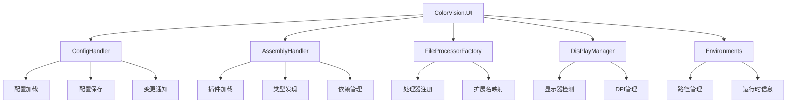

# ColorVision.UI

## 目录
1. [概述](#概述)
2. [核心功能](#核心功能)
3. [架构设计](#架构设计)
4. [主要组件](#主要组件)
5. [使用示例](#使用示例)
6. [扩展机制](#扩展机制)
7. [最佳实践](#最佳实践)

## 概述

**ColorVision.UI** 是 ColorVision 系统的底层控件库和框架支持，提供丰富的 UI 组件、系统功能和基础设施。它是整个应用程序 UI 层的基础，包含配置系统、程序集管理、文件处理器工厂等核心功能。

### 基本信息

- **主要功能**: 底层UI控件、系统管理、框架支持
- **UI 框架**: WPF
- **特色功能**: 配置管理、程序集加载、文件处理、显示管理
- **版本**: 1.5.1.1
- **目标框架**: .NET 8.0 / .NET 10.0

## 核心功能

### 1. 配置管理 (ConfigHandler)
- **配置中心** - 统一的配置管理和持久化
- **自动加载** - 应用程序启动时自动加载配置
- **变更通知** - 配置变更事件通知机制
- **多环境支持** - 支持开发、测试、生产环境配置

### 2. 程序集管理 (AssemblyHandler)
- **动态加载** - 插件程序集的动态加载和卸载
- **类型发现** - 自动发现和注册类型
- **依赖管理** - 程序集依赖关系管理
- **版本控制** - 程序集版本兼容性检查

### 3. 文件处理工厂 (FileProcessorFactory)
- **处理器注册** - 文件处理器的注册和管理
- **扩展名映射** - 根据文件扩展名自动选择处理器
- **工厂模式** - 统一的文件处理接口

### 4. 显示管理 (DisPlayManager)
- **多显示器支持** - 检测和管理多个显示器
- **分辨率适配** - 自动适配不同分辨率
- **DPI 感知** - 高 DPI 显示支持

### 5. 环境管理 (Environments)
- **环境变量** - 应用程序环境变量管理
- **运行时信息** - 获取系统和运行时信息
- **路径管理** - 应用程序路径统一管理

## 架构设计



## 主要组件

### ConfigHandler

配置管理器的核心，负责应用程序配置的加载、保存和变更通知。

```csharp
public class ConfigHandler
{
    public static ConfigHandler Instance { get; }
    
    public T GetSetting<T>(string key, T defaultValue = default);
    public void SetSetting<T>(string key, T value);
    public void Save();
    public void Load();
    
    public event EventHandler<ConfigChangedEventArgs> ConfigChanged;
}
```

### AssemblyHandler

程序集管理器，负责插件的动态加载和类型发现。

```csharp
public class AssemblyHandler
{
    public static AssemblyHandler Instance { get; }
    
    public void LoadAssembly(string assemblyPath);
    public void UnloadAssembly(string assemblyName);
    public IEnumerable<Type> GetTypes();
    public IEnumerable<Type> GetTypes<TInterface>();
    public T CreateInstance<T>(Type type);
    
    public event EventHandler<AssemblyLoadedEventArgs> AssemblyLoaded;
}
```

### FileProcessorFactory

文件处理器工厂，实现文件扩展名到处理器的映射。

```csharp
public class FileProcessorFactory
{
    public static FileProcessorFactory Instance { get; }
    
    public void Register(string extension, Type processorType);
    public void Unregister(string extension);
    public IFileProcessor GetProcessor(string extension);
    
    public IEnumerable<string> SupportedExtensions { get; }
}
```

### DisPlayManager

显示管理器，提供多显示器和 DPI 支持。

```csharp
public class DisPlayManager
{
    public static DisPlayManager Instance { get; }
    
    public DisplayInfo GetPrimaryDisplay();
    public IEnumerable<DisplayInfo> GetAllDisplays();
    public DisplayInfo GetDisplayAt(int x, int y);
    
    public event EventHandler<DisplayChangedEventArgs> DisplayChanged;
}

public class DisplayInfo
{
    public string Name { get; }
    public int X { get; }
    public int Y { get; }
    public int Width { get; }
    public int Height { get; }
    public double DpiScale { get; }
    public bool IsPrimary { get; }
}
```

### Environments

环境管理器，提供应用程序环境信息。

```csharp
public static class Environments
{
    public static string AppPath { get; }
    public static string ConfigPath { get; }
    public static string DataPath { get; }
    public static string LogPath { get; }
    public static string TempPath { get; }
    
    public static Version AppVersion { get; }
    public static string FrameworkVersion { get; }
    public static string OSVersion { get; }
    public static bool Is64Bit { get; }
}
```

## 使用示例

### 1. 配置管理初始化

```csharp
// 应用程序启动时读取配置
ConfigHandler.GetInstance();

// 访问配置
var config = ConfigHandler.Instance;
var setting = config.GetSetting("Key");

// 保存配置
config.SetSetting("Key", "Value");
config.Save();
```

### 2. 程序集管理

```csharp
// 加载插件程序集
AssemblyHandler.Instance.LoadAssembly("Plugin.dll");

// 获取已加载的类型
var types = AssemblyHandler.Instance.GetTypes()
    .Where(t => t.GetCustomAttribute<PluginAttribute>() != null);

// 创建实例
var plugin = AssemblyHandler.Instance.CreateInstance<IPlugin>(type);
```

### 3. 文件处理工厂

```csharp
// 注册文件处理器
FileProcessorFactory.Instance.Register(".txt", typeof(TextFileProcessor));
FileProcessorFactory.Instance.Register(".csv", typeof(CsvFileProcessor));

// 获取处理器并处理文件
var processor = FileProcessorFactory.Instance.GetProcessor(".txt");
processor.Process(filePath);
```

### 4. 显示管理

```csharp
// 获取主显示器信息
var primaryDisplay = DisPlayManager.Instance.GetPrimaryDisplay();
Console.WriteLine($"分辨率: {primaryDisplay.Width}x{primaryDisplay.Height}");
Console.WriteLine($"DPI: {primaryDisplay.DpiScale}");

// 获取所有显示器
var displays = DisPlayManager.Instance.GetAllDisplays();
foreach (var display in displays)
{
    Console.WriteLine($"显示器: {display.Name}");
}
```

### 5. 环境管理

```csharp
// 获取应用程序路径
var appPath = Environments.AppPath;
var configPath = Environments.ConfigPath;
var dataPath = Environments.DataPath;

// 获取运行时信息
var version = Environments.AppVersion;
var framework = Environments.FrameworkVersion;
var osVersion = Environments.OSVersion;
```

## 扩展机制

### 自定义配置提供程序

```csharp
public class CustomConfigProvider : IConfigProvider
{
    public T GetSetting<T>(string key, T defaultValue = default)
    {
        // 自定义配置获取逻辑
    }
    
    public void SetSetting<T>(string key, T value)
    {
        // 自定义配置保存逻辑
    }
}

// 注册提供程序
ConfigHandler.Instance.RegisterProvider(new CustomConfigProvider());
```

### 自定义文件处理器

```csharp
public class CustomFileProcessor : IFileProcessor
{
    public string[] SupportedExtensions => new[] { ".custom" };
    
    public void Process(string filePath)
    {
        // 自定义文件处理逻辑
    }
}

// 注册处理器
FileProcessorFactory.Instance.Register(".custom", typeof(CustomFileProcessor));
```

## 最佳实践

### 1. 配置管理
- 使用强类型配置类包装 ConfigHandler
- 在应用启动时加载配置，退出时保存
- 订阅配置变更事件进行动态响应

### 2. 程序集加载
- 验证程序集签名后再加载
- 使用 AppDomain.AssemblyResolve 处理依赖
- 记录程序集加载日志便于排查问题

### 3. 文件处理
- 处理器实现应是无状态的
- 使用 Try-Catch 处理文件访问异常
- 大文件处理应使用异步模式

### 4. 显示管理
- 监听 DisplayChanged 事件响应显示器变化
- 使用 DPI 感知布局避免模糊
- 支持多显示器间的窗口拖拽

## 相关资源

- [开发者指南](../developer-guide/)
- [配置管理指南](../getting-started/)
