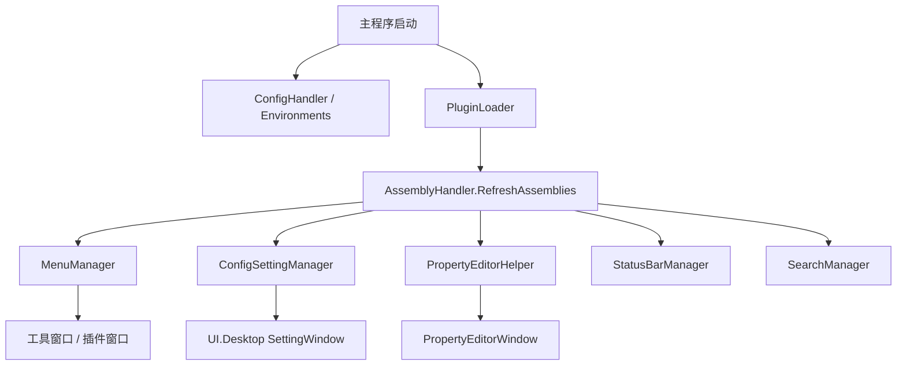

# ColorVision.UI

本页只保留 `UI/ColorVision.UI/` 当前最关键的基础设施和入口类型，不再继续维护旧文档里那种“版本清单 + 全量伪 API + 更新日志”的写法。

## 模块定位

`ColorVision.UI` 不是某一个单独控件，而是桌面应用的大量 UI 基础设施所在位置。它当前承担的角色更接近“UI 壳层和公共服务集合”，主要给主程序、Engine 和其他 UI 子项目复用。

从目录结构看，它覆盖的内容至少包括：

- 配置读写和环境路径
- 插件装载与插件包处理
- 菜单系统
- 属性编辑器
- 快捷键系统
- 多语言资源
- 日志相关 UI 配置
- Shell、搜索、状态栏、页面与通用控件

所以它不是单一“控件库”，也不适合再被写成一个拥有稳定公共 API 面的标准 SDK。

## 当前最关键的目录

如果只是想快速建立认知，建议先看这些目录：

- `Plugins/`：插件发现、元数据、依赖检查、解包与更新
- `PropertyEditor/`：属性编辑窗口、树节点、编辑器类型系统
- `Menus/`：菜单注册和动态菜单刷新
- `HotKey/`：全局和窗口级快捷键
- `Languages/`：语言与资源切换
- `LogImp/`：日志相关配置和窗口状态
- `ConfigSetting/` 与根目录 `ConfigHandler.cs`：配置系统入口
- `Shell/`、`Serach/`、`StatusBar/`：桌面交互辅助能力

## 关键入口类型

### `ConfigHandler`

`ConfigHandler` 是这个项目里最核心的基础设施之一。很多 `IConfig` 配置对象最终都围绕它或相关配置服务完成读取、缓存和保存。

如果问题表现为“设置没保存”“配置没加载”“默认值异常”，通常先看这条链。

### `PluginLoader`

`PluginLoader` 当前负责插件运行时装载。它做的并不只是“扫 DLL”，还包括：

- 扫描 `Plugins/` 目录
- 读取 `manifest.json`
- 解析可选 `.deps.json`
- 检查 `ColorVision.*` 依赖版本
- 最终装载插件程序集

这也是为什么插件相关文档如果只写成“反射扫描插件类型”，通常都会失真。

### `MenuManager`

`MenuManager` 是菜单系统的中心对象。很多动态菜单、最近文件刷新和插件菜单入口，最终都会落到它的注册或刷新链上。

所以这部分更像应用壳层的菜单协调器，而不是一组静态 XAML 菜单定义。

### `PropertyEditor`

`PropertyEditor/` 当前负责属性编辑体验的主链：

- `PropertyEditorWindow`
- `PropertyTreeNode`
- 编辑器类型与辅助类

这一套系统和仓库里大量带 `Category`、`DisplayName`、`Description`、`PropertyEditorType` 这类特性的对象配合使用，是当前动态属性编辑体验的基础。

### `HotKey`

快捷键系统当前不是单点实现，而是分成：

- `GlobalHotKey/`
- `WindowHotKey/`
- `HotKeys` 及其配置与设置窗口

因此改快捷键时，通常要先区分你改的是系统级热键，还是窗口内热键。

### `Languages`

多语言资源和 UI 文化切换相关能力在这里集中管理。主程序启动阶段设置 UI Culture 后，很多界面资源加载都会受这里影响。

### `LogImp`

日志相关的 UI 配置和本地日志窗口状态也放在这个项目里。它更偏“日志显示与配置配套”，不是完整日志后端本身。

## 作为 DLL 使用时

### 应该引用它的场景

- 插件或项目包要注册菜单、状态栏、设置项、热键或属性编辑器。
- 需要通过 `PluginLoader` 装载 `Plugins/<Name>/manifest.json`。
- 需要使用统一配置服务 `ConfigHandler` 或设置聚合 `ConfigSettingManager`。
- 需要使用运行时搜索、日志显示、更新恢复、托盘或跳转列表等桌面壳层服务。

### 常见扩展落点

| 需求 | 优先入口 |
| --- | --- |
| 新增菜单 | `Menus/MenuManager.cs`、`GlobalMenuBase`、`MenuItemBase`、`MenuItemAttribute` |
| 新增设置项 | `ConfigSetting/ConfigSettingManager.cs`、`IConfigSettingProvider` |
| 新增属性编辑器 | `PropertyEditor/PropertyEditors.cs`、`PropertyEditorTypeAttribute` |
| 新增状态栏 | `StatusBar/StatusBarManager.cs`、`IStatusBarProvider` |
| 新增热键 | `HotKey/HotKeys.cs`、`GlobalHotKey/`、`WindowHotKey/` |
| 调整插件装载 | `Plugins/PluginLoader.cs`、`PluginManifest.cs`、`DepsJson.cs` |

### 发布注意

`ColorVision.UI` 是大多数上层 UI 包的枢纽。public 接口、配置文件路径、manifest 字段、菜单 Guid 或属性编辑器 Attribute 的改动，都可能影响插件和项目包运行时发现。改完后至少要跑主程序启动、插件装载和设置窗口。

### DLL 发布验收表

| 验收项 | 要查什么 | 通过标准 |
| --- | --- | --- |
| 目标框架产物 | `net8.0-windows7.0`、`net10.0-windows7.0` | 两个 TFM 都能生成 DLL、`.nupkg`、`.snupkg` |
| 包内 README | `PackageReadmeFile`、包根目录 | `README.md` 随包进入根目录，内容对应当前壳层能力 |
| 包依赖 | `ColorVision.Common`、`ColorVision.Themes`、`log4net`、`Newtonsoft.Json` | 宿主和插件输出目录能解析这些依赖 |
| 配置链 | `ConfigHandler`、`ConfigSettingManager` | 修改设置后保存、重启、重新读取一致 |
| 插件链 | `PluginLoader`、`PluginManifest`、`.deps.json` | 能读取 manifest、README、CHANGELOG，并能报告依赖版本问题 |
| 发现链 | `AssemblyHandler`、`MenuManager`、`StatusBarManager`、`SearchManager` | 插件加载后菜单、状态栏、搜索和属性编辑器能重新发现类型 |
| 属性编辑 | `PropertyEditorWindow`、`PropertyEditorTypeAttribute` | 常见属性类型和自定义编辑器都能打开，失败时有可定位日志 |
| 多语言与资源 | `Languages/`、`Properties/Resources.*.resx` | 切换语言后菜单、设置、日志窗口至少能刷新主要文本 |

## 组件明细与交接验收

这部分按“发一个 `ColorVision.UI.dll` 之后，接手人员到底要看什么”来组织。它和 [UI 组件目录](./control-catalog.md) 的关系是：本节讲本 DLL 内的核心组件验收，组件目录页负责跨 DLL 查入口。

### 运行时组件表

| 组件族 | 关键类/窗口 | 源码入口 | 运行时角色 | 最小验收 |
| --- | --- | --- | --- | --- |
| 配置基础 | `ConfigHandler`、`Environments`、`ConfigSettingManager`、`ConfigServiceAdapters` | `UI/ColorVision.UI/ConfigHandler.cs`、`ConfigSetting/` | 读取、缓存、保存配置，并把配置项聚合到设置窗口 | 修改一个普通配置项，保存后重启仍生效 |
| 插件装载 | `PluginLoader`、`PluginManifest`、`DepsJson`、`PluginExtractor` | `UI/ColorVision.UI/Plugins/` | 扫描 `Plugins/`、读取 manifest、检查 `.deps.json`、加载程序集 | 插件管理器能看到 manifest、README、CHANGELOG，禁用/启用状态正确 |
| 菜单系统 | `MenuManager`、`GlobalMenuBase`、`MenuItemAttribute` | `UI/ColorVision.UI/Menus/` | 扫描 `IMenuItem` / `IMenuItemProvider`，按父子关系和排序组装菜单 | File/Edit/Tool/Help 和插件菜单出现，点击命令有日志或窗口响应 |
| 属性编辑器 | `PropertyEditorWindow`、`PropertyEditorHelper`、`PropertyEditorTypeAttribute` | `UI/ColorVision.UI/PropertyEditor/` | 按属性元数据生成参数编辑界面，创建默认或自定义编辑器 | bool、enum、路径、列表/字典至少各打开一个编辑器 |
| 快捷键 | `HotKeys`、`HotKeysSetting`、`GlobalHotKey/`、`WindowHotKey/` | `UI/ColorVision.UI/HotKey/` | 管理全局热键、窗口热键和快捷键配置 | 打开快捷键设置，修改一个非关键热键并确认冲突检测 |
| 多语言 | `Languages/`、`LanguageConfig`、`LanguagePropertiesEditor` | `UI/ColorVision.UI/Languages/` | 管理文化切换和语言设置编辑 | 切换语言后菜单、设置页和日志窗口文本刷新 |
| 日志 UI | `WindowLog`、`WindowLogLocal`、`LogViewerControl`、`LogViewerAppender` | `UI/ColorVision.UI/LogImp/` | 展示本地日志、日志等级和筛选状态 | 按级别和关键词过滤，能定位最新 Error/Warn |
| 状态栏 | `StatusBarManager`、`StatusBarControl` | `UI/ColorVision.UI/StatusBar/` | 扫描状态栏 Provider 并刷新主窗口状态 | Socket、Scheduler 或数据库状态项能显示并响应点击 |
| 搜索 | `SearchManager`、`SearchControl`、`MenuSearchProvider` | `UI/ColorVision.UI/Serach/` | 聚合搜索 Provider，给主窗口快速入口 | 搜索一个菜单名或窗口名能打开对应入口 |
| Shell 辅助 | `JumpListManager`、`TrayIconManager`、`ArgumentParser` | `UI/ColorVision.UI/Shell/` | Windows 跳转列表、托盘、命令行参数辅助 | 托盘/跳转列表不影响主程序启动，命令行参数可解析 |
| 程序集发现 | `AssemblyHandler`、`FileProcessorFactory` | `UI/ColorVision.UI/` | 刷新可扫描程序集和文件处理器 | 插件加载后菜单、设置、状态栏、ImageEditor 工具能被发现 |

### 运行时发现链

```mermaid
flowchart TD
  Start["主程序启动"] --> Config["ConfigHandler / Environments"]
  Start --> Plugins["PluginLoader"]
  Plugins --> Assemblies["AssemblyHandler.RefreshAssemblies"]
  Assemblies --> Menus["MenuManager"]
  Assemblies --> Settings["ConfigSettingManager"]
  Assemblies --> PropertyEditors["PropertyEditorHelper"]
  Assemblies --> Status["StatusBarManager"]
  Assemblies --> Search["SearchManager"]
  Menus --> Windows["工具窗口 / 插件窗口"]
  Settings --> SettingWindow["UI.Desktop SettingWindow"]
  PropertyEditors --> PropertyGrid["PropertyEditorWindow"]
```

排查“UI 组件没有出现”时，按这条链从左到右看：先确认插件/程序集是否被加载，再看对应的菜单、设置、属性编辑器或状态栏发现逻辑。不要直接从窗口 XAML 开始找。

### 发布 `ColorVision.UI.dll` 时必须烟测

| 烟测项 | 操作 | 通过标准 |
| --- | --- | --- |
| 主程序启动 | 构建并启动主程序 | 无 `MissingMethodException`、`FileLoadException`、资源加载错误 |
| 插件装载 | 打开插件管理或插件市场 | 插件目录、manifest、README/CHANGELOG 能读取 |
| 菜单刷新 | 打开主菜单和至少一个插件菜单 | 菜单排序、权限过滤、点击命令正常 |
| 设置窗口 | 打开设置，搜索 `theme`、`language` 或日志项 | 设置项能搜索、修改、保存 |
| PropertyGrid | 编辑一个设备/模板/配置对象 | 分类、显示名、描述、编辑器类型正常 |
| 状态栏 | 查看 Socket/Scheduler/Database 状态 | Provider 项出现，刷新不会卡 UI |
| 热键 | 打开快捷键设置 | 全局热键和窗口热键不会重复注册 |
| 日志窗口 | 打开日志，按 Error/Warn 过滤 | 能看到本次启动或点击动作日志 |

### 常见事故和第一检查点

| 现象 | 第一检查点 | 说明 |
| --- | --- | --- |
| 插件目录存在但菜单没有 | `PluginLoader` 是否加载 DLL，`AssemblyHandler` 是否刷新 | 菜单扫描依赖程序集集合，不是目录存在就能发现 |
| 设置项没有出现 | `IConfigSettingProvider` 或 `[ConfigSetting]` 是否可扫描 | 类型不在程序集、构造失败、标注位置错误都会隐藏设置 |
| 属性编辑器显示为纯文本 | `PropertyEditorTypeAttribute` 和 `PropertyEditorHelper` | 自定义编辑器创建失败会导致体验退化 |
| 菜单点击无响应 | `CanExecute`、权限、目标窗口初始化日志 | 菜单树存在不等于命令能执行 |
| 状态栏项不刷新 | `IStatusBarProviderUpdatable`、刷新定时器、主窗口绑定 | Provider 已创建但未触发更新也会像“没有状态” |
| 语言切换后部分文本不变 | 资源键、绑定方式、窗口是否重新加载 | 有些窗口需要重建或重新绑定资源 |
| 插件依赖版本报错 | `.deps.json`、主程序目录 `ColorVision.*.dll` 版本 | 插件目录 DLL 和主程序根目录 DLL 可能不是同一批 |

## 现场首查

现场替换或发布 `ColorVision.UI.dll` 后，如果主程序能启动但 UI 壳层行为异常，先按下表排查。这里的目标是快速判断问题属于 DLL 版本、程序集发现、配置持久化、运行时 Provider，还是上层窗口本身。

| 现象 | 先查 | 判断标准 |
| --- | --- | --- |
| 新 DLL 放进去后主程序启动异常 | 主程序目录的 `ColorVision.UI.dll`、`ColorVision.Common.dll`、`ColorVision.Themes.dll` 版本 | 三个基础 DLL 来自同一批构建，没有 `FileLoadException` 或 `MissingMethodException` |
| 插件显示已装载但菜单不出现 | `PluginLoader` 日志、`AssemblyHandler.RefreshAssemblies`、`MenuManager` 扫描结果 | 插件程序集在扫描集合里，菜单项类型能被创建 |
| 设置窗口缺少某个设置项 | `ConfigSettingManager`、`IConfigSettingProvider`、`[ConfigSetting]` 标注 | Provider 构造没有异常，配置对象能从 `ConfigService` 取到 |
| 设置修改后重启丢失 | `ConfigHandler` 保存路径、JSON 序列化、配置文件权限 | 保存文件更新时间变化，重启后读取同一配置文件 |
| PropertyGrid 自定义编辑器打不开 | `PropertyEditorTypeAttribute`、编辑器构造函数、属性类型 | 自定义编辑器能实例化；失败时日志指向具体属性或编辑器类型 |
| 状态栏项存在但不刷新 | `StatusBarManager`、`IStatusBarProviderUpdatable`、刷新事件 | Provider 已创建，并能触发 `ItemsChanged` 或更新回调 |
| 快捷键设置保存后无效 | `HotkeyService`、`HotKeyConfig.Instance.Hotkeys`、全局/窗口级注册 | 保存后的热键重新应用到运行时，冲突项被识别 |
| 语言切换后菜单和设置不一致 | `LanguageManager`、资源键、窗口是否需要重建 | 新建窗口显示新语言；旧窗口若不刷新，需要确认绑定方式 |
| 搜索找不到菜单或窗口 | `SearchManager`、`MenuSearchProvider`、菜单是否已扫描 | 菜单存在后搜索索引能返回对应入口 |
| 插件依赖版本提示混乱 | 插件 `.deps.json`、主程序根目录 DLL、插件目录私有 DLL | 依赖检查指向宿主实际加载版本，不只看插件目录文件 |

## 这个项目当前最容易被写错的地方

### 它不是单一控件库

旧文档喜欢把 `ColorVision.UI` 写成“核心 UI 控件包”。当前代码远比这复杂，它同时承接插件、配置、菜单、快捷键、属性编辑和多语言等横切能力。

### 插件系统不等于扩展点定义本身

`PluginLoader` 位于这里，但插件真正扩展到什么能力，仍取决于各插件程序集和被实现的菜单、模板、服务、结果视图接口。

### 权限不应在这页被泛化为“全局 RBAC 中心”

当前全局粗粒度权限来自 `Authorization.Instance.PermissionMode`，而更细的本地 RBAC 子系统主要位于 `UI/ColorVision.Solution/Rbac/`。`ColorVision.UI` 提供的是授权基础设施和公共依赖，不应该在这里继续写成完整权限平台。

## 当前更适合怎样读这个项目

### 想看配置和全局服务

先看：

- `ConfigHandler.cs`
- `Environments.cs`
- `FileProcessorFactory.cs`

### 想看插件运行时

先看：

- `Plugins/PluginLoader.cs`
- `Plugins/PluginManifest.cs`
- `Plugins/PluginInfo.cs`

### 想看属性编辑体系

先看：

- `PropertyEditor/PropertyEditorWindow.xaml(.cs)`
- `PropertyEditor/PropertyTreeNode.cs`
- `PropertyEditor/PropertyEditors.cs`

### 想看菜单和快捷键

先看：

- `Menus/MenuManager.cs`
- `HotKey/HotKeys.cs`
- `HotKey/GlobalHotKey/`
- `HotKey/WindowHotKey/`

## 这页不再做什么

本页不再继续维护这些高风险内容：

- 过时版本号和目标框架清单
- 大段未经核实的类成员伪代码
- 把 `ColorVision.UI` 说成稳定公共 SDK
- 把权限、插件、日志等横切能力都讲成各自完整平台

如果后续要补某个子系统，应直接落到对应专题页，而不是在这里继续堆“大而全”说明。

## 继续阅读

- [UI组件概览](./README.md)
- [ColorVision.Solution](./ColorVision.Solution.md)
- [安全与权限控制](../../03-architecture/security/overview.md)
