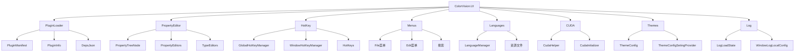

# ColorVision.UI

## 目录
1. [概述](#概述)
2. [核心功能](#核心功能)
3. [架构设计](#架构设计)
4. [主要组件](#主要组件)
5. [使用示例](#使用示例)
6. [扩展机制](#扩展机制)
7. [最佳实践](#最佳实践)

## 概述

**ColorVision.UI** 是 ColorVision 系统的核心UI控件库和框架支持，提供丰富的 UI 组件、系统功能和基础设施。它是整个应用程序 UI 层的基础，包含插件系统、属性编辑器、快捷键系统、菜单管理、搜索功能、多语言支持等核心功能。

### 基本信息

- **主要功能**: 核心UI控件、插件系统、属性编辑器、快捷键管理、菜单系统
- **UI 框架**: WPF
- **特色功能**: 插件加载、属性编辑、全局快捷键、多语言、CUDA支持
- **版本**: 1.5.1.1
- **目标框架**: .NET 8.0 / .NET 10.0

## 核心功能

### 1. 插件系统 (PluginLoader)
- **动态加载** - 从 Plugins 目录自动扫描和加载插件
- **Manifest 支持** - 基于 manifest.json 的插件元数据管理
- **依赖检查** - 自动验证插件依赖的 ColorVision 组件版本
- **版本控制** - 支持插件版本管理和更新
- **启用/禁用** - 动态启用或禁用插件

### 2. 属性编辑器 (PropertyEditor)
- **树形结构** - PropertyTreeNode 支持层次化属性展示
- **类型编辑器** - 支持多种类型的属性编辑器（布尔、枚举、字符串、数字等）
- **动态属性** - 支持运行时动态添加和移除属性
- **自定义编辑器** - 可扩展的自定义属性编辑器机制
- **可见性控制** - 支持属性的条件显示和隐藏

### 3. 快捷键系统 (HotKey)
- **全局快捷键** - GlobalHotKeyManager 支持系统级快捷键
- **窗口快捷键** - WindowHotKeyManager 支持窗口级快捷键
- **动态注册** - 运行时动态注册和修改快捷键
- **冲突检测** - 自动检测快捷键冲突
- **持久化** - 快捷键配置保存和加载

### 4. 菜单系统 (Menus)
- **基础菜单** - 提供标准的文件、编辑菜单（打开、保存、复制、粘贴等）
- **动态菜单** - 支持运行时动态添加和修改菜单项
- **菜单搜索** - MenuSearchProvider 支持菜单项搜索
- **命令绑定** - 与 WPF 命令系统集成

### 5. 多语言支持 (LanguageManager)
- **资源文件** - 基于 .resx 的资源文件本地化
- **动态切换** - 运行时切换界面语言
- **自动加载** - 自动加载对应语言的资源
- **扩展支持** - 支持插件的多语言资源

### 6. CUDA 支持 (CudaHelper)
- **设备检测** - 自动检测 NVIDIA CUDA 设备
- **初始化管理** - CudaInitializer 管理 CUDA 环境初始化
- **系统信息** - SystemHelper 提供 CUDA 相关的系统信息

### 7. 主题配置 (ThemeConfig)
- **配置管理** - ThemeConfig 管理主题设置
- **动态切换** - 支持运行时主题切换
- **配置提供者** - ThemeConfigSetingProvider 集成配置系统

### 8. 日志系统 (LogImp)
- **日志状态** - LogLoadState 管理日志加载状态
- **本地配置** - WindowLogLocalConfig 窗口日志本地配置
- **常量定义** - LogConstants 日志相关常量

## 架构设计


```mermaid
graph TD
    A[ColorVision.UI] --> B[PluginLoader]
    A --> C[PropertyEditor]
    A --> D[HotKey]
    A --> E[Menus]
    A --> F[Languages]
    A --> G[CUDA]
    A --> H[Themes]
    A --> I[Log]
    
    B --> B1[PluginManifest]
    B --> B2[PluginInfo]
    B --> B3[DepsJson]
    
    C --> C1[PropertyTreeNode]
    C --> C2[PropertyEditors]
    C --> C3[TypeEditors]
    
    D --> D1[GlobalHotKeyManager]
    D --> D2[WindowHotKeyManager]
    D --> D3[HotKeys]
    
    E --> E1[File菜单]
    E --> E2[Edit菜单]
    E --> E3[搜索]
    
    F --> F1[LanguageManager]
    F --> F2[资源文件]
    
    G --> G1[CudaHelper]
    G --> G2[CudaInitializer]
    
    H --> H1[ThemeConfig]
    H --> H2[ThemeConfigSetingProvider]
    
    I --> I1[LogLoadState]
    I --> I2[WindowLogLocalConfig]
```

## 主要组件

### PluginLoader

插件加载器负责从 Plugins 目录扫描、验证和加载插件。

```csharp
public static class PluginLoader
{
    public static PluginLoaderrConfig Config => PluginLoaderrConfig.Instance;
    
    // 从默认路径加载插件
    public static void LoadPlugins()
    
    // 从指定路径加载插件
    public static void LoadPlugins(string path)
}
```

**插件目录结构:**
```
Plugins/
├── PluginName/
│   ├── manifest.json      # 插件元数据
│   ├── PluginName.dll     # 插件程序集
│   └── PluginName.deps.json # 依赖信息
```

**manifest.json 示例:**
```json
{
  "id": "com.example.myplugin",
  "name": "My Plugin",
  "description": "Plugin description",
  "version": "1.0.0",
  "dllName": "MyPlugin.dll",
  "author": "Author Name"
}
```

### PluginManifest

插件清单类，定义插件的元数据信息。

```csharp
public class PluginManifest
{
    public string Id { get; set; }
    public string Name { get; set; }
    public string Description { get; set; }
    public string Version { get; set; }
    public string DllName { get; set; }
    public string Author { get; set; }
}
```

### PluginInfo

插件信息类，包含插件的运行时信息。

```csharp
public class PluginInfo
{
    public PluginManifest Manifest { get; set; }
    public Assembly Assembly { get; set; }
    public DepsJson DepsJson { get; set; }
    public bool Enabled { get; set; }
    public string Name { get; set; }
    public string Description { get; set; }
    public string AssemblyName { get; set; }
    public Version AssemblyVersion { get; set; }
    public DateTime AssemblyBuildDate { get; set; }
    public string AssemblyPath { get; set; }
    public string AssemblyCulture { get; set; }
    public string AssemblyPublicKeyToken { get; set; }
}
```

### PropertyTreeNode

属性树节点，用于 PropertyEditorWindow 的树形绑定。

```csharp
public class PropertyTreeNode : ViewModelBase
{
    public string Header { get; set; }
    public StackPanel AssociatedBorder { get; set; }
    public bool IsVisible { get; set; }
    public bool IsExpanded { get; set; }
    public bool IsSelected { get; set; }
    public Visibility Visibility { get; }
    public ObservableCollection<PropertyTreeNode> Children { get; }
    public ContextMenu ContextMenu { get; set; }
    
    public PropertyTreeNode(string header, StackPanel associatedPanel = null)
    
    // 递归显示所有节点
    public void ShowAll()
    
    // 从关联边框同步可见性
    public void SyncVisibilityFromBorder()
}
```

### HotKeys

快捷键定义类，支持全局和窗口级快捷键。

```csharp
[Serializable]
public class HotKeys : INotifyPropertyChanged
{
    public static ObservableCollection<HotKeys> HotKeysList { get; }
    public static Dictionary<HotKeys, Hotkey> HotKeysDefaultHotkey { get; }
    
    public string Name { get; set; }
    public Hotkey Hotkey { get; set; }
    public HotKeyKinds Kinds { get; set; }  // Global / Windows
    public bool IsGlobal { get; set; }
    public bool IsRegistered { get; }
    public Control Control { get; set; }
    public HotKeyCallBackHanlder HotKeyHandler { get; set; }
    
    // 重置为默认快捷键
    public static void SetDefault()
}
```

### GlobalHotKeyManager

全局快捷键管理器，支持系统级快捷键注册。

```csharp
public class GlobalHotKeyManager
{
    public static GlobalHotKeyManager GetInstance(Window window)
    
    // 注册快捷键
    public bool Register(HotKeys hotKeys)
    
    // 注销快捷键
    public void UnRegister(HotKeys hotKeys)
    
    // 修改快捷键
    public bool ModifiedHotkey(HotKeys hotKeys)
}
```

### WindowHotKeyManager

窗口快捷键管理器，支持窗口级快捷键注册。

```csharp
public class WindowHotKeyManager
{
    public static WindowHotKeyManager GetInstance(Control control)
    
    // 注册快捷键
    public bool Register(HotKeys hotKeys)
    
    // 注销快捷键
    public void UnRegister(HotKeys hotKeys)
    
    // 修改快捷键
    public bool ModifiedHotkey(HotKeys hotKeys)
}
```

### LanguageManager

多语言管理器，支持运行时语言切换。

```csharp
public class LanguageManager
{
    public static LanguageManager Current { get; }
    
    // 当前语言代码
    public string CurrentLanguage { get; set; }
    
    // 切换语言
    public void ChangeLanguage(string languageCode)
    
    // 获取资源字符串
    public string GetString(string key)
}
```

### CudaHelper

CUDA 帮助类，提供 CUDA 设备检测和信息查询。

```csharp
public static class CudaHelper
{
    // 检查 CUDA 是否可用
    public static bool IsCudaAvailable()
    
    // 获取 CUDA 设备数量
    public static int GetDeviceCount()
    
    // 获取 CUDA 设备信息
    public static CudaDeviceInfo GetDeviceInfo(int deviceId)
}
```

### ThemeConfig

主题配置类，管理应用程序主题设置。

```csharp
public class ThemeConfig : IConfig
{
    public static ThemeConfig Instance => ConfigService.Instance.GetRequiredService<ThemeConfig>()
    
    // 当前主题
    public ThemeType Theme { get; set; }
    
    // 是否跟随系统主题
    public bool FollowSystem { get; set; }
}
```

## 使用示例

### 1. 插件开发

```csharp
// 创建插件类
public class MyPlugin : IPlugin
{
    public string Header => "我的插件";
    public string Description => "这是一个示例插件";
    
    public void Execute()
    {
        // 插件执行逻辑
        MessageBox.Show("插件已执行！");
    }
}

// 或者使用基类
public class MyPluginBase : IPluginBase
{
    public MyPluginBase()
    {
        Header = "我的插件";
        Description = "使用基类的插件";
    }
    
    public override void Execute()
    {
        // 自定义执行逻辑
        base.Execute();
    }
}
```

### 2. 属性编辑器使用

```csharp
// 创建属性树节点
var rootNode = new PropertyTreeNode("根节点");
var childNode = new PropertyTreeNode("子节点");
rootNode.Children.Add(childNode);

// 设置可见性
childNode.IsVisible = false;

// 同步可见性
childNode.SyncVisibilityFromBorder();

// 显示所有节点
rootNode.ShowAll();
```

### 3. 快捷键注册

```csharp
// 创建全局快捷键
var hotKey = new HotKeys(
    "全局保存",
    new Hotkey { Key = Key.S, Modifiers = ModifierKeys.Control },
    () => { SaveDocument(); }
);
hotKey.Kinds = HotKeyKinds.Global;

// 创建窗口快捷键
var windowHotKey = new HotKeys(
    "窗口刷新",
    new Hotkey { Key = Key.F5, Modifiers = ModifierKeys.None },
    () => { RefreshView(); }
);
windowHotKey.Kinds = HotKeyKinds.Windows;
windowHotKey.Control = myControl;

// 注册快捷键
GlobalHotKeyManager.GetInstance(mainWindow).Register(hotKey);
WindowHotKeyManager.GetInstance(myControl).Register(windowHotKey);

// 重置为默认快捷键
HotKeys.SetDefault();
```

### 4. 多语言切换

```csharp
// 切换语言
LanguageManager.Current.ChangeLanguage("en");

// 获取资源字符串
var message = LanguageManager.Current.GetString("SaveSuccess");
```

### 5. CUDA 检测

```csharp
// 检查 CUDA 是否可用
if (CudaHelper.IsCudaAvailable())
{
    var deviceCount = CudaHelper.GetDeviceCount();
    Console.WriteLine($"检测到 {deviceCount} 个 CUDA 设备");
    
    for (int i = 0; i < deviceCount; i++)
    {
        var info = CudaHelper.GetDeviceInfo(i);
        Console.WriteLine($"设备 {i}: {info.Name}");
    }
}
```

### 6. 主题配置

```csharp
// 设置主题
ThemeConfig.Instance.Theme = ThemeType.Dark;
ThemeConfig.Instance.Save();

// 应用主题
Application.Current.ApplyTheme(ThemeConfig.Instance.Theme);
```

## 扩展机制

### 自定义属性编辑器

```csharp
// 创建自定义属性编辑器特性
public class CustomPropertyEditorAttribute : PropertyEditorTypeAttribute
{
    public override Control CreateEditor(PropertyInfo property)
    {
        // 创建自定义编辑器控件
        return new CustomEditorControl();
    }
}

// 应用到属性
public class MyConfig
{
    [CustomPropertyEditor]
    public string CustomProperty { get; set; }
}
```

### 自定义菜单项

```csharp
// 实现 IMenuItem 接口
public class CustomMenuItem : IMenuItem
{
    public string Name => "CustomMenu";
    public string Header => "自定义菜单";
    public object Icon => new Image { Source = "/Icons/custom.png" };
    public ICommand Command { get; set; }
    public IList<IMenuItem> Children { get; } = new List<IMenuItem>();
}
```

## 最佳实践

### 1. 插件开发
- 始终包含 manifest.json 文件
- 使用语义化版本号
- 正确处理依赖关系
- 避免循环依赖

### 2. 快捷键使用
- 避免与系统快捷键冲突
- 提供快捷键配置界面
- 支持快捷键重置功能
- 正确处理快捷键注销

### 3. 多语言支持
- 使用资源文件管理字符串
- 提供默认语言回退
- 支持动态语言切换
- 测试所有支持的语言

### 4. 属性编辑
- 使用类型安全的属性绑定
- 提供属性验证机制
- 支持属性的条件显示
- 优化大数据量的渲染性能

### 5. CUDA 使用
- 在使用前检查 CUDA 可用性
- 正确处理 CUDA 初始化失败
- 提供非 CUDA 的备选方案
- 优化 GPU 内存使用

## 多语言支持

ColorVision.UI 内置多语言国际化支持，通过 `.resx` 资源文件实现：

| 语言 | 资源文件 | 说明 |
|------|----------|------|
| 默认（简体中文） | Resources.resx | 默认语言 |
| English | Resources.en.resx | 英语 |
| Français | Resources.fr.resx | 法语 |
| 日本語 | Resources.ja.resx | 日语 |
| 한국어 | Resources.ko.resx | 韩语 |
| Русский | Resources.ru.resx | 俄语 |
| 繁體中文 | Resources.zh-Hant.resx | 繁体中文 |

## 更新日志

### v1.5.1.1（2026-02）
- ✅ 升级目标框架至 .NET 8.0 / .NET 10.0
- ✅ 新增法语（Français）语言支持
- ✅ 新增俄语（Русский）语言支持
- ✅ 属性编辑控件支持 byte 类型的编辑和显示
- ✅ PropertyGrid 动态属性编辑器增强
- ✅ 插件依赖版本检查优化
- ✅ 全局/窗口快捷键系统重构

### v1.4.x
- 菜单管理增强
- 算法管理窗口
- 配置管理优化

### v1.3.x 及更早
- 基础配置管理
- 程序集加载
- 文件处理器工厂
- 显示管理

## 相关资源

- [开发者指南](../developer-guide/)
- [配置管理指南](../getting-started/)
- [ColorVision.UI.Desktop 文档](./ColorVision.UI.Desktop.md)
- [ColorVision.Common 文档](./ColorVision.Common.md)
