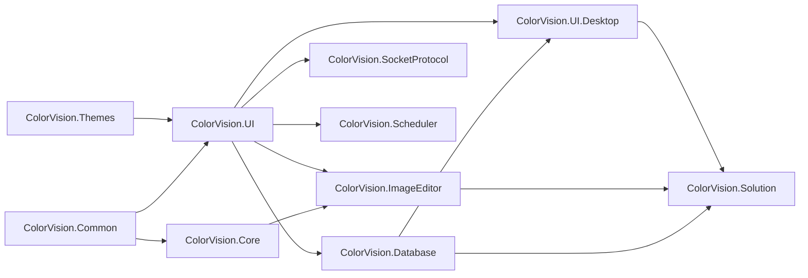

# UI 组件与 DLL 发布

`UI/` 目录是一组可独立构建和发布的 WPF 类库。交接时不要只把它理解成主程序内部源码，因为多数项目已经启用 `GeneratePackageOnBuild`，会在构建时生成 DLL、`.nupkg` 和 `.snupkg`。

## 先看发布规则

- 全局版本、签名、作者、仓库地址等公共属性来自根目录 `Directory.Build.props`。
- 如果根目录存在 `ColorVision.snk`，构建时会启用强名称签名；缺失时自动关闭签名。
- UI 包默认面向 Windows WPF，主流目标是 `net8.0-windows7.0` 和 `net10.0-windows7.0`。
- 每个包的 README 通常通过 `<PackageReadmeFile>README.md</PackageReadmeFile>` 和 `<Pack>true</Pack>` 进入 NuGet 包。
- `ColorVision.Core` 和 `ColorVision.ImageEditor` 这类图像模块会额外携带 native/runtime 资源，发布时必须检查 `runtimes/win-x64/native`。
- Engine 在源码存在时优先使用 `ProjectReference`；部分 UI 模块源码不存在时会通过 `ColorVision.*` 包引用兜底。

实际发版或现场替换 DLL 时，先用 [当前 UI DLL 文档覆盖清单](./current-ui-dll-coverage.md) 确认模块和文档没有缺口，再看 [UI DLL 发布场景手册](./ui-dll-release-playbook.md)，并按 [UI DLL 发布手册](./publishing.md) 执行命令和抽检。

## 先看组件说明

如果你是接手 UI 代码，先读 [当前 UI DLL 文档覆盖清单](./current-ui-dll-coverage.md)，确认当前 10 个 UI 项目和对应文档页；再读 [UI DLL 组件手册](./component-handbook.md)。组件手册按发布 DLL 解释每个组件的职责、依赖、入口类、典型使用方式和发布注意事项。

如果你要排查菜单不出现、设置项不显示、插件加载后没有入口、ImageEditor 工具栏缺失、Socket/调度窗口异常，先看 [UI 运行时组件交接手册](./ui-runtime-handoff.md)。它按运行时发现机制说明这些 UI 子系统如何串起来。

如果你负责发版、替换 DLL、检查 `.nupkg` 内容或排查现场缺 DLL，先看 [UI DLL 发布场景手册](./ui-dll-release-playbook.md)，再看 [UI DLL 发布矩阵](./release-matrix.md)。场景手册回答“这类发布怎么做”，发布矩阵回答“每个 DLL 要查什么”。交付记录和现场替换证据按 [UI DLL 发布证据与现场核查表](./dll-release-evidence.md) 留档。

如果你已经知道自己要改的是菜单、PropertyGrid、图像工具、数据库窗口、Socket 窗口、Solution 工作区或某个具体控件，则直接看 [UI 组件目录](./control-catalog.md)。它按组件类型列出真实源码入口。

单个组件的详细页也都在本目录下：

- [当前 UI DLL 文档覆盖清单](./current-ui-dll-coverage.md)
- [UI 组件目录](./control-catalog.md)
- [UI 运行时组件交接手册](./ui-runtime-handoff.md)
- [UI DLL 发布场景手册](./ui-dll-release-playbook.md)
- [UI DLL 发布矩阵](./release-matrix.md)
- [UI DLL 发布证据与现场核查表](./dll-release-evidence.md)
- [ColorVision.Common](./ColorVision.Common.md)
- [ColorVision.Themes](./ColorVision.Themes.md)
- [ColorVision.UI](./ColorVision.UI.md)
- [ColorVision.Core](./ColorVision.Core.md)
- [ColorVision.Database](./ColorVision.Database.md)
- [ColorVision.SocketProtocol](./ColorVision.SocketProtocol.md)
- [ColorVision.Scheduler](./ColorVision.Scheduler.md)
- [ColorVision.ImageEditor](./ColorVision.ImageEditor.md)
- [ColorVision.UI.Desktop](./ColorVision.UI.Desktop.md)
- [ColorVision.Solution](./ColorVision.Solution.md)

## UI 包清单

| 模块 | 当前版本 | 目标框架 | 发布形态 | 主要职责 |
| --- | --- | --- | --- | --- |
| [ColorVision.Common](./ColorVision.Common.md) | `1.5.5.2` | net8/net10 Windows | DLL + NuGet | MVVM、插件接口、状态栏、共享接口 |
| [ColorVision.Themes](./ColorVision.Themes.md) | `1.5.5.3` | net8/net10 Windows | DLL + NuGet | 主题、资源字典、窗口外观 |
| [ColorVision.UI](./ColorVision.UI.md) | `1.5.5.3` | net8/net10 Windows | DLL + NuGet | 配置、菜单、插件、属性编辑器、快捷键 |
| [ColorVision.Core](./ColorVision.Core.md) | `1.5.5.2` | net8/net10 Windows | DLL + NuGet + native runtime | OpenCV helper、`HImage`、视频/图像互操作 |
| [ColorVision.Database](./ColorVision.Database.md) | `1.5.5.3` | net8/net10 Windows | DLL + NuGet | SqlSugar DAO、数据库浏览器、MySQL/SQLite 接入 |
| [ColorVision.SocketProtocol](./ColorVision.SocketProtocol.md) | `1.5.5.2` | net8/net10 Windows | DLL + NuGet | 本地 TCP 服务、JSON/Text 分发、消息历史 |
| [ColorVision.Scheduler](./ColorVision.Scheduler.md) | `1.5.5.2` | net8/net10 Windows | DLL + NuGet | Quartz 调度、任务历史、管理窗口 |
| [ColorVision.ImageEditor](./ColorVision.ImageEditor.md) | `1.5.5.5` | net10 Windows | DLL + NuGet + 资源 | 图像查看、绘制、结果 overlay、3D/CIE |
| [ColorVision.UI.Desktop](./ColorVision.UI.Desktop.md) | `1.5.5.3` | net10 Windows | WinExe + NuGet | 设置、向导、插件市场、桌面工具 |
| [ColorVision.Solution](./ColorVision.Solution.md) | `1.5.5.2` | net10 Windows | DLL + NuGet | 工作区、编辑器、终端、RBAC、本地项目管理 |

## 依赖方向

交接时重点看依赖方向，不要在底层包里反向引用高层窗口或项目业务。

## 发布检查清单

| 检查项 | 应该确认什么 |
| --- | --- |
| 目标框架 | 是否和宿主、Engine、插件目标框架一致 |
| 强名称 | `ColorVision.snk` 存在时不要关闭签名 |
| README | 包内 README 是否对应当前模块功能 |
| native runtime | `ColorVision.Core`、`ImageEditor` 是否携带必须的 native DLL |
| 资源文件 | XAML Resource、图片、CSS、工具 exe 是否设置正确的 `Pack` / `CopyToOutputDirectory` |
| 版本号 | `.csproj` 的 `VersionPrefix` 是否和发布记录一致 |
| 包引用回退 | Engine 的 `ColorVision.*` 包版本是否能满足 `UIProjectPackageVersion` |

## 继续阅读

- [当前 UI DLL 文档覆盖清单](./current-ui-dll-coverage.md)
- [UI DLL 发布手册](./publishing.md)
- [UI 运行时组件交接手册](./ui-runtime-handoff.md)
- [UI DLL 发布场景手册](./ui-dll-release-playbook.md)
- [UI DLL 发布矩阵](./release-matrix.md)
- [UI DLL 发布证据与现场核查表](./dll-release-evidence.md)
- [模块与文档对照表](../../05-resources/project-structure/module-documentation-map.md)
- [Engine 组件与业务交接](../engine-components/README.md)
