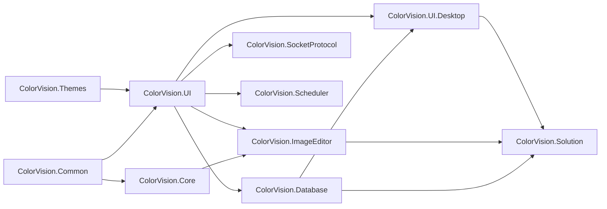

# UI 组件

`UI/` 目录是一组 WPF 类库和桌面基础设施。这里说明各模块职责、依赖方向、发布入口和源码参考。

## UI 包清单

| 模块 | 主要职责 | 文档 |
| --- | --- | --- |
| ColorVision.Common | MVVM、插件接口、状态栏、共享接口 | [ColorVision.Common](./ColorVision.Common.md) |
| ColorVision.Themes | 主题、资源字典、窗口外观 | [ColorVision.Themes](./ColorVision.Themes.md) |
| ColorVision.UI | 配置、菜单、插件、属性编辑器、快捷键 | [ColorVision.UI](./ColorVision.UI.md) |
| ColorVision.Core | OpenCV helper、`HImage`、视频/图像互操作 | [ColorVision.Core](./ColorVision.Core.md) |
| ColorVision.Database | SqlSugar DAO、数据库浏览器、MySQL/SQLite 接入 | [ColorVision.Database](./ColorVision.Database.md) |
| ColorVision.SocketProtocol | 本地 TCP 服务、JSON/Text 分发、消息历史 | [ColorVision.SocketProtocol](./ColorVision.SocketProtocol.md) |
| ColorVision.Scheduler | Quartz 调度、任务历史、管理窗口 | [ColorVision.Scheduler](./ColorVision.Scheduler.md) |
| ColorVision.ImageEditor | 图像查看、绘制、结果 overlay、3D/CIE | [ColorVision.ImageEditor](./ColorVision.ImageEditor.md) |
| ColorVision.UI.Desktop | 设置、向导、插件市场、桌面工具 | [ColorVision.UI.Desktop](./ColorVision.UI.Desktop.md) |
| ColorVision.Solution | 工作区、编辑器、终端、RBAC、本地项目管理 | [ColorVision.Solution](./ColorVision.Solution.md) |

## 维护入口

| 任务 | 入口 |
| --- | --- |
| 查控件、菜单、PropertyGrid、ImageEditor 工具源码 | [UI 组件目录](./control-catalog.md) |
| 理解运行时菜单、设置、插件加载和工具发现 | [UI 运行时组件](./ui-runtime-handoff.md) |
| 发布 DLL 或 NuGet 包 | [UI DLL 发布](./publishing.md) |
| 查 DLL 边界和修改归属 | [UI DLL 速查](./component-handbook.md) |

## 依赖方向

维护时重点看依赖方向，不要在底层包里反向引用高层窗口或项目业务。
