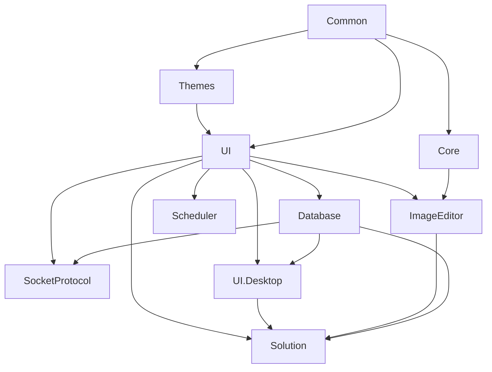

# UI DLL 速查

本页只做 DLL 边界速查：哪个包负责什么、修改时先看哪里、发布前要检查什么。每个 DLL 的细节已经放在单独模块页，不在这里重复展开。

## 先怎么选

| 你要处理的事 | 先看 |
| --- | --- |
| 菜单、配置、状态栏、插件加载、属性编辑器 | `ColorVision.UI` |
| ViewModel、命令、共享接口、权限基础对象 | `ColorVision.Common` |
| 主题资源、窗口基类、通用控件外观 | `ColorVision.Themes` |
| OpenCV/native 图像桥接、`HImage`、位图转换 | `ColorVision.Core` |
| DAO、MySQL/SQLite、数据库浏览器 | `ColorVision.Database` |
| 本机 TCP server、JSON/Text 消息、Socket 历史 | `ColorVision.SocketProtocol` |
| Quartz 定时任务、任务历史、任务窗口 | `ColorVision.Scheduler` |
| 图像查看、overlay、绘图工具、伪彩、CIE、3D | `ColorVision.ImageEditor` |
| 设置窗口、向导、插件市场、下载和诊断工具 | `ColorVision.UI.Desktop` |
| `.cvsln` 工作区、文件树、编辑器、终端、RBAC | `ColorVision.Solution` |

如果你按控件、窗口或扩展点查源码，看 [UI 组件目录](./control-catalog.md)。如果你排查运行时发现机制，看 [UI 运行时组件](./ui-runtime-handoff.md)。如果你要发 DLL 或 NuGet 包，看 [UI DLL 发布](./publishing.md)。

## 包边界

| DLL / 包 | 主要职责 | 常见风险 | 详细页 |
| --- | --- | --- | --- |
| `ColorVision.Common.dll` | MVVM 基础、共享接口、初始化器、状态栏契约、权限基础对象、Win32 工具 | 被高层业务反向污染 | [ColorVision.Common](./ColorVision.Common.md) |
| `ColorVision.Themes.dll` | 主题资源字典、窗口基类、标题栏、通用控件 | 资源缺失、主题枚举和实际 XAML 不一致 | [ColorVision.Themes](./ColorVision.Themes.md) |
| `ColorVision.UI.dll` | 配置、菜单、插件装载、属性编辑器、热键、多语言、日志、状态栏 | 插件加载成功不等于菜单/设置/状态栏都注册成功 | [ColorVision.UI](./ColorVision.UI.md) |
| `ColorVision.Core.dll` | `HImage`、OpenCV helper P/Invoke、CUDA/fusion bridge、WPF 位图桥接 | native DLL、x64 runtime 或 OpenCV 依赖漏包 | [ColorVision.Core](./ColorVision.Core.md) |
| `ColorVision.Database.dll` | SqlSugar DAO、MySQL/SQLite 配置、数据库浏览器 Provider | 实体和真实表结构不一致、连接配置错误 | [ColorVision.Database](./ColorVision.Database.md) |
| `ColorVision.SocketProtocol.dll` | TCP server、JSON/Text 分发、消息 SQLite、Socket 管理窗口 | 端口冲突、协议模式错误、Handler 未加载 | [ColorVision.SocketProtocol](./ColorVision.SocketProtocol.md) |
| `ColorVision.Scheduler.dll` | Quartz 调度、任务配置、执行历史、任务管理窗口 | 任务程序集未被发现、Cron/历史库不一致 | [ColorVision.Scheduler](./ColorVision.Scheduler.md) |
| `ColorVision.ImageEditor.dll` | `ImageView`、绘图图元、工具发现、结果 overlay、伪彩、CIE、3D、实时图像 | 工具初始化副作用、overlay 坐标和图像缩放不一致 | [ColorVision.ImageEditor](./ColorVision.ImageEditor.md) |
| `ColorVision.UI.Desktop` | 设置、向导、插件市场、下载器、第三方应用、反馈和诊断窗口 | 被误认为主程序入口；实际主程序仍在 `ColorVision/` | [ColorVision.UI.Desktop](./ColorVision.UI.Desktop.md) |
| `ColorVision.Solution.dll` | 工作区、文件树、编辑器、AvalonDock、终端、本地 RBAC | 把 Engine 流程或客户业务塞进工作区壳层 | [ColorVision.Solution](./ColorVision.Solution.md) |

## 依赖方向

维护原则：底层包不要反向依赖高层窗口、Engine 业务、插件或客户项目。看到反向引用需求时，优先抽接口、事件或 Provider，而不是直接引用高层程序集。

## 修改归属

| 变更 | 优先修改 |
| --- | --- |
| 新增菜单、快捷键、设置页、状态栏项 | `ColorVision.UI`，必要时插件或项目包实现 Provider |
| 新增 PropertyGrid 编辑器或参数元数据 | `ColorVision.UI` 和对象属性标记 |
| 新增主题颜色、窗口样式或通用控件外观 | `ColorVision.Themes` |
| 新增图像算法 native 调用包装 | `ColorVision.Core`，并同步 native 导出和测试 |
| 新增图像工具、绘图图元、结果 overlay | `ColorVision.ImageEditor` |
| 新增数据库浏览数据源 | `ColorVision.Database` 的 Provider |
| 新增 Socket JSON 事件 | `ColorVision.SocketProtocol` 契约 + 插件/项目包 Handler |
| 新增定时任务 | `ColorVision.Scheduler` 的 Quartz `IJob` |
| 新增工作区编辑器或文件类型支持 | `ColorVision.Solution` |

## 发布前检查

| 检查项 | 说明 |
| --- | --- |
| 目标框架 | 确认 `.csproj` 中 `TargetFramework` / `TargetFrameworks` 和主程序一致 |
| 版本 | 确认 `Directory.Build.props`、项目版本和包版本一致 |
| 资源 | XAML、图片、shader、CIE 数据、native runtime、README/CHANGELOG 是否进包 |
| 依赖 | 不把宿主已有共享 DLL 重复塞进插件包或项目包 |
| 运行时发现 | 菜单、设置、状态栏、ImageEditor 工具、Socket handler 是否能被发现 |
| 冒烟 | 打开主程序，至少验证一个依赖该 DLL 的窗口或功能 |
