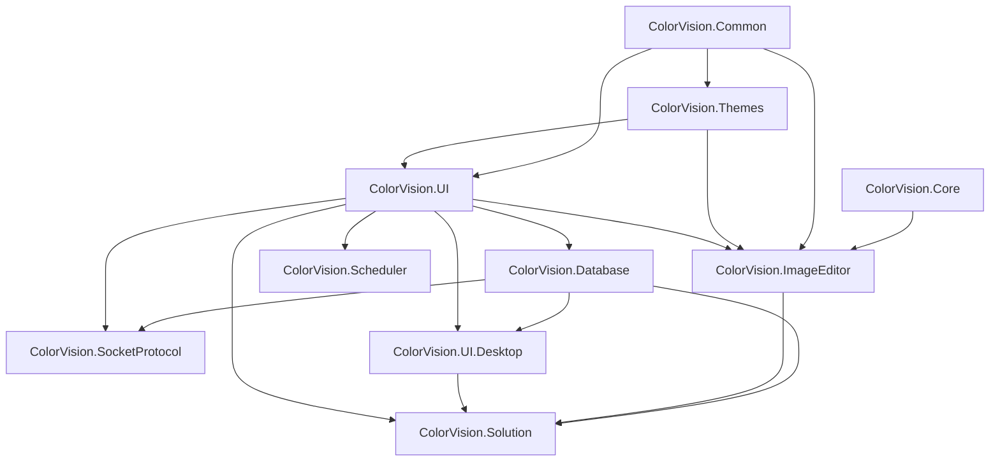

# UI DLL 组件手册

这页按 `UI/` 下的发布单元来说明每个 DLL。它的目标是让接手人员先知道每个组件“负责什么、谁会引用它、入口在哪里、发布时要检查什么”，再进入单独模块页看更细的控制链。

如果要按具体控件、窗口或扩展点查源码，请配合阅读 [UI 组件目录](./control-catalog.md)。如果要排查运行时为什么没有发现菜单、设置项、ImageEditor 工具、Socket handler 或 Solution 编辑器，请配合阅读 [UI 运行时组件交接手册](./ui-runtime-handoff.md)。

如果要发布 DLL 或 NuGet 包，请配合阅读 [UI DLL 发布矩阵](./publishing.md)。组件手册回答“这个 DLL 负责什么”，发布矩阵回答“这个 DLL 发版时要检查什么”。

## 组件分层

| 层级 | DLL | 说明 |
| --- | --- | --- |
| 基础契约层 | `ColorVision.Common.dll` | MVVM、接口、状态栏元数据、初始化器、权限粗粒度契约、工具类 |
| 主题资源层 | `ColorVision.Themes.dll` | 主题资源字典、窗口基类、主题切换、标题栏外观、通用控件 |
| UI 基础设施层 | `ColorVision.UI.dll` | 配置、菜单、插件加载、属性编辑器、快捷键、多语言、日志和状态栏 |
| 原生图像桥接层 | `ColorVision.Core.dll` | `HImage`、OpenCV helper P/Invoke、CUDA/fusion native bridge、WPF 位图桥接 |
| 数据接入层 | `ColorVision.Database.dll` | SqlSugar DAO、MySQL/SQLite 配置、数据库浏览器 Provider |
| 桌面通信层 | `ColorVision.SocketProtocol.dll` | 本地 TCP server、JSON/Text 分发、消息 SQLite 历史、状态栏和管理窗口 |
| 调度层 | `ColorVision.Scheduler.dll` | Quartz 调度器、任务配置、执行历史、任务管理窗口 |
| 图像编辑层 | `ColorVision.ImageEditor.dll` | `ImageView`、绘图图元、overlay、工具栏、伪彩、CIE、3D、实时图像 |
| 桌面工具层 | `ColorVision.UI.Desktop.exe` / package | 设置窗口、向导、插件市场、下载器、第三方应用、诊断窗口 |
| 工作区层 | `ColorVision.Solution.dll` | `.cvsln` 工作区、文件树、编辑器系统、AvalonDock、终端、本地 RBAC |

## 依赖和边界

维护时要尽量保持底层包不反向依赖高层包。尤其不要让 `Common`、`Themes`、`Core` 直接知道项目包、Engine 业务或具体客户流程。

## ColorVision.Common.dll

| 项 | 说明 |
| --- | --- |
| 源码 | `UI/ColorVision.Common/` |
| 目标框架 | `net8.0-windows7.0;net10.0-windows7.0` |
| 主要依赖 | WPF、WinForms、Windows 原生 API |
| 发布重点 | README、cursor 资源、强名称签名 |
| 详细页 | [ColorVision.Common](./ColorVision.Common.md) |

### 主要能力

- `ViewModelBase`、`RelayCommand`、`ActionCommand`：大多数 UI ViewModel 和命令的基础。
- `Interfaces/Config`、`Interfaces/Menus`、`Interfaces/StatusBar`、`Interfaces/IInitializer`：上层注册机制的共享契约。
- `Authorizations/`：`PermissionMode`、`RequiresPermissionAttribute`、`AccessControl` 等粗粒度权限入口。
- `NativeMethods/`：DWM、Win32、文件关联、剪贴板、Dump、性能信息等 Windows API 包装。
- `Utilities/`：文件、集合、窗口、字符串、CSV、加密等工具。

### 使用方式

新增 UI 模块时，通常先引用 `ColorVision.Common`，再决定是否需要 `ColorVision.UI`。如果只是写 ViewModel、命令、基础接口或工具类，不应该直接引用 `ColorVision.UI.Desktop`、`ColorVision.Solution` 这类高层包。

### 交接注意

`Common` 是共享协议层，不是业务运行时中心。看到 `IConfig`、`IInitializer`、`IMenuItemProvider` 时，应继续追它们在 `ColorVision.UI` 或宿主中的注册和执行逻辑。

## ColorVision.Themes.dll

| 项 | 说明 |
| --- | --- |
| 源码 | `UI/ColorVision.Themes/` |
| 目标框架 | `net8.0-windows7.0;net10.0-windows7.0` |
| 主要依赖 | `HandyControl` |
| 发布重点 | ResourceDictionary、图片/图标资源、通用控件 XAML |
| 详细页 | [ColorVision.Themes](./ColorVision.Themes.md) |

### 主要能力

- `ThemeManager`：主题切换、系统主题监听、资源字典注入。
- `ThemeManagerExtensions`：`Application.ApplyTheme`、`Window.ApplyCaption`。
- `Themes/*.xaml`：Base、Dark、White、Pink、Cyan 固定主题资源。
- `Themes/Window/BaseWindow`：项目内常用窗口基类。
- `Controls/`：`LoadingOverlay`、`ProgressRing`、`ToggleSwitch`、`MessageBoxWindow`、上传控件。

### 使用方式

WPF 窗口需要跟随主题时，应在应用启动后调用 `Application.ApplyTheme`，窗口层按需要调用 `ApplyCaption`。主题菜单和快捷键集成不在本 DLL 内，而是在 `ColorVision.UI/Themes`。

### 交接注意

当前主题是固定枚举和固定资源字典模型，不要按“可任意注册自定义主题平台”理解。

## ColorVision.UI.dll

| 项 | 说明 |
| --- | --- |
| 源码 | `UI/ColorVision.UI/` |
| 目标框架 | `net8.0-windows7.0;net10.0-windows7.0` |
| 主要依赖 | `ColorVision.Common`、`ColorVision.Themes`、`log4net`、`Newtonsoft.Json` |
| 发布重点 | 插件加载、配置持久化、属性编辑器、菜单系统 |
| 详细页 | [ColorVision.UI](./ColorVision.UI.md) |

### 主要能力

- `ConfigHandler`、`ConfigSettingManager`：配置读取、保存、设置项聚合。
- `PluginLoader`、`PluginManifest`、`PluginExtractor`：插件装载、manifest、包解压、依赖检查。
- `MenuManager`、`GlobalMenuBase`、`MenuItemBase`：动态菜单注册与执行。
- `PropertyEditorWindow`、`PropertyTreeNode`、`PropertyEditorTypeAttribute`：动态属性编辑器。
- `HotKey/`：全局热键和窗口热键。
- `Languages/`：多语言和文化切换。
- `StatusBar/`：状态栏 Provider 聚合与显示控件。
- `Shell/`、`Search/`、`LogImp/`、`Update/`：桌面壳层辅助能力。

### 使用方式

插件、项目包或 UI 扩展如果要进菜单、设置、状态栏、属性编辑器，通常会引用 `ColorVision.UI`。例如新增菜单时继承现有菜单基类或使用菜单特性；新增配置面板时实现配置设置 Provider；新增属性编辑器时配合 `PropertyEditorTypeAttribute`。

### 交接注意

`PluginLoader` 只负责装载插件程序集，不等于插件能扩展的所有业务点。插件真正生效还要看它实现了哪些菜单、初始化器、模板、服务或结果视图接口。

## ColorVision.Core.dll

| 项 | 说明 |
| --- | --- |
| 源码 | `UI/ColorVision.Core/` |
| 目标框架 | `net8.0-windows7.0;net10.0-windows7.0` |
| 主要依赖 | native `opencv_helper.dll`、可选 `opencv_cuda.dll`、OpenCV runtime DLL |
| 发布重点 | `runtimes/win-x64/native` 资源必须完整 |
| 详细页 | [ColorVision.Core](./ColorVision.Core.md) |

### 主要能力

- `HImage`：跨托管/非托管边界的图像数据结构。
- `HImageExtension`：`HImage` 到 WPF `WriteableBitmap` 的桥接。
- `OpenCVMediaHelper`：OpenCV helper 原生导出包装，包括伪彩、增强、阈值、滤波、SFR、聚焦评价等。
- `OpenCVCuda`：少量 CUDA/fusion 原生入口。
- `NativeLogBridge`：把原生日志桥接到托管日志体系。

### 使用方式

上层图像 UI 不应该直接操作 native 指针，而应通过 `HImage` 和 helper 包装传递数据。显示侧通常继续交给 `ColorVision.ImageEditor`，Core 只负责桥接和转换。

### 交接注意

发布包必须检查 native DLL 是否被打进 `runtimes/win-x64/native`。如果用户机器报 `DllNotFoundException` 或图像功能无法启动，先查包内容、输出目录和 x64 运行环境。

## ColorVision.Database.dll

| 项 | 说明 |
| --- | --- |
| 源码 | `UI/ColorVision.Database/` |
| 目标框架 | `net8.0-windows7.0;net10.0-windows7.0` |
| 主要依赖 | `ColorVision.UI`、`SqlSugarCore`、`Newtonsoft.Json`、`log4net` |
| 发布重点 | MySQL/SQLite Provider、README、数据库浏览器窗口 |
| 详细页 | [ColorVision.Database](./ColorVision.Database.md) |

### 主要能力

- `BaseTableDao<T>`、`EntityBase`、`ViewEntity`：业务实体访问基础。
- `MySqlControl`、`MySqlSetting`、`MySqlConnect`：MySQL 配置、连接、状态栏入口。
- `DatabaseBrowserWindow`：数据库浏览和表数据维护窗口。
- `IDatabaseBrowserProvider`、`DatabaseBrowserProviderRegistry`：可插拔数据库浏览 Provider。
- `MySqlDatabaseBrowserProvider`、`SqliteDatabaseBrowserProvider`：当前已有 Provider。

### 使用方式

业务代码继续使用 DAO/实体体系；运行时维护和排查优先使用数据库浏览器 Provider。新增数据源时优先实现 `IDatabaseBrowserProvider`，不要只补一组实体类。

### 交接注意

数据库浏览器是“数据库优先”链路，会直接从数据库结构读取库、表、列，不完全依赖 C# 实体定义。

## ColorVision.SocketProtocol.dll

| 项 | 说明 |
| --- | --- |
| 源码 | `UI/ColorVision.SocketProtocol/` |
| 目标框架 | `net8.0-windows7.0;net10.0-windows7.0` |
| 主要依赖 | `ColorVision.UI`、`ColorVision.Database` |
| 发布重点 | Socket 配置、SQLite 消息库、状态栏入口 |
| 详细页 | [ColorVision.SocketProtocol](./ColorVision.SocketProtocol.md) |

### 主要能力

- `SocketManager`：TCP server 生命周期、连接状态、JSON/Text 分发。
- `SocketInitializer`：根据配置自动启停服务。
- `SocketConfig`：监听 IP、端口、Buffer、协议模式。
- `ISocketJsonHandler`：JSON 请求处理扩展点，按 `EventName` 匹配。
- `SocketMessageManager`：消息历史 SQLite 持久化。
- `SocketManagerWindow`、`SocketStatusBarProvider`：管理窗口和状态栏入口。

### 使用方式

项目包要接外部设备或客户软件时，可以实现 `ISocketJsonHandler`，由当前 Dispatcher 按 `EventName` 分发。需要注意当前模块是本地 TCP server，不是完整设备协议规范。

### 交接注意

现场排查优先看配置是否启用、端口是否被占用、当前协议是 JSON 还是 Text、消息历史是否落库、Handler 是否被加载。

## ColorVision.Scheduler.dll

| 项 | 说明 |
| --- | --- |
| 源码 | `UI/ColorVision.Scheduler/` |
| 目标框架 | `net8.0-windows7.0;net10.0-windows7.0` |
| 主要依赖 | `Quartz`、`SqlSugarCore`、`ColorVision.UI` |
| 发布重点 | 任务配置 JSON、执行历史 SQLite、Quartz 任务扫描 |
| 详细页 | [ColorVision.Scheduler](./ColorVision.Scheduler.md) |

### 主要能力

- `QuartzSchedulerManager`：调度器启动、任务扫描、恢复、暂停、更新、删除。
- `SchedulerInfo`：任务展示和持久化模型。
- `TaskViewerWindow`：任务管理窗口。
- `CreateTask`：新建和编辑任务窗口。
- `TaskExecutionListener`：执行状态和统计更新。
- `SchedulerDbManager`：执行历史 SQLite。

### 使用方式

新增定时任务时，实现 Quartz `IJob`，并确保程序集会被 `AssemblyService` 收集到。任务定义保存在 `%AppData%/ColorVision/scheduler_tasks.json`，执行历史保存在 `SchedulerHistory.db`。

### 交接注意

任务配置和执行历史是两套存储。不要把它理解成一个纯数据库调度中心。

## ColorVision.ImageEditor.dll

| 项 | 说明 |
| --- | --- |
| 源码 | `UI/ColorVision.ImageEditor/` |
| 目标框架 | `net10.0-windows7.0` |
| 主要依赖 | `ColorVision.Common`、`ColorVision.Core`、`ColorVision.Themes`、`ColorVision.UI`、OpenCvSharp、HelixToolkit、ScottPlot |
| 发布重点 | shader、CIE 数据、colormap、图标、OpenCV runtime |
| 详细页 | [ColorVision.ImageEditor](./ColorVision.ImageEditor.md) |

### 主要能力

- `ImageView`：图像编辑器主控件。
- `EditorContext`：每个图像视图的运行时容器。
- `EditorToolFactory`：反射装配工具、菜单、组件、打开器。
- `IImageOpen`：不同文件类型的打开链。
- `Draw/`：圆、矩形、线、多边形、文本、标尺、贝塞尔曲线等图元。
- `Draw/Annotations/`：注释导入导出模型。
- `EditorTools/`：缩放、旋转、伪彩、滤镜、算法、直方图、3D、全屏等工具。
- `Cie/`、`Realtime/`、`Layers/`：CIE 图、实时图像、图层语义。

### 使用方式

普通窗口中使用图像编辑能力时，优先嵌入 `ImageView`，再通过 opener 或服务注册扩展打开方式、工具栏和 overlay。算法结果展示不应重复造绘图控件，应尽量接入现有 `DrawCanvas`、图元和注释链。

### 交接注意

`ImageView` 不是纯图片控件，初始化时会装配工具、上下文菜单、状态栏和图像服务。性能或副作用问题要先看 `EditorToolFactory` 和 `EditorContext`。

## ColorVision.UI.Desktop

| 项 | 说明 |
| --- | --- |
| 源码 | `UI/ColorVision.UI.Desktop/` |
| 目标框架 | `net10.0-windows7.0` |
| 输出类型 | `WinExe`，同时生成包 |
| 主要依赖 | `ColorVision.Database`、`ColorVision.UI`、WebView2、Markdig |
| 发布重点 | `github-markdown.css`、`aria2c.exe`、设置/向导/市场窗口 |
| 详细页 | [ColorVision.UI.Desktop](./ColorVision.UI.Desktop.md) |

### 主要能力

- `Settings/SettingWindow`：统一设置窗口。
- `Wizards/WizardManager`、`WizardWindow`：向导步骤发现和执行。
- `MenuItemManager/`：菜单项管理和持久化。
- `Marketplace/`：插件市场、DLL 版本查看、更新计划。
- `Download/`：下载窗口和 aria2c 下载服务。
- `ThirdPartyApps/`：系统工具、开始菜单、自定义应用入口。
- `Feedback/`、`TimedButtons/`、`WebViewService`：反馈、操作统计、WebView 辅助。

### 使用方式

这个项目更多是桌面辅助窗口集合。主程序可引用其设置、向导、市场、下载等窗口，但不要把它当作整个产品启动中心。

### 交接注意

这里虽然是 `WinExe`，但当前 `App` 和 `MainWindow` 很轻。真正主程序仍在仓库根部 `ColorVision/` 项目。

## ColorVision.Solution.dll

| 项 | 说明 |
| --- | --- |
| 源码 | `UI/ColorVision.Solution/` |
| 目标框架 | `net10.0-windows7.0` |
| 主要依赖 | `ColorVision.Database`、`ColorVision.ImageEditor`、`ColorVision.UI.Desktop`、AvalonDock、AvalonEdit、WebView2、WPFHexaEditor |
| 发布重点 | 编辑器注册、AvalonDock 布局、终端、RBAC SQLite |
| 详细页 | [ColorVision.Solution](./ColorVision.Solution.md) |

### 主要能力

- `SolutionManager`：`.cvsln` 创建、打开、最近文件、当前工作区。
- `Explorer/`：树形文件浏览、新建项目/文件、上下文菜单。
- `Editor/EditorManager`：按扩展名、通用编辑器和文件夹编辑器注册。
- `Workspace/WorkspaceManager`、`DockLayoutManager`：文档区、布局保存恢复、面板管理。
- `Terminal/`：内置 ConPTY 终端。
- `MultiImageViewer/`：多图预览和缩略图缓存。
- `Rbac/`：Solution 侧本地用户、角色、权限、会话和审计。

### 使用方式

需要文件工作区、文档标签页、内置编辑器或终端时引用它。新增编辑器时实现 `IEditor` 并配合 `EditorForExtensionAttribute`、`GenericEditorAttribute` 或 `FolderEditorAttribute`。

### 交接注意

`ColorVision.Solution` 是工作区壳层，不是 Engine 流程业务层。不要把客户项目流程、算法执行或设备控制塞进这里。

## 选择组件时的快速判断

| 你要做什么 | 优先引用/修改 |
| --- | --- |
| 新增 ViewModel、命令、共享接口 | `ColorVision.Common` |
| 新增主题资源、通用窗口外观 | `ColorVision.Themes` |
| 新增菜单、配置、状态栏、属性编辑器 | `ColorVision.UI` |
| 调用 OpenCV/native 图像能力 | `ColorVision.Core` |
| 新增数据库浏览来源或 DAO | `ColorVision.Database` |
| 新增 Socket JSON 事件处理 | `ColorVision.SocketProtocol` |
| 新增定时任务 | `ColorVision.Scheduler` |
| 新增图像绘图、overlay、打开器、图像工具 | `ColorVision.ImageEditor` |
| 新增设置页、向导、市场/下载/诊断窗口 | `ColorVision.UI.Desktop` |
| 新增工作区编辑器、文件树、终端、RBAC 管理 | `ColorVision.Solution` |

## 发布前必须看

- [UI DLL 发布手册](./publishing.md)
- [UI DLL 发布矩阵](./publishing.md)
- [UI 组件目录](./control-catalog.md)
- [UI 运行时组件交接手册](./ui-runtime-handoff.md)
- 每个组件的 `.csproj` 中 `TargetFrameworks`、`VersionPrefix`、`GeneratePackageOnBuild`、资源项和 native runtime 设置。
- 根目录 `Directory.Build.props` 中的全局版本、签名、包元数据和 `UIProjectPackageVersion`。
