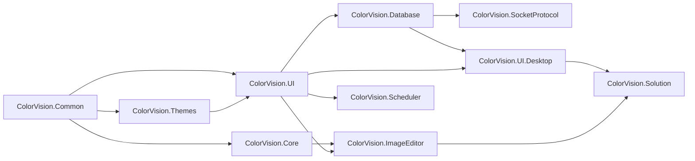

# UI DLL 发布矩阵

本页面向负责发布、交付、排查 DLL 缺失问题的维护人员。它不讲 UI 如何操作，而是把 `UI/` 下每个发布单元的构建形态、依赖边界、包内资源和发布后验收点放在同一张图里。

如果只是理解组件职责，先读 [UI DLL 组件手册](./component-handbook.md)。如果要真正发布包、替换现场 DLL 或给 Engine/插件准备依赖，先按 [UI DLL 发布场景手册](./ui-dll-release-playbook.md) 判断发布范围，再用本页核对每个 DLL 的版本、资源和烟测项。发布记录、包内容截图、输出目录版本和回退信息按 [UI DLL 发布证据与现场核查表](./dll-release-evidence.md) 留档。

## 发布单元总表

| 发布单元 | 项目文件 | 目标框架 | 当前版本 | 输出形态 | 直接依赖重点 |
| --- | --- | --- | --- | --- | --- |
| `ColorVision.Common` | `UI/ColorVision.Common/ColorVision.Common.csproj` | `net8.0-windows7.0;net10.0-windows7.0` | `1.5.5.2` | DLL + `.nupkg` + `.snupkg` | WPF、WinForms、共享接口和工具类 |
| `ColorVision.Themes` | `UI/ColorVision.Themes/ColorVision.Themes.csproj` | `net8.0-windows7.0;net10.0-windows7.0` | `1.5.5.3` | DLL + `.nupkg` + `.snupkg` | `HandyControl`、主题资源 |
| `ColorVision.UI` | `UI/ColorVision.UI/ColorVision.UI.csproj` | `net8.0-windows7.0;net10.0-windows7.0` | `1.5.5.3` | DLL + `.nupkg` + `.snupkg` | `ColorVision.Common`、`ColorVision.Themes`、`log4net`、`Newtonsoft.Json` |
| `ColorVision.Core` | `UI/ColorVision.Core/ColorVision.Core.csproj` | `net8.0-windows7.0;net10.0-windows7.0` | `1.5.5.2` | DLL + `.nupkg` + `.snupkg` + native runtime | `opencv_helper.dll`、OpenCV runtime、可选 `opencv_cuda.dll` |
| `ColorVision.Database` | `UI/ColorVision.Database/ColorVision.Database.csproj` | `net8.0-windows7.0;net10.0-windows7.0` | `1.5.5.3` | DLL + `.nupkg` + `.snupkg` | `ColorVision.UI`、`SqlSugarCore`、`log4net`、`Newtonsoft.Json` |
| `ColorVision.SocketProtocol` | `UI/ColorVision.SocketProtocol/ColorVision.SocketProtocol.csproj` | `net8.0-windows7.0;net10.0-windows7.0` | `1.5.5.2` | DLL + `.nupkg` + `.snupkg` | `ColorVision.UI`、`ColorVision.Database` |
| `ColorVision.Scheduler` | `UI/ColorVision.Scheduler/ColorVision.Scheduler.csproj` | `net8.0-windows7.0;net10.0-windows7.0` | `1.5.5.2` | DLL + `.nupkg` + `.snupkg` | `ColorVision.UI`、`Quartz`、`SqlSugarCore` |
| `ColorVision.ImageEditor` | `UI/ColorVision.ImageEditor/ColorVision.ImageEditor.csproj` | `net10.0-windows7.0` | `1.5.5.5` | DLL + `.nupkg` + `.snupkg` + embedded resources | `ColorVision.Core`、`ColorVision.UI`、OpenCvSharp、HelixToolkit、ScottPlot |
| `ColorVision.UI.Desktop` | `UI/ColorVision.UI.Desktop/ColorVision.UI.Desktop.csproj` | `net10.0-windows7.0` | `1.5.5.3` | `WinExe` + `.nupkg` + `.snupkg` | `ColorVision.Database`、`ColorVision.UI`、WebView2、Markdig |
| `ColorVision.Solution` | `UI/ColorVision.Solution/ColorVision.Solution.csproj` | `net10.0-windows7.0` | `1.5.5.2` | DLL + `.nupkg` + `.snupkg` | `ColorVision.ImageEditor`、`ColorVision.UI.Desktop`、AvalonDock、AvalonEdit、WebView2、WPFHexaEditor |

当前 `UI/` 项目多数设置了 `GeneratePackageOnBuild=True`，所以 Release 构建不仅生成 DLL，也会生成 NuGet 包。`ColorVision.UI.Desktop` 虽然是 `WinExe`，仍然参与打包，交接时不要只按普通类库理解。

## 推荐构建顺序



实际构建可以直接跑解决方案或主程序，但排查单包失败时建议按上图从底层往上构建。`Common`、`Themes`、`UI` 是多数模块的基础；`Core` 和 `ImageEditor` 一旦失败，Engine、Spectrum、Conoscope、Solution 等模块会连带失败。

## 被其他模块消费的方式

| 消费方 | 当前引用方式 | 发布影响 |
| --- | --- | --- |
| `ColorVision/ColorVision.csproj` | 直接 `ProjectReference` 到 `ColorVision.UI.Desktop` 和 `ColorVision.UI` | 主程序构建会把对应 UI DLL 带入输出目录 |
| `Engine/ColorVision.Engine` | 对 `Database`、`SocketProtocol`、`ImageEditor`、`Scheduler`、`Solution`、`UI` 有源码优先、包引用兜底逻辑 | 源码不存在时会使用 `UIProjectPackageVersion`，外部交付建议锁定版本，不要长期保留 `*` |
| `Plugins/Spectrum` | 直接引用 `ImageEditor`、`Database`、`Scheduler`、`SocketProtocol`、`UI` | 插件发版前要确认主程序输出目录里的 `ColorVision.*.dll` 版本满足插件运行 |
| `Plugins/Conoscope` | 直接引用 `ImageEditor`、`Solution` | 图像编辑器和 Solution 工作区资源缺失会导致插件功能残缺 |
| `Plugins/SystemMonitor` | 直接引用 `ColorVision.UI` | 依赖菜单、状态栏或配置发现链 |
| `Plugins/EventVWR` | 直接引用 `ColorVision.Common` | 主要依赖共享接口和基础工具 |
| `Plugins/WindowsServicePlugin` | 直接引用 `ColorVision.UI.Desktop` 和 `ColorVision.UI` | 依赖桌面辅助窗口和 UI 基础设施 |
| `Projects/ProjectARVR` | 直接引用 `ColorVision.UI` | 项目包菜单、配置或 UI 接入受 `ColorVision.UI` 版本影响 |

这也是 UI DLL 发布最容易出问题的地方：一个包构建成功，不代表主程序、Engine 兜底包、插件目录和项目包运行时都拿到了同一组版本。

## 包内资源验收

| 发布单元 | 必须确认的包内资源 | 缺失时的典型表现 |
| --- | --- | --- |
| `ColorVision.Common` | `README.md`、`Assets/Cursor/eraser.cur` 等 cursor 资源 | 鼠标工具或基础说明缺失 |
| `ColorVision.Themes` | `README.md`、`Assets/Image/ColorVision.ico`、`ColorVision1.ico`、`uploadbg.avif`、主题 XAML | 窗口图标、上传背景或主题资源加载失败 |
| `ColorVision.UI` | `README.md`、插件/配置/属性编辑器相关类型 | 插件管理、设置窗口、菜单或属性编辑器异常 |
| `ColorVision.Core` | `runtimes/win-x64/native/opencv_helper.dll`、`opencv_core4130.dll`、`opencv_highgui4130.dll`、`opencv_imgcodecs4130.dll`、`opencv_imgproc4130.dll`、`opencv_videoio4130.dll`、`opencv_videoio_ffmpeg4130_64.dll`，可选 `opencv_cuda.dll` | `DllNotFoundException`、视频/图像处理失败、OpenCV helper 无法加载 |
| `ColorVision.Database` | `README.md`、SqlSugar 依赖 | 数据库浏览器、MySQL/SQLite DAO 或状态栏入口异常 |
| `ColorVision.SocketProtocol` | `README.md`、Socket 配置和消息实体 | Socket 管理窗口、消息历史或 JSON/Text 分发异常 |
| `ColorVision.Scheduler` | `Properties/README.md` 进入包根、Quartz/SqlSugar 依赖 | 任务管理窗口缺说明，调度器或历史库异常 |
| `ColorVision.ImageEditor` | shader、`Assets/Colormap/*.jpg`、`Assets/Data/CIE_cc_1931_2deg.csv`、CIE/图标资源、OpenCvSharp runtime | 伪彩、滤镜、CIE、3D、普通图像打开或视频功能异常 |
| `ColorVision.UI.Desktop` | `README.md`、`Assets/css/github-markdown.css`、`Assets/Tool/aria2c.exe` | 插件市场 README 预览、下载器或 WebView 辅助功能异常 |
| `ColorVision.Solution` | `README.md`、AvalonDock/AvalonEdit/WebView2/WPFHexaEditor 依赖 | 工作区、文本编辑器、Markdown 预览、终端或 RBAC 管理窗口异常 |

## 发布前命令

先确认版本、签名和打包字段：

```powershell
rg -n "VersionPrefix|GeneratePackageOnBuild|PackageReadmeFile|PackagePath|CopyToOutputDirectory" UI -g "*.csproj"
Get-Content Directory.Build.props
```

再执行 Release x64 构建：

```powershell
dotnet restore
dotnet build UI/ColorVision.Common/ColorVision.Common.csproj -c Release -p:Platform=x64
dotnet build UI/ColorVision.Themes/ColorVision.Themes.csproj -c Release -p:Platform=x64
dotnet build UI/ColorVision.UI/ColorVision.UI.csproj -c Release -p:Platform=x64
dotnet build UI/ColorVision.Core/ColorVision.Core.csproj -c Release -p:Platform=x64
dotnet build UI/ColorVision.Database/ColorVision.Database.csproj -c Release -p:Platform=x64
dotnet build UI/ColorVision.SocketProtocol/ColorVision.SocketProtocol.csproj -c Release -p:Platform=x64
dotnet build UI/ColorVision.Scheduler/ColorVision.Scheduler.csproj -c Release -p:Platform=x64
dotnet build UI/ColorVision.ImageEditor/ColorVision.ImageEditor.csproj -c Release -p:Platform=x64
dotnet build UI/ColorVision.UI.Desktop/ColorVision.UI.Desktop.csproj -c Release -p:Platform=x64
dotnet build UI/ColorVision.Solution/ColorVision.Solution.csproj -c Release -p:Platform=x64
```

如果只做本地开发验证，可以先构建主程序：

```powershell
dotnet build ColorVision/ColorVision.csproj -c Release -p:Platform=x64
```

## 包内容抽检

`.nupkg` 本质是 zip，可以复制到临时目录后展开检查：

```powershell
$pkg = Get-ChildItem UI/ColorVision.Core/bin -Recurse -Filter "ColorVision.Core.*.nupkg" | Sort-Object LastWriteTime -Descending | Select-Object -First 1
$tmp = Join-Path $env:TEMP "cv-core-nupkg"
Remove-Item $tmp -Recurse -Force -ErrorAction SilentlyContinue
New-Item $tmp -ItemType Directory | Out-Null
Copy-Item $pkg.FullName "$tmp/core.zip"
Expand-Archive "$tmp/core.zip" "$tmp/core"
Get-ChildItem "$tmp/core/runtimes/win-x64/native"
```

对 `ImageEditor` 还要抽检资源是否进入包：

```powershell
$pkg = Get-ChildItem UI/ColorVision.ImageEditor/bin -Recurse -Filter "ColorVision.ImageEditor.*.nupkg" | Sort-Object LastWriteTime -Descending | Select-Object -First 1
$tmp = Join-Path $env:TEMP "cv-imageeditor-nupkg"
Remove-Item $tmp -Recurse -Force -ErrorAction SilentlyContinue
New-Item $tmp -ItemType Directory | Out-Null
Copy-Item $pkg.FullName "$tmp/imageeditor.zip"
Expand-Archive "$tmp/imageeditor.zip" "$tmp/imageeditor"
Get-ChildItem "$tmp/imageeditor" -Recurse | Where-Object { $_.Name -match "colorscale_|CIE_cc|\\.ps$|CIE1931" }
```

## 发布后烟测矩阵

| 能力 | 应打开或验证什么 | 失败时优先看 |
| --- | --- | --- |
| 主程序启动 | `ColorVision/ColorVision.csproj` Release 输出能启动 | 强名称、缺 DLL、运行时 TFM |
| 插件装载 | 插件管理器能读到插件 `manifest.json`、README、CHANGELOG | `PluginLoader`、`.deps.json`、主程序目录 DLL 版本 |
| 设置窗口 | 设置页、主题、语言、日志等级能打开并保存 | `ColorVision.UI`、`ColorVision.UI.Desktop`、配置路径 |
| 属性编辑器 | 任意配置对象能弹出 `PropertyEditorWindow` | `PropertyEditorTypeAttribute`、编辑器反射装配 |
| 图像编辑器 | 普通图片、伪彩、CIE、注释导入导出、3D 至少各打开一次 | `ImageEditor` 资源、`Core` native runtime、OpenCvSharp runtime |
| 数据库浏览器 | MySQL/SQLite Provider 能显示库表 | `ColorVision.Database`、SqlSugar、连接配置 |
| Socket 管理 | 启用服务、发送 JSON/Text、查看历史消息 | `SocketConfig`、端口占用、`SocketMessages.db` |
| 调度器 | 任务管理窗口打开，任务列表和历史库可读取 | Quartz、`scheduler_tasks.json`、`SchedulerHistory.db` |
| Solution 工作区 | `.cvsln` 打开、文件树、文本编辑、图像编辑、终端、布局恢复 | `ColorVision.Solution`、AvalonDock/AvalonEdit/WebView2 |

## 常见发布事故

| 现象 | 常见原因 | 处理路径 |
| --- | --- | --- |
| 本机能跑，现场缺 `ColorVision.*.dll` | 只替换了插件 DLL，没同步主程序输出目录的 UI DLL | 对比插件 `.deps.json` 和主程序目录实际 DLL 版本 |
| 图像编辑器打开时报 native DLL 缺失 | `ColorVision.Core` 包内 `runtimes/win-x64/native` 不完整 | 抽检 `.nupkg`，确认 OpenCV DLL 和 `opencv_helper.dll` 都进入包 |
| 伪彩或 CIE 功能消失 | `ImageEditor` 资源未作为 `Resource` 打包 | 检查 `ColorVision.ImageEditor.csproj` 的 `Assets/Colormap`、`Assets/Data`、shader 项 |
| Engine 在外部环境解析到错误 UI 包 | `UIProjectPackageVersion` 使用 `*` | 交付环境锁定明确版本，重新 restore/build |
| 插件能装载但菜单/状态栏没有出现 | 插件程序集加载了，但对应 Provider 未被扫描或实例化失败 | 看 `MenuManager`、`StatusBarManager`、日志中的反射创建异常 |
| Socket 服务显示未启动 | 配置未启用或端口被占用 | 打开 Socket 管理窗口，看监听地址、协议模式和最后错误 |
| Solution 打开文件没反应 | 编辑器类型未被 `EditorManager` 扫描，或缺依赖 | 检查 `EditorForExtensionAttribute`、默认编辑器配置和依赖 DLL |

## 交接要求

每次 UI DLL 发版至少留下这些信息：

| 项 | 要写清楚 |
| --- | --- |
| 发布范围 | 哪些 UI 项目被重新构建，是否包含 `Core` 或 `ImageEditor` |
| 版本 | 每个 `.csproj` 的 `VersionPrefix`，以及主程序输出目录实际 DLL 版本 |
| 资源检查 | native runtime、shader、colormap、CIE 数据、CSS、工具 exe 是否抽检通过 |
| 消费方验证 | 主程序、Engine、关键插件、关键项目包是否用同一组 DLL 验证 |
| 烟测结果 | 属性编辑器、图像编辑器、数据库、Socket、调度器、Solution 工作区的最小验证结果 |
| 回退方式 | 保留上一组 `.nupkg`、`.snupkg`、主程序输出 DLL 和插件目录 |

## 继续阅读

- [UI DLL 发布手册](./publishing.md)
- [UI DLL 发布场景手册](./ui-dll-release-playbook.md)
- [UI DLL 发布证据与现场核查表](./dll-release-evidence.md)
- [UI DLL 组件手册](./component-handbook.md)
- [UI 组件目录](./control-catalog.md)
- [构建与发布脚本](../../02-developer-guide/scripts/README.md)
