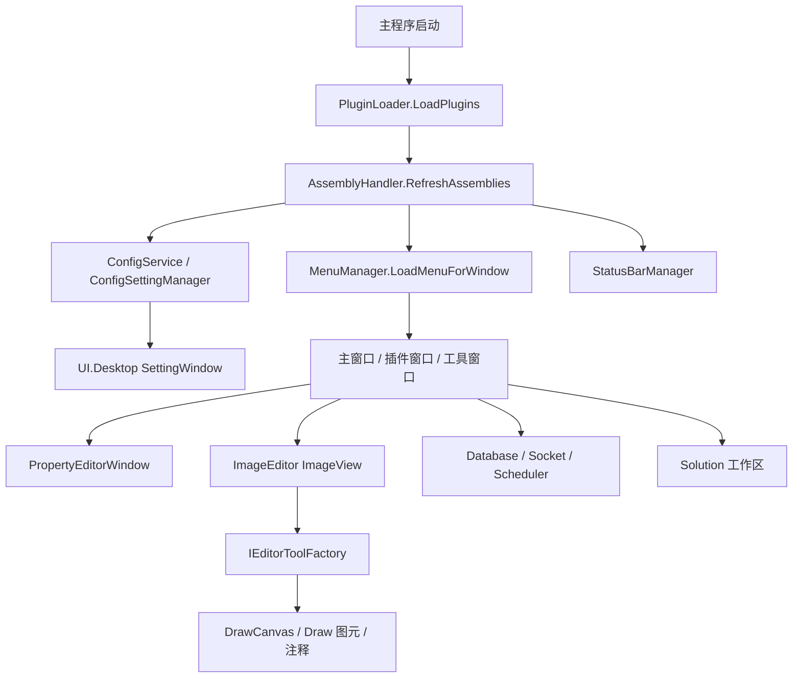
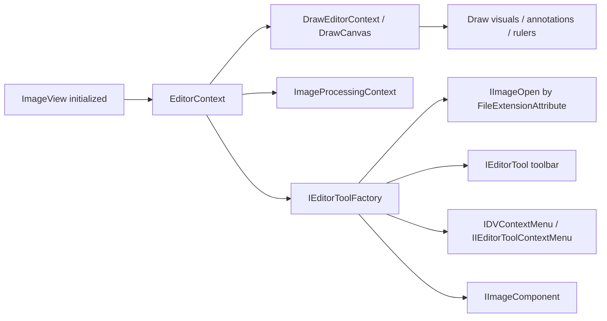

# UI 运行时组件交接手册

这页面向接手 `UI/` 运行时链路的人。它回答的问题不是某个 DLL 怎么打包，而是主程序运行后，菜单、设置、插件加载、属性编辑器、图像编辑器、Socket、调度器、插件市场和 Solution 工作区这些 UI 组件如何被发现、装配和排障。

如果你的任务是发布 DLL 或 NuGet 包，先看 [UI DLL 发布场景手册](./ui-dll-release-playbook.md) 和 [UI DLL 发布矩阵](./release-matrix.md)。如果你的任务是改控件或定位界面问题，先看本页，再进入 [UI 组件目录](./control-catalog.md) 和对应 DLL 页。

## 一句话边界

| 模块 | 运行时定位 | 不应该放进去的内容 |
| --- | --- | --- |
| `ColorVision.Common` | 基础契约、MVVM、命令、菜单/状态栏接口 | 具体窗口、客户业务、Engine 设备逻辑 |
| `ColorVision.Themes` | 主题资源、窗口基类、主题化通用控件 | 插件、项目包、算法业务 |
| `ColorVision.UI` | 菜单、插件加载、配置、设置发现、属性编辑器、日志、热键、状态栏 | 插件市场 UI、Solution 工作区、项目流程 |
| `ColorVision.Core` | 图像 native bridge、`HImage`、OpenCV helper | WPF 交互控件、客户判定 |
| `ColorVision.Database` | SqlSugar、MySQL/SQLite 配置、数据库浏览器 | 设备通讯协议、项目导出格式 |
| `ColorVision.SocketProtocol` | 本地 TCP server、JSON/Text 事件分发、消息历史 | 具体项目测试流程本身 |
| `ColorVision.Scheduler` | Quartz 任务、任务窗口、执行历史 | 长耗时业务算法实现 |
| `ColorVision.ImageEditor` | `ImageView`、工具栏、绘图图元、overlay、CIE/3D/实时图像 | 客户项目结果判定和导出 |
| `ColorVision.UI.Desktop` | 设置窗口、向导、插件市场、下载器、诊断工具 | 主程序启动中心、Engine 流程业务 |
| `ColorVision.Solution` | `.cvsln` 工作区、文件树、编辑器、终端、RBAC | 设备控制、算法执行、项目测试主链路 |

交接时先判断问题属于哪个运行时边界，再进入对应 DLL 页。不要因为某个窗口用了 WPF，就把所有 UI 问题都归到 `ColorVision.UI`。

## 主运行时链路

这条链路的核心是程序集发现。插件或项目包加载以后，`AssemblyHandler`、`AssemblyService` 和 `Application.Current.GetAssemblies()` 会影响后续菜单、设置、ImageEditor 工具、Solution 编辑器等组件是否能被发现。遇到 UI 扩展不出现，先确认程序集是否已进入发现集合，再看具体接口实现。

## 发现机制矩阵

| 能力 | 发现入口 | 实现或标注 | 常见源码 | 失败时先查 |
| --- | --- | --- | --- | --- |
| 插件加载 | `PluginLoader.LoadPlugins("Plugins")` | `manifest.json`、`DllName`、`.deps.json` | `UI/ColorVision.UI/Plugins/PluginLoader.cs` | 插件目录、manifest 的 `Id` 和 `DllName`、依赖 DLL 版本、插件是否禁用 |
| 菜单 | `MenuManager.LoadMenuForWindow` | `IMenuItem`、`IMenuItemProvider`、`MenuItemAttribute` | `UI/ColorVision.UI/Menus/`、`UI/ColorVision.Common/Interfaces/Menus/` | `OwnerGuid`、`GuidId`、`Order`、目标窗口名、权限过滤、程序集是否刷新 |
| 设置窗口 | `ConfigSettingManager.GetAllSettings` | `IConfigSettingProvider`、`[ConfigSetting]` 标注在 `IConfig` 属性上 | `UI/ColorVision.UI/ConfigSetting/`、`UI/ColorVision.UI.Desktop/Settings/` | `ConfigService` 是否初始化、设置项是否有 `Group`/`Order`、搜索过滤是否隐藏 |
| 属性编辑器 | `PropertyEditorWindow` | `[Category]`、`[DisplayName]`、`[Description]`、`PropertyEditorTypeAttribute` | `UI/ColorVision.UI/PropertyEditor/` | 属性是否 public get/set、配置对象是否可 clone/reset、编辑器类型是否可创建 |
| 状态栏 | `StatusBarManager` | `IStatusBarProvider`、`IStatusBarProviderUpdatable` | `UI/ColorVision.UI/StatusBar/` | Provider 是否被发现、刷新频率、主窗口是否绑定状态栏控件 |
| 热键 | `HotkeyService` | `IHotKey`、窗口热键注册 | `UI/ColorVision.UI/HotKey/` | 是否冲突、是否被禁用、窗口焦点是否正确 |
| 日志查看 | log4net appender | `LogViewerAppender`、`LogConfig` | `UI/ColorVision.UI/LogImp/` | log4net 配置、日志文件路径、UI 刷新和过滤条件 |
| 图像打开器 | `IEditorToolFactory` | `IImageOpen` + `FileExtensionAttribute` | `UI/ColorVision.ImageEditor/Abstractions/` | 扩展名是否匹配、构造函数是否接收 `EditorContext`、图像文件路径 |
| 图像工具栏 | `IEditorToolFactory` | `IEditorTool`、`IEditorToggleTool`、`IEditorCustomControlTool` | `UI/ColorVision.ImageEditor/EditorTools/` | 工具是否可实例化、`GuidId` 是否被覆盖、可见性配置是否隐藏 |
| 图像右键菜单 | `IEditorToolFactory` | `IDVContextMenu`、`IIEditorToolContextMenu` | `UI/ColorVision.ImageEditor/Abstractions/` | 构造函数参数、当前 `EditorContext` 是否满足 |
| 图像组件 | `AssemblyService.LoadImplementations<IImageComponent>()` | `IImageComponent` | `UI/ColorVision.ImageEditor/` | 组件是否被发现、是否在 `ImageView` 初始化后执行 |
| 数据库浏览 | Provider registry | `IDatabaseBrowserProvider` | `UI/ColorVision.Database/` | Provider 注册、连接配置、SqlSugar 依赖 |
| Socket 事件 | `SocketManager` | `ISocketJsonHandler` | `UI/ColorVision.SocketProtocol/`、项目包 | 端口、协议模式、`EventName`、消息历史、项目 Handler 是否加载 |
| 调度任务 | `QuartzSchedulerManager` | Quartz `IJob`、任务配置 | `UI/ColorVision.Scheduler/` | `scheduler_tasks.json`、Job 类型、执行历史库、调度器是否启动 |
| Solution 编辑器 | `EditorManager` | `IEditor`、`EditorForExtensionAttribute`、`GenericEditorAttribute`、`FolderEditorAttribute` | `UI/ColorVision.Solution/Editor/` | 扩展名匹配、编辑器注册顺序、文件锁和权限 |

## 插件加载和菜单链路

插件进入 UI 的第一步通常不是菜单，而是程序集是否被加载。

1. `PluginLoader` 扫描 `Plugins/<PluginId>/`。
2. 如果有 `manifest.json`，先读 `Id`、`Name`、`Description`、`DllName`。
3. 如果目录里有唯一 `.deps.json`，会检查 `ColorVision.*` 依赖 DLL 是否存在且版本满足要求。
4. 插件启用后用 `Assembly.LoadFrom(dllPath)` 加载。
5. `AssemblyHandler.GetInstance().RefreshAssemblies()` 刷新程序集集合。
6. 菜单、设置、ImageEditor 工具、Socket handler 等后续发现机制才有机会看到插件里的类型。

排查菜单不出现时，不要只看菜单类。先查插件是否真的加载，然后查菜单的 `OwnerGuid` 是否指向正确父菜单、`GuidId` 是否被过滤、`Order` 是否让它落在预期位置、目标窗口名是否匹配。

## 设置窗口和属性编辑器

设置窗口和属性编辑器是两条相关但不同的链路。

| 场景 | 使用链路 | 适合放什么 |
| --- | --- | --- |
| 全局设置页面 | `ConfigSettingManager` -> `SettingWindowController` | 用户长期保存的配置项、开关、路径、更新策略 |
| 单个配置对象编辑 | `PropertyEditorWindow` | 设备参数、模板参数、运行时对象属性 |
| 复杂集合编辑 | 自定义 `IPropertyEditor` | 列表、字典、JSON、大文本、文件夹选择 |

新增配置时，优先让配置类实现 `IConfig` 并通过 `ConfigService` 管理。简单设置用 `[ConfigSetting]` 暴露到设置窗口；参数编辑用 `[Category]`、`[DisplayName]`、`[Description]` 提高 PropertyGrid 可读性。只有默认编辑器无法表达时，才新增 `IPropertyEditor`。

常见失败路径：

| 现象 | 先查 | 说明 |
| --- | --- | --- |
| 设置窗口里找不到某项 | `ConfigSettingManager` 是否扫描到类型 | 类型不在程序集集合、没有实现 `IConfig`、标注在非 public 属性上都会失败 |
| 搜索不到设置 | `SettingEntry.SearchText`、分组名、描述 | 设置窗口会按搜索文本过滤，不一定是没有注册 |
| PropertyGrid 空白 | 属性是否 public get/set | 只读属性、字段、内部属性不会按常规属性显示 |
| 点击确定没有生效 | `Clone`、`CopyTo`、`Submited` 事件 | 当前窗口会在编辑副本和原对象之间复制 |
| 自定义编辑器没有出现 | `PropertyEditorTypeAttribute` 和编辑器构造 | 编辑器类型不可创建或属性类型不匹配时会回退或失败 |

## 主题和窗口控件

`ColorVision.Themes` 负责主题和通用控件，不负责业务菜单。常见入口：

| 能力 | 入口 | 排查点 |
| --- | --- | --- |
| 应用主题 | `Application.ApplyTheme` | 主题枚举、资源字典是否注入、主题 XAML 是否打进包 |
| 窗口标题栏 | `Window.ApplyCaption`、`BaseWindow` | 窗口是否在初始化后调用、DWM API 是否可用 |
| 加载提示 | `LoadingOverlay`、`ProgressRing` | 是否遮住主交互、异步任务是否正确关闭 |
| 开关控件 | `ToggleSwitch` | 绑定是否双向、样式资源是否存在 |
| 上传提示 | `UploadWindow`、`UploadMsg` | 背景资源、上传状态、取消逻辑 |

主题问题通常表现为窗口能开但样式丢失、图标丢失、标题栏颜色不对。发布时继续对照 [UI DLL 发布矩阵](./release-matrix.md) 检查资源项。

## ImageEditor 运行时链路

`ImageView` 是复合控件，不是单纯的图片控件。初始化时会创建 `EditorContext`，再创建 `IEditorToolFactory`，最后发现工具、右键菜单、打开器和组件。

新增图像功能时按这几个落点选择：

| 需求 | 优先落点 | 说明 |
| --- | --- | --- |
| 支持新文件格式 | `IImageOpen` + `FileExtensionAttribute` | 打开器可提供格式专属工具栏 |
| 新增工具按钮 | `IEditorTool` 或派生接口 | 让工厂统一装配和控制可见性 |
| 新增右键菜单 | `IDVContextMenu` 或 `IIEditorToolContextMenu` | 根据是否需要 `EditorContext` 决定接口 |
| 新增 overlay | `Draw/` 图元或注释体系 | 便于缩放、导入导出和结果回看 |
| 新增图像处理 | `ImageProcessingContext` 或 Core helper | native 处理放 `ColorVision.Core`，UI 命令放 ImageEditor |

结果展示链路要和 Engine 的 [结果展示与项目交接](../engine-components/result-handoff-chain.md) 一起看。通用算法 overlay 应放在 Engine result handler 或 ImageEditor 图元体系里；客户 CSV、MES、Socket 返回值不要塞进 ImageEditor。

## 数据库、Socket 和调度工具窗口

这三类窗口经常被现场人员当作业务窗口使用，但它们本质上是 UI 层运行时工具。

| 工具 | 主要入口 | 存储/配置 | 交接重点 |
| --- | --- | --- | --- |
| 数据库浏览器 | `DatabaseBrowserWindow`、`IDatabaseBrowserProvider` | MySQL/SQLite 连接、SqlSugar 实体 | 先确认 Provider 能列库表，再看业务 DAO |
| Socket 管理 | `SocketManagerWindow`、`SocketStatusBarProvider`、`ISocketJsonHandler` | IP、端口、协议模式、消息历史 SQLite | 先看 server 是否启动和消息是否落库，再看项目 handler |
| 调度管理 | `TaskViewerWindow`、`CreateTask`、`QuartzSchedulerManager` | `scheduler_tasks.json`、`SchedulerHistory.db` | 任务配置和执行历史是两套存储 |

如果客户说外部软件触发无反应，先查 Socket 窗口和消息历史；如果消息到了但项目没跑，再查项目包的 `ISocketJsonHandler` 或项目入口流程。

## UI.Desktop 辅助窗口

`ColorVision.UI.Desktop` 提供的是桌面辅助窗口集合。它输出类型是 `WinExe`，也会生成包，但当前主程序入口仍是仓库根部 `ColorVision/`。

| 能力 | 关键类 | 排查点 |
| --- | --- | --- |
| 设置窗口 | `SettingWindow`、`SettingWindowController` | 设置项发现、搜索过滤、分组排序 |
| 插件市场 | `MarketplaceWindow`、`MarketplaceManager`、`MarketplaceClient` | 后端地址、包下载、README 预览、更新计划 |
| 下载器 | `DownloadWindow`、`Aria2cDownloadService` | `aria2c.exe` 是否打包、下载路径、权限 |
| 向导 | `WizardWindow`、`IWizardStep` | 步骤是否发现、前后步骤状态 |
| 菜单管理 | `MenuItemManagerWindow` | 菜单隐藏、排序、Owner 覆盖 |
| 第三方应用 | `ThirdPartyAppsWindow` | 开始菜单扫描、自定义路径、权限 |

插件市场只能证明包能下载、安装或更新，不能证明插件业务能力正确。业务能力仍要回到 [现有插件能力说明](../plugins/README.md) 和单插件页。

## Solution 工作区

`ColorVision.Solution` 是本地工作区壳层，适合管理 `.cvsln`、文件树、编辑器、终端和 RBAC。

| 能力 | 入口 | 交接重点 |
| --- | --- | --- |
| 工作区 | `SolutionManager` | 当前工作区路径、最近文件、`.cvsln` |
| 文件树 | `SolutionExplorer`、`SolutionNode` | 新建、删除、重命名和上下文菜单 |
| 编辑器 | `EditorManager`、`IEditor` | 扩展名匹配、通用编辑器、文件夹编辑器 |
| 布局 | `WorkspaceManager`、`DockLayoutManager` | AvalonDock 布局保存恢复 |
| 终端 | `TerminalControl` | ConPTY、工作目录、环境变量 |
| RBAC | `RbacManagerWindow` 等窗口 | 本地用户、角色、权限、审计 |

不要把客户项目流程或设备控制直接写进 Solution。项目流程应进入 `Projects/` 或 Engine 的业务链路，Solution 只作为工作区和编辑器容器。

## 常见问题定位

| 现象 | 第一检查点 | 第二检查点 | 应看文档 |
| --- | --- | --- | --- |
| 插件安装后没有菜单 | `PluginLoader` 是否加载程序集 | `MenuManager` 的 `OwnerGuid`、过滤和权限 | [插件运行与交接场景手册](../plugins/plugin-handoff-playbook.md) |
| 菜单有但点击无反应 | 命令 `CanExecute` 和异常日志 | 目标窗口或服务是否初始化 | [UI 组件目录](./control-catalog.md) |
| 设置项没有出现 | `ConfigSettingManager` 扫描 | `IConfigSettingProvider` 或 `[ConfigSetting]` | 本页设置章节 |
| PropertyGrid 显示不清楚 | 属性元数据是否完整 | 自定义编辑器是否绑定 | [属性编辑器](../../01-user-guide/interface/property-editor.md) |
| 主题或图标丢失 | `ColorVision.Themes` 资源是否打包 | 运行目录是否有对应资源 | [UI DLL 发布矩阵](./release-matrix.md) |
| 图片能打开但工具栏少 | `IEditorToolFactory` 是否发现工具 | 可见性配置和 `GuidId` 覆盖 | 本页 ImageEditor 章节 |
| overlay 坐标不对 | Draw 图元和缩放坐标系 | Engine result handler 坐标转换 | [结果展示与项目交接](../engine-components/result-handoff-chain.md) |
| Socket 收到消息但项目没跑 | `SocketManager` 消息历史 | 项目 `ISocketJsonHandler` 和 EventName | [项目包运行与交接场景手册](../projects/project-package-playbook.md) |
| 定时任务没执行 | Quartz 是否启动 | 任务 JSON 和 Job 类型 | [UI 组件目录](./control-catalog.md) |
| 插件市场下载失败 | marketplace 后端和网络 | `aria2c.exe`、下载目录权限 | [UI DLL 发布矩阵](./release-matrix.md) |

## 新增 UI 组件交接清单

新增或重构 UI 组件时，交接记录至少写清楚：

| 项 | 必填内容 |
| --- | --- |
| 所属 DLL | 例如 `ColorVision.UI`、`ColorVision.ImageEditor`、`ColorVision.UI.Desktop` |
| 运行时发现方式 | 反射接口、属性标注、Provider 注册、手动 new、XAML 引用 |
| 入口类 | 用户从哪个窗口、菜单、状态栏、快捷键或工具栏进入 |
| 配置 | 是否进入 `ConfigService`、设置窗口、JSON、SQLite 或项目配置 |
| 依赖 | 是否依赖 native DLL、资源字典、图片、CSS、第三方 exe、WebView2 |
| 验证 | 打开哪个窗口、点击哪个菜单、保存哪项配置、查看哪条日志 |
| 文档 | 更新本页、[UI 组件目录](./control-catalog.md)、对应 DLL 页和发布矩阵 |

## 修改后验证

| 修改范围 | 最小验证 |
| --- | --- |
| 菜单/状态栏/热键 | 启动主程序，确认目标窗口菜单出现、排序正确、命令可执行 |
| 设置/PropertyGrid | 打开设置窗口或属性编辑器，搜索、修改、保存、重启后确认持久化 |
| 主题控件 | 切换 Dark/White/Pink/Cyan，确认窗口标题栏、图标、资源都正常 |
| ImageEditor | 打开普通图片和至少一种业务结果图，确认工具栏、缩放、overlay、注释导入导出 |
| 数据库/Socket/调度 | 打开管理窗口，确认连接、消息或任务历史能读写 |
| 插件市场/下载器 | 打开市场，查看详情，下载或模拟下载，确认 README 和 DLL 版本窗口 |
| Solution 工作区 | 打开 `.cvsln`，新建文件，打开编辑器，启动终端，保存布局 |

发布 DLL 时继续执行 [UI DLL 发布场景手册](./ui-dll-release-playbook.md) 的构建、包内容、native runtime 和 smoke test 检查。

## 继续阅读

- [UI DLL 组件手册](./component-handbook.md)
- [UI 组件目录](./control-catalog.md)
- [UI DLL 发布场景手册](./ui-dll-release-playbook.md)
- [UI DLL 发布矩阵](./release-matrix.md)
- [Engine 业务交接手册](../engine-components/business-handoff.md)
