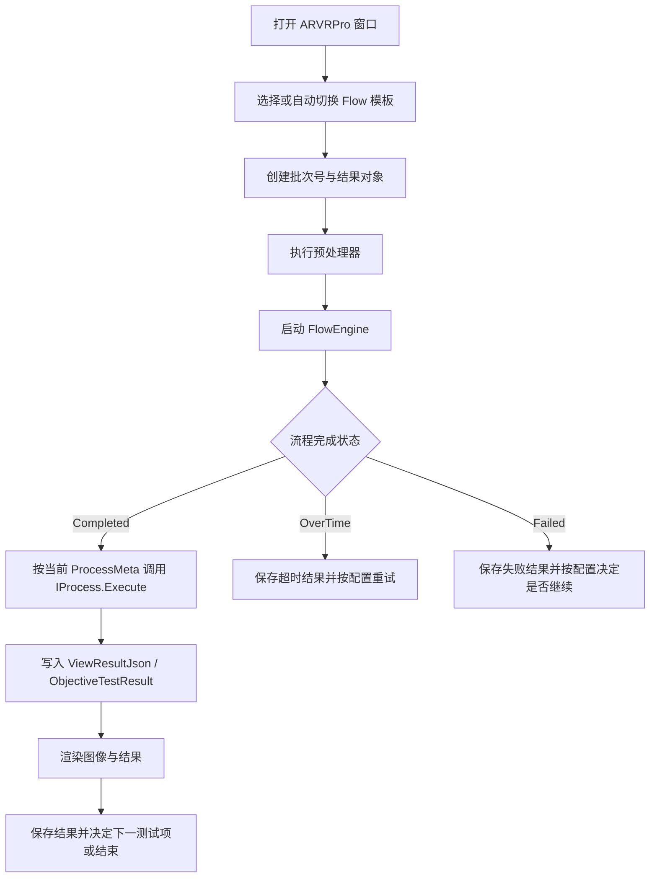

# ProjectARVRPro

## 概述

`ProjectARVRPro` 是面向 AR/VR 光学检测场景的专业化项目模块，采用 WPF 插件形态集成到 ColorVision 主程序中。它通过菜单项或功能入口启动独立窗口，结合 FlowEngine、数据库、MQTT、Socket、图像编辑器和可配置的自定义 `IProcess` 处理链，完成多步骤自动测试、判定、结果展示与对外结果回传。

代码入口见：

- `Projects/ProjectARVRPro/PluginConfig/ProjectARVRPlugin.cs:6`
- `Projects/ProjectARVRPro/PluginConfig/ProjectARVRMenu.cs:8`
- `Projects/ProjectARVRPro/ARVRWindow.xaml.cs:76`

## 启动方式

ProjectARVRPro 以插件方式暴露到主程序：

| 入口 | 位置 | 说明 |
|---|---|---|
| 功能启动器 | `Projects/ProjectARVRPro/PluginConfig/ProjectARVRPlugin.cs:6` | `Header => "ARVRPro"`，启动主窗口 |
| 工具菜单 | `Projects/ProjectARVRPro/PluginConfig/ProjectARVRMenu.cs:8` | 挂载到 Tool 菜单下，点击后打开主窗口 |
| 窗口单例 | `Projects/ProjectARVRPro/PluginConfig/ProjectWindowInstance.cs` | 保证同一时刻只保留一个 ARVRPro 窗口实例 |

## 主窗口职责

`ARVRWindow` 是 ProjectARVRPro 的运行中心，负责以下工作：

1. 初始化 FlowEngine 与节点编辑器。
2. 绑定流程模板、流程步骤栏和结果列表。
3. 管理 SN、StepIndex、批次号、运行耗时等测试上下文。
4. 触发流程执行、超时重试、失败处理和测试完成通知。
5. 在流程完成后调用 `IProcess` 进行业务解析、判定和结果可视化。
6. 在需要时通过 Socket 输出结构化测试结果。

关键实现见：

- `Projects/ProjectARVRPro/ARVRWindow.xaml.cs:175`
- `Projects/ProjectARVRPro/ARVRWindow.xaml.cs:335`
- `Projects/ProjectARVRPro/ARVRWindow.xaml.cs:465`
- `Projects/ProjectARVRPro/ARVRWindow.xaml.cs:598`

## 运行流程

补充说明：

- 每次运行前都会创建 `MeasureBatchModel` 批次记录。见 `Projects/ProjectARVRPro/ARVRWindow.xaml.cs:388`。
- 预处理会按模板匹配所有已启用项顺序执行。见 `Projects/ProjectARVRPro/ARVRWindow.xaml.cs:399`。
- 超时会记录 `FlowStatus.OverTime`，并在 `TryCountMax` 范围内自动重试。见 `Projects/ProjectARVRPro/ARVRWindow.xaml.cs:498`。
- 失败时可根据 `AllowTestFailures` 决定继续后续步骤还是直接回传失败。见 `Projects/ProjectARVRPro/ARVRWindow.xaml.cs:564`。

## Process 管理机制

ProjectARVRPro 通过 `IProcess` + `ProcessMeta` + `ProcessGroup` 实现“流程模板”和“业务判定逻辑”的解耦：

| 组件 | 位置 | 作用 |
|---|---|---|
| `IProcess` | `Projects/ProjectARVRPro/Process/IProcess.cs:7` | 定义执行、渲染、文本生成、配方/修正/配置读取接口 |
| `ProcessBase<TConfig>` | `Projects/ProjectARVRPro/Process/IProcess.cs:72` | 提供强类型配置与 JSON 反序列化能力 |
| `ProcessManager` | `Projects/ProjectARVRPro/Process/ProcessManager.cs:16` | 加载流程处理器、管理组、顺序、启停与持久化 |
| `ProcessManagerWindow` | `Projects/ProjectARVRPro/Process/ProcessManagerWindow.xaml.cs:32` | 提供流程组与步骤项配置 UI |

### 当前架构特点

- 支持 **多流程组**，并可切换当前激活组。
- 支持 **组复制、重命名、删除**。
- 支持步骤项 **增删改、上下移动、启停控制**。
- 步骤组配置持久化到 `ProcessGroups.json`。
- 历史 `ProcessMetas.json` 支持迁移到新格式。

相关实现见：

- `Projects/ProjectARVRPro/Process/ProcessManager.cs:34`
- `Projects/ProjectARVRPro/Process/ProcessManager.cs:142`
- `Projects/ProjectARVRPro/Process/ProcessManager.cs:193`
- `Projects/ProjectARVRPro/Process/ProcessManager.cs:398`
- `Projects/ProjectARVRPro/Process/ProcessManager.cs:508`

## 主要测试项

ProjectARVRPro 当前代码中的主要 `IProcess` 类型如下：

| 测试项 | 处理类 | 主要能力 |
|---|---|---|
| Black | `Projects/ProjectARVRPro/Process/Black/BlackProcess.cs` | 黑场 / FOFO 对比度判定 |
| Blue | `Projects/ProjectARVRPro/Process/Blue/BlueProcess.cs` | 蓝色画面亮度均匀性、色度均匀性、中心色度与亮度 |
| Green | `Projects/ProjectARVRPro/Process/Green/GreenProcess.cs` | 绿色画面亮度均匀性、色度均匀性、中心色度与亮度 |
| Red | `Projects/ProjectARVRPro/Process/Red/RedProcess.cs` | 红色画面亮度均匀性、色度均匀性、中心色度与亮度 |
| W25 | `Projects/ProjectARVRPro/Process/W25/W25Process.cs` | 25 灰阶/白场中心亮度与色坐标判定 |
| W255 | `Projects/ProjectARVRPro/Process/W255/White255Process.cs` | 白场 255 亮度、色度、均匀性与 FOV 综合判定 |
| W51 | `Projects/ProjectARVRPro/Process/W51/White51Process.cs` | 白场 51 阶相关判定 |
| Distortion | `Projects/ProjectARVRPro/Process/Distortion/DistortionProcess.cs` | TV distortion 判定 |
| Chessboard | `Projects/ProjectARVRPro/Process/Chessboard/ChessboardProcess.cs` | 棋盘格对比度判定 |
| OpticCenter | `Projects/ProjectARVRPro/Process/OpticCenter/OpticCenterProcess.cs` | 光轴/像心倾角与旋转校准判定 |
| MTFHV | `Projects/ProjectARVRPro/Process/MTFHV/MTFHVProcess.cs` | 多视场位置的水平/垂直 MTF 判定 |
| MTFHV048 | `Projects/ProjectARVRPro/Process/MTFHV048/MTFHV048Process.cs` | MTF HV 0.48F 测试 |
| MTFHV058 | `Projects/ProjectARVRPro/Process/MTFHV058/MTFHV058Process.cs` | MTF HV 0.58F 测试 |
| MTFH | `Projects/ProjectARVRPro/Process/MTFH/MTFHProcess.cs` | 水平 MTF 判定 |
| MTFV | `Projects/ProjectARVRPro/Process/MTFV/MTFVProcess.cs` | 垂直 MTF 判定 |
| MTF | `Projects/ProjectARVRPro/Process/MTF/MTFProcess.cs` | MTF 相关综合处理 |

## 配方、修正值与流程配置

ProjectARVRPro 的每个流程处理器可以同时暴露三类配置：

| 配置类型 | 用途 | 接口 |
|---|---|---|
| RecipeConfig | 上下限判定阈值 | `GetRecipeConfig()` |
| FixConfig | 系数修正、标定修正 | `GetFixConfig()` |
| ProcessConfig | 流程处理器自身行为配置 | `GetProcessConfig()` |

定义见：`Projects/ProjectARVRPro/Process/IProcess.cs:19`、`Projects/ProjectARVRPro/Process/IProcess.cs:28`、`Projects/ProjectARVRPro/Process/IProcess.cs:37`。

### 配方配置容器

`RecipeConfig` 使用 `Dictionary<Type, IRecipeConfig>` 延迟创建和缓存各测试项的配方对象：

- `Projects/ProjectARVRPro/Recipe/RecipeConfig.cs:7`
- `Projects/ProjectARVRPro/Recipe/RecipeConfig.cs:15`

这意味着：

- 新增测试项时，只要实现 `IRecipeConfig`，即可接入统一配方管理。
- 运行时按需获取具体配置，无需提前实例化全部对象。

### 代表性配方示例

| 配方类 | 位置 | 内容 |
|---|---|---|
| `MTFHVRecipeConfig` | `Projects/ProjectARVRPro/Process/MTFHV/MTFHVRecipeConfig.cs:8` | 定义中心点与 0.3F / 0.6F / 0.8F 多区域 H/V MTF 上下限 |
| `DistortionRecipeConfig` | `Projects/ProjectARVRPro/Process/Distortion/DistortionRecipeConfig.cs:8` | 定义水平/垂直 TV Distortion 上下限 |
| `W25RecipeConfig` | `Projects/ProjectARVRPro/Process/W25/W25RecipeConfig.cs:8` | 定义中心亮度、xy、uv 等上下限 |
| `BlackRecipeConfig` | `Projects/ProjectARVRPro/Process/Black/BlackRecipeConfig.cs:9` | 定义黑场 FOFOContrast 阈值 |
| `ChessboardRecipeConfig` | `Projects/ProjectARVRPro/Process/Chessboard/ChessboardRecipeConfig.cs:8` | 定义棋盘格对比度阈值 |

## 数据处理特点

### 1. 基于算法结果表进行二次业务判定

各 `IProcess` 普遍采用以下模式：

1. 根据批次号读取图像与算法主记录。
2. 从不同算法结果表中抽取业务值。
3. 应用 `FixConfig` 修正系数。
4. 使用 `RecipeConfig` 的上下限执行 PASS/FAIL 判定。
5. 写入 `ViewResultJson` 和 `ObjectiveTestResult`。

例如：

- `MTFHVProcess` 会解析 `ViewResultAlgType.MTF` 的明细结果。见 `Projects/ProjectARVRPro/Process/MTFHV/MTFHVProcess.cs:31`。
- `White255Process` 会综合 POI、PoiAnalysis、FOV、FindLightArea 等多类算法输出。见 `Projects/ProjectARVRPro/Process/W255/White255Process.cs:34`。
- `OpticCenterProcess` 同时兼容 `ARVR_BinocularFusion` 与 `FindCross` 两种结果来源。见 `Projects/ProjectARVRPro/Process/OpticCenter/OpticCenterProcess.cs:32`。

### 2. 图像叠加与结果渲染

部分流程会在 `Render` 中把点位、区域或提示信息绘制到图像编辑器上。例如：

- `White255Process.Render(...)` 会在图像上绘制 POI 标记和说明。见 `Projects/ProjectARVRPro/Process/W255/White255Process.cs:199`。

### 3. 结果文本生成

每个 `IProcess` 可通过 `GenText(...)` 生成摘要文本，便于界面展示、导出或调试。

## 结果管理

测试结果模型为 `ProjectARVRReuslt`：

- `Projects/ProjectARVRPro/ProjectARVRReuslt.cs:15`

它包含以下关键信息：

| 字段 | 说明 |
|---|---|
| `BatchId` | 对应批次记录 |
| `Model` | 当前流程模板名 |
| `SN` | 序列号 |
| `Code` | 批次编码 |
| `FlowStatus` | 流程执行状态 |
| `Result` | 最终判定结果 |
| `RunTime` | 运行耗时 |
| `Msg` | 执行信息或失败原因 |
| `ViewResultJson` | 结构化测试明细 |

右键菜单支持：

- 删除结果
- 复制
- 打开文件所在目录
- 查看流程结果查询
- 查看测试结果详情

实现见：`Projects/ProjectARVRPro/ProjectARVRReuslt.cs:20`。

## 与 ARVR 模板文档的关系

`docs/04-api-reference/algorithms/templates/arvr-template.md` 主要描述底层 ARVR 算法模板（如 MTF、FOV、Distortion、Ghost）的概念与参数。

而 `ProjectARVRPro` 更接近 **项目级测试编排与结果判定层**，特点包括：

| 层级 | 关注点 |
|---|---|
| ARVR 模板 | 单个算法模板如何配置、执行和输出 |
| ProjectARVRPro | 如何把多个模板串成产线测试步骤，并进行配方判定、修正、回传和可视化 |

因此在阅读文档时，建议把两者配合理解。

## 开发建议

如果需要为 ProjectARVRPro 扩展新的测试步骤，通常按下面路径进行：

1. 新增一个实现 `IProcess` 的处理器，优先继承 `ProcessBase<TConfig>`。
2. 按需新增对应的 `RecipeConfig` / `FixConfig` / `ProcessConfig`。
3. 在流程配置界面把新的处理器与某个 Flow 模板绑定。
4. 在 `Execute` 中从批次对应算法结果表提取数据，进行业务判定。
5. 在 `Render` 中补充图像叠加，在 `GenText` 中生成文本摘要。

## 相关文件

- `Projects/ProjectARVRPro/ARVRWindow.xaml.cs`
- `Projects/ProjectARVRPro/Process/ProcessManager.cs`
- `Projects/ProjectARVRPro/Process/IProcess.cs`
- `Projects/ProjectARVRPro/Recipe/RecipeConfig.cs`
- `Projects/ProjectARVRPro/ProjectARVRReuslt.cs`
- `docs/04-api-reference/algorithms/templates/arvr-template.md`
