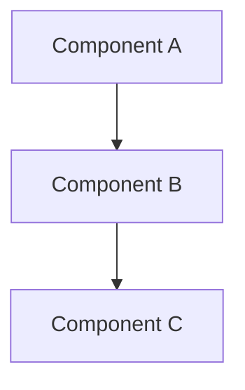

# Document Title

---
**Metadata:**
- Title: Document Title
- Status: draft | complete | in-progress
- Updated: YYYY-MM-DD
- Author: [Author Name]
---

## 简介

Brief description of the document's purpose and scope.

## 目录

1. [概述](#概述)
2. [结构图](#结构图)
3. [详细说明](#详细说明)
4. [扩展点](#扩展点)
5. [常见问题](#常见问题)
6. [参考资料](#参考资料)

## 概述

High-level overview of the topic covered in this document.

## 结构图

Include relevant diagrams using Mermaid syntax where applicable:



## 详细说明

### 子部分 1

Detailed explanation of the first major aspect.

### 子部分 2

Detailed explanation of the second major aspect.

## 扩展点

### 接口扩展

List of extension interfaces and their purposes:

| 接口名称 | 触发时机 | 线程上下文 | 返回值/约束 | 常见错误 |
|---------|----------|------------|-------------|----------|
| IExample | 示例时机 | 主线程 | void | 空引用异常 |

### 实现示例

```csharp
// Example implementation code
public class ExampleImplementation : IExample
{
    public void Execute()
    {
        // Implementation details
    }
}
```

## 常见问题

### 问题 1: 问题描述

**症状:** 具体症状描述

**原因:** 问题原因分析

**解决方案:** 详细解决步骤

## 参考资料

- [相关文档链接](link)
- [API 参考](link)
- [源代码示例](link)

---

*最后更新: [日期] | 状态: [状态]*