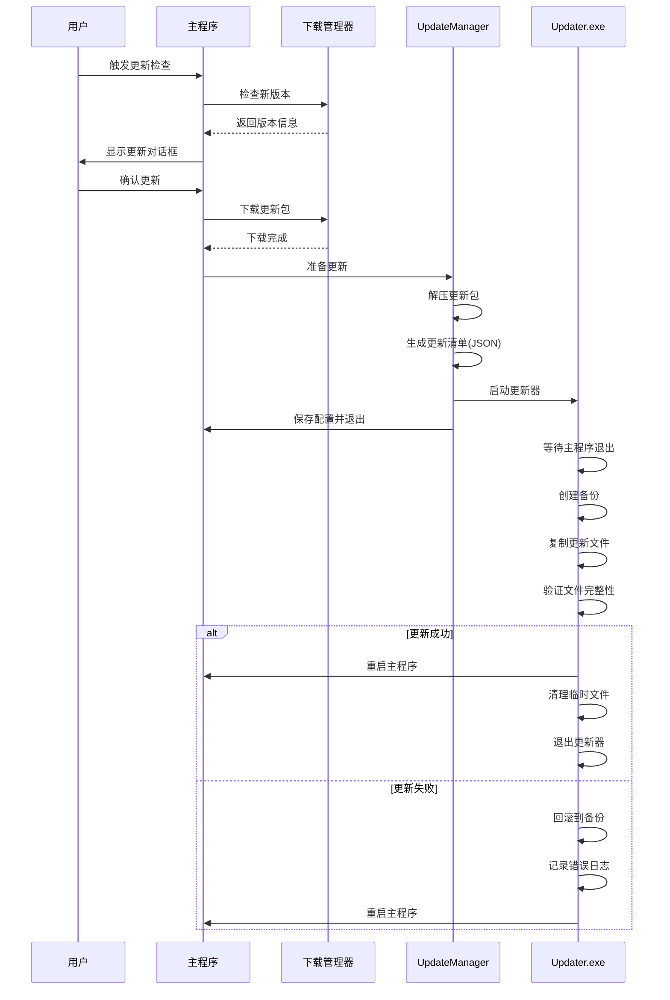
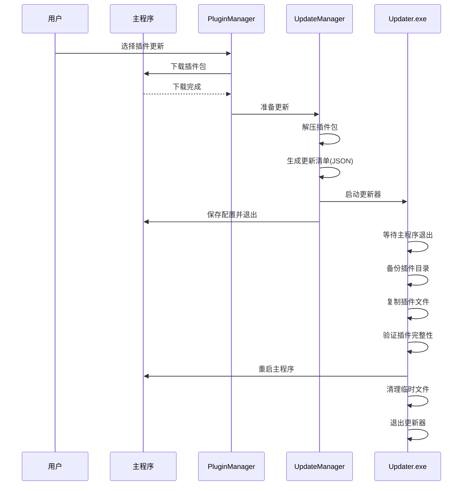

# ColorVision 更新机制重构设计方案

## 1. 背景与目标

### 1.1 现状问题

当前 ColorVision 及其插件系统使用 BAT 批处理脚本实现软件更新和重启，存在以下问题：

1. **平台限制**：批处理脚本仅支持 Windows，限制了未来跨平台扩展
2. **用户体验差**：
   - 更新时需要管理员权限会弹出 UAC 对话框，显示命令行窗口
   - 无法提供友好的进度提示
3. **可靠性不足**：
   - 错误处理能力有限
   - 无回滚机制，更新失败可能导致程序损坏
4. **维护困难**：
   - 批处理逻辑嵌入在 C# 代码中以字符串形式生成
   - 难以调试和测试
   - 代码分散在多个位置

### 1.2 设计目标

参考业界标准软件（Visual Studio、VS Code、PyCharm 等）的更新机制，设计并实现一套：

1. **专业可靠**：独立的更新器程序，职责单一，易于测试
2. **用户友好**：无干扰的后台更新，优雅的进度提示
3. **安全可控**：完整的备份和回滚机制，确保更新安全
4. **易于维护**：清晰的代码结构，完善的日志记录
5. **可扩展性**：支持未来的增量更新、差分更新等高级特性

## 2. 整体架构设计

### 2.1 组件架构

```
┌─────────────────────────────────────────────────────────────┐
│                      主应用程序层                            │
│                    (ColorVision.exe)                        │
│                                                             │
│  ┌──────────────┐  ┌──────────────┐  ┌──────────────┐     │
│  │  AutoUpdater │  │PluginUpdater │  │UpdateManager │     │
│  │   (应用更新)  │  │  (插件更新)   │  │   (协调器)   │     │
│  └──────┬───────┘  └──────┬───────┘  └──────┬───────┘     │
│         │                 │                 │              │
│         └─────────────────┴─────────────────┘              │
│                           │                                │
└───────────────────────────┼────────────────────────────────┘
                            │
                            │ 1. 下载更新包
                            │ 2. 解压到临时目录  
                            │ 3. 生成更新清单
                            │ 4. 启动更新器
                            │ 5. 退出主程序
                            ▼
┌─────────────────────────────────────────────────────────────┐
│                      更新器程序层                            │
│                   (ColorVision.Updater.exe)                 │
│                                                             │
│  ┌──────────────┐  ┌──────────────┐  ┌──────────────┐     │
│  │UpdateExecutor│  │ FileOperator │  │ProcessManager│     │
│  │  (核心逻辑)   │  │  (文件操作)   │  │  (进程管理)   │     │
│  └──────┬───────┘  └──────┬───────┘  └──────┬───────┘     │
│         │                 │                 │              │
│         └─────────────────┴─────────────────┘              │
│                           │                                │
│                           │ 6. 等待主程序退出               │
│                           │ 7. 备份当前版本                 │
│                           │ 8. 应用更新文件                 │
│                           │ 9. 验证完整性                   │
│                           │ 10. 重启主程序                  │
│                           │ 11. 清理临时文件                │
│                           ▼                                │
└─────────────────────────────────────────────────────────────┘
                       更新完成
```

### 2.2 核心流程

#### 应用程序更新流程



#### 插件更新流程



## 3. 详细设计

### 3.1 独立更新器程序 (ColorVision.Updater)

#### 3.1.1 项目结构

```
ColorVision.Updater/
├── Program.cs                 # 入口点，命令行参数解析
├── UpdateExecutor.cs          # 核心更新逻辑
├── UpdateManifest.cs          # 更新清单数据模型
├── FileOperations/
│   ├── FileOperator.cs        # 文件操作封装
│   ├── BackupManager.cs       # 备份管理
│   └── FileCopyHelper.cs      # 文件复制辅助
├── ProcessManagement/
│   ├── ProcessManager.cs      # 进程管理
│   └── ProcessWatcher.cs      # 进程监控
├── Logging/
│   └── UpdateLogger.cs        # 日志记录
└── app.manifest               # 清单文件（请求管理员权限）
```

#### 3.1.2 命令行接口设计

```bash
ColorVision.Updater.exe [options]

Options:
  --manifest <path>          # 必需：更新清单文件路径 (JSON)
  --pid <process-id>         # 可选：主程序进程ID，等待其退出
  --wait-timeout <seconds>   # 可选：等待进程退出的超时时间（默认60秒）
  --no-backup                # 可选：禁用备份（不推荐）
  --no-restart               # 可选：更新后不重启主程序
  --log-level <level>        # 可选：日志级别 (Debug|Info|Warning|Error)
  --help                     # 显示帮助信息
  --version                  # 显示版本信息

Example:
  ColorVision.Updater.exe --manifest "C:\Temp\update.json" --pid 1234
```

#### 3.1.3 更新清单格式 (UpdateManifest.json)

```json
{
  "version": "1.0",
  "updateType": "Application",  // Application | Plugin
  "updateInfo": {
    "version": "1.2.3.4",
    "name": "ColorVision",
    "description": "ColorVision 主程序更新"
  },
  "paths": {
    "sourcePath": "C:\\Temp\\ColorVisionUpdate\\ColorVision",
    "targetPath": "C:\\Program Files\\ColorVision",
    "backupPath": "C:\\ProgramData\\ColorVision\\Backup\\20250115_120000"
  },
  "executable": {
    "name": "ColorVision.exe",
    "arguments": "-c MenuPluginManager",  // 重启时的命令行参数
    "workingDirectory": ""  // 空表示使用目标路径
  },
  "options": {
    "createBackup": true,
    "verifyFiles": true,
    "restartAfterUpdate": true,
    "cleanupOnSuccess": true,
    "rollbackOnFailure": true
  },
  "files": [
    {
      "source": "ColorVision.exe",
      "target": "ColorVision.exe",
      "action": "Replace",  // Replace | Add | Delete
      "verify": true,
      "critical": true  // 关键文件，失败则回滚
    },
    {
      "source": "Plugins\\MyPlugin.dll",
      "target": "Plugins\\MyPlugin.dll",
      "action": "Replace",
      "verify": true,
      "critical": false
    }
  ],
  "timestamp": "2025-01-15T12:00:00Z",
  "signature": "SHA256_HASH_HERE"  // 可选：用于验证清单完整性
}
```

### 3.2 主程序更新协调器 (UpdateManager)

#### 3.2.1 类设计

```csharp
namespace ColorVision.Update
{
    /// <summary>
    /// 更新管理器 - 协调主程序和插件的更新流程
    /// </summary>
    public class UpdateManager
    {
        // 单例模式
        public static UpdateManager Instance { get; }
        
        // 配置
        public UpdateManagerConfig Config { get; }
        
        // 方法
        
        /// <summary>
        /// 准备应用程序更新
        /// </summary>
        /// <param name="updatePackagePath">更新包路径 (.zip)</param>
        /// <param name="isIncremental">是否为增量更新</param>
        /// <returns>更新清单路径</returns>
        public string PrepareApplicationUpdate(string updatePackagePath, bool isIncremental);
        
        /// <summary>
        /// 准备插件更新
        /// </summary>
        /// <param name="pluginPackagePaths">插件包路径列表</param>
        /// <returns>更新清单路径</returns>
        public string PreparePluginUpdate(params string[] pluginPackagePaths);
        
        /// <summary>
        /// 执行更新并重启
        /// </summary>
        /// <param name="manifestPath">更新清单路径</param>
        /// <param name="useOldBatMethod">是否使用旧的BAT方式（双轨并行期间）</param>
        public void ExecuteUpdate(string manifestPath, bool useOldBatMethod = false);
        
        /// <summary>
        /// 获取更新器程序路径
        /// </summary>
        private string GetUpdaterExecutablePath();
        
        /// <summary>
        /// 验证更新器程序是否存在
        /// </summary>
        private bool ValidateUpdaterExists();
        
        /// <summary>
        /// 从资源中提取更新器程序
        /// </summary>
        private void ExtractUpdaterFromResources();
    }
    
    /// <summary>
    /// 更新管理器配置
    /// </summary>
    public class UpdateManagerConfig : IConfig
    {
        /// <summary>
        /// 是否使用新的更新机制（双轨并行期间可切换）
        /// </summary>
        public bool UseNewUpdateMechanism { get; set; } = true;
        
        /// <summary>
        /// 更新器程序路径（默认为程序目录下的 ColorVision.Updater.exe）
        /// </summary>
        public string UpdaterPath { get; set; } = "";
        
        /// <summary>
        /// 是否启用备份
        /// </summary>
        public bool EnableBackup { get; set; } = true;
        
        /// <summary>
        /// 备份保留天数
        /// </summary>
        public int BackupRetentionDays { get; set; } = 7;
        
        /// <summary>
        /// 更新临时目录
        /// </summary>
        public string TempUpdateDirectory { get; set; } = 
            Path.Combine(Path.GetTempPath(), "ColorVisionUpdate");
    }
}
```

### 3.3 改造现有代码

#### 3.3.1 AutoUpdater.cs 改造

```csharp
// 旧方法（保留用于回退）
public static void RestartIsIncrementApplication_Old(string downloadPath)
{
    // ... 现有的 BAT 脚本实现 ...
}

// 新方法
public static void RestartIsIncrementApplication(string downloadPath)
{
    var config = UpdateManagerConfig.Instance;
    
    if (config.UseNewUpdateMechanism)
    {
        // 使用新的更新机制
        string manifestPath = UpdateManager.Instance.PrepareApplicationUpdate(
            downloadPath, 
            isIncremental: true
        );
        UpdateManager.Instance.ExecuteUpdate(manifestPath);
    }
    else
    {
        // 回退到旧方法
        RestartIsIncrementApplication_Old(downloadPath);
    }
}

// 同样改造 RestartApplication 方法
public static void RestartApplication(string downloadPath)
{
    var config = UpdateManagerConfig.Instance;
    
    if (config.UseNewUpdateMechanism)
    {
        string manifestPath = UpdateManager.Instance.PrepareApplicationUpdate(
            downloadPath, 
            isIncremental: false
        );
        UpdateManager.Instance.ExecuteUpdate(manifestPath);
    }
    else
    {
        RestartApplication_Old(downloadPath);
    }
}
```

#### 3.3.2 PluginUpdater.cs 改造

```csharp
public static void UpdatePlugin(params string[] downloadPaths)
{
    if (downloadPaths == null || downloadPaths.Length == 0) return;
    
    var config = UpdateManagerConfig.Instance;
    
    if (config.UseNewUpdateMechanism)
    {
        // 使用新的更新机制
        ConfigService.Instance.SaveConfigs();
        string manifestPath = UpdateManager.Instance.PreparePluginUpdate(downloadPaths);
        UpdateManager.Instance.ExecuteUpdate(manifestPath);
    }
    else
    {
        // 保持旧的实现
        UpdatePlugin_Old(downloadPaths);
    }
}

// 旧实现重命名
private static void UpdatePlugin_Old(params string[] downloadPaths)
{
    // ... 现有实现 ...
}
```

## 4. 实施计划

### 4.1 阶段 1：基础设施搭建（第 1-2 周）

**目标**：创建独立更新器程序和核心类库

- [ ] 创建 `ColorVision.Updater` 控制台项目
- [ ] 实现 `UpdateManifest` 数据模型（JSON 序列化/反序列化）
- [ ] 实现 `UpdateLogger` 日志记录器
- [ ] 实现 `ProcessManager` 进程管理器
- [ ] 实现 `FileOperator` 文件操作封装
- [ ] 实现 `BackupManager` 备份管理器
- [ ] 实现 `UpdateExecutor` 核心更新逻辑
- [ ] 实现命令行参数解析
- [ ] 添加 app.manifest 请求管理员权限
- [ ] 单元测试：测试各个组件

**交付物**：
- `ColorVision.Updater.exe` 可执行文件
- 单元测试项目
- 基础文档

### 4.2 阶段 2：集成到主程序（第 3-4 周）

**目标**：创建 UpdateManager 并集成到现有代码

- [ ] 创建 `UpdateManager` 类
- [ ] 创建 `UpdateManagerConfig` 配置类
- [ ] 将 `ColorVision.Updater.exe` 作为嵌入资源
- [ ] 实现更新器提取逻辑
- [ ] 实现 `PrepareApplicationUpdate` 方法
- [ ] 实现 `PreparePluginUpdate` 方法
- [ ] 实现 `ExecuteUpdate` 方法
- [ ] 添加配置界面切换新旧更新方式
- [ ] 改造 `AutoUpdater.RestartIsIncrementApplication`
- [ ] 改造 `AutoUpdater.RestartApplication`
- [ ] 改造 `PluginUpdater.UpdatePlugin`

**交付物**：
- 集成的主程序代码
- 配置切换界面
- 开发者文档

### 4.3 阶段 3：双轨并行测试（第 5-6 周）

**目标**：确保新旧方案都能正常工作

- [ ] 完整更新流程测试（新方案）
  - [ ] 测试完整应用程序更新
  - [ ] 测试增量应用程序更新
  - [ ] 测试单个插件更新
  - [ ] 测试多个插件批量更新
- [ ] 边界情况测试
  - [ ] 测试更新失败后回滚
  - [ ] 测试权限不足场景
  - [ ] 测试磁盘空间不足
  - [ ] 测试文件占用场景
- [ ] 兼容性测试
  - [ ] Windows 10 测试
  - [ ] Windows 11 测试
  - [ ] Program Files 目录测试
  - [ ] 自定义安装路径测试
- [ ] 性能测试
  - [ ] 大文件更新性能
  - [ ] 多文件更新性能
- [ ] 旧方案验证测试
  - [ ] 确保旧 BAT 方式仍然可用
- [ ] 用户体验测试
  - [ ] 更新进度提示
  - [ ] 错误提示友好性

**交付物**：
- 测试报告
- Bug 修复
- 用户手册

### 4.4 阶段 4：完全迁移（第 7 周）

**目标**：移除旧代码，完成迁移

- [ ] 将 `UseNewUpdateMechanism` 默认值改为 `true`
- [ ] 移除配置切换界面（或标记为高级选项）
- [ ] 标记旧方法为 `[Obsolete]`
- [ ] 收集用户反馈
- [ ] 稳定运行 2 周无重大问题

### 4.5 阶段 5：清理与优化（第 8 周）

**目标**：移除遗留代码，优化性能

- [ ] 完全删除旧的 BAT 脚本生成代码
- [ ] 删除 `_Old` 后缀的方法
- [ ] 删除 `UseNewUpdateMechanism` 配置项
- [ ] 代码清理和优化
- [ ] 文档更新
- [ ] 发布正式版本

## 5. 技术要点

### 5.1 权限处理

**问题**：更新程序文件通常需要管理员权限

**解决方案**：
1. `ColorVision.Updater.exe` 内嵌 manifest 请求管理员权限
2. 主程序启动更新器时，如果安装在 Program Files，会自动触发 UAC 提示
3. 用户授权后，更新器以管理员身份运行，可以修改文件

```xml
<!-- ColorVision.Updater app.manifest -->
<requestedExecutionLevel level="requireAdministrator" uiAccess="false" />
```

### 5.2 进程同步

**问题**：确保主程序完全退出后才开始更新

**解决方案**：
1. 主程序传递自己的进程 ID 给更新器
2. 更新器使用 `Process.WaitForExit()` 等待主程序退出
3. 设置超时机制（默认 60 秒）
4. 超时后强制终止进程（可选）

```csharp
// UpdateExecutor.cs
private async Task WaitForProcessExit(int processId, int timeoutSeconds = 60)
{
    try
    {
        var process = Process.GetProcessById(processId);
        var timeout = TimeSpan.FromSeconds(timeoutSeconds);
        
        if (!process.WaitForExit((int)timeout.TotalMilliseconds))
        {
            _logger.Warning($"进程 {processId} 未在 {timeoutSeconds} 秒内退出，尝试强制终止");
            process.Kill();
            await Task.Delay(1000); // 等待进程完全终止
        }
    }
    catch (ArgumentException)
    {
        // 进程已不存在
        _logger.Info($"进程 {processId} 已退出");
    }
}
```

### 5.3 备份与回滚

**备份策略**：
1. 备份目录命名：`ColorVisionBackup_yyyyMMdd_HHmmss`
2. 仅备份被替换的文件（节省空间）
3. 定期清理旧备份（保留最近 N 天）

**回滚策略**：
1. 更新失败时自动回滚
2. 回滚失败记录详细日志
3. 提供手动回滚工具

```csharp
// BackupManager.cs
public class BackupManager
{
    public string CreateBackup(string targetPath, List<string> filesToBackup)
    {
        var timestamp = DateTime.Now.ToString("yyyyMMdd_HHmmss");
        var backupPath = Path.Combine(
            Path.GetDirectoryName(targetPath), 
            $"ColorVisionBackup_{timestamp}"
        );
        
        Directory.CreateDirectory(backupPath);
        
        foreach (var file in filesToBackup)
        {
            var sourcePath = Path.Combine(targetPath, file);
            var destPath = Path.Combine(backupPath, file);
            
            if (File.Exists(sourcePath))
            {
                Directory.CreateDirectory(Path.GetDirectoryName(destPath));
                File.Copy(sourcePath, destPath, true);
            }
        }
        
        return backupPath;
    }
    
    public bool Rollback(string backupPath, string targetPath)
    {
        try
        {
            // 复制备份文件回目标路径
            foreach (var file in Directory.GetFiles(backupPath, "*", SearchOption.AllDirectories))
            {
                var relativePath = Path.GetRelativePath(backupPath, file);
                var targetFile = Path.Combine(targetPath, relativePath);
                
                Directory.CreateDirectory(Path.GetDirectoryName(targetFile));
                File.Copy(file, targetFile, true);
            }
            return true;
        }
        catch (Exception ex)
        {
            _logger.Error($"回滚失败: {ex.Message}");
            return false;
        }
    }
}
```

### 5.4 文件验证

**验证策略**：
1. 使用 SHA256 计算文件哈希
2. 在清单中包含预期哈希值
3. 复制后验证哈希是否匹配
4. 关键文件验证失败则回滚

```csharp
// FileOperator.cs
public bool VerifyFile(string filePath, string expectedHash)
{
    using var sha256 = SHA256.Create();
    using var stream = File.OpenRead(filePath);
    
    var hashBytes = sha256.ComputeHash(stream);
    var actualHash = BitConverter.ToString(hashBytes).Replace("-", "").ToLowerInvariant();
    
    return actualHash.Equals(expectedHash, StringComparison.OrdinalIgnoreCase);
}
```

### 5.5 日志记录

**日志策略**：
1. 独立的日志文件：`ColorVision.Updater.log`
2. 记录所有关键操作
3. 包含时间戳、级别、消息
4. 更新完成后可被主程序读取和展示

```csharp
// UpdateLogger.cs
public class UpdateLogger
{
    private readonly string _logFilePath;
    
    public void Info(string message) => Log("INFO", message);
    public void Warning(string message) => Log("WARN", message);
    public void Error(string message) => Log("ERROR", message);
    
    private void Log(string level, string message)
    {
        var logEntry = $"[{DateTime.Now:yyyy-MM-dd HH:mm:ss}] [{level}] {message}";
        File.AppendAllText(_logFilePath, logEntry + Environment.NewLine);
        Console.WriteLine(logEntry);
    }
}
```

## 6. 风险与缓解

| 风险 | 影响 | 概率 | 缓解措施 |
|-----|------|------|---------|
| 新方案存在未发现的 bug | 高 | 中 | • 充分测试<br>• 双轨并行运行<br>• 保留旧方案作为后备 |
| 更新器被杀毒软件误报 | 中 | 低 | • 代码签名<br>• 向主流杀毒厂商申报白名单 |
| 权限不足导致更新失败 | 中 | 低 | • 清晰的错误提示<br>• 引导用户以管理员身份运行 |
| 更新过程中断电或崩溃 | 高 | 极低 | • 备份机制<br>• 下次启动时检测并恢复 |
| 用户手动删除更新器文件 | 低 | 低 | • 启动时检查并重新提取 |
| 更新包损坏 | 中 | 低 | • 下载后验证完整性<br>• 支持断点续传 |

## 7. 性能指标

| 指标 | 目标 | 测量方法 |
|-----|------|---------|
| 更新器启动时间 | < 2 秒 | 从启动到开始复制文件的时间 |
| 小更新（< 10MB）完成时间 | < 10 秒 | 从触发更新到程序重启的总时间 |
| 大更新（> 100MB）完成时间 | < 60 秒 | 从触发更新到程序重启的总时间 |
| 备份创建时间 | < 文件复制时间的 50% | 备份操作耗时 vs 更新操作耗时 |
| 内存占用 | < 100MB | 更新器进程的峰值内存 |
| 更新成功率 | > 99% | 统计所有更新操作的成功率 |

## 8. 兼容性与迁移

### 8.1 向后兼容性

- **新旧并行**：双轨并行阶段，用户可选择使用新或旧方案
- **配置迁移**：自动迁移现有更新配置到新格式
- **数据保留**：更新过程不影响用户数据和配置

### 8.2 迁移检查清单

在完全移除旧代码前，确认：

- [ ] 所有场景测试通过（应用更新、插件更新）
- [ ] 在真实环境中稳定运行至少 2 周
- [ ] 没有用户报告重大更新问题
- [ ] 所有文档已更新
- [ ] 旧代码标记为 `[Obsolete]` 至少 1 个版本周期

## 9. 未来扩展

### 9.1 增量更新优化

当前增量更新仍然需要下载完整的更新包。未来可以：

1. **差分算法**：使用 bsdiff 等算法生成二进制差分文件
2. **智能下载**：仅下载变化的文件
3. **断点续传**：支持大文件的断点续传

### 9.2 自动更新

参考 Chrome、VS Code 的静默更新：

1. **后台下载**：在用户使用软件时后台下载
2. **下次启动更新**：下载完成后，下次启动时应用更新
3. **可选策略**：用户可选择立即更新、下次启动更新、手动更新

### 9.3 跨平台支持

为未来跨平台做准备：

1. **抽象文件操作**：使用 .NET 的跨平台 API
2. **平台检测**：根据操作系统选择合适的权限请求方式
3. **Linux/macOS 支持**：使用 Shell 脚本或原生更新机制

## 10. 总结

本方案通过引入独立的更新器程序，彻底解决了现有 BAT 脚本方案的问题，实现了：

1. ✅ **专业可靠**：职责清晰的独立更新器
2. ✅ **用户友好**：无干扰的后台更新流程
3. ✅ **安全可控**：完整的备份和回滚机制
4. ✅ **易于维护**：清晰的代码结构和日志
5. ✅ **可扩展性**：为未来功能预留空间

通过分阶段实施和双轨并行策略，降低了迁移风险，确保了平稳过渡。

---

**文档版本**：1.0  
**创建日期**：2025-01-15  
**作者**：ColorVision 开发团队  
**审阅状态**：待审阅
