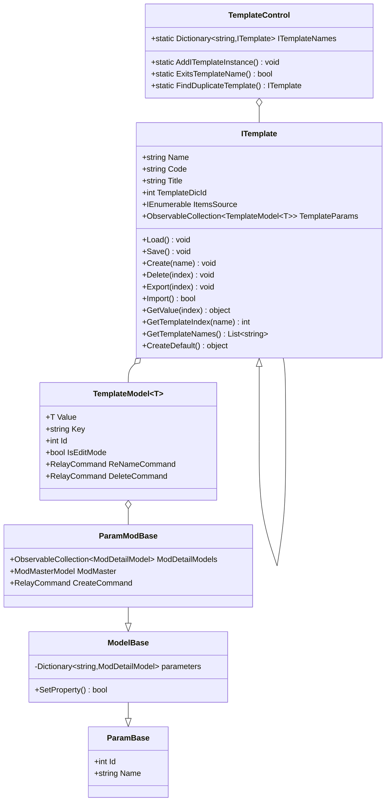
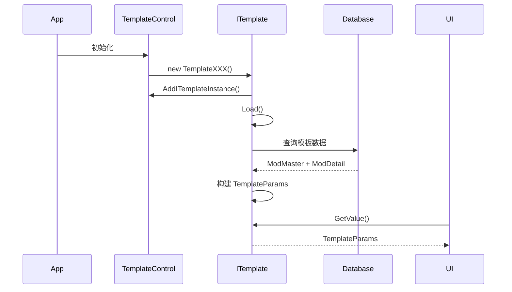
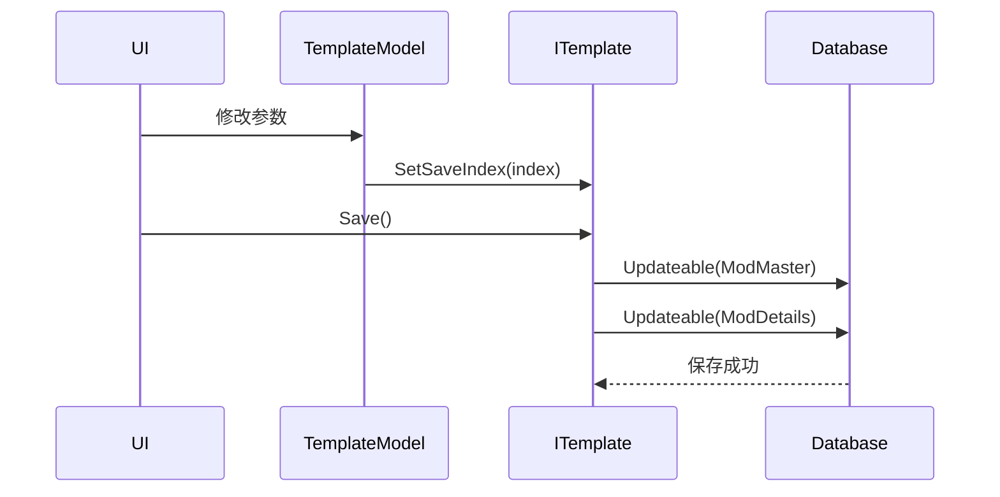
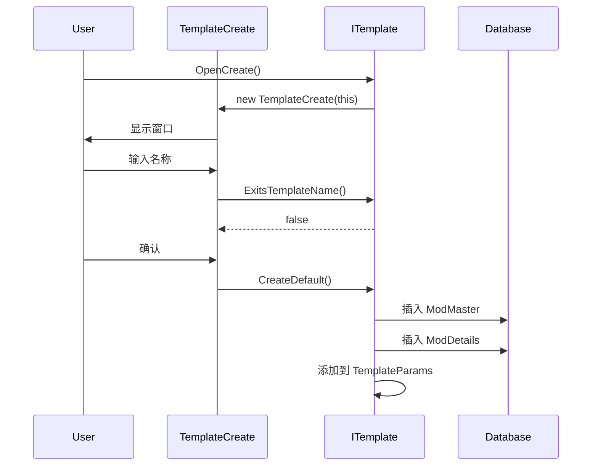

# Templates 模板系统架构

## 概述

Templates 模板系统是 ColorVision.Engine 的核心子系统，负责管理所有算法参数、流程配置和设备设置。该系统采用插件化设计，支持动态扩展，已实现 317 个 C# 文件，涵盖 45 个不同的算法和功能模块。

## 目录结构

```
Templates/
├── 核心框架 (8个文件)
│   ├── ITemplate.cs                    # 模板基类和泛型模板接口
│   ├── TemplateModel.cs                # 模板项模型
│   ├── TemplateControl.cs              # 模板控制中心
│   ├── ParamModBase.cs                 # 参数模型基类
│   ├── ModelBase.cs                    # 模型基类
│   ├── TemplatesExtension.cs           # 扩展方法
│   ├── SearchProvider.cs               # 搜索提供者
│   └── CVOLEDCOLOR.cs                  # 色彩相关
│
├── UI组件 (6个文件)
│   ├── TemplateManagerWindow.xaml      # 模板管理器主窗口
│   ├── TemplateEditorWindow.xaml       # 模板编辑器窗口
│   ├── TemplateCreate.xaml             # 模板创建窗口
│   ├── TemplateSettingEdit.xaml        # 模板设置编辑
│   └── CreateModeDetail.xaml           # 创建模式详情
│
├── ARVR/ (5个子模块, ~50个文件)
│   ├── MTF/                            # 调制传递函数
│   ├── SFR/                            # 空间频率响应
│   ├── FOV/                            # 视场角
│   ├── Distortion/                     # 畸变分析
│   └── Ghost/                          # 鬼影检测
│
├── POI/ (6个子模块, ~60个文件)
│   ├── BuildPoi/                       # POI构建
│   ├── POIFilters/                     # POI滤波器
│   ├── POIGenCali/                     # POI生成校准
│   ├── POIRevise/                      # POI修正
│   ├── POIOutput/                      # POI输出
│   └── AlgorithmImp/                   # 算法实现
│
├── Jsons/ (16个子模块, ~80个文件)       # JSON通用模板
│   ├── MTF2/                           # MTF v2
│   ├── SFR/                            # SFR v2
│   ├── FOV2/                           # FOV v2
│   ├── Distortion2/                    # Distortion v2
│   ├── Ghost2/                         # Ghost v2
│   ├── LedCheck2/                      # LED检查 v2
│   ├── LEDStripDetectionV2/            # LED灯带检测 v2
│   ├── HDR/                            # 高动态范围
│   ├── BlackMura/                      # 黑斑检测
│   ├── BinocularFusion/                # 双目融合
│   ├── AAFindPoints/                   # AA查找点
│   ├── FindCross/                      # 查找十字
│   ├── KB/                             # KB算法
│   ├── PoiAnalysis/                    # POI分析
│   ├── BuildPOIAA/                     # 构建POI AA
│   └── SFRFindROI/                     # SFR查找ROI
│
├── 图像处理 (~30个文件)
│   ├── LEDStripDetection/              # LED灯带检测
│   ├── LedCheck/                       # LED检查
│   ├── ImageCropping/                  # 图像裁剪
│   └── FindLightArea/                  # 光源区域查找
│
├── 分析算法 (~40个文件)
│   ├── JND/                            # 最小可察觉差异
│   ├── Compliance/                     # 合规性检查
│   ├── Matching/                       # 图像匹配
│   └── Validate/                       # 验证算法
│
├── 业务模块 (~30个文件)
│   ├── BuzProduct/                     # 业务产品
│   ├── DataLoad/                       # 数据加载
│   ├── FocusPoints/                    # 对焦点
│   └── SysDictionary/                  # 系统字典
│
├── Flow/ (~15个文件)                    # 流程管理
└── Menus/ (~10个文件)                   # 菜单集成
```

**统计信息**：
- 总文件数：317 个 C# 文件
- 子目录数：45 个
- 核心框架：14 个文件
- 算法模板：303 个文件

## 核心架构

### 类层次结构



### 设计模式

#### 1. 泛型模板模式

使用泛型确保类型安全：

```csharp
// 定义参数类
public class MTFParam : ParamModBase
{
    public double FrequencyThreshold { get; set; }
    // ... 其他参数
}

// 定义模板类
public class TemplateMTF : ITemplate<MTFParam>
{
    public TemplateMTF()
    {
        Title = "MTF模板";
        Code = "MTF";
        TemplateDicId = 100; // 系统字典ID
    }
}
```

#### 2. 命令模式

所有操作通过命令封装：

```csharp
public class TemplateModel<T>
{
    public RelayCommand ReNameCommand { get; set; }
    public RelayCommand DeleteCommand { get; set; }
    public RelayCommand CopyNameCommand { get; set; }
}
```

#### 3. 观察者模式

使用 ObservableCollection 实现数据绑定：

```csharp
public ObservableCollection<TemplateModel<T>> TemplateParams { get; set; }
```

#### 4. 策略模式

通过虚方法实现不同模板的自定义行为：

```csharp
public virtual void Create(string templateName) { }
public virtual UserControl GetUserControl() { }
public virtual bool ImportFile(string filePath) { }
```

## 数据流

### 模板加载流程



### 模板保存流程



### 模板创建流程



## 核心接口

### ITemplate 接口

```csharp
public class ITemplate
{
    // 基本属性
    public string Name { get; set; }              // 模板名称
    public string Code { get; set; }              // 模板代码
    public string Title { get; set; }             // 模板标题
    public int TemplateDicId { get; set; }        // 字典ID
    public bool IsSideHide { get; set; }          // 是否隐藏侧边栏
    public string InitialDirectory { get; set; }   // 初始目录
    
    // 数据访问
    public virtual IEnumerable ItemsSource { get; }
    public virtual int Count { get; }
    public virtual IEnumerable GetValue()
    public virtual object GetValue(int index)
    public virtual object GetParamValue(int index)
    public virtual object CreateDefault()
    
    // 模板管理
    public virtual List<string> GetTemplateNames()
    public virtual string GetTemplateName(int index)
    public virtual int GetTemplateIndex(string templateName)
    
    // 生命周期
    public virtual void Load()
    public virtual void Save()
    public virtual void Create(string templateName)
    public virtual void Delete(int index)
    
    // 导入导出
    public virtual void Export(int index)
    public virtual bool Import()
    public virtual bool ImportFile(string filePath)
    public virtual bool CopyTo(int index)
    
    // UI交互
    public virtual void OpenCreate()
    public virtual void PreviewMouseDoubleClick(int index)
    public virtual UserControl GetUserControl()
    public virtual UserControl CreateUserControl()
    public virtual void SetUserControlDataContext(int index)
    
    // 数据库操作
    public virtual IMysqlCommand? GetMysqlCommand()
    
    // 工具方法
    public bool ExitsTemplateName(string templateName)
    public string NewCreateFileName(string fileName)
    public void SetSaveIndex(int index)
}
```

### ITemplate\<T\> 泛型实现

```csharp
public class ITemplate<T> : ITemplate where T : ParamModBase, new()
{
    public ObservableCollection<TemplateModel<T>> TemplateParams { get; set; }
    
    public override Type GetTemplateType => typeof(T);
    
    public int FindIndex(int id) => TemplateParams.ToList()
        .FindIndex(a => a.Id == id);
    
    public override int Count => TemplateParams.Count;
    
    public override IEnumerable GetValue() => TemplateParams;
    
    public override object GetParamValue(int index) 
        => TemplateParams[index].Value;
    
    public override object GetValue(int index) 
        => TemplateParams[index];
    
    public override IEnumerable ItemsSource => TemplateParams;
    
    public override string GetTemplateName(int index) 
        => TemplateParams[index].Key;
    
    public override List<string> GetTemplateNames() 
        => TemplateParams.Select(a => a.Key).ToList();
    
    public override int GetTemplateIndex(string templateName)
        => TemplateParams
            .Select((template, index) => new { template, index })
            .FirstOrDefault(t => t.template.Key == templateName)?.index ?? -1;
}
```

## 模板分类详解

### 1. ARVR 算法模板

专门用于 AR/VR 设备的图像质量分析：

#### MTF (Modulation Transfer Function)
- **文件**: `ARVR/MTF/`
- **参数类**: `MTFParam`
- **模板类**: `TemplateMTF`
- **功能**: 测量光学系统的调制传递函数
- **主要参数**: 频率、对比度、分辨率等

#### SFR (Spatial Frequency Response)
- **文件**: `ARVR/SFR/`
- **参数类**: `SFRParam`
- **模板类**: `TemplateSFR`
- **功能**: 空间频率响应测试
- **主要参数**: 边缘检测阈值、采样率等

#### FOV (Field of View)
- **文件**: `ARVR/FOV/`
- **参数类**: `FOVParam`
- **模板类**: `TemplateFOV`
- **功能**: 视场角测量
- **主要参数**: 角度范围、测量点数等

#### Distortion (畸变分析)
- **文件**: `ARVR/Distortion/`
- **参数类**: `DistortionParam`
- **模板类**: `TemplateDistortionParam`
- **功能**: 光学畸变分析和校正
- **主要参数**: 畸变系数、校正模型等

#### Ghost (鬼影检测)
- **文件**: `ARVR/Ghost/`
- **参数类**: `GhostParam`
- **模板类**: `TemplateGhost`
- **功能**: 检测光学系统中的鬼影
- **主要参数**: 检测阈值、区域设置等

### 2. POI 兴趣点模板

用于关键点的检测、分析和处理：

- **BuildPoi**: POI 自动构建算法
- **POIFilters**: POI 数据滤波和去噪
- **POIGenCali**: POI 生成和校准流程
- **POIRevise**: POI 位置修正算法
- **POIOutput**: POI 结果输出格式化
- **AlgorithmImp**: 底层算法实现

### 3. 图像处理模板

#### LEDStripDetection
- **功能**: LED 灯带的自动检测和定位
- **应用场景**: 显示屏质量检测

#### LedCheck
- **功能**: LED 状态检查（亮度、色度）
- **应用场景**: LED 模块质量控制

#### ImageCropping
- **功能**: 图像智能裁剪
- **应用场景**: 预处理、ROI 提取

#### FindLightArea
- **功能**: 光源区域自动识别
- **应用场景**: 光学测试、光源定位

### 4. 分析算法模板

#### JND (Just Noticeable Difference)
- **功能**: 最小可察觉差异分析
- **应用场景**: 显示质量评估

#### Compliance
- **子模块**: ComplianceY, ComplianceXYZ, ComplianceJND
- **功能**: 合规性验证和标准符合性检查
- **应用场景**: 产品质量认证

#### Matching
- **功能**: 图像特征匹配
- **应用场景**: 模板匹配、缺陷检测

#### Validate
- **功能**: 数据验证算法
- **应用场景**: 结果验证、质量控制

### 5. 流程模板

- **FlowParam**: 流程参数定义
- **TemplateFlow**: 流程模板实现
- **FlowEngineManager**: 流程引擎管理
- **FlowControl**: 流程控制逻辑
- **FlowEditor**: 可视化流程编辑器

### 6. JSON 通用模板

基于 JSON 配置的动态模板系统，提供更灵活的参数配置方式。每个模块都包含：
- JSON 配置文件定义
- 参数验证逻辑
- 动态 UI 生成
- 结果解析器

## 数据模型

### 数据库表结构

#### ModMaster 模板主表

```sql
CREATE TABLE t_scgd_sys_modmaster (
    id INT PRIMARY KEY AUTO_INCREMENT,
    name VARCHAR(255) NOT NULL,           -- 模板名称
    type INT,                              -- 模板类型
    create_date DATETIME,                  -- 创建时间
    sys_resource_id INT,                   -- 系统资源ID
    pid INT,                               -- 父模板ID
    remark TEXT,                           -- 备注
    tenant_id INT,                         -- 租户ID
    is_delete BOOLEAN DEFAULT 0            -- 删除标记
);
```

#### ModDetail 模板详情表

```sql
CREATE TABLE t_scgd_sys_moddetail (
    id INT PRIMARY KEY AUTO_INCREMENT,
    pid INT,                               -- 模板主表ID
    sys_pid INT,                           -- 系统字典ID
    value_a VARCHAR(255),                  -- 参数值A (当前值)
    value_b VARCHAR(255),                  -- 参数值B (历史值)
    create_date DATETIME,                  -- 创建时间
    FOREIGN KEY (pid) REFERENCES t_scgd_sys_modmaster(id)
);
```

#### SysDictionaryModDetai 系统字典表

```sql
CREATE TABLE t_scgd_sys_dictionary_mod_detail (
    id INT PRIMARY KEY AUTO_INCREMENT,
    pid INT,                               -- 父字典ID
    code VARCHAR(100),                     -- 参数代码
    symbol VARCHAR(100),                   -- 参数符号
    name VARCHAR(255),                     -- 参数名称
    default_value VARCHAR(255),            -- 默认值
    remark TEXT                            -- 说明
);
```

### 对象关系映射

```csharp
// 模板主表模型
public class ModMasterModel
{
    public int Id { get; set; }
    public string Name { get; set; }
    public int Type { get; set; }
    public string CreateDate { get; set; }
    public int SysResourceId { get; set; }
    public int Pid { get; set; }
    public string Remark { get; set; }
    public int TenantId { get; set; }
    public bool IsDelete { get; set; }
}

// 模板详情模型
public class ModDetailModel
{
    public int Id { get; set; }
    public int Pid { get; set; }
    public int SysPid { get; set; }
    public string ValueA { get; set; }  // 当前值
    public string ValueB { get; set; }  // 之前值
    public string CreateDate { get; set; }
}

// 系统字典模型
public class SysDictionaryModDetaiModel
{
    public int Id { get; set; }
    public int Pid { get; set; }
    public string Code { get; set; }
    public string Symbol { get; set; }
    public string Name { get; set; }
    public string DefaultValue { get; set; }
    public string Remark { get; set; }
}
```

## UI 组件

### TemplateManagerWindow 模板管理器

**功能**：
- 显示所有已注册的模板类型
- 提供全局搜索功能
- 快速打开模板编辑器

**主要特性**：
- 支持多关键词搜索
- 支持 GUID 搜索
- 键盘导航支持
- 双击打开编辑器

```csharp
// 使用示例
var manager = new TemplateManagerWindow();
manager.Owner = Application.Current.MainWindow;
manager.Show();
```

### TemplateEditorWindow 模板编辑器

**功能**：
- 编辑特定类型的所有模板实例
- 创建、删除、复制模板
- 导入导出模板
- 搜索和筛选模板

**布局模式**：
1. **标准模式**: 左侧列表 + 右侧属性编辑器
2. **用户控件模式**: 使用自定义 UserControl

```csharp
// 打开编辑器
var editor = new TemplateEditorWindow(template);
editor.Show();

// 打开并选中特定模板
var editor = new TemplateEditorWindow(template, selectedIndex);
editor.Show();
```

### TemplateCreate 模板创建窗口

**功能**：
- 新建空白模板
- 从文件导入模板
- 选择预设模板

**创建流程**：
1. 选择模板来源（默认/文件）
2. 输入模板名称
3. 验证名称唯一性
4. 创建模板实例

```csharp
// 使用示例
var create = new TemplateCreate(template, isImport: false);
create.ShowDialog();
```

## 搜索功能

### SearchProvider 集成

模板系统通过 SearchProvider 集成到全局搜索：

```csharp
public class SearchProvider : ISearchProvider
{
    public IEnumerable<ISearch> GetSearchItems()
    {
        var templateNames = TemplateControl.ITemplateNames.Values
            .SelectMany(item => item.GetTemplateNames())
            .Distinct()
            .ToList();
            
        foreach (var name in templateNames)
        {
            yield return new SearchMeta
            {
                Type = SearchType.File,
                Header = name,
                Command = new RelayCommand(a =>
                {
                    var template = TemplateControl.FindDuplicateTemplate(name);
                    if (template != null)
                    {
                        int index = template.GetTemplateIndex(name);
                        if (template.IsSideHide)
                        {
                            template.PreviewMouseDoubleClick(index);
                        }
                        else
                        {
                            new TemplateEditorWindow(template, index).Show();
                        }
                    }
                })
            };
        }
    }
}
```

### 搜索特性

- **全局搜索**: 在任何界面快速搜索模板
- **多关键词**: 支持空格分隔的多个关键词
- **模糊匹配**: 不区分大小写的包含匹配
- **GUID 支持**: 可通过模板 GUID 搜索

## 扩展机制

### 创建新模板类型

#### 步骤1: 定义参数类

```csharp
public class MyParam : ParamModBase
{
    public MyParam() { }
    
    public MyParam(ModMasterModel master, List<ModDetailModel> details)
        : base(master, details)
    {
        // 从 details 加载参数值
    }
    
    public double Threshold { get; set; }
    public int Mode { get; set; }
    // ... 其他参数
}
```

#### 步骤2: 定义模板类

```csharp
public class TemplateMyAlgorithm : ITemplate<MyParam>
{
    public TemplateMyAlgorithm()
    {
        Title = "我的算法";
        Code = "MyAlg";
        TemplateDicId = 200; // 在系统字典中配置
    }
    
    public override void Load()
    {
        // 从数据库加载模板
        var masters = Db.Queryable<ModMasterModel>()
            .Where(a => a.Pid == TemplateDicId && !a.IsDelete)
            .ToList();
            
        foreach (var master in masters)
        {
            var details = Db.Queryable<ModDetailModel>()
                .Where(a => a.Pid == master.Id)
                .ToList();
                
            var param = new MyParam(master, details);
            TemplateParams.Add(new TemplateModel<MyParam>(master.Name, param));
        }
    }
}
```

#### 步骤3: 注册模板

```csharp
// 在应用启动时自动注册
public class MyTemplateInitializer : IITemplateLoad
{
    public int Order => 100;
    
    public void Load()
    {
        var template = new TemplateMyAlgorithm();
        template.Load();
    }
}
```

### 自定义用户控件

```csharp
public class TemplateMyAlgorithm : ITemplate<MyParam>
{
    public TemplateMyAlgorithm()
    {
        // ...
        IsUserControl = true; // 启用自定义控件模式
    }
    
    public override UserControl GetUserControl()
    {
        return new MyAlgorithmControl();
    }
    
    public override void SetUserControlDataContext(int index)
    {
        var control = (MyAlgorithmControl)GetUserControl();
        control.DataContext = TemplateParams[index].Value;
    }
}
```

## 性能优化

### 1. 延迟加载

模板数据采用延迟加载策略：

```csharp
public override void Load()
{
    // 只在需要时加载
    if (TemplateParams.Count == 0)
    {
        // 加载逻辑
    }
}
```

### 2. 批量保存

使用批量索引机制减少数据库操作：

```csharp
public List<int> SaveIndex { get; set; } = new List<int>();

public void SetSaveIndex(int index)
{
    if (!SaveIndex.Contains(index))
        SaveIndex.Add(index);
}

public override void Save()
{
    foreach (var index in SaveIndex)
    {
        Save(TemplateParams[index]);
    }
    SaveIndex.Clear();
}
```

### 3. 缓存机制

使用 SymbolCache 缓存系统字典：

```csharp
public class SymbolCache
{
    public static SymbolCache Instance { get; set; }
    public ConcurrentDictionary<int, SysDictionaryModDetaiModel> Cache { get; set; }
    
    public SymbolCache()
    {
        // 启动时加载所有字典项
        MySqlControl.GetInstance().DB
            .Queryable<SysDictionaryModDetaiModel>()
            .ToList()
            .ForEach(item => Cache.TryAdd(item.Id, item));
    }
}
```

## 最佳实践

### 1. 命名规范

- **模板类**: `Template{功能名}`，如 `TemplateMTF`
- **参数类**: `{功能名}Param`，如 `MTFParam`
- **模板代码**: 使用简短唯一标识，如 `"MTF"`

### 2. 参数设计

```csharp
public class GoodParam : ParamModBase
{
    // 使用有意义的属性名
    public double DetectionThreshold { get; set; }
    
    // 提供默认值
    public int MaxIterations { get; set; } = 100;
    
    // 使用枚举而非魔法数字
    public ProcessMode Mode { get; set; }
}
```

### 3. 错误处理

```csharp
public override bool ImportFile(string filePath)
{
    try
    {
        if (!File.Exists(filePath))
        {
            MessageBox.Show("文件不存在");
            return false;
        }
        
        // 导入逻辑
        return true;
    }
    catch (Exception ex)
    {
        log.Error($"导入失败: {ex.Message}");
        return false;
    }
}
```

### 4. 资源管理

```csharp
public override void Export(int index)
{
    using (var stream = File.Create(exportPath))
    using (var archive = new ZipArchive(stream, ZipArchiveMode.Create))
    {
        // 导出逻辑
    }
}
```

## 常见问题

### Q: 如何添加新的算法模板？

A: 按照以下步骤：
1. 在系统字典中添加参数定义
2. 创建参数类继承 ParamModBase
3. 创建模板类继承 ITemplate\<T\>
4. 实现 Load() 方法
5. 注册到 TemplateControl

### Q: 模板数据存储在哪里？

A: 模板数据存储在两个位置：
- **数据库**: ModMaster 和 ModDetail 表
- **文件系统**: 导出的模板文件 (Documents/Templates/)

### Q: 如何实现模板版本控制？

A: 当前通过 ModDetailModel 的 ValueA 和 ValueB 记录值变化，可扩展：
- 添加版本号字段
- 创建历史记录表
- 实现版本比较和回滚

### Q: 模板之间可以共享参数吗？

A: 可以通过以下方式：
1. 使用相同的 TemplateDicId
2. 继承相同的参数基类
3. 实现参数导入导出

## 相关文档

- [模板管理详细文档](../algorithm-engine-templates/template-management/模板管理.md)
- [JSON 通用模板](../algorithm-engine-templates/json-based-templates/基于JSON的通用模板.md)
- [流程引擎](../algorithm-engine-templates/flow-engine/流程引擎.md)
- [数据库设计](../developer-guide/database-schema/)
