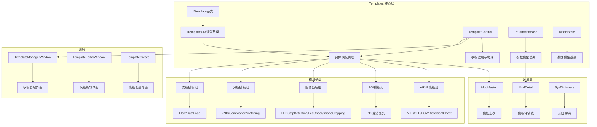
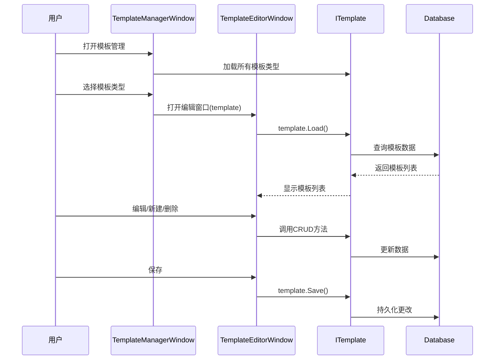
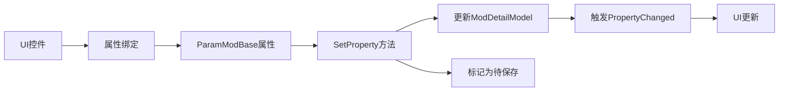

# Templates 架构设计

## 目录
1. [概述](#概述)
2. [核心架构](#核心架构)
3. [模板类型体系](#模板类型体系)
4. [关键组件](#关键组件)
5. [数据流与交互](#数据流与交互)
6. [设计模式](#设计模式)
7. [扩展机制](#扩展机制)

## 概述

Templates模块是ColorVision.Engine的核心子系统，负责管理所有算法模板的定义、存储、加载和执行。该模块包含约317个C#文件，分布在45个子目录中，覆盖了从基础图像处理到复杂AR/VR算法的各种模板实现。

### 模块定位

- **职责**: 算法参数化模板管理、模板生命周期管理、模板版本控制
- **规模**: ~317个文件，约45个子模块
- **代码量**: 核心文件约2000行，整体模块数万行
- **主要依赖**: ColorVision.Database、ColorVision.Common.MVVM、SqlSugar ORM

## 核心架构

### 整体架构图



### 三层架构设计

#### 1. 核心抽象层 (Core Abstraction Layer)

**ITemplate 基类**
- 提供模板的基本接口定义
- 管理模板名称、代码、标题等元数据
- 定义CRUD操作接口（创建、读取、更新、删除）
- 支持导入导出功能

**关键接口方法**:
```csharp
public class ITemplate
{
    // 元数据
    string Name { get; set; }
    string Code { get; set; }
    string Title { get; set; }
    int Count { get; }
    
    // 数据操作
    IEnumerable GetValue();
    object GetValue(int index);
    object GetParamValue(int index);
    
    // 模板操作
    void Load();
    void Save();
    bool Import();
    bool ImportFile(string filePath);
    void Export(int index);
    bool CopyTo(int index);
}
```

**ITemplate<T> 泛型基类**
- 基于泛型参数化的模板实现
- 类型安全的参数管理
- 数据库操作封装（基于SqlSugar ORM）

#### 2. 数据模型层 (Data Model Layer)

**ParamModBase 参数模型基类**
- 继承自ModelBase
- 提供参数化配置的基础框架
- 支持ObservableCollection动态绑定
- 集成创建命令（CreateCommand）

**ModelBase 模型基类**
- 继承自ParamBase
- 实现属性变更通知（INotifyPropertyChanged）
- 提供字典参数存储机制
- 支持参数类型转换（int, double, bool, enum, string, double[]等）
- 实现属性与数据库字段的双向绑定

**关键功能**:
- 动态参数获取：`GetValue<T>`
- 参数设置与变更跟踪：`SetProperty<T>`
- 参数详情获取：`GetDetail(List<ModDetailModel>)`

#### 3. UI交互层 (UI Interaction Layer)

**TemplateManagerWindow - 模板管理窗口**
- 功能：展示所有已注册的模板类型
- 特性：支持多关键词搜索、快速定位模板
- 交互：双击或选择后打开模板编辑窗口

**TemplateEditorWindow - 模板编辑窗口**
- 功能：模板实例的增删改查
- 特性：
  - 支持模板项的排序、筛选
  - 支持快捷键操作（Ctrl+N新建、Ctrl+C复制、Ctrl+S保存、Delete删除）
  - 动态加载自定义用户控件
  - 支持编辑模式切换
  - 支持模板导入导出

**TemplateCreate - 模板创建窗口**
- 功能：创建新模板或从文件导入
- 特性：
  - 支持基于默认模板创建
  - 支持从本地模板文件导入
  - 文件系统集成（%MyDocuments%/{Company}/Templates/{Code}/）
  - 名称唯一性校验

## 模板类型体系

### 模板分类结构

```
Templates/
├── ARVR/                     # AR/VR算法模板组
│   ├── MTF/                  # 调制传递函数
│   ├── SFR/                  # 空间频率响应
│   ├── FOV/                  # 视场角
│   ├── Distortion/           # 畸变分析
│   └── Ghost/                # 鬼影检测
├── POI/                      # 兴趣点模板组
│   ├── AlgorithmImp/         # POI算法实现
│   ├── BuildPoi/             # POI构建
│   ├── POIFilters/           # POI过滤器
│   ├── POIGenCali/           # POI生成校准
│   ├── POIOutput/            # POI输出
│   └── POIRevise/            # POI修正
├── ImageProcessing/          # 图像处理模板组
│   ├── LEDStripDetection/    # LED灯带检测
│   ├── LedCheck/             # LED检查
│   └── ImageCropping/        # 图像裁剪
├── Analysis/                 # 数据分析模板组
│   ├── JND/                  # 最小可察觉差异
│   ├── Compliance/           # 合规性分析
│   └── Matching/             # 匹配算法
├── Flow/                     # 流程模板
├── Jsons/                    # JSON配置模板组
│   ├── MTF2/                 # MTF第二版
│   ├── FOV2/                 # FOV第二版
│   ├── Ghost2/               # Ghost第二版
│   ├── BinocularFusion/      # 双目融合
│   ├── BlackMura/            # 黑屏马拉
│   ├── LargeFlow/            # 大流程
│   ├── PoiAnalysis/          # POI分析
│   └── ... (更多JSON模板)
└── Core/                     # 核心组件
    ├── ITemplate.cs          # 模板接口
    ├── ParamModBase.cs       # 参数模型基类
    ├── ModelBase.cs          # 数据模型基类
    ├── TemplateControl.cs    # 模板控制器
    └── SearchProvider.cs     # 搜索提供者
```

### 各类模板特点

#### ARVR 模板组
- **目标**: AR/VR显示设备的光学性能测试
- **特点**: 高精度数值计算、ROI区域处理、复杂算法参数
- **典型参数**: ROI坐标、Gamma值、频域数据、采样参数

#### POI 模板组  
- **目标**: 兴趣点检测、分析与校准
- **特点**: 多阶段处理流程、滤波器链、输出格式多样
- **典型参数**: 检测阈值、滤波参数、校准矩阵

#### 图像处理模板组
- **目标**: 基础图像处理与检测
- **特点**: 实时性要求高、算法轻量化
- **典型参数**: 裁剪区域、检测灵敏度、阈值参数

#### 分析模板组
- **目标**: 数据分析与合规性检测
- **特点**: 统计计算、多维数据比对
- **典型参数**: 统计参数、合规阈值、匹配算法类型

## 关键组件

### TemplateControl - 模板控制中心

**职责**:
- 模板的注册与发现
- 模板实例的全局管理
- 模板名称唯一性校验
- 模板初始化协调

**核心机制**:
```csharp
public class TemplateControl
{
    // 单例模式
    public static TemplateControl GetInstance();
    
    // 模板注册表
    public static Dictionary<string, ITemplate> ITemplateNames { get; set; }
    
    // 添加模板实例
    public static void AddITemplateInstance(string code, ITemplate template);
    
    // 检查模板名称是否存在
    public static bool ExitsTemplateName(string templateName);
    
    // 查找重复模板
    public static ITemplate? FindDuplicateTemplate(string templateName);
}
```

**初始化流程**:
1. 通过反射扫描所有程序集
2. 查找实现IITemplateLoad接口的类型
3. 实例化并调用Load方法
4. 注册到全局模板字典

### TemplateInitializer - 模板初始化器

**职责**:
- 在系统启动时初始化所有模板
- 依赖MySQL数据库初始化完成
- 协调模板加载顺序

**特点**:
- 实现InitializerBase接口
- Order = 4（在MySQL初始化之后）
- 依赖注入机制

### SearchProvider - 搜索提供者

**职责**:
- 提供模板搜索接口
- 支持多关键词模糊匹配
- 集成到UI搜索框

**搜索机制**:
- 基于模板标题（Header）
- 基于模板GUID
- 支持空格分隔多关键词
- 大小写不敏感

## 数据流与交互

### 模板生命周期



### 参数绑定流程



### 数据库交互

**表结构**:
- **ModMaster**: 模板主表（ID、名称、类型、创建日期等）
- **ModDetail**: 模板详情表（参数键值对、SysPid关联）
- **SysDictionary**: 系统字典表（参数符号定义）

**ORM映射**:
- 使用SqlSugar ORM框架
- 支持Lambda表达式查询
- 事务管理与批量操作

## 设计模式

### 1. 模板方法模式 (Template Method Pattern)

ITemplate基类定义了模板操作的骨架，具体实现由子类完成：

```csharp
public class ITemplate
{
    // 模板方法
    public virtual void Load() { }
    public virtual void Save() { }
    public virtual bool Import() { throw new NotImplementedException(); }
    
    // 子类实现具体逻辑
}
```

### 2. 单例模式 (Singleton Pattern)

TemplateControl采用线程安全的单例模式：

```csharp
private static TemplateControl _instance;
private static readonly object _locker = new();
public static TemplateControl GetInstance() 
{ 
    lock (_locker) 
    { 
        return _instance ??= new TemplateControl(); 
    } 
}
```

### 3. 观察者模式 (Observer Pattern)

ModelBase实现INotifyPropertyChanged接口，支持数据绑定：

```csharp
protected override bool SetProperty<T>(ref T storage, T value, [CallerMemberName] string propertyName = "")
{
    storage = value;
    OnPropertyChanged(propertyName);  // 通知观察者
    return true;
}
```

### 4. 策略模式 (Strategy Pattern)

不同模板类型可以替换不同的参数处理策略，通过泛型实现：

```csharp
public class ITemplate<T> : ITemplate where T : ParamModBase, new()
{
    // T 作为策略参数
}
```

### 5. 工厂模式 (Factory Pattern)

模板创建通过反射和工厂方法动态实例化：

```csharp
if (Activator.CreateInstance(type) is IITemplateLoad iITemplateLoad)
{
    iITemplateLoad.Load();
}
```

## 扩展机制

### 添加新模板类型

1. **创建参数类**（继承ParamModBase）
   ```csharp
   public class MyParam : ParamModBase
   {
       public MyParam(ModMasterModel modMaster, List<ModDetailModel> modDetails) 
           : base(modMaster, modDetails) { }
       
       public double MyParameter { get => GetValue(_MyParameter); set => SetProperty(ref _MyParameter, value); }
       private double _MyParameter;
   }
   ```

2. **创建模板类**（继承ITemplate<T>）
   ```csharp
   public class TemplateMyAlgorithm : ITemplate<MyParam>, IITemplateLoad
   {
       public override string Title => "我的算法";
       public string Code => "MyAlg";
       
       public void Load()
       {
           // 从数据库加载
       }
   }
   ```

3. **创建菜单项**（用于UI集成）
   ```csharp
   public class MenuMyAlgorithm : MenuITemplateAlgorithmBase
   {
       public override string Header => "我的算法";
       public override int Order => 9999;
       public override ITemplate Template => new TemplateMyAlgorithm();
   }
   ```

### 自定义UI控件

模板编辑器支持加载自定义UserControl：

```csharp
// 在模板类中指定
public override UserControl GetCustomControl()
{
    return new MyCustomEditor();
}
```

### 扩展点总结

| 扩展点 | 接口/基类 | 用途 |
|--------|----------|------|
| 新算法模板 | ITemplate<T> | 添加新的算法参数化模板 |
| 自定义UI | UserControl | 为模板提供专用编辑界面 |
| 搜索扩展 | ISearch | 扩展模板搜索功能 |
| 结果处理 | IResultHandleBase | 处理算法执行结果的显示 |
| 初始化扩展 | IITemplateLoad | 自定义模板加载逻辑 |

## 相关资源

- [模板管理详细文档](../template-management/模板管理.md)
- [基于JSON的通用模板](../json-based-templates/基于JSON的通用模板.md)
- [ColorVision.Engine重构计划](../../architecture/ColorVision.Engine-Refactoring-Plan.md)
- [算法引擎与模板概述](../算法引擎与模板.md)
