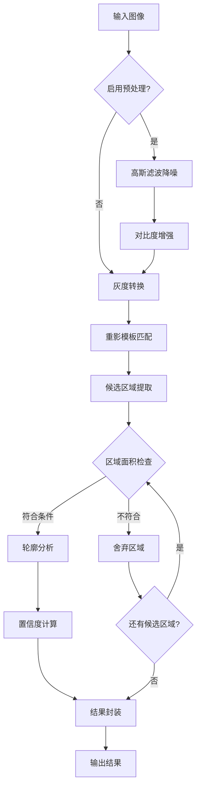
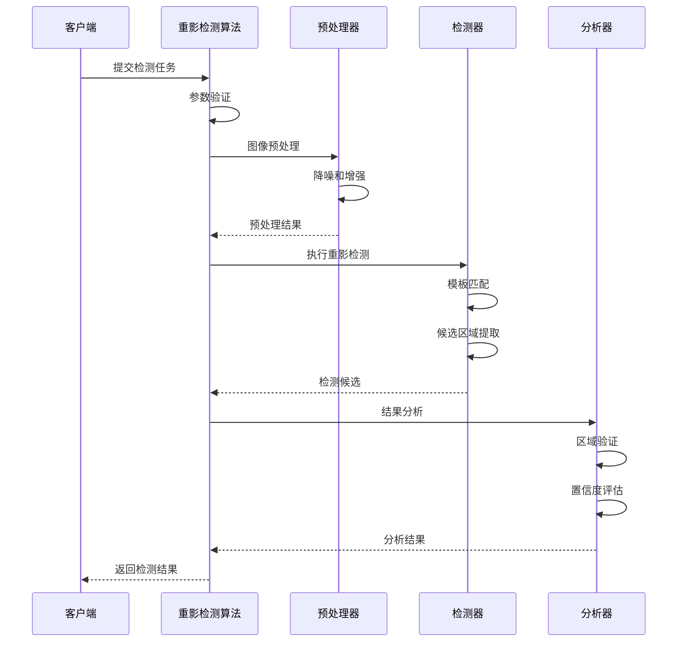

# Ghost Detection Algorithm

---
**Metadata:**
- Title: Ghost Detection Algorithm
- Status: complete
- Updated: 2024-09-28
- Author: ColorVision Algorithm Team
- Algorithm ID: ghost-detection
---

## 算法名称

**英文标识**: ghost-detection  
**中文名称**: 重影检测算法

## 描述

基于图像处理技术的显示器重影现象检测算法，能够识别和量化显示面板中的重影缺陷。

## 输入

### 输入参数

| 参数名称 | 类型 | 必选 | 默认值 | 说明 |
|---------|------|------|--------|------|
| inputImage | Mat | ✓ | - | 输入图像，支持 BGR/Gray 格式 |
| threshold | double | ✗ | 0.3 | 重影检测阈值，范围 0.0-1.0 |
| minGhostArea | int | ✗ | 50 | 最小重影区域面积（像素） |
| maxGhostArea | int | ✗ | 2000 | 最大重影区域面积（像素） |
| enablePreprocess | bool | ✗ | true | 是否启用图像预处理 |
| roiRegion | Rect | ✗ | 全图 | 感兴趣区域 |

### 输入约束

- 图像尺寸: 最小 256x256，最大 4096x4096
- 图像格式: 支持 8位灰度或24位彩色
- 内存要求: 图像大小 < 50MB
- 特殊要求: 建议使用均匀背景的测试图像

## 输出

### 输出结果

| 字段名称 | 类型 | 说明 |
|---------|------|------|
| success | bool | 算法执行是否成功 |
| result | GhostDetectionResult | 重影检测结果 |
| confidence | double | 结果置信度 (0.0-1.0) |
| executionTime | TimeSpan | 算法执行耗时 |
| metadata | Dictionary | 附加元数据信息 |

### 输出格式示例

```json
{
  "success": true,
  "result": {
    "ghostDetected": true,
    "ghostCount": 2,
    "ghostRegions": [
      {
        "x": 120, "y": 180, "width": 45, "height": 30,
        "confidence": 0.87,
        "severity": "Medium"
      },
      {
        "x": 300, "y": 250, "width": 35, "height": 25,
        "confidence": 0.92,
        "severity": "High"
      }
    ],
    "overallSeverity": "Medium",
    "defectDensity": 0.0012
  },
  "confidence": 0.85,
  "executionTime": "00:00:02.145",
  "metadata": {
    "algorithm_version": "2.1.0",
    "preprocessing_applied": true,
    "detection_method": "template_matching",
    "reference_template": "ghost_pattern_v2"
  }
}
```

## 参数

### 详细参数说明

| 名称 | 类型 | 默认 | 范围 | 说明 |
|------|------|------|------|------|
| threshold | double | 0.3 | 0.0-1.0 | 重影检测敏感度，值越小越敏感 |
| minGhostArea | int | 50 | 1-1000 | 最小重影区域面积，过滤微小噪点 |
| maxGhostArea | int | 2000 | 100-10000 | 最大重影区域面积，避免误检大面积区域 |
| enablePreprocess | bool | true | - | 图像预处理开关，包含降噪和增强 |
| contrastThreshold | double | 0.15 | 0.01-0.5 | 对比度阈值，用于增强重影边界 |
| morphologyKernel | int | 3 | 3-15 | 形态学操作核大小，必须为奇数 |

### 参数组合建议

- **高精度模式**: threshold=0.2, minGhostArea=25, enablePreprocess=true
- **高性能模式**: threshold=0.5, enablePreprocess=false, morphologyKernel=3
- **平衡模式**: 使用默认参数组合

## 处理流程

### 算法流程图



### 时序图



## 性能

### 性能指标

| 指标 | 典型值 | 最优值 | 说明 |
|------|--------|--------|------|
| 处理速度 | 800ms | 200ms | 1920x1080 图像 |
| 内存使用 | 120MB | 60MB | 峰值内存占用 |
| 准确率 | 92% | 96% | 基于标准测试数据集 |
| 召回率 | 89% | 94% | 重影缺陷检出率 |
| 误检率 | 3% | 1% | 假阳性率 |

### 性能优化建议

1. **ROI 设置**: 设置合适的感兴趣区域可提升 40% 性能
2. **预处理控制**: 关闭预处理可提升 30% 速度但可能降低精度
3. **GPU 加速**: 启用 CUDA 支持可提升 2-3 倍性能
4. **参数调优**: 适当增大 minGhostArea 可减少计算量

### 性能测试

```csharp
[Benchmark]
public class GhostDetectionBenchmark
{
    private readonly Mat testImage;
    private readonly GhostDetectionAlgorithm algorithm;
    private readonly AlgorithmParameters standardParams;
    private readonly AlgorithmParameters optimizedParams;
    
    [Benchmark(Baseline = true)]
    public AlgorithmResult StandardDetection()
    {
        return algorithm.Process(testImage, standardParams);
    }
    
    [Benchmark]
    public AlgorithmResult OptimizedDetection()
    {
        return algorithm.Process(testImage, optimizedParams);
    }
    
    [Benchmark]
    public AlgorithmResult GPUAccelerated()
    {
        var gpuParams = standardParams.Clone();
        gpuParams["useGPU"] = true;
        return algorithm.Process(testImage, gpuParams);
    }
}
```

## 常见错误

### 错误分类

#### 输入错误
- **图像为空**: 检查输入图像是否正确加载
  - **症状**: algorithm.Process() 抛出 ArgumentNullException
  - **原因**: 传入的 Mat 对象为 null 或 Empty
  - **解决方案**: 验证图像路径和加载过程

- **格式不支持**: 转换为支持的图像格式
  - **症状**: 检测结果异常或性能极差
  - **原因**: 输入图像为 16位深度或特殊色彩空间
  - **解决方案**: 转换为 8位 BGR 或灰度格式

#### 参数错误
- **阈值越界**: threshold 必须在 0.0-1.0 范围内
  - **症状**: 抛出 ArgumentOutOfRangeException
  - **原因**: 阈值参数超出有效范围
  - **解决方案**: 检查并调整阈值到有效范围

- **区域面积参数错误**: minGhostArea 不能大于 maxGhostArea
  - **症状**: 无法检测到任何重影区域
  - **原因**: 面积参数设置不合理
  - **解决方案**: 确保 minGhostArea < maxGhostArea

#### 运行时错误
- **内存不足**: 释放不必要的资源或使用更小的图像
  - **症状**: 抛出 OutOfMemoryException
  - **原因**: 大图像处理时内存不足
  - **解决方案**: 使用图像金字塔或 ROI 处理

- **GPU 错误**: 检查 CUDA 驱动和显卡内存
  - **症状**: GPU 模式下算法崩溃
  - **原因**: CUDA 环境问题或显存不足
  - **解决方案**: 更新驱动或回退到CPU模式

### 错误处理示例

```csharp
public AlgorithmResult ProcessImageSafely(Mat image, AlgorithmParameters parameters)
{
    try
    {
        // 输入验证
        if (image == null || image.Empty())
        {
            return AlgorithmResult.Error("输入图像为空或无效");
        }
        
        // 参数验证
        var validationResult = ValidateParameters(parameters);
        if (!validationResult.IsValid)
        {
            return AlgorithmResult.Error($"参数验证失败: {validationResult.ErrorMessage}");
        }
        
        // 图像格式检查
        if (image.Depth() != MatType.CV_8U)
        {
            image.ConvertTo(image, MatType.CV_8U);
        }
        
        // 执行检测
        var result = ProcessCore(image, parameters);
        return result;
    }
    catch (OutOfMemoryException ex)
    {
        return AlgorithmResult.Error($"内存不足，建议使用较小图像: {ex.Message}");
    }
    catch (OpenCVException ex)
    {
        return AlgorithmResult.Error($"OpenCV 错误: {ex.Message}");
    }
    catch (Exception ex)
    {
        return AlgorithmResult.Error($"未知错误: {ex.Message}");
    }
}
```

## 扩展点

### 算法接口

实现 `IGhostDetectionAlgorithm` 接口来创建自定义重影检测算法：

```csharp
public interface IGhostDetectionAlgorithm : IAlgorithm
{
    /// <summary>重影检测特定方法</summary>
    GhostDetectionResult DetectGhost(Mat image, GhostDetectionParameters parameters);
    
    /// <summary>设置重影检测模板</summary>
    void SetGhostTemplate(Mat template);
    
    /// <summary>获取算法特定统计信息</summary>
    GhostDetectionStatistics GetStatistics();
}
```

### 扩展示例

```csharp
[Algorithm("advanced-ghost-detection", "高级重影检测")]
public class AdvancedGhostDetectionAlgorithm : IGhostDetectionAlgorithm
{
    private Mat _ghostTemplate;
    private readonly ILogger _logger;
    
    public string AlgorithmId => "advanced-ghost-detection";
    public string Name => "高级重影检测算法";
    public string Version => "2.1.0";
    
    public AlgorithmResult Process(Mat image, AlgorithmParameters parameters)
    {
        var ghostParams = CreateGhostParameters(parameters);
        var result = DetectGhost(image, ghostParams);
        
        return new AlgorithmResult
        {
            Success = result.Success,
            Data = result,
            Confidence = result.OverallConfidence,
            Metadata = CreateMetadata(result)
        };
    }
    
    public GhostDetectionResult DetectGhost(Mat image, GhostDetectionParameters parameters)
    {
        // 多尺度模板匹配
        var scales = new[] { 0.8, 1.0, 1.2 };
        var allMatches = new List<GhostMatch>();
        
        foreach (var scale in scales)
        {
            var scaledTemplate = ScaleTemplate(_ghostTemplate, scale);
            var matches = PerformTemplateMatching(image, scaledTemplate, parameters);
            allMatches.AddRange(matches);
        }
        
        // 非极大值抑制
        var filteredMatches = NonMaximumSuppression(allMatches, 0.3);
        
        // 构建结果
        return new GhostDetectionResult
        {
            GhostDetected = filteredMatches.Any(),
            GhostCount = filteredMatches.Count,
            GhostRegions = filteredMatches.Select(CreateGhostRegion).ToList(),
            OverallConfidence = CalculateOverallConfidence(filteredMatches)
        };
    }
    
    public void SetGhostTemplate(Mat template)
    {
        _ghostTemplate?.Dispose();
        _ghostTemplate = template.Clone();
        
        // 预处理模板
        if (template.Channels() > 1)
        {
            Cv2.CvtColor(_ghostTemplate, _ghostTemplate, ColorConversionCodes.BGR2GRAY);
        }
        
        _logger.Information("Ghost template updated, size: {Width}x{Height}", 
            template.Width, template.Height);
    }
}
```

## 示例调用

### C# 代码示例

```csharp
using OpenCvSharp;
using ColorVision.Algorithms;

class GhostDetectionExample
{
    public static async Task Main(string[] args)
    {
        // 创建算法实例
        var algorithm = AlgorithmFactory.Create<IGhostDetectionAlgorithm>("ghost-detection");
        
        // 加载测试图像
        var image = Cv2.ImRead("display_test.jpg", ImreadModes.Color);
        if (image.Empty())
        {
            Console.WriteLine("无法加载图像文件");
            return;
        }
        
        // 设置参数
        var parameters = new AlgorithmParameters
        {
            ["threshold"] = 0.3,
            ["minGhostArea"] = 50,
            ["maxGhostArea"] = 2000,
            ["enablePreprocess"] = true,
            ["roiRegion"] = new Rect(100, 100, 800, 600)
        };
        
        try
        {
            // 执行检测
            var result = await algorithm.ProcessAsync(image, parameters);
            
            if (result.Success)
            {
                var ghostResult = (GhostDetectionResult)result.Data;
                
                Console.WriteLine($"重影检测完成:");
                Console.WriteLine($"- 检测到重影: {ghostResult.GhostDetected}");
                Console.WriteLine($"- 重影数量: {ghostResult.GhostCount}");
                Console.WriteLine($"- 整体置信度: {result.Confidence:F2}");
                Console.WriteLine($"- 执行时间: {result.ExecutionTime}");
                
                // 绘制检测结果
                DrawResults(image, ghostResult);
                Cv2.ImWrite("ghost_detection_result.jpg", image);
                
                // 保存详细结果
                await SaveDetailedResults(ghostResult, "ghost_analysis.json");
            }
            else
            {
                Console.WriteLine($"检测失败: {result.ErrorMessage}");
            }
        }
        catch (Exception ex)
        {
            Console.WriteLine($"异常: {ex.Message}");
        }
        finally
        {
            image.Dispose();
        }
    }
    
    private static void DrawResults(Mat image, GhostDetectionResult result)
    {
        foreach (var region in result.GhostRegions)
        {
            // 绘制重影区域边界
            var rect = new Rect(region.X, region.Y, region.Width, region.Height);
            var color = region.Severity switch
            {
                "High" => Scalar.Red,
                "Medium" => Scalar.Yellow,
                "Low" => Scalar.Green,
                _ => Scalar.Blue
            };
            
            Cv2.Rectangle(image, rect, color, 2);
            
            // 添加标注
            var label = $"Ghost {region.Confidence:F2}";
            Cv2.PutText(image, label, new Point(region.X, region.Y - 5),
                HersheyFonts.HersheySimplex, 0.5, color, 1);
        }
    }
}
```

### 批量检测示例

```csharp
public async Task BatchGhostDetectionAsync(string inputFolder, string outputFolder)
{
    var algorithm = AlgorithmFactory.Create<IGhostDetectionAlgorithm>("ghost-detection");
    var parameters = new AlgorithmParameters
    {
        ["threshold"] = 0.35,
        ["enablePreprocess"] = true
    };
    
    var imageFiles = Directory.GetFiles(inputFolder, "*.jpg");
    var results = new List<BatchResult>();
    
    // 并行处理多个图像
    await Parallel.ForEachAsync(imageFiles, 
        new ParallelOptions { MaxDegreeOfParallelism = 4 },
        async (imageFile, ct) =>
        {
            try
            {
                using var image = Cv2.ImRead(imageFile);
                var result = await algorithm.ProcessAsync(image, parameters);
                
                var batchResult = new BatchResult
                {
                    FileName = Path.GetFileName(imageFile),
                    Success = result.Success,
                    GhostDetected = result.Success && 
                        ((GhostDetectionResult)result.Data).GhostDetected,
                    Confidence = result.Confidence,
                    ExecutionTime = result.ExecutionTime
                };
                
                lock (results)
                {
                    results.Add(batchResult);
                }
                
                // 保存结果图像
                if (result.Success)
                {
                    var outputPath = Path.Combine(outputFolder, 
                        $"{Path.GetFileNameWithoutExtension(imageFile)}_ghost_result.jpg");
                    DrawResults(image, (GhostDetectionResult)result.Data);
                    Cv2.ImWrite(outputPath, image);
                }
            }
            catch (Exception ex)
            {
                Console.WriteLine($"处理文件 {imageFile} 时出错: {ex.Message}");
            }
        });
    
    // 生成批处理报告
    GenerateBatchReport(results, outputFolder);
}
```

## 变更记录

| 版本 | 日期 | 变更内容 | 作者 |
|------|------|----------|------|
| 1.0.0 | 2024-01-15 | 初始版本，基础重影检测功能 | 算法团队 |
| 1.5.0 | 2024-03-10 | 增加多尺度检测，提升精度15% | 算法团队 |
| 2.0.0 | 2024-06-20 | 重构架构，支持GPU加速 | 算法团队 |
| 2.1.0 | 2024-09-28 | 优化模板匹配，增加置信度评估 | 算法团队 |

---

*最后更新: 2024-09-28 | 状态: complete*