# ColorVision.Engine 重构架构图

本文档包含 ColorVision.Engine 重构的架构可视化图表。

## 当前架构（单体DLL）

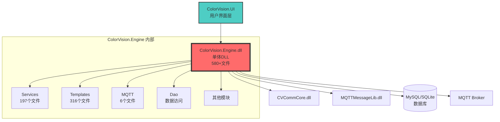

**问题**:
- ❌ 所有业务逻辑集中在一个DLL
- ❌ 模块边界不清晰
- ❌ 难以独立测试和部署
- ❌ 修改影响范围大

---

## 目标架构（模块化）

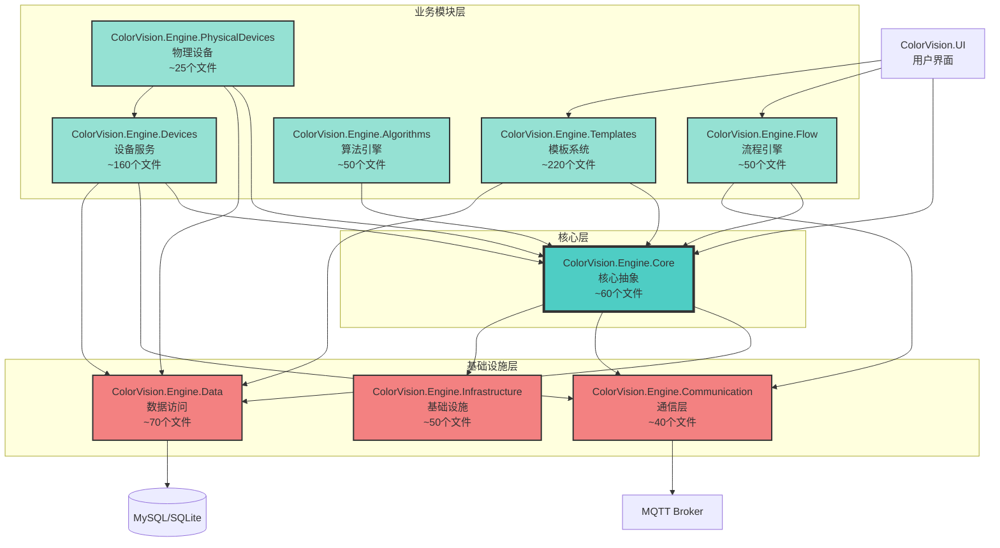

**优势**:
- ✅ 清晰的模块边界
- ✅ 可独立开发和测试
- ✅ 按需加载模块
- ✅ 易于维护和扩展

---

## 模块依赖关系

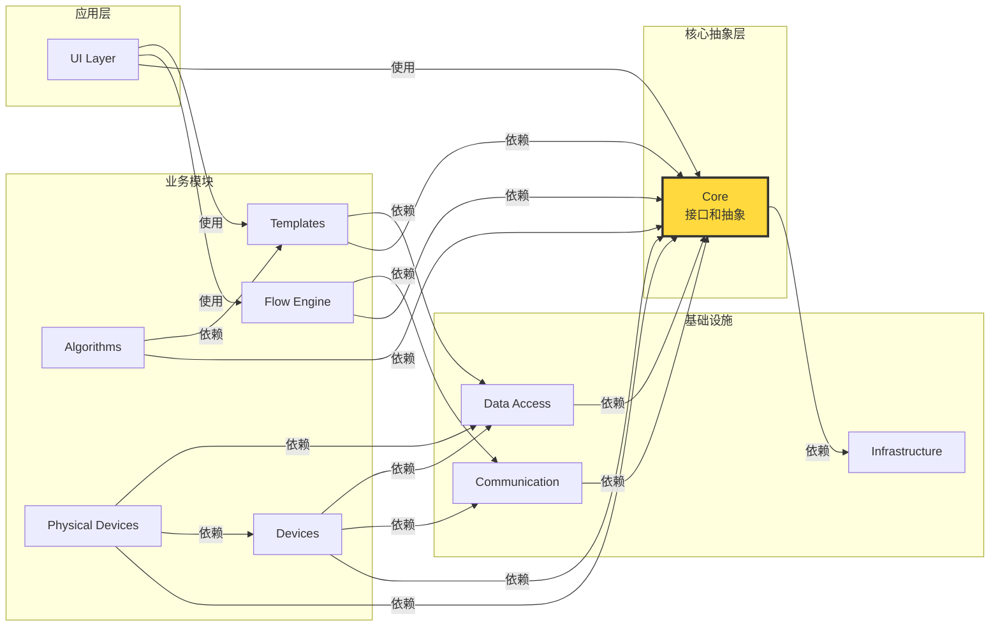

**依赖规则**:
1. 所有模块都可依赖 Core
2. 业务模块之间避免直接依赖
3. 通过 Core 中的接口进行模块间通信
4. 依赖方向：上层→下层，业务层→基础设施层

---

## 数据流图

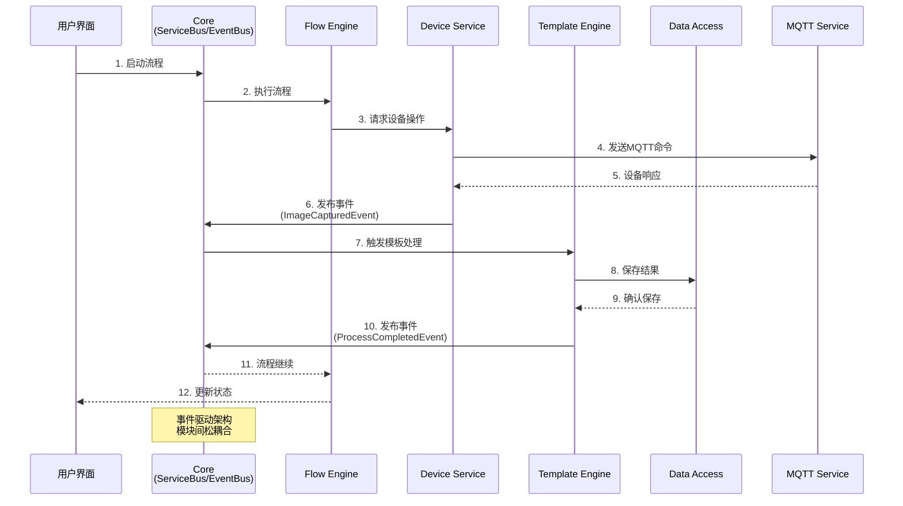

---

## 启动序列

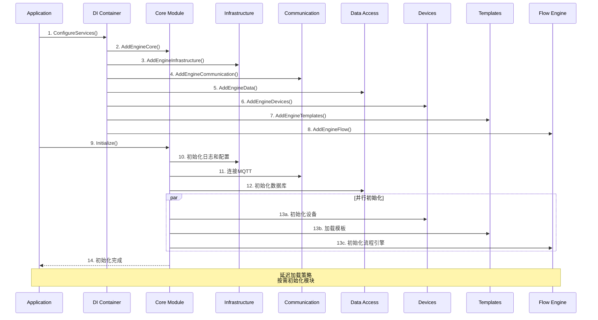

---

## 模块间通信模式

### 1. 直接调用（通过接口）

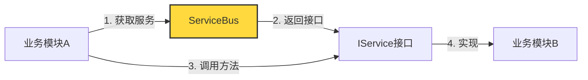

### 2. 事件驱动（松耦合）

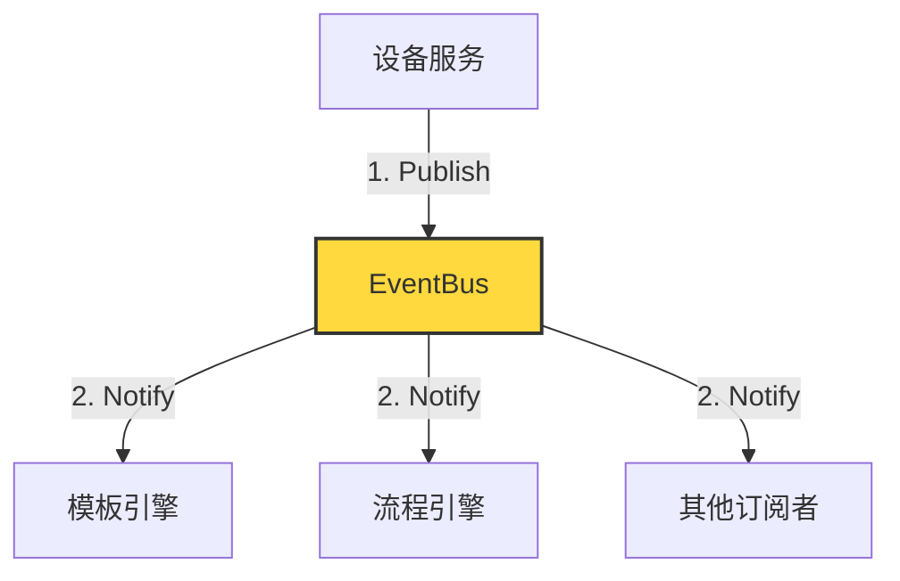

### 3. 消息队列（异步通信）

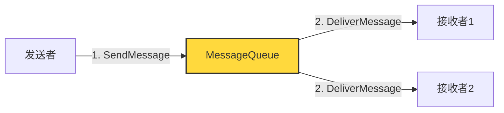

---

## 插件化架构

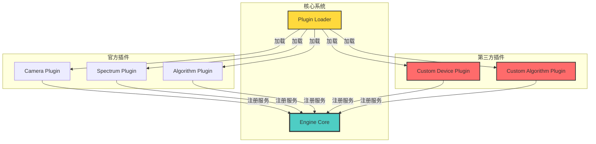

**插件开发流程**:
1. 实现 `IEnginePlugin` 接口
2. 在 `RegisterServices()` 中注册服务
3. 在 `Initialize()` 中初始化插件
4. 将DLL放入 `plugins/` 目录
5. 系统自动加载和注册

---

## 部署架构

### 开发环境

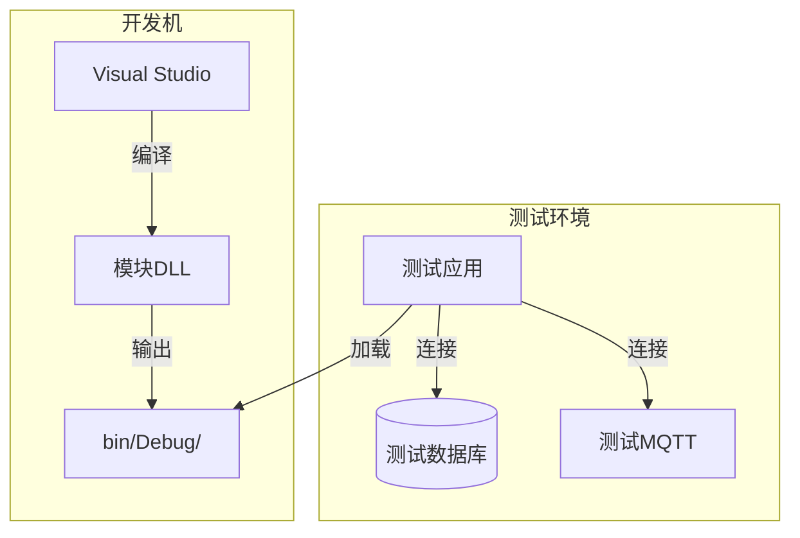

### 生产环境

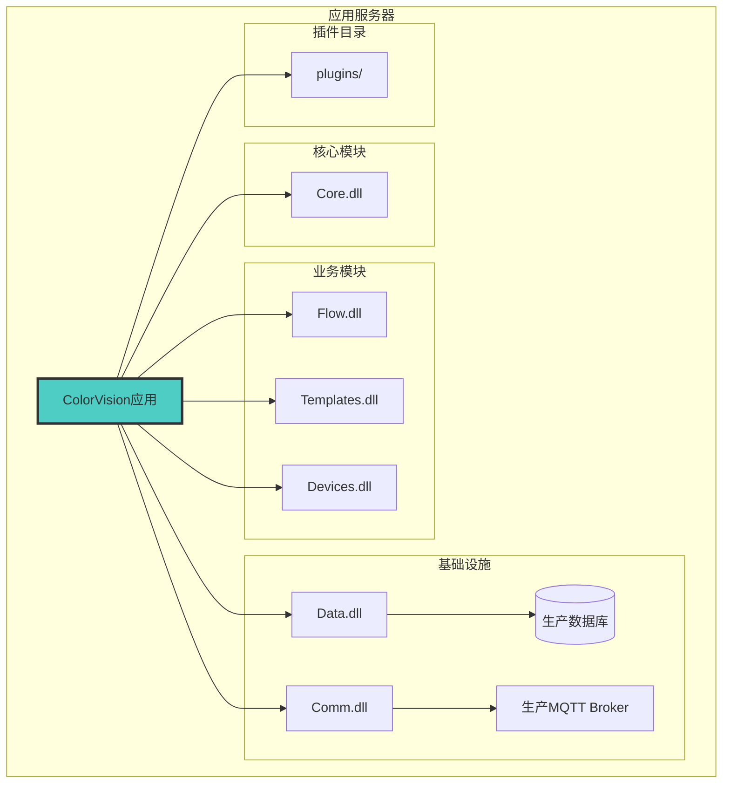

---

## 性能优化策略

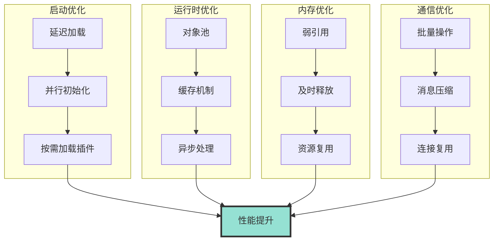

**优化目标**:
- 启动时间: ≤ 5秒
- 模块加载: ≤ 500ms/模块
- 内存占用: 降低30%
- API响应: ≤ 100ms

---

## 测试策略

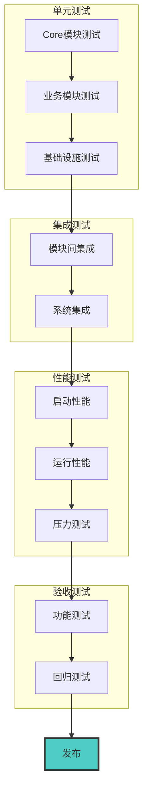

**测试覆盖率目标**:
- 单元测试: ≥ 80%
- 集成测试: 100% 关键路径
- 性能测试: 所有性能指标
- 验收测试: 100% 功能点

---

## 迁移路线图时间轴

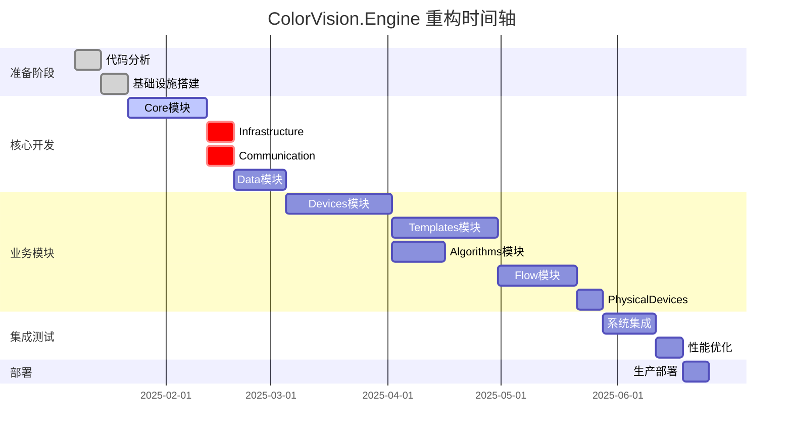

---

## 相关文档

- [完整重构方案](./ColorVision.Engine-Refactoring-Plan.md)
- [执行摘要](./ColorVision.Engine-Refactoring-Summary.md)
- [实施检查清单](./ColorVision.Engine-Refactoring-Checklist.md)
- [现有架构文档](../engine-components/ColorVision.Engine.md)

---

**文档版本**: v1.0  
**创建日期**: 2025-01-08  
**图表说明**: 使用 Mermaid 语法，支持在 Markdown 预览器中直接渲染
