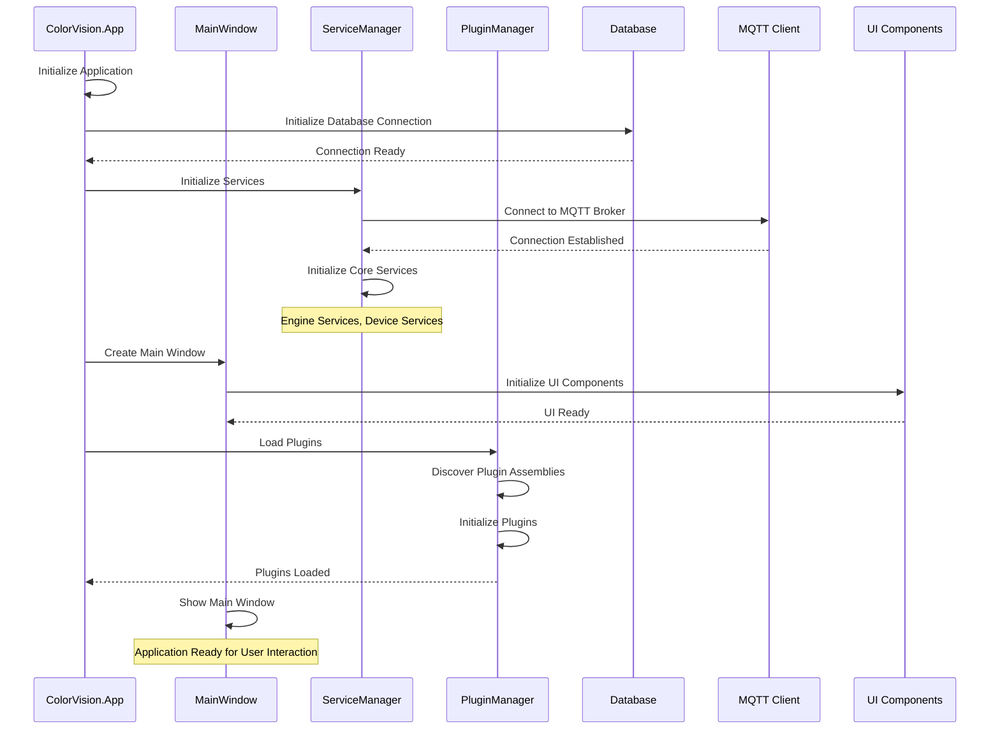
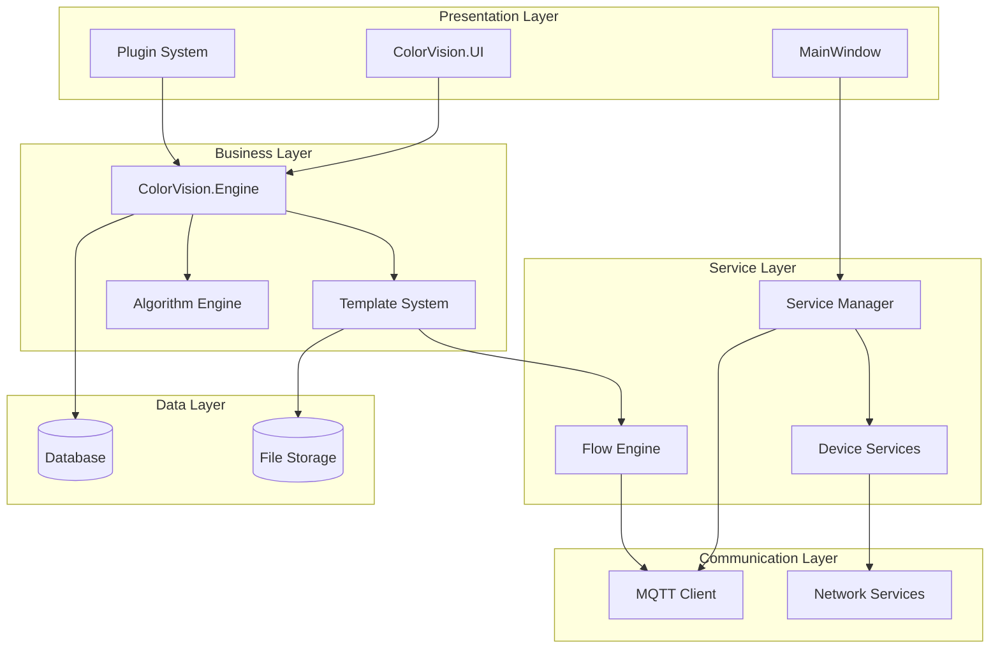
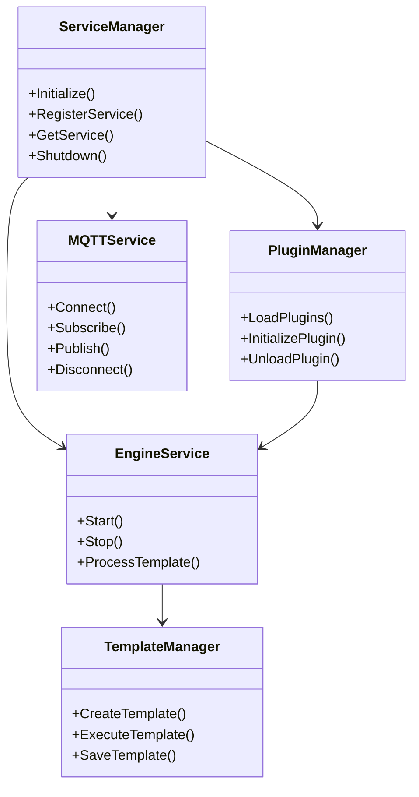
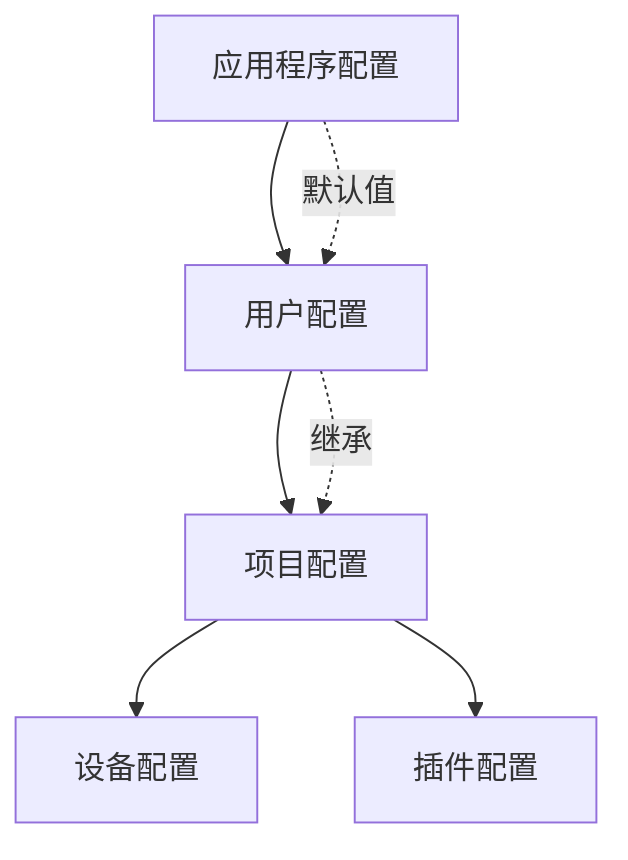
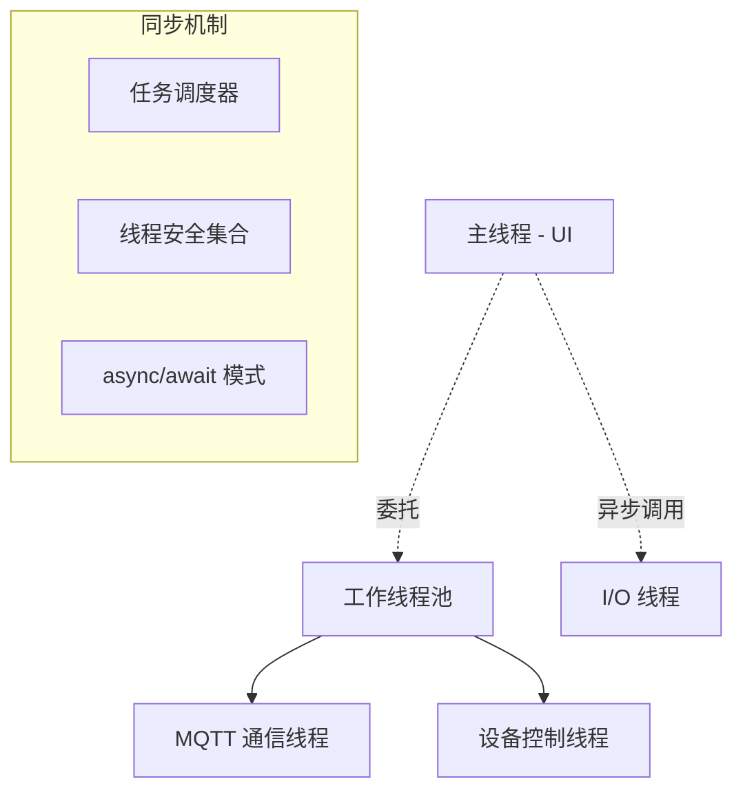
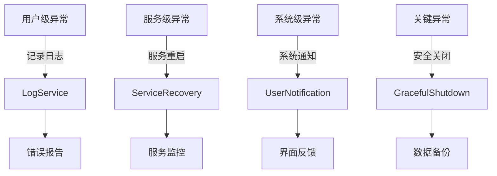

# Architecture Runtime

---
**Metadata:**
- Title: Architecture Runtime - System Startup and Component Interactions
- Status: draft
- Updated: 2024-09-28
- Author: ColorVision Development Team
---

## 简介

本文档描述 ColorVision 系统的运行时架构，包括启动序列、组件交互模式、消息通道、配置流向、线程模型以及异常恢复策略。

## 目录

1. [启动序列](#启动序列)
2. [组件交互图](#组件交互图)
3. [消息与事件通道](#消息与事件通道)
4. [配置流向](#配置流向)
5. [线程与调度模型](#线程与调度模型)
6. [异常与恢复策略](#异常与恢复策略)

## 启动序列

### 系统启动时序图



### 启动阶段详解

1. **应用程序初始化** (App.xaml.cs)
   - 配置日志系统
   - 加载应用程序配置
   - 初始化依赖注入容器

2. **数据库连接建立**
   - SQLite 本地数据库连接
   - 数据库架构初始化和迁移

3. **服务管理器启动**
   - 核心服务注册和初始化
   - MQTT 连接建立
   - 设备服务启动

4. **用户界面创建**
   - 主窗口初始化
   - UI 组件加载
   - 主题和样式应用

5. **插件系统激活**
   - 插件发现和加载
   - 插件初始化和注册

## 组件交互图

### 高层系统架构



### 核心组件依赖关系



## 消息与事件通道

### MQTT 消息架构

ColorVision 使用 MQTT 作为主要的消息通信机制：

```mermaid
graph LR
    subgraph "MQTT Topics"
        DeviceTopic[/ColorVision/Device/{DeviceID}]
        TemplateTopic[/ColorVision/Template/{TemplateID}]
        SystemTopic[/ColorVision/System/Status]
        ResultTopic[/ColorVision/Result/{JobID}]
    end
    
    subgraph "Publishers"
        Engine[Engine Service]
        Devices[Device Services]
        UI[UI Components]
    end
    
    subgraph "Subscribers"
        Dashboard[Dashboard]
        Logger[Log Service]
        Storage[Storage Service]
    end

    Engine --> DeviceTopic
    Engine --> TemplateTopic
    Devices --> SystemTopic
    UI --> ResultTopic
    
    DeviceTopic --> Dashboard
    TemplateTopic --> Logger
    SystemTopic --> Storage
    ResultTopic --> Dashboard
```

### 内部事件系统

```csharp
// 事件总线示例
public interface IEventBus
{
    void Publish<T>(T eventData) where T : class;
    void Subscribe<T>(Action<T> handler) where T : class;
    void Unsubscribe<T>(Action<T> handler) where T : class;
}

// 典型事件类型
public class TemplateExecutionStarted
{
    public string TemplateId { get; set; }
    public DateTime StartTime { get; set; }
}

public class DeviceStatusChanged
{
    public string DeviceId { get; set; }
    public DeviceStatus Status { get; set; }
}
```

## 配置流向

### 配置层次结构



### 配置加载流程

1. **应用程序级配置** - 系统全局设置
2. **用户级配置** - 用户偏好和个人设置
3. **项目级配置** - 特定项目的配置
4. **设备级配置** - 硬件设备参数
5. **插件级配置** - 插件特定设置

## 线程与调度模型

### 线程架构



### 调度策略

- **UI 线程**: 专用于界面更新，避免阻塞操作
- **工作线程池**: 处理算法计算和文件 I/O
- **设备控制线程**: 每个设备独立线程，避免相互阻塞
- **MQTT 通信线程**: 专用于网络通信

## 异常与恢复策略

### 异常处理层次



### 恢复机制

1. **自动重试**: 临时性错误的自动重试机制
2. **服务重启**: 服务异常时的自动重启
3. **状态回滚**: 操作失败时的状态恢复
4. **数据备份**: 关键数据的自动备份
5. **用户通知**: 及时的错误反馈和建议

### 监控和诊断

- **健康检查**: 定期系统健康状态检查
- **性能监控**: CPU、内存、磁盘使用情况监控
- **日志聚合**: 集中化日志收集和分析
- **指标收集**: 系统运行指标的收集和报告

---

*最后更新: 2024-09-28 | 状态: draft*