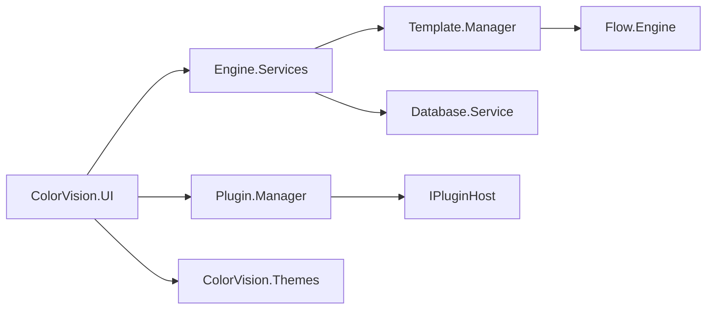
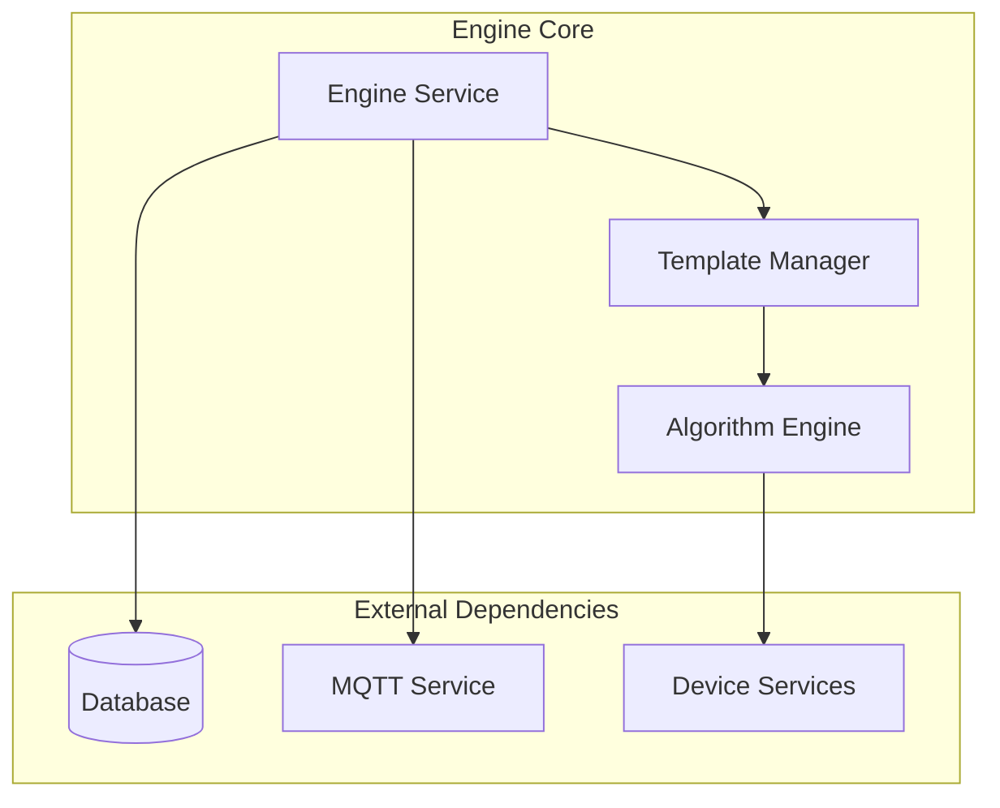
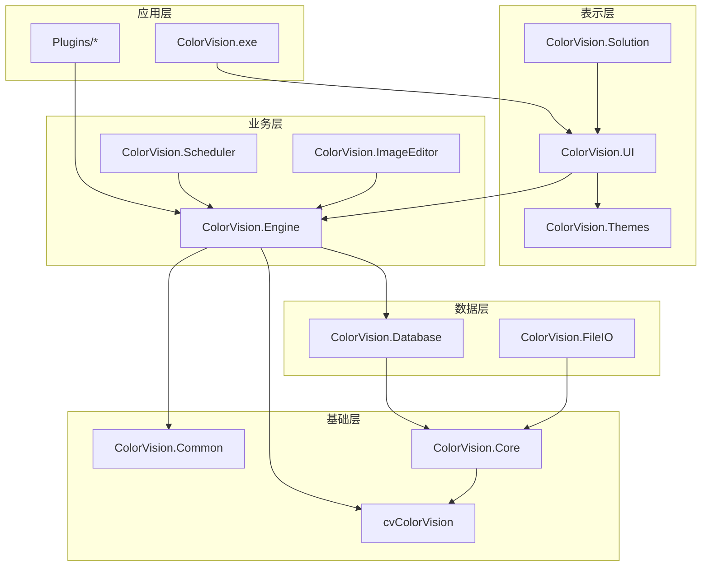
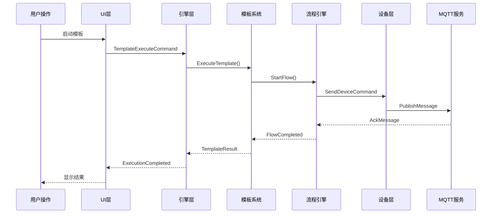

# Component Interactions Matrix

---
**Metadata:**
- Title: Component Interactions Matrix and Dependencies
- Status: draft
- Updated: 2024-09-28
- Author: ColorVision Development Team
---

## 简介

本文档提供 ColorVision 系统中各模块间的交互矩阵，详细描述模块间的调用关系、事件传递、依赖关系和扩展点。

## 目录

1. [模块交互矩阵](#模块交互矩阵)
2. [依赖关系图](#依赖关系图)
3. [事件传递链](#事件传递链)
4. [接口扩展点](#接口扩展点)

## 模块交互矩阵

### 主要模块交互表

| Module | Calls | Events | DependsOn | ExtPoints | Description |
|--------|-------|--------|-----------|-----------|-------------|
| **ColorVision.UI** | Engine.Templates, Engine.Services | UI.WindowLoaded, UI.MenuClicked | Engine, Common, Themes | IMainWindowInitialized, IStatusBarProvider | 用户界面层 |
| **ColorVision.Engine** | Database, MQTT, Templates | Engine.ServiceStarted, Engine.TemplateExecuted | Core, Database | IEngineService, ITemplateEngine | 核心引擎层 |
| **Template.Manager** | Flow.Engine, Algorithm.Engine | Template.Created, Template.Executed | Engine, Flow | ITemplate, ITemplateValidator | 模板管理系统 |
| **Flow.Engine** | MQTT.Service, Device.Services | Flow.Started, Flow.Completed, Flow.Error | Engine, MQTT | IInitializerFlow, IFlowNode | 流程引擎 |
| **Plugin.Manager** | Engine.Services, UI.Components | Plugin.Loaded, Plugin.Initialized | UI, Engine | IPlugin, IPluginHost | 插件管理器 |
| **Device.Services** | MQTT.Client, Hardware.Drivers | Device.Connected, Device.StatusChanged | Engine, MQTT | IDevice, IDeviceDriver | 设备服务层 |
| **MQTT.Service** | Network.Client | MQTT.Connected, MQTT.MessageReceived | Engine, Network | IMQTTClient, IMQTTHandler | MQTT 通信服务 |
| **Database.Service** | SqlSugar, Entity.Models | DB.Connected, DB.QueryExecuted | Core, Entity | IRepository, IDataContext | 数据库服务 |
| **Algorithm.Engine** | OpenCV, CUDA.Runtime | Algorithm.Started, Algorithm.Completed | Core, Templates | IAlgorithm, IImageProcessor | 算法引擎 |
| **RBAC.Manager** | Database.Service, UI.Auth | User.LoggedIn, Permission.Changed | Database, UI | IAuthService, IRoleProvider | 权限管理 |

### 详细交互说明

#### UI 层交互


#### 引擎层交互


## 依赖关系图

### 层次依赖结构



### 循环依赖检测

当前系统中需要注意的潜在循环依赖：

- ✅ **无循环**: UI → Engine → Database → Core
- ✅ **无循环**: Templates → FlowEngine → MQTT → Engine
- ⚠️ **注意**: Plugin.Manager ↔ Engine.Services (通过接口解耦)
- ⚠️ **注意**: UI.Components ↔ Engine.Templates (事件驱动)

## 事件传递链

### 核心事件流



### 事件类型分类

#### 系统级事件
- `Application.Started`
- `Application.Shutdown`
- `Service.Connected`
- `Service.Disconnected`

#### 业务级事件
- `Template.Created`
- `Template.Executed`
- `Algorithm.Started`
- `Algorithm.Completed`

#### 设备级事件
- `Device.Connected`
- `Device.Disconnected`
- `Device.StatusChanged`
- `Device.ErrorOccurred`

#### 用户界面事件
- `Window.Loaded`
- `Menu.Clicked`
- `Button.Pressed`
- `Data.Changed`

## 接口扩展点

### 主要扩展接口

| 接口名称 | 触发时机 | 线程上下文 | 返回/约束 | 常见错误 |
|---------|----------|------------|----------|----------|
| `IMainWindowInitialized` | 主窗口初始化完成后 | UI线程 | void | UI冻结、空引用 |
| `IStatusBarProvider` | 状态栏刷新时 | UI线程 | StatusInfo | 界面更新失败 |
| `IFileMeta` | 文件操作时 | 工作线程 | FileMetadata | 文件访问权限 |
| `IPlugin` | 插件生命周期 | 插件线程 | bool (成功/失败) | 资源泄露 |
| `IEngineService` | 引擎服务调用 | 服务线程 | Task | 异步操作超时 |
| `ITemplate` | 模板执行 | 计算线程 | TemplateResult | 参数验证失败 |
| `IAlgorithm` | 算法执行 | GPU/CPU线程 | AlgorithmResult | 内存不足 |
| `IDevice` | 设备控制 | 设备线程 | DeviceResponse | 通信超时 |
| `IMQTTHandler` | MQTT消息处理 | 网络线程 | void | 消息格式错误 |
| `IInitializerFlow` | 流程初始化 | 初始化线程 | Task | 初始化超时 |

### 扩展点实现示例

#### 主窗口扩展点
```csharp
public interface IMainWindowInitialized
{
    string Name { get; }
    int Order { get; }
    Task InitializeAsync(MainWindow mainWindow);
}

// 实现示例
public class CustomMenuInitializer : IMainWindowInitialized
{
    public string Name => "Custom Menu";
    public int Order => 100;
    
    public Task InitializeAsync(MainWindow mainWindow)
    {
        // 添加自定义菜单项
        var menuItem = new MenuItem { Header = "自定义功能" };
        mainWindow.MainMenu.Items.Add(menuItem);
        return Task.CompletedTask;
    }
}
```

#### 算法扩展点
```csharp
public interface IAlgorithm
{
    string AlgorithmId { get; }
    string Name { get; }
    AlgorithmResult Execute(AlgorithmParam param);
    Task<AlgorithmResult> ExecuteAsync(AlgorithmParam param);
}

// 实现示例
public class CustomAlgorithm : IAlgorithm
{
    public string AlgorithmId => "custom-detection";
    public string Name => "自定义检测算法";
    
    public AlgorithmResult Execute(AlgorithmParam param)
    {
        // 算法实现
        return new AlgorithmResult();
    }
    
    public async Task<AlgorithmResult> ExecuteAsync(AlgorithmParam param)
    {
        return await Task.Run(() => Execute(param));
    }
}
```

## 组件映射 JSON 结构

详细的组件映射数据已生成到 [component-map.json](component-map.json) 文件中，包含：

- 所有模块的详细信息
- 依赖关系映射
- 接口定义和实现
- 事件发布和订阅关系

### JSON 结构示例

```json
{
  "modules": {
    "ColorVision.UI": {
      "type": "PresentationLayer",
      "dependencies": ["ColorVision.Engine", "ColorVision.Common"],
      "provides": ["IMainWindow", "IUserInterface"],
      "consumes": ["IEngineService", "ITemplateManager"],
      "events": {
        "publishes": ["UI.WindowLoaded", "UI.MenuClicked"],
        "subscribes": ["Engine.ServiceStarted", "Template.ExecutionCompleted"]
      }
    }
  },
  "relationships": [
    {
      "from": "ColorVision.UI",
      "to": "ColorVision.Engine", 
      "type": "dependency",
      "nature": "calls"
    }
  ]
}
```

---

*最后更新: 2024-09-28 | 状态: draft*