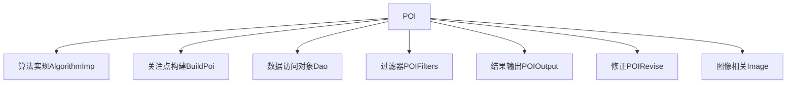
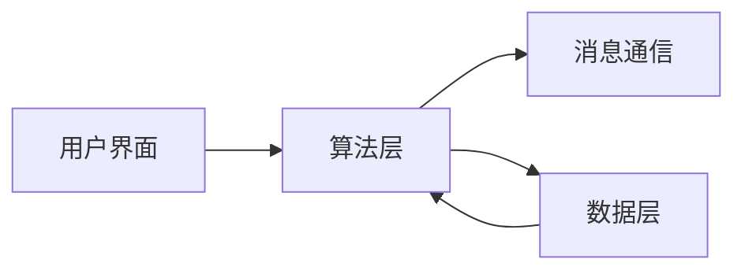

# POI (关注点)


# POI (关注点)

## 目录
1. [简介](#简介)
2. [项目结构](#项目结构)
3. [核心组件](#核心组件)
4. [架构概览](#架构概览)
5. [详细组件分析](#详细组件分析)
6. [依赖关系分析](#依赖关系分析)
7. [性能考虑](#性能考虑)
8. [故障排查指南](#故障排查指南)
9. [总结](#总结)

## 简介
本项目围绕“关注点”（POI，Point of Interest）功能展开，旨在详细介绍POI的概念、类型（如手动标记和自动生成）、如何定义POI及其属性，以及POI数据在测量和分析中的应用。POI是图像处理和视觉检测中的关键数据点，广泛应用于定位、测量、特征提取等领域。

本项目通过模块化设计，实现了POI的构建、过滤、修正和结果输出等功能，支持基于数据库和文件两种存储方式，方便灵活地管理POI数据。系统采用消息通信（如MQTT）机制实现设备与算法的交互，保证数据处理流程的高效与可靠。

## 项目结构

本项目位于仓库路径 `/Engine/ColorVision.Engine/Templates/POI`，该目录下结构清晰，包含多个子模块，分别负责POI的算法实现、数据模型、构建、过滤、修正及结果输出等功能。整体项目采用分层与模块化设计，每个模块职责明确，便于维护和扩展。

主要目录结构说明：



1. **AlgorithmImp**：实现具体的POI算法逻辑，包括数据发送、接收及UI交互。
2. **BuildPoi**：关注点布点算法，实现自动生成POI的功能。
3. **Dao**：数据库访问层，负责POI主表和明细表的数据存取。
4. **POIFilters**：定义POI过滤参数及相关功能，支持对POI数据进行筛选。
5. **POIOutput**：关注点结果的输出模板及相关逻辑。
6. **POIRevise**：POI数据的修正功能模块。
7. **Image**：与POI相关的图像显示和处理界面。

该设计体现了“单一职责原则”，每个子模块专注于特定功能，整体通过消息和模板机制协同工作。

## 核心组件

### 1. AlgorithmPoi (AlgorithmImp/AlgorithmPOI.cs)

- **功能**：作为POI算法的核心类，负责与设备算法交互，管理POI模板、过滤、修正及输出模板的打开，支持POI文件的导入。
- **主要职责**：
  - 维护设备算法实例 `DeviceAlgorithm`
  - 通过MQTT协议发送POI数据请求命令
  - 打开各类模板编辑窗口（POI模板、过滤、修正、输出）
  - 提供界面控件 `DisplayPoi` 用于显示POI相关UI
- **关键方法**：
  - `SendCommand(...)`：封装并发送包含POI参数及模板信息的消息给设备算法服务，触发POI数据采集和处理。
  - 模板打开命令：如 `OpenTemplate()`, `OpenTemplatePOIFilter()` 等，弹出对应的模板编辑窗口。

```csharp
public MsgRecord SendCommand(string deviceCode, string deviceType, string fileName, PoiParam poiParam, PoiFilterParam filter, PoiReviseParam revise, PoiOutputParam output, string sn)
{
    // 构造消息参数字典，包含图像文件名、设备信息、模板参数等
    var Params = new Dictionary\\<string, object\>() { ... };

    // 根据存储模型决定是否包含POI点文件名
    if (POIStorageModel == POIStorageModel.File) { ... }

    // 发送MQTT消息，异步请求POI数据
    MsgSend msg = new() { EventName = MQTTAlgorithmEventEnum.Event_POI_GetData, ... };
    return DService.PublishAsyncClient(msg);
}
```

### 2. PoiParam (PoiParam.cs)

- **功能**：POI模板数据模型，包含POI点列表及相关属性，支持从数据库加载和保存。
- **主要属性**：
  - `Id`、`Name`：模板标识及名称
  - `Width`、`Height`：模板尺寸
  - `Type`：模板类型
  - `PoiPoints`：关注点集合，类型为 `ObservableCollection\<PoiPoint\>`
  - `PoiConfig`：POI配置，包含详细参数（如是否使用CIE文件）
- **关键方法**：
  - `LoadPoiDetailFromDB()`：从数据库加载POI点明细
  - `Save2DB()`：保存POI模板及其点明细到数据库

```csharp
public static void LoadPoiDetailFromDB(PoiParam poiParam)
{
    poiParam.PoiPoints.Clear();
    List\\<PoiDetailModel\> poiDetails = PoiDetailDao.Instance.GetAllByPid(poiParam.Id);
    foreach (var dbModel in poiDetails)
    {
        poiParam.PoiPoints.Add(new PoiPoint(dbModel));
    }
}
```

### 3. AlgorithmBuildPoi (BuildPoi/AlgorithmBuildPoi.cs)

- **功能**：实现关注点布点算法，支持基于模板和CAD文件的POI自动布点。
- **主要职责**：
  - 管理设备算法实例
  - 支持打开布点模板和CAD文件
  - 发送构建POI的MQTT消息请求
- **关键属性**：
  - `POIBuildType`：布点类型（普通或CAD映射）
  - 四个坐标点 `Point1`~`Point4` 用于定义布点区域
  - `CADPosFileName`：CAD文件路径
- **关键方法**：
  - `SendCommand(...)`：构造并发送包含布点参数的消息，触发自动布点计算

```csharp
public MsgRecord SendCommand(ParamBuildPoi buildPOIParam, POILayoutTypes POILayoutReq, Dictionary\\<string, object\> @params, string deviceCode, string deviceType, string fileName, FileExtType fileExtType, string serialNumber)
{
    var Params = new Dictionary\\<string, object\>() { ... };
    if (POIBuildType == POIBuildType.CADMapping)
    {
        // 将四个点坐标转换为整型点列表，添加到消息参数
        List\\<PointInt\> pointInts = new List\\<PointInt\>() { ... };
        Params.Add("LayoutPolygon", pointInts);
        Params.Add("CADMappingParam", new Dictionary\\<string, Object\>() { ... });
    }
    MsgSend msg = new() { EventName = MQTTAlgorithmEventEnum.Event_Build_POI, ... };
    return DService.PublishAsyncClient(msg);
}
```

## 架构概览

本系统采用模块化架构设计，核心围绕POI模板管理、算法执行与结果输出展开。架构层次主要包括：

- **UI层**：负责模板编辑窗口、POI显示控件等界面交互。
- **算法层**：实现POI相关算法（构建、过滤、修正、输出），封装设备算法调用和MQTT消息通信。
- **数据层**：数据库访问对象（DAO）负责POI模板及点数据的持久化。
- **通信层**：基于MQTT协议实现设备与算法服务之间的消息异步交互。

整体架构保证了关注点功能的灵活性和扩展性，支持多种存储模型和布点方式。



## 详细组件分析

### 1. AlgorithmPoi 类分析

- **类职责**：作为POI算法的控制器，管理模板打开、文件导入、命令发送等功能。
- **设计模式**：
  - 使用MVVM的 `RelayCommand` 实现命令绑定，支持UI交互。
  - 通过属性通知机制（`NotifyPropertyChanged`）实现数据绑定。
- **关键属性与方法**：

| 属性/方法名                  | 说明                                   |
|-----------------------------|----------------------------------------|
| `Device`                    | 设备算法实例，提供算法服务接口         |
| `OpenTemplateCommand`       | 打开POI模板编辑窗口的命令               |
| `OpenTemplatePOIFilterCommand` | 打开POI过滤模板编辑窗口的命令           |
| `OpenTemplatePoiReviseCommand` | 打开POI修正模板编辑窗口的命令           |
| `OpenTemplatePoiOutputCommand` | 打开POI输出模板编辑窗口的命令           |
| `OpenPoiFileCommand`        | 打开POI点文件的命令                     |
| `SendCommand(...)`          | 构造并发送POI数据请求消息               |
| `GetUserControl()`          | 获取POI显示控件                         |

- **代码示例**：

```csharp
public void OpenTemplate()
{
    new TemplateEditorWindow(new TemplatePoi(), TemplateSelectedIndex) 
    { 
        Owner = Application.Current.GetActiveWindow(), 
        WindowStartupLocation = WindowStartupLocation.CenterOwner 
    }.ShowDialog();
}
```

- **说明**：此方法用于弹出POI模板编辑窗口，方便用户编辑或选择模板。

### 2. PoiParam 类分析

- **类职责**：POI模板的数据模型，封装了POI点集合及模板配置。
- **数据绑定**：继承自 `ParamModBase`，支持属性变化通知。
- **数据库操作**：
  - 通过 `PoiMasterDao` 和 `PoiDetailDao` 实现模板和点数据的存储与加载。
- **重要属性**：
  - `PoiPoints`：关注点集合，支持动态绑定界面。
  - `CfgJson`：JSON格式的配置，序列化和反序列化POI配置。

- **代码示例**：

```csharp
public static void LoadPoiDetailFromDB(PoiParam poiParam)
{
    poiParam.PoiPoints.Clear();
    List\\<PoiDetailModel\> poiDetails = PoiDetailDao.Instance.GetAllByPid(poiParam.Id);
    foreach (var dbModel in poiDetails)
    {
        poiParam.PoiPoints.Add(new PoiPoint(dbModel));
    }
}
```

- **说明**：该方法从数据库加载POI点详细信息，刷新模板中的点集合。

### 3. AlgorithmBuildPoi 类分析

- **类职责**：负责POI的自动布点，包括普通布点和基于CAD映射的布点。
- **设计特点**：
  - 支持多种布点类型，通过 `POIBuildType` 属性区分。
  - 通过四个点定义布点区域，支持灵活定位。
- **关键方法**：
  - `SendCommand(...)` 构造布点请求消息，包含模板参数、布局类型、CAD文件及映射参数。
- **代码示例**：

```csharp
if (POIBuildType == POIBuildType.CADMapping)
{
    List\\<PointInt\> pointInts = new List\\<PointInt\>()
    {
        new PointInt() { X = (int)Point1.X, Y = (int)Point1.Y },
        new PointInt() { X = (int)Point2.X, Y = (int)Point2.Y },
        new PointInt() { X = (int)Point3.X, Y = (int)Point3.Y },
        new PointInt() { X = (int)Point4.X, Y = (int)Point4.Y }
    };
    Params.Add("LayoutPolygon", pointInts);
    Params.Add("CADMappingParam", new Dictionary\\<string, Object\>() { ... });
}
```

- **说明**：此代码段将四个点坐标转换为整型列表，传递给算法服务进行CAD映射布点。

## 依赖关系分析

- **模块耦合**：
  - 算法实现层依赖设备算法服务(`DeviceAlgorithm`)和消息通信服务(`MQTTAlgorithm`)。
  - 数据模型依赖数据库访问对象进行持久化。
  - UI层通过命令绑定和数据绑定与算法层交互。
- **消息通信**：
  - 采用MQTT协议异步通信，解耦设备与算法服务，提升系统灵活性与扩展性。
- **模板机制**：
  - 通过模板编辑窗口统一管理POI相关参数，降低用户操作复杂度。

## 性能考虑

- **异步消息发送**：使用MQTT异步消息发布，避免阻塞UI线程，提升响应速度。
- **数据集合使用**：POI点集合采用 `ObservableCollection`，支持界面动态更新。
- **文件与数据库存储切换**：支持文件与数据库两种存储模型，适应不同应用场景。

## 故障排查指南

- **模板加载失败**：检查数据库连接及数据完整性，确认模板JSON配置格式正确。
- **消息发送异常**：确认MQTT服务状态，网络连接是否正常。
- **文件导入失败**：确保导入文件格式符合要求（支持jpg, png, tif等），路径有效。
- **UI不响应**：确认命令绑定是否正确，属性通知机制是否生效。

## 总结

本项目实现了一个完整的关注点（POI）功能模块，涵盖了POI的定义、布点、过滤、修正、结果输出等多个方面。系统采用模块化设计，结合MQTT异步消息通信和模板机制，保证了功能的灵活性和扩展性。通过数据库和文件两种存储方式，满足不同应用需求。项目结构清晰，代码设计符合MVVM模式，易于维护和二次开发。

---

以上内容基于仓库 `/Engine/ColorVision.Engine/Templates/POI` 目录下核心代码文件分析撰写，确保技术准确性和内容完整性。

