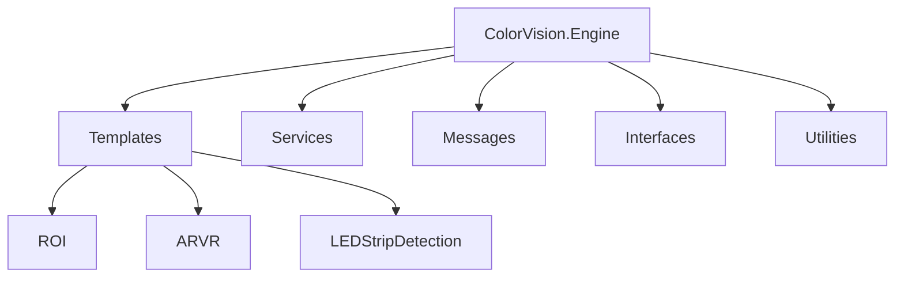
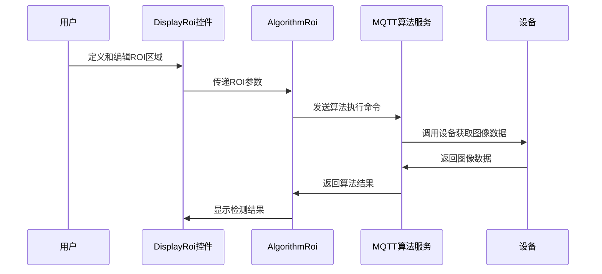

# ROI (感兴趣区域)


# ROI (感兴趣区域)

## 目录
1. [介绍](#介绍)
2. [项目结构](#项目结构)
3. [核心组件](#核心组件)
4. [架构概览](#架构概览)
5. [详细组件分析](#详细组件分析)
6. [依赖关系分析](#依赖关系分析)
7. [性能考虑](#性能考虑)
8. [故障排除指南](#故障排除指南)
9. [总结](#总结)

## 介绍
ROI（Region of Interest，感兴趣区域）是图像处理中一个非常重要的概念。它指的是在一幅图像中用户或算法特别关注的特定区域。通过定义和编辑ROI，系统能够专注于该区域进行后续的算法处理，如检测、分析和测量，从而提高处理效率和准确性。

本项目中的ROI功能主要用于“发光区检测”算法，通过用户定义的ROI区域，系统能够对图像中的特定区域进行检测和分析，支持模板的编辑和调用，并通过消息机制与设备和算法服务进行交互。

本文档将详细介绍项目中ROI相关的代码结构、核心组件、架构设计及其在图像处理中的作用，帮助读者深入理解ROI的定义、编辑及其在后续算法处理中的应用。

## 项目结构

该项目采用模块化设计，代码按照功能和技术层次进行分类。主要目录及其职责如下：



1. **Engine/ColorVision.Engine/Templates/ROI**  
   - 该目录下包含与ROI相关的模板代码，负责定义ROI参数、算法实现、显示界面等。  
   - 例如：`AlgorithmRoi.cs`实现了ROI的发光区检测算法，`ROIParam.cs`定义了ROI的参数模型。

2. **Engine/ColorVision.Engine/Services**  
   - 包含设备服务、算法服务等，负责与硬件设备和算法模块的交互。  
   - 例如，算法服务会调用ROI算法进行图像处理。

3. **Engine/ColorVision.Engine/Messages**  
   - 负责消息通信机制，实现算法与设备之间的消息传递。  
   - 支持异步命令发送和结果接收。

4. **Engine/ColorVision.Engine/Interfaces**  
   - 定义了系统中各模块的接口规范。  
   - 例如算法接口、结果处理接口等。

5. **UI相关目录**  
   - 负责界面显示和用户交互，如ROI的编辑和显示界面。

整体架构体现了典型的分层设计，分为数据模型层（参数定义）、算法实现层、服务层（设备和算法服务）、消息通信层和用户界面层。这样设计有利于模块解耦，便于维护和扩展。

## 核心组件

以下是与ROI相关的核心组件及其功能：

1. **AlgorithmRoi (AlgorithmRoi.cs)**  
   - 继承自`DisplayAlgorithmBase`，实现了发光区检测算法的封装。  
   - 负责管理算法模板的打开、用户界面控制和命令发送。  
   - 通过`SendCommand`方法将ROI参数和图像信息封装成消息，发送到算法服务进行处理。

2. **RoiParam (ROIParam.cs)**  
   - 继承自`ParamModBase`，定义了ROI算法的参数模型。  
   - 包含阈值（Threshold）、次数（Times）和平滑尺寸（SmoothSize）等参数，支持属性变更通知。  
   - 这些参数用于控制ROI检测算法的行为。

3. **DisplayRoi (未提供代码，推测为UI控件)**  
   - 用于显示和编辑ROI相关信息的用户控件。  
   - 由`AlgorithmRoi`通过`GetUserControl`方法实例化和管理。

4. **TemplateRoi (未提供代码，推测为模板数据结构)**  
   - 用于存储和管理ROI模板数据。

5. **消息机制（MQTTAlgorithm等）**  
   - 通过MQTT协议实现算法命令的异步发送和响应。  
   - `SendCommand`方法中构造的消息包含图像文件名、设备信息和模板参数。

## 架构概览

ROI模块架构主要包括以下几个部分：

- **参数定义层**：`RoiParam`类定义了ROI算法所需的参数，支持属性绑定和配置管理。
- **算法实现层**：`AlgorithmRoi`类封装了发光区检测算法的调用逻辑，包括模板管理和命令发送。
- **消息通信层**：通过MQTT消息机制实现算法服务的异步调用和结果传递。
- **用户界面层**：通过`DisplayRoi`用户控件实现ROI的显示和编辑，支持模板编辑窗口。
- **设备服务层**：`DeviceAlgorithm`和相关服务类管理设备和算法服务的连接及交互。

整体流程如下：



## 详细组件分析

### 1. AlgorithmRoi.cs

该文件实现了ROI的发光区检测算法类，主要功能包括：

- **属性**  
  - `Device`: 关联的设备算法实例。  
  - `DService`: 设备算法的MQTT服务访问属性。  
  - `OpenTemplateCommand`: 打开模板编辑窗口的命令。  
  - `TemplateSelectedIndex`: 当前选中的模板索引。  
  - `UserControl`: 绑定的用户控件实例。

- **方法**  
  - `OpenTemplate()`: 弹出模板编辑窗口，允许用户编辑ROI模板。  
  - `GetUserControl()`: 返回显示ROI的用户控件实例。  
  - `SendCommand()`: 构造并发送包含ROI参数和图像信息的消息，调用算法服务执行检测。

代码示例：

```csharp
public MsgRecord SendCommand(RoiParam param, string deviceCode, string deviceType, string fileName, FileExtType fileExtType, string serialNumber)
{
    string sn = string.IsNullOrWhiteSpace(serialNumber) ? DateTime.Now.ToString("yyyyMMdd'T'HHmmss.fffffff") : serialNumber;
    if (DService.HistoryFilePath.TryGetValue(fileName, out string fullpath))
        fileName = fullpath;

    var Params = new Dictionary<string, object>()
    {
        { "ImgFileName", fileName },
        { "FileType", fileExtType },
        { "DeviceCode", deviceCode },
        { "DeviceType", deviceType },
        { "TemplateParam", new CVTemplateParam() { ID = param.Id, Name = param.Name } }
    };

    MsgSend msg = new()
    {
        EventName = MQTTAlgorithmEventEnum.Event_LightArea2_GetData,
        SerialNumber = sn,
        Params = Params
    };

    return DService.PublishAsyncClient(msg);
}
```

该方法通过消息机制将ROI参数和图像信息发送给算法服务，触发发光区检测。

### 2. ROIParam.cs

该文件定义了ROI参数类，继承自`ParamModBase`，包含以下属性：

- **Threshold（阈值）**：用于图像处理中的阈值分割，控制检测灵敏度。  
- **Times（次数）**：可能用于控制处理迭代次数。  
- **SmoothSize（平滑尺寸）**：控制图像平滑处理的大小，影响检测结果的平滑度。

代码示例：

```csharp
[Category("ROI"), Description("阈值")]
public int Threshold { get => GetValue(_Threshold); set { SetProperty(ref _Threshold, value); } }
private int _Threshold = 1;

[Category("ROI"), Description("Times")]
public int Times { get => GetValue(_Times); set { SetProperty(ref _Times, value); } }
private int _Times = 1;

[Category("ROI"), Description("SmoothSize")]
public int SmoothSize { get => GetValue(_SmoothSize); set { SetProperty(ref _SmoothSize, value); } }
private int _SmoothSize = 1;
```

这些参数通过属性绑定支持UI界面动态更新和配置管理。

## 依赖关系分析

- `AlgorithmRoi`依赖于`DeviceAlgorithm`和`MQTTAlgorithm`服务，负责与设备和算法服务通信。  
- `AlgorithmRoi`使用`RoiParam`作为参数模型，传递ROI检测相关参数。  
- 消息机制基于MQTT，支持异步命令发送和结果接收。  
- 用户界面通过`DisplayRoi`控件和`TemplateEditorWindow`实现ROI的编辑和显示。

## 性能考虑

- ROI检测依赖于图像阈值和参数配置，合理设置参数有助于提高检测准确率和减少误检。  
- 消息异步发送机制有利于提升系统响应速度，但需注意消息队列管理和异常处理。  
- 平滑尺寸参数影响图像处理性能，过大可能导致计算量增加。

## 故障排除指南

- 若检测结果异常，建议检查ROI参数设置，尤其是阈值和平滑尺寸。  
- 模板编辑窗口无法打开时，确认`TemplateRoi`模板数据是否正确加载。  
- 消息发送失败时，检查MQTT服务连接和设备状态。

## 总结

本项目中的ROI模块通过定义灵活的参数模型和封装完善的算法调用逻辑，实现了图像中感兴趣区域的定义、编辑和检测。利用MQTT消息机制与设备和算法服务交互，支持异步处理和模板管理。用户界面层通过专用控件实现了友好的ROI编辑体验。整体设计结构清晰，层次分明，便于扩展和维护。

本说明文档详细解析了ROI相关的核心代码文件，帮助理解ROI的概念、定义方法及其在后续算法处理中的作用。

