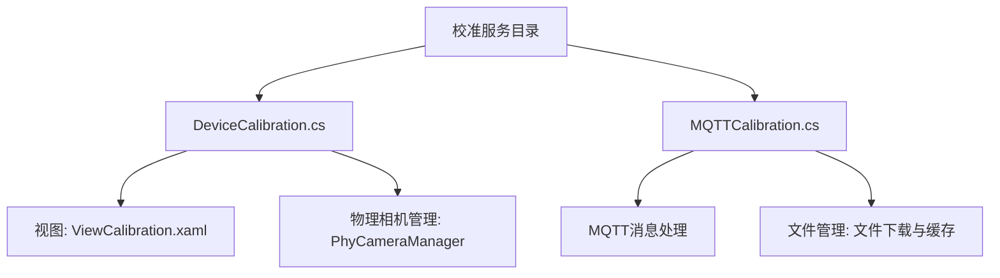
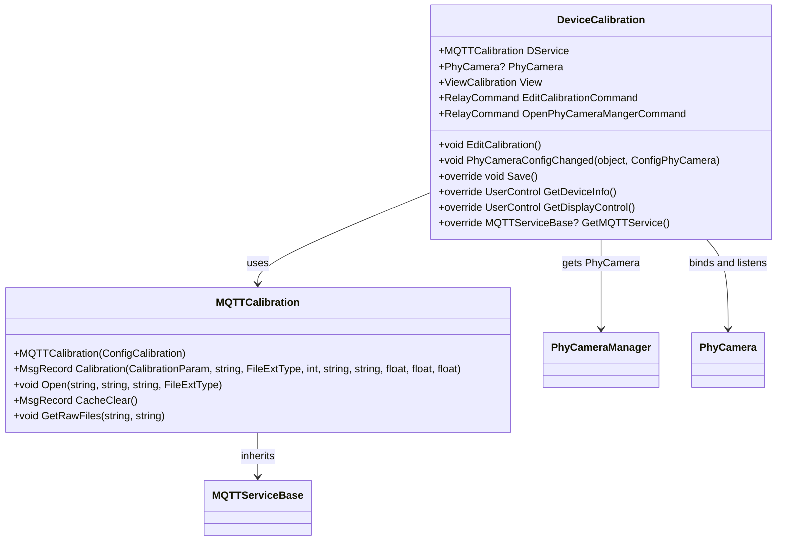

# 校准服务


# 校准服务

## 目录
1. [介绍](#介绍)
2. [项目结构](#项目结构)
3. [核心组件](#核心组件)
4. [架构概览](#架构概览)
5. [详细组件分析](#详细组件分析)
6. [依赖关系分析](#依赖关系分析)
7. [性能考量](#性能考量)
8. [故障排查指南](#故障排查指南)
9. [总结](#总结)

## 介绍
校准服务是设备校准流程中的关键模块，负责管理设备的校准操作、支持多种校准类型，并且管理和维护校准数据。它通过与物理相机设备的交互，实现对设备的配置和校准数据的处理，同时支持通过MQTT协议进行消息通信，确保设备校准过程的自动化和数据的有效传输。

本服务主要用于视觉设备的校准，确保设备能够准确捕获和处理图像数据，从而提升整体设备的测量和检测精度。

## 项目结构
校准服务代码主要位于以下路径：
```
/Engine/ColorVision.Engine/Services/Devices/Calibration/
```
该目录下包含了校准设备的核心实现文件，如 `DeviceCalibration.cs` 和消息通信相关的 `MQTTCalibration.cs` 文件。

### 目录结构说明
- **DeviceCalibration.cs**  
  这是校准设备的核心类，继承自设备服务基类，负责管理校准设备实例、视图、命令及与物理相机的绑定。
  
- **MQTTCalibration.cs**  
  负责通过MQTT协议与设备进行通信，发送校准相关指令，接收设备响应，并管理校准文件的下载和缓存清理。

此外，校准服务还依赖于其他模块，如物理相机管理（`PhyCameraManager`）、模板编辑（`TemplateEditorWindow`）和数据库连接（`MySqlSetting`）等，体现了模块化设计和职责分离。



## 核心组件

### 1. DeviceCalibration 类
- 继承自 `DeviceService<ConfigCalibration>`，代表一个校准设备服务实例。
- 维护一个 `MQTTCalibration` 实例用于消息通信。
- 绑定物理相机实例，通过 `PhyCameraManager` 获取。
- 提供编辑校准文件的命令和界面。
- 监听物理相机配置变化，自动更新校准数据。
- 提供设备信息和显示控件的界面组件。

### 2. MQTTCalibration 类
- 继承自 `MQTTDeviceService<ConfigCalibration>`，实现基于MQTT的校准设备通信。
- 发送校准请求消息，包含校准参数、文件信息及设备参数。
- 支持文件下载、缓存清理和获取原始文件列表的消息操作。
- 响应设备消息，处理返回数据（当前示例中未实现具体处理逻辑）。

## 架构概览
校准服务基于MVVM设计模式，分离了设备逻辑、视图和数据模型。设备服务类负责业务逻辑和设备状态管理，视图类负责UI呈现，MQTT服务类负责网络通信。通过物理相机管理模块实现设备间的绑定和配置同步。

消息通信采用MQTT协议，支持异步消息发布和接收，确保设备和服务之间的实时数据交互。



## 详细组件分析

### DeviceCalibration.cs
该类是校准服务的核心，负责设备的初始化、视图绑定、命令定义以及与物理相机的交互。

- 构造函数中：
  - 初始化 `MQTTCalibration` 服务实例。
  - 创建校准视图 `ViewCalibration` 并设置标题。
  - 设置图标资源。
  - 定义编辑命令 `EditCommand`，权限限制为管理员。
  - 定义打开物理相机管理器命令 `OpenPhyCameraMangerCommand`。
  - 绑定物理相机配置变化事件，动态响应配置变更。
  - 延迟加载显示控件 `DisplayCalibrationControl`。

- 关键方法：
  - `EditCalibration()`：打开模板编辑窗口进行校准文件编辑，包含数据库连接检查和物理相机存在性验证。
  - `PhyCameraConfigChanged()`：响应物理相机配置变更，解绑旧相机事件，绑定新相机，并保存当前配置。
  - `Save()`：保存当前配置，并通知物理相机更新校准信息。
  - `GetDeviceInfo()` 和 `GetDisplayControl()`：返回设备信息界面和显示控件。

代码片段示例：
```csharp
public void EditCalibration()
{
    if (PhyCamera == null)
    {
        MessageBox1.Show(Application.Current.GetActiveWindow(), "在使用校正前，请先配置对映的物理相机", "ColorVision");
        return;
    }
    if (MySqlSetting.Instance.IsUseMySql && !MySqlSetting.IsConnect)
    {
        MessageBox1.Show(Application.Current.MainWindow, Properties.Resources.DatabaseConnectionFailed, "ColorVision");
        return;
    }
    var ITemplate = new TemplateCalibrationParam(PhyCamera);
    var windowTemplate = new TemplateEditorWindow(ITemplate) { Owner = Application.Current.GetActiveWindow() };
    windowTemplate.ShowDialog();
}
```

### MQTTCalibration.cs
此类负责校准服务的消息通信，继承自通用MQTT设备服务基类。

- 构造函数中订阅消息返回事件 `MsgReturnReceived`。
- `Calibration()` 方法构造并发送校准请求消息，包含图像文件名、模板参数、设备参数（曝光RGB值和增益）。
- `Open()` 方法请求下载指定文件。
- `CacheClear()` 方法发送清除缓存的指令。
- `GetRawFiles()` 请求设备的所有原始文件列表。

代码片段示例：
```csharp
public MsgRecord Calibration(CalibrationParam item, string fileName, FileExtType fileExtType, int pid, string tempName, string serialNumber, float R, float G, float B)
{
    string sn = string.IsNullOrWhiteSpace(serialNumber) ? DateTime.Now.ToString("yyyyMMdd'T'HHmmss.fffffff") : serialNumber;
    var Params = new Dictionary<string, object>() { { "ImgFileName", fileName }, { "FileType", fileExtType } };
    Params.Add("TemplateParam", new CVTemplateParam() { ID = pid, Name = tempName });
    Params.Add("DeviceParam", new DeviceParamCalibration() { exp = new float[] { R, G, B }, gain = 1 });

    MsgSend msg = new()
    {
        EventName = MQTTCalibrationEventEnum.Event_GetData,
        SerialNumber = sn,
        Params = Params
    };
    return PublishAsyncClient(msg);
}
```

## 依赖关系分析
- `DeviceCalibration` 依赖于 `MQTTCalibration` 进行设备通信。
- 依赖 `PhyCameraManager` 管理物理相机实例，绑定相机配置事件实现配置联动。
- 使用 `TemplateEditorWindow` 实现校准模板的编辑界面。
- 依赖 `MySqlSetting` 判断数据库连接状态，确保数据存储的有效性。
- 通过 `AccessControl` 和权限注解控制操作权限，保证安全性。

## 性能考量
- 使用延迟加载（`Lazy<T>`）机制优化显示控件的初始化，避免不必要的资源占用。
- 通过事件订阅机制实现配置变更的实时响应，减少轮询和资源浪费。
- MQTT通信异步发布消息，提升通信效率，避免阻塞UI线程。

## 故障排查指南
- 如果无法编辑校正文件，检查是否配置了对应的物理相机。
- 校准数据存储失败时，确认数据库连接是否正常。
- MQTT消息通信异常时，检查设备代码匹配和网络连接状态。
- 权限不足时，相关命令会被禁止执行，需确保用户具有管理员权限。

## 总结
校准服务模块通过 `DeviceCalibration` 类实现设备的管理和校准视图的交互，通过 `MQTTCalibration` 类实现基于MQTT协议的设备通信。该模块支持设备校准流程中的数据管理、文件操作和权限控制，确保设备校准的准确性和操作的安全性。设计上利用MVVM模式和事件驱动机制，保证了系统的扩展性和响应性。

本服务是设备校准流程的核心组成部分，支撑了设备的高精度测量和质量控制，为设备的正常运行和维护提供了技术保障。

