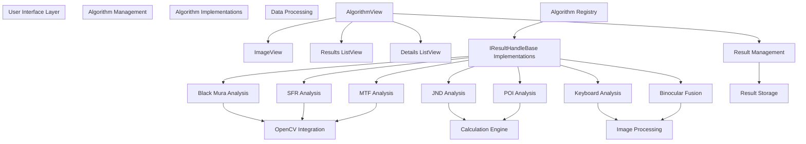
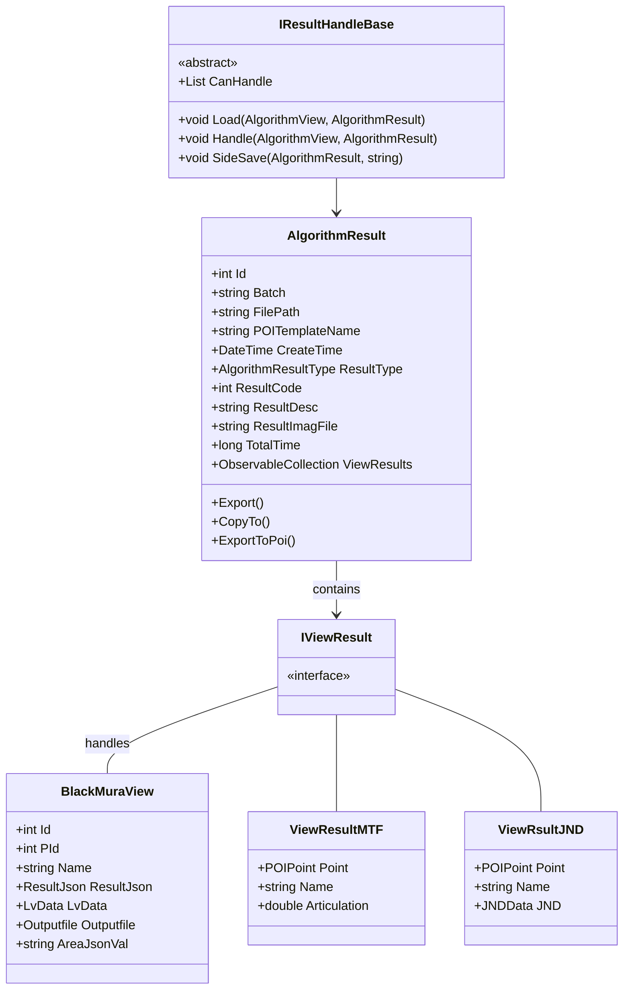
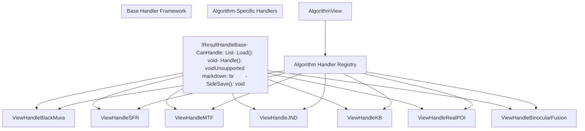
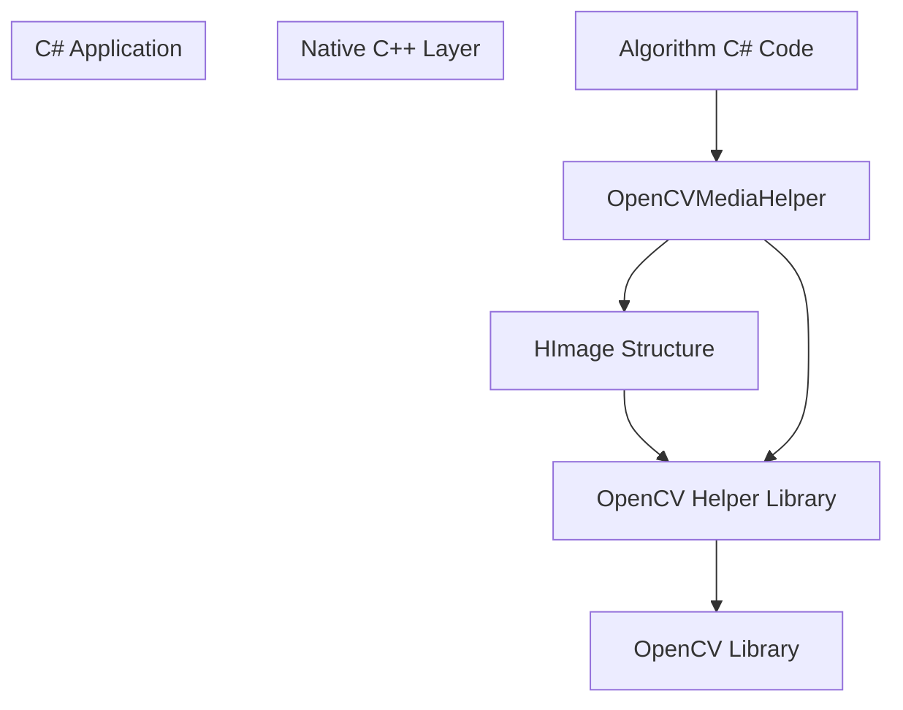

# Analysis Algorithms

> **Relevant source files**
> * [ColorVision/Update/ChangeLog/ChangelogWindow.xaml](https://github.com/xincheng213618/scgd_general_wpf/blob/987af5f7/ColorVision/Update/ChangeLog/ChangelogWindow.xaml)
> * [ColorVision/Update/ChangeLog/ChangelogWindow.xaml.cs](https://github.com/xincheng213618/scgd_general_wpf/blob/987af5f7/ColorVision/Update/ChangeLog/ChangelogWindow.xaml.cs)
> * [Engine/ColorVision.Engine/MySql/ORM/BaseTableDao.cs](https://github.com/xincheng213618/scgd_general_wpf/blob/987af5f7/Engine/ColorVision.Engine/MySql/ORM/BaseTableDao.cs)
> * [Engine/ColorVision.Engine/MySql/ORM/BaseTableDaoExtensions.cs](https://github.com/xincheng213618/scgd_general_wpf/blob/987af5f7/Engine/ColorVision.Engine/MySql/ORM/BaseTableDaoExtensions.cs)
> * [Engine/ColorVision.Engine/Rbac/Dao/UserDao.cs](https://github.com/xincheng213618/scgd_general_wpf/blob/987af5f7/Engine/ColorVision.Engine/Rbac/Dao/UserDao.cs)
> * [Engine/ColorVision.Engine/Services/CacheSettingWindow.xaml](https://github.com/xincheng213618/scgd_general_wpf/blob/987af5f7/Engine/ColorVision.Engine/Services/CacheSettingWindow.xaml)
> * [Engine/ColorVision.Engine/Services/CacheSettingWindow.xaml.cs](https://github.com/xincheng213618/scgd_general_wpf/blob/987af5f7/Engine/ColorVision.Engine/Services/CacheSettingWindow.xaml.cs)
> * [Engine/ColorVision.Engine/Services/Dao/MeasureImgResultDao.cs](https://github.com/xincheng213618/scgd_general_wpf/blob/987af5f7/Engine/ColorVision.Engine/Services/Dao/MeasureImgResultDao.cs)
> * [Engine/ColorVision.Engine/Services/Dao/ViewResultCamera.cs](https://github.com/xincheng213618/scgd_general_wpf/blob/987af5f7/Engine/ColorVision.Engine/Services/Dao/ViewResultCamera.cs)
> * [Engine/ColorVision.Engine/Services/Devices/Algorithm/Views/AlgorithmResult.cs](https://github.com/xincheng213618/scgd_general_wpf/blob/987af5f7/Engine/ColorVision.Engine/Services/Devices/Algorithm/Views/AlgorithmResult.cs)
> * [Engine/ColorVision.Engine/Services/Devices/Algorithm/Views/AlgorithmView.xaml](https://github.com/xincheng213618/scgd_general_wpf/blob/987af5f7/Engine/ColorVision.Engine/Services/Devices/Algorithm/Views/AlgorithmView.xaml)
> * [Engine/ColorVision.Engine/Services/Devices/Algorithm/Views/AlgorithmView.xaml.cs](https://github.com/xincheng213618/scgd_general_wpf/blob/987af5f7/Engine/ColorVision.Engine/Services/Devices/Algorithm/Views/AlgorithmView.xaml.cs)
> * [Engine/ColorVision.Engine/Services/Devices/Algorithm/Views/ViewAlgorithmConfig.cs](https://github.com/xincheng213618/scgd_general_wpf/blob/987af5f7/Engine/ColorVision.Engine/Services/Devices/Algorithm/Views/ViewAlgorithmConfig.cs)
> * [Engine/ColorVision.Engine/Services/Devices/Calibration/Views/ViewCalibration.xaml](https://github.com/xincheng213618/scgd_general_wpf/blob/987af5f7/Engine/ColorVision.Engine/Services/Devices/Calibration/Views/ViewCalibration.xaml)
> * [Engine/ColorVision.Engine/Services/Devices/Calibration/Views/ViewCalibrationConfig.cs](https://github.com/xincheng213618/scgd_general_wpf/blob/987af5f7/Engine/ColorVision.Engine/Services/Devices/Calibration/Views/ViewCalibrationConfig.cs)
> * [Engine/ColorVision.Engine/Services/Devices/Camera/AdvanceSearch.xaml](https://github.com/xincheng213618/scgd_general_wpf/blob/987af5f7/Engine/ColorVision.Engine/Services/Devices/Camera/AdvanceSearch.xaml)
> * [Engine/ColorVision.Engine/Services/Devices/Camera/AdvanceSearch.xaml.cs](https://github.com/xincheng213618/scgd_general_wpf/blob/987af5f7/Engine/ColorVision.Engine/Services/Devices/Camera/AdvanceSearch.xaml.cs)
> * [Engine/ColorVision.Engine/Services/Devices/Camera/Video/CameraVideoConfig.cs](https://github.com/xincheng213618/scgd_general_wpf/blob/987af5f7/Engine/ColorVision.Engine/Services/Devices/Camera/Video/CameraVideoConfig.cs)
> * [Engine/ColorVision.Engine/Services/Devices/Camera/Views/ViewCamera.xaml](https://github.com/xincheng213618/scgd_general_wpf/blob/987af5f7/Engine/ColorVision.Engine/Services/Devices/Camera/Views/ViewCamera.xaml)
> * [Engine/ColorVision.Engine/Services/Devices/Camera/Views/ViewCameraConfig.cs](https://github.com/xincheng213618/scgd_general_wpf/blob/987af5f7/Engine/ColorVision.Engine/Services/Devices/Camera/Views/ViewCameraConfig.cs)
> * [Engine/ColorVision.Engine/Services/Devices/SMU/Views/ViewSMU.xaml](https://github.com/xincheng213618/scgd_general_wpf/blob/987af5f7/Engine/ColorVision.Engine/Services/Devices/SMU/Views/ViewSMU.xaml)
> * [Engine/ColorVision.Engine/Services/Devices/Spectrum/Views/ViewSpectrum.xaml](https://github.com/xincheng213618/scgd_general_wpf/blob/987af5f7/Engine/ColorVision.Engine/Services/Devices/Spectrum/Views/ViewSpectrum.xaml)
> * [Engine/ColorVision.Engine/Services/ServiceManager.cs](https://github.com/xincheng213618/scgd_general_wpf/blob/987af5f7/Engine/ColorVision.Engine/Services/ServiceManager.cs)
> * [Engine/ColorVision.Engine/Templates/ARVR/MTF/ViewHandleMTF.cs](https://github.com/xincheng213618/scgd_general_wpf/blob/987af5f7/Engine/ColorVision.Engine/Templates/ARVR/MTF/ViewHandleMTF.cs)
> * [Engine/ColorVision.Engine/Templates/ARVR/SFR/ViewHandleSFR.cs](https://github.com/xincheng213618/scgd_general_wpf/blob/987af5f7/Engine/ColorVision.Engine/Templates/ARVR/SFR/ViewHandleSFR.cs)
> * [Engine/ColorVision.Engine/Templates/JND/ViewHandleJND.cs](https://github.com/xincheng213618/scgd_general_wpf/blob/987af5f7/Engine/ColorVision.Engine/Templates/JND/ViewHandleJND.cs)
> * [Engine/ColorVision.Engine/Templates/Jsons/BinocularFusion/ViewHandleBinocularFusion.cs](https://github.com/xincheng213618/scgd_general_wpf/blob/987af5f7/Engine/ColorVision.Engine/Templates/Jsons/BinocularFusion/ViewHandleBinocularFusion.cs)
> * [Engine/ColorVision.Engine/Templates/Jsons/BlackMura/AlgorithmBlackMura.cs](https://github.com/xincheng213618/scgd_general_wpf/blob/987af5f7/Engine/ColorVision.Engine/Templates/Jsons/BlackMura/AlgorithmBlackMura.cs)
> * [Engine/ColorVision.Engine/Templates/Jsons/BlackMura/BlackMuraDao.cs](https://github.com/xincheng213618/scgd_general_wpf/blob/987af5f7/Engine/ColorVision.Engine/Templates/Jsons/BlackMura/BlackMuraDao.cs)
> * [Engine/ColorVision.Engine/Templates/Jsons/BlackMura/DisplayBlackMura.xaml](https://github.com/xincheng213618/scgd_general_wpf/blob/987af5f7/Engine/ColorVision.Engine/Templates/Jsons/BlackMura/DisplayBlackMura.xaml)
> * [Engine/ColorVision.Engine/Templates/Jsons/BlackMura/DisplayBlackMura.xaml.cs](https://github.com/xincheng213618/scgd_general_wpf/blob/987af5f7/Engine/ColorVision.Engine/Templates/Jsons/BlackMura/DisplayBlackMura.xaml.cs)
> * [Engine/ColorVision.Engine/Templates/Jsons/BlackMura/LvData.cs](https://github.com/xincheng213618/scgd_general_wpf/blob/987af5f7/Engine/ColorVision.Engine/Templates/Jsons/BlackMura/LvData.cs)
> * [Engine/ColorVision.Engine/Templates/Jsons/BlackMura/ViewHandleBlackMura.cs](https://github.com/xincheng213618/scgd_general_wpf/blob/987af5f7/Engine/ColorVision.Engine/Templates/Jsons/BlackMura/ViewHandleBlackMura.cs)
> * [Engine/ColorVision.Engine/Templates/Jsons/DataConvert/DisplayBinocularFusion.xaml](https://github.com/xincheng213618/scgd_general_wpf/blob/987af5f7/Engine/ColorVision.Engine/Templates/Jsons/DataConvert/DisplayBinocularFusion.xaml)
> * [Engine/ColorVision.Engine/Templates/Jsons/KB/ViewHandleKB.cs](https://github.com/xincheng213618/scgd_general_wpf/blob/987af5f7/Engine/ColorVision.Engine/Templates/Jsons/KB/ViewHandleKB.cs)
> * [Engine/ColorVision.Engine/Templates/POI/AlgorithmImp/ViewHandleRealPOI.cs](https://github.com/xincheng213618/scgd_general_wpf/blob/987af5f7/Engine/ColorVision.Engine/Templates/POI/AlgorithmImp/ViewHandleRealPOI.cs)
> * [UI/ColorVision.Core/OpenCVMediaHelper.cs](https://github.com/xincheng213618/scgd_general_wpf/blob/987af5f7/UI/ColorVision.Core/OpenCVMediaHelper.cs)
> * [UI/ColorVision.ImageEditor/Tif/Opentif.cs](https://github.com/xincheng213618/scgd_general_wpf/blob/987af5f7/UI/ColorVision.ImageEditor/Tif/Opentif.cs)
> * [include/algorithm.h](https://github.com/xincheng213618/scgd_general_wpf/blob/987af5f7/include/algorithm.h)
> * [include/opencv_media_export.h](https://github.com/xincheng213618/scgd_general_wpf/blob/987af5f7/include/opencv_media_export.h)

This page documents the various image analysis algorithms integrated within the ColorVision system, their functionality, and how they process and visualize data. The Analysis Algorithms component provides capabilities for analyzing images for various properties such as uniformity, spatial frequency response, distortion, and more.

For information about Points of Interest (POI) which are often used as inputs to these algorithms, see [Points of Interest (POI) System](/xincheng213618/scgd_general_wpf/5.1-points-of-interest-(poi)-system).

## 1. Algorithm Types Overview

The ColorVision system includes several specialized analysis algorithms for different types of display and image testing requirements:

| Algorithm Type | Purpose | Result Type |
| --- | --- | --- |
| Black Mura | Analyzes display uniformity and detects black spots or areas | BlackMura_Caculate |
| SFR (Spatial Frequency Response) | Measures spatial resolution and sharpness | SFR |
| MTF (Modulation Transfer Function) | Evaluates optical system performance | MTF |
| JND (Just Noticeable Difference) | Measures minimum perceptible differences | Compliance_Math_JND, OLED_JND_CalVas |
| Keyboard | Tests keyboard functionality | KB, KB_Raw |
| POI XYZ/Y | Analyzes specific points for XYZ/Y colorimetric data | POI_XYZ_V2, POI_Y_V2, KB_Output_Lv, KB_Output_CIE |
| Binocular Fusion | Analyzes binocular display properties | ARVR_BinocularFusion |

Sources:

* [Engine/ColorVision.Engine/Services/Devices/Algorithm/Views/AlgorithmResult.cs

227-230](https://github.com/xincheng213618/scgd_general_wpf/blob/987af5f7/Engine/ColorVision.Engine/Services/Devices/Algorithm/Views/AlgorithmResult.cs#L227-L230)
* [Engine/ColorVision.Engine/Templates/Jsons/BlackMura/ViewHandleBlackMura.cs

24](https://github.com/xincheng213618/scgd_general_wpf/blob/987af5f7/Engine/ColorVision.Engine/Templates/Jsons/BlackMura/ViewHandleBlackMura.cs#L24-L24)
* [Engine/ColorVision.Engine/Templates/ARVR/SFR/ViewHandleSFR.cs

24](https://github.com/xincheng213618/scgd_general_wpf/blob/987af5f7/Engine/ColorVision.Engine/Templates/ARVR/SFR/ViewHandleSFR.cs#L24-L24)
* [Engine/ColorVision.Engine/Templates/ARVR/MTF/ViewHandleMTF.cs

23](https://github.com/xincheng213618/scgd_general_wpf/blob/987af5f7/Engine/ColorVision.Engine/Templates/ARVR/MTF/ViewHandleMTF.cs#L23-L23)
* [Engine/ColorVision.Engine/Templates/JND/ViewHandleJND.cs

19](https://github.com/xincheng213618/scgd_general_wpf/blob/987af5f7/Engine/ColorVision.Engine/Templates/JND/ViewHandleJND.cs#L19-L19)
* [Engine/ColorVision.Engine/Templates/Jsons/KB/ViewHandleKB.cs

24](https://github.com/xincheng213618/scgd_general_wpf/blob/987af5f7/Engine/ColorVision.Engine/Templates/Jsons/KB/ViewHandleKB.cs#L24-L24)
* [Engine/ColorVision.Engine/Templates/POI/AlgorithmImp/ViewHandleRealPOI.cs

43](https://github.com/xincheng213618/scgd_general_wpf/blob/987af5f7/Engine/ColorVision.Engine/Templates/POI/AlgorithmImp/ViewHandleRealPOI.cs#L43-L43)
* [Engine/ColorVision.Engine/Templates/Jsons/BinocularFusion/ViewHandleBinocularFusion.cs

17](https://github.com/xincheng213618/scgd_general_wpf/blob/987af5f7/Engine/ColorVision.Engine/Templates/Jsons/BinocularFusion/ViewHandleBinocularFusion.cs#L17-L17)

## 2. Analysis Framework Architecture

Sources:

* [Engine/ColorVision.Engine/Services/Devices/Algorithm/Views/AlgorithmView.xaml.cs

32-520](https://github.com/xincheng213618/scgd_general_wpf/blob/987af5f7/Engine/ColorVision.Engine/Services/Devices/Algorithm/Views/AlgorithmView.xaml.cs#L32-L520)
* [Engine/ColorVision.Engine/Templates/Jsons/BlackMura/ViewHandleBlackMura.cs

69-323](https://github.com/xincheng213618/scgd_general_wpf/blob/987af5f7/Engine/ColorVision.Engine/Templates/Jsons/BlackMura/ViewHandleBlackMura.cs#L69-L323)
* [Engine/ColorVision.Engine/Templates/ARVR/SFR/ViewHandleSFR.cs

22-183](https://github.com/xincheng213618/scgd_general_wpf/blob/987af5f7/Engine/ColorVision.Engine/Templates/ARVR/SFR/ViewHandleSFR.cs#L22-L183)
* [Engine/ColorVision.Engine/Templates/ARVR/MTF/ViewHandleMTF.cs

21-209](https://github.com/xincheng213618/scgd_general_wpf/blob/987af5f7/Engine/ColorVision.Engine/Templates/ARVR/MTF/ViewHandleMTF.cs#L21-L209)
* [Engine/ColorVision.Engine/Templates/JND/ViewHandleJND.cs

16-105](https://github.com/xincheng213618/scgd_general_wpf/blob/987af5f7/Engine/ColorVision.Engine/Templates/JND/ViewHandleJND.cs#L16-L105)
* [Engine/ColorVision.Engine/Templates/Jsons/KB/ViewHandleKB.cs

21-151](https://github.com/xincheng213618/scgd_general_wpf/blob/987af5f7/Engine/ColorVision.Engine/Templates/Jsons/KB/ViewHandleKB.cs#L21-L151)
* [Engine/ColorVision.Engine/Templates/POI/AlgorithmImp/ViewHandleRealPOI.cs

40-157](https://github.com/xincheng213618/scgd_general_wpf/blob/987af5f7/Engine/ColorVision.Engine/Templates/POI/AlgorithmImp/ViewHandleRealPOI.cs#L40-L157)

## 3. Algorithm Result Structure

The algorithm framework is built around a standardized result structure that allows different algorithm types to be handled in a consistent way.

Sources:

* [Engine/ColorVision.Engine/Services/Devices/Algorithm/Views/AlgorithmResult.cs

20-246](https://github.com/xincheng213618/scgd_general_wpf/blob/987af5f7/Engine/ColorVision.Engine/Services/Devices/Algorithm/Views/AlgorithmResult.cs#L20-L246)
* [Engine/ColorVision.Engine/Templates/Jsons/BlackMura/BlackMuraDao.cs

8-36](https://github.com/xincheng213618/scgd_general_wpf/blob/987af5f7/Engine/ColorVision.Engine/Templates/Jsons/BlackMura/BlackMuraDao.cs#L8-L36)
* [Engine/ColorVision.Engine/Templates/ARVR/MTF/ViewHandleMTF.cs

21-209](https://github.com/xincheng213618/scgd_general_wpf/blob/987af5f7/Engine/ColorVision.Engine/Templates/ARVR/MTF/ViewHandleMTF.cs#L21-L209)
* [Engine/ColorVision.Engine/Templates/JND/ViewHandleJND.cs

16-105](https://github.com/xincheng213618/scgd_general_wpf/blob/987af5f7/Engine/ColorVision.Engine/Templates/JND/ViewHandleJND.cs#L16-L105)

## 4. Algorithm Handler System

The ColorVision system employs a handler-based architecture for processing algorithm results. Each algorithm type has a corresponding handler class that inherits from the `IResultHandleBase` abstract class.

Each handler implements three key methods:

* `Load()`: Loads the algorithm result data from storage
* `Handle()`: Processes the algorithm result for display
* `SideSave()`: Exports the algorithm result data to a file

Sources:

* [Engine/ColorVision.Engine/Templates/Jsons/BlackMura/ViewHandleBlackMura.cs

69-323](https://github.com/xincheng213618/scgd_general_wpf/blob/987af5f7/Engine/ColorVision.Engine/Templates/Jsons/BlackMura/ViewHandleBlackMura.cs#L69-L323)
* [Engine/ColorVision.Engine/Templates/ARVR/SFR/ViewHandleSFR.cs

22-183](https://github.com/xincheng213618/scgd_general_wpf/blob/987af5f7/Engine/ColorVision.Engine/Templates/ARVR/SFR/ViewHandleSFR.cs#L22-L183)
* [Engine/ColorVision.Engine/Templates/ARVR/MTF/ViewHandleMTF.cs

21-209](https://github.com/xincheng213618/scgd_general_wpf/blob/987af5f7/Engine/ColorVision.Engine/Templates/ARVR/MTF/ViewHandleMTF.cs#L21-L209)
* [Engine/ColorVision.Engine/Templates/JND/ViewHandleJND.cs

16-105](https://github.com/xincheng213618/scgd_general_wpf/blob/987af5f7/Engine/ColorVision.Engine/Templates/JND/ViewHandleJND.cs#L16-L105)
* [Engine/ColorVision.Engine/Templates/Jsons/KB/ViewHandleKB.cs

21-151](https://github.com/xincheng213618/scgd_general_wpf/blob/987af5f7/Engine/ColorVision.Engine/Templates/Jsons/KB/ViewHandleKB.cs#L21-L151)
* [Engine/ColorVision.Engine/Templates/POI/AlgorithmImp/ViewHandleRealPOI.cs

40-157](https://github.com/xincheng213618/scgd_general_wpf/blob/987af5f7/Engine/ColorVision.Engine/Templates/POI/AlgorithmImp/ViewHandleRealPOI.cs#L40-L157)
* [Engine/ColorVision.Engine/Templates/Jsons/BinocularFusion/ViewHandleBinocularFusion.cs

15-94](https://github.com/xincheng213618/scgd_general_wpf/blob/987af5f7/Engine/ColorVision.Engine/Templates/Jsons/BinocularFusion/ViewHandleBinocularFusion.cs#L15-L94)

## 5. Algorithm Analysis Types in Detail

### 5.1 Black Mura Analysis

The Black Mura analysis algorithm detects non-uniformities in display luminance, particularly focused on identifying dark spots or areas.

Key capabilities:

* Detection of luminance variations across displays
* Calculation of uniformity percentages
* Identification of maximum and minimum luminance points
* Visualization of affected areas

Black Mura results include:

* Average luminance (LvAvg)
* Maximum luminance (LvMax)
* Minimum luminance (LvMin)
* Uniformity percentage
* Maximum relative variation (ZaRelMax)
* Area of interest in JSON format

The analysis generates several output files:

* AA path image (analysis area visualization)
* Result path image
* Mask path image

Sources:

* [Engine/ColorVision.Engine/Templates/Jsons/BlackMura/ViewHandleBlackMura.cs

69-323](https://github.com/xincheng213618/scgd_general_wpf/blob/987af5f7/Engine/ColorVision.Engine/Templates/Jsons/BlackMura/ViewHandleBlackMura.cs#L69-L323)
* [Engine/ColorVision.Engine/Templates/Jsons/BlackMura/BlackMuraDao.cs

8-36](https://github.com/xincheng213618/scgd_general_wpf/blob/987af5f7/Engine/ColorVision.Engine/Templates/Jsons/BlackMura/BlackMuraDao.cs#L8-L36)
* [Engine/ColorVision.Engine/Templates/Jsons/BlackMura/LvData.cs

1-55](https://github.com/xincheng213618/scgd_general_wpf/blob/987af5f7/Engine/ColorVision.Engine/Templates/Jsons/BlackMura/LvData.cs#L1-L55)

### 5.2 Spatial Frequency Response (SFR) Analysis

The SFR analysis measures spatial frequency response, which is critical for evaluating image sharpness and resolution quality.

Key capabilities:

* Measurement of spatial resolution in defined regions
* Analysis of frequency response
* Evaluation of sharpness characteristics

SFR results include:

* ROI coordinates (RoiX, RoiY)
* ROI dimensions (RoiWidth, RoiHeight)
* Frequency data (Pdfrequency)
* Sampling data (PdomainSamplingData)

Sources:

* [Engine/ColorVision.Engine/Templates/ARVR/SFR/ViewHandleSFR.cs

22-183](https://github.com/xincheng213618/scgd_general_wpf/blob/987af5f7/Engine/ColorVision.Engine/Templates/ARVR/SFR/ViewHandleSFR.cs#L22-L183)

### 5.3 Modulation Transfer Function (MTF) Analysis

The MTF analysis evaluates the optical performance of display systems by measuring how well the system preserves contrast at different spatial frequencies.

Key capabilities:

* Measurement of contrast transfer at multiple points
* Evaluation of optical system performance
* Statistical analysis of results including maximum, minimum, and average values

MTF results include:

* Point positions and dimensions
* MTF articulation values
* Statistical summary with uniformity calculation

Sources:

* [Engine/ColorVision.Engine/Templates/ARVR/MTF/ViewHandleMTF.cs

21-209](https://github.com/xincheng213618/scgd_general_wpf/blob/987af5f7/Engine/ColorVision.Engine/Templates/ARVR/MTF/ViewHandleMTF.cs#L21-L209)

### 5.4 Just Noticeable Difference (JND) Analysis

The JND analysis measures the minimum difference in display outputs that can be perceived by a human observer.

Key capabilities:

* Measurement of horizontal and vertical JND values
* Analysis of perceptual differences in displays
* Evaluation of display quality based on human perception thresholds

JND results include:

* Point information (position, dimensions)
* Horizontal JND (h_jnd)
* Vertical JND (v_jnd)

Sources:

* [Engine/ColorVision.Engine/Templates/JND/ViewHandleJND.cs

16-105](https://github.com/xincheng213618/scgd_general_wpf/blob/987af5f7/Engine/ColorVision.Engine/Templates/JND/ViewHandleJND.cs#L16-L105)

### 5.5 Keyboard (KB) Analysis

The Keyboard analysis is specialized for testing keyboard functionality and performance.

Key capabilities:

* Tracking of key activation
* Visualization of key states
* Result image generation for keyboard testing

KB results include:

* POI points mapping to keyboard keys
* Value data for each key
* Result image showing key states

Sources:

* [Engine/ColorVision.Engine/Templates/Jsons/KB/ViewHandleKB.cs

21-151](https://github.com/xincheng213618/scgd_general_wpf/blob/987af5f7/Engine/ColorVision.Engine/Templates/Jsons/KB/ViewHandleKB.cs#L21-L151)

### 5.6 Points of Interest (POI) Analysis

The POI analysis evaluates specific points on a display for colorimetric and luminance properties.

Key capabilities:

* XYZ color space analysis
* Luminance (Y) measurement
* CIE color coordinate analysis
* Advanced color information including CCT (Correlated Color Temperature)

POI results include:

* Point information (name, position, dimensions)
* XYZ colorimetric data
* Luminance values
* CIE color coordinates
* CCT values
* Wavelength data for spectrally pure colors

Sources:

* [Engine/ColorVision.Engine/Templates/POI/AlgorithmImp/ViewHandleRealPOI.cs

40-157](https://github.com/xincheng213618/scgd_general_wpf/blob/987af5f7/Engine/ColorVision.Engine/Templates/POI/AlgorithmImp/ViewHandleRealPOI.cs#L40-L157)

### 5.7 Binocular Fusion Analysis

The Binocular Fusion analysis evaluates properties related to binocular display systems, particularly important for AR/VR applications.

Key capabilities:

* Analysis of cross-mark center positioning
* Measurement of angular properties in X, Y, and Z axes

Binocular Fusion results include:

* Cross mark center coordinates (CrossMarkCenterX, CrossMarkCenterY)
* Angular measurements (XDegree, YDegree, ZDegree)

Sources:

* [Engine/ColorVision.Engine/Templates/Jsons/BinocularFusion/ViewHandleBinocularFusion.cs

15-94](https://github.com/xincheng213618/scgd_general_wpf/blob/987af5f7/Engine/ColorVision.Engine/Templates/Jsons/BinocularFusion/ViewHandleBinocularFusion.cs#L15-L94)

## 6. OpenCV Integration

The analysis algorithms heavily rely on OpenCV for image processing capabilities. The system integrates with OpenCV through a set of native function calls.

Key image processing functions provided by the OpenCV integration:

| Function | Purpose |
| --- | --- |
| M_PseudoColor | Applies pseudo-color to grayscale images |
| M_AutoLevelsAdjust | Automatically adjusts image levels |
| M_AutomaticColorAdjustment | Performs automatic color adjustment |
| M_AutomaticToneAdjustment | Adjusts image tone automatically |
| M_ExtractChannel | Extracts specific color channels |
| M_DrawPoiImage | Draws POI markers on images |
| M_FindLuminousArea | Identifies luminous areas in images |
| M_GetWhiteBalance | Performs white balance adjustment |
| M_ApplyGammaCorrection | Applies gamma correction |
| M_AdjustBrightnessContrast | Adjusts image brightness and contrast |
| M_Threshold | Applies thresholding operations |
| M_RemoveMoire | Removes moiré patterns |
| M_StitchImages | Combines multiple images into one |

Sources:

* [UI/ColorVision.Core/OpenCVMediaHelper.cs

15-158](https://github.com/xincheng213618/scgd_general_wpf/blob/987af5f7/UI/ColorVision.Core/OpenCVMediaHelper.cs#L15-L158)
* [include/opencv_media_export.h L15-L72](https://github.com/xincheng213618/scgd_general_wpf/blob/987af5f7/include/opencv_media_export.h#L15-L72)
* [include/algorithm.h L1-L97](https://github.com/xincheng213618/scgd_general_wpf/blob/987af5f7/include/algorithm.h#L1-L97)
* [UI/ColorVision.ImageEditor/Tif/Opentif.cs

57-131](https://github.com/xincheng213618/scgd_general_wpf/blob/987af5f7/UI/ColorVision.ImageEditor/Tif/Opentif.cs#L57-L131)

## 7. Algorithm Result Management

The system provides comprehensive management of algorithm results through the AlgorithmView component.

### 7.1 Result Storage and Database Management

Algorithm results are stored in a MySQL database using a custom ORM implementation. Each algorithm type has its own table structure for storing specific result data.

The base class for database access is `BaseTableDao<T>`, which provides common CRUD operations:

* GetAll() - Retrieves all results
* GetById() - Retrieves a specific result by ID
* GetByParam() - Retrieves results matching specific parameters
* ConditionalQuery() - Performs complex queries with multiple conditions
* Save() - Saves results to the database
* DeleteById() - Deletes results by ID

Sources:

* [Engine/ColorVision.Engine/MySql/ORM/BaseTableDao.cs

10-257](https://github.com/xincheng213618/scgd_general_wpf/blob/987af5f7/Engine/ColorVision.Engine/MySql/ORM/BaseTableDao.cs#L10-L257)
* [Engine/ColorVision.Engine/MySql/ORM/BaseTableDaoExtensions.cs

1-46](https://github.com/xincheng213618/scgd_general_wpf/blob/987af5f7/Engine/ColorVision.Engine/MySql/ORM/BaseTableDaoExtensions.cs#L1-L46)
* [Engine/ColorVision.Engine/Services/Dao/MeasureImgResultDao.cs

10-92](https://github.com/xincheng213618/scgd_general_wpf/blob/987af5f7/Engine/ColorVision.Engine/Services/Dao/MeasureImgResultDao.cs#L10-L92)
* [Engine/ColorVision.Engine/Templates/Jsons/BlackMura/BlackMuraDao.cs

65-72](https://github.com/xincheng213618/scgd_general_wpf/blob/987af5f7/Engine/ColorVision.Engine/Templates/Jsons/BlackMura/BlackMuraDao.cs#L65-L72)

### 7.2 Result Visualization

The AlgorithmView provides a rich visualization interface for algorithm results including:

* A main image viewer that displays the analyzed image
* Visual overlays showing analysis points, regions, and measurements
* A results list showing all available analysis results
* A detail panel showing specific properties of the selected result

The visualization is tailored to each algorithm type through the specialized handler implementations.

Sources:

* [Engine/ColorVision.Engine/Services/Devices/Algorithm/Views/AlgorithmView.xaml

1-248](https://github.com/xincheng213618/scgd_general_wpf/blob/987af5f7/Engine/ColorVision.Engine/Services/Devices/Algorithm/Views/AlgorithmView.xaml#L1-L248)
* [Engine/ColorVision.Engine/Services/Devices/Algorithm/Views/AlgorithmView.xaml.cs

32-520](https://github.com/xincheng213618/scgd_general_wpf/blob/987af5f7/Engine/ColorVision.Engine/Services/Devices/Algorithm/Views/AlgorithmView.xaml.cs#L32-L520)

### 7.3 Result Export

The system provides several export options for algorithm results:

* CSV export of tabular data
* Image export of visualization
* Custom format exports for specific algorithm types

Each algorithm handler implements its own `SideSave()` method that exports data in the most appropriate format for that algorithm type.

Sources:

* [Engine/ColorVision.Engine/Services/Devices/Algorithm/Views/AlgorithmView.xaml.cs

461-492](https://github.com/xincheng213618/scgd_general_wpf/blob/987af5f7/Engine/ColorVision.Engine/Services/Devices/Algorithm/Views/AlgorithmView.xaml.cs#L461-L492)
* [Engine/ColorVision.Engine/Templates/Jsons/BlackMura/ViewHandleBlackMura.cs

85-157](https://github.com/xincheng213618/scgd_general_wpf/blob/987af5f7/Engine/ColorVision.Engine/Templates/Jsons/BlackMura/ViewHandleBlackMura.cs#L85-L157)
* [Engine/ColorVision.Engine/Templates/ARVR/SFR/ViewHandleSFR.cs

26-107](https://github.com/xincheng213618/scgd_general_wpf/blob/987af5f7/Engine/ColorVision.Engine/Templates/ARVR/SFR/ViewHandleSFR.cs#L26-L107)
* [Engine/ColorVision.Engine/Templates/ARVR/MTF/ViewHandleMTF.cs

26-121](https://github.com/xincheng213618/scgd_general_wpf/blob/987af5f7/Engine/ColorVision.Engine/Templates/ARVR/MTF/ViewHandleMTF.cs#L26-L121)
* [Engine/ColorVision.Engine/Templates/JND/ViewHandleJND.cs

22-49](https://github.com/xincheng213618/scgd_general_wpf/blob/987af5f7/Engine/ColorVision.Engine/Templates/JND/ViewHandleJND.cs#L22-L49)
* [Engine/ColorVision.Engine/Templates/Jsons/KB/ViewHandleKB.cs

26-64](https://github.com/xincheng213618/scgd_general_wpf/blob/987af5f7/Engine/ColorVision.Engine/Templates/Jsons/KB/ViewHandleKB.cs#L26-L64)
* [Engine/ColorVision.Engine/Templates/POI/AlgorithmImp/ViewHandleRealPOI.cs

45-101](https://github.com/xincheng213618/scgd_general_wpf/blob/987af5f7/Engine/ColorVision.Engine/Templates/POI/AlgorithmImp/ViewHandleRealPOI.cs#L45-L101)
* [Engine/ColorVision.Engine/Templates/Jsons/BinocularFusion/ViewHandleBinocularFusion.cs

19-53](https://github.com/xincheng213618/scgd_general_wpf/blob/987af5f7/Engine/ColorVision.Engine/Templates/Jsons/BinocularFusion/ViewHandleBinocularFusion.cs#L19-L53)

## 8. Configuration System

The analysis algorithms system includes a configuration framework for managing user preferences and system settings.

The main configuration class is `ViewAlgorithmConfig`, which stores settings such as:

* `GridViewColumnVisibilitys` - Column visibility settings for the results grid
* `ImageViewConfig` - Configuration for the image viewer
* `IsShowListView` - Whether to show the results list
* `IsShowSideListView` - Whether to show the side details panel
* `AutoSaveSideData` - Whether to automatically save side data
* `SaveSideDataDirPath` - Directory path for saving side data
* `SearchLimit` - Maximum number of search results to display

Each algorithm type may also have its own specific configuration. For example, `BlackMuraConfig` includes settings like:

* `LvMaxScale` - Scaling factor for maximum luminance
* `LvMinScale` - Scaling factor for minimum luminance
* `ZaRelMaxScale` - Scaling factor for maximum relative variation

Sources:

* [Engine/ColorVision.Engine/Services/Devices/Algorithm/Views/ViewAlgorithmConfig.cs

13-62](https://github.com/xincheng213618/scgd_general_wpf/blob/987af5f7/Engine/ColorVision.Engine/Services/Devices/Algorithm/Views/ViewAlgorithmConfig.cs#L13-L62)
* [Engine/ColorVision.Engine/Templates/Jsons/BlackMura/ViewHandleBlackMura.cs

25-52](https://github.com/xincheng213618/scgd_general_wpf/blob/987af5f7/Engine/ColorVision.Engine/Templates/Jsons/BlackMura/ViewHandleBlackMura.cs#L25-L52)

## Summary

The Analysis Algorithms system in ColorVision provides a comprehensive framework for analyzing images to evaluate various display and optical properties. It incorporates multiple specialized algorithms, each designed for specific types of analysis. The system leverages OpenCV for image processing capabilities and provides rich visualization, data management, and export functionality.

The extensible handler-based architecture allows new algorithm types to be added while maintaining a consistent user interface and data management approach. This modular design enables the system to adapt to new analysis requirements while providing a cohesive user experience.