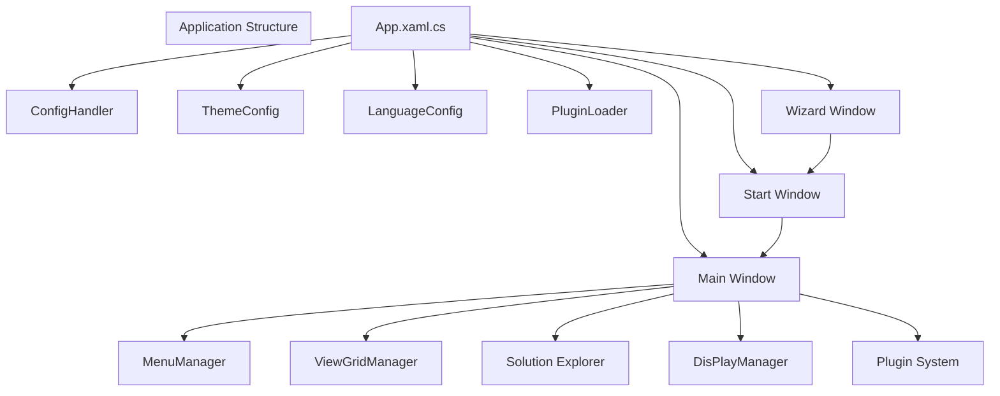
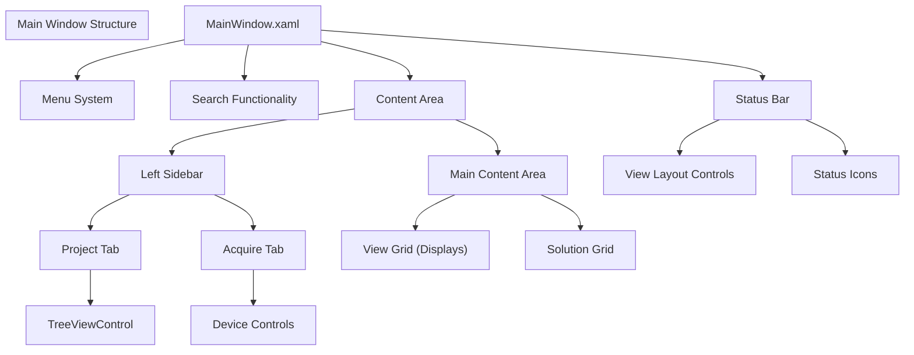

# Application Structure

> **Relevant source files**
> * [CHANGELOG.md](https://github.com/xincheng213618/scgd_general_wpf/blob/987af5f7/CHANGELOG.md)
> * [ColorVision/App.xaml.cs](https://github.com/xincheng213618/scgd_general_wpf/blob/987af5f7/ColorVision/App.xaml.cs)
> * [ColorVision/ColorVision.csproj](https://github.com/xincheng213618/scgd_general_wpf/blob/987af5f7/ColorVision/ColorVision.csproj)
> * [ColorVision/MainWindow.xaml](https://github.com/xincheng213618/scgd_general_wpf/blob/987af5f7/ColorVision/MainWindow.xaml)
> * [ColorVision/MainWindow.xaml.cs](https://github.com/xincheng213618/scgd_general_wpf/blob/987af5f7/ColorVision/MainWindow.xaml.cs)
> * [ColorVision/Update/AutoUpdater.cs](https://github.com/xincheng213618/scgd_general_wpf/blob/987af5f7/ColorVision/Update/AutoUpdater.cs)
> * [Directory.Build.props](https://github.com/xincheng213618/scgd_general_wpf/blob/987af5f7/Directory.Build.props)
> * [Engine/CVImageChannelLib/CVImageChannelLib.csproj](https://github.com/xincheng213618/scgd_general_wpf/blob/987af5f7/Engine/CVImageChannelLib/CVImageChannelLib.csproj)
> * [Engine/ColorVision.Engine/Assets/Tool/UsbTreeView.exe](https://github.com/xincheng213618/scgd_general_wpf/blob/987af5f7/Engine/ColorVision.Engine/Assets/Tool/UsbTreeView.exe)
> * [Engine/ColorVision.Engine/Assets/Tool/sscom5.13.1.exe](https://github.com/xincheng213618/scgd_general_wpf/blob/987af5f7/Engine/ColorVision.Engine/Assets/Tool/sscom5.13.1.exe)
> * [Engine/ColorVision.Engine/ColorVision.Engine.csproj](https://github.com/xincheng213618/scgd_general_wpf/blob/987af5f7/Engine/ColorVision.Engine/ColorVision.Engine.csproj)
> * [Engine/ColorVision.Engine/Services/PhyCameras/PhyCameraManagerWindow.xaml](https://github.com/xincheng213618/scgd_general_wpf/blob/987af5f7/Engine/ColorVision.Engine/Services/PhyCameras/PhyCameraManagerWindow.xaml)
> * [Engine/ColorVision.Engine/Services/PhyCameras/PhyCameraManagerWindow.xaml.cs](https://github.com/xincheng213618/scgd_general_wpf/blob/987af5f7/Engine/ColorVision.Engine/Services/PhyCameras/PhyCameraManagerWindow.xaml.cs)
> * [Engine/ColorVision.Engine/Templates/Validate/TemplateComplyParam.cs](https://github.com/xincheng213618/scgd_general_wpf/blob/987af5f7/Engine/ColorVision.Engine/Templates/Validate/TemplateComplyParam.cs)
> * [Engine/ColorVision.Engine/ToolPlugins/LedTool.cs](https://github.com/xincheng213618/scgd_general_wpf/blob/987af5f7/Engine/ColorVision.Engine/ToolPlugins/LedTool.cs)
> * [Engine/ColorVision.Engine/ToolPlugins/USBtool.cs](https://github.com/xincheng213618/scgd_general_wpf/blob/987af5f7/Engine/ColorVision.Engine/ToolPlugins/USBtool.cs)
> * [UI/ColorVision.Common/Authorizations/PermissionMode.cs](https://github.com/xincheng213618/scgd_general_wpf/blob/987af5f7/UI/ColorVision.Common/Authorizations/PermissionMode.cs)
> * [UI/ColorVision.Common/ColorVision.Common.csproj](https://github.com/xincheng213618/scgd_general_wpf/blob/987af5f7/UI/ColorVision.Common/ColorVision.Common.csproj)
> * [UI/ColorVision.Common/README.md](https://github.com/xincheng213618/scgd_general_wpf/blob/987af5f7/UI/ColorVision.Common/README.md)
> * [UI/ColorVision.Core/ColorVision.Core.csproj](https://github.com/xincheng213618/scgd_general_wpf/blob/987af5f7/UI/ColorVision.Core/ColorVision.Core.csproj)
> * [UI/ColorVision.Core/README.md](https://github.com/xincheng213618/scgd_general_wpf/blob/987af5f7/UI/ColorVision.Core/README.md)
> * [UI/ColorVision.ImageEditor/ColorVision.ImageEditor.csproj](https://github.com/xincheng213618/scgd_general_wpf/blob/987af5f7/UI/ColorVision.ImageEditor/ColorVision.ImageEditor.csproj)
> * [UI/ColorVision.Scheduler/ColorVision.Scheduler.csproj](https://github.com/xincheng213618/scgd_general_wpf/blob/987af5f7/UI/ColorVision.Scheduler/ColorVision.Scheduler.csproj)
> * [UI/ColorVision.Solution/ColorVision.Solution.csproj](https://github.com/xincheng213618/scgd_general_wpf/blob/987af5f7/UI/ColorVision.Solution/ColorVision.Solution.csproj)
> * [UI/ColorVision.Themes/ColorVision.Themes.csproj](https://github.com/xincheng213618/scgd_general_wpf/blob/987af5f7/UI/ColorVision.Themes/ColorVision.Themes.csproj)
> * [UI/ColorVision.UI/ColorVision.UI.csproj](https://github.com/xincheng213618/scgd_general_wpf/blob/987af5f7/UI/ColorVision.UI/ColorVision.UI.csproj)
> * [UI/ColorVision.UI/README.md](https://github.com/xincheng213618/scgd_general_wpf/blob/987af5f7/UI/ColorVision.UI/README.md)
> * [UI/Directory.Build.props](https://github.com/xincheng213618/scgd_general_wpf/blob/987af5f7/UI/Directory.Build.props)
> * [scgd_general_wpf.sln](https://github.com/xincheng213618/scgd_general_wpf/blob/987af5f7/scgd_general_wpf.sln)

This document provides a comprehensive overview of the ColorVision application's core architecture, explaining the main components, startup sequence, and how different parts of the system interact. For details about the initialization process, see [Initialization Process](/xincheng213618/scgd_general_wpf/2.2-initialization-process), and for configuration details, see [Configuration System](/xincheng213618/scgd_general_wpf/2.3-configuration-system).

## High-Level Architecture

The ColorVision application follows a layered architecture with a modular plugin system, providing clear separation between UI, business logic, and services.

Sources: [ColorVision/App.xaml.cs

1-185](https://github.com/xincheng213618/scgd_general_wpf/blob/987af5f7/ColorVision/App.xaml.cs#L1-L185)

 [ColorVision/MainWindow.xaml.cs

1-443](https://github.com/xincheng213618/scgd_general_wpf/blob/987af5f7/ColorVision/MainWindow.xaml.cs#L1-L443)

## Application Layers

The ColorVision system is divided into distinct layers, each with specific responsibilities:

```mermaid
flowchart TD

subgraph Layer_Architecture ["Layer Architecture"]
end

UI["UI Layer"]
Themes["ColorVision.Themes"]
ImageEditor["ColorVision.ImageEditor"]
Solution["ColorVision.Solution"]
UICore["ColorVision.UI"]
Scheduler["ColorVision.Scheduler"]
Engine["Engine Layer"]
EngineCore["ColorVision.Engine"]
Net["ColorVision.Net"]
cvColorVision["cvColorVision"]
ImageChannel["CVImageChannelLib"]
Common["ColorVision.Common"]
CoreUtils["ColorVision.Core"]
MainWindow["Main Application"]
PluginSystem["Plugin System"]
Projects["Specialized Projects"]
Tools["Tool Plugins"]
Services["Service Plugins"]

    UI --> Themes
    UI --> ImageEditor
    UI --> Solution
    UI --> UICore
    UI --> Scheduler
    Engine --> EngineCore
    Engine --> Net
    Engine --> cvColorVision
    Engine --> ImageChannel
    Core --> Common
    Core --> CoreUtils
    MainWindow --> UI
    MainWindow --> Engine
    MainWindow --> Core
    PluginSystem --> Projects
    PluginSystem --> Tools
    PluginSystem --> Services
```

Sources: [scgd_general_wpf.sln L1-L584](https://github.com/xincheng213618/scgd_general_wpf/blob/987af5f7/scgd_general_wpf.sln#L1-L584)

 [Directory.Build.props

1-26](https://github.com/xincheng213618/scgd_general_wpf/blob/987af5f7/Directory.Build.props#L1-L26)

 [UI/Directory.Build.props

1-30](https://github.com/xincheng213618/scgd_general_wpf/blob/987af5f7/UI/Directory.Build.props#L1-L30)

## Main Window Structure

The main window serves as the primary container for the application interface:

Sources: [ColorVision/MainWindow.xaml L1-L158](https://github.com/xincheng213618/scgd_general_wpf/blob/987af5f7/ColorVision/MainWindow.xaml#L1-L158)

 [ColorVision/MainWindow.xaml.cs

75-157](https://github.com/xincheng213618/scgd_general_wpf/blob/987af5f7/ColorVision/MainWindow.xaml.cs#L75-L157)

## Startup Sequence

The application startup proceeds through the following sequence:

1. **Application Entry (App.xaml.cs)**:

* Registers for application events
* Sets up exception handling
* Initializes configuration
2. **Configuration Loading**:

* Loads configuration settings (`ConfigHandler.GetInstance()`)
* Sets up logging (`LogConfig.Instance.SetLog()`)
* Applies theme (`this.ApplyTheme(ThemeConfig.Instance.Theme)`)
* Sets language (`Thread.CurrentThread.CurrentUICulture`)
3. **Plugin Loading**:

* Loads plugins from the Plugins directory (`PluginLoader.LoadPluginsAssembly("Plugins")`)
4. **Window Initialization**:

* Opens appropriate window based on configuration and command-line arguments:
* `WizardWindow` for first-time setup
* `StartWindow` for normal startup
* `MainWindow` for direct launch or restart
5. **Main Window Setup**:

* Initializes menu system (`MenuManager.GetInstance().Menu = Menu1`)
* Sets up view grid manager (`ViewGridManager = ViewGridManager.GetInstance()`)
* Initializes display manager (`DisPlayManager.GetInstance().Init()`)
* Loads plugins and menu items (`PluginLoader.LoadAssembly<IPlugin>()`, `MenuManager.GetInstance().LoadMenuItemFromAssembly()`)
* Loads hot keys (`this.LoadHotKeyFromAssembly()`)
* Initializes components (`LoadIMainWindowInitialized()`)

Sources: [ColorVision/App.xaml.cs

19-72](https://github.com/xincheng213618/scgd_general_wpf/blob/987af5f7/ColorVision/App.xaml.cs#L19-L72)

 [ColorVision/App.xaml.cs

51-171](https://github.com/xincheng213618/scgd_general_wpf/blob/987af5f7/ColorVision/App.xaml.cs#L51-L171)

 [ColorVision/MainWindow.xaml.cs

100-156](https://github.com/xincheng213618/scgd_general_wpf/blob/987af5f7/ColorVision/MainWindow.xaml.cs#L100-L156)

## View System

The view system manages the layout and display of content in the main area of the application:

1. **View Grid Manager**:

* Manages the layout of views in the main content area
* Supports various layouts: single view, two views (horizontal/vertical), three views, four views
2. **View Types**:

* Display views: For showing camera feeds, images, and visual data
* Solution views: For exploring and managing project files
3. **View Control**:

* Status bar contains buttons for switching between view layouts
* Views can be maximized, restored, and closed

Sources: [ColorVision/MainWindow.xaml.cs

193-216](https://github.com/xincheng213618/scgd_general_wpf/blob/987af5f7/ColorVision/MainWindow.xaml.cs#L193-L216)

 [ColorVision/MainWindow.xaml L128-L148](https://github.com/xincheng213618/scgd_general_wpf/blob/987af5f7/ColorVision/MainWindow.xaml#L128-L148)

## Menu and Command System

The menu system provides access to application functionality:

1. **Menu Manager**:

* Centralizes menu management via `MenuManager.GetInstance()`
* Loads menu items from plugins and assemblies
2. **Menu Items**:

* Implement `IMenuItem` interface
* Organized hierarchically with parent-child relationships
* Include commands, header text, and icons
3. **Command Processing**:

* Commands are executed when menu items are selected
* Command-line arguments can trigger specific commands (`ArgumentParser`)

Sources: [ColorVision/MainWindow.xaml.cs

32-73](https://github.com/xincheng213618/scgd_general_wpf/blob/987af5f7/ColorVision/MainWindow.xaml.cs#L32-L73)

 [ColorVision/MainWindow.xaml

57](https://github.com/xincheng213618/scgd_general_wpf/blob/987af5f7/ColorVision/MainWindow.xaml#L57-L57)

## Plugin Architecture

The plugin system allows for extending the application with new functionality:

1. **Plugin Loading**:

* Plugins are loaded from the Plugins directory
* Also loaded from referenced assemblies
2. **Plugin Types**:

* Menu plugins: Add new menu items
* Window plugins: Add new windows
* Service plugins: Add new services
* Tool plugins: Add utility tools
3. **Plugin Registration**:

* Plugins implement the `IPlugin` interface
* Register with the application during initialization

Sources: [ColorVision/MainWindow.xaml.cs

136-137](https://github.com/xincheng213618/scgd_general_wpf/blob/987af5f7/ColorVision/MainWindow.xaml.cs#L136-L137)

 [ColorVision/App.xaml.cs

122](https://github.com/xincheng213618/scgd_general_wpf/blob/987af5f7/ColorVision/App.xaml.cs#L122-L122)

## Component Initialization

Components are initialized through a flexible system:

1. **Initializer Interface**:

* Components implement the `IMainWindowInitialized` interface
* Provide an `Initialize()` method
2. **Initialization Order**:

* Components are initialized in order of their dependencies
* Async initialization is supported
3. **Dependency Handling**:

* Components can depend on other components
* Initialization waits for dependencies

Sources: [ColorVision/MainWindow.xaml.cs

171-190](https://github.com/xincheng213618/scgd_general_wpf/blob/987af5f7/ColorVision/MainWindow.xaml.cs#L171-L190)

 [ColorVision/MainWindow.xaml.cs

137-156](https://github.com/xincheng213618/scgd_general_wpf/blob/987af5f7/ColorVision/MainWindow.xaml.cs#L137-L156)

## Search Functionality

The application includes a powerful search feature:

1. **Search Box**:

* Located in the top menu area
* Supports partial matching and filtering
2. **Search Results**:

* Displayed in a popup window
* Can search commands, files, and other items
* Can launch external search tools (Everything)
3. **Keyboard Navigation**:

* Use Ctrl+F to focus the search box
* Use arrow keys to navigate search results
* Press Enter to execute the selected search result

Sources: [ColorVision/MainWindow.xaml.cs

334-399](https://github.com/xincheng213618/scgd_general_wpf/blob/987af5f7/ColorVision/MainWindow.xaml.cs#L334-L399)

 [ColorVision/MainWindow.xaml L25-L56](https://github.com/xincheng213618/scgd_general_wpf/blob/987af5f7/ColorVision/MainWindow.xaml#L25-L56)

 [ColorVision/MainWindow.xaml.cs

406-436](https://github.com/xincheng213618/scgd_general_wpf/blob/987af5f7/ColorVision/MainWindow.xaml.cs#L406-L436)

## Status Bar

The status bar provides information and quick access to functions:

1. **Status Bar Items**:

* View layout controls
* Status icons for various system states
* Text information
2. **Customization**:

* Status bar items can be shown/hidden
* Context menu for controlling visibility
3. **Extensibility**:

* Plugins can add their own status bar items
* Implement `IStatusBarProvider` interface

Sources: [ColorVision/MainWindow.xaml.cs

219-333](https://github.com/xincheng213618/scgd_general_wpf/blob/987af5f7/ColorVision/MainWindow.xaml.cs#L219-L333)

 [ColorVision/MainWindow.xaml L112-L155](https://github.com/xincheng213618/scgd_general_wpf/blob/987af5f7/ColorVision/MainWindow.xaml#L112-L155)

## Project Structure

The application codebase is organized into several key projects:

| Project | Description | Purpose |
| --- | --- | --- |
| ColorVision | Main application | Entry point and main window |
| ColorVision.UI | UI framework | Common UI controls and patterns |
| ColorVision.Themes | Theming system | Visual styling and UI resources |
| ColorVision.Solution | Solution explorer | Project management and file exploration |
| ColorVision.ImageEditor | Image editing | Image viewing and editing capabilities |
| ColorVision.Scheduler | Task scheduler | Scheduling and managing tasks |
| ColorVision.Engine | Core engine | Business logic and service management |
| ColorVision.Net | Networking | Communication and network operations |
| ColorVision.Common | Common utilities | Shared utilities and helpers |
| ColorVision.Core | Core functionality | Low-level core functionality |

Sources: [scgd_general_wpf.sln L6-L86](https://github.com/xincheng213618/scgd_general_wpf/blob/987af5f7/scgd_general_wpf.sln#L6-L86)

 [ColorVision/ColorVision.csproj L1-L127](https://github.com/xincheng213618/scgd_general_wpf/blob/987af5f7/ColorVision/ColorVision.csproj#L1-L127)

## Build System

The build system uses several property files to configure the build process:

1. **Root Properties**:

* `Directory.Build.props`: Sets global properties for all projects
* Includes signing, platform targeting, and versioning
2. **Layer-Specific Properties**:

* `UI/Directory.Build.props`: UI layer-specific properties
* `Plugins/Directory.Build.props`: Plugin-specific properties
3. **Version Management**:

* Version is set in `Directory.Build.props`
* Current version is 1.2.3.14

Sources: [Directory.Build.props

1-26](https://github.com/xincheng213618/scgd_general_wpf/blob/987af5f7/Directory.Build.props#L1-L26)

 [UI/Directory.Build.props

1-30](https://github.com/xincheng213618/scgd_general_wpf/blob/987af5f7/UI/Directory.Build.props#L1-L30)

## Conclusion

The ColorVision application architecture provides a flexible, modular system for image processing and analysis. The clear separation of concerns, plugin-based extensibility, and service-oriented design allow for easy maintenance and future expansion. The application's multi-layered approach ensures that UI components are decoupled from business logic, while the plugin system enables specialized functionality to be added without modifying the core application.