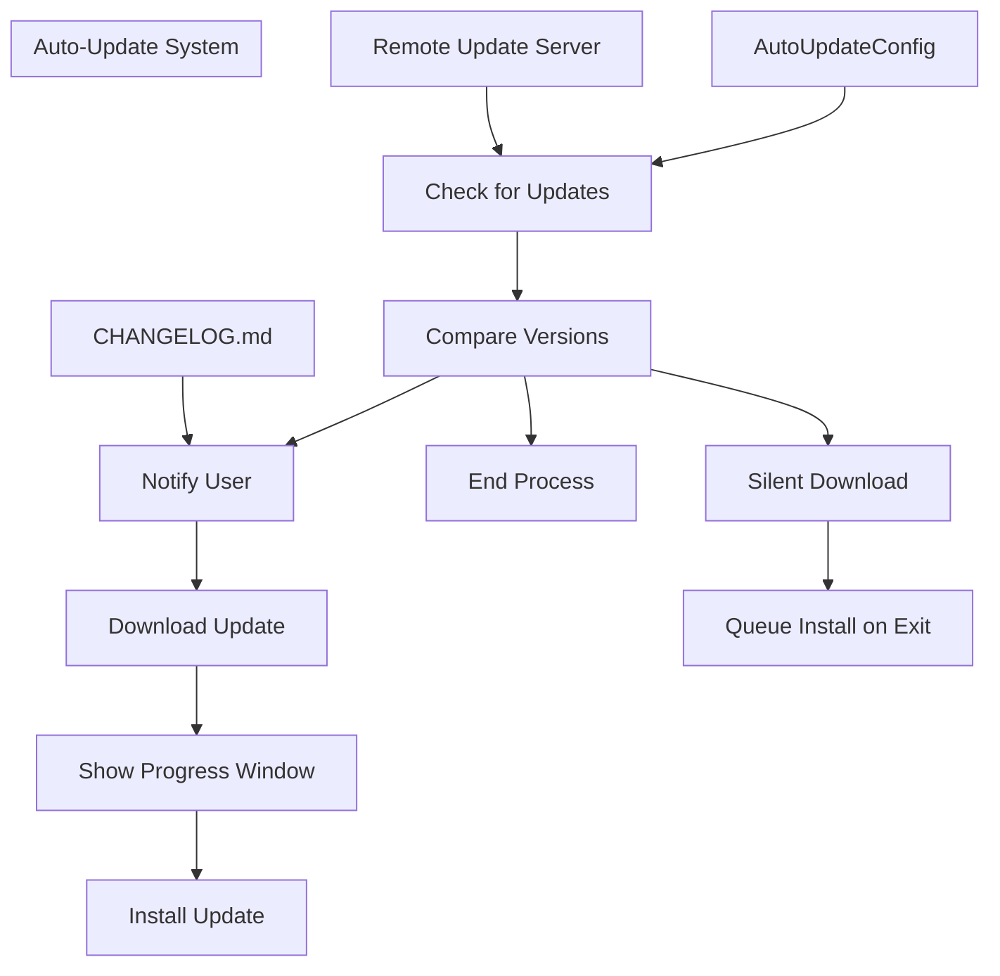
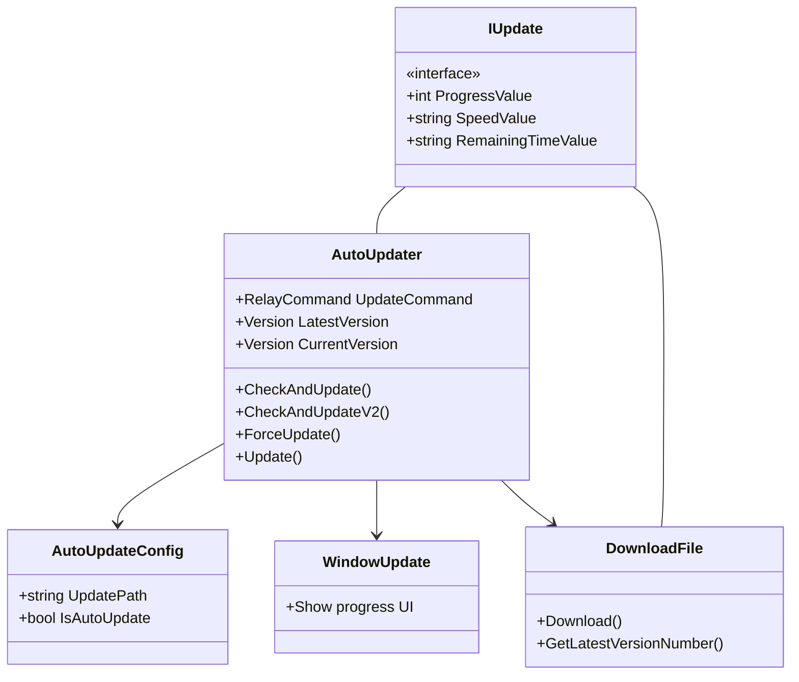
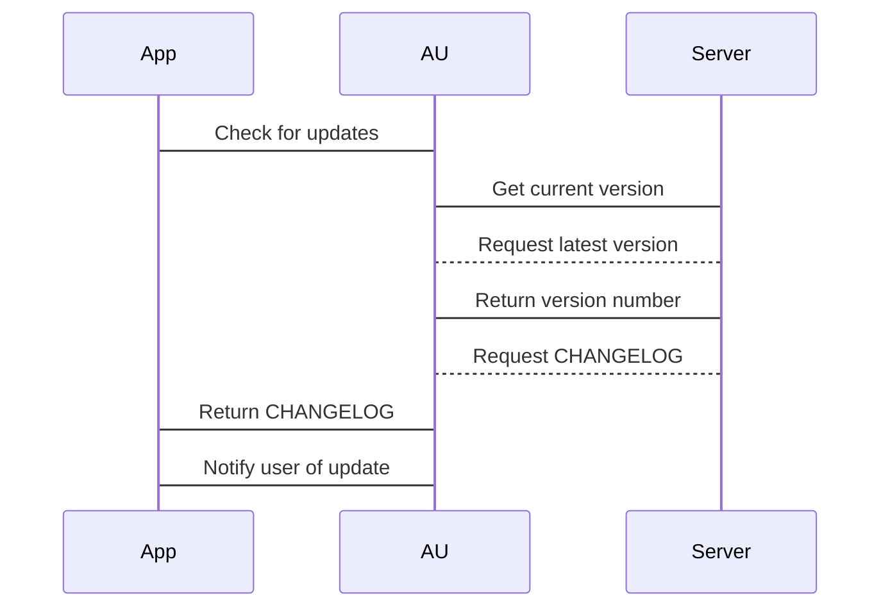
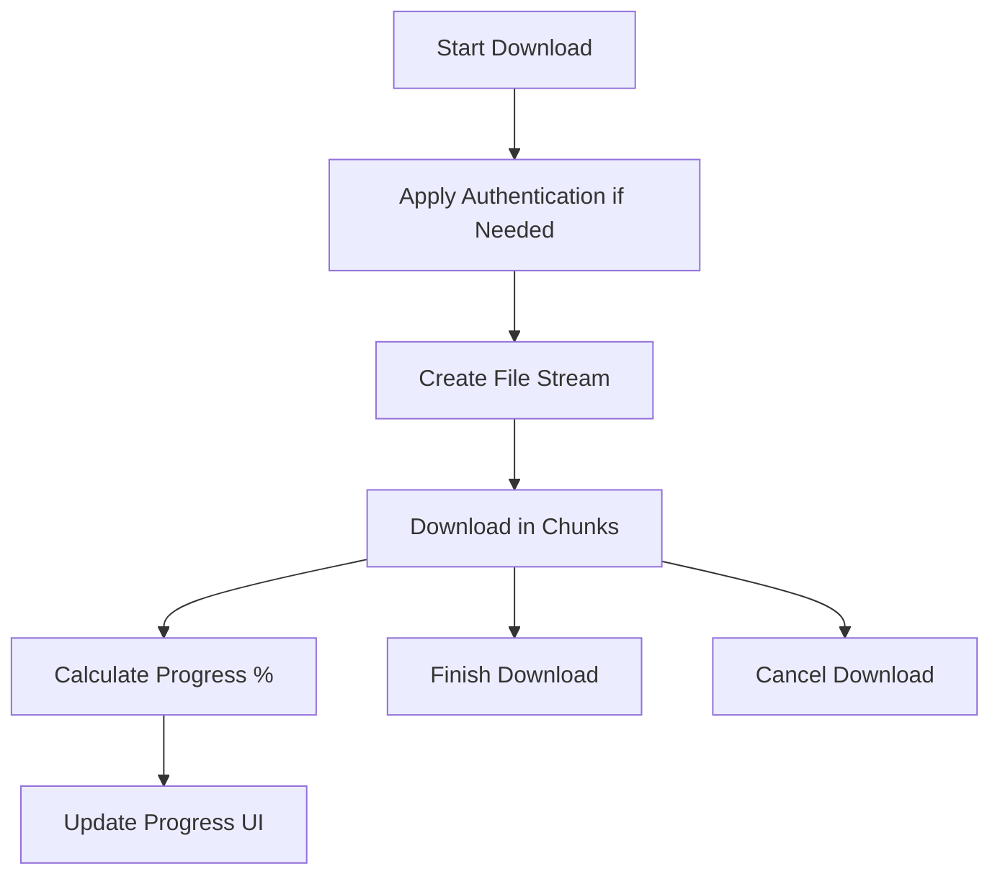
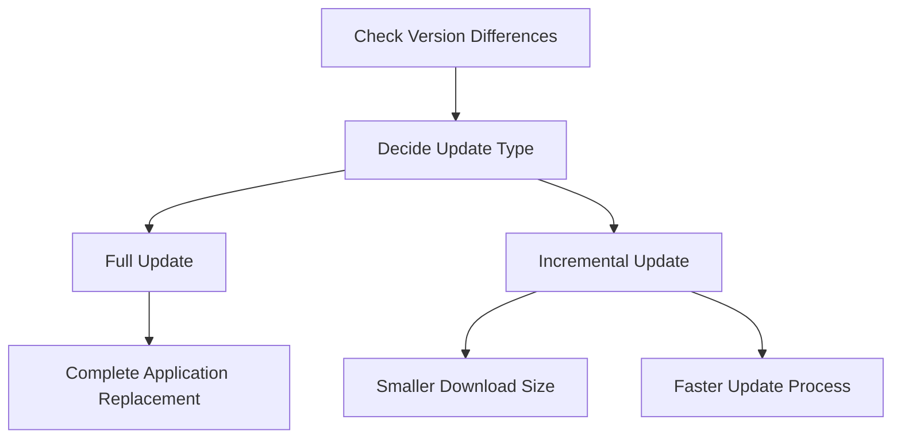
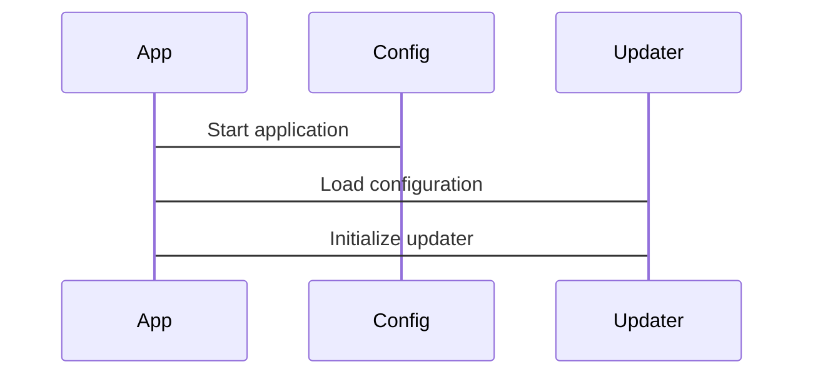
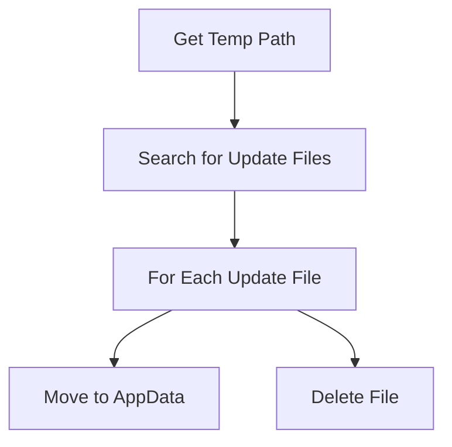
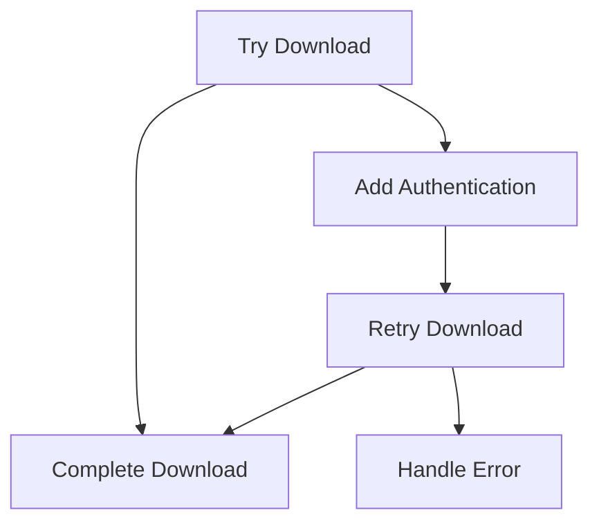

# Auto-Update System

> **Relevant source files**
> * [CHANGELOG.md](https://github.com/xincheng213618/scgd_general_wpf/blob/987af5f7/CHANGELOG.md)
> * [ColorVision/App.xaml.cs](https://github.com/xincheng213618/scgd_general_wpf/blob/987af5f7/ColorVision/App.xaml.cs)
> * [ColorVision/ColorVision.csproj](https://github.com/xincheng213618/scgd_general_wpf/blob/987af5f7/ColorVision/ColorVision.csproj)
> * [ColorVision/MainWindow.xaml](https://github.com/xincheng213618/scgd_general_wpf/blob/987af5f7/ColorVision/MainWindow.xaml)
> * [ColorVision/MainWindow.xaml.cs](https://github.com/xincheng213618/scgd_general_wpf/blob/987af5f7/ColorVision/MainWindow.xaml.cs)
> * [ColorVision/Update/AutoUpdater.cs](https://github.com/xincheng213618/scgd_general_wpf/blob/987af5f7/ColorVision/Update/AutoUpdater.cs)
> * [Directory.Build.props](https://github.com/xincheng213618/scgd_general_wpf/blob/987af5f7/Directory.Build.props)
> * [UI/ColorVision.Themes/Controls/Update/WindowUpdate.xaml](https://github.com/xincheng213618/scgd_general_wpf/blob/987af5f7/UI/ColorVision.Themes/Controls/Update/WindowUpdate.xaml)
> * [UI/ColorVision.UI/Download/DownloadFile.cs](https://github.com/xincheng213618/scgd_general_wpf/blob/987af5f7/UI/ColorVision.UI/Download/DownloadFile.cs)
> * [scgd_general_wpf.sln](https://github.com/xincheng213618/scgd_general_wpf/blob/987af5f7/scgd_general_wpf.sln)

The Auto-Update System in ColorVision provides automated checking, downloading, and installation of application updates. It supports both full and incremental updates, with options for silent background updating or interactive updates with user confirmation.

## Overview

The auto-update system monitors for new versions of the ColorVision application, notifies users when updates are available, downloads the update packages, and either installs them immediately or queues them for installation when the application closes.

Sources: [ColorVision/Update/AutoUpdater.cs L67-L432](https://github.com/xincheng213618/scgd_general_wpf/blob/987af5f7/ColorVision/Update/AutoUpdater.cs#L67-L432)

 [CHANGELOG.md L14-L31](https://github.com/xincheng213618/scgd_general_wpf/blob/987af5f7/CHANGELOG.md#L14-L31)

## Components and Architecture

The auto-update system consists of several key components working together to provide a seamless update experience.

Sources: [ColorVision/Update/AutoUpdater.cs L52-L433](https://github.com/xincheng213618/scgd_general_wpf/blob/987af5f7/ColorVision/Update/AutoUpdater.cs#L52-L433)

 [UI/ColorVision.UI/Download/DownloadFile.cs

20-184](https://github.com/xincheng213618/scgd_general_wpf/blob/987af5f7/UI/ColorVision.UI/Download/DownloadFile.cs#L20-L184)

## Update Configuration

The update system is controlled by the `AutoUpdateConfig` class, which determines whether to automatically check for updates and where to obtain updates from.

### Configuration Settings

| Setting | Description | Default Value |
| --- | --- | --- |
| `IsAutoUpdate` | Whether to automatically check for updates on startup | `true` |
| `UpdatePath` | URL to the update server to check for new versions | `"http://xc213618.ddns.me:9999/D%3A/ColorVision"` |

Users can modify these settings through the application's configuration interface. The update configuration is integrated with the application's configuration system through the `IConfigSettingProvider` interface.

Sources: [ColorVision/Update/AutoUpdater.cs L24-L64](https://github.com/xincheng213618/scgd_general_wpf/blob/987af5f7/ColorVision/Update/AutoUpdater.cs#L24-L64)

## Update Detection Process

The update detection process occurs at application startup (if enabled) and can also be triggered manually by the user.

### Version Checking

1. The system retrieves the current application version from the executing assembly
2. It then contacts the update server at the configured URL to fetch the latest available version
3. If the latest version is newer than the current version, the update process continues
4. If the current version is up-to-date, the process ends

Sources: [ColorVision/Update/AutoUpdater.cs L299-L356](https://github.com/xincheng213618/scgd_general_wpf/blob/987af5f7/ColorVision/Update/AutoUpdater.cs#L299-L356)

 [ColorVision/Update/AutoUpdater.cs L394-L432](https://github.com/xincheng213618/scgd_general_wpf/blob/987af5f7/ColorVision/Update/AutoUpdater.cs#L394-L432)

### Changelog Retrieval

If a new version is available, the system retrieves the changelog information to display to the user, showing what's new in the update:

1. The system downloads the CHANGELOG.md file from the update server
2. It parses the file to extract changes specific to the new version
3. The extracted changelog is presented to the user along with the update notification

Sources: [ColorVision/Update/AutoUpdater.cs L358-L390](https://github.com/xincheng213618/scgd_general_wpf/blob/987af5f7/ColorVision/Update/AutoUpdater.cs#L358-L390)

 [CHANGELOG.md L1-L30](https://github.com/xincheng213618/scgd_general_wpf/blob/987af5f7/CHANGELOG.md#L1-L30)

## Download and Installation Process

Once an update is detected and the user confirms (or if silent updates are enabled), the system proceeds to download and install the update.

### Download Process

The update system monitors download progress and displays status information to the user:

1. A `WindowUpdate` dialog appears showing download progress
2. The system calculates and displays download speed and estimated remaining time
3. The downloaded update is saved to a temporary location

Sources: [UI/ColorVision.UI/Download/DownloadFile.cs

110-180](https://github.com/xincheng213618/scgd_general_wpf/blob/987af5f7/UI/ColorVision.UI/Download/DownloadFile.cs#L110-L180)

 [ColorVision/Update/AutoUpdater.cs L110-L180](https://github.com/xincheng213618/scgd_general_wpf/blob/987af5f7/ColorVision/Update/AutoUpdater.cs#L110-L180)

### Installation

The installation process varies depending on whether it's an immediate installation or queued for after application exit:

1. **Immediate Installation**: Closes the application and launches the installer
2. **Queued Installation**: Waits for the application to exit naturally, then performs the installation

The implementation supports two installation modes:

* **Full Update**: Downloads and installs a complete new version
* **Incremental Update**: Downloads only the changes between versions for faster updates

Sources: [ColorVision/Update/AutoUpdater.cs L137-L138](https://github.com/xincheng213618/scgd_general_wpf/blob/987af5f7/ColorVision/Update/AutoUpdater.cs#L137-L138)

 [CHANGELOG.md L31-L33](https://github.com/xincheng213618/scgd_general_wpf/blob/987af5f7/CHANGELOG.md#L31-L33)

## Incremental Update System

As mentioned in the changelog (line 31), version 1.2.3.14 introduced an updated auto-update logic (V2) that performs updates after the application is closed.

The system determines whether to perform an incremental or full update based on version differences:

Sources: [ColorVision/Update/AutoUpdater.cs L173-L175](https://github.com/xincheng213618/scgd_general_wpf/blob/987af5f7/ColorVision/Update/AutoUpdater.cs#L173-L175)

 [CHANGELOG.md L31-L33](https://github.com/xincheng213618/scgd_general_wpf/blob/987af5f7/CHANGELOG.md#L31-L33)

## User Interface

The update system provides visual feedback to users through a dedicated progress window.

### Update Progress Window

The update progress window displays:

* A progress bar showing download completion percentage
* Current download speed
* Estimated time remaining to complete the download

This window is implemented in `WindowUpdate.xaml` and is controlled by the `AutoUpdater` class.

Sources: [UI/ColorVision.Themes/Controls/Update/WindowUpdate.xaml

1-28](https://github.com/xincheng213618/scgd_general_wpf/blob/987af5f7/UI/ColorVision.Themes/Controls/Update/WindowUpdate.xaml#L1-L28)

 [ColorVision/Update/AutoUpdater.cs L139-L140](https://github.com/xincheng213618/scgd_general_wpf/blob/987af5f7/ColorVision/Update/AutoUpdater.cs#L139-L140)

### User Notifications

The system notifies users of updates through dialog boxes that display:

* The new version number
* Changelog information detailing what's new in the update
* Options to install now or postpone the update

Sources: [ColorVision/Update/AutoUpdater.cs L323-L328](https://github.com/xincheng213618/scgd_general_wpf/blob/987af5f7/ColorVision/Update/AutoUpdater.cs#L323-L328)

 [ColorVision/Update/AutoUpdater.cs L332-L338](https://github.com/xincheng213618/scgd_general_wpf/blob/987af5f7/ColorVision/Update/AutoUpdater.cs#L332-L338)

## Application Integration

The auto-update system is integrated with the main application lifecycle.

### Startup Integration

During application startup, the system can automatically check for updates based on the configuration setting. This is handled by the application's initialization process.

Sources: [ColorVision/App.xaml.cs

51-171](https://github.com/xincheng213618/scgd_general_wpf/blob/987af5f7/ColorVision/App.xaml.cs#L51-L171)

### Clean-up Process

The auto-update system includes a cleanup mechanism to remove temporary update files after installation:

Sources: [ColorVision/Update/AutoUpdater.cs L92-L127](https://github.com/xincheng213618/scgd_general_wpf/blob/987af5f7/ColorVision/Update/AutoUpdater.cs#L92-L127)

## Security and Error Handling

The update system implements several security and error handling mechanisms.

### Authentication

When downloading from protected servers, the system can use HTTP Basic Authentication:

Sources: [ColorVision/Update/AutoUpdater.cs L398-L429](https://github.com/xincheng213618/scgd_general_wpf/blob/987af5f7/ColorVision/Update/AutoUpdater.cs#L398-L429)

 [UI/ColorVision.UI/Download/DownloadFile.cs

55-108](https://github.com/xincheng213618/scgd_general_wpf/blob/987af5f7/UI/ColorVision.UI/Download/DownloadFile.cs#L55-L108)

### Error Handling

The system handles various error scenarios gracefully:

* Network connectivity issues
* Authentication failures
* File system access problems
* Unexpected errors during download or installation

Sources: [ColorVision/Update/AutoUpdater.cs L289-L355](https://github.com/xincheng213618/scgd_general_wpf/blob/987af5f7/ColorVision/Update/AutoUpdater.cs#L289-L355)

 [UI/ColorVision.UI/Download/DownloadFile.cs

87-97](https://github.com/xincheng213618/scgd_general_wpf/blob/987af5f7/UI/ColorVision.UI/Download/DownloadFile.cs#L87-L97)

## Version Management

The auto-update system uses semantic versioning to determine when updates are available and what type of update to perform.

### Version Format

ColorVision uses a four-part version number format:

* Major (1)
* Minor (2)
* Build (3)
* Revision (14)

For example: `1.2.3.14`

The decision to perform incremental or full updates is based on which version components have changed.

Sources: [Directory.Build.props

20](https://github.com/xincheng213618/scgd_general_wpf/blob/987af5f7/Directory.Build.props#L20-L20)

 [CHANGELOG.md

3](https://github.com/xincheng213618/scgd_general_wpf/blob/987af5f7/CHANGELOG.md#L3-L3)

## Conclusion

The Auto-Update System provides a robust and flexible mechanism for keeping the ColorVision application up-to-date. The system supports both user-interactive updates and silent background updates, with incremental updates to minimize download size. The version 2 update logic introduced in version 1.2.3.14 improves the update experience by installing updates after the application is closed, ensuring a smooth transition between versions.