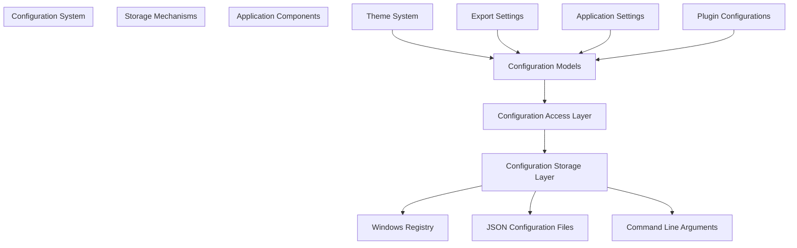
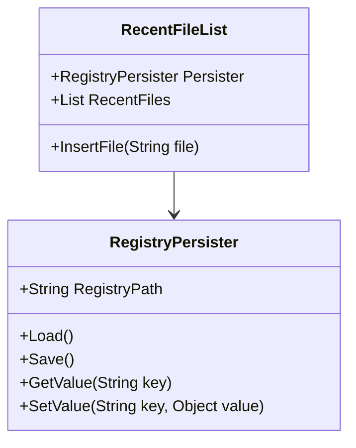
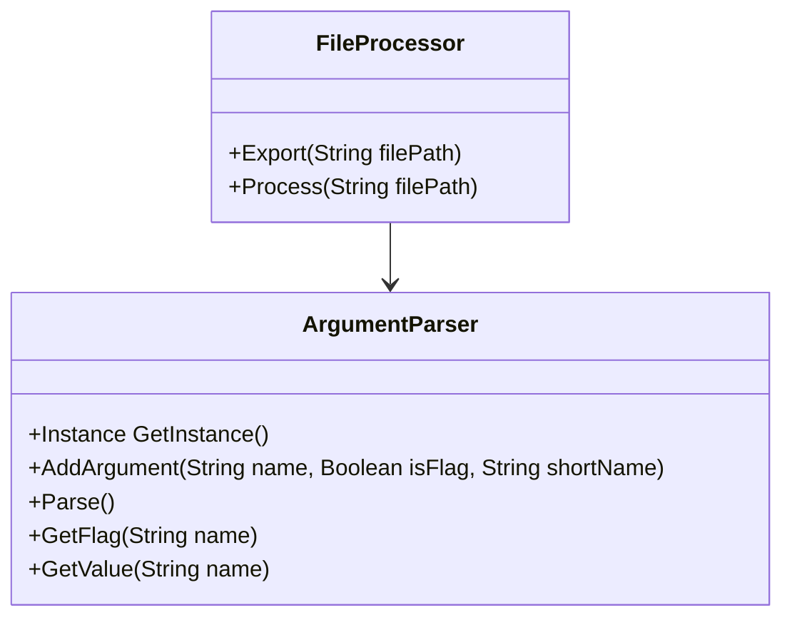
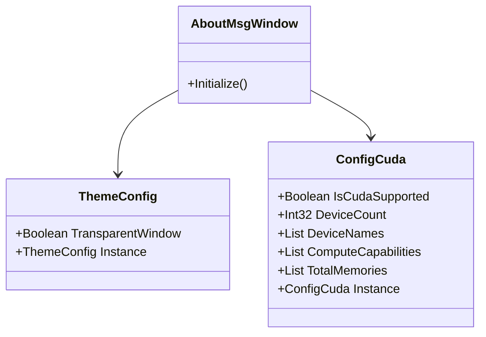
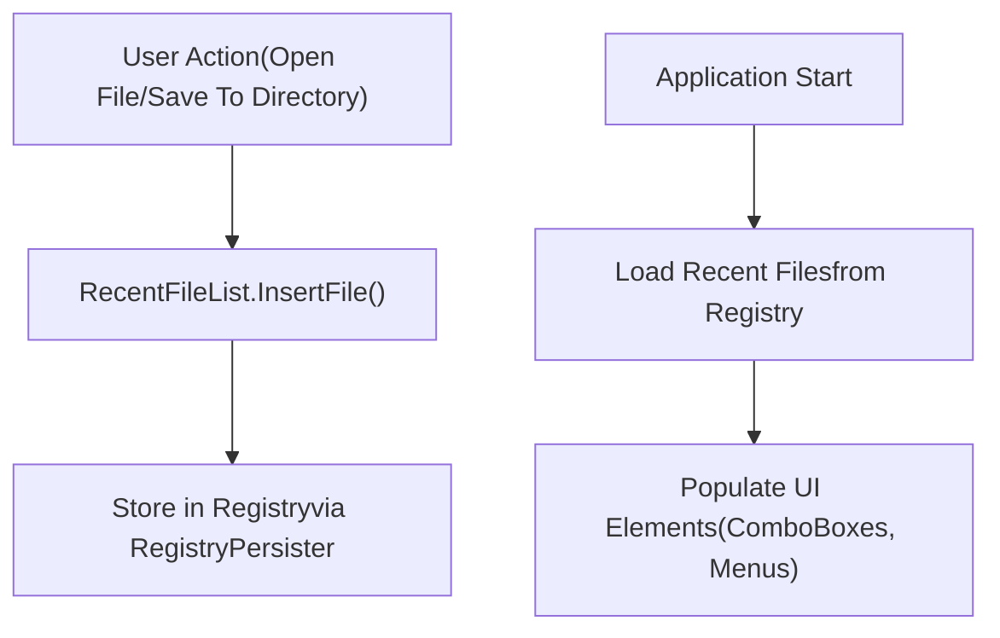
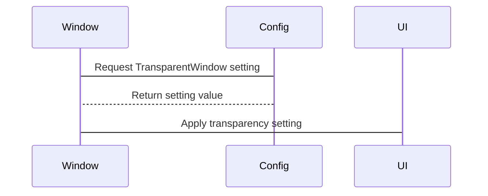
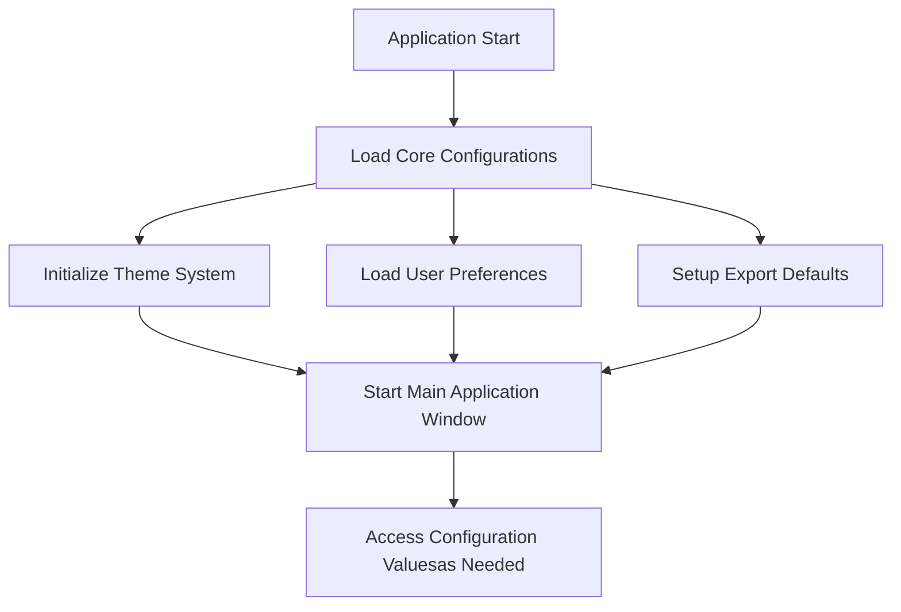

# Configuration System

> **Relevant source files**
> * [ColorVision/AboutMsg.xaml](https://github.com/xincheng213618/scgd_general_wpf/blob/987af5f7/ColorVision/AboutMsg.xaml)
> * [ColorVision/AboutMsg.xaml.cs](https://github.com/xincheng213618/scgd_general_wpf/blob/987af5f7/ColorVision/AboutMsg.xaml.cs)
> * [Engine/ColorVision.Engine/Impl/CVFile/FileProcessorCVCIE.cs](https://github.com/xincheng213618/scgd_general_wpf/blob/987af5f7/Engine/ColorVision.Engine/Impl/CVFile/FileProcessorCVCIE.cs)
> * [Engine/ColorVision.Engine/Impl/CVFile/FileProcessorCVRaw.cs](https://github.com/xincheng213618/scgd_general_wpf/blob/987af5f7/Engine/ColorVision.Engine/Impl/CVFile/FileProcessorCVRaw.cs)
> * [Engine/ColorVision.Engine/Media/Export/ExportCVCIE.xaml.cs](https://github.com/xincheng213618/scgd_general_wpf/blob/987af5f7/Engine/ColorVision.Engine/Media/Export/ExportCVCIE.xaml.cs)
> * [Engine/ColorVision.Engine/Media/Export/VExportCIE.cs](https://github.com/xincheng213618/scgd_general_wpf/blob/987af5f7/Engine/ColorVision.Engine/Media/Export/VExportCIE.cs)

## Purpose and Scope

The Configuration System in ColorVision provides a centralized mechanism for storing, retrieving, and managing application settings and preferences. This document details the architecture of the configuration framework, the various storage mechanisms used, and how different components of the application interact with the configuration system.

The Configuration System enables persistent storage of user preferences, application settings, and component-specific configurations across application sessions. It also provides mechanisms for runtime configuration changes and command-line configuration overrides.

For information about the application's initialization process, which includes loading configurations, see [Initialization Process](/xincheng213618/scgd_general_wpf/2.2-initialization-process).

## Configuration Architecture

The configuration system in ColorVision follows a hierarchical design pattern that separates configuration storage, access, and usage across different layers of the application.



Sources: [ColorVision/AboutMsg.xaml.cs

46-47](https://github.com/xincheng213618/scgd_general_wpf/blob/987af5f7/ColorVision/AboutMsg.xaml.cs#L46-L47)

 [Engine/ColorVision.Engine/Media/Export/VExportCIE.cs

194](https://github.com/xincheng213618/scgd_general_wpf/blob/987af5f7/Engine/ColorVision.Engine/Media/Export/VExportCIE.cs#L194-L194)

## Configuration Storage Mechanisms

ColorVision employs multiple storage mechanisms for different types of configurations, providing flexibility and appropriate persistence based on the nature of the settings.

### Registry-Based Storage

The Windows Registry is used for frequently accessed settings and recent file lists. The `RegistryPersister` class provides an abstraction layer for storing and retrieving configuration values from specified registry paths.



Sources: [Engine/ColorVision.Engine/Media/Export/VExportCIE.cs

194](https://github.com/xincheng213618/scgd_general_wpf/blob/987af5f7/Engine/ColorVision.Engine/Media/Export/VExportCIE.cs#L194-L194)

### File-Based Configuration

For more complex or extensible configurations, ColorVision uses JSON-based configuration files stored in the application's data directory. This approach facilitates human-readable and -editable configurations, as well as configuration sharing between installations.

### Command-Line Configuration

The application supports command-line configuration overrides using the `ArgumentParser` class, which provides a flexible mechanism for specifying runtime configuration values.



Sources: [Engine/ColorVision.Engine/Impl/CVFile/FileProcessorCVRaw.cs

24-30](https://github.com/xincheng213618/scgd_general_wpf/blob/987af5f7/Engine/ColorVision.Engine/Impl/CVFile/FileProcessorCVRaw.cs#L24-L30)

 [Engine/ColorVision.Engine/Impl/CVFile/FileProcessorCVCIE.cs

49-55](https://github.com/xincheng213618/scgd_general_wpf/blob/987af5f7/Engine/ColorVision.Engine/Impl/CVFile/FileProcessorCVCIE.cs#L49-L55)

## Configuration Access Patterns

Configuration access in ColorVision primarily uses the Singleton pattern to ensure centralized, consistent access to configuration values throughout the application.

### Singleton Configuration Instances

Many configuration classes follow the Singleton pattern, providing a static `Instance` property for global access to the configuration. This approach ensures that all components access the same configuration instance, maintaining consistency across the application.



Sources: [ColorVision/AboutMsg.xaml.cs

46](https://github.com/xincheng213618/scgd_general_wpf/blob/987af5f7/ColorVision/AboutMsg.xaml.cs#L46-L46)

 [ColorVision/AboutMsg.xaml.cs

63-66](https://github.com/xincheng213618/scgd_general_wpf/blob/987af5f7/ColorVision/AboutMsg.xaml.cs#L63-L66)

## Key Configuration Components

### Theme Configuration

The `ThemeConfig` class manages appearance settings for the application, including window transparency and visual styles. Theme configurations affect the application's global appearance and are applied during component initialization.

| Configuration Parameter | Description | Default Value |
| --- | --- | --- |
| TransparentWindow | Enables or disables window transparency | Varies by system capability |
| Theme | Current application theme | System default |

Sources: [ColorVision/AboutMsg.xaml.cs

46-47](https://github.com/xincheng213618/scgd_general_wpf/blob/987af5f7/ColorVision/AboutMsg.xaml.cs#L46-L47)

### Export Configuration

The export configuration manages settings for exporting different file formats, including compression levels and export paths. This configuration is particularly used for image and data export operations.

| Configuration Parameter | Description | Default Value |
| --- | --- | --- |
| Compression | Compression level for exported files | Format-dependent (e.g., 95 for JPEG) |
| ExportImageFormat | Default image format for exports | TIFF |
| SavePath | Default path for file saving | Last used directory |

Sources: [Engine/ColorVision.Engine/Media/Export/VExportCIE.cs

189-194](https://github.com/xincheng213618/scgd_general_wpf/blob/987af5f7/Engine/ColorVision.Engine/Media/Export/VExportCIE.cs#L189-L194)

 [Engine/ColorVision.Engine/Media/Export/VExportCIE.cs

15-48](https://github.com/xincheng213618/scgd_general_wpf/blob/987af5f7/Engine/ColorVision.Engine/Media/Export/VExportCIE.cs#L15-L48)

### CUDA Configuration

The CUDA configuration manages settings related to GPU capabilities and usage within the application, detecting available CUDA devices and their properties.

| Configuration Parameter | Description | Example Value |
| --- | --- | --- |
| IsCudaSupported | Whether CUDA is supported on the system | true/false |
| DeviceCount | Number of available CUDA devices | 1 |
| DeviceNames | Names of available CUDA devices | ["NVIDIA GeForce RTX 3080"] |
| ComputeCapabilities | Compute capabilities of available devices | ["8.6"] |
| TotalMemories | Total memory of available devices (bytes) | [10737418240] |

Sources: [ColorVision/AboutMsg.xaml.cs

63-66](https://github.com/xincheng213618/scgd_general_wpf/blob/987af5f7/ColorVision/AboutMsg.xaml.cs#L63-L66)

## Recent File Management

The Configuration System includes a mechanism for tracking and persisting recently used files or directories. This functionality is implemented through the `RecentFileList` class, which uses registry persistence.



The recent file management is used in multiple places in the application, including:

* Image export dialogs for remembering save locations
* File open dialogs for quick access to frequently used directories
* Project management for listing recent projects

Sources: [Engine/ColorVision.Engine/Media/Export/VExportCIE.cs

170-175](https://github.com/xincheng213618/scgd_general_wpf/blob/987af5f7/Engine/ColorVision.Engine/Media/Export/VExportCIE.cs#L170-L175)

 [Engine/ColorVision.Engine/Media/Export/ExportCVCIE.cs

62-63](https://github.com/xincheng213618/scgd_general_wpf/blob/987af5f7/Engine/ColorVision.Engine/Media/Export/ExportCVCIE.cs#L62-L63)

 [Engine/ColorVision.Engine/Media/Export/ExportCVCIE.cs

68](https://github.com/xincheng213618/scgd_general_wpf/blob/987af5f7/Engine/ColorVision.Engine/Media/Export/ExportCVCIE.cs#L68-L68)

## Command-Line Configuration

ColorVision supports command-line configuration through the `ArgumentParser` class, which allows overriding configuration settings at runtime. This is particularly useful for automated or headless operations.

| Argument | Description | Example |
| --- | --- | --- |
| quiet (-q) | Runs operations without UI | -q |
| mx | Sets compression level | --mx=95 |
| type (-t) | Sets output file type | -t png |
| output (-o) | Sets output directory | -o "C:\Output" |

Usage example for headless export:

```
ColorVision.exe --quiet --mx=95 --type=png --output="C:\Exports" file.cvcie
```

Sources: [Engine/ColorVision.Engine/Impl/CVFile/FileProcessorCVRaw.cs

24-30](https://github.com/xincheng213618/scgd_general_wpf/blob/987af5f7/Engine/ColorVision.Engine/Impl/CVFile/FileProcessorCVRaw.cs#L24-L30)

 [Engine/ColorVision.Engine/Impl/CVFile/FileProcessorCVRaw.cs

32-67](https://github.com/xincheng213618/scgd_general_wpf/blob/987af5f7/Engine/ColorVision.Engine/Impl/CVFile/FileProcessorCVRaw.cs#L32-L67)

 [Engine/ColorVision.Engine/Impl/CVFile/FileProcessorCVCIE.cs

49-92](https://github.com/xincheng213618/scgd_general_wpf/blob/987af5f7/Engine/ColorVision.Engine/Impl/CVFile/FileProcessorCVCIE.cs#L49-L92)

## Configuration Usage Example

The Configuration System is used throughout the application in various components. Here's an example of how the Theme Configuration is used in the `AboutMsgWindow`:



This diagram illustrates how a UI component (AboutMsgWindow) accesses the configuration system to determine how it should render itself, specifically whether to enable window transparency based on the global theme settings.

Sources: [ColorVision/AboutMsg.xaml.cs

46-47](https://github.com/xincheng213618/scgd_general_wpf/blob/987af5f7/ColorVision/AboutMsg.xaml.cs#L46-L47)

## Integration with Initialization Process

During application startup, the Configuration System is initialized as part of the broader application initialization process. This ensures that all configuration values are loaded and available before they're needed by application components.



For more details on the overall initialization process, refer to the [Initialization Process](/xincheng213618/scgd_general_wpf/2.2-initialization-process) documentation.

Sources: [ColorVision/AboutMsg.xaml.cs

50-52](https://github.com/xincheng213618/scgd_general_wpf/blob/987af5f7/ColorVision/AboutMsg.xaml.cs#L50-L52)