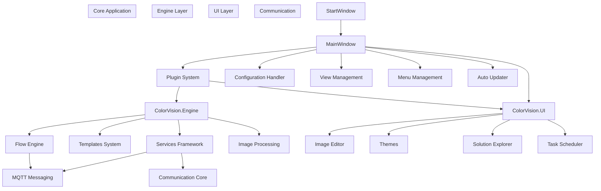
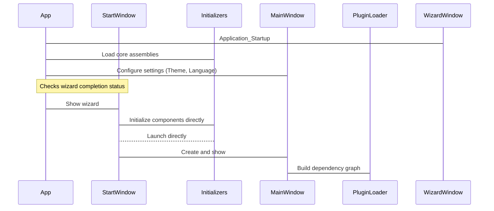
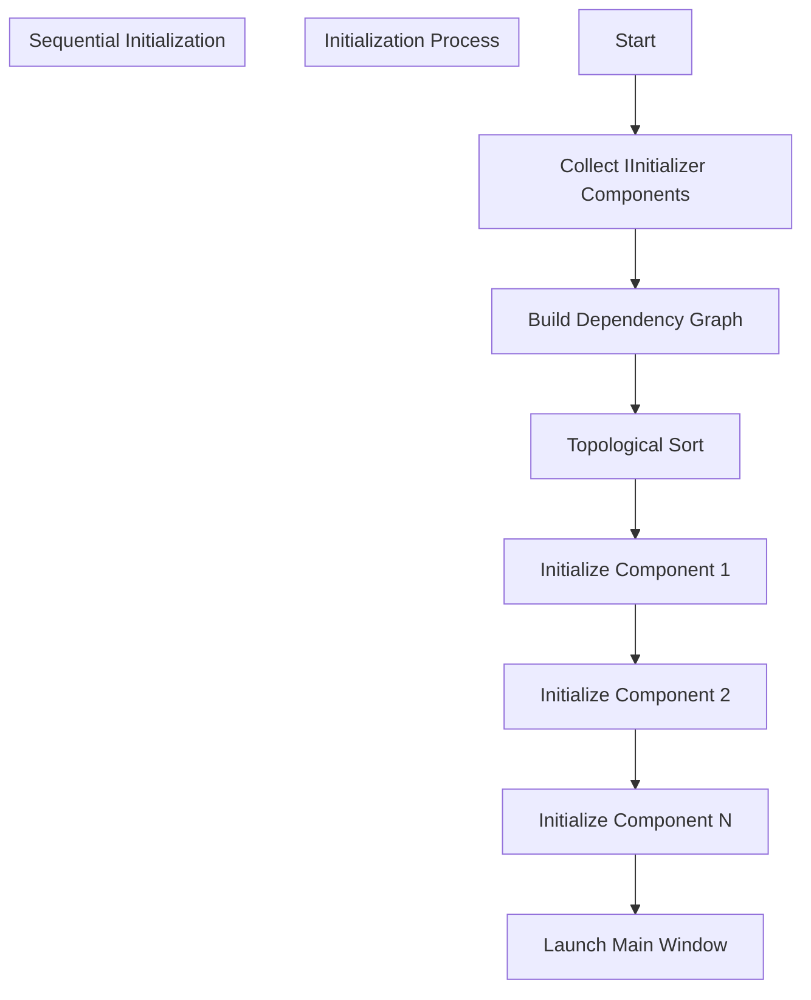
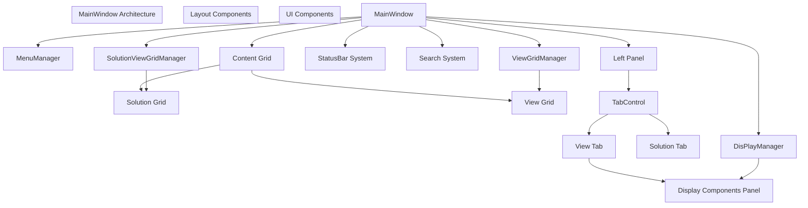
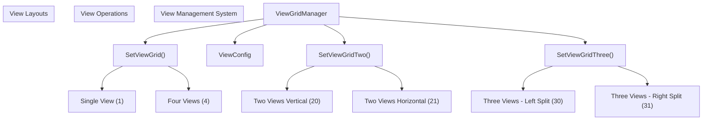
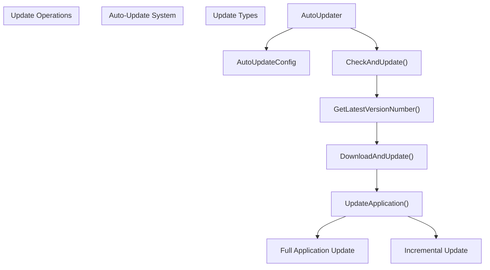
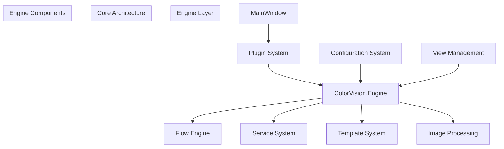

# Core Architecture

> **Relevant source files**
> * [CHANGELOG.md](https://github.com/xincheng213618/scgd_general_wpf/blob/987af5f7/CHANGELOG.md)
> * [ColorVision/App.xaml.cs](https://github.com/xincheng213618/scgd_general_wpf/blob/987af5f7/ColorVision/App.xaml.cs)
> * [ColorVision/ColorVision.csproj](https://github.com/xincheng213618/scgd_general_wpf/blob/987af5f7/ColorVision/ColorVision.csproj)
> * [ColorVision/MainWindow.xaml](https://github.com/xincheng213618/scgd_general_wpf/blob/987af5f7/ColorVision/MainWindow.xaml)
> * [ColorVision/MainWindow.xaml.cs](https://github.com/xincheng213618/scgd_general_wpf/blob/987af5f7/ColorVision/MainWindow.xaml.cs)
> * [ColorVision/StartWindow.xaml.cs](https://github.com/xincheng213618/scgd_general_wpf/blob/987af5f7/ColorVision/StartWindow.xaml.cs)
> * [ColorVision/Update/AutoUpdater.cs](https://github.com/xincheng213618/scgd_general_wpf/blob/987af5f7/ColorVision/Update/AutoUpdater.cs)
> * [Directory.Build.props](https://github.com/xincheng213618/scgd_general_wpf/blob/987af5f7/Directory.Build.props)
> * [scgd_general_wpf.sln](https://github.com/xincheng213618/scgd_general_wpf/blob/987af5f7/scgd_general_wpf.sln)

This document provides an overview of the fundamental architecture that powers the ColorVision application. It explains the key components and how they interact to form the complete system. This page focuses on the core architecture framework rather than specific features.

For more detailed information about specific components, see:

* Application Structure [2.1](/xincheng213618/scgd_general_wpf/2.1-application-structure)
* Initialization Process [2.2](/xincheng213618/scgd_general_wpf/2.2-initialization-process)
* Configuration System [2.3](/xincheng213618/scgd_general_wpf/2.3-configuration-system)
* Auto-Update System [2.4](/xincheng213618/scgd_general_wpf/2.4-auto-update-system)

## System Overview

ColorVision follows a modular architecture pattern with clear separation between the UI layer, engine layer, and communication components. The system is built on .NET 8.0 for Windows as defined in the project properties [Directory.Build.props

10](https://github.com/xincheng213618/scgd_general_wpf/blob/987af5f7/Directory.Build.props#L10-L10)

 targeting primarily x64 platforms with ARM64 support [Directory.Build.props

5](https://github.com/xincheng213618/scgd_general_wpf/blob/987af5f7/Directory.Build.props#L5-L5)

The core architecture consists of several foundational components that work together to provide the framework for the application's specialized features and functionality.

### Architectural Layers



Sources:

* [ColorVision/MainWindow.xaml.cs

79-158](https://github.com/xincheng213618/scgd_general_wpf/blob/987af5f7/ColorVision/MainWindow.xaml.cs#L79-L158)
* [ColorVision/App.xaml.cs

51-171](https://github.com/xincheng213618/scgd_general_wpf/blob/987af5f7/ColorVision/App.xaml.cs#L51-L171)
* [ColorVision/ColorVision.csproj L66-L69](https://github.com/xincheng213618/scgd_general_wpf/blob/987af5f7/ColorVision/ColorVision.csproj#L66-L69)
* [scgd_general_wpf.sln L22-L98](https://github.com/xincheng213618/scgd_general_wpf/blob/987af5f7/scgd_general_wpf.sln#L22-L98)

## Application Lifecycle

The application follows a structured lifecycle managed through several key components that handle startup, initialization, and shutdown.

### Application Startup Flow



Sources:

* [ColorVision/App.xaml.cs

51-171](https://github.com/xincheng213618/scgd_general_wpf/blob/987af5f7/ColorVision/App.xaml.cs#L51-L171)
* [ColorVision/StartWindow.xaml.cs

35-159](https://github.com/xincheng213618/scgd_general_wpf/blob/987af5f7/ColorVision/StartWindow.xaml.cs#L35-L159)
* [ColorVision/MainWindow.xaml.cs

100-158](https://github.com/xincheng213618/scgd_general_wpf/blob/987af5f7/ColorVision/MainWindow.xaml.cs#L100-L158)

### Initialization System

The application employs a dependency-based initialization system where components implement the `IInitializer` interface and declare their dependencies. This ensures that components are initialized in the correct order.



The `StartWindow` class handles the core initialization process:

1. Collects all components implementing `IInitializer`
2. Builds a dependency graph and calculates in-degrees for each component
3. Performs topological sorting to determine the correct initialization order
4. Initializes components sequentially
5. Launches the main window when initialization is complete

Sources:

* [ColorVision/StartWindow.xaml.cs

84-127](https://github.com/xincheng213618/scgd_general_wpf/blob/987af5f7/ColorVision/StartWindow.xaml.cs#L84-L127)
* [ColorVision/StartWindow.xaml.cs

161-179](https://github.com/xincheng213618/scgd_general_wpf/blob/987af5f7/ColorVision/StartWindow.xaml.cs#L161-L179)
* [ColorVision/App.xaml.cs

146-166](https://github.com/xincheng213618/scgd_general_wpf/blob/987af5f7/ColorVision/App.xaml.cs#L146-L166)

## Main Application Window

The `MainWindow` class serves as the primary container for the application UI, managing layout, views, menus, and interaction with core systems.



The MainWindow initializes several critical systems:

1. **MenuManager**: Manages the application menu system [MainWindow.xaml.cs

102](https://github.com/xincheng213618/scgd_general_wpf/blob/987af5f7/MainWindow.xaml.cs#L102-L102)
2. **ViewGridManager**: Controls the layout and content of views [MainWindow.xaml.cs

124-128](https://github.com/xincheng213618/scgd_general_wpf/blob/987af5f7/MainWindow.xaml.cs#L124-L128)
3. **DisplayManager**: Manages device display components [MainWindow.xaml.cs

130](https://github.com/xincheng213618/scgd_general_wpf/blob/987af5f7/MainWindow.xaml.cs#L130-L130)
4. **StatusBar**: Shows application and component status [MainWindow.xaml.cs

219-332](https://github.com/xincheng213618/scgd_general_wpf/blob/987af5f7/MainWindow.xaml.cs#L219-L332)
5. **Search**: Provides application-wide search functionality [MainWindow.xaml.cs

338-436](https://github.com/xincheng213618/scgd_general_wpf/blob/987af5f7/MainWindow.xaml.cs#L338-L436)

Additionally, the MainWindow serves as the integration point for the plugin system, loading plugins during initialization and providing them access to other core components.

Sources:

* [ColorVision/MainWindow.xaml L1-L157](https://github.com/xincheng213618/scgd_general_wpf/blob/987af5f7/ColorVision/MainWindow.xaml#L1-L157)
* [ColorVision/MainWindow.xaml.cs

79-442](https://github.com/xincheng213618/scgd_general_wpf/blob/987af5f7/ColorVision/MainWindow.xaml.cs#L79-L442)

### View Management

The application uses a flexible view grid system to organize and display content. The `ViewGridManager` allows for dynamic configuration of the application layout with different view arrangements:



The view management system allows users to:

* Switch between different layout configurations
* Add and organize content across multiple views
* Maximize individual views or use split-screen layouts

Sources:

* [ColorVision/MainWindow.xaml.cs

193-216](https://github.com/xincheng213618/scgd_general_wpf/blob/987af5f7/ColorVision/MainWindow.xaml.cs#L193-L216)
* [ColorVision/MainWindow.xaml L127-L147](https://github.com/xincheng213618/scgd_general_wpf/blob/987af5f7/ColorVision/MainWindow.xaml#L127-L147)

## Plugin System

The application utilizes a plugin-based architecture for extensibility, allowing new functionality to be added without modifying the core application.

```

```

The plugin system provides:

1. Dynamic loading of plugins at runtime
2. Discovery of plugin functionality through interfaces
3. Integration of plugins into the application menu system
4. Support for various plugin types (services, tools, projects, etc.)
5. Automatic component initialization through the `IMainWindowInitialized` interface

Sources:

* [ColorVision/MainWindow.xaml.cs

136-138](https://github.com/xincheng213618/scgd_general_wpf/blob/987af5f7/ColorVision/MainWindow.xaml.cs#L136-L138)
* [ColorVision/MainWindow.xaml.cs

171-190](https://github.com/xincheng213618/scgd_general_wpf/blob/987af5f7/ColorVision/MainWindow.xaml.cs#L171-L190)
* [ColorVision/App.xaml.cs

122](https://github.com/xincheng213618/scgd_general_wpf/blob/987af5f7/ColorVision/App.xaml.cs#L122-L122)

## Configuration System

The configuration system manages application settings and persists them between sessions. It allows for centralized management of application state.

```

```

Key components:

1. **ConfigHandler**: Singleton entry point to the configuration system
2. **ConfigService**: Manages configuration objects and persistence
3. **IConfig**: Interface implemented by configuration classes
4. **IConfigSettingProvider**: Interface for providing UI settings metadata

Sources:

* [ColorVision/App.xaml.cs

74-75](https://github.com/xincheng213618/scgd_general_wpf/blob/987af5f7/ColorVision/App.xaml.cs#L74-L75)
* [ColorVision/Update/AutoUpdater.cs L52-L65](https://github.com/xincheng213618/scgd_general_wpf/blob/987af5f7/ColorVision/Update/AutoUpdater.cs#L52-L65)
* [ColorVision/MainWindow.xaml.cs

84](https://github.com/xincheng213618/scgd_general_wpf/blob/987af5f7/ColorVision/MainWindow.xaml.cs#L84-L84)

## Auto-Update System

The auto-update system checks for, downloads, and installs application updates, supporting both full and incremental updates.



The auto-update system provides:

1. Version comparison between local and remote versions
2. Download progress tracking and user feedback
3. Post-shutdown installation process
4. Support for both full and incremental updates
5. Integration with the application startup process

Sources:

* [ColorVision/Update/AutoUpdater.cs L68-L527](https://github.com/xincheng213618/scgd_general_wpf/blob/987af5f7/ColorVision/Update/AutoUpdater.cs#L68-L527)
* [ColorVision/Update/AutoUpdater.cs L52-L65](https://github.com/xincheng213618/scgd_general_wpf/blob/987af5f7/ColorVision/Update/AutoUpdater.cs#L52-L65)

## Relationship with Engine Layer

The Core Architecture serves as the foundation that integrates with the Engine Layer, which contains the primary business logic and functional components of the system.



The Core Architecture integrates with the Engine Layer through:

1. Plugin-based loading of engine components
2. Configuration system for engine settings
3. View system for displaying engine outputs
4. Command system for invoking engine functionality

Sources:

* [ColorVision/ColorVision.csproj

66](https://github.com/xincheng213618/scgd_general_wpf/blob/987af5f7/ColorVision/ColorVision.csproj#L66-L66)
* [ColorVision/App.xaml.cs

65-66](https://github.com/xincheng213618/scgd_general_wpf/blob/987af5f7/ColorVision/App.xaml.cs#L65-L66)

## Conclusion

The Core Architecture of ColorVision provides a solid foundation for the application with a modular, extensible design. The separation of concerns between different components allows for independent development and maintenance of the various parts of the system.

Key architectural patterns used include:

* Modular design with clear separation of concerns
* Plugin-based extensibility
* Dependency-based initialization
* Service-oriented architecture
* Configuration-driven behavior

This core framework enables the specialized functionality provided by the Engine Layer and various plugins, creating a flexible and powerful application platform.