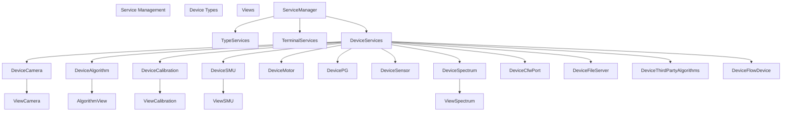
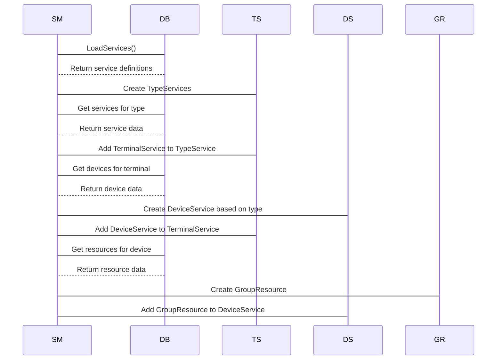
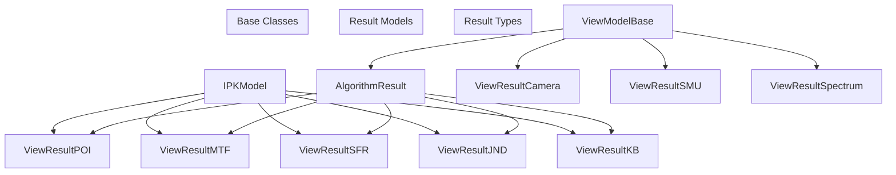
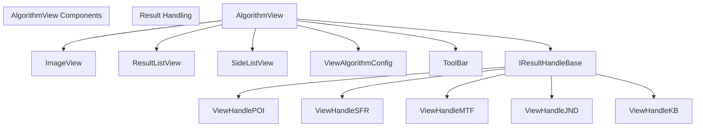
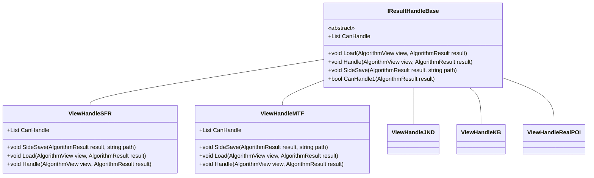
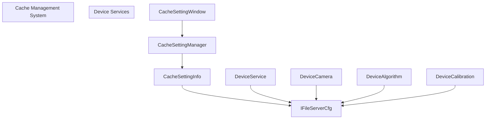

# Device Services

> **Relevant source files**
> * [ColorVision/Update/ChangeLog/ChangelogWindow.xaml](https://github.com/xincheng213618/scgd_general_wpf/blob/987af5f7/ColorVision/Update/ChangeLog/ChangelogWindow.xaml)
> * [ColorVision/Update/ChangeLog/ChangelogWindow.xaml.cs](https://github.com/xincheng213618/scgd_general_wpf/blob/987af5f7/ColorVision/Update/ChangeLog/ChangelogWindow.xaml.cs)
> * [Engine/ColorVision.Engine/MySql/ORM/BaseTableDao.cs](https://github.com/xincheng213618/scgd_general_wpf/blob/987af5f7/Engine/ColorVision.Engine/MySql/ORM/BaseTableDao.cs)
> * [Engine/ColorVision.Engine/MySql/ORM/BaseTableDaoExtensions.cs](https://github.com/xincheng213618/scgd_general_wpf/blob/987af5f7/Engine/ColorVision.Engine/MySql/ORM/BaseTableDaoExtensions.cs)
> * [Engine/ColorVision.Engine/Rbac/Dao/UserDao.cs](https://github.com/xincheng213618/scgd_general_wpf/blob/987af5f7/Engine/ColorVision.Engine/Rbac/Dao/UserDao.cs)
> * [Engine/ColorVision.Engine/Services/CacheSettingWindow.xaml](https://github.com/xincheng213618/scgd_general_wpf/blob/987af5f7/Engine/ColorVision.Engine/Services/CacheSettingWindow.xaml)
> * [Engine/ColorVision.Engine/Services/CacheSettingWindow.xaml.cs](https://github.com/xincheng213618/scgd_general_wpf/blob/987af5f7/Engine/ColorVision.Engine/Services/CacheSettingWindow.xaml.cs)
> * [Engine/ColorVision.Engine/Services/Dao/MeasureImgResultDao.cs](https://github.com/xincheng213618/scgd_general_wpf/blob/987af5f7/Engine/ColorVision.Engine/Services/Dao/MeasureImgResultDao.cs)
> * [Engine/ColorVision.Engine/Services/Dao/ViewResultCamera.cs](https://github.com/xincheng213618/scgd_general_wpf/blob/987af5f7/Engine/ColorVision.Engine/Services/Dao/ViewResultCamera.cs)
> * [Engine/ColorVision.Engine/Services/Devices/Algorithm/Views/AlgorithmResult.cs](https://github.com/xincheng213618/scgd_general_wpf/blob/987af5f7/Engine/ColorVision.Engine/Services/Devices/Algorithm/Views/AlgorithmResult.cs)
> * [Engine/ColorVision.Engine/Services/Devices/Algorithm/Views/AlgorithmView.xaml](https://github.com/xincheng213618/scgd_general_wpf/blob/987af5f7/Engine/ColorVision.Engine/Services/Devices/Algorithm/Views/AlgorithmView.xaml)
> * [Engine/ColorVision.Engine/Services/Devices/Algorithm/Views/AlgorithmView.xaml.cs](https://github.com/xincheng213618/scgd_general_wpf/blob/987af5f7/Engine/ColorVision.Engine/Services/Devices/Algorithm/Views/AlgorithmView.xaml.cs)
> * [Engine/ColorVision.Engine/Services/Devices/Algorithm/Views/ViewAlgorithmConfig.cs](https://github.com/xincheng213618/scgd_general_wpf/blob/987af5f7/Engine/ColorVision.Engine/Services/Devices/Algorithm/Views/ViewAlgorithmConfig.cs)
> * [Engine/ColorVision.Engine/Services/Devices/Calibration/Views/ViewCalibration.xaml](https://github.com/xincheng213618/scgd_general_wpf/blob/987af5f7/Engine/ColorVision.Engine/Services/Devices/Calibration/Views/ViewCalibration.xaml)
> * [Engine/ColorVision.Engine/Services/Devices/Calibration/Views/ViewCalibrationConfig.cs](https://github.com/xincheng213618/scgd_general_wpf/blob/987af5f7/Engine/ColorVision.Engine/Services/Devices/Calibration/Views/ViewCalibrationConfig.cs)
> * [Engine/ColorVision.Engine/Services/Devices/Camera/AdvanceSearch.xaml](https://github.com/xincheng213618/scgd_general_wpf/blob/987af5f7/Engine/ColorVision.Engine/Services/Devices/Camera/AdvanceSearch.xaml)
> * [Engine/ColorVision.Engine/Services/Devices/Camera/AdvanceSearch.xaml.cs](https://github.com/xincheng213618/scgd_general_wpf/blob/987af5f7/Engine/ColorVision.Engine/Services/Devices/Camera/AdvanceSearch.xaml.cs)
> * [Engine/ColorVision.Engine/Services/Devices/Camera/Video/CameraVideoConfig.cs](https://github.com/xincheng213618/scgd_general_wpf/blob/987af5f7/Engine/ColorVision.Engine/Services/Devices/Camera/Video/CameraVideoConfig.cs)
> * [Engine/ColorVision.Engine/Services/Devices/Camera/Views/ViewCamera.xaml](https://github.com/xincheng213618/scgd_general_wpf/blob/987af5f7/Engine/ColorVision.Engine/Services/Devices/Camera/Views/ViewCamera.xaml)
> * [Engine/ColorVision.Engine/Services/Devices/Camera/Views/ViewCameraConfig.cs](https://github.com/xincheng213618/scgd_general_wpf/blob/987af5f7/Engine/ColorVision.Engine/Services/Devices/Camera/Views/ViewCameraConfig.cs)
> * [Engine/ColorVision.Engine/Services/Devices/SMU/Views/ViewSMU.xaml](https://github.com/xincheng213618/scgd_general_wpf/blob/987af5f7/Engine/ColorVision.Engine/Services/Devices/SMU/Views/ViewSMU.xaml)
> * [Engine/ColorVision.Engine/Services/Devices/Spectrum/Views/ViewSpectrum.xaml](https://github.com/xincheng213618/scgd_general_wpf/blob/987af5f7/Engine/ColorVision.Engine/Services/Devices/Spectrum/Views/ViewSpectrum.xaml)
> * [Engine/ColorVision.Engine/Services/ServiceManager.cs](https://github.com/xincheng213618/scgd_general_wpf/blob/987af5f7/Engine/ColorVision.Engine/Services/ServiceManager.cs)
> * [Engine/ColorVision.Engine/Templates/ARVR/MTF/ViewHandleMTF.cs](https://github.com/xincheng213618/scgd_general_wpf/blob/987af5f7/Engine/ColorVision.Engine/Templates/ARVR/MTF/ViewHandleMTF.cs)
> * [Engine/ColorVision.Engine/Templates/ARVR/SFR/ViewHandleSFR.cs](https://github.com/xincheng213618/scgd_general_wpf/blob/987af5f7/Engine/ColorVision.Engine/Templates/ARVR/SFR/ViewHandleSFR.cs)
> * [Engine/ColorVision.Engine/Templates/JND/ViewHandleJND.cs](https://github.com/xincheng213618/scgd_general_wpf/blob/987af5f7/Engine/ColorVision.Engine/Templates/JND/ViewHandleJND.cs)
> * [Engine/ColorVision.Engine/Templates/Jsons/KB/ViewHandleKB.cs](https://github.com/xincheng213618/scgd_general_wpf/blob/987af5f7/Engine/ColorVision.Engine/Templates/Jsons/KB/ViewHandleKB.cs)
> * [Engine/ColorVision.Engine/Templates/POI/AlgorithmImp/ViewHandleRealPOI.cs](https://github.com/xincheng213618/scgd_general_wpf/blob/987af5f7/Engine/ColorVision.Engine/Templates/POI/AlgorithmImp/ViewHandleRealPOI.cs)
> * [UI/ColorVision.Themes/Controls/Update/WindowUpdate.xaml](https://github.com/xincheng213618/scgd_general_wpf/blob/987af5f7/UI/ColorVision.Themes/Controls/Update/WindowUpdate.xaml)
> * [UI/ColorVision.UI/Download/DownloadFile.cs](https://github.com/xincheng213618/scgd_general_wpf/blob/987af5f7/UI/ColorVision.UI/Download/DownloadFile.cs)

Device Services in the ColorVision system provide a unified framework for managing and interacting with various hardware devices and algorithmic services. This page documents the architecture, functionality, and integration of device services within the larger system.

For information about the communication protocol used by device services, see [MQTT Communication](/xincheng213618/scgd_general_wpf/4.2-mqtt-communication).

## Overview of Device Services

Device Services form a core component of the ColorVision application, enabling it to interface with a diverse range of hardware devices like cameras, spectrometers, pattern generators, and motors. The system also supports software-based services like algorithmic processing. Each device service provides standardized interfaces for device control, data acquisition, result processing, and visualization.

The key features of the Device Services system include:

* Unified management of heterogeneous device types
* Standardized interface for device interaction
* Result storage and visualization
* Integrated configuration management
* MQTT-based communication protocol
* Extensibility for new device types

Sources: [Engine/ColorVision.Engine/Services/ServiceManager.cs

29-290](https://github.com/xincheng213618/scgd_general_wpf/blob/987af5f7/Engine/ColorVision.Engine/Services/ServiceManager.cs#L29-L290)

## Device Service Architecture

The Device Services are organized in a hierarchical structure, providing a clean separation of concerns and enabling extensible management.



**ServiceManager**: The core class responsible for loading, organizing, and managing all device services.

**TypeServices**: Groups services by type (camera, algorithm, etc.).

**TerminalServices**: Represents physical or logical endpoints that host device services.

**DeviceServices**: The actual device implementations that provide specific functionality.

Sources:

* [Engine/ColorVision.Engine/Services/ServiceManager.cs

29-290](https://github.com/xincheng213618/scgd_general_wpf/blob/987af5f7/Engine/ColorVision.Engine/Services/ServiceManager.cs#L29-L290)
* [Engine/ColorVision.Engine/Services/Devices/Algorithm/Views/AlgorithmView.xaml.cs

32-520](https://github.com/xincheng213618/scgd_general_wpf/blob/987af5f7/Engine/ColorVision.Engine/Services/Devices/Algorithm/Views/AlgorithmView.xaml.cs#L32-L520)

## Device Types and Capabilities

The DeviceServices system supports various device types, each offering specific capabilities:

| Device Type | Description | Key Capabilities | View Component |
| --- | --- | --- | --- |
| Camera | Image acquisition devices | Capture images, process frames | ViewCamera |
| Algorithm | Image analysis services | Process images, detect features, analyze data | AlgorithmView |
| Calibration | Device calibration tools | Calibrate other devices, generate reference data | ViewCalibration |
| SMU (Source Meter Unit) | Electrical measurement | Measure voltage, current, resistance | ViewSMU |
| Spectrometer | Spectral analysis | Analyze light spectra, color measurement | ViewSpectrum |
| Pattern Generator | Test pattern creation | Generate visual test patterns | (Custom) |
| Motor | Motion control | Control physical movements | (Custom) |
| Sensor | Various sensing devices | Measure physical quantities | (Custom) |

Each device type implements a specific DeviceService subclass that handles the unique requirements and capabilities of that device type.

Sources:

* [Engine/ColorVision.Engine/Services/ServiceManager.cs

162-197](https://github.com/xincheng213618/scgd_general_wpf/blob/987af5f7/Engine/ColorVision.Engine/Services/ServiceManager.cs#L162-L197)
* [Engine/ColorVision.Engine/Services/Devices/Camera/Views/ViewCamera.xaml

1-167](https://github.com/xincheng213618/scgd_general_wpf/blob/987af5f7/Engine/ColorVision.Engine/Services/Devices/Camera/Views/ViewCamera.xaml#L1-L167)
* [Engine/ColorVision.Engine/Services/Devices/Algorithm/Views/AlgorithmView.xaml

1-248](https://github.com/xincheng213618/scgd_general_wpf/blob/987af5f7/Engine/ColorVision.Engine/Services/Devices/Algorithm/Views/AlgorithmView.xaml#L1-L248)

## Service Registration and Management

The ServiceManager is responsible for loading all services from the database and organizing them in a hierarchical structure. This process happens when the application starts or when the database connection changes.



This management system allows for flexible organization of devices and services, with support for grouping and hierarchical structure.

Sources:

* [Engine/ColorVision.Engine/Services/ServiceManager.cs

110-256](https://github.com/xincheng213618/scgd_general_wpf/blob/987af5f7/Engine/ColorVision.Engine/Services/ServiceManager.cs#L110-L256)

## Result Handling and Storage

Each device type generates specific types of results that need to be stored, processed, and visualized. The system provides a standardized approach to handle these diverse result types.

### Result Data Models

Result data models encapsulate the output from devices:



### Data Access Objects (DAOs)

DAOs provide a layer of abstraction for database operations:

* **BaseTableDao**: Generic base class for all DAOs
* **MeasureImgResultDao**: Handles camera results
* **AlgResultMasterDao**: Handles algorithm results
* **PoiPointResultDao**: Handles POI (Point of Interest) results

The DAO system supports:

* Querying results with various filters
* Saving new results
* Updating existing results
* Bulk operations for efficient handling of large datasets

Sources:

* [Engine/ColorVision.Engine/Services/Devices/Algorithm/Views/AlgorithmResult.cs

1-247](https://github.com/xincheng213618/scgd_general_wpf/blob/987af5f7/Engine/ColorVision.Engine/Services/Devices/Algorithm/Views/AlgorithmResult.cs#L1-L247)
* [Engine/ColorVision.Engine/Services/Dao/ViewResultCamera.cs

1-197](https://github.com/xincheng213618/scgd_general_wpf/blob/987af5f7/Engine/ColorVision.Engine/Services/Dao/ViewResultCamera.cs#L1-L197)
* [Engine/ColorVision.Engine/MySql/ORM/BaseTableDao.cs

1-257](https://github.com/xincheng213618/scgd_general_wpf/blob/987af5f7/Engine/ColorVision.Engine/MySql/ORM/BaseTableDao.cs#L1-L257)
* [Engine/ColorVision.Engine/Services/Dao/MeasureImgResultDao.cs

1-92](https://github.com/xincheng213618/scgd_general_wpf/blob/987af5f7/Engine/ColorVision.Engine/Services/Dao/MeasureImgResultDao.cs#L1-L92)

## Device Services Views and UI Integration

For each device type, the system provides specialized views for visualizing results and interacting with the device. These views follow a consistent pattern while accommodating the unique requirements of each device type.

### Common View Features

Most device views include:

1. **Result list**: Displays a table of results with sortable columns
2. **Visualization area**: Shows the primary result data (images, charts, etc.)
3. **Search functionality**: Allows filtering results by various criteria
4. **Export options**: Export results to files (CSV, images, etc.)
5. **Configuration settings**: Customize view behavior

### Example: Algorithm View

The AlgorithmView provides a comprehensive interface for viewing and analyzing algorithm results:



The AlgorithmView detects available result handlers during initialization and uses them to process and visualize different types of algorithm results.

Sources:

* [Engine/ColorVision.Engine/Services/Devices/Algorithm/Views/AlgorithmView.xaml

1-248](https://github.com/xincheng213618/scgd_general_wpf/blob/987af5f7/Engine/ColorVision.Engine/Services/Devices/Algorithm/Views/AlgorithmView.xaml#L1-L248)
* [Engine/ColorVision.Engine/Services/Devices/Algorithm/Views/AlgorithmView.xaml.cs

32-520](https://github.com/xincheng213618/scgd_general_wpf/blob/987af5f7/Engine/ColorVision.Engine/Services/Devices/Algorithm/Views/AlgorithmView.xaml.cs#L32-L520)
* [Engine/ColorVision.Engine/Templates/ARVR/SFR/ViewHandleSFR.cs

1-185](https://github.com/xincheng213618/scgd_general_wpf/blob/987af5f7/Engine/ColorVision.Engine/Templates/ARVR/SFR/ViewHandleSFR.cs#L1-L185)
* [Engine/ColorVision.Engine/Templates/Jsons/KB/ViewHandleKB.cs

1-152](https://github.com/xincheng213618/scgd_general_wpf/blob/987af5f7/Engine/ColorVision.Engine/Templates/Jsons/KB/ViewHandleKB.cs#L1-L152)

## Result Handler System

The Result Handler system provides an extensible framework for processing different types of results. Each handler specializes in a specific algorithm result type and knows how to visualize and export that result type.

### IResultHandleBase

The `IResultHandleBase` abstract class defines the interface for all result handlers:



Each handler implementation:

1. Defines which result types it can handle (`CanHandle` property)
2. Implements loading logic (`Load` method)
3. Implements visualization logic (`Handle` method)
4. Implements export logic (`SideSave` method)

This extensible pattern allows new result types to be added without modifying existing code.

Sources:

* [Engine/ColorVision.Engine/Templates/ARVR/SFR/ViewHandleSFR.cs

1-185](https://github.com/xincheng213618/scgd_general_wpf/blob/987af5f7/Engine/ColorVision.Engine/Templates/ARVR/SFR/ViewHandleSFR.cs#L1-L185)
* [Engine/ColorVision.Engine/Templates/ARVR/MTF/ViewHandleMTF.cs

1-211](https://github.com/xincheng213618/scgd_general_wpf/blob/987af5f7/Engine/ColorVision.Engine/Templates/ARVR/MTF/ViewHandleMTF.cs#L1-L211)
* [Engine/ColorVision.Engine/Templates/Jsons/KB/ViewHandleKB.cs

1-152](https://github.com/xincheng213618/scgd_general_wpf/blob/987af5f7/Engine/ColorVision.Engine/Templates/Jsons/KB/ViewHandleKB.cs#L1-L152)
* [Engine/ColorVision.Engine/Templates/POI/AlgorithmImp/ViewHandleRealPOI.cs

1-158](https://github.com/xincheng213618/scgd_general_wpf/blob/987af5f7/Engine/ColorVision.Engine/Templates/POI/AlgorithmImp/ViewHandleRealPOI.cs#L1-L158)
* [Engine/ColorVision.Engine/Templates/JND/ViewHandleJND.cs

1-107](https://github.com/xincheng213618/scgd_general_wpf/blob/987af5f7/Engine/ColorVision.Engine/Templates/JND/ViewHandleJND.cs#L1-L107)

## Configuration Management

Each device service view has a corresponding configuration class that manages view settings and behavior. These configurations can be persisted and restored across sessions.

### Common Configuration Properties

Most view configurations include:

* Display settings (visibility of components)
* Data handling preferences (sort order, filter criteria)
* Visual settings (colors, sizes)
* Feature toggles (enable/disable specific features)

### Example: Algorithm View Configuration

The `ViewAlgorithmConfig` class configures the behavior of the `AlgorithmView`:

```
public class ViewAlgorithmConfig : ViewConfigBase, IConfig
{
    // Singleton instance
    public static ViewAlgorithmConfig Instance { get; }
    
    // Results collection
    public ObservableCollection<AlgorithmResult> ViewResults { get; set; }
    
    // UI configuration
    public ObservableCollection<GridViewColumnVisibility> GridViewColumnVisibilitys { get; set; }
    public ImageViewConfig ImageViewConfig { get; set; }
    
    // Feature toggles
    public bool IsShowListView { get; set; }
    public bool IsShowSideListView { get; set; }
    public bool AutoSaveSideData { get; set; }
    
    // Path configurations
    public string SaveSideDataDirPath { get; set; }
    
    // Performance settings
    public int ViewImageReadDelay { get; set; }
}
```

These configuration classes implement `IConfig` to integrate with the application's configuration management system.

Sources:

* [Engine/ColorVision.Engine/Services/Devices/Algorithm/Views/ViewAlgorithmConfig.cs

1-62](https://github.com/xincheng213618/scgd_general_wpf/blob/987af5f7/Engine/ColorVision.Engine/Services/Devices/Algorithm/Views/ViewAlgorithmConfig.cs#L1-L62)
* [Engine/ColorVision.Engine/Services/Devices/Camera/Views/ViewCameraConfig.cs

1-40](https://github.com/xincheng213618/scgd_general_wpf/blob/987af5f7/Engine/ColorVision.Engine/Services/Devices/Camera/Views/ViewCameraConfig.cs#L1-L40)
* [Engine/ColorVision.Engine/Services/Devices/Calibration/Views/ViewCalibrationConfig.cs

1-39](https://github.com/xincheng213618/scgd_general_wpf/blob/987af5f7/Engine/ColorVision.Engine/Services/Devices/Calibration/Views/ViewCalibrationConfig.cs#L1-L39)

## Cache Management

Device services can generate large amounts of data that need to be cached. The cache management system provides a unified way to configure and manage caches for different device services.



The cache management UI allows unified editing of cache settings across multiple device services, ensuring consistent cache behavior throughout the application.

Sources:

* [Engine/ColorVision.Engine/Services/CacheSettingWindow.xaml

1-85](https://github.com/xincheng213618/scgd_general_wpf/blob/987af5f7/Engine/ColorVision.Engine/Services/CacheSettingWindow.xaml#L1-L85)
* [Engine/ColorVision.Engine/Services/CacheSettingWindow.xaml.cs

1-137](https://github.com/xincheng213618/scgd_general_wpf/blob/987af5f7/Engine/ColorVision.Engine/Services/CacheSettingWindow.xaml.cs#L1-L137)

## Integration with Flow Engine

Device Services integrate with the Flow Engine system to enable automated workflows. Devices can be controlled and their results processed as part of a larger automated process flow.

For more information on the Flow Engine, see the [Flow Engine System](/xincheng213618/scgd_general_wpf/6-flow-engine-system) documentation.

## Data Export and Import

Device Services provide standardized mechanisms for exporting and importing data:

1. **CSV Export**: Export tabular data to CSV files
2. **Image Export**: Export images and visual results
3. **Raw Data Export**: Export raw device data for further processing

Each device type implements specialized export logic appropriate for its data type.

Sources:

* [Engine/ColorVision.Engine/Services/Devices/Algorithm/Views/AlgorithmView.xaml.cs

125-172](https://github.com/xincheng213618/scgd_general_wpf/blob/987af5f7/Engine/ColorVision.Engine/Services/Devices/Algorithm/Views/AlgorithmView.xaml.cs#L125-L172)
* [Engine/ColorVision.Engine/Templates/ARVR/SFR/ViewHandleSFR.cs

26-107](https://github.com/xincheng213618/scgd_general_wpf/blob/987af5f7/Engine/ColorVision.Engine/Templates/ARVR/SFR/ViewHandleSFR.cs#L26-L107)
* [Engine/ColorVision.Engine/Templates/ARVR/MTF/ViewHandleMTF.cs

25-121](https://github.com/xincheng213618/scgd_general_wpf/blob/987af5f7/Engine/ColorVision.Engine/Templates/ARVR/MTF/ViewHandleMTF.cs#L25-L121)

## Search and Filtering

Device Services provide advanced search and filtering capabilities to help users find specific results:

1. **Simple Search**: Quick filtering by common criteria
2. **Advanced Search**: Complex queries with multiple conditions
3. **Date Range Selection**: Filter by time period
4. **Limit Controls**: Control the number of results returned

These capabilities are implemented in the UI through search dialogs and filtering controls.

Sources:

* [Engine/ColorVision.Engine/Services/Devices/Algorithm/Views/AlgorithmView.xaml.cs

325-366](https://github.com/xincheng213618/scgd_general_wpf/blob/987af5f7/Engine/ColorVision.Engine/Services/Devices/Algorithm/Views/AlgorithmView.xaml.cs#L325-L366)
* [Engine/ColorVision.Engine/Services/Devices/Camera/AdvanceSearch.xaml

1-70](https://github.com/xincheng213618/scgd_general_wpf/blob/987af5f7/Engine/ColorVision.Engine/Services/Devices/Camera/AdvanceSearch.xaml#L1-L70)
* [Engine/ColorVision.Engine/Services/Devices/Camera/AdvanceSearch.xaml.cs

1-110](https://github.com/xincheng213618/scgd_general_wpf/blob/987af5f7/Engine/ColorVision.Engine/Services/Devices/Camera/AdvanceSearch.xaml.cs#L1-L110)

## Conclusion

The Device Services system provides a flexible, extensible framework for managing diverse hardware and software services within the ColorVision application. The standardized approach to device management, result handling, and visualization ensures a consistent user experience while accommodating the unique requirements of each device type.

The modular architecture allows for:

* Easy addition of new device types
* Consistent result processing and visualization
* Unified configuration management
* Seamless integration with other system components

This comprehensive approach to device management is a core strength of the ColorVision system, enabling it to support a wide range of hardware and software services.