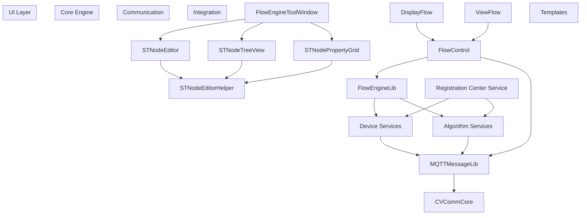
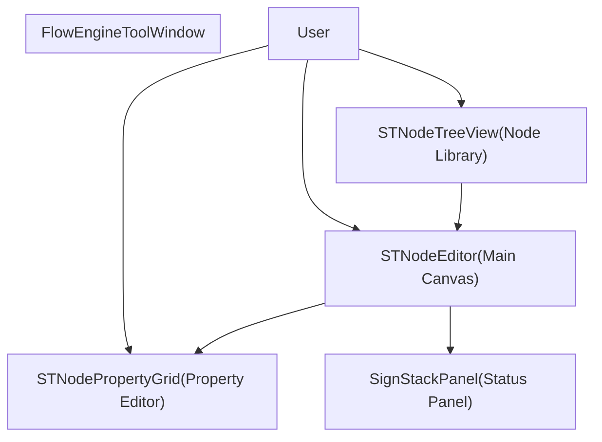
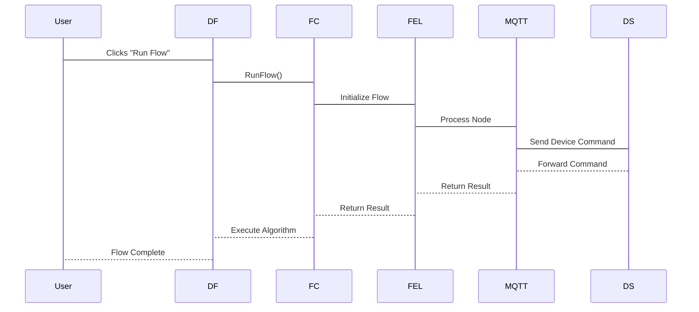
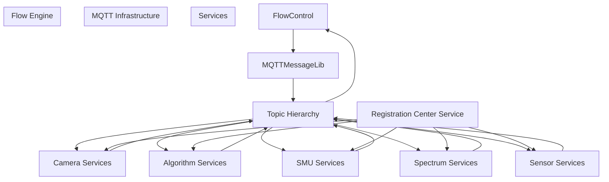
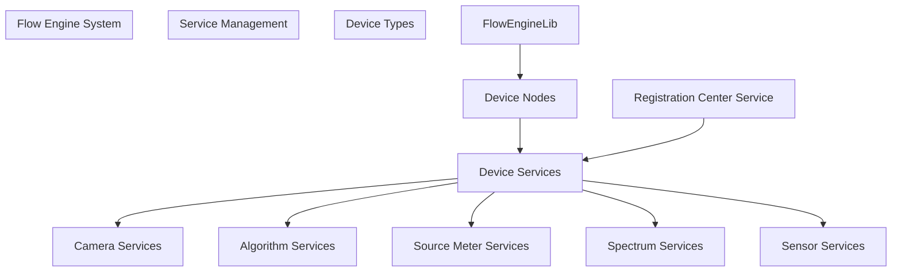

# Flow Engine System

> **Relevant source files**
> * [DLL/CVCommCore.dll](https://github.com/xincheng213618/scgd_general_wpf/blob/987af5f7/DLL/CVCommCore.dll)
> * [DLL/FlowEngineLib.dll](https://github.com/xincheng213618/scgd_general_wpf/blob/987af5f7/DLL/FlowEngineLib.dll)
> * [DLL/MQTTMessageLib.dll](https://github.com/xincheng213618/scgd_general_wpf/blob/987af5f7/DLL/MQTTMessageLib.dll)
> * [DLL/ST.Library.UI.dll](https://github.com/xincheng213618/scgd_general_wpf/blob/987af5f7/DLL/ST.Library.UI.dll)
> * [Engine/ColorVision.Engine/Services/Devices/Calibration/DisplayCalibrationControl.xaml](https://github.com/xincheng213618/scgd_general_wpf/blob/987af5f7/Engine/ColorVision.Engine/Services/Devices/Calibration/DisplayCalibrationControl.xaml)
> * [Engine/ColorVision.Engine/Services/Devices/Calibration/MQTTCalibration.cs](https://github.com/xincheng213618/scgd_general_wpf/blob/987af5f7/Engine/ColorVision.Engine/Services/Devices/Calibration/MQTTCalibration.cs)
> * [Engine/ColorVision.Engine/Services/Devices/ThirdPartyAlgorithms/DisplayThirdPartyAlgorithms.xaml](https://github.com/xincheng213618/scgd_general_wpf/blob/987af5f7/Engine/ColorVision.Engine/Services/Devices/ThirdPartyAlgorithms/DisplayThirdPartyAlgorithms.xaml)
> * [Engine/ColorVision.Engine/Services/RC/MQTTRCService.cs](https://github.com/xincheng213618/scgd_general_wpf/blob/987af5f7/Engine/ColorVision.Engine/Services/RC/MQTTRCService.cs)
> * [Engine/ColorVision.Engine/Templates/ARVR/Distortion/AlgResultDistortionDao.cs](https://github.com/xincheng213618/scgd_general_wpf/blob/987af5f7/Engine/ColorVision.Engine/Templates/ARVR/Distortion/AlgResultDistortionDao.cs)
> * [Engine/ColorVision.Engine/Templates/ARVR/Distortion/ViewHandleDistortion.cs](https://github.com/xincheng213618/scgd_general_wpf/blob/987af5f7/Engine/ColorVision.Engine/Templates/ARVR/Distortion/ViewHandleDistortion.cs)
> * [Engine/ColorVision.Engine/Templates/ARVR/SFR/AlgResultSFRDao.cs](https://github.com/xincheng213618/scgd_general_wpf/blob/987af5f7/Engine/ColorVision.Engine/Templates/ARVR/SFR/AlgResultSFRDao.cs)
> * [Engine/ColorVision.Engine/Templates/ARVR/SFR/EditSFR.xaml](https://github.com/xincheng213618/scgd_general_wpf/blob/987af5f7/Engine/ColorVision.Engine/Templates/ARVR/SFR/EditSFR.xaml)
> * [Engine/ColorVision.Engine/Templates/ARVR/SFR/EditSFR.xaml.cs](https://github.com/xincheng213618/scgd_general_wpf/blob/987af5f7/Engine/ColorVision.Engine/Templates/ARVR/SFR/EditSFR.xaml.cs)
> * [Engine/ColorVision.Engine/Templates/Flow/DisplayFlow.xaml](https://github.com/xincheng213618/scgd_general_wpf/blob/987af5f7/Engine/ColorVision.Engine/Templates/Flow/DisplayFlow.xaml)
> * [Engine/ColorVision.Engine/Templates/Flow/DisplayFlow.xaml.cs](https://github.com/xincheng213618/scgd_general_wpf/blob/987af5f7/Engine/ColorVision.Engine/Templates/Flow/DisplayFlow.xaml.cs)
> * [Engine/ColorVision.Engine/Templates/Flow/FlowConfig.cs](https://github.com/xincheng213618/scgd_general_wpf/blob/987af5f7/Engine/ColorVision.Engine/Templates/Flow/FlowConfig.cs)
> * [Engine/ColorVision.Engine/Templates/Flow/FlowControl.cs](https://github.com/xincheng213618/scgd_general_wpf/blob/987af5f7/Engine/ColorVision.Engine/Templates/Flow/FlowControl.cs)
> * [Engine/ColorVision.Engine/Templates/Flow/FlowEngineToolWindow.xaml](https://github.com/xincheng213618/scgd_general_wpf/blob/987af5f7/Engine/ColorVision.Engine/Templates/Flow/FlowEngineToolWindow.xaml)
> * [Engine/ColorVision.Engine/Templates/Flow/FlowEngineToolWindow.xaml.cs](https://github.com/xincheng213618/scgd_general_wpf/blob/987af5f7/Engine/ColorVision.Engine/Templates/Flow/FlowEngineToolWindow.xaml.cs)
> * [Engine/ColorVision.Engine/Templates/Flow/STNodeEditorHelper.cs](https://github.com/xincheng213618/scgd_general_wpf/blob/987af5f7/Engine/ColorVision.Engine/Templates/Flow/STNodeEditorHelper.cs)
> * [Engine/ColorVision.Engine/Templates/Flow/ViewFlow.xaml](https://github.com/xincheng213618/scgd_general_wpf/blob/987af5f7/Engine/ColorVision.Engine/Templates/Flow/ViewFlow.xaml)
> * [Engine/ColorVision.Engine/Templates/Flow/ViewFlow.xaml.cs](https://github.com/xincheng213618/scgd_general_wpf/blob/987af5f7/Engine/ColorVision.Engine/Templates/Flow/ViewFlow.xaml.cs)
> * [Engine/ColorVision.Engine/Templates/Jsons/SFRFindROI/MysqlSFRFindROI.cs](https://github.com/xincheng213618/scgd_general_wpf/blob/987af5f7/Engine/ColorVision.Engine/Templates/Jsons/SFRFindROI/MysqlSFRFindROI.cs)
> * [Engine/cvColorVision/CMStruct.cs](https://github.com/xincheng213618/scgd_general_wpf/blob/987af5f7/Engine/cvColorVision/CMStruct.cs)
> * [UI/ColorVision.ImageEditor/Draw/DrawCanvas.cs](https://github.com/xincheng213618/scgd_general_wpf/blob/987af5f7/UI/ColorVision.ImageEditor/Draw/DrawCanvas.cs)
> * [UI/ColorVision.Solution/Searches/SolutionView.xaml](https://github.com/xincheng213618/scgd_general_wpf/blob/987af5f7/UI/ColorVision.Solution/Searches/SolutionView.xaml)

The Flow Engine System is a visual programming environment within the ColorVision application that allows users to create, edit, and execute automated workflows through a node-based interface. It provides a way to visually connect different functional components like device controls, algorithms, and data processing steps into executable flows that can be used for various testing and analysis purposes.

For information about specific types of flows used in specialized projects, see [Project System](/xincheng213618/scgd_general_wpf/8-project-system).

## Architecture Overview

The Flow Engine System is composed of several key components that work together to provide a comprehensive visual programming environment.



**Architecture Diagram: Flow Engine System Components**

Sources:

* [Engine/ColorVision.Engine/Templates/Flow/STNodeEditorHelper.cs

60-78](https://github.com/xincheng213618/scgd_general_wpf/blob/987af5f7/Engine/ColorVision.Engine/Templates/Flow/STNodeEditorHelper.cs#L60-L78)
* [Engine/ColorVision.Engine/Templates/Flow/DisplayFlow.xaml.cs

32-50](https://github.com/xincheng213618/scgd_general_wpf/blob/987af5f7/Engine/ColorVision.Engine/Templates/Flow/DisplayFlow.xaml.cs#L32-L50)
* [Engine/ColorVision.Engine/Templates/Flow/ViewFlow.xaml.cs

16-26](https://github.com/xincheng213618/scgd_general_wpf/blob/987af5f7/Engine/ColorVision.Engine/Templates/Flow/ViewFlow.xaml.cs#L16-L26)
* [Engine/ColorVision.Engine/Templates/Flow/FlowEngineToolWindow.xaml.cs

20-31](https://github.com/xincheng213618/scgd_general_wpf/blob/987af5f7/Engine/ColorVision.Engine/Templates/Flow/FlowEngineToolWindow.xaml.cs#L20-L31)
* [DLL/FlowEngineLib.dll](https://github.com/xincheng213618/scgd_general_wpf/blob/987af5f7/DLL/FlowEngineLib.dll)
* [DLL/MQTTMessageLib.dll](https://github.com/xincheng213618/scgd_general_wpf/blob/987af5f7/DLL/MQTTMessageLib.dll)
* [DLL/CVCommCore.dll](https://github.com/xincheng213618/scgd_general_wpf/blob/987af5f7/DLL/CVCommCore.dll)

## UI Components

The Flow Engine System provides a rich set of user interface components for creating and managing flows.

### FlowEngineToolWindow

The main window container that hosts all other UI components of the Flow Engine. It provides a workspace for users to create and edit flows.



**Diagram: FlowEngineToolWindow Component Interaction**

Sources:

* [Engine/ColorVision.Engine/Templates/Flow/FlowEngineToolWindow.xaml

1-9](https://github.com/xincheng213618/scgd_general_wpf/blob/987af5f7/Engine/ColorVision.Engine/Templates/Flow/FlowEngineToolWindow.xaml#L1-L9)
* [Engine/ColorVision.Engine/Templates/Flow/FlowEngineToolWindow.xaml.cs

20-31](https://github.com/xincheng213618/scgd_general_wpf/blob/987af5f7/Engine/ColorVision.Engine/Templates/Flow/FlowEngineToolWindow.xaml.cs#L20-L31)
* [Engine/ColorVision.Engine/Templates/Flow/STNodeEditorHelper.cs

60-78](https://github.com/xincheng213618/scgd_general_wpf/blob/987af5f7/Engine/ColorVision.Engine/Templates/Flow/STNodeEditorHelper.cs#L60-L78)

### STNodeEditor

The central component where users create and connect nodes visually. It provides the canvas for the visual programming interface.

### STNodeTreeView

Displays a hierarchical view of all available node types that can be added to a flow. Nodes are categorized by functionality such as Device Nodes, Algorithm Nodes, etc.

### STNodePropertyGrid

Allows users to view and edit the properties of the selected node. Each node type has specific properties that can be configured.

Sources:

* [DLL/ST.Library.UI.dll](https://github.com/xincheng213618/scgd_general_wpf/blob/987af5f7/DLL/ST.Library.UI.dll)
* [Engine/ColorVision.Engine/Templates/Flow/STNodeEditorHelper.cs

60-78](https://github.com/xincheng213618/scgd_general_wpf/blob/987af5f7/Engine/ColorVision.Engine/Templates/Flow/STNodeEditorHelper.cs#L60-L78)

## Node Types and Structure

The Flow Engine System supports various types of nodes that can be connected to create flows. These nodes represent different functionalities within the system.

```mermaid
flowchart TD

subgraph Control_Nodes ["Control Nodes"]
end

subgraph Algorithm_Nodes ["Algorithm Nodes"]
end

subgraph Device_Nodes ["Device Nodes"]
end

subgraph Flow_Structure ["Flow Structure"]
end

SN["Start Node"]
DN["Device Nodes"]
AN["Algorithm Nodes"]
CN["Control Nodes"]
EN["End Node"]
CA["CameraCapture/Control"]
SM["SMUSource Meter Units"]
SP["SpectrumSpectrometers"]
SE["SensorVarious Sensors"]
PO["POIPoints of Interest"]
MT["MTFModulation Transfer Function"]
SF["SFRSpatial Frequency Response"]
BM["BlackMuraBlack Mura Analysis"]
DI["DistortionDistortion Analysis"]
FP["Flow ControlConditional Logic"]
LP["LoopsRepetition"]
DL["DelaysTiming"]

    SN --> DN
    SN --> AN
    SN --> CN
    DN --> EN
    AN --> EN
    CN --> EN
    DN --> CA
    DN --> SM
    DN --> SP
    DN --> SE
    AN --> PO
    AN --> MT
    AN --> SF
    AN --> BM
    AN --> DI
    CN --> FP
    CN --> LP
    CN --> DL
```



**Diagram: Flow Engine Node Structure**

Sources:

* [Engine/ColorVision.Engine/Templates/Flow/STNodeEditorHelper.cs

3-41](https://github.com/xincheng213618/scgd_general_wpf/blob/987af5f7/Engine/ColorVision.Engine/Templates/Flow/STNodeEditorHelper.cs#L3-L41)
* [DLL/FlowEngineLib.dll](https://github.com/xincheng213618/scgd_general_wpf/blob/987af5f7/DLL/FlowEngineLib.dll)

## Flow Creation and Execution

### Creating a Flow

1. Open the FlowEngineToolWindow
2. Drag nodes from STNodeTreeView onto the STNodeEditor canvas
3. Connect node outputs to inputs by clicking and dragging between node ports
4. Configure node properties using the STNodePropertyGrid
5. Save the flow for later use

### Flow Execution Process



**Diagram: Flow Execution Process**

Sources:

* [Engine/ColorVision.Engine/Templates/Flow/DisplayFlow.xaml.cs

32-50](https://github.com/xincheng213618/scgd_general_wpf/blob/987af5f7/Engine/ColorVision.Engine/Templates/Flow/DisplayFlow.xaml.cs#L32-L50)
* [Engine/ColorVision.Engine/Templates/Flow/FlowControl.cs](https://github.com/xincheng213618/scgd_general_wpf/blob/987af5f7/Engine/ColorVision.Engine/Templates/Flow/FlowControl.cs)
* [DLL/FlowEngineLib.dll](https://github.com/xincheng213618/scgd_general_wpf/blob/987af5f7/DLL/FlowEngineLib.dll)
* [DLL/MQTTMessageLib.dll](https://github.com/xincheng213618/scgd_general_wpf/blob/987af5f7/DLL/MQTTMessageLib.dll)

### Scheduled Execution

The Flow Engine System supports scheduled execution of flows using the Quartz scheduler. Flows can be scheduled to run at specific times or at regular intervals.

```
// FlowJob class for scheduled execution
public class FlowJob : IJob
{
    public Task Execute(IJobExecutionContext context)
    {
        var schedulerInfo = QuartzSchedulerManager.GetInstance().TaskInfos.First(x => x.JobName == context.JobDetail.Key.Name && x.GroupName == context.JobDetail.Key.Group);
        schedulerInfo.RunCount++;
        Application.Current.Dispatcher.BeginInvoke(() =>
        {
            schedulerInfo.Status = SchedulerStatus.Running;
        });
        Application.Current.Dispatcher.BeginInvoke(() =>
        {
            DisplayFlow.GetInstance().RunFlow();
            schedulerInfo.Status = SchedulerStatus.Ready;
        });
        return Task.CompletedTask;
    }
}
```

Sources:

* [Engine/ColorVision.Engine/Templates/Flow/DisplayFlow.xaml.cs

33-50](https://github.com/xincheng213618/scgd_general_wpf/blob/987af5f7/Engine/ColorVision.Engine/Templates/Flow/DisplayFlow.xaml.cs#L33-L50)

## Communication System

### MQTT Communication

The Flow Engine System uses MQTT (Message Queuing Telemetry Transport) for communication between the flow engine and various services and devices. This allows for loosely coupled, event-driven communication.



**Diagram: MQTT Communication System**

Sources:

* [DLL/MQTTMessageLib.dll](https://github.com/xincheng213618/scgd_general_wpf/blob/987af5f7/DLL/MQTTMessageLib.dll)
* [Engine/ColorVision.Engine/Services/RC/MQTTRCService.cs](https://github.com/xincheng213618/scgd_general_wpf/blob/987af5f7/Engine/ColorVision.Engine/Services/RC/MQTTRCService.cs)
* [DLL/CVCommCore.dll](https://github.com/xincheng213618/scgd_general_wpf/blob/987af5f7/DLL/CVCommCore.dll)

## Integration with Other Systems

### Device Service Integration

The Flow Engine System integrates with various device services through the service management system. Device nodes in a flow represent actual physical devices that can be controlled and monitored.



**Diagram: Device Service Integration**

Sources:

* [Engine/ColorVision.Engine/Services/RC/MQTTRCService.cs](https://github.com/xincheng213618/scgd_general_wpf/blob/987af5f7/Engine/ColorVision.Engine/Services/RC/MQTTRCService.cs)
* [Engine/ColorVision.Engine/Templates/Flow/STNodeEditorHelper.cs

3-9](https://github.com/xincheng213618/scgd_general_wpf/blob/987af5f7/Engine/ColorVision.Engine/Templates/Flow/STNodeEditorHelper.cs#L3-L9)

### Algorithm Integration

The Flow Engine System integrates with various image processing and analysis algorithms. Algorithm nodes in a flow represent these processing steps.

| Algorithm Type | Description | Associated Nodes |
| --- | --- | --- |
| POI (Points of Interest) | Define and analyze specific regions in images | POIBuildNode, POIFilterNode, POIReviseNode |
| MTF (Modulation Transfer Function) | Analyze image sharpness and resolution | MTFNode |
| SFR (Spatial Frequency Response) | Analyze frequency response of imaging systems | SFRNode, SFRFindROINode |
| Distortion | Analyze geometric distortion in images | DistortionNode, Distortion2Node |
| BlackMura | Detect and analyze black mura defects | BlackMuraNode |
| Ghost | Detect and analyze ghost artifacts | GhostNode, Ghost2Node |
| FOV (Field of View) | Analyze the field of view | FOVNode, FOV2Node |

Sources:

* [Engine/ColorVision.Engine/Templates/Flow/STNodeEditorHelper.cs

15-40](https://github.com/xincheng213618/scgd_general_wpf/blob/987af5f7/Engine/ColorVision.Engine/Templates/Flow/STNodeEditorHelper.cs#L15-L40)
* [Engine/ColorVision.Engine/Templates/ARVR/Distortion/AlgResultDistortionDao.cs](https://github.com/xincheng213618/scgd_general_wpf/blob/987af5f7/Engine/ColorVision.Engine/Templates/ARVR/Distortion/AlgResultDistortionDao.cs)
* [Engine/ColorVision.Engine/Templates/ARVR/Distortion/ViewHandleDistortion.cs](https://github.com/xincheng213618/scgd_general_wpf/blob/987af5f7/Engine/ColorVision.Engine/Templates/ARVR/Distortion/ViewHandleDistortion.cs)

## Flow Control and Management

### Flow Configuration

The Flow Engine System provides configuration options through the `FlowConfig` class. This allows for customization of the flow engine behavior.

```
public class FlowConfig : ViewModelBase, IConfig
{
    public static FlowConfig Instance => ConfigService.Instance.GetRequiredService<FlowConfig>();

    public RelayCommand EditCommand { get; set; }
    // Configuration properties and methods
}
```

Sources:

* [Engine/ColorVision.Engine/Templates/Flow/FlowConfig.cs

10-16](https://github.com/xincheng213618/scgd_general_wpf/blob/987af5f7/Engine/ColorVision.Engine/Templates/Flow/FlowConfig.cs#L10-L16)

### Flow Control

The `FlowControl` class manages the execution of flows, handling the logic for running flows and communicating with devices through MQTT.

Sources:

* [Engine/ColorVision.Engine/Templates/Flow/FlowControl.cs](https://github.com/xincheng213618/scgd_general_wpf/blob/987af5f7/Engine/ColorVision.Engine/Templates/Flow/FlowControl.cs)

## User Interface Views

### DisplayFlow

The `DisplayFlow` class provides the user interface for displaying and executing flows. It includes controls for selecting, running, and managing flows.

Sources:

* [Engine/ColorVision.Engine/Templates/Flow/DisplayFlow.xaml.cs](https://github.com/xincheng213618/scgd_general_wpf/blob/987af5f7/Engine/ColorVision.Engine/Templates/Flow/DisplayFlow.xaml.cs)

### ViewFlow

The `ViewFlow` class provides a user control for viewing flows within the application. It can be integrated into other windows and panels.

Sources:

* [Engine/ColorVision.Engine/Templates/Flow/ViewFlow.xaml](https://github.com/xincheng213618/scgd_general_wpf/blob/987af5f7/Engine/ColorVision.Engine/Templates/Flow/ViewFlow.xaml)
* [Engine/ColorVision.Engine/Templates/Flow/ViewFlow.xaml.cs](https://github.com/xincheng213618/scgd_general_wpf/blob/987af5f7/Engine/ColorVision.Engine/Templates/Flow/ViewFlow.xaml.cs)

## Implementation Details

### STNodeEditorHelper

The `STNodeEditorHelper` class provides helper methods for managing the STNodeEditor components. It handles node creation, connections, and property editing.

Sources:

* [Engine/ColorVision.Engine/Templates/Flow/STNodeEditorHelper.cs

60-78](https://github.com/xincheng213618/scgd_general_wpf/blob/987af5f7/Engine/ColorVision.Engine/Templates/Flow/STNodeEditorHelper.cs#L60-L78)

### DrawCanvas

The `DrawCanvas` class is used for rendering graphical elements within the flow editor. It provides drawing capabilities for visual elements in the flow.

Sources:

* [UI/ColorVision.ImageEditor/Draw/DrawCanvas.cs

14-16](https://github.com/xincheng213618/scgd_general_wpf/blob/987af5f7/UI/ColorVision.ImageEditor/Draw/DrawCanvas.cs#L14-L16)

## Conclusion

The Flow Engine System is a powerful visual programming environment that allows users to create automated workflows within the ColorVision application. It provides a flexible, node-based interface for connecting devices, algorithms, and control logic to create complex flows for various testing and analysis purposes.

The system's architecture enables easy extension with new node types and integration with additional devices and algorithms. The MQTT-based communication system provides loose coupling between components, allowing for a modular and scalable design.