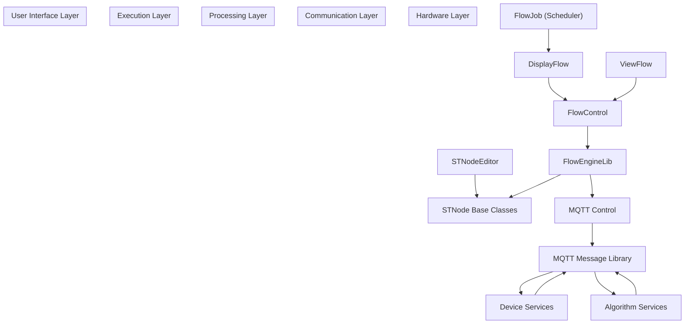
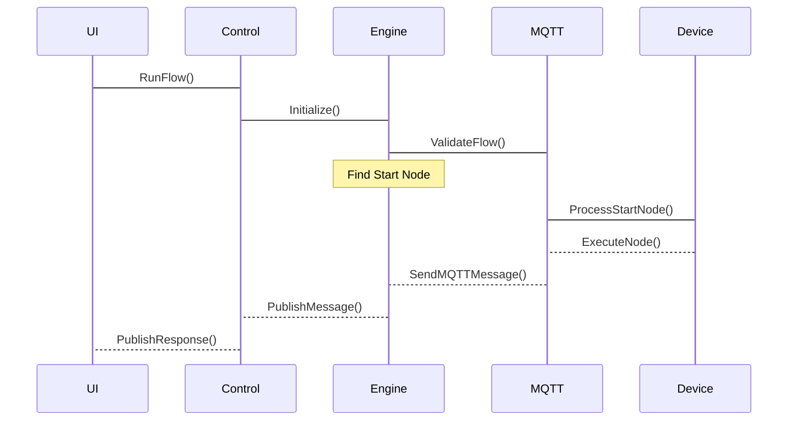
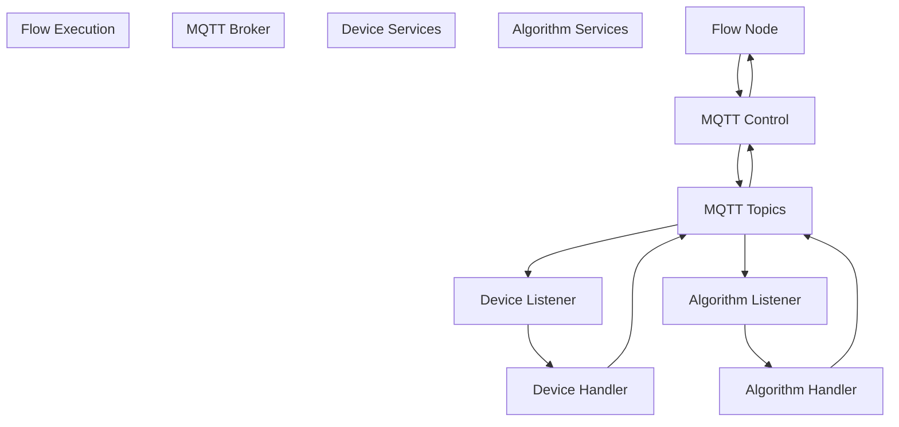
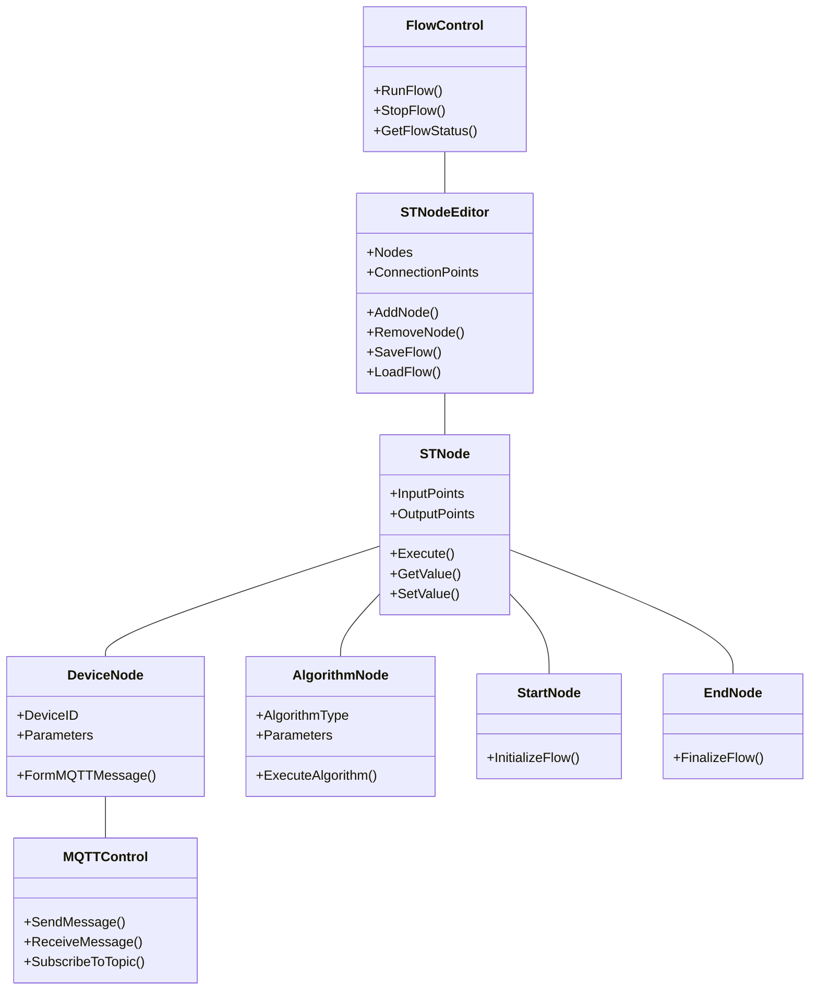

# Flow Execution

> **Relevant source files**
> * [DLL/CVCommCore.dll](https://github.com/xincheng213618/scgd_general_wpf/blob/987af5f7/DLL/CVCommCore.dll)
> * [DLL/FlowEngineLib.dll](https://github.com/xincheng213618/scgd_general_wpf/blob/987af5f7/DLL/FlowEngineLib.dll)
> * [DLL/MQTTMessageLib.dll](https://github.com/xincheng213618/scgd_general_wpf/blob/987af5f7/DLL/MQTTMessageLib.dll)
> * [DLL/ST.Library.UI.dll](https://github.com/xincheng213618/scgd_general_wpf/blob/987af5f7/DLL/ST.Library.UI.dll)
> * [Engine/ColorVision.Engine/Services/Devices/Calibration/DisplayCalibrationControl.xaml](https://github.com/xincheng213618/scgd_general_wpf/blob/987af5f7/Engine/ColorVision.Engine/Services/Devices/Calibration/DisplayCalibrationControl.xaml)
> * [Engine/ColorVision.Engine/Services/Devices/Calibration/MQTTCalibration.cs](https://github.com/xincheng213618/scgd_general_wpf/blob/987af5f7/Engine/ColorVision.Engine/Services/Devices/Calibration/MQTTCalibration.cs)
> * [Engine/ColorVision.Engine/Services/Devices/ThirdPartyAlgorithms/DisplayThirdPartyAlgorithms.xaml](https://github.com/xincheng213618/scgd_general_wpf/blob/987af5f7/Engine/ColorVision.Engine/Services/Devices/ThirdPartyAlgorithms/DisplayThirdPartyAlgorithms.xaml)
> * [Engine/ColorVision.Engine/Services/RC/MQTTRCService.cs](https://github.com/xincheng213618/scgd_general_wpf/blob/987af5f7/Engine/ColorVision.Engine/Services/RC/MQTTRCService.cs)
> * [Engine/ColorVision.Engine/Templates/ARVR/Distortion/AlgResultDistortionDao.cs](https://github.com/xincheng213618/scgd_general_wpf/blob/987af5f7/Engine/ColorVision.Engine/Templates/ARVR/Distortion/AlgResultDistortionDao.cs)
> * [Engine/ColorVision.Engine/Templates/ARVR/Distortion/ViewHandleDistortion.cs](https://github.com/xincheng213618/scgd_general_wpf/blob/987af5f7/Engine/ColorVision.Engine/Templates/ARVR/Distortion/ViewHandleDistortion.cs)
> * [Engine/ColorVision.Engine/Templates/ARVR/SFR/AlgResultSFRDao.cs](https://github.com/xincheng213618/scgd_general_wpf/blob/987af5f7/Engine/ColorVision.Engine/Templates/ARVR/SFR/AlgResultSFRDao.cs)
> * [Engine/ColorVision.Engine/Templates/ARVR/SFR/EditSFR.xaml](https://github.com/xincheng213618/scgd_general_wpf/blob/987af5f7/Engine/ColorVision.Engine/Templates/ARVR/SFR/EditSFR.xaml)
> * [Engine/ColorVision.Engine/Templates/ARVR/SFR/EditSFR.xaml.cs](https://github.com/xincheng213618/scgd_general_wpf/blob/987af5f7/Engine/ColorVision.Engine/Templates/ARVR/SFR/EditSFR.xaml.cs)
> * [Engine/ColorVision.Engine/Templates/Flow/DisplayFlow.xaml](https://github.com/xincheng213618/scgd_general_wpf/blob/987af5f7/Engine/ColorVision.Engine/Templates/Flow/DisplayFlow.xaml)
> * [Engine/ColorVision.Engine/Templates/Flow/DisplayFlow.xaml.cs](https://github.com/xincheng213618/scgd_general_wpf/blob/987af5f7/Engine/ColorVision.Engine/Templates/Flow/DisplayFlow.xaml.cs)
> * [Engine/ColorVision.Engine/Templates/Flow/FlowConfig.cs](https://github.com/xincheng213618/scgd_general_wpf/blob/987af5f7/Engine/ColorVision.Engine/Templates/Flow/FlowConfig.cs)
> * [Engine/ColorVision.Engine/Templates/Flow/FlowControl.cs](https://github.com/xincheng213618/scgd_general_wpf/blob/987af5f7/Engine/ColorVision.Engine/Templates/Flow/FlowControl.cs)
> * [Engine/ColorVision.Engine/Templates/Flow/FlowEngineToolWindow.xaml](https://github.com/xincheng213618/scgd_general_wpf/blob/987af5f7/Engine/ColorVision.Engine/Templates/Flow/FlowEngineToolWindow.xaml)
> * [Engine/ColorVision.Engine/Templates/Flow/FlowEngineToolWindow.xaml.cs](https://github.com/xincheng213618/scgd_general_wpf/blob/987af5f7/Engine/ColorVision.Engine/Templates/Flow/FlowEngineToolWindow.xaml.cs)
> * [Engine/ColorVision.Engine/Templates/Flow/STNodeEditorHelper.cs](https://github.com/xincheng213618/scgd_general_wpf/blob/987af5f7/Engine/ColorVision.Engine/Templates/Flow/STNodeEditorHelper.cs)
> * [Engine/ColorVision.Engine/Templates/Flow/ViewFlow.xaml](https://github.com/xincheng213618/scgd_general_wpf/blob/987af5f7/Engine/ColorVision.Engine/Templates/Flow/ViewFlow.xaml)
> * [Engine/ColorVision.Engine/Templates/Flow/ViewFlow.xaml.cs](https://github.com/xincheng213618/scgd_general_wpf/blob/987af5f7/Engine/ColorVision.Engine/Templates/Flow/ViewFlow.xaml.cs)
> * [Engine/ColorVision.Engine/Templates/Jsons/SFRFindROI/MysqlSFRFindROI.cs](https://github.com/xincheng213618/scgd_general_wpf/blob/987af5f7/Engine/ColorVision.Engine/Templates/Jsons/SFRFindROI/MysqlSFRFindROI.cs)
> * [Engine/cvColorVision/CMStruct.cs](https://github.com/xincheng213618/scgd_general_wpf/blob/987af5f7/Engine/cvColorVision/CMStruct.cs)
> * [UI/ColorVision.ImageEditor/Draw/DrawCanvas.cs](https://github.com/xincheng213618/scgd_general_wpf/blob/987af5f7/UI/ColorVision.ImageEditor/Draw/DrawCanvas.cs)
> * [UI/ColorVision.Solution/Searches/SolutionView.xaml](https://github.com/xincheng213618/scgd_general_wpf/blob/987af5f7/UI/ColorVision.Solution/Searches/SolutionView.xaml)

Flow Execution is a critical component of the ColorVision system that manages the runtime process of executing workflow graphs created in the Flow Engine. It handles node activation sequencing, data transfer between nodes, communication with devices through MQTT, error processing, and result collection.

For information about creating visual flows using the editor interface, see [Visual Flow Editor](/xincheng213618/scgd_general_wpf/6.1-visual-flow-editor).

## Flow Execution Architecture

The Flow Execution system coordinates all aspects of executing visual workflows in ColorVision. It bridges the gap between the visual programming interface and actual device operations through a multi-layered architecture.

Sources:

* [Engine/ColorVision.Engine/Templates/Flow/DisplayFlow.xaml.cs

1-80](https://github.com/xincheng213618/scgd_general_wpf/blob/987af5f7/Engine/ColorVision.Engine/Templates/Flow/DisplayFlow.xaml.cs#L1-L80)
* [Engine/ColorVision.Engine/Templates/Flow/FlowControl.cs

1-4](https://github.com/xincheng213618/scgd_general_wpf/blob/987af5f7/Engine/ColorVision.Engine/Templates/Flow/FlowControl.cs#L1-L4)
* [Engine/ColorVision.Engine/Templates/Flow/ViewFlow.xaml.cs

1-26](https://github.com/xincheng213618/scgd_general_wpf/blob/987af5f7/Engine/ColorVision.Engine/Templates/Flow/ViewFlow.xaml.cs#L1-L26)
* [DLL/FlowEngineLib.dll L1-L200](https://github.com/xincheng213618/scgd_general_wpf/blob/987af5f7/DLL/FlowEngineLib.dll#L1-L200)
* [DLL/MQTTMessageLib.dll L1-L100](https://github.com/xincheng213618/scgd_general_wpf/blob/987af5f7/DLL/MQTTMessageLib.dll#L1-L100)

## Flow Execution Process

The execution of a flow follows a defined process from initialization to completion, coordinating between the UI, flow engine, MQTT communication, and devices.

Sources:

* [Engine/ColorVision.Engine/Templates/Flow/DisplayFlow.xaml.cs

380-450](https://github.com/xincheng213618/scgd_general_wpf/blob/987af5f7/Engine/ColorVision.Engine/Templates/Flow/DisplayFlow.xaml.cs#L380-L450)
* [DLL/FlowEngineLib.dll L90-L150](https://github.com/xincheng213618/scgd_general_wpf/blob/987af5f7/DLL/FlowEngineLib.dll#L90-L150)
* [Engine/ColorVision.Engine/Templates/Flow/FlowControl.cs

1-100](https://github.com/xincheng213618/scgd_general_wpf/blob/987af5f7/Engine/ColorVision.Engine/Templates/Flow/FlowControl.cs#L1-L100)

## Key Components

### DisplayFlow

The DisplayFlow class serves as the primary interface for flow execution. It provides UI controls for selecting and running flows, and interfaces with the FlowControl system to execute the flows.

Key functionality:

* Manages flow execution state
* Provides interfaces for starting, stopping, and monitoring flows
* Integrates with task scheduling for automated execution
* Handles socket-based remote control of flows

Sources:

* [Engine/ColorVision.Engine/Templates/Flow/DisplayFlow.xaml.cs

35-70](https://github.com/xincheng213618/scgd_general_wpf/blob/987af5f7/Engine/ColorVision.Engine/Templates/Flow/DisplayFlow.xaml.cs#L35-L70)

### FlowControl

The FlowControl class coordinates the communication between the UI layer and the execution engine. It handles the actual execution of flows, manages error states, and provides status updates back to the UI.

Key responsibilities:

* Flow initialization
* Error handling
* Status reporting
* MQTT message management

Sources:

* [Engine/ColorVision.Engine/Templates/Flow/FlowControl.cs

1-100](https://github.com/xincheng213618/scgd_general_wpf/blob/987af5f7/Engine/ColorVision.Engine/Templates/Flow/FlowControl.cs#L1-L100)

### FlowEngineLib

The FlowEngineLib is the core component that handles the actual execution of flows. It navigates through the node graph, executes each node, and manages the data transfer between nodes.

Notable classes and functions:

* Flow execution management
* Node sequencing
* Data transfer between nodes
* End node processing

Sources:

* [DLL/FlowEngineLib.dll L1-L200](https://github.com/xincheng213618/scgd_general_wpf/blob/987af5f7/DLL/FlowEngineLib.dll#L1-L200)

## MQTT Communication Model

The Flow Execution system relies heavily on MQTT for communication with devices and services. This publish/subscribe model enables loosely coupled interactions between flow nodes and hardware or algorithm services.

Sources:

* [DLL/MQTTMessageLib.dll L1-L100](https://github.com/xincheng213618/scgd_general_wpf/blob/987af5f7/DLL/MQTTMessageLib.dll#L1-L100)
* [DLL/CVCommCore.dll L1-L100](https://github.com/xincheng213618/scgd_general_wpf/blob/987af5f7/DLL/CVCommCore.dll#L1-L100)

## Node Execution Process

During flow execution, each node in the graph is processed according to its type and configuration. This involves:

1. **Activation**: A node is activated when all required inputs are available
2. **Processing**: The node processes its inputs according to its function
3. **Output Generation**: The node produces outputs that are passed to connected nodes
4. **State Management**: The node's state is updated to reflect completion or errors

### Device Node Execution

Device nodes represent operations performed by physical hardware or remote services. Their execution involves:

1. Forming an MQTT message with the required parameters
2. Publishing the message to the appropriate topic
3. Waiting for a response (synchronous) or continuing execution (asynchronous)
4. Processing the response data when available

### Algorithm Node Execution

Algorithm nodes perform computational operations within the flow engine itself. Their execution involves:

1. Receiving input data from previous nodes
2. Executing the algorithm with the specified parameters
3. Producing output data for subsequent nodes
4. Handling any errors that occur during processing

Sources:

* [DLL/FlowEngineLib.dll L250-L350](https://github.com/xincheng213618/scgd_general_wpf/blob/987af5f7/DLL/FlowEngineLib.dll#L250-L350)
* [Engine/ColorVision.Engine/Templates/Flow/STNodeEditorHelper.cs

60-78](https://github.com/xincheng213618/scgd_general_wpf/blob/987af5f7/Engine/ColorVision.Engine/Templates/Flow/STNodeEditorHelper.cs#L60-L78)

## Flow Scheduling

The flow execution system supports scheduled execution through integration with a job scheduling system. This allows flows to be executed at specific times or intervals.

Key components:

* **FlowJob**: Implements the IJob interface to enable scheduled execution of flows
* **QuartzSchedulerManager**: Manages the scheduling of flow jobs

The scheduler provides capabilities for:

* One-time execution at a specific time
* Recurring execution at defined intervals
* Execution tracking and status reporting

Sources:

* [Engine/ColorVision.Engine/Templates/Flow/DisplayFlow.xaml.cs

33-50](https://github.com/xincheng213618/scgd_general_wpf/blob/987af5f7/Engine/ColorVision.Engine/Templates/Flow/DisplayFlow.xaml.cs#L33-L50)

## Error Handling

The flow execution system includes robust error handling to manage issues that may occur during execution. This includes:

| Error Type | Handling Approach |
| --- | --- |
| Device Connection Errors | Retry attempts with configurable timeout |
| Parameter Validation Errors | Pre-execution validation and informative error messages |
| Execution Timeout | Configurable timeouts with cancellation |
| Node Execution Failures | Partial execution results and error reporting |
| MQTT Communication Failures | Connection recovery and message queue management |

Sources:

* [DLL/FlowEngineLib.dll L400-L450](https://github.com/xincheng213618/scgd_general_wpf/blob/987af5f7/DLL/FlowEngineLib.dll#L400-L450)
* [Engine/ColorVision.Engine/Templates/Flow/FlowControl.cs

50-100](https://github.com/xincheng213618/scgd_general_wpf/blob/987af5f7/Engine/ColorVision.Engine/Templates/Flow/FlowControl.cs#L50-L100)

## Flow Execution Objects Model

The flow execution system works with several key object types that represent the various components of a flow.

Sources:

* [Engine/ColorVision.Engine/Templates/Flow/STNodeEditorHelper.cs

1-78](https://github.com/xincheng213618/scgd_general_wpf/blob/987af5f7/Engine/ColorVision.Engine/Templates/Flow/STNodeEditorHelper.cs#L1-L78)
* [DLL/ST.Library.UI.dll

1-100](https://github.com/xincheng213618/scgd_general_wpf/blob/987af5f7/DLL/ST.Library.UI.dll#L1-L100)
* [DLL/FlowEngineLib.dll L1-L100](https://github.com/xincheng213618/scgd_general_wpf/blob/987af5f7/DLL/FlowEngineLib.dll#L1-L100)

## Remote Flow Execution

The flow execution system supports remote control through network sockets, allowing external applications to trigger flow execution. This is implemented through the `FlowSocketMsgHandle` class, which processes incoming socket messages and triggers the appropriate flow.

Key features:

* Remote flow selection and execution
* Flow execution status reporting
* Simple text-based communication protocol

Sources:

* [Engine/ColorVision.Engine/Templates/Flow/DisplayFlow.xaml.cs

52-81](https://github.com/xincheng213618/scgd_general_wpf/blob/987af5f7/Engine/ColorVision.Engine/Templates/Flow/DisplayFlow.xaml.cs#L52-L81)

## Extending Flow Execution

The flow execution system is designed to be extensible, allowing for the addition of new node types and execution capabilities.

To extend the system:

1. Create new node classes by inheriting from the appropriate base classes
2. Register the new nodes with the STNodeEditor
3. Implement the required execution logic
4. Integrate with the MQTT system if device communication is needed

The system uses reflection to discover and load node types, making it straightforward to add new capabilities.

Sources:

* [Engine/ColorVision.Engine/Templates/Flow/STNodeEditorHelper.cs

60-100](https://github.com/xincheng213618/scgd_general_wpf/blob/987af5f7/Engine/ColorVision.Engine/Templates/Flow/STNodeEditorHelper.cs#L60-L100)

## Integration with Device Services

Flow execution integrates closely with device services to control hardware and process data. Each device service has a corresponding set of nodes that can be used in flows, allowing for sophisticated control of physical hardware.

| Device Type | Flow Node Types | Key Operations |
| --- | --- | --- |
| Camera | CameraExposure, AutoFocus, AutoExpTime | Image capture, focus, exposure |
| Spectrum | SpectralMeasurement | Color and spectral analysis |
| SMU (Source Meter) | SourceVoltage, MeasureCurrent | Electrical measurements |
| Sensor | SensorReading, SensorCalibration | Environmental measurements |
| Algorithm | ImageProcessing, DataAnalysis | Software-based analysis |

Sources:

* [Engine/ColorVision.Engine/Templates/Flow/STNodeEditorHelper.cs

1-45](https://github.com/xincheng213618/scgd_general_wpf/blob/987af5f7/Engine/ColorVision.Engine/Templates/Flow/STNodeEditorHelper.cs#L1-L45)

## Summary

The Flow Execution system provides a robust framework for executing visual workflows in the ColorVision application. It bridges the gap between the visual programming interface and the physical hardware and software services that perform the actual work. Through its layered architecture and MQTT-based communication, it enables flexible, extensible, and reliable workflow execution for a wide range of device control and data processing tasks.