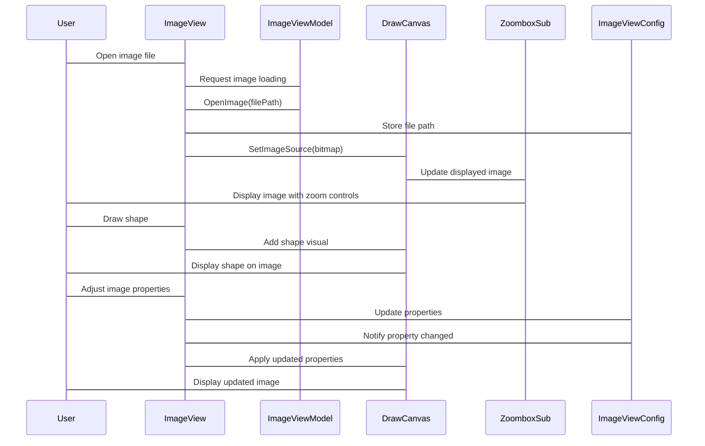
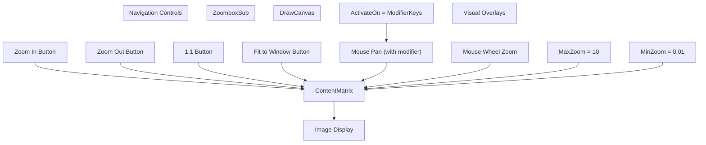
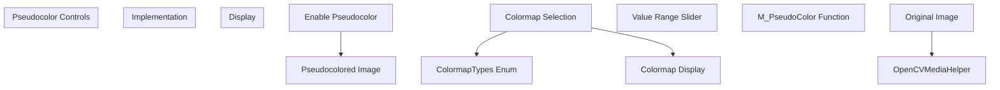
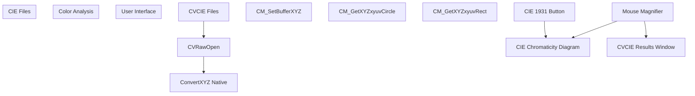
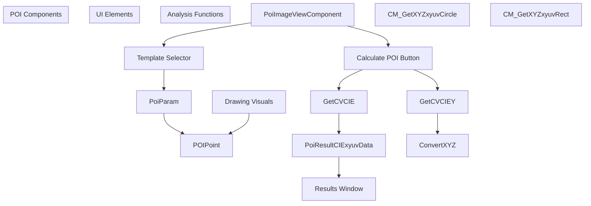

# Image Editor

> **Relevant source files**
> * [Engine/ColorVision.Engine/Media/CVRawOpen.cs](https://github.com/xincheng213618/scgd_general_wpf/blob/987af5f7/Engine/ColorVision.Engine/Media/CVRawOpen.cs)
> * [Engine/ColorVision.Engine/Templates/POI/Image/PoiImageViewComponent.cs](https://github.com/xincheng213618/scgd_general_wpf/blob/987af5f7/Engine/ColorVision.Engine/Templates/POI/Image/PoiImageViewComponent.cs)
> * [Engine/ColorVision.Engine/Templates/POI/Image/WindowCVCIE.xaml](https://github.com/xincheng213618/scgd_general_wpf/blob/987af5f7/Engine/ColorVision.Engine/Templates/POI/Image/WindowCVCIE.xaml)
> * [Engine/ColorVision.Engine/Templates/POI/Image/WindowCVCIE.xaml.cs](https://github.com/xincheng213618/scgd_general_wpf/blob/987af5f7/Engine/ColorVision.Engine/Templates/POI/Image/WindowCVCIE.xaml.cs)
> * [UI/ColorVision.ImageEditor/Draw/Ruler/ToolBarScaleRuler.cs](https://github.com/xincheng213618/scgd_general_wpf/blob/987af5f7/UI/ColorVision.ImageEditor/Draw/Ruler/ToolBarScaleRuler.cs)
> * [UI/ColorVision.ImageEditor/DrawProperties.xaml](https://github.com/xincheng213618/scgd_general_wpf/blob/987af5f7/UI/ColorVision.ImageEditor/DrawProperties.xaml)
> * [UI/ColorVision.ImageEditor/DrawProperties.xaml.cs](https://github.com/xincheng213618/scgd_general_wpf/blob/987af5f7/UI/ColorVision.ImageEditor/DrawProperties.xaml.cs)
> * [UI/ColorVision.ImageEditor/ImageView.xaml](https://github.com/xincheng213618/scgd_general_wpf/blob/987af5f7/UI/ColorVision.ImageEditor/ImageView.xaml)
> * [UI/ColorVision.ImageEditor/ImageView.xaml.cs](https://github.com/xincheng213618/scgd_general_wpf/blob/987af5f7/UI/ColorVision.ImageEditor/ImageView.xaml.cs)
> * [UI/ColorVision.ImageEditor/ImageViewConfig.cs](https://github.com/xincheng213618/scgd_general_wpf/blob/987af5f7/UI/ColorVision.ImageEditor/ImageViewConfig.cs)
> * [UI/ColorVision.ImageEditor/WindowCIE.xaml](https://github.com/xincheng213618/scgd_general_wpf/blob/987af5f7/UI/ColorVision.ImageEditor/WindowCIE.xaml)
> * [UI/ColorVision.ImageEditor/WindowCIE.xaml.cs](https://github.com/xincheng213618/scgd_general_wpf/blob/987af5f7/UI/ColorVision.ImageEditor/WindowCIE.xaml.cs)

The Image Editor is a powerful component within the ColorVision application that provides comprehensive capabilities for viewing, editing, analyzing, and annotating images. It serves as the primary interface for visualization and detailed examination of image data, with specialized functionality for display quality testing and colorimetric analysis.

This document covers the Image Editor's architecture, features, and integration points. For information about specific image processing algorithms and analysis methods, see [Image Processing](/xincheng213618/scgd_general_wpf/5-image-processing) and [Analysis Algorithms](/xincheng213618/scgd_general_wpf/5.2-analysis-algorithms).

## Architecture

The Image Editor follows an MVVM (Model-View-ViewModel) pattern with specialized components for image rendering, drawing, and analysis.

```

```

Sources: [UI/ColorVision.ImageEditor/ImageView.xaml.cs

31-50](https://github.com/xincheng213618/scgd_general_wpf/blob/987af5f7/UI/ColorVision.ImageEditor/ImageView.xaml.cs#L31-L50)

 [UI/ColorVision.ImageEditor/ImageViewConfig.cs

11-105](https://github.com/xincheng213618/scgd_general_wpf/blob/987af5f7/UI/ColorVision.ImageEditor/ImageViewConfig.cs#L11-L105)

 [UI/ColorVision.ImageEditor/ImageView.xaml

1-355](https://github.com/xincheng213618/scgd_general_wpf/blob/987af5f7/UI/ColorVision.ImageEditor/ImageView.xaml#L1-L355)

### Core Components

The Image Editor is built around several key components:

1. **ImageView**: The main user control that integrates all the editor's functionality. It serves as the container for the image display, drawing tools, and UI controls.
2. **ImageViewModel**: Provides commands and properties that drive the behavior of the editor, implementing the ViewModel in the MVVM pattern.
3. **ImageViewConfig**: Stores configuration settings and properties for the editor, including color settings, display options, and file information.
4. **DrawCanvas**: A specialized canvas for displaying images and vector graphics overlays. Manages visual elements that can be drawn on the image.
5. **ZoomboxSub**: Handles zooming and panning functionality for the image display, allowing users to navigate large images.

These components work together to provide a flexible environment for image viewing and analysis:



Sources: [UI/ColorVision.ImageEditor/ImageView.xaml.cs

112-122](https://github.com/xincheng213618/scgd_general_wpf/blob/987af5f7/UI/ColorVision.ImageEditor/ImageView.xaml.cs#L112-L122)

 [UI/ColorVision.ImageEditor/ImageView.xaml.cs

722-862](https://github.com/xincheng213618/scgd_general_wpf/blob/987af5f7/UI/ColorVision.ImageEditor/ImageView.xaml.cs#L722-L862)

## Image Viewing Capabilities

The Image Editor provides robust capabilities for viewing and navigating images:

| Feature | Description |
| --- | --- |
| Zoom | Zoom in/out with precise control, including zoom to fit, 1:1 view, and custom zoom levels |
| Pan | Pan around the image when zoomed in using mouse drag operations |
| Multiple display modes | View raw image or with various enhancements like pseudocolor |
| Channel separation | View individual color channels (R, G, B) for multi-channel images |
| Info display | View pixel information, coordinates, and specialized metrics |
| Scale ruler | Display a scale ruler for measurements |

### Zoom and Navigation

The zoom system is managed by the `ZoomboxSub` component, which provides matrix-based transformations for precise control over the view. Users can zoom using:

* Toolbar zoom buttons for uniform zoom, zoom in/out
* Mouse wheel zooming
* Keyboard shortcuts
* Zoom to fit window

The current zoom level is displayed in the toolbar for reference.



Sources: [UI/ColorVision.ImageEditor/ImageView.xaml

139-162](https://github.com/xincheng213618/scgd_general_wpf/blob/987af5f7/UI/ColorVision.ImageEditor/ImageView.xaml#L139-L162)

 [UI/ColorVision.ImageEditor/ImageView.xaml.cs

79-83](https://github.com/xincheng213618/scgd_general_wpf/blob/987af5f7/UI/ColorVision.ImageEditor/ImageView.xaml.cs#L79-L83)

### Image Information Display

The editor can display detailed information about the image and specific pixels:

* Image dimensions, depth, and channels
* Current cursor position and RGB values
* For specialized formats (CVCIE), additional color information like XYZ, xy, and CCT values

This functionality is particularly valuable for color analysis and quality control workflows.

Sources: [UI/ColorVision.ImageEditor/ImageView.xaml.cs

825-832](https://github.com/xincheng213618/scgd_general_wpf/blob/987af5f7/UI/ColorVision.ImageEditor/ImageView.xaml.cs#L825-L832)

 [Engine/ColorVision.Engine/Media/CVRawOpen.cs

108-162](https://github.com/xincheng213618/scgd_general_wpf/blob/987af5f7/Engine/ColorVision.Engine/Media/CVRawOpen.cs#L108-L162)

## Drawing and Annotation Tools

The Image Editor includes a comprehensive set of drawing tools for annotating images and defining regions of interest:

```

```

Sources: [UI/ColorVision.ImageEditor/ImageView.xaml

98-133](https://github.com/xincheng213618/scgd_general_wpf/blob/987af5f7/UI/ColorVision.ImageEditor/ImageView.xaml#L98-L133)

 [UI/ColorVision.ImageEditor/ImageView.xaml.cs

232-247](https://github.com/xincheng213618/scgd_general_wpf/blob/987af5f7/UI/ColorVision.ImageEditor/ImageView.xaml.cs#L232-L247)

 [UI/ColorVision.ImageEditor/ImageView.xaml.cs

351-375](https://github.com/xincheng213618/scgd_general_wpf/blob/987af5f7/UI/ColorVision.ImageEditor/ImageView.xaml.cs#L351-L375)

### Drawing Workflow

The drawing tools follow a consistent interaction pattern:

1. Select a drawing tool from the toolbar
2. Click and drag on the image to create the shape
3. Adjust the shape size and position
4. Edit properties of the shape using the properties panel

All drawing elements are managed through the `DrawingVisualLists` collection, which maintains the state of annotations on the image.

The editor supports selecting, moving, and modifying existing shapes, with dedicated UI controls for editing shape properties.

Sources: [UI/ColorVision.ImageEditor/ImageView.xaml.cs

318-342](https://github.com/xincheng213618/scgd_general_wpf/blob/987af5f7/UI/ColorVision.ImageEditor/ImageView.xaml.cs#L318-L342)

 [UI/ColorVision.ImageEditor/ImageView.xaml.cs

438-532](https://github.com/xincheng213618/scgd_general_wpf/blob/987af5f7/UI/ColorVision.ImageEditor/ImageView.xaml.cs#L438-L532)

 [UI/ColorVision.ImageEditor/DrawProperties.xaml

1-127](https://github.com/xincheng213618/scgd_general_wpf/blob/987af5f7/UI/ColorVision.ImageEditor/DrawProperties.xaml#L1-L127)

## Image Analysis Features

The Image Editor includes several specialized analysis features:

### Pseudocolor Visualization

The pseudocolor feature applies false color mapping to grayscale or low-contrast images to enhance visibility of subtle variations:



Sources: [UI/ColorVision.ImageEditor/ImageView.xaml

209-234](https://github.com/xincheng213618/scgd_general_wpf/blob/987af5f7/UI/ColorVision.ImageEditor/ImageView.xaml#L209-L234)

 [UI/ColorVision.ImageEditor/ImageView.xaml.cs

874-939](https://github.com/xincheng213618/scgd_general_wpf/blob/987af5f7/UI/ColorVision.ImageEditor/ImageView.xaml.cs#L874-L939)

### Image Enhancement

The editor provides several image enhancement tools:

* White balance adjustment with separate R, G, B controls
* Gamma correction
* Brightness and contrast controls
* Threshold operations
* Filtering operations (e.g., moiré removal)

These operations help users optimize image visibility for analysis tasks.

Sources: [UI/ColorVision.ImageEditor/ImageView.xaml

295-344](https://github.com/xincheng213618/scgd_general_wpf/blob/987af5f7/UI/ColorVision.ImageEditor/ImageView.xaml#L295-L344)

 [UI/ColorVision.ImageEditor/ImageViewConfig.cs

94-103](https://github.com/xincheng213618/scgd_general_wpf/blob/987af5f7/UI/ColorVision.ImageEditor/ImageViewConfig.cs#L94-L103)

## CIE Color Analysis

The Image Editor has specialized functionality for CIE color analysis, particularly for display quality testing applications:



Sources: [Engine/ColorVision.Engine/Media/CVRawOpen.cs

52-356](https://github.com/xincheng213618/scgd_general_wpf/blob/987af5f7/Engine/ColorVision.Engine/Media/CVRawOpen.cs#L52-L356)

 [UI/ColorVision.ImageEditor/WindowCIE.xaml

1-53](https://github.com/xincheng213618/scgd_general_wpf/blob/987af5f7/UI/ColorVision.ImageEditor/WindowCIE.xaml#L1-L53)

 [UI/ColorVision.ImageEditor/WindowCIE.xaml.cs

1-160](https://github.com/xincheng213618/scgd_general_wpf/blob/987af5f7/UI/ColorVision.ImageEditor/WindowCIE.xaml.cs#L1-L160)

### CIE Chromaticity Visualization

The CIE Chromaticity Visualization displays a CIE chromaticity diagram and allows users to:

1. Visualize color coordinates from image points on the standard CIE diagram
2. Explore color relationships using standard color science tools
3. Switch between different CIE diagrams (1931 xy, 1976 u'v')

This feature is critical for display quality testing where precise color measurements are required.

Sources: [UI/ColorVision.ImageEditor/WindowCIE.xaml.cs

12-63](https://github.com/xincheng213618/scgd_general_wpf/blob/987af5f7/UI/ColorVision.ImageEditor/WindowCIE.xaml.cs#L12-L63)

 [UI/ColorVision.ImageEditor/WindowCIE.xaml.cs

86-103](https://github.com/xincheng213618/scgd_general_wpf/blob/987af5f7/UI/ColorVision.ImageEditor/WindowCIE.xaml.cs#L86-L103)

### CVCIE File Support

The editor includes specialized support for CVCIE files, which store colorimetric data:

* Opening and displaying CVCIE files
* Extracting channels (X, Y, Z, R, G, B)
* Measuring color values from regions
* Exporting color measurements

These capabilities make the Image Editor a powerful tool for color science applications.

Sources: [Engine/ColorVision.Engine/Media/CVRawOpen.cs

84-296](https://github.com/xincheng213618/scgd_general_wpf/blob/987af5f7/Engine/ColorVision.Engine/Media/CVRawOpen.cs#L84-L296)

## Points of Interest (POI) System Integration

The Image Editor integrates with the ColorVision Points of Interest (POI) system, which allows users to define specific regions in an image for analysis:



Sources: [Engine/ColorVision.Engine/Templates/POI/Image/PoiImageViewComponent.cs

22-353](https://github.com/xincheng213618/scgd_general_wpf/blob/987af5f7/Engine/ColorVision.Engine/Templates/POI/Image/PoiImageViewComponent.cs#L22-L353)

 [Engine/ColorVision.Engine/Templates/POI/Image/WindowCVCIE.xaml

1-56](https://github.com/xincheng213618/scgd_general_wpf/blob/987af5f7/Engine/ColorVision.Engine/Templates/POI/Image/WindowCVCIE.xaml#L1-L56)

 [Engine/ColorVision.Engine/Templates/POI/Image/WindowCVCIE.xaml.cs

1-102](https://github.com/xincheng213618/scgd_general_wpf/blob/987af5f7/Engine/ColorVision.Engine/Templates/POI/Image/WindowCVCIE.xaml.cs#L1-L102)

### POI Workflow

The POI workflow in the Image Editor follows these steps:

1. Select a POI template from the dropdown menu
2. Draw shapes (circles, rectangles) on the image or use template-defined regions
3. Click the POI button to calculate color metrics for each region
4. View results in the CVCIE window
5. Optionally export results to CSV

The system supports both luminance (Y) analysis and full colorimetric (XYZ, xy, uv) analysis depending on the image type.

Sources: [Engine/ColorVision.Engine/Templates/POI/Image/PoiImageViewComponent.cs

119-227](https://github.com/xincheng213618/scgd_general_wpf/blob/987af5f7/Engine/ColorVision.Engine/Templates/POI/Image/PoiImageViewComponent.cs#L119-L227)

 [Engine/ColorVision.Engine/Templates/POI/Image/PoiImageViewComponent.cs

232-304](https://github.com/xincheng213618/scgd_general_wpf/blob/987af5f7/Engine/ColorVision.Engine/Templates/POI/Image/PoiImageViewComponent.cs#L232-L304)

## Conclusion

The Image Editor is a powerful component of the ColorVision system, providing comprehensive tools for image viewing, annotation, and analysis with specialized features for color science and display quality testing. Its modular architecture allows for extensive customization and integration with other system components.

The editor's capabilities range from basic image viewing and manipulation to advanced colorimetric analysis, making it a versatile tool for various applications in the display quality testing workflow.

Sources: [UI/ColorVision.ImageEditor/ImageView.xaml.cs

1-50](https://github.com/xincheng213618/scgd_general_wpf/blob/987af5f7/UI/ColorVision.ImageEditor/ImageView.xaml.cs#L1-L50)

 [UI/ColorVision.ImageEditor/ImageViewConfig.cs

1-105](https://github.com/xincheng213618/scgd_general_wpf/blob/987af5f7/UI/ColorVision.ImageEditor/ImageViewConfig.cs#L1-L105)