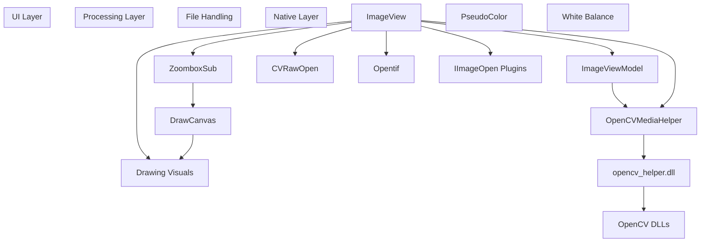
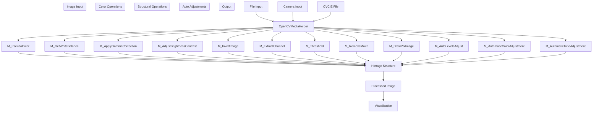
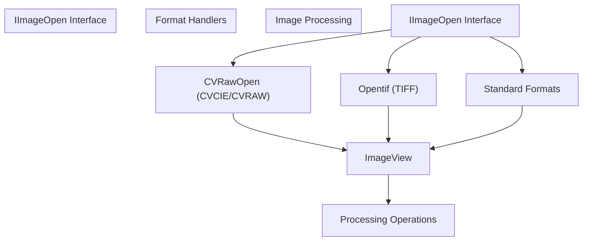
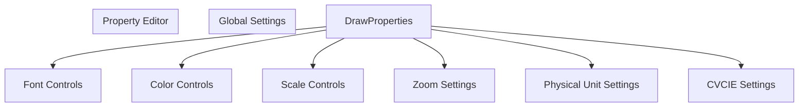
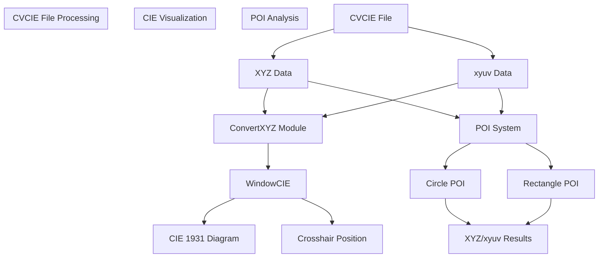
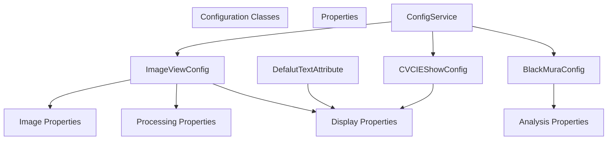

# Image Processing

> **Relevant source files**
> * [Engine/ColorVision.Engine/Media/CVRawOpen.cs](https://github.com/xincheng213618/scgd_general_wpf/blob/987af5f7/Engine/ColorVision.Engine/Media/CVRawOpen.cs)
> * [Engine/ColorVision.Engine/Templates/Jsons/BinocularFusion/ViewHandleBinocularFusion.cs](https://github.com/xincheng213618/scgd_general_wpf/blob/987af5f7/Engine/ColorVision.Engine/Templates/Jsons/BinocularFusion/ViewHandleBinocularFusion.cs)
> * [Engine/ColorVision.Engine/Templates/Jsons/BlackMura/AlgorithmBlackMura.cs](https://github.com/xincheng213618/scgd_general_wpf/blob/987af5f7/Engine/ColorVision.Engine/Templates/Jsons/BlackMura/AlgorithmBlackMura.cs)
> * [Engine/ColorVision.Engine/Templates/Jsons/BlackMura/BlackMuraDao.cs](https://github.com/xincheng213618/scgd_general_wpf/blob/987af5f7/Engine/ColorVision.Engine/Templates/Jsons/BlackMura/BlackMuraDao.cs)
> * [Engine/ColorVision.Engine/Templates/Jsons/BlackMura/DisplayBlackMura.xaml](https://github.com/xincheng213618/scgd_general_wpf/blob/987af5f7/Engine/ColorVision.Engine/Templates/Jsons/BlackMura/DisplayBlackMura.xaml)
> * [Engine/ColorVision.Engine/Templates/Jsons/BlackMura/DisplayBlackMura.xaml.cs](https://github.com/xincheng213618/scgd_general_wpf/blob/987af5f7/Engine/ColorVision.Engine/Templates/Jsons/BlackMura/DisplayBlackMura.xaml.cs)
> * [Engine/ColorVision.Engine/Templates/Jsons/BlackMura/LvData.cs](https://github.com/xincheng213618/scgd_general_wpf/blob/987af5f7/Engine/ColorVision.Engine/Templates/Jsons/BlackMura/LvData.cs)
> * [Engine/ColorVision.Engine/Templates/Jsons/BlackMura/ViewHandleBlackMura.cs](https://github.com/xincheng213618/scgd_general_wpf/blob/987af5f7/Engine/ColorVision.Engine/Templates/Jsons/BlackMura/ViewHandleBlackMura.cs)
> * [Engine/ColorVision.Engine/Templates/Jsons/DataConvert/DisplayBinocularFusion.xaml](https://github.com/xincheng213618/scgd_general_wpf/blob/987af5f7/Engine/ColorVision.Engine/Templates/Jsons/DataConvert/DisplayBinocularFusion.xaml)
> * [Engine/ColorVision.Engine/Templates/POI/Image/PoiImageViewComponent.cs](https://github.com/xincheng213618/scgd_general_wpf/blob/987af5f7/Engine/ColorVision.Engine/Templates/POI/Image/PoiImageViewComponent.cs)
> * [Engine/ColorVision.Engine/Templates/POI/Image/WindowCVCIE.xaml](https://github.com/xincheng213618/scgd_general_wpf/blob/987af5f7/Engine/ColorVision.Engine/Templates/POI/Image/WindowCVCIE.xaml)
> * [Engine/ColorVision.Engine/Templates/POI/Image/WindowCVCIE.xaml.cs](https://github.com/xincheng213618/scgd_general_wpf/blob/987af5f7/Engine/ColorVision.Engine/Templates/POI/Image/WindowCVCIE.xaml.cs)
> * [UI/ColorVision.Core/OpenCVMediaHelper.cs](https://github.com/xincheng213618/scgd_general_wpf/blob/987af5f7/UI/ColorVision.Core/OpenCVMediaHelper.cs)
> * [UI/ColorVision.ImageEditor/Draw/Ruler/ToolBarScaleRuler.cs](https://github.com/xincheng213618/scgd_general_wpf/blob/987af5f7/UI/ColorVision.ImageEditor/Draw/Ruler/ToolBarScaleRuler.cs)
> * [UI/ColorVision.ImageEditor/DrawProperties.xaml](https://github.com/xincheng213618/scgd_general_wpf/blob/987af5f7/UI/ColorVision.ImageEditor/DrawProperties.xaml)
> * [UI/ColorVision.ImageEditor/DrawProperties.xaml.cs](https://github.com/xincheng213618/scgd_general_wpf/blob/987af5f7/UI/ColorVision.ImageEditor/DrawProperties.xaml.cs)
> * [UI/ColorVision.ImageEditor/ImageView.xaml](https://github.com/xincheng213618/scgd_general_wpf/blob/987af5f7/UI/ColorVision.ImageEditor/ImageView.xaml)
> * [UI/ColorVision.ImageEditor/ImageView.xaml.cs](https://github.com/xincheng213618/scgd_general_wpf/blob/987af5f7/UI/ColorVision.ImageEditor/ImageView.xaml.cs)
> * [UI/ColorVision.ImageEditor/ImageViewConfig.cs](https://github.com/xincheng213618/scgd_general_wpf/blob/987af5f7/UI/ColorVision.ImageEditor/ImageViewConfig.cs)
> * [UI/ColorVision.ImageEditor/Tif/Opentif.cs](https://github.com/xincheng213618/scgd_general_wpf/blob/987af5f7/UI/ColorVision.ImageEditor/Tif/Opentif.cs)
> * [UI/ColorVision.ImageEditor/WindowCIE.xaml](https://github.com/xincheng213618/scgd_general_wpf/blob/987af5f7/UI/ColorVision.ImageEditor/WindowCIE.xaml)
> * [UI/ColorVision.ImageEditor/WindowCIE.xaml.cs](https://github.com/xincheng213618/scgd_general_wpf/blob/987af5f7/UI/ColorVision.ImageEditor/WindowCIE.xaml.cs)
> * [include/algorithm.h](https://github.com/xincheng213618/scgd_general_wpf/blob/987af5f7/include/algorithm.h)
> * [include/opencv_media_export.h](https://github.com/xincheng213618/scgd_general_wpf/blob/987af5f7/include/opencv_media_export.h)

This page details the image processing capabilities of the ColorVision system, including its architecture, supported operations, and integration with OpenCV. The system provides functionality for viewing, analyzing, and manipulating images with various specialized algorithms.

For information about specific analysis algorithms, see [Points of Interest (POI) System](/xincheng213618/scgd_general_wpf/5.1-points-of-interest-(poi)-system) and [Analysis Algorithms](/xincheng213618/scgd_general_wpf/5.2-analysis-algorithms).

## Core Architecture

The image processing system in ColorVision is built around a central `ImageView` component that provides the UI for image display and interaction, while leveraging OpenCV for the underlying image processing operations.

### Image Processing Architecture Diagram



Sources: [UI/ColorVision.ImageEditor/ImageView.xaml.cs

46-120](https://github.com/xincheng213618/scgd_general_wpf/blob/987af5f7/UI/ColorVision.ImageEditor/ImageView.xaml.cs#L46-L120)

 [UI/ColorVision.Core/OpenCVMediaHelper.cs

15-158](https://github.com/xincheng213618/scgd_general_wpf/blob/987af5f7/UI/ColorVision.Core/OpenCVMediaHelper.cs#L15-L158)

 [Engine/ColorVision.Engine/Media/CVRawOpen.cs

52-56](https://github.com/xincheng213618/scgd_general_wpf/blob/987af5f7/Engine/ColorVision.Engine/Media/CVRawOpen.cs#L52-L56)

The image processing architecture consists of several layers:

1. **UI Layer**: Contains components for image display (`ImageView`), zooming (`ZoomboxSub`), and drawing annotations (`DrawCanvas`).
2. **Processing Layer**: Handles image processing operations through `OpenCVMediaHelper` and manages the image display state via `ImageViewModel`.
3. **File Handling**: Includes components for opening different image formats, especially the custom CVCIE format via `CVRawOpen`.
4. **Native Layer**: Contains OpenCV bindings through the native `opencv_helper.dll` library.

### Image View Component

The `ImageView` class serves as the primary interface for displaying and interacting with images. It's a WPF UserControl that provides capabilities for:

* Loading and displaying images from various sources
* Zooming and panning navigation
* Drawing and manipulating shapes (circles, rectangles, polygons)
* Selection tools for image regions
* Layer management for multi-channel images
* Image enhancement controls (brightness, contrast, white balance, etc.)

Sources: [UI/ColorVision.ImageEditor/ImageView.xaml

1-355](https://github.com/xincheng213618/scgd_general_wpf/blob/987af5f7/UI/ColorVision.ImageEditor/ImageView.xaml#L1-L355)

 [UI/ColorVision.ImageEditor/ImageView.xaml.cs

31-45](https://github.com/xincheng213618/scgd_general_wpf/blob/987af5f7/UI/ColorVision.ImageEditor/ImageView.xaml.cs#L31-L45)

## Image Processing Operations

The system provides a wide range of image processing operations through the `OpenCVMediaHelper` class, which serves as a wrapper around OpenCV functionality.

### Image Processing Operations Diagram



Sources: [UI/ColorVision.Core/OpenCVMediaHelper.cs

33-156](https://github.com/xincheng213618/scgd_general_wpf/blob/987af5f7/UI/ColorVision.Core/OpenCVMediaHelper.cs#L33-L156)

 [include/opencv_media_export.h L35-L73](https://github.com/xincheng213618/scgd_general_wpf/blob/987af5f7/include/opencv_media_export.h#L35-L73)

 [include/algorithm.h L11-L97](https://github.com/xincheng213618/scgd_general_wpf/blob/987af5f7/include/algorithm.h#L11-L97)

The system supports the following key operations:

1. **Color Operations**:

* Pseudo-coloring with adjustable min/max values
* White balance adjustment
* Gamma correction
* Brightness and contrast adjustment
* Image inversion
2. **Structural Operations**:

* Channel extraction
* Thresholding
* Moiré pattern removal
* Drawing POI (Points of Interest) markers
3. **Auto Adjustments**:

* Automatic levels adjustment
* Automatic color adjustment
* Automatic tone adjustment

All these operations utilize the `HImage` structure as an intermediary format between OpenCV's native formats and WPF's imaging system.

### OpenCV Integration

The system integrates with OpenCV through a native DLL (`opencv_helper.dll`), exposing functions via P/Invoke in the `OpenCVMediaHelper` class.

```
OpenCVMediaHelper (C# wrapper)
    ↓
opencv_helper.dll (Native DLL)
    ↓
OpenCV libraries
```

The key integration points include:

* Function exports defined in `opencv_media_export.h`
* Algorithm implementations referenced in `algorithm.h`
* Conversion between WPF images and OpenCV formats

Sources: [UI/ColorVision.Core/OpenCVMediaHelper.cs

17-156](https://github.com/xincheng213618/scgd_general_wpf/blob/987af5f7/UI/ColorVision.Core/OpenCVMediaHelper.cs#L17-L156)

 [include/opencv_media_export.h L9-L73](https://github.com/xincheng213618/scgd_general_wpf/blob/987af5f7/include/opencv_media_export.h#L9-L73)

## File Format Support

The image processing system supports various file formats through the `IImageOpen` interface, with specialized handlers for different formats.

### File Format Handling Diagram



Sources: [Engine/ColorVision.Engine/Media/CVRawOpen.cs

52-354](https://github.com/xincheng213618/scgd_general_wpf/blob/987af5f7/Engine/ColorVision.Engine/Media/CVRawOpen.cs#L52-L354)

 [UI/ColorVision.ImageEditor/Tif/Opentif.cs

14-190](https://github.com/xincheng213618/scgd_general_wpf/blob/987af5f7/UI/ColorVision.ImageEditor/Tif/Opentif.cs#L14-L190)

The system has specialized support for:

1. **CVCIE/CVRAW Format**: Custom formats handled by `CVRawOpen` that support colorimetric data (XYZ, xyuv) and specialized analysis.
2. **TIFF Format**: Handled by `Opentif`, including support for 32-bit floating point images.
3. **Standard Formats**: Support for common formats like JPEG, PNG through the standard WPF imaging system.

The `CVRawOpen` handler is particularly important as it provides access to colorimetric data in CVCIE files, including:

* Color space information (XYZ, xyuv)
* Multiple channels with different visualization options
* Support for specialized analysis like the POI system

Sources: [Engine/ColorVision.Engine/Media/CVRawOpen.cs

83-303](https://github.com/xincheng213618/scgd_general_wpf/blob/987af5f7/Engine/ColorVision.Engine/Media/CVRawOpen.cs#L83-L303)

## UI Components and Controls

The image processing UI provides rich controls for viewing and manipulating images, with a focus on specialized analytical capabilities.

### Image Editor UI Architecture

```mermaid
flowchart TD

subgraph Image_Adjustments ["Image Adjustments"]
end

subgraph Drawing_Tools ["Drawing Tools"]
end

subgraph Tool_Controls ["Tool Controls"]
end

subgraph Main_Components ["Main Components"]
end

ImageView["ImageView"]
ImageViewModel["ImageViewModel"]
DrawCanvas["DrawCanvas"]
ZoomboxSub["ZoomboxSub"]
ToolBarTop["ToolBar (Top)"]
ToolBarLeft["ToolBar (Left)"]
ToolBarRight["ToolBar (Right)"]
ToolBarBottom["ToolBar (Bottom)"]
LayersControl["Layers Control"]
CircleTool["Circle Tool"]
RectangleTool["Rectangle Tool"]
PolygonTool["Polygon Tool"]
SelectionTool["Selection Tool"]
MeasureTool["Measure Tool"]
PseudoColorControl["Pseudo-Color Control"]
WhiteBalanceControl["White Balance Control"]
GammaControl["Gamma Control"]
BrightnessContrastControl["Brightness/Contrast Control"]

    ImageView --> ImageViewModel
    ImageView --> DrawCanvas
    ImageView --> ZoomboxSub
    ImageView --> ToolBarTop
    ImageView --> ToolBarLeft
    ImageView --> ToolBarRight
    ImageView --> ToolBarBottom
    ImageView --> LayersControl
    ToolBarBottom --> CircleTool
    ToolBarBottom --> RectangleTool
    ToolBarBottom --> PolygonTool
    ToolBarBottom --> SelectionTool
    ToolBarBottom --> MeasureTool
    ToolBarLeft --> PseudoColorControl
    ToolBarLeft --> WhiteBalanceControl
    ToolBarLeft --> GammaControl
    ToolBarLeft --> BrightnessContrastControl
```



Sources: [UI/ColorVision.ImageEditor/ImageView.xaml

57-353](https://github.com/xincheng213618/scgd_general_wpf/blob/987af5f7/UI/ColorVision.ImageEditor/ImageView.xaml#L57-L353)

 [UI/ColorVision.ImageEditor/ImageView.xaml.cs

94-198](https://github.com/xincheng213618/scgd_general_wpf/blob/987af5f7/UI/ColorVision.ImageEditor/ImageView.xaml.cs#L94-L198)

### Key UI Features

1. **Navigation Controls**:

* Zoom in/out and zoom to fit
* Pan and scroll
* Scale ruler for measurement
2. **Drawing Tools**:

* Circle, rectangle, and polygon annotation
* Selection tools
* Measurement tools
3. **Image Enhancement**:

* Pseudo-color visualization with adjustable range
* White balance controls
* Gamma, brightness, and contrast adjustment
* Thresholding
4. **Layer Management**:

* Channel selection (RGB, XYZ, etc.)
* Composite view options

Sources: [UI/ColorVision.ImageEditor/ImageView.xaml

82-245](https://github.com/xincheng213618/scgd_general_wpf/blob/987af5f7/UI/ColorVision.ImageEditor/ImageView.xaml#L82-L245)

 [UI/ColorVision.ImageEditor/ImageView.xaml.cs

693-941](https://github.com/xincheng213618/scgd_general_wpf/blob/987af5f7/UI/ColorVision.ImageEditor/ImageView.xaml.cs#L693-L941)

### Property Editor

The system includes a property editor for configuring drawing attributes and other settings:



Sources: [UI/ColorVision.ImageEditor/DrawProperties.xaml

1-128](https://github.com/xincheng213618/scgd_general_wpf/blob/987af5f7/UI/ColorVision.ImageEditor/DrawProperties.xaml#L1-L128)

 [UI/ColorVision.ImageEditor/DrawProperties.xaml.cs

18-102](https://github.com/xincheng213618/scgd_general_wpf/blob/987af5f7/UI/ColorVision.ImageEditor/DrawProperties.xaml.cs#L18-L102)

## Specialized Visualization and Analysis

The image processing system offers specialized visualization and analysis capabilities, particularly for colorimetric data in CVCIE files.

### CIE Color Space Visualization



Sources: [UI/ColorVision.ImageEditor/WindowCIE.xaml

1-52](https://github.com/xincheng213618/scgd_general_wpf/blob/987af5f7/UI/ColorVision.ImageEditor/WindowCIE.xaml#L1-L52)

 [UI/ColorVision.ImageEditor/WindowCIE.xaml.cs

12-159](https://github.com/xincheng213618/scgd_general_wpf/blob/987af5f7/UI/ColorVision.ImageEditor/WindowCIE.xaml.cs#L12-L159)

 [Engine/ColorVision.Engine/Templates/POI/Image/PoiImageViewComponent.cs

22-349](https://github.com/xincheng213618/scgd_general_wpf/blob/987af5f7/Engine/ColorVision.Engine/Templates/POI/Image/PoiImageViewComponent.cs#L22-L349)

### Key Analytical Features

1. **CIE Colorimetric Visualization**:

* CIE 1931 xy chromaticity diagram visualization
* Interactive color selection and analysis
* Color temperature and wavelength estimation
2. **POI (Points of Interest) Analysis**:

* Definition of regions of interest (circles, rectangles)
* Extraction of colorimetric data (XYZ, xyuv) from these regions
* Statistical analysis of color data
3. **Black Mura Analysis**:

* Detection and analysis of luminance non-uniformity
* Visualization of minimum and maximum luminance points
* Uniformity calculations and analysis

Sources: [Engine/ColorVision.Engine/Templates/POI/Image/PoiImageViewComponent.cs

42-306](https://github.com/xincheng213618/scgd_general_wpf/blob/987af5f7/Engine/ColorVision.Engine/Templates/POI/Image/PoiImageViewComponent.cs#L42-L306)

 [Engine/ColorVision.Engine/Templates/Jsons/BlackMura/ViewHandleBlackMura.cs

67-323](https://github.com/xincheng213618/scgd_general_wpf/blob/987af5f7/Engine/ColorVision.Engine/Templates/Jsons/BlackMura/ViewHandleBlackMura.cs#L67-L323)

## Configuration System

The image processing system utilizes a configuration framework to manage settings and parameters.

### Image Configuration System



Sources: [UI/ColorVision.ImageEditor/ImageViewConfig.cs

11-105](https://github.com/xincheng213618/scgd_general_wpf/blob/987af5f7/UI/ColorVision.ImageEditor/ImageViewConfig.cs#L11-L105)

 [Engine/ColorVision.Engine/Templates/Jsons/BlackMura/ViewHandleBlackMura.cs

25-52](https://github.com/xincheng213618/scgd_general_wpf/blob/987af5f7/Engine/ColorVision.Engine/Templates/Jsons/BlackMura/ViewHandleBlackMura.cs#L25-L52)

 [Engine/ColorVision.Engine/Templates/POI/Image/WindowCVCIE.xaml.cs

15-31](https://github.com/xincheng213618/scgd_general_wpf/blob/987af5f7/Engine/ColorVision.Engine/Templates/POI/Image/WindowCVCIE.xaml.cs#L15-L31)

Key configuration components include:

1. **ImageViewConfig**: Core configuration for the image viewer, including:

* Zoom settings
* File paths
* Channel information
* Colormap types
* White balance settings
2. **Algorithm-Specific Configs**:

* `BlackMuraConfig`: Configuration for Black Mura analysis
* `CVCIEShowConfig`: Settings for CIE color data display

The configuration system provides:

* Property change notification via `INotifyPropertyChanged`
* Serialization/deserialization for persistence
* Dynamic property storage through dictionaries

Sources: [UI/ColorVision.ImageEditor/ImageViewConfig.cs

11-105](https://github.com/xincheng213618/scgd_general_wpf/blob/987af5f7/UI/ColorVision.ImageEditor/ImageViewConfig.cs#L11-L105)

## Summary

The image processing system in ColorVision provides a comprehensive set of capabilities for viewing, analyzing, and manipulating images, with a particular focus on colorimetric analysis through the custom CVCIE format. The system integrates with OpenCV for powerful image processing operations while providing a rich user interface for interaction and visualization.

Key strengths of the system include:

1. Integration with OpenCV for advanced image processing
2. Specialized support for colorimetric data analysis
3. Rich annotation and measurement tools
4. Flexible configuration system
5. Support for custom file formats with specialized metadata

These capabilities make it particularly suitable for specialized imaging applications like display quality testing, colorimetric analysis, and visual inspection systems.