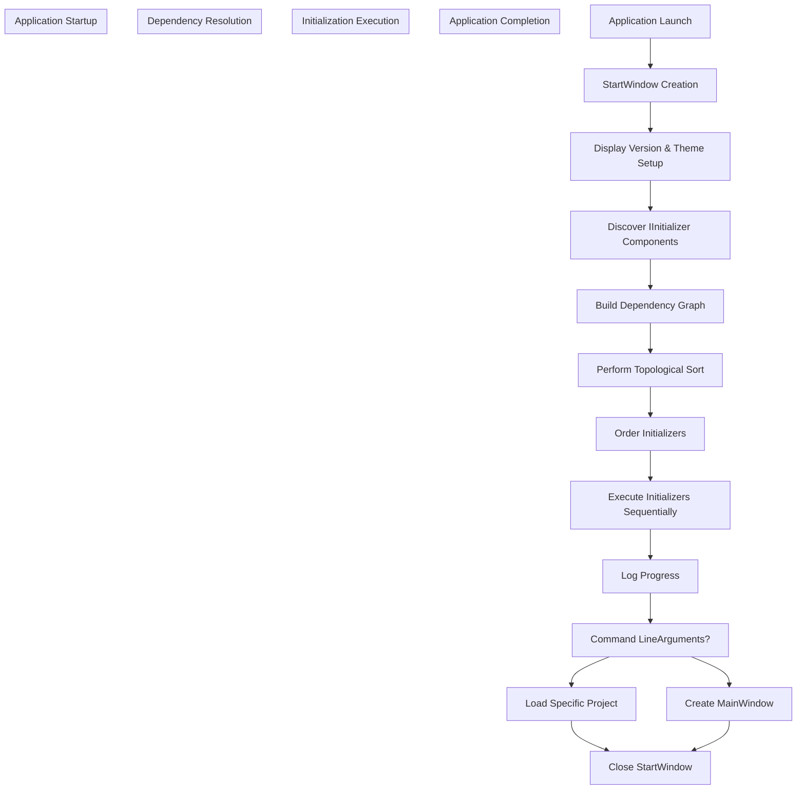
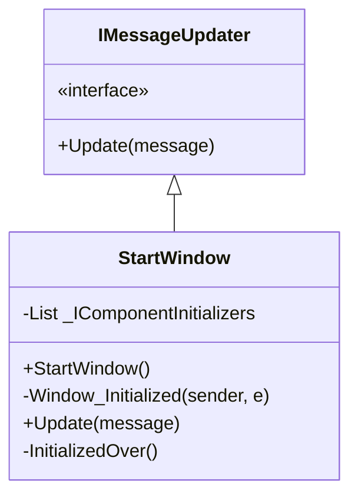
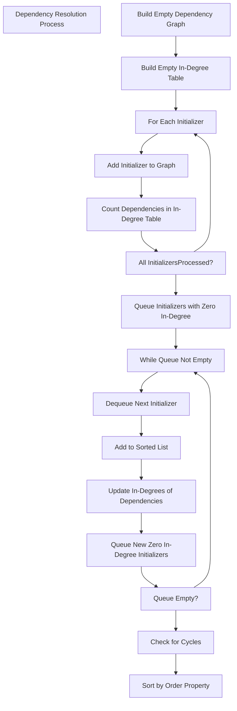
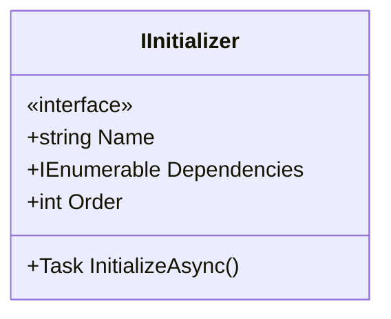
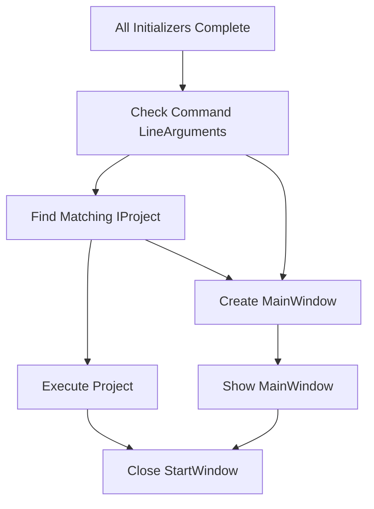

# Initialization Process

> **Relevant source files**
> * [ColorVision/StartWindow.xaml.cs](https://github.com/xincheng213618/scgd_general_wpf/blob/987af5f7/ColorVision/StartWindow.xaml.cs)

## Purpose and Scope

This document details the initialization sequence of the ColorVision application, explaining how the application bootstraps itself, loads required components, resolves dependencies, and transitions from the startup window to the main application window. It covers the process from application launch through component initialization to the creation of the main user interface.

For information about the plugin system that extends application functionality after initialization, see [Plugin Architecture](/xincheng213618/scgd_general_wpf/7-plugin-architecture). For details on the configuration system used during initialization, see [Configuration System](/xincheng213618/scgd_general_wpf/2.3-configuration-system).

## Overview of the Initialization Process

The ColorVision application employs a sophisticated initialization process that ensures all components are loaded and initialized in the correct order, respecting their dependencies. This process is managed by the `StartWindow` class, which serves as both a visual loading screen and the orchestrator of initialization.

Sources: [ColorVision/StartWindow.xaml.cs

27-220](https://github.com/xincheng213618/scgd_general_wpf/blob/987af5f7/ColorVision/StartWindow.xaml.cs#L27-L220)

## The StartWindow Component

The `StartWindow` class serves dual purposes:

1. Provides a visual indication that the application is loading
2. Manages the discovery and initialization of all application components

The window displays version information, including whether it's a debug or release build, the .NET Core version, and the build date. It also implements the `IMessageUpdater` interface to provide status updates during initialization.

Sources: [ColorVision/StartWindow.xaml.cs

24-32](https://github.com/xincheng213618/scgd_general_wpf/blob/987af5f7/ColorVision/StartWindow.xaml.cs#L24-L32)

 [ColorVision/StartWindow.xaml.cs

134-141](https://github.com/xincheng213618/scgd_general_wpf/blob/987af5f7/ColorVision/StartWindow.xaml.cs#L134-L141)

## Component Discovery Process

The initialization process begins by discovering all components that implement the `IInitializer` interface across all loaded assemblies. This is done using reflection through the `AssemblyHandler` class.

### Initializer Discovery and Filtering

1. The application retrieves all loaded assemblies via `AssemblyHandler.GetInstance().GetAssemblies()`
2. It searches each assembly for types implementing `IInitializer` that are not abstract
3. It instantiates each discovered type, passing the `StartWindow` as a parameter
4. The application supports selective initialization by allowing components to be skipped via command-line arguments

Sources: [ColorVision/StartWindow.xaml.cs

50-61](https://github.com/xincheng213618/scgd_general_wpf/blob/987af5f7/ColorVision/StartWindow.xaml.cs#L50-L61)

 [ColorVision/StartWindow.xaml.cs

62-81](https://github.com/xincheng213618/scgd_general_wpf/blob/987af5f7/ColorVision/StartWindow.xaml.cs#L62-L81)

## Dependency Resolution

One of the most critical aspects of the initialization process is ensuring that components are initialized in the correct order, respecting their dependencies.

### Dependency Graph Construction

The application builds a dependency graph and performs topological sorting to determine the correct initialization order:

1. A dependency graph is constructed as a dictionary mapping each initializer name to a list of its dependencies
2. An in-degree table tracks how many dependencies each initializer has
3. A queue-based topological sort algorithm determines the initialization order
4. The application detects and handles circular dependencies

Sources: [ColorVision/StartWindow.xaml.cs

84-127](https://github.com/xincheng213618/scgd_general_wpf/blob/987af5f7/ColorVision/StartWindow.xaml.cs#L84-L127)

## Initializer Execution

After resolving dependencies and determining the correct order, the application executes initializers sequentially:

1. Each initializer's `InitializeAsync` method is called in the determined order
2. Progress and timing information are displayed in the StartWindow
3. Initialization errors are logged
4. After all initializers complete successfully, the application proceeds to the next stage

Sources: [ColorVision/StartWindow.xaml.cs

161-179](https://github.com/xincheng213618/scgd_general_wpf/blob/987af5f7/ColorVision/StartWindow.xaml.cs#L161-L179)

## The IInitializer Interface

The `IInitializer` interface serves as the contract for components that need to be initialized during application startup. It defines:

Key properties include:

* **Name**: A unique identifier for the initializer
* **Dependencies**: A list of other initializer names that must be initialized before this one
* **Order**: A numeric value used for secondary sorting when dependencies are equal
* **InitializeAsync**: The method called to perform initialization

Sources: [ColorVision/StartWindow.xaml.cs

65-66](https://github.com/xincheng213618/scgd_general_wpf/blob/987af5f7/ColorVision/StartWindow.xaml.cs#L65-L66)

 [ColorVision/StartWindow.xaml.cs

171](https://github.com/xincheng213618/scgd_general_wpf/blob/987af5f7/ColorVision/StartWindow.xaml.cs#L171-L171)

## Initialization Completion

After all initializers have completed, the application proceeds to create either:

1. A specific project instance if specified via command-line arguments, or
2. The main application window

Sources: [ColorVision/StartWindow.xaml.cs

180-219](https://github.com/xincheng213618/scgd_general_wpf/blob/987af5f7/ColorVision/StartWindow.xaml.cs#L180-L219)

## Command-Line Arguments

The initialization process supports command-line arguments that can alter its behavior:

| Argument | Description |
| --- | --- |
| `skip` | Comma-separated list of initializer names to skip |
| `project` | Specifies a project to load instead of opening the main window |

The arguments are parsed using an `ArgumentParser` singleton instance.

Sources: [ColorVision/StartWindow.xaml.cs

51-61](https://github.com/xincheng213618/scgd_general_wpf/blob/987af5f7/ColorVision/StartWindow.xaml.cs#L51-L61)

 [ColorVision/StartWindow.xaml.cs

184-206](https://github.com/xincheng213618/scgd_general_wpf/blob/987af5f7/ColorVision/StartWindow.xaml.cs#L184-L206)

## Error Handling

The initialization process includes several error handling mechanisms:

1. Errors during initializer discovery are logged, and problematic assemblies are added to a removal list
2. Circular dependencies in initializers are detected and will throw an exception
3. Errors during the creation of the MainWindow are caught and displayed to the user

Sources: [ColorVision/StartWindow.xaml.cs

76-80](https://github.com/xincheng213618/scgd_general_wpf/blob/987af5f7/ColorVision/StartWindow.xaml.cs#L76-L80)

 [ColorVision/StartWindow.xaml.cs

120-123](https://github.com/xincheng213618/scgd_general_wpf/blob/987af5f7/ColorVision/StartWindow.xaml.cs#L120-L123)

 [ColorVision/StartWindow.xaml.cs

214-217](https://github.com/xincheng213618/scgd_general_wpf/blob/987af5f7/ColorVision/StartWindow.xaml.cs#L214-L217)

## Summary

The initialization process of ColorVision is designed to be robust, flexible, and maintainable. It provides:

1. Orderly discovery and initialization of components
2. Automatic resolution of dependencies
3. Visual feedback during startup
4. Command-line configurability
5. Error detection and handling

This architecture allows the application to be extended with new components that can declare their dependencies on other components, ensuring proper initialization sequence regardless of the order in which they are discovered.