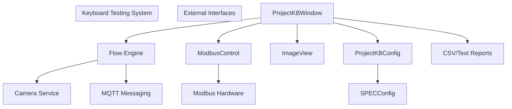
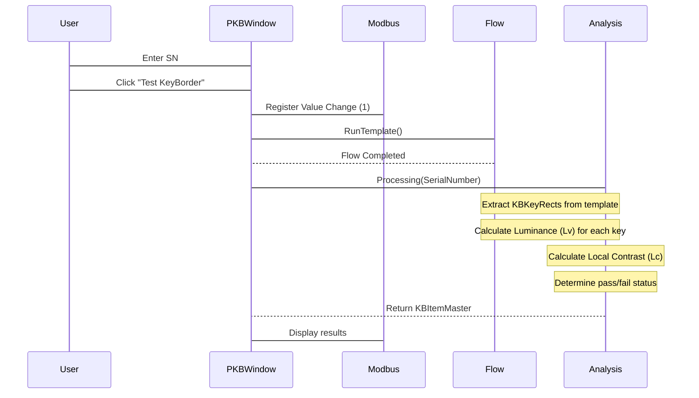
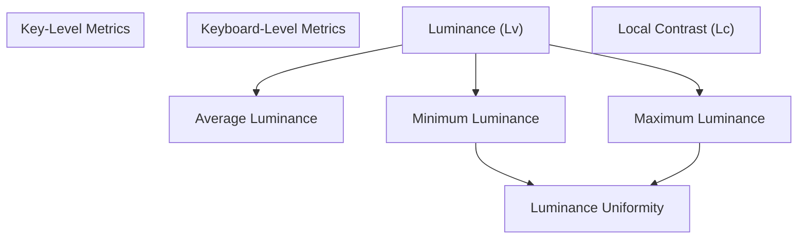
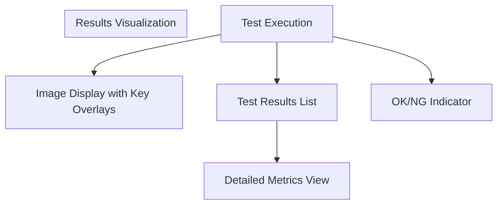

# Keyboard Testing

> **Relevant source files**
> * [Projects/ProjectKB/App.xaml.cs](https://github.com/xincheng213618/scgd_general_wpf/blob/987af5f7/Projects/ProjectKB/App.xaml.cs)
> * [Projects/ProjectKB/CHANGELOG.md](https://github.com/xincheng213618/scgd_general_wpf/blob/987af5f7/Projects/ProjectKB/CHANGELOG.md)
> * [Projects/ProjectKB/Config/EditProjectKBConfig.xaml](https://github.com/xincheng213618/scgd_general_wpf/blob/987af5f7/Projects/ProjectKB/Config/EditProjectKBConfig.xaml)
> * [Projects/ProjectKB/Config/EditProjectKBConfig.xaml.cs](https://github.com/xincheng213618/scgd_general_wpf/blob/987af5f7/Projects/ProjectKB/Config/EditProjectKBConfig.xaml.cs)
> * [Projects/ProjectKB/Config/SPECConfig.cs](https://github.com/xincheng213618/scgd_general_wpf/blob/987af5f7/Projects/ProjectKB/Config/SPECConfig.cs)
> * [Projects/ProjectKB/Config/SummaryInfo.cs](https://github.com/xincheng213618/scgd_general_wpf/blob/987af5f7/Projects/ProjectKB/Config/SummaryInfo.cs)
> * [Projects/ProjectKB/ConnectConverter.cs](https://github.com/xincheng213618/scgd_general_wpf/blob/987af5f7/Projects/ProjectKB/ConnectConverter.cs)
> * [Projects/ProjectKB/KBItem.cs](https://github.com/xincheng213618/scgd_general_wpf/blob/987af5f7/Projects/ProjectKB/KBItem.cs)
> * [Projects/ProjectKB/KBItemMaster.cs](https://github.com/xincheng213618/scgd_general_wpf/blob/987af5f7/Projects/ProjectKB/KBItemMaster.cs)
> * [Projects/ProjectKB/Modbus/ModbusConfig.cs](https://github.com/xincheng213618/scgd_general_wpf/blob/987af5f7/Projects/ProjectKB/Modbus/ModbusConfig.cs)
> * [Projects/ProjectKB/Modbus/ModbusConnect.xaml](https://github.com/xincheng213618/scgd_general_wpf/blob/987af5f7/Projects/ProjectKB/Modbus/ModbusConnect.xaml)
> * [Projects/ProjectKB/Modbus/ModbusConnect.xaml.cs](https://github.com/xincheng213618/scgd_general_wpf/blob/987af5f7/Projects/ProjectKB/Modbus/ModbusConnect.xaml.cs)
> * [Projects/ProjectKB/Modbus/ModbusControl.cs](https://github.com/xincheng213618/scgd_general_wpf/blob/987af5f7/Projects/ProjectKB/Modbus/ModbusControl.cs)
> * [Projects/ProjectKB/Modbus/ModbusSetting.cs](https://github.com/xincheng213618/scgd_general_wpf/blob/987af5f7/Projects/ProjectKB/Modbus/ModbusSetting.cs)
> * [Projects/ProjectKB/PluginConfig/KBMenu.cs](https://github.com/xincheng213618/scgd_general_wpf/blob/987af5f7/Projects/ProjectKB/PluginConfig/KBMenu.cs)
> * [Projects/ProjectKB/PluginConfig/KBProjectPlugin.cs](https://github.com/xincheng213618/scgd_general_wpf/blob/987af5f7/Projects/ProjectKB/PluginConfig/KBProjectPlugin.cs)
> * [Projects/ProjectKB/PluginConfig/ProjectWindowInstance.cs](https://github.com/xincheng213618/scgd_general_wpf/blob/987af5f7/Projects/ProjectKB/PluginConfig/ProjectWindowInstance.cs)
> * [Projects/ProjectKB/ProjectKB.csproj](https://github.com/xincheng213618/scgd_general_wpf/blob/987af5f7/Projects/ProjectKB/ProjectKB.csproj)
> * [Projects/ProjectKB/ProjectKBConfig.cs](https://github.com/xincheng213618/scgd_general_wpf/blob/987af5f7/Projects/ProjectKB/ProjectKBConfig.cs)
> * [Projects/ProjectKB/ProjectKBWindow.xaml](https://github.com/xincheng213618/scgd_general_wpf/blob/987af5f7/Projects/ProjectKB/ProjectKBWindow.xaml)
> * [Projects/ProjectKB/ProjectKBWindow.xaml.cs](https://github.com/xincheng213618/scgd_general_wpf/blob/987af5f7/Projects/ProjectKB/ProjectKBWindow.xaml.cs)
> * [Projects/ProjectKB/ProjectKBWindowConfig.cs](https://github.com/xincheng213618/scgd_general_wpf/blob/987af5f7/Projects/ProjectKB/ProjectKBWindowConfig.cs)
> * [Projects/ProjectKB/Properties/Resources.Designer.cs](https://github.com/xincheng213618/scgd_general_wpf/blob/987af5f7/Projects/ProjectKB/Properties/Resources.Designer.cs)
> * [Projects/ProjectKB/README.md](https://github.com/xincheng213618/scgd_general_wpf/blob/987af5f7/Projects/ProjectKB/README.md)
> * [Projects/ProjectKB/TestWindow.xaml](https://github.com/xincheng213618/scgd_general_wpf/blob/987af5f7/Projects/ProjectKB/TestWindow.xaml)
> * [Projects/ProjectKB/TestWindow.xaml.cs](https://github.com/xincheng213618/scgd_general_wpf/blob/987af5f7/Projects/ProjectKB/TestWindow.xaml.cs)

Keyboard Testing is a specialized module within the ColorVision system that provides comprehensive testing and analysis of keyboard backlighting uniformity and quality. The system captures images of illuminated keyboards, analyzes key brightness and contrast, and generates detailed reports with pass/fail verdicts based on configurable specifications.

## Purpose and Scope

This document covers the functionality of the Keyboard Testing system, including:

* System architecture and components
* Testing workflow (both manual and Modbus-triggered automated testing)
* Key metrics and analysis calculations
* Configuration options and specifications
* Results visualization and reporting

For information about the general image processing capabilities used by this module, see [Image Processing](/xincheng213618/scgd_general_wpf/5-image-processing). For information about the Points of Interest (POI) system that handles key recognition, see [Points of Interest (POI) System](/xincheng213618/scgd_general_wpf/5.1-points-of-interest-(poi)-system).

## System Architecture

The Keyboard Testing system combines several components to provide a complete testing solution.

### Architecture Overview



Sources: [Projects/ProjectKB/ProjectKBWindow.xaml.cs](https://github.com/xincheng213618/scgd_general_wpf/blob/987af5f7/Projects/ProjectKB/ProjectKBWindow.xaml.cs)

 [Projects/ProjectKB/ProjectKBConfig.cs](https://github.com/xincheng213618/scgd_general_wpf/blob/987af5f7/Projects/ProjectKB/ProjectKBConfig.cs)

 [Projects/ProjectKB/Modbus/ModbusControl.cs](https://github.com/xincheng213618/scgd_general_wpf/blob/987af5f7/Projects/ProjectKB/Modbus/ModbusControl.cs)

### Component Roles

* **ProjectKBWindow**: Main user interface for keyboard testing
* **FlowEngine**: Process execution engine that handles template-based image processing
* **ModbusControl**: Interfaces with external hardware for automated testing
* **ImageView**: Displays captured keyboard images with analysis overlays
* **ProjectKBConfig**: Manages application settings and test configurations
* **SPECConfig**: Stores pass/fail thresholds for key metrics

## Testing Workflow

The keyboard testing process follows a defined workflow from initialization to results reporting.



Sources: [Projects/ProjectKB/ProjectKBWindow.xaml.cs

219-316](https://github.com/xincheng213618/scgd_general_wpf/blob/987af5f7/Projects/ProjectKB/ProjectKBWindow.xaml.cs#L219-L316)

 [Projects/ProjectKB/ProjectKBWindow.xaml.cs

319-571](https://github.com/xincheng213618/scgd_general_wpf/blob/987af5f7/Projects/ProjectKB/ProjectKBWindow.xaml.cs#L319-L571)

### Manual Testing

The user can initiate testing by entering a serial number (SN) and clicking the "Test KeyBorder" button. This triggers the testing flow, which processes the selected template and analyzes the keyboard image.

### Automated Testing with Modbus

The system can be configured to automatically trigger tests when a signal is received from external hardware via Modbus:

1. The system connects to a Modbus device at the configured IP address and port
2. It monitors a specific register address (configurable in settings)
3. When the register value changes to 1, the testing process is triggered
4. After testing completes, the system sets the register back to 0

This enables integration with automated production lines where keyboards move through test stations.

Sources: [Projects/ProjectKB/Modbus/ModbusControl.cs L64-L111](https://github.com/xincheng213618/scgd_general_wpf/blob/987af5f7/Projects/ProjectKB/Modbus/ModbusControl.cs#L64-L111)

 [Projects/ProjectKB/ProjectKBWindow.xaml.cs

89-99](https://github.com/xincheng213618/scgd_general_wpf/blob/987af5f7/Projects/ProjectKB/ProjectKBWindow.xaml.cs#L89-L99)

## Key Analysis Metrics

The system analyzes several key metrics to determine the quality of keyboard backlighting.

### Metrics Overview



Sources: [Projects/ProjectKB/ProjectKBWindow.xaml.cs

459-467](https://github.com/xincheng213618/scgd_general_wpf/blob/987af5f7/Projects/ProjectKB/ProjectKBWindow.xaml.cs#L459-L467)

 [Projects/ProjectKB/KBItemMaster.cs L125-L175](https://github.com/xincheng213618/scgd_general_wpf/blob/987af5f7/Projects/ProjectKB/KBItemMaster.cs#L125-L175)

### Luminance (Lv) Measurement

For each key defined in the KB template, the system measures the luminance (brightness) value. This is extracted from the image processing flow and scaled by the configured factor.

### Local Contrast (Lc) Calculation

Local contrast is calculated for each key to determine how it appears relative to surrounding keys:

1. For each key, the system identifies nearby keys within a specified radius
2. It calculates the average luminance of these nearby keys
3. Local contrast is calculated as: `Lc = (key_Lv - average_Lv) / average_Lv`

This metric helps identify keys that appear significantly brighter or darker than their neighbors.

Sources: [Projects/ProjectKB/ProjectKBWindow.xaml.cs

598-626](https://github.com/xincheng213618/scgd_general_wpf/blob/987af5f7/Projects/ProjectKB/ProjectKBWindow.xaml.cs#L598-L626)

### Uniformity Calculation

Keyboard uniformity is calculated as: `Uniformity = MinLv / MaxLv`

This gives a value between 0 and 1, where 1 represents perfect uniformity (all keys have the same brightness).

Sources: [Projects/ProjectKB/ProjectKBWindow.xaml.cs

466](https://github.com/xincheng213618/scgd_general_wpf/blob/987af5f7/Projects/ProjectKB/ProjectKBWindow.xaml.cs#L466-L466)

### Pass/Fail Criteria

Each tested keyboard is evaluated against configurable specifications (SPEC):

**Key-Level Criteria:**

* Minimum/Maximum Key Luminance (Lv)
* Minimum/Maximum Local Contrast (Lc)

**Keyboard-Level Criteria:**

* Minimum/Maximum Average Luminance
* Minimum Uniformity (%)

A keyboard passes the test only if all criteria are met.

Sources: [Projects/ProjectKB/ProjectKBWindow.xaml.cs

417-534](https://github.com/xincheng213618/scgd_general_wpf/blob/987af5f7/Projects/ProjectKB/ProjectKBWindow.xaml.cs#L417-L534)

 [Projects/ProjectKB/Config/SPECConfig.cs](https://github.com/xincheng213618/scgd_general_wpf/blob/987af5f7/Projects/ProjectKB/Config/SPECConfig.cs)

## Configuration

The Keyboard Testing system offers several configuration options to customize testing behavior.

### SPEC Configuration

The SPEC configuration defines the pass/fail thresholds for key metrics:

| Parameter | Description |
| --- | --- |
| MinKeyLv | Minimum acceptable luminance for any key |
| MaxKeyLv | Maximum acceptable luminance for any key |
| MinAvgLv | Minimum acceptable average luminance across all keys |
| MaxAvgLv | Maximum acceptable average luminance across all keys |
| MinUniformity | Minimum acceptable uniformity percentage (0-100%) |
| MinKeyLc | Minimum acceptable local contrast (-100% to 100%) |
| MaxKeyLc | Maximum acceptable local contrast (-100% to 100%) |

Sources: [Projects/ProjectKB/Config/SPECConfig.cs](https://github.com/xincheng213618/scgd_general_wpf/blob/987af5f7/Projects/ProjectKB/Config/SPECConfig.cs)

 [Projects/ProjectKB/Config/EditProjectKBConfig.xaml L27-L62](https://github.com/xincheng213618/scgd_general_wpf/blob/987af5f7/Projects/ProjectKB/Config/EditProjectKBConfig.xaml#L27-L62)

### Modbus Settings

Modbus settings allow configuration of the hardware connection for automated testing:

| Parameter | Description |
| --- | --- |
| Host | IP address of the Modbus device |
| Port | Port number for Modbus communication (default: 502) |
| RegisterAddress | Address of the register to monitor (default: 0x00) |
| AutoModbusConnect | Enable/disable automatic connection at startup |

Sources: [Projects/ProjectKB/Modbus/ModbusConfig.cs](https://github.com/xincheng213618/scgd_general_wpf/blob/987af5f7/Projects/ProjectKB/Modbus/ModbusConfig.cs)

 [Projects/ProjectKB/ProjectKBConfig.cs L184-L185](https://github.com/xincheng213618/scgd_general_wpf/blob/987af5f7/Projects/ProjectKB/ProjectKBConfig.cs#L184-L185)

### Results Storage

The system can be configured to save test results to specific locations:

| Parameter | Description |
| --- | --- |
| ResultSavePath | Path for saving CSV result files |
| ResultSavePath1 | Path for saving text result files |
| KBLVSacle | Scaling factor for luminance values |
| ViewImageReadDelay | Delay (ms) for opening image files |

Sources: [Projects/ProjectKB/ProjectKBConfig.cs L172-L192](https://github.com/xincheng213618/scgd_general_wpf/blob/987af5f7/Projects/ProjectKB/ProjectKBConfig.cs#L172-L192)

 [Projects/ProjectKB/Config/EditProjectKBConfig.xaml L78-L90](https://github.com/xincheng213618/scgd_general_wpf/blob/987af5f7/Projects/ProjectKB/Config/EditProjectKBConfig.xaml#L78-L90)

### Summary Information

The system tracks production statistics in the Summary Information panel:

| Parameter | Description |
| --- | --- |
| LineNumber | Production line identifier |
| WorkerNumber | Worker identifier |
| TargetProduction | Target production quantity |
| ActualProduction | Actual production count |
| GoodProductCount | Number of passing keyboards |
| DefectiveProductCount | Number of failing keyboards |

Sources: [Projects/ProjectKB/Config/SummaryInfo.cs](https://github.com/xincheng213618/scgd_general_wpf/blob/987af5f7/Projects/ProjectKB/Config/SummaryInfo.cs)

 [Projects/ProjectKB/ProjectKBWindow.xaml L36-L77](https://github.com/xincheng213618/scgd_general_wpf/blob/987af5f7/Projects/ProjectKB/ProjectKBWindow.xaml#L36-L77)

## Results and Reporting

The system provides multiple ways to view, analyze, and export test results.

### Visual Results Display



Sources: [Projects/ProjectKB/ProjectKBWindow.xaml L77-L78](https://github.com/xincheng213618/scgd_general_wpf/blob/987af5f7/Projects/ProjectKB/ProjectKBWindow.xaml#L77-L78)

 [Projects/ProjectKB/ProjectKBWindow.xaml L111-L189](https://github.com/xincheng213618/scgd_general_wpf/blob/987af5f7/Projects/ProjectKB/ProjectKBWindow.xaml#L111-L189)

 [Projects/ProjectKB/ProjectKBWindow.xaml L220-L226](https://github.com/xincheng213618/scgd_general_wpf/blob/987af5f7/Projects/ProjectKB/ProjectKBWindow.xaml#L220-L226)

After testing, the system displays:

1. **Image Visualization**: Shows the captured keyboard image with overlays indicating:

* Failed keys (red outline)
* Darkest passing key (violet outline)
* Brightest passing key (white outline)
* Other keys (gray outline)
2. **Results List**: A table of test results showing:

* Model & SN
* Overall result (OK/NG)
* Average, Min, and Max luminance
* Uniformity
3. **Detailed View**: A text report showing:

* All metrics for each key
* Overall keyboard metrics
* Pass/fail status

Sources: [Projects/ProjectKB/ProjectKBWindow.xaml.cs

717-797](https://github.com/xincheng213618/scgd_general_wpf/blob/987af5f7/Projects/ProjectKB/ProjectKBWindow.xaml.cs#L717-L797)

 [Projects/ProjectKB/ProjectKBWindow.xaml.cs

628-698](https://github.com/xincheng213618/scgd_general_wpf/blob/987af5f7/Projects/ProjectKB/ProjectKBWindow.xaml.cs#L628-L698)

### CSV Export Format

Test results are saved as CSV files with the following format:

* **Header row**: Contains column names for all metrics
* **Data rows**: One row per test with all measured values
* **Key-specific columns**: One column per key showing its luminance value

The CSV files are appended if the file exists with matching headers, allowing for tracking of multiple tests.

Sources: [Projects/ProjectKB/KBItemMaster.cs L14-L117](https://github.com/xincheng213618/scgd_general_wpf/blob/987af5f7/Projects/ProjectKB/KBItemMaster.cs#L14-L117)

 [Projects/ProjectKB/ProjectKBWindow.xaml.cs

561-564](https://github.com/xincheng213618/scgd_general_wpf/blob/987af5f7/Projects/ProjectKB/ProjectKBWindow.xaml.cs#L561-L564)

### Text Reports

A simple text report with pass/fail status is also generated, containing:

```
{SerialNumber},{Result}, ,
```

This format enables quick integration with production systems that only need basic pass/fail information.

Sources: [Projects/ProjectKB/ProjectKBWindow.xaml.cs

549-553](https://github.com/xincheng213618/scgd_general_wpf/blob/987af5f7/Projects/ProjectKB/ProjectKBWindow.xaml.cs#L549-L553)

## Setup and Configuration

### Initial Setup

1. Configure the test specifications in the settings window
2. Set up results save paths for CSV and text reports
3. Configure Modbus settings if using automated testing
4. Select or create a flow template for image capture and analysis

### Template Selection

The system uses templates to define the testing flow:

1. Each template contains a sequence of operations:
* Camera capture
* Image processing
* KB template application
* Metrics calculation
2. Templates can be selected from the dropdown menu
3. Each template can have specific SPEC configurations

Sources: [Projects/ProjectKB/ProjectKBWindow.xaml.cs

107-165](https://github.com/xincheng213618/scgd_general_wpf/blob/987af5f7/Projects/ProjectKB/ProjectKBWindow.xaml.cs#L107-L165)

 [Projects/ProjectKB/ProjectKBConfig.cs L138-L146](https://github.com/xincheng213618/scgd_general_wpf/blob/987af5f7/Projects/ProjectKB/ProjectKBConfig.cs#L138-L146)

## Troubleshooting

Common issues and their resolutions:

1. **Modbus Connection Failures**:

* Check IP address and port settings
* Verify network connectivity
* Ensure the Modbus device is powered on
2. **Missing Template Data**:

* Ensure KB templates are properly configured
* Check that POI calculations are included in the flow
3. **Image Loading Delays**:

* Adjust the ViewImageReadDelay setting if images are not loading properly
* Default delay is 1000ms (1 second)

Sources: [Projects/ProjectKB/ProjectKBWindow.xaml.cs

411-413](https://github.com/xincheng213618/scgd_general_wpf/blob/987af5f7/Projects/ProjectKB/ProjectKBWindow.xaml.cs#L411-L413)

 [Projects/ProjectKB/ProjectKBWindow.xaml.cs

738-754](https://github.com/xincheng213618/scgd_general_wpf/blob/987af5f7/Projects/ProjectKB/ProjectKBWindow.xaml.cs#L738-L754)

Sources: [Projects/ProjectKB/ProjectKBWindow.xaml.cs](https://github.com/xincheng213618/scgd_general_wpf/blob/987af5f7/Projects/ProjectKB/ProjectKBWindow.xaml.cs)

 [Projects/ProjectKB/ProjectKBConfig.cs](https://github.com/xincheng213618/scgd_general_wpf/blob/987af5f7/Projects/ProjectKB/ProjectKBConfig.cs)

 [Projects/ProjectKB/Modbus/ModbusControl.cs](https://github.com/xincheng213618/scgd_general_wpf/blob/987af5f7/Projects/ProjectKB/Modbus/ModbusControl.cs)

 [Projects/ProjectKB/Config/SPECConfig.cs](https://github.com/xincheng213618/scgd_general_wpf/blob/987af5f7/Projects/ProjectKB/Config/SPECConfig.cs)

 [Projects/ProjectKB/KBItemMaster.cs](https://github.com/xincheng213618/scgd_general_wpf/blob/987af5f7/Projects/ProjectKB/KBItemMaster.cs)