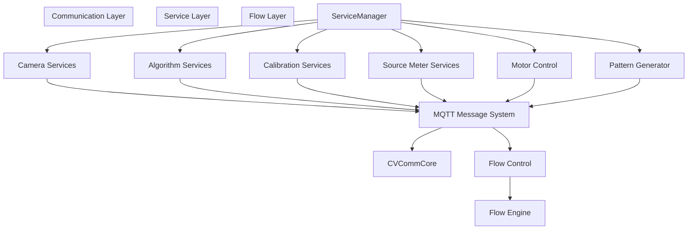
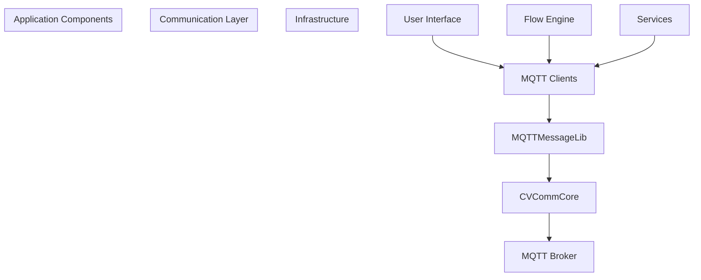
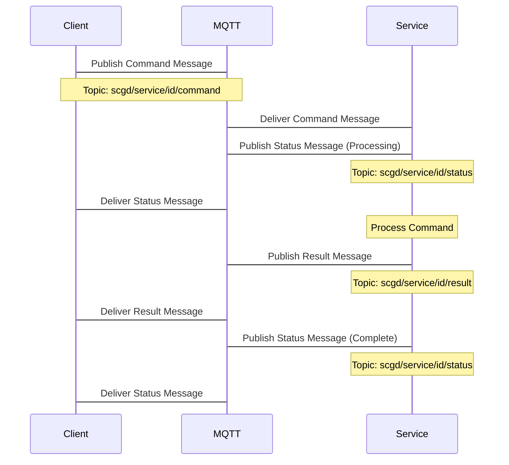
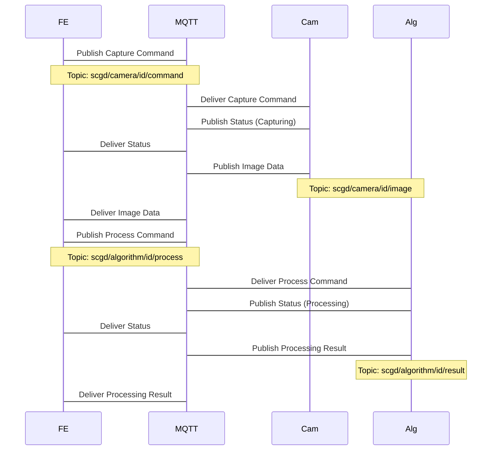
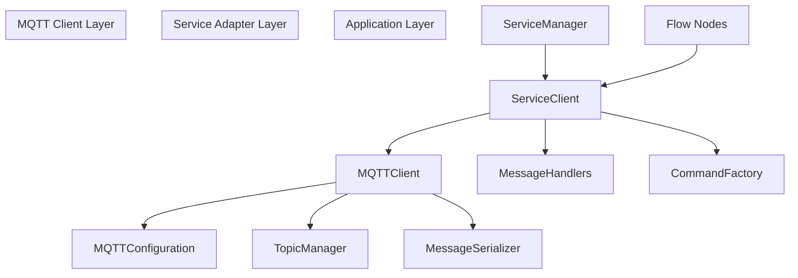
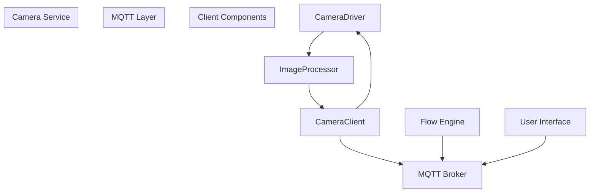
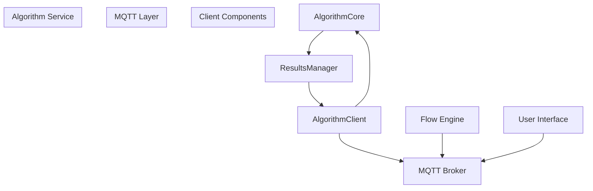
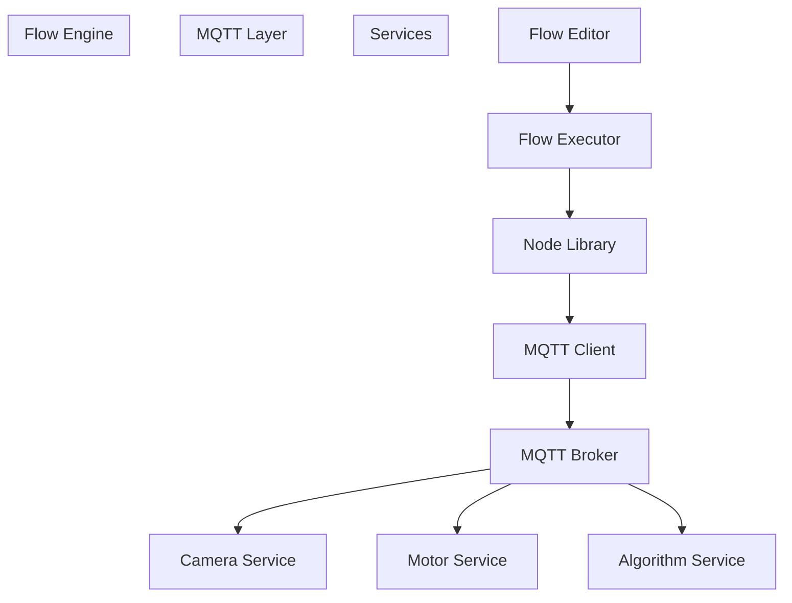

# MQTT Communication

> **Relevant source files**
> * [DLL/CVCommCore.dll](https://github.com/xincheng213618/scgd_general_wpf/blob/987af5f7/DLL/CVCommCore.dll)
> * [DLL/FlowEngineLib.dll](https://github.com/xincheng213618/scgd_general_wpf/blob/987af5f7/DLL/FlowEngineLib.dll)
> * [DLL/MQTTMessageLib.dll](https://github.com/xincheng213618/scgd_general_wpf/blob/987af5f7/DLL/MQTTMessageLib.dll)
> * [DLL/ST.Library.UI.dll](https://github.com/xincheng213618/scgd_general_wpf/blob/987af5f7/DLL/ST.Library.UI.dll)
> * [Engine/ColorVision.Engine/Templates/ARVR/Distortion/AlgResultDistortionDao.cs](https://github.com/xincheng213618/scgd_general_wpf/blob/987af5f7/Engine/ColorVision.Engine/Templates/ARVR/Distortion/AlgResultDistortionDao.cs)
> * [Engine/ColorVision.Engine/Templates/ARVR/Distortion/ViewHandleDistortion.cs](https://github.com/xincheng213618/scgd_general_wpf/blob/987af5f7/Engine/ColorVision.Engine/Templates/ARVR/Distortion/ViewHandleDistortion.cs)
> * [Engine/cvColorVision/CMStruct.cs](https://github.com/xincheng213618/scgd_general_wpf/blob/987af5f7/Engine/cvColorVision/CMStruct.cs)

This page documents the MQTT-based communication framework used within the ColorVision system. The MQTT messaging system serves as the backbone for inter-service communication, allowing various components such as cameras, algorithms, and motor controllers to exchange information in a standardized way. For information about the service architecture that uses this communication layer, see [Service System](/xincheng213618/scgd_general_wpf/4-service-system).

## 1. Overview

The ColorVision system implements an MQTT (Message Queuing Telemetry Transport) communication protocol to enable asynchronous, loosely-coupled messaging between services and components. This lightweight publish-subscribe framework facilitates reliable data exchange across the application with minimal dependencies between components.



Sources: DLL/MQTTMessageLib.dll, DLL/CVCommCore.dll

## 2. Core Components

The MQTT communication system consists of several key components:

| Component | Purpose |
| --- | --- |
| MQTTMessageLib | Core library containing message definitions and MQTT clients |
| CVCommCore | Communication abstraction layer providing service-specific interfaces |
| MQTT Broker | External or embedded message broker that routes messages between publishers and subscribers |
| Service Adapters | Service-specific code that translates between MQTT messages and service actions |

### 2.1 Component Architecture



Sources: DLL/MQTTMessageLib.dll, DLL/CVCommCore.dll

## 3. Message Structure

The ColorVision system uses standardized message formats to ensure consistent communication across all components.

### 3.1 Core Message Types

Based on the binary analysis of MQTTMessageLib.dll, the system appears to support several message types:

| Message Type | Description | Typical Use |
| --- | --- | --- |
| Command | Instructions to perform an action | Trigger a camera capture, move a motor |
| Status | Current state information | Report device ready/busy/error states |
| Data | Raw or processed information | Image data, measurement results |
| Configuration | Settings updates | Update camera exposure settings |
| Result | Processing outcomes | Algorithm analysis results |

### 3.2 Message Format

Messages in the system are likely structured as follows:

```

```

Sources: DLL/MQTTMessageLib.dll

## 4. Topic Structure

Topics in the ColorVision MQTT system follow a hierarchical structure that enables effective message routing and filtering.

### 4.1 Standard Topic Format

```
scgd/{serviceType}/{serviceId}/{messageType}
```

For example:

* `scgd/camera/cam01/command`
* `scgd/algorithm/alg01/status`
* `scgd/motor/mot01/position`

### 4.2 Topic Examples by Service

| Service Type | Example Topics |
| --- | --- |
| Camera | scgd/camera/{id}/command, scgd/camera/{id}/status, scgd/camera/{id}/image |
| Algorithm | scgd/algorithm/{id}/process, scgd/algorithm/{id}/status, scgd/algorithm/{id}/result |
| Motor | scgd/motor/{id}/move, scgd/motor/{id}/position, scgd/motor/{id}/status |
| SMU | scgd/smu/{id}/measure, scgd/smu/{id}/status, scgd/smu/{id}/result |
| Pattern Generator | scgd/pattern/{id}/generate, scgd/pattern/{id}/status |

Sources: DLL/MQTTMessageLib.dll, DLL/CVCommCore.dll

## 5. Message Flow

The MQTT communication system facilitates several key message flow patterns within the ColorVision application.

### 5.1 Command-Response Pattern



Sources: DLL/MQTTMessageLib.dll, DLL/FlowEngineLib.dll

### 5.2 Flow Engine Integration

The Flow Engine uses MQTT to orchestrate complex workflows involving multiple services:



Sources: DLL/FlowEngineLib.dll, DLL/MQTTMessageLib.dll

## 6. Client Implementation

### 6.1 MQTT Client Architecture

From analyzing the DLL files, the ColorVision system likely implements MQTT client functionality with following architecture:



Sources: DLL/MQTTMessageLib.dll, DLL/CVCommCore.dll

### 6.2 Connection Management

The MQTT clients in the ColorVision system implement several reliability features:

* Automatic reconnection when broker connections are interrupted
* Message queueing during disconnection periods
* Support for different Quality of Service (QoS) levels
* Connection status monitoring and reporting

## 7. Service Integration Examples

### 7.1 Camera Service Integration



### 7.2 Algorithm Service Integration



Sources: DLL/MQTTMessageLib.dll, DLL/CVCommCore.dll, Engine/ColorVision.Engine/Templates/ARVR/Distortion/AlgResultDistortionDao.cs

## 8. Error Handling

The MQTT communication system includes mechanisms for handling errors at different levels:

| Error Type | Handling Mechanism |
| --- | --- |
| Connection Failures | Automatic reconnection with exponential backoff |
| Message Delivery Failures | Message persistence and retransmission based on QoS |
| Command Execution Errors | Error status messages with descriptive information |
| Service Errors | Dedicated error topics for detailed error reporting |

Sources: DLL/MQTTMessageLib.dll, DLL/CVCommCore.dll

## 9. Configuration

The MQTT communication system can be configured through various settings:

| Setting | Description | Typical Values |
| --- | --- | --- |
| Broker Address | Location of the MQTT broker | localhost, IP address, domain name |
| Port | Network port for the broker connection | 1883 (default), 8883 (TLS) |
| Client ID | Unique identifier for this client | Generated UUID or meaningful name |
| Username/Password | Authentication credentials | As configured on broker |
| QoS Level | Default quality of service | 0 (at most once), 1 (at least once), 2 (exactly once) |
| Reconnect Interval | Time between reconnection attempts | 1-30 seconds |
| Keep Alive | Time between ping messages | 15-60 seconds |

Sources: DLL/MQTTMessageLib.dll

## 10. Usage in Flow Engine

The Flow Engine system makes extensive use of MQTT communication to execute workflow steps across multiple services:



Sources: DLL/FlowEngineLib.dll, DLL/MQTTMessageLib.dll

## Summary

The MQTT Communication system in ColorVision provides a flexible, reliable messaging infrastructure that enables loosely-coupled integration between various services and components. This architecture facilitates modular development, testing, and deployment of system components while ensuring consistent and reliable information exchange across the entire application.