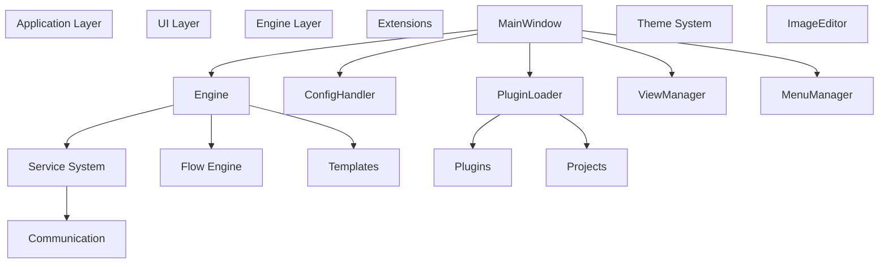
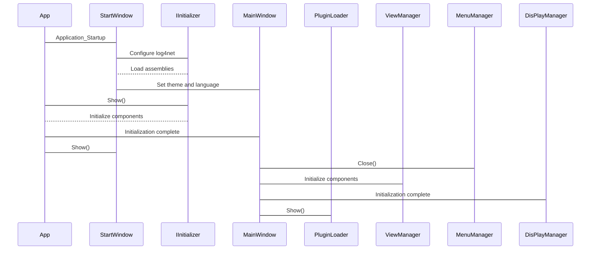
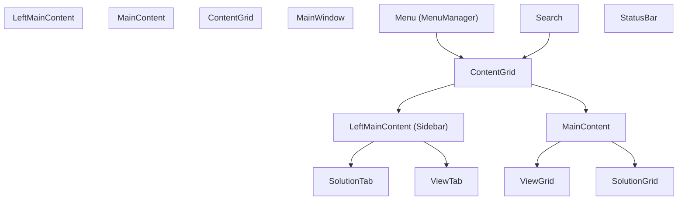
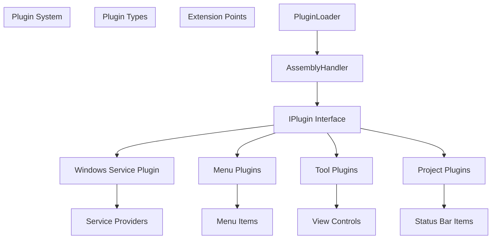
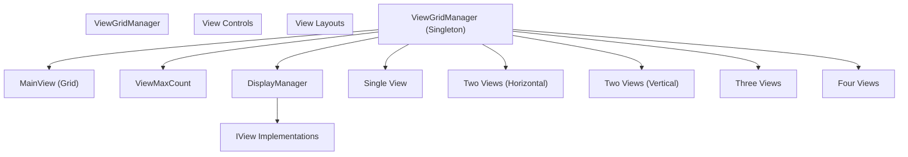
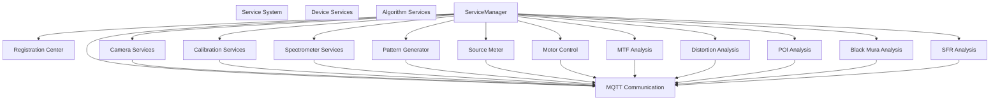
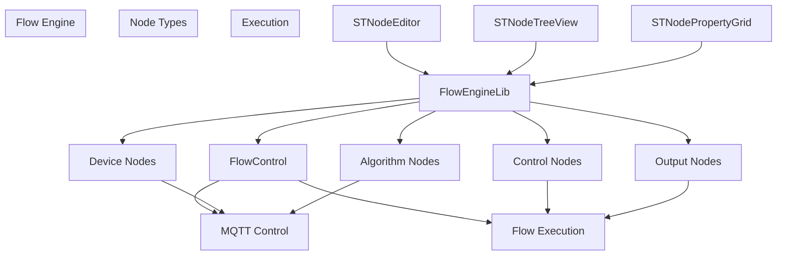
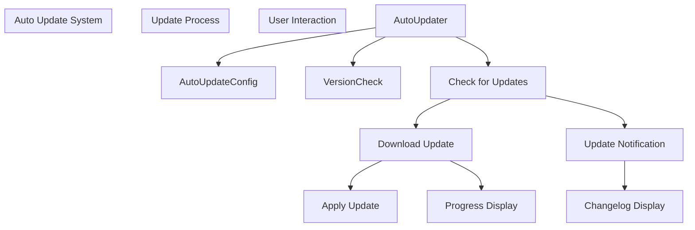
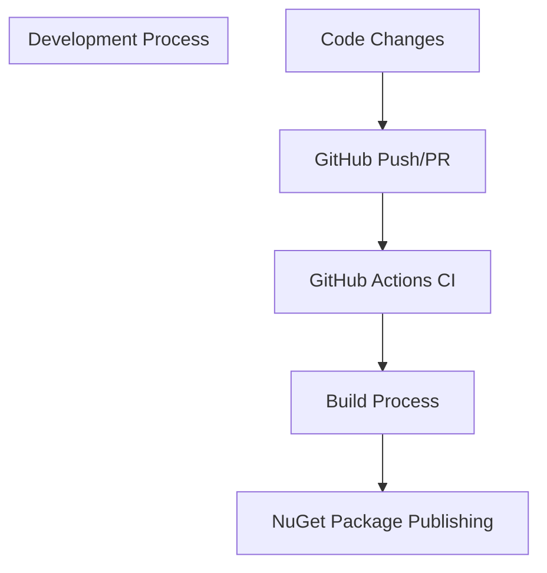

# Overview

> **Relevant source files**
> * [.github/workflows/dotnet.yml](https://github.com/xincheng213618/scgd_general_wpf/blob/987af5f7/.github/workflows/dotnet.yml)
> * [CHANGELOG.md](https://github.com/xincheng213618/scgd_general_wpf/blob/987af5f7/CHANGELOG.md)
> * [ColorVision/App.xaml.cs](https://github.com/xincheng213618/scgd_general_wpf/blob/987af5f7/ColorVision/App.xaml.cs)
> * [ColorVision/ColorVision.csproj](https://github.com/xincheng213618/scgd_general_wpf/blob/987af5f7/ColorVision/ColorVision.csproj)
> * [ColorVision/MainWindow.xaml](https://github.com/xincheng213618/scgd_general_wpf/blob/987af5f7/ColorVision/MainWindow.xaml)
> * [ColorVision/MainWindow.xaml.cs](https://github.com/xincheng213618/scgd_general_wpf/blob/987af5f7/ColorVision/MainWindow.xaml.cs)
> * [ColorVision/Update/AutoUpdater.cs](https://github.com/xincheng213618/scgd_general_wpf/blob/987af5f7/ColorVision/Update/AutoUpdater.cs)
> * [Directory.Build.props](https://github.com/xincheng213618/scgd_general_wpf/blob/987af5f7/Directory.Build.props)
> * [README.md](https://github.com/xincheng213618/scgd_general_wpf/blob/987af5f7/README.md)
> * [scgd_general_wpf.sln](https://github.com/xincheng213618/scgd_general_wpf/blob/987af5f7/scgd_general_wpf.sln)

ColorVision is a comprehensive software application for advanced color management, display quality testing, and optical-electronic measurement. This document provides a technical introduction to the ColorVision application architecture, core components, and their relationships, serving as a foundation for more detailed documentation on specific subsystems.

## Purpose and Scope

This document covers:

* The high-level architecture of ColorVision
* Core subsystems and their responsibilities
* Key technologies and design patterns
* Integration between components

For details about specific components, please refer to their dedicated pages:

* For the UI Framework, see [Core Architecture](/xincheng213618/scgd_general_wpf/2-core-architecture)
* For the Service System, see [Service System](/xincheng213618/scgd_general_wpf/4-service-system)
* For the Flow Engine, see [Flow Engine System](/xincheng213618/scgd_general_wpf/6-flow-engine-system)
* For the Plugin Architecture, see [Plugin Architecture](/xincheng213618/scgd_general_wpf/7-plugin-architecture)
* For the Project System, see [Project System](/xincheng213618/scgd_general_wpf/8-project-system)

## Core Architecture

ColorVision follows a modular, plugin-based architecture that emphasizes separation of concerns and extensibility. The system is built on .NET 8.0 and uses WPF for its user interface.

Sources:

* [ColorVision/ColorVision.csproj L1-L127](https://github.com/xincheng213618/scgd_general_wpf/blob/987af5f7/ColorVision/ColorVision.csproj#L1-L127)
* [ColorVision/MainWindow.xaml.cs

1-443](https://github.com/xincheng213618/scgd_general_wpf/blob/987af5f7/ColorVision/MainWindow.xaml.cs#L1-L443)
* [ColorVision/App.xaml.cs

1-186](https://github.com/xincheng213618/scgd_general_wpf/blob/987af5f7/ColorVision/App.xaml.cs#L1-L186)

### Initialization Flow

The application follows a controlled initialization sequence to ensure dependencies are properly loaded and configured:

Sources:

* [ColorVision/App.xaml.cs

37-171](https://github.com/xincheng213618/scgd_general_wpf/blob/987af5f7/ColorVision/App.xaml.cs#L37-L171)
* [ColorVision/MainWindow.xaml.cs

99-158](https://github.com/xincheng213618/scgd_general_wpf/blob/987af5f7/ColorVision/MainWindow.xaml.cs#L99-L158)

## Key Components

### Main Application Window

The MainWindow serves as the primary container for the application's user interface, providing the following features:

* Menu system for accessing application functionality
* Sidebar containing the Solution Explorer and Device Controls
* Main content area for displaying views
* Status bar showing system status indicators
* Search functionality for quick access to features

Sources:

* [ColorVision/MainWindow.xaml L1-L158](https://github.com/xincheng213618/scgd_general_wpf/blob/987af5f7/ColorVision/MainWindow.xaml#L1-L158)
* [ColorVision/MainWindow.xaml.cs

80-442](https://github.com/xincheng213618/scgd_general_wpf/blob/987af5f7/ColorVision/MainWindow.xaml.cs#L80-L442)

### Plugin System

The plugin system enables extensibility by allowing additional functionality to be loaded at runtime:

Sources:

* [ColorVision/MainWindow.xaml.cs

136-138](https://github.com/xincheng213618/scgd_general_wpf/blob/987af5f7/ColorVision/MainWindow.xaml.cs#L136-L138)
* [ColorVision/App.xaml.cs

122](https://github.com/xincheng213618/scgd_general_wpf/blob/987af5f7/ColorVision/App.xaml.cs#L122-L122)

### View Management

The ViewGridManager is responsible for managing the layout and organization of views within the application:

Sources:

* [ColorVision/MainWindow.xaml.cs

83-128](https://github.com/xincheng213618/scgd_general_wpf/blob/987af5f7/ColorVision/MainWindow.xaml.cs#L83-L128)
* [ColorVision/MainWindow.xaml.cs

193-215](https://github.com/xincheng213618/scgd_general_wpf/blob/987af5f7/ColorVision/MainWindow.xaml.cs#L193-L215)

### Service System

The service system provides a unified framework for managing various hardware devices and software services:

Sources:

* The service system architecture is described in the high-level architecture analysis but not directly in the provided code files.

### Flow Engine

The Flow Engine enables visual programming for creating and executing complex workflows:

Sources:

* The Flow Engine is described in the high-level architecture analysis but not directly in the provided code files.

### Auto-Update System

The application includes an auto-update mechanism for seamless updates:

Sources:

* [ColorVision/Update/AutoUpdater.cs L51-L443](https://github.com/xincheng213618/scgd_general_wpf/blob/987af5f7/ColorVision/Update/AutoUpdater.cs#L51-L443)

## Technologies and Frameworks

ColorVision is built using several key technologies and frameworks:

| Technology | Purpose |
| --- | --- |
| .NET 8.0 | Core application framework |
| WPF | User interface framework |
| MQTT | Communication between services |
| OpenCV | Image processing |
| SQLite/MySQL | Data storage |
| log4net | Logging |
| HandyControl | UI component library |
| Microsoft.Xaml.Behaviors | UI behavior library |

Sources:

* [Directory.Build.props

1-26](https://github.com/xincheng213618/scgd_general_wpf/blob/987af5f7/Directory.Build.props#L1-L26)
* [ColorVision/ColorVision.csproj L1-L127](https://github.com/xincheng213618/scgd_general_wpf/blob/987af5f7/ColorVision/ColorVision.csproj#L1-L127)
* [ColorVision/App.xaml.cs

1-186](https://github.com/xincheng213618/scgd_general_wpf/blob/987af5f7/ColorVision/App.xaml.cs#L1-L186)

## Project Organization

The solution is organized into several key project groups:

| Project Group | Purpose |
| --- | --- |
| ColorVision | Main application |
| Core | Core libraries and native code |
| UI | User interface components |
| Engine | Application logic and processing |
| Plugins | Extension modules |
| Projects | Specialized application configurations |

Sources:

* [scgd_general_wpf.sln L1-L303](https://github.com/xincheng213618/scgd_general_wpf/blob/987af5f7/scgd_general_wpf.sln#L1-L303)

## Development Process

The project uses GitHub Actions for continuous integration and automated publishing:

Sources:

* [.github/workflows/dotnet.yml

1-48](https://github.com/xincheng213618/scgd_general_wpf/blob/987af5f7/.github/workflows/dotnet.yml#L1-L48)

## Version and Release Management

ColorVision uses semantic versioning with build numbers (e.g., 1.2.3.14). The changelog shows regular updates with bug fixes and new features.

The versioning follows this pattern:

* Major.Minor.Build.Revision

Where:

* Major: Significant architectural changes
* Minor: New features
* Build: Feature improvements
* Revision: Bug fixes

Sources:

* [Directory.Build.props

15-20](https://github.com/xincheng213618/scgd_general_wpf/blob/987af5f7/Directory.Build.props#L15-L20)
* [CHANGELOG.md L1-L200](https://github.com/xincheng213618/scgd_general_wpf/blob/987af5f7/CHANGELOG.md#L1-L200)

## Extension Points

ColorVision provides several extension points for customization:

1. **Plugins**: Implement the `IPlugin` interface to add new functionality
2. **Menu Items**: Implement the `IMenuItem` interface to add menu entries
3. **Views**: Implement the `IView` interface to add new views
4. **Services**: Register new services with the Service Manager
5. **Status Bar Items**: Implement the `IStatusBarProvider` interface to add status indicators

Sources:

* [ColorVision/MainWindow.xaml.cs

33-72](https://github.com/xincheng213618/scgd_general_wpf/blob/987af5f7/ColorVision/MainWindow.xaml.cs#L33-L72)
* [ColorVision/MainWindow.xaml.cs

310-333](https://github.com/xincheng213618/scgd_general_wpf/blob/987af5f7/ColorVision/MainWindow.xaml.cs#L310-L333)

## Conclusion

ColorVision is a modular, extensible application for color management, display quality testing, and optical-electronic measurement. Its architecture emphasizes separation of concerns, extensibility through plugins, and a service-oriented approach to hardware and algorithm integration.

The application's main subsystems - UI Framework, Engine Layer, Service System, Flow Engine, and Plugin Architecture - work together to provide a powerful and flexible platform for color vision applications.