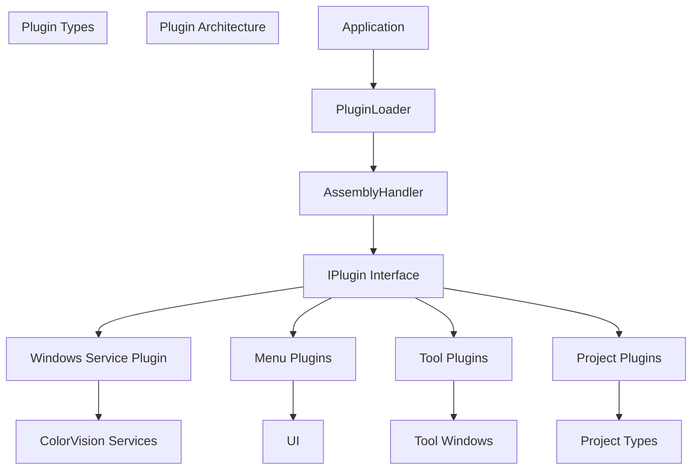
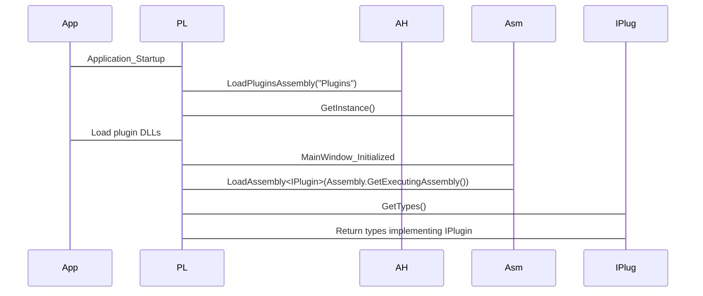
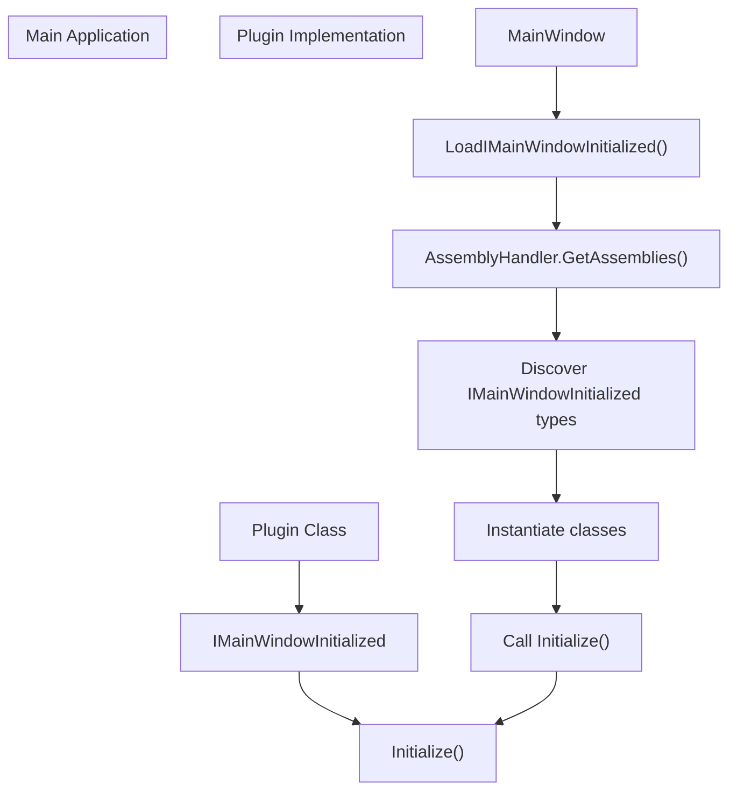
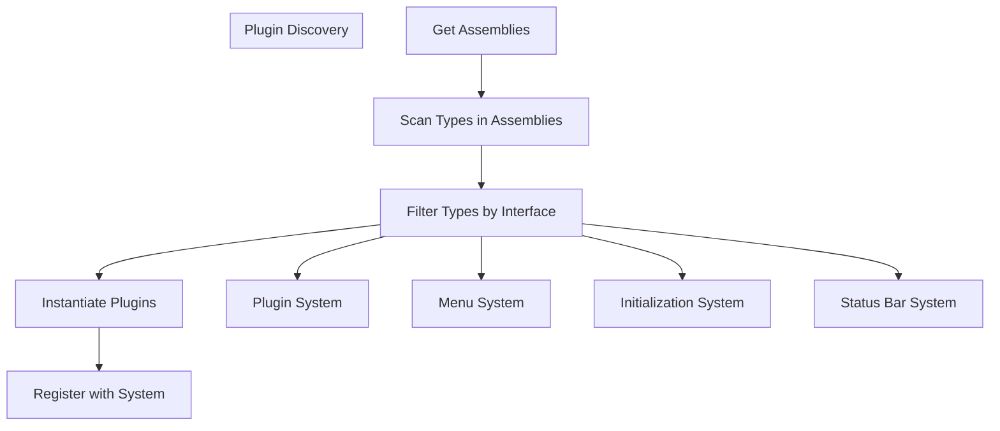
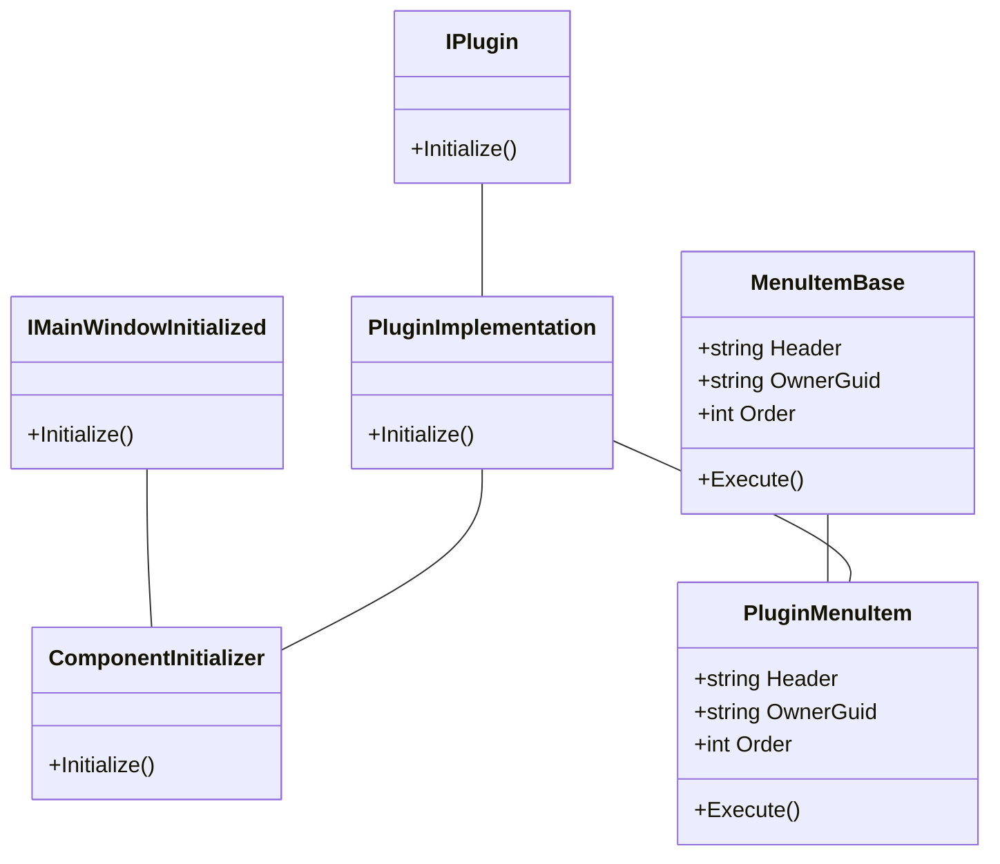
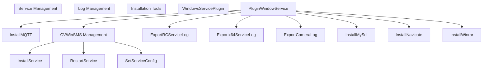

# Plugin Architecture

> **Relevant source files**
> * [CHANGELOG.md](https://github.com/xincheng213618/scgd_general_wpf/blob/987af5f7/CHANGELOG.md)
> * [ColorVision/App.xaml.cs](https://github.com/xincheng213618/scgd_general_wpf/blob/987af5f7/ColorVision/App.xaml.cs)
> * [ColorVision/ColorVision.csproj](https://github.com/xincheng213618/scgd_general_wpf/blob/987af5f7/ColorVision/ColorVision.csproj)
> * [ColorVision/MainWindow.xaml](https://github.com/xincheng213618/scgd_general_wpf/blob/987af5f7/ColorVision/MainWindow.xaml)
> * [ColorVision/MainWindow.xaml.cs](https://github.com/xincheng213618/scgd_general_wpf/blob/987af5f7/ColorVision/MainWindow.xaml.cs)
> * [ColorVision/Update/AutoUpdater.cs](https://github.com/xincheng213618/scgd_general_wpf/blob/987af5f7/ColorVision/Update/AutoUpdater.cs)
> * [Directory.Build.props](https://github.com/xincheng213618/scgd_general_wpf/blob/987af5f7/Directory.Build.props)
> * [Engine/ColorVision.Engine/Templates/ARVR/Distortion/AlgorithmDistortion.cs](https://github.com/xincheng213618/scgd_general_wpf/blob/987af5f7/Engine/ColorVision.Engine/Templates/ARVR/Distortion/AlgorithmDistortion.cs)
> * [Engine/ColorVision.Engine/Templates/ARVR/Ghost/AlgorithmGhost.cs](https://github.com/xincheng213618/scgd_general_wpf/blob/987af5f7/Engine/ColorVision.Engine/Templates/ARVR/Ghost/AlgorithmGhost.cs)
> * [Engine/ColorVision.Engine/Templates/Jsons/Ghost2/AlgorithmGhost2.cs](https://github.com/xincheng213618/scgd_general_wpf/blob/987af5f7/Engine/ColorVision.Engine/Templates/Jsons/Ghost2/AlgorithmGhost2.cs)
> * [Plugins/WindowsServicePlugin/CVWinSMS/CVWinSMSConfig.cs](https://github.com/xincheng213618/scgd_general_wpf/blob/987af5f7/Plugins/WindowsServicePlugin/CVWinSMS/CVWinSMSConfig.cs)
> * [Plugins/WindowsServicePlugin/CVWinSMS/InstallService.cs](https://github.com/xincheng213618/scgd_general_wpf/blob/987af5f7/Plugins/WindowsServicePlugin/CVWinSMS/InstallService.cs)
> * [Plugins/WindowsServicePlugin/CVWinSMS/InstallTool.cs](https://github.com/xincheng213618/scgd_general_wpf/blob/987af5f7/Plugins/WindowsServicePlugin/CVWinSMS/InstallTool.cs)
> * [Plugins/WindowsServicePlugin/CVWinSMS/RestartService.cs](https://github.com/xincheng213618/scgd_general_wpf/blob/987af5f7/Plugins/WindowsServicePlugin/CVWinSMS/RestartService.cs)
> * [Plugins/WindowsServicePlugin/InstallMQTT.cs](https://github.com/xincheng213618/scgd_general_wpf/blob/987af5f7/Plugins/WindowsServicePlugin/InstallMQTT.cs)
> * [Plugins/WindowsServicePlugin/InstallMySql.cs](https://github.com/xincheng213618/scgd_general_wpf/blob/987af5f7/Plugins/WindowsServicePlugin/InstallMySql.cs)
> * [Plugins/WindowsServicePlugin/InstallNavicate.cs](https://github.com/xincheng213618/scgd_general_wpf/blob/987af5f7/Plugins/WindowsServicePlugin/InstallNavicate.cs)
> * [Plugins/WindowsServicePlugin/InstallWinrar.cs](https://github.com/xincheng213618/scgd_general_wpf/blob/987af5f7/Plugins/WindowsServicePlugin/InstallWinrar.cs)
> * [Plugins/WindowsServicePlugin/Menus/ExportCameraLog.cs](https://github.com/xincheng213618/scgd_general_wpf/blob/987af5f7/Plugins/WindowsServicePlugin/Menus/ExportCameraLog.cs)
> * [Plugins/WindowsServicePlugin/Menus/ExportRCServiceLog.cs](https://github.com/xincheng213618/scgd_general_wpf/blob/987af5f7/Plugins/WindowsServicePlugin/Menus/ExportRCServiceLog.cs)
> * [Plugins/WindowsServicePlugin/Menus/Exportx64ServiceLog.cs](https://github.com/xincheng213618/scgd_general_wpf/blob/987af5f7/Plugins/WindowsServicePlugin/Menus/Exportx64ServiceLog.cs)
> * [Plugins/WindowsServicePlugin/PluginConfig/PluginWindowService.cs](https://github.com/xincheng213618/scgd_general_wpf/blob/987af5f7/Plugins/WindowsServicePlugin/PluginConfig/PluginWindowService.cs)
> * [Plugins/WindowsServicePlugin/SetMysqlConfig.cs](https://github.com/xincheng213618/scgd_general_wpf/blob/987af5f7/Plugins/WindowsServicePlugin/SetMysqlConfig.cs)
> * [Plugins/WindowsServicePlugin/SetServiceConfig.cs](https://github.com/xincheng213618/scgd_general_wpf/blob/987af5f7/Plugins/WindowsServicePlugin/SetServiceConfig.cs)
> * [Plugins/WindowsServicePlugin/Tools/MenuBeyondCompare.cs](https://github.com/xincheng213618/scgd_general_wpf/blob/987af5f7/Plugins/WindowsServicePlugin/Tools/MenuBeyondCompare.cs)
> * [Plugins/WindowsServicePlugin/Tools/MenuImageJ.cs](https://github.com/xincheng213618/scgd_general_wpf/blob/987af5f7/Plugins/WindowsServicePlugin/Tools/MenuImageJ.cs)
> * [Plugins/WindowsServicePlugin/WindowsServicePlugin.csproj](https://github.com/xincheng213618/scgd_general_wpf/blob/987af5f7/Plugins/WindowsServicePlugin/WindowsServicePlugin.csproj)
> * [scgd_general_wpf.sln](https://github.com/xincheng213618/scgd_general_wpf/blob/987af5f7/scgd_general_wpf.sln)

The ColorVision system employs a flexible plugin architecture that allows extending application functionality without modifying the core codebase. This page describes how plugins are integrated, loaded, and managed within the application. For information about specific service plugins, see [Windows Service Plugin](/xincheng213618/scgd_general_wpf/7.1-windows-service-plugin).

## Overview

The plugin architecture enables developers to add new features, services, tool windows, menu items, and project types to the ColorVision application. Plugins are loaded dynamically at runtime, allowing for a modular and extensible design.



Sources:

* [ColorVision/MainWindow.xaml.cs

136-138](https://github.com/xincheng213618/scgd_general_wpf/blob/987af5f7/ColorVision/MainWindow.xaml.cs#L136-L138)
* [ColorVision/App.xaml.cs

122](https://github.com/xincheng213618/scgd_general_wpf/blob/987af5f7/ColorVision/App.xaml.cs#L122-L122)
* [scgd_general_wpf.sln L31-L61](https://github.com/xincheng213618/scgd_general_wpf/blob/987af5f7/scgd_general_wpf.sln#L31-L61)

## Plugin Loading Process

The application loads plugins through two main mechanisms:

1. Internal plugins from the main assembly
2. External plugins from the "Plugins" directory



Sources:

* [ColorVision/MainWindow.xaml.cs

136-138](https://github.com/xincheng213618/scgd_general_wpf/blob/987af5f7/ColorVision/MainWindow.xaml.cs#L136-L138)
* [ColorVision/MainWindow.xaml.cs

171-190](https://github.com/xincheng213618/scgd_general_wpf/blob/987af5f7/ColorVision/MainWindow.xaml.cs#L171-L190)
* [ColorVision/App.xaml.cs

122](https://github.com/xincheng213618/scgd_general_wpf/blob/987af5f7/ColorVision/App.xaml.cs#L122-L122)

## Key Components

### AssemblyHandler

The `AssemblyHandler` manages the discovery and loading of assemblies. It's a singleton class that provides access to all loaded assemblies, allowing the system to search for plugin implementations using reflection.

### PluginLoader

The `PluginLoader` class is responsible for:

1. Loading assemblies from specified locations
2. Discovering types that implement the `IPlugin` interface
3. Instantiating and initializing plugins

```
// In App.xaml.cs
PluginLoader.LoadPluginsAssembly("Plugins");

// In MainWindow.xaml.cs
PluginLoader.LoadAssembly<IPlugin>(Assembly.GetExecutingAssembly());
```

### IPlugin Interface

All plugins must implement the `IPlugin` interface, which serves as the contract between the plugin and the core application. While the exact definition isn't visible in the provided files, it likely includes initialization methods and metadata properties.

Sources:

* [ColorVision/MainWindow.xaml.cs

136](https://github.com/xincheng213618/scgd_general_wpf/blob/987af5f7/ColorVision/MainWindow.xaml.cs#L136-L136)
* [ColorVision/App.xaml.cs

122](https://github.com/xincheng213618/scgd_general_wpf/blob/987af5f7/ColorVision/App.xaml.cs#L122-L122)

## Plugin Types

The ColorVision architecture supports several types of plugins:

### Menu Plugins

Menu plugins extend the application's menu by adding new menu items. These are discovered and loaded through the `MenuManager`:

```
MenuManager.GetInstance().LoadMenuItemFromAssembly();
```

Menu items implement the `IMenuItem` interface, which defines properties like `Header`, `GuidId`, and `Order`.

### Windows Service Plugin

The Windows Service Plugin is a specialized plugin for managing ColorVision services. It provides functionality for:

* Installing and configuring services
* Viewing service logs
* Restarting services
* Updating service components

### Project Plugins

Project plugins define new project types, such as `ProjectKB`, `ProjectHeyuan`, and `ProjectShiyuan`. These plugins extend the project system with specialized functionality.

### Tool Plugins

Tool plugins add new tool windows or functionality to the application, such as the `ScreenRecorder` or `SystemMonitor`.

Sources:

* [Plugins/WindowsServicePlugin/WindowsServicePlugin.csproj](https://github.com/xincheng213618/scgd_general_wpf/blob/987af5f7/Plugins/WindowsServicePlugin/WindowsServicePlugin.csproj)
* [ColorVision/MainWindow.xaml.cs

137](https://github.com/xincheng213618/scgd_general_wpf/blob/987af5f7/ColorVision/MainWindow.xaml.cs#L137-L137)
* [scgd_general_wpf.sln L31-L61](https://github.com/xincheng213618/scgd_general_wpf/blob/987af5f7/scgd_general_wpf.sln#L31-L61)

## Plugin Initialization

Plugins can initialize themselves and integrate with the application through several interfaces:

### IMainWindowInitialized

This interface allows plugins to execute code when the main window is initialized:



Sources:

* [ColorVision/MainWindow.xaml.cs

171-190](https://github.com/xincheng213618/scgd_general_wpf/blob/987af5f7/ColorVision/MainWindow.xaml.cs#L171-L190)
* [Plugins/WindowsServicePlugin/CVWinSMS/InstallTool.cs

14](https://github.com/xincheng213618/scgd_general_wpf/blob/987af5f7/Plugins/WindowsServicePlugin/CVWinSMS/InstallTool.cs#L14-L14)

### WizardStepBase

The `WizardStepBase` class allows plugins to add steps to application wizards, such as configuration or installation wizards.

```
public class InstallMQTT : WizardStepBase
{
    public override int Order => 99;
    public override string Header => "安装MQTT";
    public override string Description => "安装本地的MQTT服务...";  
    
    public override void Execute()
    {
        // Implementation
    }
}
```

Sources:

* [Plugins/WindowsServicePlugin/InstallMQTT.cs L9-L75](https://github.com/xincheng213618/scgd_general_wpf/blob/987af5f7/Plugins/WindowsServicePlugin/InstallMQTT.cs#L9-L75)
* [Plugins/WindowsServicePlugin/InstallMySql.cs L9-L71](https://github.com/xincheng213618/scgd_general_wpf/blob/987af5f7/Plugins/WindowsServicePlugin/InstallMySql.cs#L9-L71)

### MenuItemBase

Plugins can add menu items by implementing the `MenuItemBase` class:

```
public class RestartService : MenuItemBase
{
    public override string OwnerGuid => "ServiceLog";
    public override string Header => "重启服务";
    public override int Order => 2;
    
    public override void Execute()
    {
        // Implementation
    }
}
```

Sources:

* [Plugins/WindowsServicePlugin/CVWinSMS/RestartService.cs L9-L26](https://github.com/xincheng213618/scgd_general_wpf/blob/987af5f7/Plugins/WindowsServicePlugin/CVWinSMS/RestartService.cs#L9-L26)
* [Plugins/WindowsServicePlugin/Menus/ExportRCServiceLog.cs L8-L37](https://github.com/xincheng213618/scgd_general_wpf/blob/987af5f7/Plugins/WindowsServicePlugin/Menus/ExportRCServiceLog.cs#L8-L37)

## Plugin Registration and Discovery

The ColorVision system uses reflection to discover and load plugins. This process involves:

1. Scanning assemblies for types that implement specific interfaces
2. Instantiating those types
3. Registering them with appropriate managers or containers



Sources:

* [ColorVision/MainWindow.xaml.cs

171-190](https://github.com/xincheng213618/scgd_general_wpf/blob/987af5f7/ColorVision/MainWindow.xaml.cs#L171-L190)
* [ColorVision/MainWindow.xaml.cs

313-322](https://github.com/xincheng213618/scgd_general_wpf/blob/987af5f7/ColorVision/MainWindow.xaml.cs#L313-L322)

## Creating a Plugin

To create a plugin for ColorVision:

1. Create a new .NET project with appropriate references to the ColorVision assemblies
2. Implement the `IPlugin` interface
3. Optionally implement additional interfaces like `IMenuItem`, `IMainWindowInitialized`, etc.
4. Build and place the resulting DLL in the "Plugins" directory

Here's an example structure for a plugin:



### Plugin Project Structure

The structure of a plugin project typically includes:

```
PluginName/
├── PluginConfig/
│   └── PluginNameConfig.cs (Plugin configuration)
├── Menus/
│   └── [MenuItems].cs (Menu extensions)
├── Windows/
│   └── [WindowControls].cs (UI components)
├── Services/
│   └── [ServiceImplementations].cs (Service implementations)
├── Resources/
│   └── Resources.resx (Resource files)
└── PluginName.csproj (Project file)
```

Sources:

* [Plugins/WindowsServicePlugin/WindowsServicePlugin.csproj L1-L34](https://github.com/xincheng213618/scgd_general_wpf/blob/987af5f7/Plugins/WindowsServicePlugin/WindowsServicePlugin.csproj#L1-L34)
* [Plugins/WindowsServicePlugin/PluginConfig/PluginWindowService.cs L1-L10](https://github.com/xincheng213618/scgd_general_wpf/blob/987af5f7/Plugins/WindowsServicePlugin/PluginConfig/PluginWindowService.cs#L1-L10)

## Windows Service Plugin Example

The Windows Service Plugin is a comprehensive example that demonstrates many aspects of the plugin architecture:



This plugin enables management of various ColorVision services and provides tools for:

* Installing and configuring services
* Viewing and exporting service logs
* Installing supporting software
* Configuring and updating services

Sources:

* [Plugins/WindowsServicePlugin/PluginConfig/PluginWindowService.cs L1-L10](https://github.com/xincheng213618/scgd_general_wpf/blob/987af5f7/Plugins/WindowsServicePlugin/PluginConfig/PluginWindowService.cs#L1-L10)
* [Plugins/WindowsServicePlugin/CVWinSMS/InstallService.cs L1-L162](https://github.com/xincheng213618/scgd_general_wpf/blob/987af5f7/Plugins/WindowsServicePlugin/CVWinSMS/InstallService.cs#L1-L162)
* [Plugins/WindowsServicePlugin/CVWinSMS/RestartService.cs L1-L27](https://github.com/xincheng213618/scgd_general_wpf/blob/987af5f7/Plugins/WindowsServicePlugin/CVWinSMS/RestartService.cs#L1-L27)
* [Plugins/WindowsServicePlugin/Menus/ExportRCServiceLog.cs L1-L37](https://github.com/xincheng213618/scgd_general_wpf/blob/987af5f7/Plugins/WindowsServicePlugin/Menus/ExportRCServiceLog.cs#L1-L37)

## Plugin Configuration and Updates

Plugins can include their own configuration systems that integrate with the application's configuration framework. For example, the Windows Service Plugin defines `CVWinSMSConfig`:

```
public class CVWinSMSConfig : ViewModelBase, IConfig, IConfigSettingProvider
{
    public static CVWinSMSConfig Instance => ConfigService.Instance.GetRequiredService<CVWinSMSConfig>();
    
    public string CVWinSMSPath { get => _CVWinSMSPath; set { _CVWinSMSPath = value; } }
    private string _CVWinSMSPath = string.Empty;
    
    // Additional configuration properties and methods
}
```

The plugin system also supports updating plugins through the auto-update system. Plugins can check for updates and download newer versions:

```
public async Task GetLatestReleaseVersion()
{
    try
    {
        if (!File.Exists(Config.CVWinSMSPath))
            return;
        FileVersionInfo versionInfo = FileVersionInfo.GetVersionInfo(Config.CVWinSMSPath);
        Version CurrentVerision = new Version(versionInfo.FileVersion);

        Version version = await DownloadFile.GetLatestVersionNumber(LatestReleaseUrl);
        if (version > CurrentVerision)
        {
            // Handle update process
        }
    }
    catch(Exception ex)
    {
        // Handle exceptions
    }
}
```

Sources:

* [Plugins/WindowsServicePlugin/CVWinSMS/CVWinSMSConfig.cs L11-L67](https://github.com/xincheng213618/scgd_general_wpf/blob/987af5f7/Plugins/WindowsServicePlugin/CVWinSMS/CVWinSMSConfig.cs#L11-L67)
* [Plugins/WindowsServicePlugin/CVWinSMS/InstallTool.cs L69-L113](https://github.com/xincheng213618/scgd_general_wpf/blob/987af5f7/Plugins/WindowsServicePlugin/CVWinSMS/InstallTool.cs#L69-L113)

## Summary

The plugin architecture in ColorVision provides a powerful and flexible way to extend the application's functionality. By implementing the appropriate interfaces, plugins can add new features, integrate with existing systems, and enhance the user experience without modifying the core application code. This approach enables a modular, maintainable, and extensible design that can evolve over time as new requirements emerge.

The system supports various types of plugins, from simple menu extensions to complex service management tools, and provides a structured approach to plugin discovery, initialization, and integration with the application.