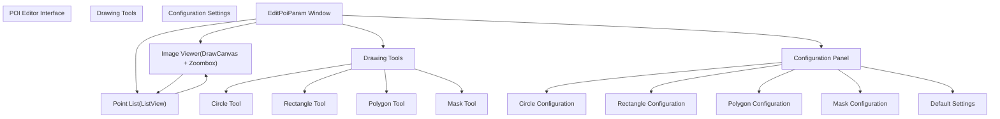
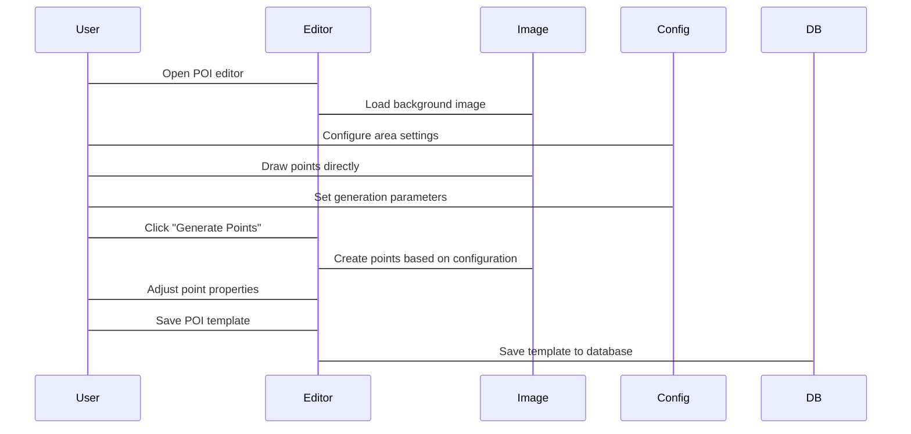
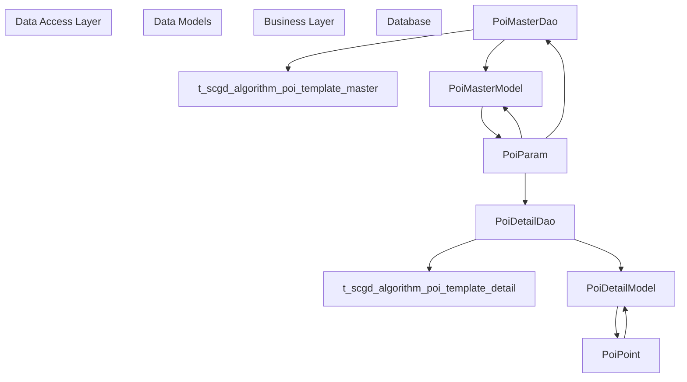

# Points of Interest (POI) System

> **Relevant source files**
> * [Engine/ColorVision.Engine/Templates/Jsons/KB/EditTemplateJson.xaml](https://github.com/xincheng213618/scgd_general_wpf/blob/987af5f7/Engine/ColorVision.Engine/Templates/Jsons/KB/EditTemplateJson.xaml)
> * [Engine/ColorVision.Engine/Templates/Jsons/KB/KBJson.cs](https://github.com/xincheng213618/scgd_general_wpf/blob/987af5f7/Engine/ColorVision.Engine/Templates/Jsons/KB/KBJson.cs)
> * [Engine/ColorVision.Engine/Templates/Jsons/KB/TemplateKB.cs](https://github.com/xincheng213618/scgd_general_wpf/blob/987af5f7/Engine/ColorVision.Engine/Templates/Jsons/KB/TemplateKB.cs)
> * [Engine/ColorVision.Engine/Templates/POI/Dao/PoiDetailDao.cs](https://github.com/xincheng213618/scgd_general_wpf/blob/987af5f7/Engine/ColorVision.Engine/Templates/POI/Dao/PoiDetailDao.cs)
> * [Engine/ColorVision.Engine/Templates/POI/Dao/PoiMasterDao.cs](https://github.com/xincheng213618/scgd_general_wpf/blob/987af5f7/Engine/ColorVision.Engine/Templates/POI/Dao/PoiMasterDao.cs)
> * [Engine/ColorVision.Engine/Templates/POI/EditPoiParam.Image.cs](https://github.com/xincheng213618/scgd_general_wpf/blob/987af5f7/Engine/ColorVision.Engine/Templates/POI/EditPoiParam.Image.cs)
> * [Engine/ColorVision.Engine/Templates/POI/EditPoiParam.xaml](https://github.com/xincheng213618/scgd_general_wpf/blob/987af5f7/Engine/ColorVision.Engine/Templates/POI/EditPoiParam.xaml)
> * [Engine/ColorVision.Engine/Templates/POI/EditPoiParam.xaml.cs](https://github.com/xincheng213618/scgd_general_wpf/blob/987af5f7/Engine/ColorVision.Engine/Templates/POI/EditPoiParam.xaml.cs)
> * [Engine/ColorVision.Engine/Templates/POI/EditPoiParam1.Image.cs](https://github.com/xincheng213618/scgd_general_wpf/blob/987af5f7/Engine/ColorVision.Engine/Templates/POI/EditPoiParam1.Image.cs)
> * [Engine/ColorVision.Engine/Templates/POI/EditPoiParam1.xaml](https://github.com/xincheng213618/scgd_general_wpf/blob/987af5f7/Engine/ColorVision.Engine/Templates/POI/EditPoiParam1.xaml)
> * [Engine/ColorVision.Engine/Templates/POI/EditPoiParam1.xaml.cs](https://github.com/xincheng213618/scgd_general_wpf/blob/987af5f7/Engine/ColorVision.Engine/Templates/POI/EditPoiParam1.xaml.cs)
> * [Engine/ColorVision.Engine/Templates/POI/EidtPoiDataGridForm.Designer.cs](https://github.com/xincheng213618/scgd_general_wpf/blob/987af5f7/Engine/ColorVision.Engine/Templates/POI/EidtPoiDataGridForm.Designer.cs)
> * [Engine/ColorVision.Engine/Templates/POI/EidtPoiDataGridForm.cs](https://github.com/xincheng213618/scgd_general_wpf/blob/987af5f7/Engine/ColorVision.Engine/Templates/POI/EidtPoiDataGridForm.cs)
> * [Engine/ColorVision.Engine/Templates/POI/EidtPoiDataGridForm.resx](https://github.com/xincheng213618/scgd_general_wpf/blob/987af5f7/Engine/ColorVision.Engine/Templates/POI/EidtPoiDataGridForm.resx)
> * [Engine/ColorVision.Engine/Templates/POI/PoiConfig.cs](https://github.com/xincheng213618/scgd_general_wpf/blob/987af5f7/Engine/ColorVision.Engine/Templates/POI/PoiConfig.cs)
> * [Engine/ColorVision.Engine/Templates/POI/PoiParam.cs](https://github.com/xincheng213618/scgd_general_wpf/blob/987af5f7/Engine/ColorVision.Engine/Templates/POI/PoiParam.cs)
> * [Engine/ColorVision.Engine/Templates/POI/PoiPoint.cs](https://github.com/xincheng213618/scgd_general_wpf/blob/987af5f7/Engine/ColorVision.Engine/Templates/POI/PoiPoint.cs)
> * [UI/ColorVision.ImageEditor/Draw/SelectEditorVisual.cs](https://github.com/xincheng213618/scgd_general_wpf/blob/987af5f7/UI/ColorVision.ImageEditor/Draw/SelectEditorVisual.cs)

## Introduction

The Points of Interest (POI) System is a core component of the ColorVision application that enables users to define, manage, and analyze specific regions within images. It provides tools for creating, editing, and saving collections of points or regions that are used as targets for various image analysis algorithms. The POI system is particularly important for specialized analysis tasks such as keyboard backlighting testing, display quality assessment, and automated inspection workflows.

Sources:
[Engine/ColorVision.Engine/Templates/POI/PoiParam.cs

15-104](https://github.com/xincheng213618/scgd_general_wpf/blob/987af5f7/Engine/ColorVision.Engine/Templates/POI/PoiParam.cs#L15-L104)

[Engine/ColorVision.Engine/Templates/POI/PoiConfig.cs

17-332](https://github.com/xincheng213618/scgd_general_wpf/blob/987af5f7/Engine/ColorVision.Engine/Templates/POI/PoiConfig.cs#L17-L332)

## System Architecture

The POI system consists of several interconnected components that work together to provide a comprehensive framework for defining and working with points of interest.

```

```

Sources:
[Engine/ColorVision.Engine/Templates/POI/PoiParam.cs

17-104](https://github.com/xincheng213618/scgd_general_wpf/blob/987af5f7/Engine/ColorVision.Engine/Templates/POI/PoiParam.cs#L17-L104)

[Engine/ColorVision.Engine/Templates/POI/PoiPoint.cs

9-98](https://github.com/xincheng213618/scgd_general_wpf/blob/987af5f7/Engine/ColorVision.Engine/Templates/POI/PoiPoint.cs#L9-L98)

[Engine/ColorVision.Engine/Templates/POI/PoiConfig.cs

17-332](https://github.com/xincheng213618/scgd_general_wpf/blob/987af5f7/Engine/ColorVision.Engine/Templates/POI/PoiConfig.cs#L17-L332)

[Engine/ColorVision.Engine/Templates/Jsons/KB/KBJson.cs

9-125](https://github.com/xincheng213618/scgd_general_wpf/blob/987af5f7/Engine/ColorVision.Engine/Templates/Jsons/KB/KBJson.cs#L9-L125)

## Core Components

### PoiParam

The `PoiParam` class is the main container for POI data. It holds a collection of points, configuration settings, and metadata:

| Property | Type | Description |
| --- | --- | --- |
| PoiPoints | ObservableCollection<PoiPoint> | Collection of individual points of interest |
| PoiConfig | PoiConfig | Configuration settings for the POI collection |
| Width | int | Width of the associated image |
| Height | int | Height of the associated image |
| Name | string | Name of the POI template |
| Type | int | Type identifier for the POI template |

`PoiParam` also provides methods for database integration, allowing templates to be saved and loaded:

* `Save2DB()` - Saves the POI template to the database
* `LoadPoiDetailFromDB()` - Loads point details from the database

Sources:
[Engine/ColorVision.Engine/Templates/POI/PoiParam.cs

17-104](https://github.com/xincheng213618/scgd_general_wpf/blob/987af5f7/Engine/ColorVision.Engine/Templates/POI/PoiParam.cs#L17-L104)

[Engine/ColorVision.Engine/Templates/POI/Dao/PoiMasterDao.cs

7-156](https://github.com/xincheng213618/scgd_general_wpf/blob/987af5f7/Engine/ColorVision.Engine/Templates/POI/Dao/PoiMasterDao.cs#L7-L156)

[Engine/ColorVision.Engine/Templates/POI/Dao/PoiDetailDao.cs

5-51](https://github.com/xincheng213618/scgd_general_wpf/blob/987af5f7/Engine/ColorVision.Engine/Templates/POI/Dao/PoiDetailDao.cs#L5-L51)

### PoiPoint

The `PoiPoint` class represents an individual point of interest with the following properties:

| Property | Type | Description |
| --- | --- | --- |
| Id | int | Unique identifier |
| Name | string | Display name |
| PointType | RiPointTypes | Type of point (Circle, Rect, Mask) |
| PixX | double | X-coordinate |
| PixY | double | Y-coordinate |
| PixWidth | double | Width (or diameter for circles) |
| PixHeight | double | Height (for rectangles) |
| Param | PoiPointParam | Additional parameters for analysis |

Sources:
[Engine/ColorVision.Engine/Templates/POI/PoiPoint.cs

71-97](https://github.com/xincheng213618/scgd_general_wpf/blob/987af5f7/Engine/ColorVision.Engine/Templates/POI/PoiPoint.cs#L71-L97)

### PoiConfig

The `PoiConfig` class contains configuration settings for the POI system, including:

* Display settings (`IsShowText`, `IsShowPoiConfig`, `IsLayoutUpdated`)
* Layout parameters (`Center`, `PointType`)
* Default dimensions (`DefaultCircleRadius`, `DefaultRectWidth`, `DefaultRectHeight`)
* Area configuration for different shapes
* File paths and persistence settings

Sources:
[Engine/ColorVision.Engine/Templates/POI/PoiConfig.cs

78-308](https://github.com/xincheng213618/scgd_general_wpf/blob/987af5f7/Engine/ColorVision.Engine/Templates/POI/PoiConfig.cs#L78-L308)

### PoiPointParam

The `PoiPointParam` class contains parameters used for analyzing individual points:

| Property | Type | Description |
| --- | --- | --- |
| DoKey | bool | Whether to perform key analysis |
| DoHalo | bool | Whether to perform halo analysis |
| KeyScale | double | Scaling factor for key analysis |
| HaloScale | double | Scaling factor for halo analysis |
| HaloThreadV | int | Threshold value for halo detection |
| KeyThreadV | int | Threshold value for key detection |
| HaloOffsetX/Y | int | X/Y offset for halo analysis |
| KeyOffsetX/Y | int | X/Y offset for key analysis |
| Area | double | Area measurement |
| Brightness | double | Brightness measurement |

Sources:
[Engine/ColorVision.Engine/Templates/POI/PoiPoint.cs

7-64](https://github.com/xincheng213618/scgd_general_wpf/blob/987af5f7/Engine/ColorVision.Engine/Templates/POI/PoiPoint.cs#L7-L64)

## User Interface Components

The POI system provides rich user interfaces for creating and editing points of interest.



### EditPoiParam Window

The main editor window provides a comprehensive interface for creating and editing POI templates:

1. **Image Viewer** - Displays the background image with overlay visualizations of points
2. **Drawing Tools** - Tools for creating different types of points (circles, rectangles, polygons)
3. **Point List** - Displays all points with properties that can be edited
4. **Configuration Panel** - Settings for controlling point generation and display

The editor supports multiple workflows:

* **Manual Drawing** - Create points by drawing directly on the image
* **Automatic Generation** - Generate points based on area configurations (circle pattern, grid pattern)
* **Bulk Editing** - Edit properties of multiple points simultaneously
* **Import/Export** - Load and save POI templates

Sources:
[Engine/ColorVision.Engine/Templates/POI/EditPoiParam.xaml

1-627](https://github.com/xincheng213618/scgd_general_wpf/blob/987af5f7/Engine/ColorVision.Engine/Templates/POI/EditPoiParam.xaml#L1-L627)

[Engine/ColorVision.Engine/Templates/POI/EditPoiParam.xaml.cs

49-574](https://github.com/xincheng213618/scgd_general_wpf/blob/987af5f7/Engine/ColorVision.Engine/Templates/POI/EditPoiParam.xaml.cs#L49-L574)

[Engine/ColorVision.Engine/Templates/POI/EditPoiParam.Image.cs

14-539](https://github.com/xincheng213618/scgd_general_wpf/blob/987af5f7/Engine/ColorVision.Engine/Templates/POI/EditPoiParam.Image.cs#L14-L539)

### Drawing Visualizations

Points of interest are visually represented using drawing visuals:

1. **DVCircleText** - Circle with optional text label
2. **DVRectangleText** - Rectangle with optional text label
3. **DVPolygon** - Polygon with connected points

Each visual can be selected, moved, resized, and edited through the user interface.

Sources:
[Engine/ColorVision.Engine/Templates/POI/EditPoiParam.Image.cs

72-528](https://github.com/xincheng213618/scgd_general_wpf/blob/987af5f7/Engine/ColorVision.Engine/Templates/POI/EditPoiParam.Image.cs#L72-L528)

[UI/ColorVision.ImageEditor/Draw/SelectEditorVisual.cs

9-197](https://github.com/xincheng213618/scgd_general_wpf/blob/987af5f7/UI/ColorVision.ImageEditor/Draw/SelectEditorVisual.cs#L9-L197)

## POI Creation Workflow



The typical workflow for creating a POI template involves:

1. **Initialize the Editor**

* Open the POI editor window
* Load or create a background image
* Configure display settings
2. **Define Points of Interest**

* Option 1: Configure area settings and generate points automatically
* Option 2: Use drawing tools to create points manually
* Option 3: Import points from an existing template
3. **Configure Point Properties**

* Edit individual or multiple points
* Set analysis parameters
* Organize points
4. **Save the Template**

* Save the template to the database or file
* Export for use in analysis workflows

Sources:
[Engine/ColorVision.Engine/Templates/POI/EditPoiParam.xaml.cs

85-226](https://github.com/xincheng213618/scgd_general_wpf/blob/987af5f7/Engine/ColorVision.Engine/Templates/POI/EditPoiParam.xaml.cs#L85-L226)

[Engine/ColorVision.Engine/Templates/POI/EditPoiParam.xaml.cs

578-774](https://github.com/xincheng213618/scgd_general_wpf/blob/987af5f7/Engine/ColorVision.Engine/Templates/POI/EditPoiParam.xaml.cs#L578-L774)

[Engine/ColorVision.Engine/Templates/POI/EditPoiParam.Image.cs

156-491](https://github.com/xincheng213618/scgd_general_wpf/blob/987af5f7/Engine/ColorVision.Engine/Templates/POI/EditPoiParam.Image.cs#L156-L491)

## Specialized POI Systems

### Keyboard Testing POI System

A specialized extension of the POI system is used for keyboard testing, with additional properties and functionality.

```

```

The keyboard testing POI system adds:

1. **Keyboard-specific parameters**:
* Key analysis (`KBKey`) with area, scaling, thresholds
* Halo analysis (`KBHalo`) with size, scaling, thresholds
2. **Configuration options**:
* Calibration file path
* Exposure settings
* Save path for results
3. **Specialized UI**:
* `EditPoiParam1` - Enhanced editor for keyboard templates
* Additional controls for keyboard-specific parameters

Sources:
[Engine/ColorVision.Engine/Templates/Jsons/KB/TemplateKB.cs

15-98](https://github.com/xincheng213618/scgd_general_wpf/blob/987af5f7/Engine/ColorVision.Engine/Templates/Jsons/KB/TemplateKB.cs#L15-L98)

[Engine/ColorVision.Engine/Templates/Jsons/KB/KBJson.cs

9-125](https://github.com/xincheng213618/scgd_general_wpf/blob/987af5f7/Engine/ColorVision.Engine/Templates/Jsons/KB/KBJson.cs#L9-L125)

[Engine/ColorVision.Engine/Templates/POI/EditPoiParam1.xaml

1-271](https://github.com/xincheng213618/scgd_general_wpf/blob/987af5f7/Engine/ColorVision.Engine/Templates/POI/EditPoiParam1.xaml#L1-L271)

## Database Integration

The POI system provides database integration for storing and retrieving templates:



The POI system uses two main database tables:

1. **t_scgd_algorithm_poi_template_master** - Stores template metadata

* Template name, dimensions, configuration
* Accessed through `PoiMasterDao`
2. **t_scgd_algorithm_poi_template_detail** - Stores individual points

* Point coordinates, dimensions, type
* Accessed through `PoiDetailDao`

Methods for database operations:

* `PoiParam.Save2DB()` - Saves the template and all points
* `PoiParam.LoadPoiDetailFromDB()` - Loads all points for a template

Sources:
[Engine/ColorVision.Engine/Templates/POI/PoiParam.cs

20-43](https://github.com/xincheng213618/scgd_general_wpf/blob/987af5f7/Engine/ColorVision.Engine/Templates/POI/PoiParam.cs#L20-L43)

[Engine/ColorVision.Engine/Templates/POI/Dao/PoiMasterDao.cs

7-156](https://github.com/xincheng213618/scgd_general_wpf/blob/987af5f7/Engine/ColorVision.Engine/Templates/POI/Dao/PoiMasterDao.cs#L7-L156)

[Engine/ColorVision.Engine/Templates/POI/Dao/PoiDetailDao.cs

5-51](https://github.com/xincheng213618/scgd_general_wpf/blob/987af5f7/Engine/ColorVision.Engine/Templates/POI/Dao/PoiDetailDao.cs#L5-L51)

## Integration with Image Processing

The POI system integrates with the image processing subsystem for displaying and analyzing images:

1. **Image Loading**:
* Support for various formats (JPEG, PNG, TIF, CVRAW, CVCIE)
* Image conversion and processing
2. **Visualization**:
* Drawing points, shapes, and labels on images
* Zooming, panning, and selection
3. **Analysis**:
* Using points as targets for image analysis algorithms
* Measuring properties at specific regions

Sources:
[Engine/ColorVision.Engine/Templates/POI/EditPoiParam.xaml.cs

358-407](https://github.com/xincheng213618/scgd_general_wpf/blob/987af5f7/Engine/ColorVision.Engine/Templates/POI/EditPoiParam.xaml.cs#L358-L407)

[Engine/ColorVision.Engine/Templates/POI/EditPoiParam.Image.cs

149-538](https://github.com/xincheng213618/scgd_general_wpf/blob/987af5f7/Engine/ColorVision.Engine/Templates/POI/EditPoiParam.Image.cs#L149-L538)

## Conclusion

The Points of Interest (POI) system is a flexible and powerful component for defining and managing regions of interest within images. It provides:

1. **Comprehensive Data Model** - Rich classes for representing points and their properties
2. **Intuitive User Interface** - Tools for creating, editing, and visualizing points
3. **Database Integration** - Storage and retrieval of templates
4. **Extensibility** - Specialized extensions for specific analysis tasks

The system is particularly useful for image quality analysis, keyboard testing, and other specialized inspection tasks that require defining and analyzing specific regions of an image.

For information about specific analysis algorithms that use the POI system, see [Analysis Algorithms](/xincheng213618/scgd_general_wpf/5.2-analysis-algorithms).