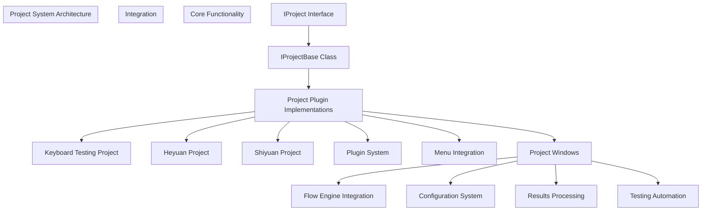
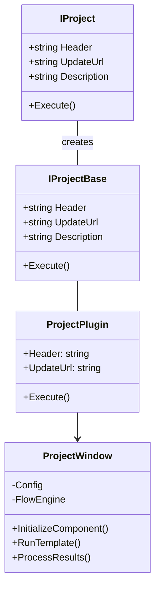
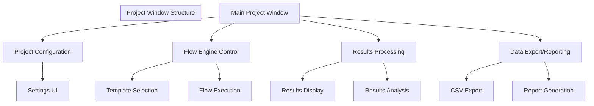
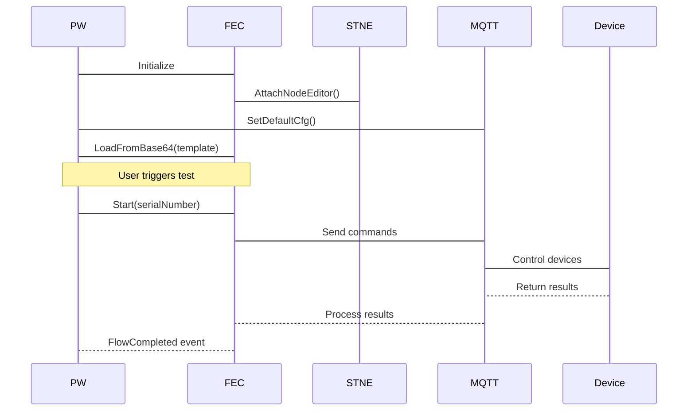
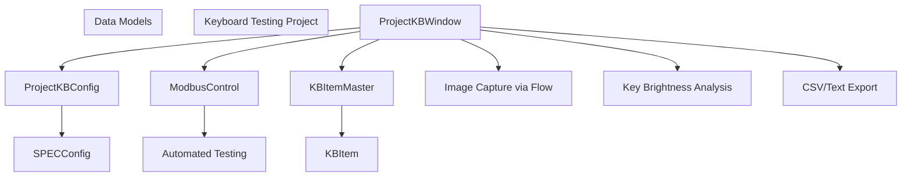
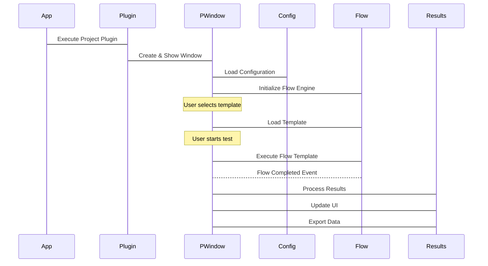

# Project System

> **Relevant source files**
> * [Projects/ProjectBase.bat](https://github.com/xincheng213618/scgd_general_wpf/blob/987af5f7/Projects/ProjectBase.bat)
> * [Projects/ProjectHeyuan.bat](https://github.com/xincheng213618/scgd_general_wpf/blob/987af5f7/Projects/ProjectHeyuan.bat)
> * [Projects/ProjectHeyuan/App.xaml](https://github.com/xincheng213618/scgd_general_wpf/blob/987af5f7/Projects/ProjectHeyuan/App.xaml)
> * [Projects/ProjectHeyuan/App.xaml.cs](https://github.com/xincheng213618/scgd_general_wpf/blob/987af5f7/Projects/ProjectHeyuan/App.xaml.cs)
> * [Projects/ProjectHeyuan/AssemblyInfo.cs](https://github.com/xincheng213618/scgd_general_wpf/blob/987af5f7/Projects/ProjectHeyuan/AssemblyInfo.cs)
> * [Projects/ProjectHeyuan/HYMesManager.cs](https://github.com/xincheng213618/scgd_general_wpf/blob/987af5f7/Projects/ProjectHeyuan/HYMesManager.cs)
> * [Projects/ProjectHeyuan/NumSet.cs](https://github.com/xincheng213618/scgd_general_wpf/blob/987af5f7/Projects/ProjectHeyuan/NumSet.cs)
> * [Projects/ProjectHeyuan/ProjectHeyuan.csproj](https://github.com/xincheng213618/scgd_general_wpf/blob/987af5f7/Projects/ProjectHeyuan/ProjectHeyuan.csproj)
> * [Projects/ProjectHeyuan/ProjectHeyuanWindow.xaml](https://github.com/xincheng213618/scgd_general_wpf/blob/987af5f7/Projects/ProjectHeyuan/ProjectHeyuanWindow.xaml)
> * [Projects/ProjectHeyuan/ProjectHeyuanWindow.xaml.cs](https://github.com/xincheng213618/scgd_general_wpf/blob/987af5f7/Projects/ProjectHeyuan/ProjectHeyuanWindow.xaml.cs)
> * [Projects/ProjectHeyuan/SerialMsg.cs](https://github.com/xincheng213618/scgd_general_wpf/blob/987af5f7/Projects/ProjectHeyuan/SerialMsg.cs)
> * [Projects/ProjectHeyuan/TempResult.cs](https://github.com/xincheng213618/scgd_general_wpf/blob/987af5f7/Projects/ProjectHeyuan/TempResult.cs)
> * [Projects/ProjectKB/App.xaml.cs](https://github.com/xincheng213618/scgd_general_wpf/blob/987af5f7/Projects/ProjectKB/App.xaml.cs)
> * [Projects/ProjectKB/CHANGELOG.md](https://github.com/xincheng213618/scgd_general_wpf/blob/987af5f7/Projects/ProjectKB/CHANGELOG.md)
> * [Projects/ProjectKB/Config/EditProjectKBConfig.xaml](https://github.com/xincheng213618/scgd_general_wpf/blob/987af5f7/Projects/ProjectKB/Config/EditProjectKBConfig.xaml)
> * [Projects/ProjectKB/Config/EditProjectKBConfig.xaml.cs](https://github.com/xincheng213618/scgd_general_wpf/blob/987af5f7/Projects/ProjectKB/Config/EditProjectKBConfig.xaml.cs)
> * [Projects/ProjectKB/Config/SPECConfig.cs](https://github.com/xincheng213618/scgd_general_wpf/blob/987af5f7/Projects/ProjectKB/Config/SPECConfig.cs)
> * [Projects/ProjectKB/Config/SummaryInfo.cs](https://github.com/xincheng213618/scgd_general_wpf/blob/987af5f7/Projects/ProjectKB/Config/SummaryInfo.cs)
> * [Projects/ProjectKB/ConnectConverter.cs](https://github.com/xincheng213618/scgd_general_wpf/blob/987af5f7/Projects/ProjectKB/ConnectConverter.cs)
> * [Projects/ProjectKB/KBItem.cs](https://github.com/xincheng213618/scgd_general_wpf/blob/987af5f7/Projects/ProjectKB/KBItem.cs)
> * [Projects/ProjectKB/KBItemMaster.cs](https://github.com/xincheng213618/scgd_general_wpf/blob/987af5f7/Projects/ProjectKB/KBItemMaster.cs)
> * [Projects/ProjectKB/Modbus/ModbusConfig.cs](https://github.com/xincheng213618/scgd_general_wpf/blob/987af5f7/Projects/ProjectKB/Modbus/ModbusConfig.cs)
> * [Projects/ProjectKB/Modbus/ModbusConnect.xaml](https://github.com/xincheng213618/scgd_general_wpf/blob/987af5f7/Projects/ProjectKB/Modbus/ModbusConnect.xaml)
> * [Projects/ProjectKB/Modbus/ModbusConnect.xaml.cs](https://github.com/xincheng213618/scgd_general_wpf/blob/987af5f7/Projects/ProjectKB/Modbus/ModbusConnect.xaml.cs)
> * [Projects/ProjectKB/Modbus/ModbusControl.cs](https://github.com/xincheng213618/scgd_general_wpf/blob/987af5f7/Projects/ProjectKB/Modbus/ModbusControl.cs)
> * [Projects/ProjectKB/Modbus/ModbusSetting.cs](https://github.com/xincheng213618/scgd_general_wpf/blob/987af5f7/Projects/ProjectKB/Modbus/ModbusSetting.cs)
> * [Projects/ProjectKB/PluginConfig/KBMenu.cs](https://github.com/xincheng213618/scgd_general_wpf/blob/987af5f7/Projects/ProjectKB/PluginConfig/KBMenu.cs)
> * [Projects/ProjectKB/PluginConfig/KBProjectPlugin.cs](https://github.com/xincheng213618/scgd_general_wpf/blob/987af5f7/Projects/ProjectKB/PluginConfig/KBProjectPlugin.cs)
> * [Projects/ProjectKB/PluginConfig/ProjectWindowInstance.cs](https://github.com/xincheng213618/scgd_general_wpf/blob/987af5f7/Projects/ProjectKB/PluginConfig/ProjectWindowInstance.cs)
> * [Projects/ProjectKB/ProjectKB.csproj](https://github.com/xincheng213618/scgd_general_wpf/blob/987af5f7/Projects/ProjectKB/ProjectKB.csproj)
> * [Projects/ProjectKB/ProjectKBConfig.cs](https://github.com/xincheng213618/scgd_general_wpf/blob/987af5f7/Projects/ProjectKB/ProjectKBConfig.cs)
> * [Projects/ProjectKB/ProjectKBWindow.xaml](https://github.com/xincheng213618/scgd_general_wpf/blob/987af5f7/Projects/ProjectKB/ProjectKBWindow.xaml)
> * [Projects/ProjectKB/ProjectKBWindow.xaml.cs](https://github.com/xincheng213618/scgd_general_wpf/blob/987af5f7/Projects/ProjectKB/ProjectKBWindow.xaml.cs)
> * [Projects/ProjectKB/ProjectKBWindowConfig.cs](https://github.com/xincheng213618/scgd_general_wpf/blob/987af5f7/Projects/ProjectKB/ProjectKBWindowConfig.cs)
> * [Projects/ProjectKB/Properties/Resources.Designer.cs](https://github.com/xincheng213618/scgd_general_wpf/blob/987af5f7/Projects/ProjectKB/Properties/Resources.Designer.cs)
> * [Projects/ProjectKB/README.md](https://github.com/xincheng213618/scgd_general_wpf/blob/987af5f7/Projects/ProjectKB/README.md)
> * [Projects/ProjectKB/TestWindow.xaml](https://github.com/xincheng213618/scgd_general_wpf/blob/987af5f7/Projects/ProjectKB/TestWindow.xaml)
> * [Projects/ProjectKB/TestWindow.xaml.cs](https://github.com/xincheng213618/scgd_general_wpf/blob/987af5f7/Projects/ProjectKB/TestWindow.xaml.cs)
> * [Projects/ProjectShiyuan.bat](https://github.com/xincheng213618/scgd_general_wpf/blob/987af5f7/Projects/ProjectShiyuan.bat)
> * [Projects/ProjectShiyuan/App.xaml](https://github.com/xincheng213618/scgd_general_wpf/blob/987af5f7/Projects/ProjectShiyuan/App.xaml)
> * [Projects/ProjectShiyuan/App.xaml.cs](https://github.com/xincheng213618/scgd_general_wpf/blob/987af5f7/Projects/ProjectShiyuan/App.xaml.cs)
> * [Projects/ProjectShiyuan/CHANGELOG.md](https://github.com/xincheng213618/scgd_general_wpf/blob/987af5f7/Projects/ProjectShiyuan/CHANGELOG.md)
> * [Projects/ProjectShiyuan/NumSet.cs](https://github.com/xincheng213618/scgd_general_wpf/blob/987af5f7/Projects/ProjectShiyuan/NumSet.cs)
> * [Projects/ProjectShiyuan/ProjectShiYuanConfig.cs](https://github.com/xincheng213618/scgd_general_wpf/blob/987af5f7/Projects/ProjectShiyuan/ProjectShiYuanConfig.cs)
> * [Projects/ProjectShiyuan/ProjectShiyuan.csproj](https://github.com/xincheng213618/scgd_general_wpf/blob/987af5f7/Projects/ProjectShiyuan/ProjectShiyuan.csproj)
> * [Projects/ProjectShiyuan/SerialMsg.cs](https://github.com/xincheng213618/scgd_general_wpf/blob/987af5f7/Projects/ProjectShiyuan/SerialMsg.cs)
> * [Projects/ProjectShiyuan/ShiyuanProjectExport.cs](https://github.com/xincheng213618/scgd_general_wpf/blob/987af5f7/Projects/ProjectShiyuan/ShiyuanProjectExport.cs)
> * [Projects/ProjectShiyuan/ShiyuanProjectWindow.xaml](https://github.com/xincheng213618/scgd_general_wpf/blob/987af5f7/Projects/ProjectShiyuan/ShiyuanProjectWindow.xaml)
> * [Projects/ProjectShiyuan/ShiyuanProjectWindow.xaml.cs](https://github.com/xincheng213618/scgd_general_wpf/blob/987af5f7/Projects/ProjectShiyuan/ShiyuanProjectWindow.xaml.cs)
> * [Projects/ProjectShiyuan/TempResult.cs](https://github.com/xincheng213618/scgd_general_wpf/blob/987af5f7/Projects/ProjectShiyuan/TempResult.cs)
> * [UI/ColorVision.Common/Interfaces/IProject.cs](https://github.com/xincheng213618/scgd_general_wpf/blob/987af5f7/UI/ColorVision.Common/Interfaces/IProject.cs)

The Project System in ColorVision provides a framework for creating specialized testing and analysis applications. This framework enables developers to build dedicated, self-contained projects for specific testing scenarios while leveraging the core capabilities of the ColorVision platform such as Flow Engine, image processing, and device services.

## Overview

The Project System allows creating specialized applications that can run either independently or as plugins within the main ColorVision application. Each project typically focuses on a specific testing scenario or client requirement, such as keyboard backlight testing or display quality verification.

Sources: [UI/ColorVision.Common/Interfaces/IProject.cs](https://github.com/xincheng213618/scgd_general_wpf/blob/987af5f7/UI/ColorVision.Common/Interfaces/IProject.cs)

 [Projects/ProjectKB/PluginConfig/KBProjectPlugin.cs](https://github.com/xincheng213618/scgd_general_wpf/blob/987af5f7/Projects/ProjectKB/PluginConfig/KBProjectPlugin.cs)

 [Projects/ProjectShiyuan/ShiyuanProjectExport.cs](https://github.com/xincheng213618/scgd_general_wpf/blob/987af5f7/Projects/ProjectShiyuan/ShiyuanProjectExport.cs)

 [Projects/ProjectKB/PluginConfig/KBMenu.cs](https://github.com/xincheng213618/scgd_general_wpf/blob/987af5f7/Projects/ProjectKB/PluginConfig/KBMenu.cs)

## Project System Architecture

### Core Components

The foundation of the Project System is the `IProject` interface and `IProjectBase` abstract class, which define the contract for project implementations:

Sources: [UI/ColorVision.Common/Interfaces/IProject.cs](https://github.com/xincheng213618/scgd_general_wpf/blob/987af5f7/UI/ColorVision.Common/Interfaces/IProject.cs)

 [Projects/ProjectKB/PluginConfig/KBProjectPlugin.cs](https://github.com/xincheng213618/scgd_general_wpf/blob/987af5f7/Projects/ProjectKB/PluginConfig/KBProjectPlugin.cs)

### Project Window

Each project typically has a main window class that serves as the entry point and UI container. The window integrates with:

1. Project configuration
2. Flow Engine for test execution
3. Data processing and visualization
4. Results storage and reporting

Sources: [Projects/ProjectKB/ProjectKBWindow.xaml.cs](https://github.com/xincheng213618/scgd_general_wpf/blob/987af5f7/Projects/ProjectKB/ProjectKBWindow.xaml.cs)

 [Projects/ProjectShiyuan/ShiyuanProjectWindow.xaml.cs](https://github.com/xincheng213618/scgd_general_wpf/blob/987af5f7/Projects/ProjectShiyuan/ShiyuanProjectWindow.xaml.cs)

 [Projects/ProjectHeyuan/ProjectHeyuanWindow.xaml.cs](https://github.com/xincheng213618/scgd_general_wpf/blob/987af5f7/Projects/ProjectHeyuan/ProjectHeyuanWindow.xaml.cs)

### Project Configuration

Each project has its own configuration class that manages project-specific settings. These classes typically:

1. Follow the singleton pattern
2. Use data binding for UI integration
3. Support persistence through the configuration system
4. Provide command handlers for UI actions

Sources: [Projects/ProjectKB/ProjectKBConfig.cs](https://github.com/xincheng213618/scgd_general_wpf/blob/987af5f7/Projects/ProjectKB/ProjectKBConfig.cs)

 [Projects/ProjectShiyuan/ProjectShiYuanConfig.cs](https://github.com/xincheng213618/scgd_general_wpf/blob/987af5f7/Projects/ProjectShiyuan/ProjectShiYuanConfig.cs)

 [Projects/ProjectHeyuan/HYMesManager.cs](https://github.com/xincheng213618/scgd_general_wpf/blob/987af5f7/Projects/ProjectHeyuan/HYMesManager.cs)

## Flow Engine Integration

A key feature of the Project System is integration with the Flow Engine, which enables visual programming of test workflows:

Sources: [Projects/ProjectKB/ProjectKBWindow.xaml.cs

101-317](https://github.com/xincheng213618/scgd_general_wpf/blob/987af5f7/Projects/ProjectKB/ProjectKBWindow.xaml.cs#L101-L317)

 [Projects/ProjectShiyuan/ShiyuanProjectWindow.xaml.cs

172-522](https://github.com/xincheng213618/scgd_general_wpf/blob/987af5f7/Projects/ProjectShiyuan/ShiyuanProjectWindow.xaml.cs#L172-L522)

## Specialized Project Types

### Keyboard Testing (ProjectKB)

The Keyboard Testing project focuses on analyzing keyboard backlight quality through:

1. Image capture of keyboard lighting
2. Analysis of key brightness and uniformity
3. Automated testing via Modbus integration
4. Reporting with pass/fail criteria
5. Data export to CSV and text files

Sources: [Projects/ProjectKB/ProjectKBWindow.xaml.cs](https://github.com/xincheng213618/scgd_general_wpf/blob/987af5f7/Projects/ProjectKB/ProjectKBWindow.xaml.cs)

 [Projects/ProjectKB/ProjectKBConfig.cs](https://github.com/xincheng213618/scgd_general_wpf/blob/987af5f7/Projects/ProjectKB/ProjectKBConfig.cs)

 [Projects/ProjectKB/Modbus/ModbusControl.cs](https://github.com/xincheng213618/scgd_general_wpf/blob/987af5f7/Projects/ProjectKB/Modbus/ModbusControl.cs)

 [Projects/ProjectKB/Config/SPECConfig.cs](https://github.com/xincheng213618/scgd_general_wpf/blob/987af5f7/Projects/ProjectKB/Config/SPECConfig.cs)

The Keyboard Testing project validates keyboard backlighting using criteria like:

* Minimum/maximum key brightness (Lv)
* Average brightness across keys
* Brightness uniformity
* Key contrast ratio (Lc)

Results are processed, visualized, and exported to CSV files and text reports.

Sources: [Projects/ProjectKB/ProjectKBWindow.xaml.cs

319-572](https://github.com/xincheng213618/scgd_general_wpf/blob/987af5f7/Projects/ProjectKB/ProjectKBWindow.xaml.cs#L319-L572)

 [Projects/ProjectKB/KBItemMaster.cs](https://github.com/xincheng213618/scgd_general_wpf/blob/987af5f7/Projects/ProjectKB/KBItemMaster.cs)

### Heyuan Project

The Heyuan Project is a specialized testing system that includes:

1. Integration with Manufacturing Execution Systems (MES)
2. Serial communication for results transfer
3. Multiple test point analysis (White, Blue, Red, Orange)
4. Data collection and reporting

Sources: [Projects/ProjectHeyuan/ProjectHeyuanWindow.xaml.cs](https://github.com/xincheng213618/scgd_general_wpf/blob/987af5f7/Projects/ProjectHeyuan/ProjectHeyuanWindow.xaml.cs)

 [Projects/ProjectHeyuan/HYMesManager.cs](https://github.com/xincheng213618/scgd_general_wpf/blob/987af5f7/Projects/ProjectHeyuan/HYMesManager.cs)

### Shiyuan Project

The Shiyuan Project focuses on:

1. JND (Just Noticeable Difference) analysis
2. CIE color space measurements
3. Results validation against specifications
4. Data export and file management

Sources: [Projects/ProjectShiyuan/ShiyuanProjectWindow.xaml.cs](https://github.com/xincheng213618/scgd_general_wpf/blob/987af5f7/Projects/ProjectShiyuan/ShiyuanProjectWindow.xaml.cs)

 [Projects/ProjectShiyuan/ProjectShiYuanConfig.cs](https://github.com/xincheng213618/scgd_general_wpf/blob/987af5f7/Projects/ProjectShiyuan/ProjectShiYuanConfig.cs)

## Project Lifecycle

The lifecycle of a project from launch to completion follows this general pattern:

Sources: [Projects/ProjectKB/ProjectKBWindow.xaml.cs

219-316](https://github.com/xincheng213618/scgd_general_wpf/blob/987af5f7/Projects/ProjectKB/ProjectKBWindow.xaml.cs#L219-L316)

 [Projects/ProjectShiyuan/ShiyuanProjectWindow.xaml.cs

312-521](https://github.com/xincheng213618/scgd_general_wpf/blob/987af5f7/Projects/ProjectShiyuan/ShiyuanProjectWindow.xaml.cs#L312-L521)

## Implementation Details

### Configuration Management

Projects use a configuration system that:

1. Persists settings between sessions
2. Supports property editing through UI
3. Can export/import settings
4. Provides command bindings for UI actions

Sources: [Projects/ProjectKB/ProjectKBConfig.cs](https://github.com/xincheng213618/scgd_general_wpf/blob/987af5f7/Projects/ProjectKB/ProjectKBConfig.cs)

 [Projects/ProjectKB/Config/EditProjectKBConfig.xaml.cs](https://github.com/xincheng213618/scgd_general_wpf/blob/987af5f7/Projects/ProjectKB/Config/EditProjectKBConfig.xaml.cs)

### Results Processing

Results processing typically involves:

1. Retrieving data from completed flows
2. Analyzing against specifications
3. Generating pass/fail verdicts
4. Visualizing results (highlighting failed points)
5. Exporting data to CSV and other formats

Sources: [Projects/ProjectKB/ProjectKBWindow.xaml.cs

319-626](https://github.com/xincheng213618/scgd_general_wpf/blob/987af5f7/Projects/ProjectKB/ProjectKBWindow.xaml.cs#L319-L626)

 [Projects/ProjectKB/KBItemMaster.cs L14-L117](https://github.com/xincheng213618/scgd_general_wpf/blob/987af5f7/Projects/ProjectKB/KBItemMaster.cs#L14-L117)

### Automation Integration

Projects often integrate with automation systems:

1. Modbus communication (ProjectKB)
2. Serial communication (ProjectHeyuan)
3. File system monitoring
4. External trigger handling

Sources: [Projects/ProjectKB/Modbus/ModbusControl.cs](https://github.com/xincheng213618/scgd_general_wpf/blob/987af5f7/Projects/ProjectKB/Modbus/ModbusControl.cs)

 [Projects/ProjectHeyuan/HYMesManager.cs L65-L293](https://github.com/xincheng213618/scgd_general_wpf/blob/987af5f7/Projects/ProjectHeyuan/HYMesManager.cs#L65-L293)

## Summary

The Project System in ColorVision provides a powerful framework for creating specialized testing applications that leverage core platform capabilities while providing focused, domain-specific functionality. The system's plugin architecture, configuration management, and Flow Engine integration enable a wide range of testing scenarios from keyboard backlighting to display quality validation.

Each project type follows a similar pattern but implements specialized features for its specific testing domain. Common elements include configuration management, Flow Engine integration, results processing, and data export. The flexibility of this architecture allows for continued development of new project types for different testing requirements.