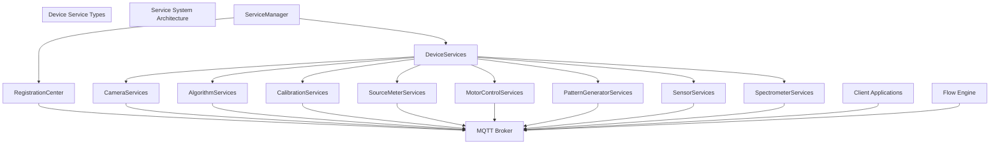
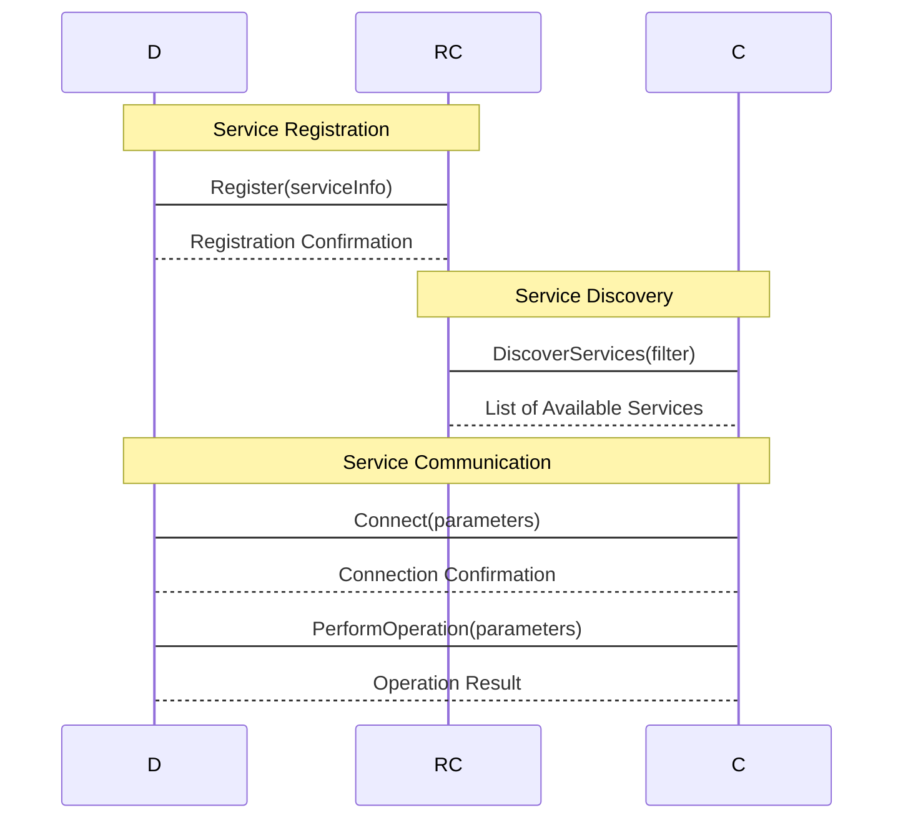
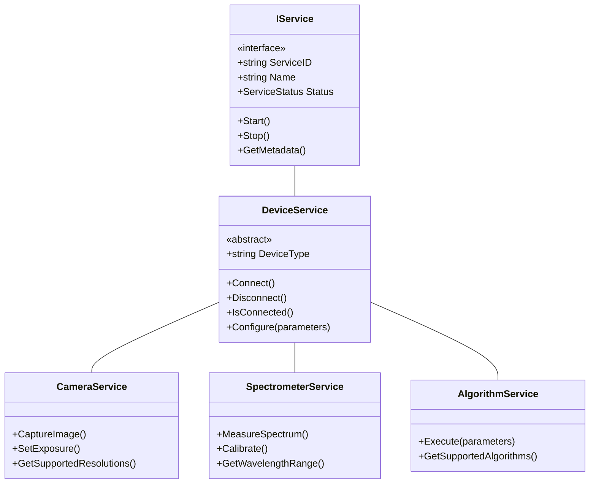
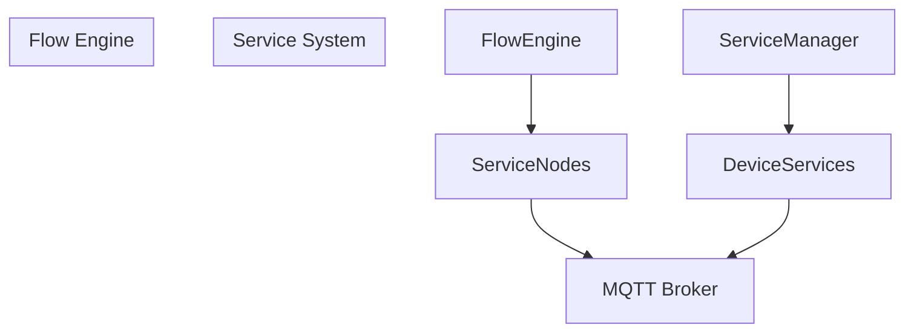
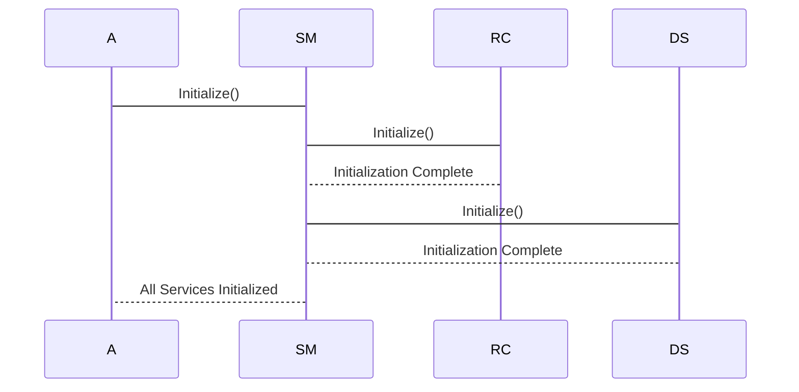

# Service System

> **Relevant source files**
> * [ColorVision/StartWindow.xaml.cs](https://github.com/xincheng213618/scgd_general_wpf/blob/987af5f7/ColorVision/StartWindow.xaml.cs)

## Purpose and Scope

The Service System is a core architectural component of the ColorVision application that provides a unified framework for managing hardware devices and software services. It enables the application to interact with various devices such as cameras, spectrometers, and source meters, as well as software services like image processing algorithms and calibration routines.

This page covers the overall architecture of the Service System, its key components, and how they interact. For specific device implementations, see [Device Services](/xincheng213618/scgd_general_wpf/4.1-device-services). For details on the communication protocol used by services, see [MQTT Communication](/xincheng213618/scgd_general_wpf/4.2-mqtt-communication).

## Architecture Overview

The Service System follows a service-oriented architecture pattern that enables loose coupling between components while providing a standardized way to discover, connect to, and communicate with various services.



*Service System Architecture Diagram*

Sources: [ColorVision/StartWindow.xaml.cs

64-74](https://github.com/xincheng213618/scgd_general_wpf/blob/987af5f7/ColorVision/StartWindow.xaml.cs#L64-L74)

## Key Components

### Service Manager

The Service Manager is the central component that coordinates all services in the system. It is responsible for:

1. Initializing and starting services
2. Managing service lifecycles
3. Maintaining a registry of available services
4. Providing discovery mechanisms for clients

The Service Manager is initialized during application startup through the application's initialization process, which uses a dependency-based topological sorting to ensure services are started in the correct order.

Sources: [ColorVision/StartWindow.xaml.cs

129-179](https://github.com/xincheng213618/scgd_general_wpf/blob/987af5f7/ColorVision/StartWindow.xaml.cs#L129-L179)

### Registration Center

The Registration Center is a specialized service that enables service discovery and registration. It:

1. Allows services to register themselves with metadata
2. Provides discovery mechanisms for clients to find services
3. Maintains service health information
4. Handles service versioning and compatibility



*Service Registration and Discovery Flow*

Sources: [ColorVision/StartWindow.xaml.cs

50-74](https://github.com/xincheng213618/scgd_general_wpf/blob/987af5f7/ColorVision/StartWindow.xaml.cs#L50-L74)

## Device Services

Device Services provide a standardized interface for interacting with different types of hardware and software components. Each device service implements a common interface but has specialized functionality based on the device type it represents.

### Service Hierarchy



*Service Class Hierarchy*

Sources: [ColorVision/StartWindow.xaml.cs

65-74](https://github.com/xincheng213618/scgd_general_wpf/blob/987af5f7/ColorVision/StartWindow.xaml.cs#L65-L74)

## Communication Mechanism

The Service System uses MQTT (Message Queuing Telemetry Transport) as its primary communication protocol. This provides a lightweight publish-subscribe model that enables efficient communication between services and clients.

### MQTT Topic Structure

Services communicate through MQTT topics with a well-defined structure:

```
colorvision/service/{serviceType}/{serviceID}/{operation}
```

For example:

* `colorvision/service/camera/cam001/capture` - Used to trigger image capture
* `colorvision/service/spectrometer/spec001/measure` - Used to trigger spectrum measurement

### Message Format

Services exchange messages using a standardized JSON format:

```
{
  "requestId": "uuid-string",
  "command": "operationName",
  "parameters": {
    "param1": "value1",
    "param2": "value2"
  },
  "timestamp": "ISO-8601-timestamp"
}
```

Response messages follow a similar format with additional result information:

```
{
  "requestId": "uuid-string",
  "status": "success|failure",
  "result": {
    "data": "resultData"
  },
  "errorCode": "errorCodeIfAny",
  "errorMessage": "humanReadableError",
  "timestamp": "ISO-8601-timestamp"
}
```

Sources: [ColorVision/StartWindow.xaml.cs

50-130](https://github.com/xincheng213618/scgd_general_wpf/blob/987af5f7/ColorVision/StartWindow.xaml.cs#L50-L130)

## Integration with Flow Engine

The Service System integrates closely with the Flow Engine, which provides visual programming capabilities for creating complex workflows that involve multiple services.



*Service System Integration with Flow Engine*

Services are represented as nodes in the Flow Engine, allowing users to:

1. Discover available services
2. Configure service parameters
3. Connect services to form processing pipelines
4. Execute operations on services and handle results

This integration enables non-programmers to create sophisticated workflows that leverage the available hardware and software services.

Sources: [ColorVision/StartWindow.xaml.cs

179-218](https://github.com/xincheng213618/scgd_general_wpf/blob/987af5f7/ColorVision/StartWindow.xaml.cs#L179-L218)

## Initialization Process

The Service System is initialized during application startup as part of the overall initialization process. The system uses a dependency-based approach to ensure services are started in the correct order:

1. Service initializers implement the `IInitializer` interface
2. Dependencies between services are declared
3. The application performs topological sorting to determine initialization order
4. Services are initialized in the sorted order
5. The Registration Center starts accepting service registrations
6. Individual services register themselves with the Registration Center



*Service Initialization Sequence*

Sources: [ColorVision/StartWindow.xaml.cs

84-130](https://github.com/xincheng213618/scgd_general_wpf/blob/987af5f7/ColorVision/StartWindow.xaml.cs#L84-L130)

 [ColorVision/StartWindow.xaml.cs

161-179](https://github.com/xincheng213618/scgd_general_wpf/blob/987af5f7/ColorVision/StartWindow.xaml.cs#L161-L179)

## Summary

The Service System provides a flexible and extensible framework for managing hardware devices and software services in the ColorVision application. By leveraging a service-oriented architecture and MQTT communication, it enables loose coupling between components while providing a standardized way to discover and interact with services.

Key benefits of the Service System include:

1. Standardized interfaces for all types of devices
2. Dynamic discovery and registration of services
3. Lightweight, efficient communication using MQTT
4. Seamless integration with the Flow Engine for visual programming
5. Scalability to support new device types and services

This architecture allows the ColorVision application to adapt to different hardware configurations and use cases while maintaining a consistent user experience.