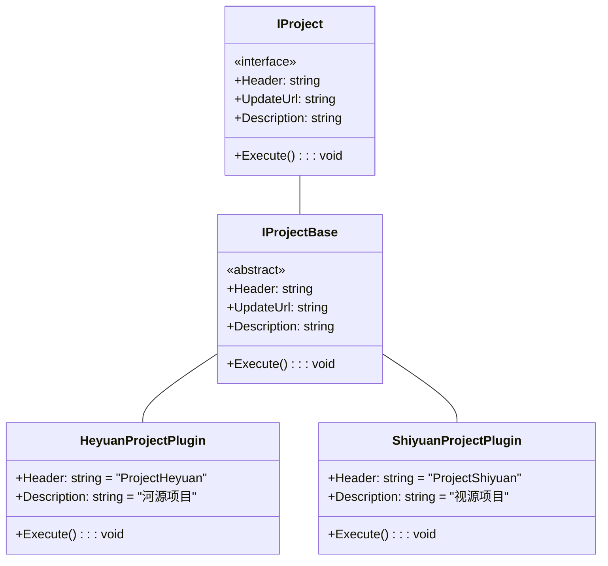
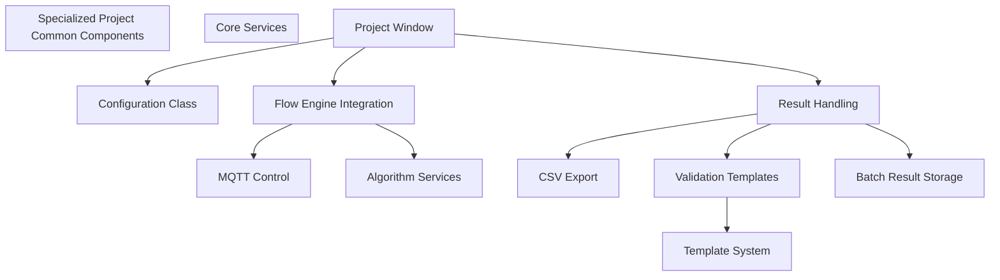
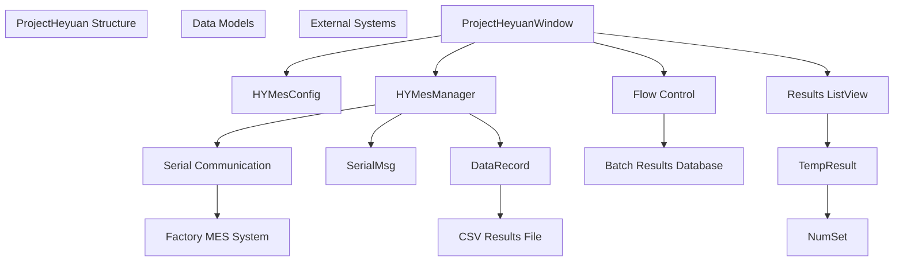
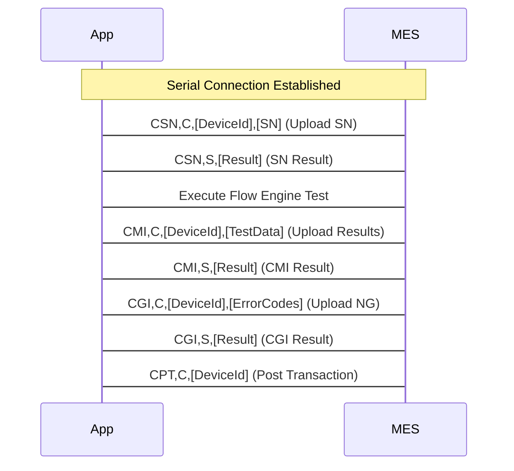
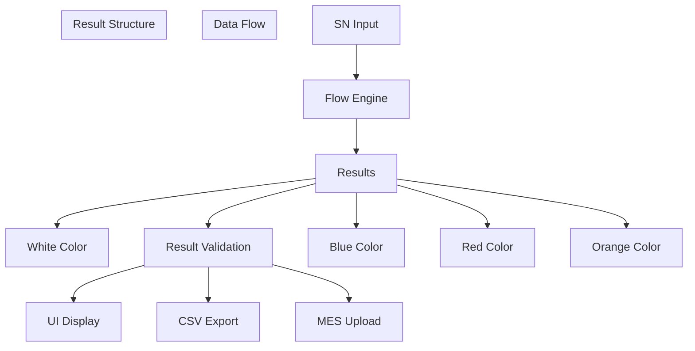
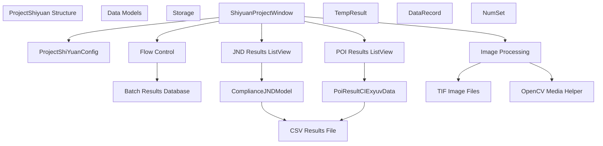
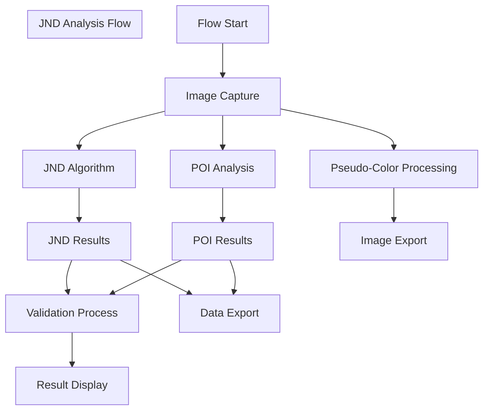
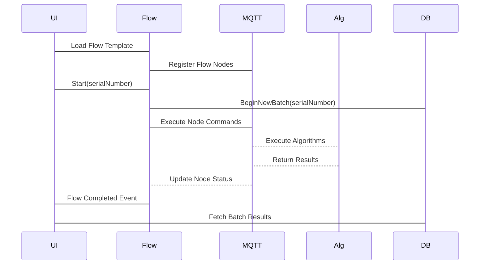
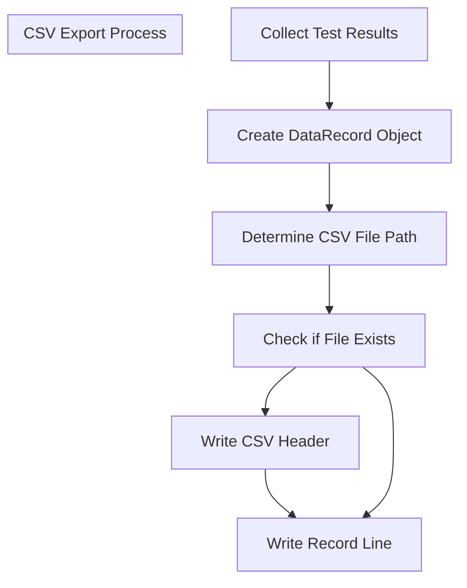
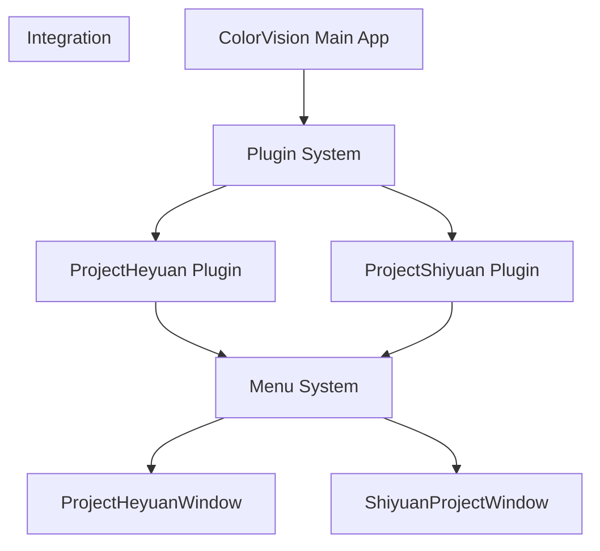

# Specialized Projects

> **Relevant source files**
> * [Projects/ProjectBase.bat](https://github.com/xincheng213618/scgd_general_wpf/blob/987af5f7/Projects/ProjectBase.bat)
> * [Projects/ProjectHeyuan.bat](https://github.com/xincheng213618/scgd_general_wpf/blob/987af5f7/Projects/ProjectHeyuan.bat)
> * [Projects/ProjectHeyuan/App.xaml](https://github.com/xincheng213618/scgd_general_wpf/blob/987af5f7/Projects/ProjectHeyuan/App.xaml)
> * [Projects/ProjectHeyuan/App.xaml.cs](https://github.com/xincheng213618/scgd_general_wpf/blob/987af5f7/Projects/ProjectHeyuan/App.xaml.cs)
> * [Projects/ProjectHeyuan/AssemblyInfo.cs](https://github.com/xincheng213618/scgd_general_wpf/blob/987af5f7/Projects/ProjectHeyuan/AssemblyInfo.cs)
> * [Projects/ProjectHeyuan/HYMesManager.cs](https://github.com/xincheng213618/scgd_general_wpf/blob/987af5f7/Projects/ProjectHeyuan/HYMesManager.cs)
> * [Projects/ProjectHeyuan/NumSet.cs](https://github.com/xincheng213618/scgd_general_wpf/blob/987af5f7/Projects/ProjectHeyuan/NumSet.cs)
> * [Projects/ProjectHeyuan/ProjectHeyuan.csproj](https://github.com/xincheng213618/scgd_general_wpf/blob/987af5f7/Projects/ProjectHeyuan/ProjectHeyuan.csproj)
> * [Projects/ProjectHeyuan/ProjectHeyuanWindow.xaml](https://github.com/xincheng213618/scgd_general_wpf/blob/987af5f7/Projects/ProjectHeyuan/ProjectHeyuanWindow.xaml)
> * [Projects/ProjectHeyuan/ProjectHeyuanWindow.xaml.cs](https://github.com/xincheng213618/scgd_general_wpf/blob/987af5f7/Projects/ProjectHeyuan/ProjectHeyuanWindow.xaml.cs)
> * [Projects/ProjectHeyuan/SerialMsg.cs](https://github.com/xincheng213618/scgd_general_wpf/blob/987af5f7/Projects/ProjectHeyuan/SerialMsg.cs)
> * [Projects/ProjectHeyuan/TempResult.cs](https://github.com/xincheng213618/scgd_general_wpf/blob/987af5f7/Projects/ProjectHeyuan/TempResult.cs)
> * [Projects/ProjectShiyuan.bat](https://github.com/xincheng213618/scgd_general_wpf/blob/987af5f7/Projects/ProjectShiyuan.bat)
> * [Projects/ProjectShiyuan/App.xaml](https://github.com/xincheng213618/scgd_general_wpf/blob/987af5f7/Projects/ProjectShiyuan/App.xaml)
> * [Projects/ProjectShiyuan/App.xaml.cs](https://github.com/xincheng213618/scgd_general_wpf/blob/987af5f7/Projects/ProjectShiyuan/App.xaml.cs)
> * [Projects/ProjectShiyuan/CHANGELOG.md](https://github.com/xincheng213618/scgd_general_wpf/blob/987af5f7/Projects/ProjectShiyuan/CHANGELOG.md)
> * [Projects/ProjectShiyuan/NumSet.cs](https://github.com/xincheng213618/scgd_general_wpf/blob/987af5f7/Projects/ProjectShiyuan/NumSet.cs)
> * [Projects/ProjectShiyuan/ProjectShiYuanConfig.cs](https://github.com/xincheng213618/scgd_general_wpf/blob/987af5f7/Projects/ProjectShiyuan/ProjectShiYuanConfig.cs)
> * [Projects/ProjectShiyuan/ProjectShiyuan.csproj](https://github.com/xincheng213618/scgd_general_wpf/blob/987af5f7/Projects/ProjectShiyuan/ProjectShiyuan.csproj)
> * [Projects/ProjectShiyuan/SerialMsg.cs](https://github.com/xincheng213618/scgd_general_wpf/blob/987af5f7/Projects/ProjectShiyuan/SerialMsg.cs)
> * [Projects/ProjectShiyuan/ShiyuanProjectExport.cs](https://github.com/xincheng213618/scgd_general_wpf/blob/987af5f7/Projects/ProjectShiyuan/ShiyuanProjectExport.cs)
> * [Projects/ProjectShiyuan/ShiyuanProjectWindow.xaml](https://github.com/xincheng213618/scgd_general_wpf/blob/987af5f7/Projects/ProjectShiyuan/ShiyuanProjectWindow.xaml)
> * [Projects/ProjectShiyuan/ShiyuanProjectWindow.xaml.cs](https://github.com/xincheng213618/scgd_general_wpf/blob/987af5f7/Projects/ProjectShiyuan/ShiyuanProjectWindow.xaml.cs)
> * [Projects/ProjectShiyuan/TempResult.cs](https://github.com/xincheng213618/scgd_general_wpf/blob/987af5f7/Projects/ProjectShiyuan/TempResult.cs)
> * [UI/ColorVision.Common/Interfaces/IProject.cs](https://github.com/xincheng213618/scgd_general_wpf/blob/987af5f7/UI/ColorVision.Common/Interfaces/IProject.cs)

## Introduction

The Specialized Projects module provides project-specific implementations for targeted testing and analysis workflows in the ColorVision system. Unlike the general-purpose components, these specialized projects are designed for specific industrial applications with customized interfaces, specialized testing flows, and dedicated result handling capabilities.

This page documents the two primary specialized project implementations: ProjectHeyuan and ProjectShiyuan, which are designed for display testing with different industry-specific requirements.

Sources: [Projects/ProjectHeyuan/ProjectHeyuanWindow.xaml.cs](https://github.com/xincheng213618/scgd_general_wpf/blob/987af5f7/Projects/ProjectHeyuan/ProjectHeyuanWindow.xaml.cs)

 [Projects/ProjectShiyuan/ShiyuanProjectWindow.xaml.cs](https://github.com/xincheng213618/scgd_general_wpf/blob/987af5f7/Projects/ProjectShiyuan/ShiyuanProjectWindow.xaml.cs)

## Architecture Overview

Specialized projects in ColorVision are implemented as plugins that integrate with the main application through the plugin system. Each project implements the `IProject` interface, which allows them to be loaded and executed from the main application menu.

Sources: [UI/ColorVision.Common/Interfaces/IProject.cs](https://github.com/xincheng213618/scgd_general_wpf/blob/987af5f7/UI/ColorVision.Common/Interfaces/IProject.cs)

 [Projects/ProjectShiyuan/ShiyuanProjectExport.cs](https://github.com/xincheng213618/scgd_general_wpf/blob/987af5f7/Projects/ProjectShiyuan/ShiyuanProjectExport.cs)

### Common Architecture Components

Both specialized projects share common architectural components while implementing their industry-specific requirements:

Sources: [Projects/ProjectHeyuan/ProjectHeyuanWindow.xaml.cs

146-153](https://github.com/xincheng213618/scgd_general_wpf/blob/987af5f7/Projects/ProjectHeyuan/ProjectHeyuanWindow.xaml.cs#L146-L153)

 [Projects/ProjectShiyuan/ShiyuanProjectWindow.xaml.cs

161-175](https://github.com/xincheng213618/scgd_general_wpf/blob/987af5f7/Projects/ProjectShiyuan/ShiyuanProjectWindow.xaml.cs#L161-L175)

## ProjectHeyuan

ProjectHeyuan is a specialized application for display color testing with integrated Manufacturing Execution System (MES) communication capabilities. It facilitates automated testing of display panels, recording color measurements (x, y, luminance, dominant wavelength), and communicating results to a factory MES system.

### ProjectHeyuan Components

Sources: [Projects/ProjectHeyuan/ProjectHeyuanWindow.xaml.cs

144-152](https://github.com/xincheng213618/scgd_general_wpf/blob/987af5f7/Projects/ProjectHeyuan/ProjectHeyuanWindow.xaml.cs#L144-L152)

 [Projects/ProjectHeyuan/HYMesManager.cs L61-L69](https://github.com/xincheng213618/scgd_general_wpf/blob/987af5f7/Projects/ProjectHeyuan/HYMesManager.cs#L61-L69)

### MES Communication

ProjectHeyuan communicates with factory MES systems using serial communication. It implements a protocol using STX/ETX framing (Start of Text/End of Text) for message integrity.

Sources: [Projects/ProjectHeyuan/HYMesManager.cs L224-L256](https://github.com/xincheng213618/scgd_general_wpf/blob/987af5f7/Projects/ProjectHeyuan/HYMesManager.cs#L224-L256)

### Data Collection and Results

ProjectHeyuan collects test data through the Flow Engine, processes the results through validation templates, and then outputs results to both the user interface and CSV files.

The primary data flow is:

1. Capture serial number input
2. Execute the selected flow template
3. Collect results from POI (Point of Interest) and compliance algorithms
4. Validate results against configured thresholds
5. Display results to the user
6. Export results to CSV
7. Upload results to MES system

Sources: [Projects/ProjectHeyuan/ProjectHeyuanWindow.xaml.cs

273-483](https://github.com/xincheng213618/scgd_general_wpf/blob/987af5f7/Projects/ProjectHeyuan/ProjectHeyuanWindow.xaml.cs#L273-L483)

 [Projects/ProjectHeyuan/CsvHandler.cs L83-L138](https://github.com/xincheng213618/scgd_general_wpf/blob/987af5f7/Projects/ProjectHeyuan/CsvHandler.cs#L83-L138)

## ProjectShiyuan

ProjectShiyuan is a specialized application focusing on advanced display analysis with particular emphasis on JND (Just Noticeable Difference) evaluation and image analysis. It's designed for quality control in display manufacturing with comprehensive result visualization and data export capabilities.

### ProjectShiyuan Components

Sources: [Projects/ProjectShiyuan/ShiyuanProjectWindow.xaml.cs

161-178](https://github.com/xincheng213618/scgd_general_wpf/blob/987af5f7/Projects/ProjectShiyuan/ShiyuanProjectWindow.xaml.cs#L161-L178)

 [Projects/ProjectShiyuan/ProjectShiYuanConfig.cs L11-L17](https://github.com/xincheng213618/scgd_general_wpf/blob/987af5f7/Projects/ProjectShiyuan/ProjectShiYuanConfig.cs#L11-L17)

### JND Analysis Workflow

ProjectShiyuan includes specialized workflows for JND (Just Noticeable Difference) analysis in display quality testing:

Sources: [Projects/ProjectShiyuan/ShiyuanProjectWindow.xaml.cs

334-375](https://github.com/xincheng213618/scgd_general_wpf/blob/987af5f7/Projects/ProjectShiyuan/ShiyuanProjectWindow.xaml.cs#L334-L375)

 [Projects/ProjectShiyuan/ShiyuanProjectWindow.xaml.cs

435-488](https://github.com/xincheng213618/scgd_general_wpf/blob/987af5f7/Projects/ProjectShiyuan/ShiyuanProjectWindow.xaml.cs#L435-L488)

### Image Processing Capabilities

ProjectShiyuan integrates with OpenCV for advanced image processing, particularly for visualizing results such as pseudocolor transformations of JND maps.

The system processes several types of images:

* Horizontal gap images (h_gap)
* Vertical gap images (v_gap)
* Luminance maps
* JND visualization maps

It performs the following operations:

1. Loads source images (typically TIF format)
2. Applies pseudocolor transformations using OpenCV
3. Saves both original and processed images with timestamps and product identification
4. Organizes results for later analysis

Sources: [Projects/ProjectShiyuan/ShiyuanProjectWindow.xaml.cs

442-487](https://github.com/xincheng213618/scgd_general_wpf/blob/987af5f7/Projects/ProjectShiyuan/ShiyuanProjectWindow.xaml.cs#L442-L487)

## Common Implementation Details

### Result Data Structure

Both projects use a similar structure for storing and validating results:

| Class | Purpose | Key Properties |
| --- | --- | --- |
| `TempResult` | Stores test result data | Name, Result (pass/fail), X, Y, Lv, Dw |
| `NumSet` | Stores numeric values with validation ranges | Value, ValMin, ValMax |
| `DataRecord` | CSV record structure | SequenceNumber, ProductID, Date, Color measurements |
| `PoiResultCIExyuvData` | Color measurement from POI | x, y, Y (luminance), Wave, CCT |

### Flow Engine Integration

Both specialized projects integrate with the Flow Engine system for test execution:

1. Load flow templates from configuration
2. Configure flow with device tokens and parameters
3. Set up event handlers for flow execution updates
4. Execute flow with unique batch identifier
5. Process results after flow completion

Sources: [Projects/ProjectHeyuan/ProjectHeyuanWindow.xaml.cs

485-550](https://github.com/xincheng213618/scgd_general_wpf/blob/987af5f7/Projects/ProjectHeyuan/ProjectHeyuanWindow.xaml.cs#L485-L550)

 [Projects/ProjectShiyuan/ShiyuanProjectWindow.xaml.cs

524-562](https://github.com/xincheng213618/scgd_general_wpf/blob/987af5f7/Projects/ProjectShiyuan/ShiyuanProjectWindow.xaml.cs#L524-L562)

### CSV Data Export

Both projects implement CSV export functionality for result archiving and analysis:

Sources: [Projects/ProjectHeyuan/CsvHandler.cs L123-L137](https://github.com/xincheng213618/scgd_general_wpf/blob/987af5f7/Projects/ProjectHeyuan/CsvHandler.cs#L123-L137)

 [Projects/ProjectShiyuan/ShiyuanProjectWindow.xaml.cs

431-432](https://github.com/xincheng213618/scgd_general_wpf/blob/987af5f7/Projects/ProjectShiyuan/ShiyuanProjectWindow.xaml.cs#L431-L432)

## Deployment and Integration

The specialized projects are built as standalone plugin DLLs that are loaded by the main ColorVision application. Each project implements the necessary interfaces to integrate with the plugin system.

The build process for these plugins includes:

1. Building the project DLL
2. Copying the DLL to the Plugins directory in both Debug and Release configurations
3. Including any necessary resources and dependencies

Sources: [Projects/ProjectHeyuan/ProjectHeyuan.csproj L30-L32](https://github.com/xincheng213618/scgd_general_wpf/blob/987af5f7/Projects/ProjectHeyuan/ProjectHeyuan.csproj#L30-L32)

 [Projects/ProjectShiyuan/ProjectShiyuan.csproj L66-L68](https://github.com/xincheng213618/scgd_general_wpf/blob/987af5f7/Projects/ProjectShiyuan/ProjectShiyuan.csproj#L66-L68)

## Conclusion

The Specialized Projects module provides industry-specific implementations that build upon the core ColorVision framework. ProjectHeyuan focuses on display testing with MES integration for production environments, while ProjectShiyuan emphasizes advanced image analysis with JND evaluation for detailed quality assessment.

Both projects demonstrate how the ColorVision architecture can be extended to meet specific industry requirements through the plugin system, while maintaining integration with core services like the Flow Engine, MQTT communication, and database systems.

These specialized projects serve as examples for developing custom solutions on top of the ColorVision platform for specific testing and analysis requirements in different industries.