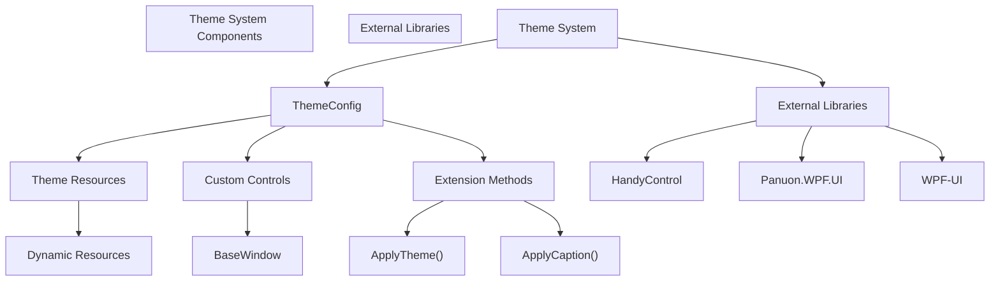
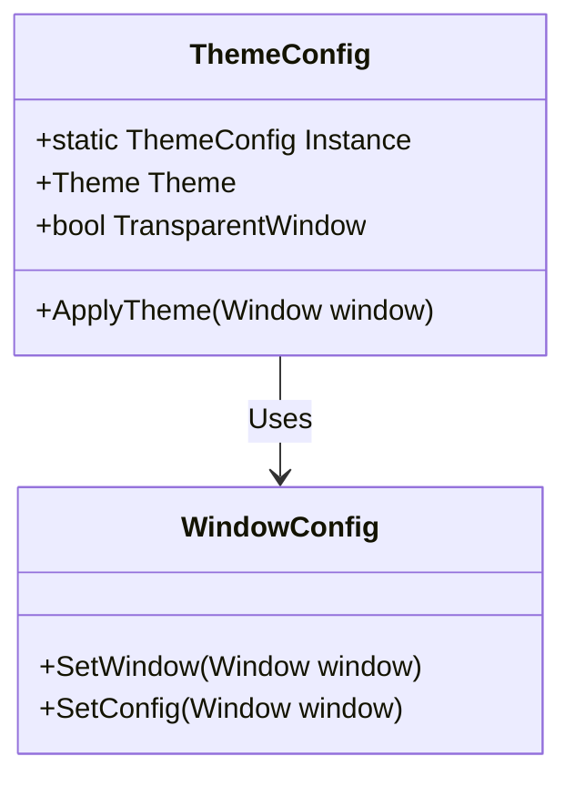
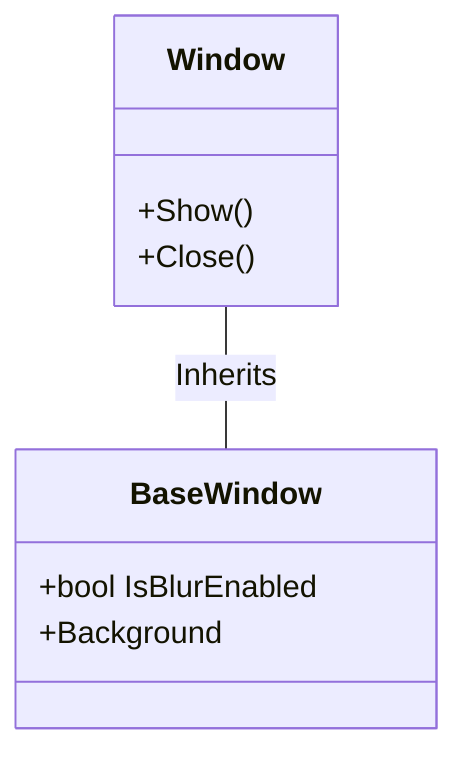
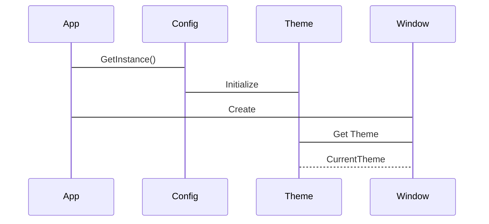
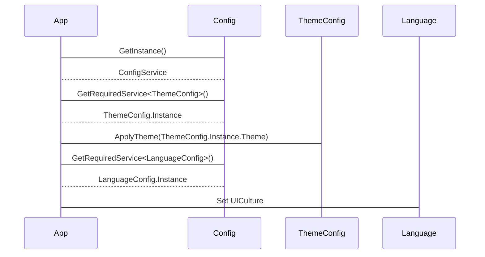
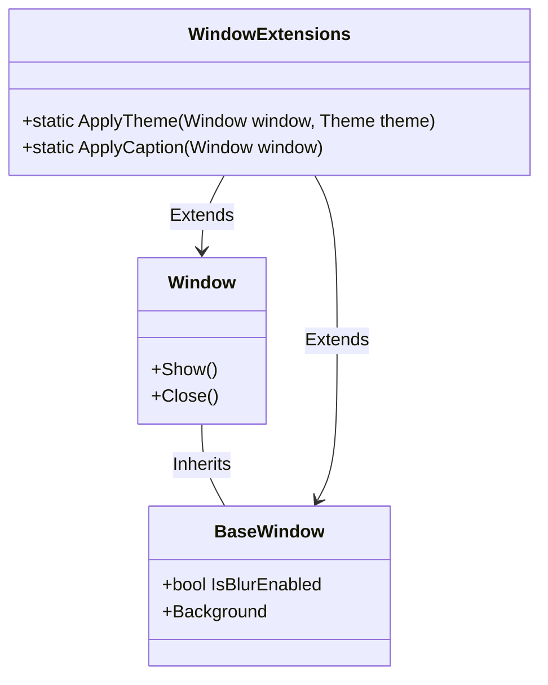

# Theme System

> **Relevant source files**
> * [ColorVision/AboutMsg.xaml](https://github.com/xincheng213618/scgd_general_wpf/blob/987af5f7/ColorVision/AboutMsg.xaml)
> * [ColorVision/AboutMsg.xaml.cs](https://github.com/xincheng213618/scgd_general_wpf/blob/987af5f7/ColorVision/AboutMsg.xaml.cs)
> * [Engine/CVImageChannelLib/CVImageChannelLib.csproj](https://github.com/xincheng213618/scgd_general_wpf/blob/987af5f7/Engine/CVImageChannelLib/CVImageChannelLib.csproj)
> * [Engine/ColorVision.Engine/Assets/Tool/UsbTreeView.exe](https://github.com/xincheng213618/scgd_general_wpf/blob/987af5f7/Engine/ColorVision.Engine/Assets/Tool/UsbTreeView.exe)
> * [Engine/ColorVision.Engine/Assets/Tool/sscom5.13.1.exe](https://github.com/xincheng213618/scgd_general_wpf/blob/987af5f7/Engine/ColorVision.Engine/Assets/Tool/sscom5.13.1.exe)
> * [Engine/ColorVision.Engine/ColorVision.Engine.csproj](https://github.com/xincheng213618/scgd_general_wpf/blob/987af5f7/Engine/ColorVision.Engine/ColorVision.Engine.csproj)
> * [Engine/ColorVision.Engine/Impl/CVFile/FileProcessorCVCIE.cs](https://github.com/xincheng213618/scgd_general_wpf/blob/987af5f7/Engine/ColorVision.Engine/Impl/CVFile/FileProcessorCVCIE.cs)
> * [Engine/ColorVision.Engine/Impl/CVFile/FileProcessorCVRaw.cs](https://github.com/xincheng213618/scgd_general_wpf/blob/987af5f7/Engine/ColorVision.Engine/Impl/CVFile/FileProcessorCVRaw.cs)
> * [Engine/ColorVision.Engine/Media/Export/ExportCVCIE.xaml.cs](https://github.com/xincheng213618/scgd_general_wpf/blob/987af5f7/Engine/ColorVision.Engine/Media/Export/ExportCVCIE.xaml.cs)
> * [Engine/ColorVision.Engine/Media/Export/VExportCIE.cs](https://github.com/xincheng213618/scgd_general_wpf/blob/987af5f7/Engine/ColorVision.Engine/Media/Export/VExportCIE.cs)
> * [Engine/ColorVision.Engine/Services/PhyCameras/PhyCameraManagerWindow.xaml](https://github.com/xincheng213618/scgd_general_wpf/blob/987af5f7/Engine/ColorVision.Engine/Services/PhyCameras/PhyCameraManagerWindow.xaml)
> * [Engine/ColorVision.Engine/Services/PhyCameras/PhyCameraManagerWindow.xaml.cs](https://github.com/xincheng213618/scgd_general_wpf/blob/987af5f7/Engine/ColorVision.Engine/Services/PhyCameras/PhyCameraManagerWindow.xaml.cs)
> * [Engine/ColorVision.Engine/Templates/Validate/TemplateComplyParam.cs](https://github.com/xincheng213618/scgd_general_wpf/blob/987af5f7/Engine/ColorVision.Engine/Templates/Validate/TemplateComplyParam.cs)
> * [Engine/ColorVision.Engine/ToolPlugins/LedTool.cs](https://github.com/xincheng213618/scgd_general_wpf/blob/987af5f7/Engine/ColorVision.Engine/ToolPlugins/LedTool.cs)
> * [Engine/ColorVision.Engine/ToolPlugins/USBtool.cs](https://github.com/xincheng213618/scgd_general_wpf/blob/987af5f7/Engine/ColorVision.Engine/ToolPlugins/USBtool.cs)
> * [UI/ColorVision.Common/Authorizations/PermissionMode.cs](https://github.com/xincheng213618/scgd_general_wpf/blob/987af5f7/UI/ColorVision.Common/Authorizations/PermissionMode.cs)
> * [UI/ColorVision.Common/ColorVision.Common.csproj](https://github.com/xincheng213618/scgd_general_wpf/blob/987af5f7/UI/ColorVision.Common/ColorVision.Common.csproj)
> * [UI/ColorVision.Common/README.md](https://github.com/xincheng213618/scgd_general_wpf/blob/987af5f7/UI/ColorVision.Common/README.md)
> * [UI/ColorVision.Core/ColorVision.Core.csproj](https://github.com/xincheng213618/scgd_general_wpf/blob/987af5f7/UI/ColorVision.Core/ColorVision.Core.csproj)
> * [UI/ColorVision.Core/README.md](https://github.com/xincheng213618/scgd_general_wpf/blob/987af5f7/UI/ColorVision.Core/README.md)
> * [UI/ColorVision.ImageEditor/ColorVision.ImageEditor.csproj](https://github.com/xincheng213618/scgd_general_wpf/blob/987af5f7/UI/ColorVision.ImageEditor/ColorVision.ImageEditor.csproj)
> * [UI/ColorVision.Scheduler/ColorVision.Scheduler.csproj](https://github.com/xincheng213618/scgd_general_wpf/blob/987af5f7/UI/ColorVision.Scheduler/ColorVision.Scheduler.csproj)
> * [UI/ColorVision.Solution/ColorVision.Solution.csproj](https://github.com/xincheng213618/scgd_general_wpf/blob/987af5f7/UI/ColorVision.Solution/ColorVision.Solution.csproj)
> * [UI/ColorVision.Themes/ColorVision.Themes.csproj](https://github.com/xincheng213618/scgd_general_wpf/blob/987af5f7/UI/ColorVision.Themes/ColorVision.Themes.csproj)
> * [UI/ColorVision.UI/ColorVision.UI.csproj](https://github.com/xincheng213618/scgd_general_wpf/blob/987af5f7/UI/ColorVision.UI/ColorVision.UI.csproj)
> * [UI/ColorVision.UI/README.md](https://github.com/xincheng213618/scgd_general_wpf/blob/987af5f7/UI/ColorVision.UI/README.md)
> * [UI/Directory.Build.props](https://github.com/xincheng213618/scgd_general_wpf/blob/987af5f7/UI/Directory.Build.props)

The ColorVision Theme System provides a unified framework for managing the visual appearance of the application, ensuring consistent styling across different windows and controls. It enables dynamic theme switching, transparency effects, and custom styling of UI elements.

## Overview

The Theme System is built on top of WPF's resource dictionary mechanism, extended with several third-party UI libraries to enhance the visual experience. It consists of centralized theme configuration, theme resources, custom controls, and extension methods for easily applying themes to different parts of the application.



Sources:

* [UI/ColorVision.Themes/ColorVision.Themes.csproj

24-27](https://github.com/xincheng213618/scgd_general_wpf/blob/987af5f7/UI/ColorVision.Themes/ColorVision.Themes.csproj#L24-L27)
* [ColorVision/AboutMsg.xaml.cs

46](https://github.com/xincheng213618/scgd_general_wpf/blob/987af5f7/ColorVision/AboutMsg.xaml.cs#L46-L46)
* [Engine/ColorVision.Engine/Services/PhyCameras/PhyCameraManagerWindow.xaml.cs

41-43](https://github.com/xincheng213618/scgd_general_wpf/blob/987af5f7/Engine/ColorVision.Engine/Services/PhyCameras/PhyCameraManagerWindow.xaml.cs#L41-L43)

## Theme Configuration

The theme system is primarily controlled through the `ThemeConfig` singleton class, which maintains theme settings and provides access to theme properties.

### Key Configuration Properties

* **Theme** - The current application theme
* **TransparentWindow** - Controls whether windows support transparency effects



Sources:

* [ColorVision/AboutMsg.xaml.cs

46](https://github.com/xincheng213618/scgd_general_wpf/blob/987af5f7/ColorVision/AboutMsg.xaml.cs#L46-L46)
* [UI/ColorVision.UI/README.md

16](https://github.com/xincheng213618/scgd_general_wpf/blob/987af5f7/UI/ColorVision.UI/README.md#L16-L16)
* [Engine/ColorVision.Engine/Services/PhyCameras/PhyCameraManagerWindow.xaml.cs

41-43](https://github.com/xincheng213618/scgd_general_wpf/blob/987af5f7/Engine/ColorVision.Engine/Services/PhyCameras/PhyCameraManagerWindow.xaml.cs#L41-L43)

## Custom Controls

The theme system provides a set of custom controls that are pre-styled and integrated with the theming framework. These controls automatically adapt their appearance based on the current theme.

### BaseWindow

`BaseWindow` is a core component that extends the standard WPF Window with additional theme-aware capabilities:

* Built-in blur effect support via the `IsBlurEnabled` property
* Theme-specific styling for window elements
* Integrated caption support



Sources:

* [ColorVision/AboutMsg.xaml L1-L10](https://github.com/xincheng213618/scgd_general_wpf/blob/987af5f7/ColorVision/AboutMsg.xaml#L1-L10)
* [ColorVision/AboutMsg.xaml.cs

46-47](https://github.com/xincheng213618/scgd_general_wpf/blob/987af5f7/ColorVision/AboutMsg.xaml.cs#L46-L47)

## Dynamic Resources

The theme system uses WPF's dynamic resource system to provide theme-aware styling that can change at runtime. These resources are referenced in XAML using the `DynamicResource` markup extension.

### Common Resources

* **GlobalBackground** - The main application background
* **GlobalTextBrush** - The standard text color

```
<Style TargetType="{x:Type TextBlock}">
    <Setter Property="Foreground" Value="{DynamicResource GlobalTextBrush}"/>
</Style>
```

Sources:

* [ColorVision/AboutMsg.xaml L13-L15](https://github.com/xincheng213618/scgd_general_wpf/blob/987af5f7/ColorVision/AboutMsg.xaml#L13-L15)
* [Engine/ColorVision.Engine/Services/PhyCameras/PhyCameraManagerWindow.xaml

10](https://github.com/xincheng213618/scgd_general_wpf/blob/987af5f7/Engine/ColorVision.Engine/Services/PhyCameras/PhyCameraManagerWindow.xaml#L10-L10)

## Applying Themes

The theme system provides extension methods to easily apply themes to windows and controls.

### Apply Theme to Windows

```
// Apply the current theme to a window
this.ApplyTheme(ThemeConfig.Instance.Theme);

// Apply caption styling
this.ApplyCaption();
```

### Theme Settings Persistence

Theme settings are stored as part of the application configuration system, allowing them to persist between application sessions.



Sources:

* [Engine/ColorVision.Engine/Services/PhyCameras/PhyCameraManagerWindow.xaml.cs

41-43](https://github.com/xincheng213618/scgd_general_wpf/blob/987af5f7/Engine/ColorVision.Engine/Services/PhyCameras/PhyCameraManagerWindow.xaml.cs#L41-L43)
* [UI/ColorVision.UI/README.md

8-18](https://github.com/xincheng213618/scgd_general_wpf/blob/987af5f7/UI/ColorVision.UI/README.md#L8-L18)

## Theme System Architecture

The theme system is integrated with the overall application architecture and interacts with several other subsystems.

```

```

Sources:

* [UI/ColorVision.Themes/ColorVision.Themes.csproj

24-27](https://github.com/xincheng213618/scgd_general_wpf/blob/987af5f7/UI/ColorVision.Themes/ColorVision.Themes.csproj#L24-L27)
* [UI/ColorVision.UI/ColorVision.UI.csproj

30](https://github.com/xincheng213618/scgd_general_wpf/blob/987af5f7/UI/ColorVision.UI/ColorVision.UI.csproj#L30-L30)
* [UI/ColorVision.UI/README.md

8-18](https://github.com/xincheng213618/scgd_general_wpf/blob/987af5f7/UI/ColorVision.UI/README.md#L8-L18)

## Transparency Effects

The theme system includes support for window transparency and blur effects, controlled through the `ThemeConfig.TransparentWindow` property and the `IsBlurEnabled` property on `BaseWindow`.

```
// In a window constructor
IsBlurEnabled = ThemeConfig.Instance.TransparentWindow && IsBlurEnabled;
Background = IsBlurEnabled ? Background : Brushes.Gray;
```

This allows windows to have a translucent appearance with a blur effect applied to the background when supported by the system.

Sources:

* [ColorVision/AboutMsg.xaml.cs

46-47](https://github.com/xincheng213618/scgd_general_wpf/blob/987af5f7/ColorVision/AboutMsg.xaml.cs#L46-L47)
* [ColorVision/AboutMsg.xaml

11](https://github.com/xincheng213618/scgd_general_wpf/blob/987af5f7/ColorVision/AboutMsg.xaml#L11-L11)

## Integration with Configuration System

The theme system is integrated with the application's configuration system, allowing theme settings to be saved and loaded automatically.



Sources:

* [UI/ColorVision.UI/README.md

8-18](https://github.com/xincheng213618/scgd_general_wpf/blob/987af5f7/UI/ColorVision.UI/README.md#L8-L18)
* [Engine/ColorVision.Engine/Services/PhyCameras/PhyCameraManagerWindow.xaml.cs

37](https://github.com/xincheng213618/scgd_general_wpf/blob/987af5f7/Engine/ColorVision.Engine/Services/PhyCameras/PhyCameraManagerWindow.xaml.cs#L37-L37)

## Usage Examples

### Creating a Themed Window

```
<base:BaseWindow x:Class="MyNamespace.MyWindow"
        xmlns="http://schemas.microsoft.com/winfx/2006/xaml/presentation"
        xmlns:x="http://schemas.microsoft.com/winfx/2006/xaml"
        xmlns:base="clr-namespace:ColorVision.Themes.Controls;assembly=ColorVision.Themes"
        Height="400" Width="500" IsBlurEnabled="True" Background="Transparent">
    <Grid Background="{DynamicResource GlobalBackground}">
        <TextBlock Text="Hello World" Foreground="{DynamicResource GlobalTextBrush}"/>
    </Grid>
</base:BaseWindow>
```

```
// In the window's constructor
public MyWindow()
{
    InitializeComponent();
    this.ApplyCaption();
    ThemeConfig.Instance.SetWindow(this);
}
```

Sources:

* [ColorVision/AboutMsg.xaml L1-L11](https://github.com/xincheng213618/scgd_general_wpf/blob/987af5f7/ColorVision/AboutMsg.xaml#L1-L11)
* [Engine/ColorVision.Engine/Services/PhyCameras/PhyCameraManagerWindow.xaml.cs

41-43](https://github.com/xincheng213618/scgd_general_wpf/blob/987af5f7/Engine/ColorVision.Engine/Services/PhyCameras/PhyCameraManagerWindow.xaml.cs#L41-L43)

## Theme and Control Extensions

The theme system extends various WPF controls and provides specialized versions optimized for use with the theming framework.

### BaseWindow and Extensions

* **BaseWindow** - A theme-aware window with blur support
* **ApplyTheme** - Extension method to apply themes to windows
* **ApplyCaption** - Extension method to apply caption styling to windows



Sources:

* [ColorVision/AboutMsg.xaml L1-L11](https://github.com/xincheng213618/scgd_general_wpf/blob/987af5f7/ColorVision/AboutMsg.xaml#L1-L11)
* [Engine/ColorVision.Engine/Services/PhyCameras/PhyCameraManagerWindow.xaml.cs

41-43](https://github.com/xincheng213618/scgd_general_wpf/blob/987af5f7/Engine/ColorVision.Engine/Services/PhyCameras/PhyCameraManagerWindow.xaml.cs#L41-L43)

## Conclusion

The ColorVision Theme System provides a comprehensive framework for managing the visual appearance of the application. With its centralized configuration, custom controls, and integration with external UI libraries, it enables consistent styling across the application while supporting advanced features like transparency and blur effects.

For related UI functionality, see the [UI Framework page](/xincheng213618/scgd_general_wpf/3-ui-framework) which provides an overview of all UI components and their architecture.