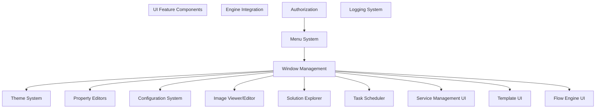
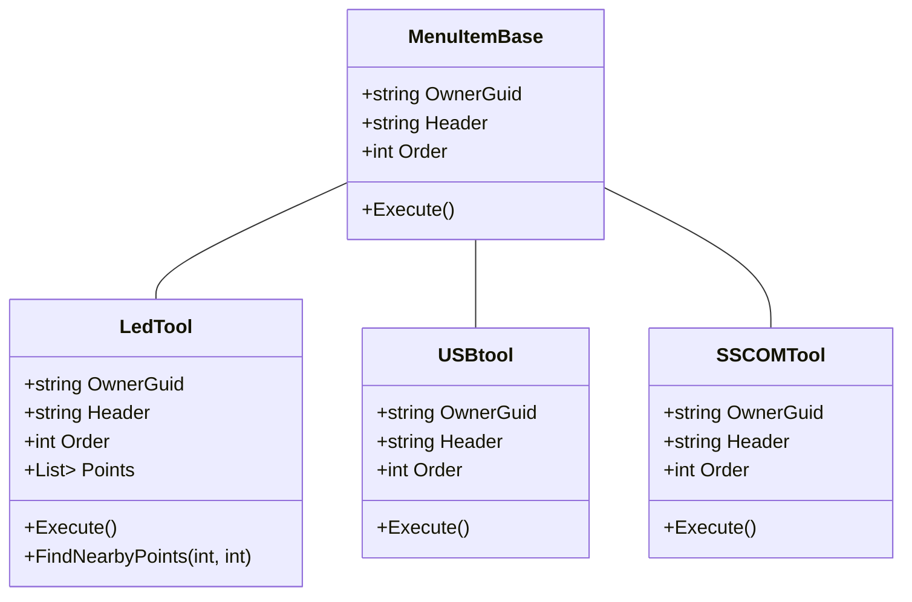
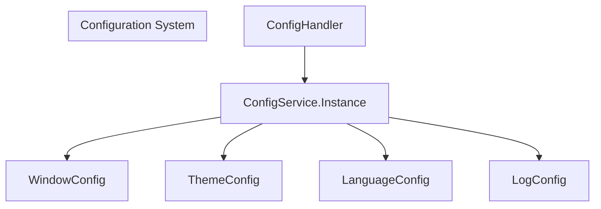
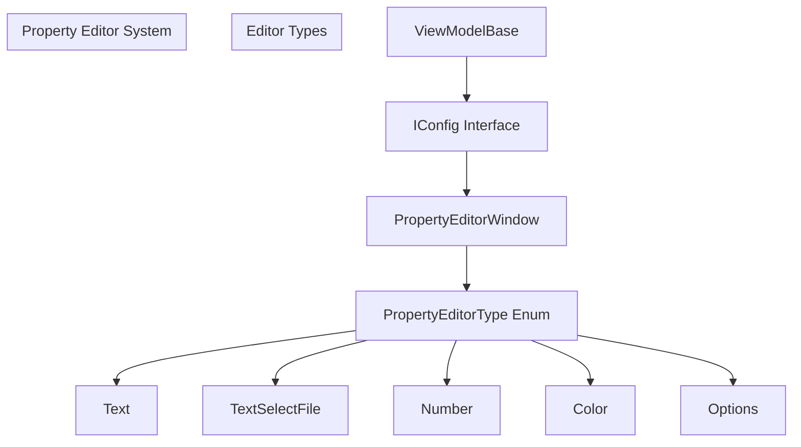
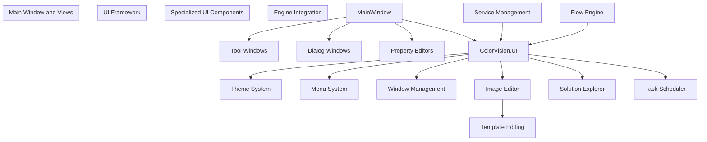

# UI Framework

> **Relevant source files**
> * [Engine/CVImageChannelLib/CVImageChannelLib.csproj](https://github.com/xincheng213618/scgd_general_wpf/blob/987af5f7/Engine/CVImageChannelLib/CVImageChannelLib.csproj)
> * [Engine/ColorVision.Engine/Assets/Tool/UsbTreeView.exe](https://github.com/xincheng213618/scgd_general_wpf/blob/987af5f7/Engine/ColorVision.Engine/Assets/Tool/UsbTreeView.exe)
> * [Engine/ColorVision.Engine/Assets/Tool/sscom5.13.1.exe](https://github.com/xincheng213618/scgd_general_wpf/blob/987af5f7/Engine/ColorVision.Engine/Assets/Tool/sscom5.13.1.exe)
> * [Engine/ColorVision.Engine/ColorVision.Engine.csproj](https://github.com/xincheng213618/scgd_general_wpf/blob/987af5f7/Engine/ColorVision.Engine/ColorVision.Engine.csproj)
> * [Engine/ColorVision.Engine/Services/PhyCameras/PhyCameraManagerWindow.xaml](https://github.com/xincheng213618/scgd_general_wpf/blob/987af5f7/Engine/ColorVision.Engine/Services/PhyCameras/PhyCameraManagerWindow.xaml)
> * [Engine/ColorVision.Engine/Services/PhyCameras/PhyCameraManagerWindow.xaml.cs](https://github.com/xincheng213618/scgd_general_wpf/blob/987af5f7/Engine/ColorVision.Engine/Services/PhyCameras/PhyCameraManagerWindow.xaml.cs)
> * [Engine/ColorVision.Engine/Templates/Validate/TemplateComplyParam.cs](https://github.com/xincheng213618/scgd_general_wpf/blob/987af5f7/Engine/ColorVision.Engine/Templates/Validate/TemplateComplyParam.cs)
> * [Engine/ColorVision.Engine/ToolPlugins/LedTool.cs](https://github.com/xincheng213618/scgd_general_wpf/blob/987af5f7/Engine/ColorVision.Engine/ToolPlugins/LedTool.cs)
> * [Engine/ColorVision.Engine/ToolPlugins/USBtool.cs](https://github.com/xincheng213618/scgd_general_wpf/blob/987af5f7/Engine/ColorVision.Engine/ToolPlugins/USBtool.cs)
> * [UI/ColorVision.Common/Authorizations/PermissionMode.cs](https://github.com/xincheng213618/scgd_general_wpf/blob/987af5f7/UI/ColorVision.Common/Authorizations/PermissionMode.cs)
> * [UI/ColorVision.Common/ColorVision.Common.csproj](https://github.com/xincheng213618/scgd_general_wpf/blob/987af5f7/UI/ColorVision.Common/ColorVision.Common.csproj)
> * [UI/ColorVision.Common/README.md](https://github.com/xincheng213618/scgd_general_wpf/blob/987af5f7/UI/ColorVision.Common/README.md)
> * [UI/ColorVision.Core/ColorVision.Core.csproj](https://github.com/xincheng213618/scgd_general_wpf/blob/987af5f7/UI/ColorVision.Core/ColorVision.Core.csproj)
> * [UI/ColorVision.Core/README.md](https://github.com/xincheng213618/scgd_general_wpf/blob/987af5f7/UI/ColorVision.Core/README.md)
> * [UI/ColorVision.ImageEditor/ColorVision.ImageEditor.csproj](https://github.com/xincheng213618/scgd_general_wpf/blob/987af5f7/UI/ColorVision.ImageEditor/ColorVision.ImageEditor.csproj)
> * [UI/ColorVision.Scheduler/ColorVision.Scheduler.csproj](https://github.com/xincheng213618/scgd_general_wpf/blob/987af5f7/UI/ColorVision.Scheduler/ColorVision.Scheduler.csproj)
> * [UI/ColorVision.Solution/ColorVision.Solution.csproj](https://github.com/xincheng213618/scgd_general_wpf/blob/987af5f7/UI/ColorVision.Solution/ColorVision.Solution.csproj)
> * [UI/ColorVision.Themes/ColorVision.Themes.csproj](https://github.com/xincheng213618/scgd_general_wpf/blob/987af5f7/UI/ColorVision.Themes/ColorVision.Themes.csproj)
> * [UI/ColorVision.UI/ColorVision.UI.csproj](https://github.com/xincheng213618/scgd_general_wpf/blob/987af5f7/UI/ColorVision.UI/ColorVision.UI.csproj)
> * [UI/ColorVision.UI/README.md](https://github.com/xincheng213618/scgd_general_wpf/blob/987af5f7/UI/ColorVision.UI/README.md)
> * [UI/Directory.Build.props](https://github.com/xincheng213618/scgd_general_wpf/blob/987af5f7/UI/Directory.Build.props)

The UI Framework in ColorVision is a comprehensive set of WPF-based components, controls, and libraries that provide the visual interface for users interacting with the system. This page documents the architecture, components, and usage patterns of the UI layer.

For information about the Image Editor specifically, see [Image Editor](/xincheng213618/scgd_general_wpf/3.1-image-editor).

## Architecture Overview

The UI Framework consists of several layered components that build upon each other to create the complete user interface experience.


Sources:

* [UI/ColorVision.UI/ColorVision.UI.csproj](https://github.com/xincheng213618/scgd_general_wpf/blob/987af5f7/UI/ColorVision.UI/ColorVision.UI.csproj)
* [UI/ColorVision.Themes/ColorVision.Themes.csproj](https://github.com/xincheng213618/scgd_general_wpf/blob/987af5f7/UI/ColorVision.Themes/ColorVision.Themes.csproj)
* [UI/ColorVision.Common/ColorVision.Common.csproj](https://github.com/xincheng213618/scgd_general_wpf/blob/987af5f7/UI/ColorVision.Common/ColorVision.Common.csproj)
* [UI/ColorVision.ImageEditor/ColorVision.ImageEditor.csproj](https://github.com/xincheng213618/scgd_general_wpf/blob/987af5f7/UI/ColorVision.ImageEditor/ColorVision.ImageEditor.csproj)
* [UI/ColorVision.Solution/ColorVision.Solution.csproj](https://github.com/xincheng213618/scgd_general_wpf/blob/987af5f7/UI/ColorVision.Solution/ColorVision.Solution.csproj)
* [UI/ColorVision.Scheduler/ColorVision.Scheduler.csproj](https://github.com/xincheng213618/scgd_general_wpf/blob/987af5f7/UI/ColorVision.Scheduler/ColorVision.Scheduler.csproj)

## Core UI Modules

The UI Framework is built on several key modules that work together to create the complete user interface:

### ColorVision.Common

Provides foundational utilities and patterns for UI components:

* MVVM base classes
* Authorization and permission systems
* Common utilities and helpers

### ColorVision.Themes

Controls theming and styling throughout the application:

* Theme definitions and resources
* Custom control styles
* Integration with third-party UI libraries

### ColorVision.Core

Provides low-level functionality and native integration:

* OpenCV integration for image processing
* Native DLL handling

### ColorVision.UI

The primary UI library with core components:

* Menus and toolbars
* Window management
* Configuration interfaces
* Property editors
* Logging views

### Specialized UI Modules

These modules build on the core UI framework for specific functionality:

1. **ColorVision.ImageEditor**: Image viewing and editing controls
2. **ColorVision.Solution**: Solution explorer and file management
3. **ColorVision.Scheduler**: Task scheduling and management



Sources:

* [UI/ColorVision.UI/README.md](https://github.com/xincheng213618/scgd_general_wpf/blob/987af5f7/UI/ColorVision.UI/README.md)
* [UI/ColorVision.Common/Authorizations/PermissionMode.cs](https://github.com/xincheng213618/scgd_general_wpf/blob/987af5f7/UI/ColorVision.Common/Authorizations/PermissionMode.cs)

## Key Components

### Authorization System

The UI Framework includes a hierarchical permission system with defined roles:

```
public enum PermissionMode
{
    SuperAdministrator = -1,
    Administrator,
    PowerUser,
    User,
    Guest
}
```

This permission system controls access to UI features and functionality based on the user's role.

Sources:

* [UI/ColorVision.Common/Authorizations/PermissionMode.cs](https://github.com/xincheng213618/scgd_general_wpf/blob/987af5f7/UI/ColorVision.Common/Authorizations/PermissionMode.cs)

### Menu and Plugin System

The UI framework supports a plugin-based menu system that allows for extensible functionality. Menu items derive from the `MenuItemBase` class and implement specific behaviors:



Menu items define:

1. Which menu they belong to via `OwnerGuid`
2. Their display name via `Header`
3. Their ordering within the menu via `Order`
4. The functionality executed when selected via `Execute()`

Sources:

* [Engine/ColorVision.Engine/ToolPlugins/LedTool.cs](https://github.com/xincheng213618/scgd_general_wpf/blob/987af5f7/Engine/ColorVision.Engine/ToolPlugins/LedTool.cs)
* [Engine/ColorVision.Engine/ToolPlugins/USBtool.cs](https://github.com/xincheng213618/scgd_general_wpf/blob/987af5f7/Engine/ColorVision.Engine/ToolPlugins/USBtool.cs)

### Configuration System

The UI Framework uses a centralized configuration system with services and properties:



Configuration is typically accessed through singleton instances via the ConfigService:

```
// Example window configuration
public class PhyCameraManagerWindowConfig: WindowConfig
{
    public static PhyCameraManagerWindowConfig Instance => 
        ConfigService.Instance.GetRequiredService<PhyCameraManagerWindowConfig>();

    public bool AllowCreate { get => _AllowCreate; set { _AllowCreate = value; NotifyPropertyChanged(); } }
    private bool _AllowCreate;
}
```

Sources:

* [Engine/ColorVision.Engine/Services/PhyCameras/PhyCameraManagerWindow.xaml.cs](https://github.com/xincheng213618/scgd_general_wpf/blob/987af5f7/Engine/ColorVision.Engine/Services/PhyCameras/PhyCameraManagerWindow.xaml.cs)

### Property Editors

The UI Framework includes a property editing system that allows for type-specific editing of object properties:



Usage example:

```
[DisplayName("Led Tool Config")]
public class LedToolConfig : ViewModelBase, IConfig
{
    public static LedToolConfig Instance => 
        ConfigService.Instance.GetRequiredService<LedToolConfig>();

    [DisplayName("Bead Data File"), PropertyEditorType(PropertyEditorType.TextSelectFile)]
    public string SelectedPath { get => _SelectedPath; set { _SelectedPath = value; NotifyPropertyChanged(); } }
    private string _SelectedPath;
    
    // Other properties...
}
```

Sources:

* [Engine/ColorVision.Engine/ToolPlugins/LedTool.cs](https://github.com/xincheng213618/scgd_general_wpf/blob/987af5f7/Engine/ColorVision.Engine/ToolPlugins/LedTool.cs)

### Window Management

The UI Framework provides window management helpers for consistent window behavior, styling, and positioning. Windows commonly use extensions for theming and caption handling:

```
public class PhyCameraManagerWindow : Window
{
    public static PhyCameraManagerWindowConfig Config => 
        ConfigService.Instance.GetRequiredService<PhyCameraManagerWindowConfig>();
        
    public PhyCameraManagerWindow()
    {
        InitializeComponent();
        this.ApplyCaption();  // Apply consistent window caption
        Config.SetWindow(this); // Apply window configuration
        SizeChanged += (s, e) => Config.SetConfig(this); // Save size changes
    }
    
    // Window implementation...
}
```

Sources:

* [Engine/ColorVision.Engine/Services/PhyCameras/PhyCameraManagerWindow.xaml.cs](https://github.com/xincheng213618/scgd_general_wpf/blob/987af5f7/Engine/ColorVision.Engine/Services/PhyCameras/PhyCameraManagerWindow.xaml.cs)
* [Engine/ColorVision.Engine/Services/PhyCameras/PhyCameraManagerWindow.xaml](https://github.com/xincheng213618/scgd_general_wpf/blob/987af5f7/Engine/ColorVision.Engine/Services/PhyCameras/PhyCameraManagerWindow.xaml)

## Initialization Sequence

Initializing the UI Framework involves several key steps that should be performed in sequence:

```
// Read configuration
ConfigHandler.GetInstance();

// Set permissions
Authorization.Instance = ConfigService.Instance.GetRequiredService<Authorization>();

// Set log level
LogConfig.Instance.SetLog();

// Set theme
this.ApplyTheme(ThemeConfig.Instance.Theme);

// Set language
Thread.CurrentThread.CurrentUICulture = new System.Globalization.CultureInfo(LanguageConfig.Instance.UICulture);
```

Sources:

* [UI/ColorVision.UI/README.md](https://github.com/xincheng213618/scgd_general_wpf/blob/987af5f7/UI/ColorVision.UI/README.md)

## UI Module Relationships

The following diagram shows how the UI components relate to the broader ColorVision system:



Sources:

* System architecture diagrams in the prompt
* [Engine/ColorVision.Engine/ColorVision.Engine.csproj](https://github.com/xincheng213618/scgd_general_wpf/blob/987af5f7/Engine/ColorVision.Engine/ColorVision.Engine.csproj)
* [UI/ColorVision.UI/ColorVision.UI.csproj](https://github.com/xincheng213618/scgd_general_wpf/blob/987af5f7/UI/ColorVision.UI/ColorVision.UI.csproj)

## Creating UI Extensions

The UI Framework is designed to be extensible. To create new UI components, developers typically follow these patterns:

1. **Create Menu Items**: Extend `MenuItemBase` to add new tools or actions to menus
2. **Create Configuration Classes**: Implement `ViewModelBase, IConfig` for configurable components
3. **Create Tool Windows**: Extend `Window` with appropriate UI framework integration
4. **Register Services**: Use `ConfigService.Instance.GetRequiredService<T>()` to access and register services

### Example: Creating a Tool Plugin

```
// Step 1: Create a configuration class
[DisplayName("My Tool")]
public class MyToolConfig : ViewModelBase, IConfig
{
    public static MyToolConfig Instance => 
        ConfigService.Instance.GetRequiredService<MyToolConfig>();
    
    [DisplayName("Some Setting"), PropertyEditorType(PropertyEditorType.TextSelectFile)]
    public string SomeSetting { get => _SomeSetting; set { _SomeSetting = value; NotifyPropertyChanged(); } }
    private string _SomeSetting;
}

// Step 2: Create a menu item that uses the configuration
public class MyTool : MenuItemBase
{
    public override string OwnerGuid => MenuItemConstants.View;
    public override string Header => "My Custom Tool";
    public override int Order => 100;
    
    public override void Execute()
    {
        // Show property editor
        new PropertyEditorWindow(MyToolConfig.Instance).ShowDialog();
        
        // Implement tool functionality
        // ...
    }
}
```

## Conclusion

The UI Framework in ColorVision provides a robust foundation for building consistent, themeable, and configurable user interfaces. By leveraging the patterns and components described in this document, developers can create extensions that seamlessly integrate with the existing application.

The framework follows common WPF patterns like MVVM while adding specialized components for image editing, solution exploration, and task scheduling. Its integration with the engine layer enables sophisticated interactions with the core functionality of the ColorVision system.