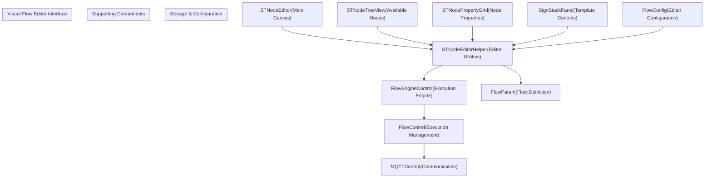
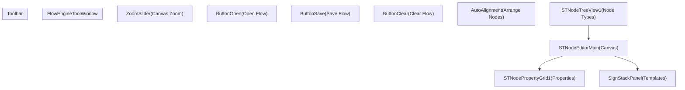
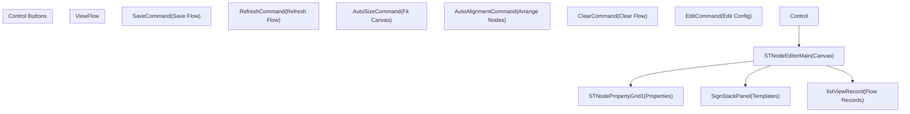
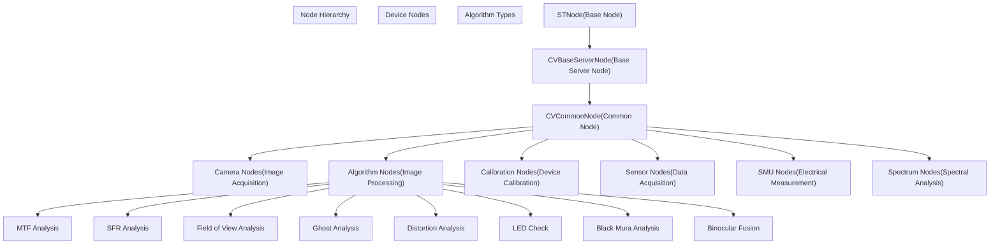
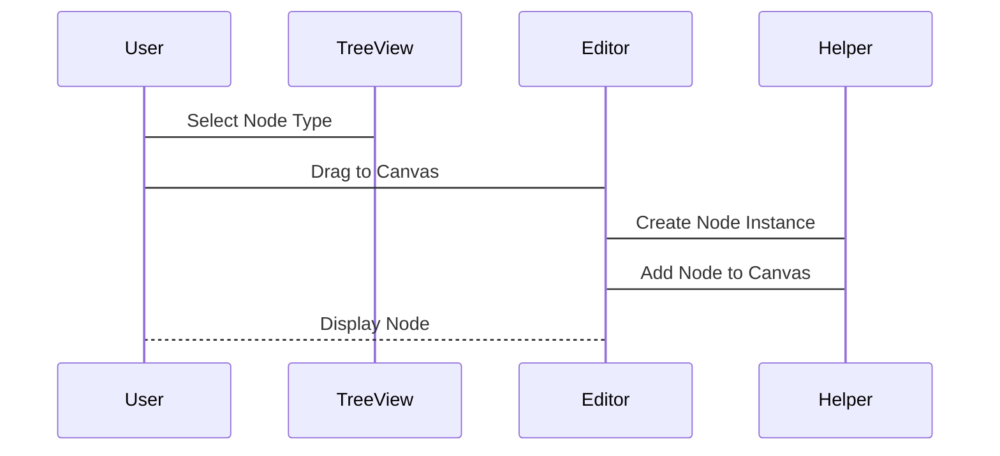
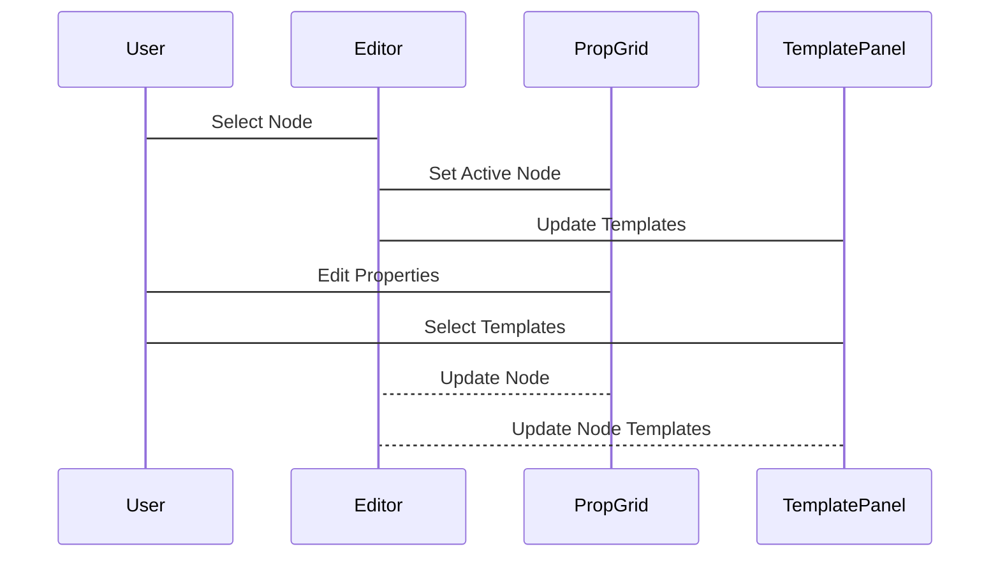
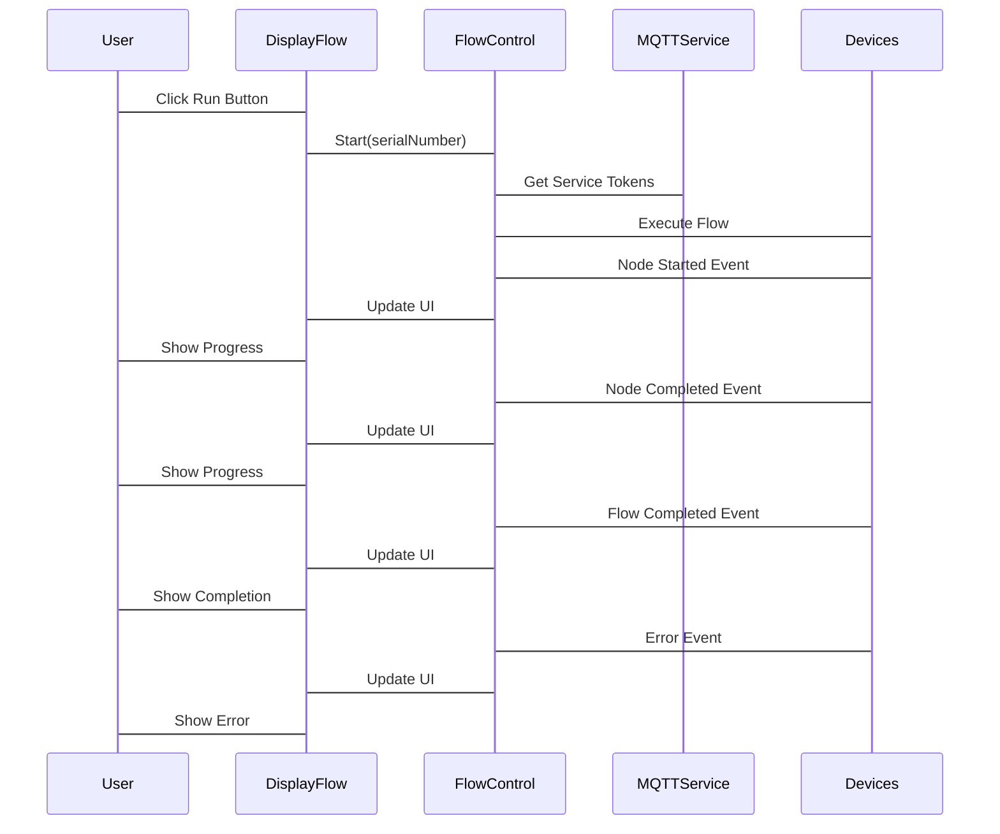
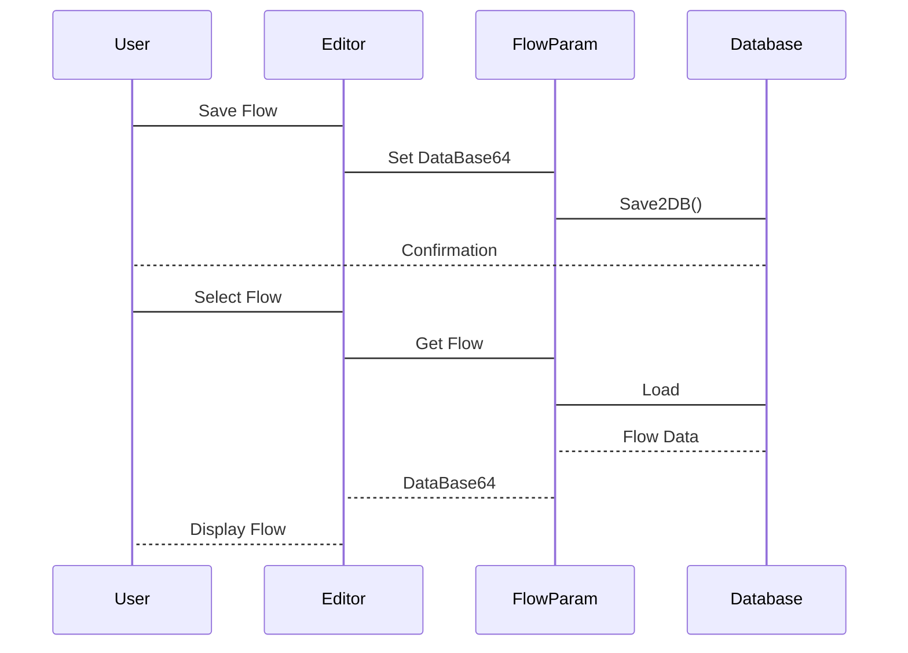
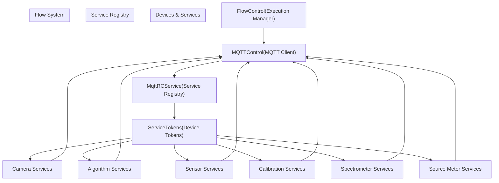

# Visual Flow Editor

> **Relevant source files**
> * [Engine/ColorVision.Engine/Services/Devices/Calibration/DisplayCalibrationControl.xaml](https://github.com/xincheng213618/scgd_general_wpf/blob/987af5f7/Engine/ColorVision.Engine/Services/Devices/Calibration/DisplayCalibrationControl.xaml)
> * [Engine/ColorVision.Engine/Services/Devices/Calibration/MQTTCalibration.cs](https://github.com/xincheng213618/scgd_general_wpf/blob/987af5f7/Engine/ColorVision.Engine/Services/Devices/Calibration/MQTTCalibration.cs)
> * [Engine/ColorVision.Engine/Services/Devices/ThirdPartyAlgorithms/DisplayThirdPartyAlgorithms.xaml](https://github.com/xincheng213618/scgd_general_wpf/blob/987af5f7/Engine/ColorVision.Engine/Services/Devices/ThirdPartyAlgorithms/DisplayThirdPartyAlgorithms.xaml)
> * [Engine/ColorVision.Engine/Services/RC/MQTTRCService.cs](https://github.com/xincheng213618/scgd_general_wpf/blob/987af5f7/Engine/ColorVision.Engine/Services/RC/MQTTRCService.cs)
> * [Engine/ColorVision.Engine/Templates/ARVR/SFR/AlgResultSFRDao.cs](https://github.com/xincheng213618/scgd_general_wpf/blob/987af5f7/Engine/ColorVision.Engine/Templates/ARVR/SFR/AlgResultSFRDao.cs)
> * [Engine/ColorVision.Engine/Templates/ARVR/SFR/EditSFR.xaml](https://github.com/xincheng213618/scgd_general_wpf/blob/987af5f7/Engine/ColorVision.Engine/Templates/ARVR/SFR/EditSFR.xaml)
> * [Engine/ColorVision.Engine/Templates/ARVR/SFR/EditSFR.xaml.cs](https://github.com/xincheng213618/scgd_general_wpf/blob/987af5f7/Engine/ColorVision.Engine/Templates/ARVR/SFR/EditSFR.xaml.cs)
> * [Engine/ColorVision.Engine/Templates/Flow/DisplayFlow.xaml](https://github.com/xincheng213618/scgd_general_wpf/blob/987af5f7/Engine/ColorVision.Engine/Templates/Flow/DisplayFlow.xaml)
> * [Engine/ColorVision.Engine/Templates/Flow/DisplayFlow.xaml.cs](https://github.com/xincheng213618/scgd_general_wpf/blob/987af5f7/Engine/ColorVision.Engine/Templates/Flow/DisplayFlow.xaml.cs)
> * [Engine/ColorVision.Engine/Templates/Flow/FlowConfig.cs](https://github.com/xincheng213618/scgd_general_wpf/blob/987af5f7/Engine/ColorVision.Engine/Templates/Flow/FlowConfig.cs)
> * [Engine/ColorVision.Engine/Templates/Flow/FlowControl.cs](https://github.com/xincheng213618/scgd_general_wpf/blob/987af5f7/Engine/ColorVision.Engine/Templates/Flow/FlowControl.cs)
> * [Engine/ColorVision.Engine/Templates/Flow/FlowEngineToolWindow.xaml](https://github.com/xincheng213618/scgd_general_wpf/blob/987af5f7/Engine/ColorVision.Engine/Templates/Flow/FlowEngineToolWindow.xaml)
> * [Engine/ColorVision.Engine/Templates/Flow/FlowEngineToolWindow.xaml.cs](https://github.com/xincheng213618/scgd_general_wpf/blob/987af5f7/Engine/ColorVision.Engine/Templates/Flow/FlowEngineToolWindow.xaml.cs)
> * [Engine/ColorVision.Engine/Templates/Flow/STNodeEditorHelper.cs](https://github.com/xincheng213618/scgd_general_wpf/blob/987af5f7/Engine/ColorVision.Engine/Templates/Flow/STNodeEditorHelper.cs)
> * [Engine/ColorVision.Engine/Templates/Flow/ViewFlow.xaml](https://github.com/xincheng213618/scgd_general_wpf/blob/987af5f7/Engine/ColorVision.Engine/Templates/Flow/ViewFlow.xaml)
> * [Engine/ColorVision.Engine/Templates/Flow/ViewFlow.xaml.cs](https://github.com/xincheng213618/scgd_general_wpf/blob/987af5f7/Engine/ColorVision.Engine/Templates/Flow/ViewFlow.xaml.cs)
> * [Engine/ColorVision.Engine/Templates/Jsons/SFRFindROI/MysqlSFRFindROI.cs](https://github.com/xincheng213618/scgd_general_wpf/blob/987af5f7/Engine/ColorVision.Engine/Templates/Jsons/SFRFindROI/MysqlSFRFindROI.cs)
> * [UI/ColorVision.ImageEditor/Draw/DrawCanvas.cs](https://github.com/xincheng213618/scgd_general_wpf/blob/987af5f7/UI/ColorVision.ImageEditor/Draw/DrawCanvas.cs)
> * [UI/ColorVision.Solution/Searches/SolutionView.xaml](https://github.com/xincheng213618/scgd_general_wpf/blob/987af5f7/UI/ColorVision.Solution/Searches/SolutionView.xaml)

The Visual Flow Editor is a node-based visual programming interface in the ColorVision system that allows users to create, edit, and execute workflow pipelines. This component enables users to visually connect different processing nodes representing algorithms, cameras, sensors, and other devices to build sophisticated imaging and analysis workflows without coding.

For information about flow execution, see [Flow Execution](/xincheng213618/scgd_general_wpf/6.2-flow-execution).

## Overview

The Visual Flow Editor provides a canvas where users can place nodes, connect them to define data flow, configure node properties, and execute the resulting workflow. The editor supports features like auto-alignment, undo/redo operations, zooming, and panning to facilitate workflow creation and management.

### Key Components

Sources:

* [Engine/ColorVision.Engine/Templates/Flow/STNodeEditorHelper.cs

60-96](https://github.com/xincheng213618/scgd_general_wpf/blob/987af5f7/Engine/ColorVision.Engine/Templates/Flow/STNodeEditorHelper.cs#L60-L96)
* [Engine/ColorVision.Engine/Templates/Flow/FlowEngineToolWindow.xaml.cs

20-194](https://github.com/xincheng213618/scgd_general_wpf/blob/987af5f7/Engine/ColorVision.Engine/Templates/Flow/FlowEngineToolWindow.xaml.cs#L20-L194)
* [Engine/ColorVision.Engine/Templates/Flow/ViewFlow.xaml.cs

21-78](https://github.com/xincheng213618/scgd_general_wpf/blob/987af5f7/Engine/ColorVision.Engine/Templates/Flow/ViewFlow.xaml.cs#L21-L78)

## User Interface Components

The Visual Flow Editor consists of four main interface components that work together to provide a complete visual programming experience:

### 1. STNodeEditor (Canvas)

The main canvas where users place, connect, and manipulate nodes. This component:

* Displays the visual representation of each node
* Handles node connections through input/output ports
* Supports mouse operations for selecting, moving, and connecting nodes
* Provides zoom and pan capabilities for navigating large workflows

### 2. STNodeTreeView (Node Selector)

A hierarchical view of all available node types that users can add to their workflow. This component:

* Organizes nodes by category
* Allows users to drag nodes onto the canvas
* Loads nodes from the FlowEngineLib assembly

### 3. STNodePropertyGrid (Property Editor)

A property grid that displays and allows editing of the selected node's properties. This component:

* Updates dynamically based on the selected node
* Allows configuration of node-specific parameters
* Provides immediate feedback for property changes

### 4. Template Panel (SignStackPanel)

A panel that displays template controls specific to the selected node type. This component:

* Provides node-specific template selection dropdowns
* Allows configuration of specialized parameters
* Changes dynamically based on the selected node type

Sources:

* [Engine/ColorVision.Engine/Templates/Flow/ViewFlow.xaml

154-157](https://github.com/xincheng213618/scgd_general_wpf/blob/987af5f7/Engine/ColorVision.Engine/Templates/Flow/ViewFlow.xaml#L154-L157)
* [Engine/ColorVision.Engine/Templates/Flow/FlowEngineToolWindow.xaml

71-79](https://github.com/xincheng213618/scgd_general_wpf/blob/987af5f7/Engine/ColorVision.Engine/Templates/Flow/FlowEngineToolWindow.xaml#L71-L79)
* [Engine/ColorVision.Engine/Templates/Flow/STNodeEditorHelper.cs

66-67](https://github.com/xincheng213618/scgd_general_wpf/blob/987af5f7/Engine/ColorVision.Engine/Templates/Flow/STNodeEditorHelper.cs#L66-L67)

## Editor Windows and Views

The Visual Flow Editor can be accessed through two main interfaces:

### 1. FlowEngineToolWindow

A dedicated window for creating and editing flows. It provides the complete editor experience with all components visible and accessible. This window is typically used for:

* Creating new workflows
* Editing existing workflows
* Testing workflow configuration

Sources:

* [Engine/ColorVision.Engine/Templates/Flow/FlowEngineToolWindow.xaml

46-80](https://github.com/xincheng213618/scgd_general_wpf/blob/987af5f7/Engine/ColorVision.Engine/Templates/Flow/FlowEngineToolWindow.xaml#L46-L80)
* [Engine/ColorVision.Engine/Templates/Flow/FlowEngineToolWindow.xaml.cs

40-44](https://github.com/xincheng213618/scgd_general_wpf/blob/987af5f7/Engine/ColorVision.Engine/Templates/Flow/FlowEngineToolWindow.xaml.cs#L40-L44)

### 2. ViewFlow

An embedded view for working with flows within the main application. It integrates the flow editor into the application's interface and provides additional features such as:

* Flow execution controls
* Flow record tracking
* Integration with the application's view system

Sources:

* [Engine/ColorVision.Engine/Templates/Flow/ViewFlow.xaml

14-166](https://github.com/xincheng213618/scgd_general_wpf/blob/987af5f7/Engine/ColorVision.Engine/Templates/Flow/ViewFlow.xaml#L14-L166)
* [Engine/ColorVision.Engine/Templates/Flow/ViewFlow.xaml.cs

53-59](https://github.com/xincheng213618/scgd_general_wpf/blob/987af5f7/Engine/ColorVision.Engine/Templates/Flow/ViewFlow.xaml.cs#L53-L59)

## Node Types and Templates

The Visual Flow Editor supports a wide variety of node types that represent different operations in the ColorVision system. These nodes are organized into categories and can be configured through templates.

### Node Categories

Sources:

* [Engine/ColorVision.Engine/Templates/Flow/STNodeEditorHelper.cs

168-482](https://github.com/xincheng213618/scgd_general_wpf/blob/987af5f7/Engine/ColorVision.Engine/Templates/Flow/STNodeEditorHelper.cs#L168-L482)

### Template System

Each node type can be associated with templates that define its configuration parameters. The template system:

1. Provides a unified way to manage node configurations
2. Allows sharing configurations between different nodes
3. Supports template creation, editing, and management

When a node is selected, the editor automatically displays appropriate template selectors based on the node type:

| Node Type | Available Templates | Template Parameters |
| --- | --- | --- |
| Camera | Camera template, Auto Exposure, POI template | Exposure settings, image processing parameters |
| Algorithm | Algorithm-specific templates (MTF, SFR, etc.) | ROI settings, threshold values, analysis parameters |
| Calibration | Calibration templates | Exposure time, calibration parameters |
| Sensor | Sensor parameter templates | Sampling rates, trigger settings |
| SMU | SMU parameter templates | Voltage, current settings, measurement parameters |
| Spectrum | Spectrum templates | Wavelength ranges, integration time |

Sources:

* [Engine/ColorVision.Engine/Templates/Flow/STNodeEditorHelper.cs

174-482](https://github.com/xincheng213618/scgd_general_wpf/blob/987af5f7/Engine/ColorVision.Engine/Templates/Flow/STNodeEditorHelper.cs#L174-L482)

## Flow Creation and Editing

### Adding Nodes

Nodes can be added to the flow canvas through several methods:

1. Dragging nodes from the STNodeTreeView onto the canvas
2. Right-clicking on the canvas and selecting from the context menu
3. Copying and pasting existing nodes

Sources:

* [Engine/ColorVision.Engine/Templates/Flow/STNodeEditorHelper.cs

97-164](https://github.com/xincheng213618/scgd_general_wpf/blob/987af5f7/Engine/ColorVision.Engine/Templates/Flow/STNodeEditorHelper.cs#L97-L164)

### Connecting Nodes

Nodes can be connected by:

1. Clicking on an output port of one node
2. Dragging to an input port of another node
3. Releasing to create the connection

The editor enforces type compatibility between node ports, ensuring that only compatible ports can be connected.

### Editing Node Properties

When a node is selected, its properties are displayed in the STNodePropertyGrid. Users can:

1. Edit individual property values
2. Select templates from available options
3. Configure node-specific settings

Sources:

* [Engine/ColorVision.Engine/Templates/Flow/STNodeEditorHelper.cs

168-482](https://github.com/xincheng213618/scgd_general_wpf/blob/987af5f7/Engine/ColorVision.Engine/Templates/Flow/STNodeEditorHelper.cs#L168-L482)

### Flow Organization

The editor provides several tools for organizing flows:

1. **Auto-Alignment**: Automatically arranges nodes in a hierarchical layout for better readability.
2. **Canvas Navigation**:
* Zoom: Use the zoom slider or mouse wheel to zoom in/out
* Pan: Hold Ctrl+Click and drag or use arrow keys to pan the canvas
3. **Node Selection**: Click on a node to select it, or drag a selection box to select multiple nodes.
4. **Undo/Redo**: The editor supports undo/redo operations for all editing actions.

Sources:

* [Engine/ColorVision.Engine/Templates/Flow/ViewFlow.xaml.cs

127-132](https://github.com/xincheng213618/scgd_general_wpf/blob/987af5f7/Engine/ColorVision.Engine/Templates/Flow/ViewFlow.xaml.cs#L127-L132)
* [Engine/ColorVision.Engine/Templates/Flow/FlowEngineToolWindow.xaml.cs

195-199](https://github.com/xincheng213618/scgd_general_wpf/blob/987af5f7/Engine/ColorVision.Engine/Templates/Flow/FlowEngineToolWindow.xaml.cs#L195-L199)

## Flow Execution

### Execution Controls

The Visual Flow Editor provides controls for executing flows:

1. **Run Button**: Starts flow execution
2. **Stop Button**: Stops a running flow
3. **Monitoring Panel**: Displays execution status, progress, and results

Sources:

* [Engine/ColorVision.Engine/Templates/Flow/DisplayFlow.xaml.cs

397-501](https://github.com/xincheng213618/scgd_general_wpf/blob/987af5f7/Engine/ColorVision.Engine/Templates/Flow/DisplayFlow.xaml.cs#L397-L501)
* [Engine/ColorVision.Engine/Templates/Flow/FlowControl.cs

86-150](https://github.com/xincheng213618/scgd_general_wpf/blob/987af5f7/Engine/ColorVision.Engine/Templates/Flow/FlowControl.cs#L86-L150)

### Execution Monitoring

During flow execution, the Visual Flow Editor provides real-time feedback:

1. **Node Highlighting**: Currently executing nodes are highlighted
2. **Progress Updates**: Execution time and progress are displayed
3. **Flow Records**: A record of node execution times is maintained

The editor also provides error handling capabilities:

1. **Error Highlighting**: Nodes that encounter errors are highlighted in red
2. **Error Messages**: Error details are displayed to the user
3. **Error Recovery**: The system can recover from certain errors and continue execution

Sources:

* [Engine/ColorVision.Engine/Templates/Flow/DisplayFlow.xaml.cs

348-367](https://github.com/xincheng213618/scgd_general_wpf/blob/987af5f7/Engine/ColorVision.Engine/Templates/Flow/DisplayFlow.xaml.cs#L348-L367)
* [Engine/ColorVision.Engine/Templates/Flow/DisplayFlow.xaml.cs

280-315](https://github.com/xincheng213618/scgd_general_wpf/blob/987af5f7/Engine/ColorVision.Engine/Templates/Flow/DisplayFlow.xaml.cs#L280-L315)

## Flow Management

### Saving and Loading Flows

Flows can be saved and loaded through several methods:

1. **Database Storage**: Flows are stored in the database as FlowParam objects
2. **File Storage**: Flows can be saved to and loaded from .cvflow files
3. **Base64 Encoding**: Flows can be serialized to and deserialized from Base64 strings for easy transmission

Sources:

* [Engine/ColorVision.Engine/Templates/Flow/FlowEngineToolWindow.xaml.cs

304-329](https://github.com/xincheng213618/scgd_general_wpf/blob/987af5f7/Engine/ColorVision.Engine/Templates/Flow/FlowEngineToolWindow.xaml.cs#L304-L329)
* [Engine/ColorVision.Engine/Templates/Flow/ViewFlow.xaml.cs

134-140](https://github.com/xincheng213618/scgd_general_wpf/blob/987af5f7/Engine/ColorVision.Engine/Templates/Flow/ViewFlow.xaml.cs#L134-L140)

### Flow Templates

The Visual Flow Editor supports the concept of flow templates, which allow users to:

1. Create reusable flow configurations
2. Share flows between users
3. Standardize common workflows

Flow templates are managed through the TemplateFlow system, which provides:

1. A UI for creating and editing templates
2. Storage for template configurations
3. Selection of templates in the DisplayFlow control

Sources:

* [Engine/ColorVision.Engine/Templates/Flow/DisplayFlow.xaml

86-88](https://github.com/xincheng213618/scgd_general_wpf/blob/987af5f7/Engine/ColorVision.Engine/Templates/Flow/DisplayFlow.xaml#L86-L88)
* [Engine/ColorVision.Engine/Templates/Flow/DisplayFlow.xaml.cs

532-543](https://github.com/xincheng213618/scgd_general_wpf/blob/987af5f7/Engine/ColorVision.Engine/Templates/Flow/DisplayFlow.xaml.cs#L532-L543)

## Configuration and Customization

The Visual Flow Editor can be configured through the FlowConfig class, which provides settings for:

1. **Auto-Save**: Automatically save changes when editing flows
2. **Auto-Size**: Automatically adjust the canvas size to fit all nodes
3. **Flow Preview**: Show execution progress during flow runs
4. **Detail View**: Show detailed execution information for each node
5. **Warning Settings**: Configure disk space warnings before running flows

These settings can be accessed through the settings button in the DisplayFlow control.

Sources:

* [Engine/ColorVision.Engine/Templates/Flow/FlowConfig.cs

10-70](https://github.com/xincheng213618/scgd_general_wpf/blob/987af5f7/Engine/ColorVision.Engine/Templates/Flow/FlowConfig.cs#L10-L70)
* [Engine/ColorVision.Engine/Templates/Flow/DisplayFlow.xaml

25-42](https://github.com/xincheng213618/scgd_general_wpf/blob/987af5f7/Engine/ColorVision.Engine/Templates/Flow/DisplayFlow.xaml#L25-L42)

## MQTT Integration

The Visual Flow Editor integrates with MQTT for communication with devices and services. This integration:

1. Allows flows to control and receive data from physical devices
2. Provides a standardized communication protocol
3. Supports distributed execution of flows

The flow execution uses MQTT tokens to authenticate and communicate with services:

1. When a flow is executed, it retrieves service tokens from the MqttRCService
2. Each node in the flow uses these tokens to send commands to the appropriate service
3. Services perform operations and send results back through MQTT
4. The flow control processes these results and updates the UI

Sources:

* [Engine/ColorVision.Engine/Templates/Flow/FlowControl.cs

44-73](https://github.com/xincheng213618/scgd_general_wpf/blob/987af5f7/Engine/ColorVision.Engine/Templates/Flow/FlowControl.cs#L44-L73)
* [Engine/ColorVision.Engine/Templates/Flow/DisplayFlow.xaml.cs

409-471](https://github.com/xincheng213618/scgd_general_wpf/blob/987af5f7/Engine/ColorVision.Engine/Templates/Flow/DisplayFlow.xaml.cs#L409-L471)
* [Engine/ColorVision.Engine/Services/RC/MQTTRCService.cs

232-269](https://github.com/xincheng213618/scgd_general_wpf/blob/987af5f7/Engine/ColorVision.Engine/Services/RC/MQTTRCService.cs#L232-L269)

## Practical Usage Examples

### Creating a Simple Image Processing Flow

1. Open the Flow Editor (FlowEngineToolWindow)
2. Add a Camera node to acquire images
3. Add an Algorithm node (e.g., MTF Analysis)
4. Connect the Camera node's output to the Algorithm node's input
5. Configure the Camera node with appropriate exposure settings
6. Configure the Algorithm node with appropriate analysis parameters
7. Save the flow
8. Execute the flow from the DisplayFlow control

### Building a Multi-Stage Analysis Flow

1. Start with a Camera node for image acquisition
2. Add a POI node to define regions of interest
3. Connect multiple algorithm nodes for different analyses (SFR, MTF, Distortion)
4. Configure each node with appropriate templates
5. Use the auto-alignment feature to organize the flow
6. Save the flow as a template for future use
7. Execute the flow and monitor results

## Summary

The Visual Flow Editor is a powerful component of the ColorVision system that enables users to create sophisticated image processing and analysis workflows without coding. By providing a visual programming interface, it makes complex operations accessible while maintaining the flexibility and power needed for advanced imaging applications.

Key features include:

* Node-based visual programming interface
* Wide variety of node types for different operations
* Template system for configuration management
* Real-time execution monitoring
* Integration with MQTT for device communication
* Flow storage and management capabilities

The Visual Flow Editor bridges the gap between powerful image processing algorithms and user-friendly interfaces, making it a central component in the ColorVision ecosystem.