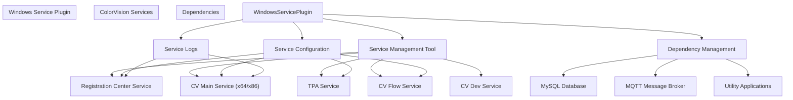
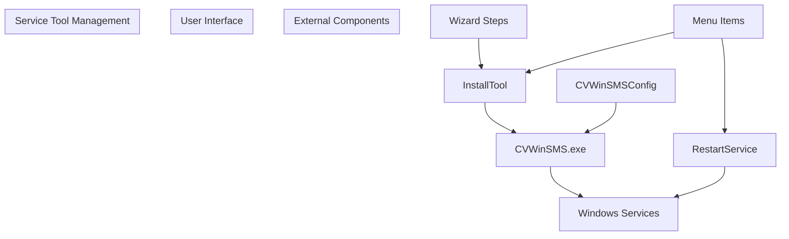
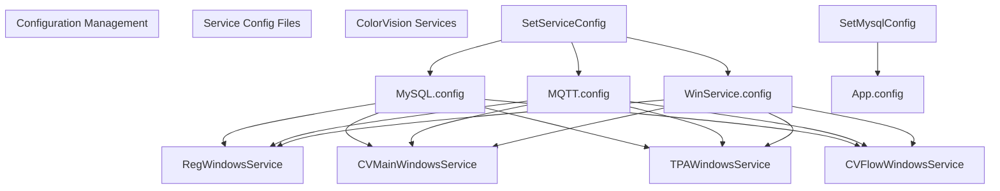
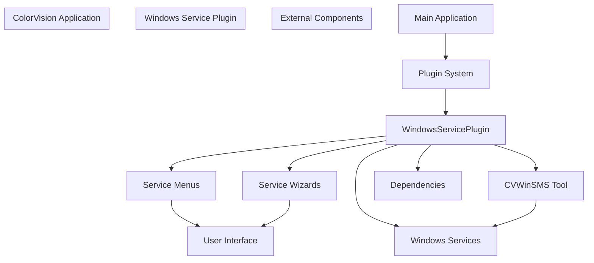

# Windows Service Plugin

> **Relevant source files**
> * [Engine/ColorVision.Engine/Templates/ARVR/Distortion/AlgorithmDistortion.cs](https://github.com/xincheng213618/scgd_general_wpf/blob/987af5f7/Engine/ColorVision.Engine/Templates/ARVR/Distortion/AlgorithmDistortion.cs)
> * [Engine/ColorVision.Engine/Templates/ARVR/Ghost/AlgorithmGhost.cs](https://github.com/xincheng213618/scgd_general_wpf/blob/987af5f7/Engine/ColorVision.Engine/Templates/ARVR/Ghost/AlgorithmGhost.cs)
> * [Engine/ColorVision.Engine/Templates/Jsons/Ghost2/AlgorithmGhost2.cs](https://github.com/xincheng213618/scgd_general_wpf/blob/987af5f7/Engine/ColorVision.Engine/Templates/Jsons/Ghost2/AlgorithmGhost2.cs)
> * [Plugins/WindowsServicePlugin/CVWinSMS/CVWinSMSConfig.cs](https://github.com/xincheng213618/scgd_general_wpf/blob/987af5f7/Plugins/WindowsServicePlugin/CVWinSMS/CVWinSMSConfig.cs)
> * [Plugins/WindowsServicePlugin/CVWinSMS/InstallService.cs](https://github.com/xincheng213618/scgd_general_wpf/blob/987af5f7/Plugins/WindowsServicePlugin/CVWinSMS/InstallService.cs)
> * [Plugins/WindowsServicePlugin/CVWinSMS/InstallTool.cs](https://github.com/xincheng213618/scgd_general_wpf/blob/987af5f7/Plugins/WindowsServicePlugin/CVWinSMS/InstallTool.cs)
> * [Plugins/WindowsServicePlugin/CVWinSMS/RestartService.cs](https://github.com/xincheng213618/scgd_general_wpf/blob/987af5f7/Plugins/WindowsServicePlugin/CVWinSMS/RestartService.cs)
> * [Plugins/WindowsServicePlugin/InstallMQTT.cs](https://github.com/xincheng213618/scgd_general_wpf/blob/987af5f7/Plugins/WindowsServicePlugin/InstallMQTT.cs)
> * [Plugins/WindowsServicePlugin/InstallMySql.cs](https://github.com/xincheng213618/scgd_general_wpf/blob/987af5f7/Plugins/WindowsServicePlugin/InstallMySql.cs)
> * [Plugins/WindowsServicePlugin/InstallNavicate.cs](https://github.com/xincheng213618/scgd_general_wpf/blob/987af5f7/Plugins/WindowsServicePlugin/InstallNavicate.cs)
> * [Plugins/WindowsServicePlugin/InstallWinrar.cs](https://github.com/xincheng213618/scgd_general_wpf/blob/987af5f7/Plugins/WindowsServicePlugin/InstallWinrar.cs)
> * [Plugins/WindowsServicePlugin/Menus/ExportCameraLog.cs](https://github.com/xincheng213618/scgd_general_wpf/blob/987af5f7/Plugins/WindowsServicePlugin/Menus/ExportCameraLog.cs)
> * [Plugins/WindowsServicePlugin/Menus/ExportRCServiceLog.cs](https://github.com/xincheng213618/scgd_general_wpf/blob/987af5f7/Plugins/WindowsServicePlugin/Menus/ExportRCServiceLog.cs)
> * [Plugins/WindowsServicePlugin/Menus/Exportx64ServiceLog.cs](https://github.com/xincheng213618/scgd_general_wpf/blob/987af5f7/Plugins/WindowsServicePlugin/Menus/Exportx64ServiceLog.cs)
> * [Plugins/WindowsServicePlugin/PluginConfig/PluginWindowService.cs](https://github.com/xincheng213618/scgd_general_wpf/blob/987af5f7/Plugins/WindowsServicePlugin/PluginConfig/PluginWindowService.cs)
> * [Plugins/WindowsServicePlugin/SetMysqlConfig.cs](https://github.com/xincheng213618/scgd_general_wpf/blob/987af5f7/Plugins/WindowsServicePlugin/SetMysqlConfig.cs)
> * [Plugins/WindowsServicePlugin/SetServiceConfig.cs](https://github.com/xincheng213618/scgd_general_wpf/blob/987af5f7/Plugins/WindowsServicePlugin/SetServiceConfig.cs)
> * [Plugins/WindowsServicePlugin/Tools/MenuBeyondCompare.cs](https://github.com/xincheng213618/scgd_general_wpf/blob/987af5f7/Plugins/WindowsServicePlugin/Tools/MenuBeyondCompare.cs)
> * [Plugins/WindowsServicePlugin/Tools/MenuImageJ.cs](https://github.com/xincheng213618/scgd_general_wpf/blob/987af5f7/Plugins/WindowsServicePlugin/Tools/MenuImageJ.cs)
> * [Plugins/WindowsServicePlugin/WindowsServicePlugin.csproj](https://github.com/xincheng213618/scgd_general_wpf/blob/987af5f7/Plugins/WindowsServicePlugin/WindowsServicePlugin.csproj)

The Windows Service Plugin provides functionality for managing, configuring, and monitoring the various Windows services that are part of the ColorVision ecosystem. This plugin allows users to install, update, and configure services, access service logs, and manage related dependencies.

For information about the general plugin architecture, see [Plugin Architecture](/xincheng213618/scgd_general_wpf/7-plugin-architecture).

## Overview

The Windows Service Plugin is a specialized plugin that bridges the gap between the ColorVision application and the underlying Windows services that power its distributed architecture. It manages the ColorVision service ecosystem, which includes the Registration Center Service, algorithm services, camera services, and more.



Sources:

* [Plugins/WindowsServicePlugin/PluginConfig/PluginWindowService.cs](https://github.com/xincheng213618/scgd_general_wpf/blob/987af5f7/Plugins/WindowsServicePlugin/PluginConfig/PluginWindowService.cs)
* [Plugins/WindowsServicePlugin/WindowsServicePlugin.csproj](https://github.com/xincheng213618/scgd_general_wpf/blob/987af5f7/Plugins/WindowsServicePlugin/WindowsServicePlugin.csproj)

## Service Management Components

The plugin provides several key components for managing the ColorVision service ecosystem:

### Service Management Tool

The plugin offers functionality to download, install, and launch the ColorVision Windows Service Management System (CVWinSMS) tool. This external tool provides a graphical interface for managing all ColorVision services.



Sources:

* [Plugins/WindowsServicePlugin/CVWinSMS/InstallTool.cs](https://github.com/xincheng213618/scgd_general_wpf/blob/987af5f7/Plugins/WindowsServicePlugin/CVWinSMS/InstallTool.cs)
* [Plugins/WindowsServicePlugin/CVWinSMS/CVWinSMSConfig.cs](https://github.com/xincheng213618/scgd_general_wpf/blob/987af5f7/Plugins/WindowsServicePlugin/CVWinSMS/CVWinSMSConfig.cs)
* [Plugins/WindowsServicePlugin/CVWinSMS/RestartService.cs](https://github.com/xincheng213618/scgd_general_wpf/blob/987af5f7/Plugins/WindowsServicePlugin/CVWinSMS/RestartService.cs)

### Service Configuration

The plugin allows for configuring various services by reading and modifying configuration files. It can update settings for:

1. MySQL database connections
2. MQTT communication
3. Registration Center services
4. Windows service parameters



Sources:

* [Plugins/WindowsServicePlugin/SetServiceConfig.cs](https://github.com/xincheng213618/scgd_general_wpf/blob/987af5f7/Plugins/WindowsServicePlugin/SetServiceConfig.cs)
* [Plugins/WindowsServicePlugin/SetMysqlConfig.cs](https://github.com/xincheng213618/scgd_general_wpf/blob/987af5f7/Plugins/WindowsServicePlugin/SetMysqlConfig.cs)

## Installation and Updates

The plugin provides wizard-driven installation and update functionality for various service components:

### Services Installation

The plugin can download and install the latest version of the ColorVision service suite:

```
public override async void Execute()
{
    Version version = await DownloadFile.GetLatestVersionNumber(LatestReleaseUrl);
    if (version > CurrentVerision)
    {
        // Download and install new version
    }
}
```

Sources:

* [Plugins/WindowsServicePlugin/CVWinSMS/InstallService.cs](https://github.com/xincheng213618/scgd_general_wpf/blob/987af5f7/Plugins/WindowsServicePlugin/CVWinSMS/InstallService.cs)
* [Plugins/WindowsServicePlugin/Serv/InstallService.cs](https://github.com/xincheng213618/scgd_general_wpf/blob/987af5f7/Plugins/WindowsServicePlugin/Serv/InstallService.cs)

### Dependencies Installation

The plugin can download and install various dependencies required by the ColorVision services:

| Dependency | Description | Installation Class |
| --- | --- | --- |
| MySQL | Database server (v5.7.37) | `InstallMySql` |
| MQTT | Message broker (Mosquitto v2.0.18) | `InstallMQTT` |
| Navicat | Database management tool | `InstallNavicate` |
| WinRAR | Compression utility | `InstallWinrar` |
| ImageJ | Image analysis tool | `MenuImageJ` |
| BeyondCompare | File comparison tool | `MenuBeyondCompare` |

Sources:

* [Plugins/WindowsServicePlugin/InstallMySql.cs](https://github.com/xincheng213618/scgd_general_wpf/blob/987af5f7/Plugins/WindowsServicePlugin/InstallMySql.cs)
* [Plugins/WindowsServicePlugin/InstallMQTT.cs](https://github.com/xincheng213618/scgd_general_wpf/blob/987af5f7/Plugins/WindowsServicePlugin/InstallMQTT.cs)
* [Plugins/WindowsServicePlugin/InstallNavicate.cs](https://github.com/xincheng213618/scgd_general_wpf/blob/987af5f7/Plugins/WindowsServicePlugin/InstallNavicate.cs)
* [Plugins/WindowsServicePlugin/InstallWinrar.cs](https://github.com/xincheng213618/scgd_general_wpf/blob/987af5f7/Plugins/WindowsServicePlugin/InstallWinrar.cs)
* [Plugins/WindowsServicePlugin/Tools/MenuImageJ.cs](https://github.com/xincheng213618/scgd_general_wpf/blob/987af5f7/Plugins/WindowsServicePlugin/Tools/MenuImageJ.cs)
* [Plugins/WindowsServicePlugin/Tools/MenuBeyondCompare.cs](https://github.com/xincheng213618/scgd_general_wpf/blob/987af5f7/Plugins/WindowsServicePlugin/Tools/MenuBeyondCompare.cs)

## Service Logs

The plugin provides access to various service logs through menu items that open either local log folders or web interfaces:

| Log Type | Description | URL/Path |
| --- | --- | --- |
| RC Service | Registration Center logs | `http://localhost:8080/system/log` or local path |
| x64 Service | 64-bit service logs | `http://localhost:8064/system/log` or local path |
| Camera | Camera service logs | `http://localhost:8064/system/device/camera/log` or local path |

Each log type has two implementations: one that accesses logs via HTTP endpoints and another that accesses log files directly from the service installation directory.

Sources:

* [Plugins/WindowsServicePlugin/Menus/ExportRCServiceLog.cs](https://github.com/xincheng213618/scgd_general_wpf/blob/987af5f7/Plugins/WindowsServicePlugin/Menus/ExportRCServiceLog.cs)
* [Plugins/WindowsServicePlugin/Menus/Exportx64ServiceLog.cs](https://github.com/xincheng213618/scgd_general_wpf/blob/987af5f7/Plugins/WindowsServicePlugin/Menus/Exportx64ServiceLog.cs)
* [Plugins/WindowsServicePlugin/Menus/ExportCameraLog.cs](https://github.com/xincheng213618/scgd_general_wpf/blob/987af5f7/Plugins/WindowsServicePlugin/Menus/ExportCameraLog.cs)

## Configuration Management

### CVWinSMS Configuration

The plugin stores and manages the configuration for the CVWinSMS tool, including its path and update settings:

```
public string CVWinSMSPath { get => _CVWinSMSPath; set { _CVWinSMSPath = value; } }
private string _CVWinSMSPath = string.Empty;

public string BaseLocation { 
    get
    {
        if (dic.TryGetValue("BaseLocation", out string location))
            return location;
        return string.Empty;
    }
}

public bool IsAutoUpdate { get => _IsAutoUpdate; set { _IsAutoUpdate = value; NotifyPropertyChanged(); } }
private bool _IsAutoUpdate = true;
```

Sources:

* [Plugins/WindowsServicePlugin/CVWinSMS/CVWinSMSConfig.cs](https://github.com/xincheng213618/scgd_general_wpf/blob/987af5f7/Plugins/WindowsServicePlugin/CVWinSMS/CVWinSMSConfig.cs)

### Service Configuration

The plugin can read service configurations from the CVWinSMS tool and apply them to the appropriate services. It handles several configuration files:

1. **MySQL Configuration**: Database connection settings
2. **MQTT Configuration**: Message broker connection settings
3. **Windows Service Configuration**: Service-specific settings
4. **Registration Center Configuration**: RC service settings

The `SetServiceConfig` class in the plugin is responsible for updating all these configuration files with the appropriate settings.

Sources:

* [Plugins/WindowsServicePlugin/SetServiceConfig.cs L72-L222](https://github.com/xincheng213618/scgd_general_wpf/blob/987af5f7/Plugins/WindowsServicePlugin/SetServiceConfig.cs#L72-L222)

## Integration with Main Application

The Windows Service Plugin integrates with the main ColorVision application through the plugin architecture. It implements the `IPluginBase` interface and provides menu items and wizard steps that appear in the application's UI.



Sources:

* [Plugins/WindowsServicePlugin/PluginConfig/PluginWindowService.cs](https://github.com/xincheng213618/scgd_general_wpf/blob/987af5f7/Plugins/WindowsServicePlugin/PluginConfig/PluginWindowService.cs)
* [Plugins/WindowsServicePlugin/WindowsServicePlugin.csproj](https://github.com/xincheng213618/scgd_general_wpf/blob/987af5f7/Plugins/WindowsServicePlugin/WindowsServicePlugin.csproj)

## Service Connectivity

The plugin helps manage connections to services that power the application's algorithms. Each algorithm service connects via MQTT to receive commands and return results. The plugin ensures these connections are properly configured.

Example of algorithm connections managed by the plugin:

```
public MsgRecord SendCommand(DistortionParam param, string deviceCode, string deviceType, string fileName, FileExtType fileExtType, string serialNumber)
{
    string sn = null;
    if (string.IsNullOrWhiteSpace(serialNumber)) sn = DateTime.Now.ToString("yyyyMMdd'T'HHmmss.fffffff");
    else sn = serialNumber;
    if (DService.HistoryFilePath.TryGetValue(fileName, out string fullpath))
        fileName = fullpath;
    var Params = new Dictionary<string, object>() { { "ImgFileName", fileName }, { "FileType", fileExtType }, { "DeviceCode", deviceCode }, { "DeviceType", deviceType } };
    Params.Add("TemplateParam", new CVTemplateParam() { ID = param.Id, Name = param.Name });

    MsgSend msg = new()
    {
        EventName = "Distortion",
        SerialNumber = sn,
        Params = Params
    };

    return DService.PublishAsyncClient(msg);
}
```

Sources:

* [Engine/ColorVision.Engine/Templates/ARVR/Distortion/AlgorithmDistortion.cs

48-66](https://github.com/xincheng213618/scgd_general_wpf/blob/987af5f7/Engine/ColorVision.Engine/Templates/ARVR/Distortion/AlgorithmDistortion.cs#L48-L66)
* [Engine/ColorVision.Engine/Templates/ARVR/Ghost/AlgorithmGhost.cs

49-69](https://github.com/xincheng213618/scgd_general_wpf/blob/987af5f7/Engine/ColorVision.Engine/Templates/ARVR/Ghost/AlgorithmGhost.cs#L49-L69)
* [Engine/ColorVision.Engine/Templates/Jsons/Ghost2/AlgorithmGhost2.cs

51-70](https://github.com/xincheng213618/scgd_general_wpf/blob/987af5f7/Engine/ColorVision.Engine/Templates/Jsons/Ghost2/AlgorithmGhost2.cs#L51-L70)

## Summary

The Windows Service Plugin is a crucial component that bridges the gap between the ColorVision application and its service infrastructure. It provides tools for:

1. Installing and updating the service management tool and service components
2. Configuring service settings across the distributed system
3. Managing service dependencies like MySQL and MQTT
4. Accessing service logs for monitoring and troubleshooting
5. Integrating with the algorithm services that power the application's features

This plugin enables users to manage the complete ColorVision service ecosystem from within the main application, simplifying deployment, configuration, and maintenance.