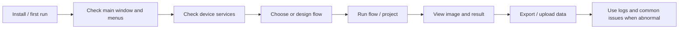

# User Operation Workflow Matrix

This page is for operators, test engineers, and field delivery staff. It locates documentation by operation goal. It does not explain source implementation and does not replace device-specific pages. It connects common daily tasks with the first page to read, the key action, the acceptance standard, and the first check when something fails.

## When to Read This Page First

| Scenario | What this page helps with |
| --- | --- |
| First machine setup | Confirm the order for installation, startup, main window, devices, workflows, and data |
| Field delivery | Validate project, devices, workflow, export, and external-system integration |
| Production operation | Find the entry for running tests, switching projects, viewing results, and exporting data |
| Troubleshooting | Decide whether a problem belongs to UI, devices, workflows, data, or external systems |

If the issue is already known to be a device, Flow node, or project source issue, continue to the corresponding device page, workflow page, or module reference.

## Find by Operation Goal

| Operation goal | Start here | Key action | Pass standard | First checks if failed |
| --- | --- | --- | --- | --- |
| Install and first start | [Installation](../00-getting-started/installation.md), [First Run](../00-getting-started/first-steps.md) | Install prerequisites, launch host, confirm config and log folders | Main window opens without startup-level errors | prerequisites, missing DLL, permissions, log viewer |
| Learn the main UI and components | [Main Window Tour](./interface/main-window.md), [UI Component User Handbook](./interface/ui-component-handbook.md) | Identify menus, status bar, tool windows, settings, logs, database, Socket, scheduler | Can find device, workflow, plugin, log, setting, data, and diagnostic entries by component | plugin/project menus, permissions, language config, status-bar providers |
| Edit configuration | [Property Editor](./interface/property-editor.md) | Open config object, edit fields, save and restart | Saved values persist after restart | config path, readonly field, type mismatch, permissions |
| Inspect field errors | [Log Viewer](./interface/log-viewer.md) | Filter by time and level | First meaningful error can be located | log level, log folder, wrong plugin/service log |
| Add or configure devices | [Adding and Configuring Devices](./devices/configuration.md), [Device Service Overview](./devices/overview.md) | Create device resource, fill communication/path parameters, save and refresh | Device appears and status refreshes | device type, driver, port/IP, enabled state |
| Use camera capture | [Camera Service](./devices/camera.md), [Camera Management](./devices/camera-management.md), [Camera Configuration](./devices/camera-configuration.md) | Connect camera, set exposure/gain, capture or preview | Image file is produced and can open | physical camera, driver, exposure, file server |
| Control motor/SMU/calibration | [Motor Service](./devices/motor.md), [SMU Service](./devices/smu.md), [Calibration Service](./devices/calibration.md) | Connect device and run one minimal action or reading | Status and reading are correct | connection, channel, timeout, service log |
| Design automation workflow | [Workflow Overview](./workflow/README.md), [Workflow Design](./workflow/design.md) | Add nodes, connect order, bind device/template, save flow | Flow saves and reopens | node parameters, device list, template name, save path |
| Execute/debug workflow | [Workflow Execution & Debugging](./workflow/execution.md) | Select flow, run, observe node state and result | Completed state or first failed node is clear | start node, device status, template binding, log |
| Open image and overlay | [Image Editor Overview](./image-editor/overview.md) | Open result image, inspect zoom/layers/ROI/POI/pseudo-color | Image, layers, and annotation display correctly | file path, image still writing, overlay coordinate, resources |
| Query database/history | [Data Management Overview](./data-management/README.md), [Database Operations](./data-management/database.md) | Open database/result window and filter by SN/time | Batch, flow, result, or project data can be found | MySQL/SQLite connection, filter, batch id, template name |
| Export/import data | [Data Export & Import](./data-management/export-import.md) | Select output folder, format, and range | CSV/Excel/PDF/image files exist and fields are correct | path permission, field mapping, project exporter |
| Run customer project package | [Project Guide](../00-projects/README.md), [Project Capability Matrix](../04-api-reference/projects/project-capability-matrix.md) | Open project window, enter SN, choose flow group/template, run | Project completes and generates customer result | project config, flow group, Recipe/Fix, Socket/MES |
| Use plugin capability | [Existing Plugin Capabilities](../04-api-reference/plugins/README.md), [Plugin Capability Matrix](../04-api-reference/plugins/plugin-capability-matrix.md) | Open plugin window, connect device, run plugin function | Plugin menu, window, result, and export work | manifest, plugin DLL, device dependency, admin permission |
| Test external system integration | [Project Capability Matrix](../04-api-reference/projects/project-capability-matrix.md), [SocketProtocol](../04-api-reference/ui-components/ColorVision.SocketProtocol.md) | Confirm protocol, port, event/command, SN, response fields | External system can trigger and receive result | port conflict, protocol mode, Socket/MES/Modbus config |
| Troubleshoot common issue | [Common Issues](./troubleshooting/common-issues.md) | Classify symptom and inspect logs/config | Next concrete check is clear | logs, config, device, workflow, project boundary |

## Daily Flow by Role

| Role | Daily actions | Most-used docs |
| --- | --- | --- |
| Operator | Open host, choose project/flow, enter SN, run, view PASS/FAIL, export result | This page, main window, project guide, data export |
| Test engineer | Configure devices, tune camera, tune workflow, confirm result fields, compare history | device docs, workflow design/execution, image editor, data management |
| Field delivery | Install, validate plugin/project package, integrate Socket/MES, train operators | installation, this page, project matrix, plugin matrix, common issues |
| Maintainer developer | Decide whether issue belongs to UI, Engine, plugin, or project package | this page, UI component handbook, module documentation map, Engine matrix, UI control catalog |

## Typical First-Machine Sequence

This sequence fits first delivery and field retest. Daily production often starts at device check and project/flow run.

## Device Readiness Checks

| Check | Pass standard |
| --- | --- |
| Device appears in list | Resource exists, type is correct, enabled state is correct |
| Communication parameters match | IP, port, serial, baud rate, device id, or file path match the site |
| Minimal device action works | Camera captures, motor moves, SMU reads, file server downloads |
| Flow can select the device | Flow node configurator sees the device and code/name is valid |
| Logs are clean | Connection, timeout, permission, and driver errors are resolved |

If a device works in the device page but not in a flow, inspect Flow node binding. If it fails in the device page too, inspect device connection and config first.

## Workflow Run Checks

| Check | Pass standard |
| --- | --- |
| Flow version is correct | Selected flow template matches field requirement |
| Start node runs | Valid start node and node state begins refreshing |
| Key nodes have input | Device, template, image, SN, or batch id is available |
| Failure is locatable | First failed node and log line correspond |
| Result can be reviewed | Result list, image, table, or exported file can be found |

When a flow fails, do not change many nodes at once. Find the first failed node, then inspect its device, template, or input data.

## Data Delivery Checks

| Delivery type | User cares about | Start checking |
| --- | --- | --- |
| CSV / Excel / PDF | File exists, field order, units, PASS/FAIL | data export page, project exporter, output path |
| SQLite / MySQL | Query by SN, time, batch | database page, connection config, batch id |
| Socket / MES / Modbus | External system receives status and data | project matrix, SocketProtocol, field protocol |
| Image / overlay | Image opens, points/boxes align | image editor, file server, result display chain |
| Summary / text | Yield, failure summary, failure item | project config, export folder, field mapping |

## Troubleshooting Routing

| Symptom | First classify | Next step |
| --- | --- | --- |
| Menu or window missing | plugin/project package loading | plugin matrix, project matrix, logs |
| Device offline | device service or physical hardware | device page, driver, port/IP, service log |
| Flow starts but never finishes | flow node or device command is stuck | workflow execution page and first unfinished node |
| Result exists but export is empty | project result mapping | project `Process`/Recipe/Fix/exporter |
| Image opens but no overlay | result display handler | image editor and Engine result-display chain |
| External system receives no result | protocol, port, or project window state | project matrix, SocketProtocol, logs |

## Chapter Boundaries

- Operation steps and field checks stay in the User Guide.
- Code structure, business chain, and extension points are in [Module Handbook](../04-api-reference/README.md).
- Project-package business logic is in [Project Guide](../00-projects/README.md).
- Plugin development is in [Plugin Development Manual](../02-developer-guide/plugin-development/README.md).
- UI DLL publishing is in [UI Components & DLL Publishing](../04-api-reference/ui-components/README.md).
