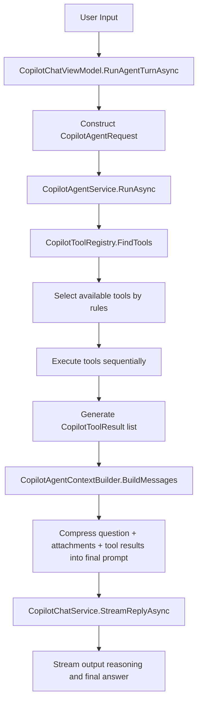

# Copilot Agent Current Status and ReAct Evolution Roadmap

This document describes the actual working mode of ColorVision's current Copilot Agent, its differences from ReAct-style Agents, and the next steps for evolving to support local file reading and cheaper context retrieval.

See also: Copilot Context Integration v1. That document focuses on how Copilot evolves from an independent chat module into a software context service, complementing the Agent/ReAct roadmap in this document.

## One-Sentence Conclusion

The current implementation is not a standard ReAct Agent, but a read-only Agent with "static candidate filtering + minimal model planner + at most several rounds of tool execution + local structured file read parameters + one-time context compression + one-time LLM call."

The latest round has already begun weakening the static "user verbatim keyword threshold" layer: the tool registry no longer hard-truncates planner-visible tools to the first 6, and SearchFiles, GrepText, GetRecentLog have been changed to runtime-capability-based visibility judgments, allowing the planner to decide on its own whether to do cheap retrieval first when search roots or recent logs exist. When planner parsing fails, it no longer blindly executes the first tool in the registry, but falls back conservatively based on the current mode and known context; if there are no suitable candidates, it directly ends the tool phase.

It already has a minimal tool layer and minimal planner-executor prototype, but still lacks the following capabilities:

- Continuing retrieval, modification, building, viewing errors, and iterating like a code agent
- Having the model output truly structured parameters for more diagnostic/environment tools, not just for ReadLocalFile, SearchFiles, GrepText, GetRecentLog, FetchUrl
- Supporting stronger multi-tool sequential planning, rather than the current per-round single-step minimal planner

## Current Actual Execution Pipeline

The current invocation pipeline is as follows:



Key code locations:

- Agent main flow: ColorVision/Copilot/Agent/CopilotAgentService.cs
- Tool registry: ColorVision/Copilot/Agent/CopilotToolRegistry.cs
- Tool interface: ColorVision/Copilot/Agent/ICopilotTool.cs
- Context compression: ColorVision/Copilot/Agent/CopilotAgentContextBuilder.cs
- UI integration: ColorVision/Copilot/CopilotChatViewModel.cs

## What the Current Tool Layer Actually Does

Currently, eleven tools are registered by default, including eight read-only tools and three controlled execution tools:

1. ExecuteMenu
   Function: Execute main menu commands by menu name or path, such as "Options," "VAM," "Check for Updates," and can also hit menu sub-items like themes and languages.

2. SetTheme
   Function: Switch application theme based on explicit user intent, such as light, dark, pink, cyan, or follow system.

3. SetLanguage
   Function: Switch interface language based on explicit user intent, reusing the existing restart confirmation flow.

4. SearchDocs
   Function: Query the published ColorVision online documentation index, returning the most relevant snippets by chapter, page, and within-page heading, suitable for software usage, menus, devices, plugins, developer guides, and architecture description questions.

5. FetchUrl
   Function: Prioritize fetching the URL specified by the planner via query; if the planner does not provide a URL, fall back to URLs in the user's text and fetch the webpage body.

6. SearchFiles
   Function: Find candidate files in the current solution search root by filename or path fragment.

7. GrepText
   Function: Find matching lines in the current solution's text files by keyword or identifier.

8. ListDirectory
   Function: List the contents of a local folder explicitly mentioned by the user in the current message, and produce subsequent readable file candidates.

9. ReadAttachedFile
   Function: Read "file attachments already mounted to the current session."

10. ReadLocalFile
    Function: Read local text files explicitly mentioned by the user in the current message.

11. GetRecentLog
    Function: Read recent logs and can filter results by the planner-provided query.

This shows that the current Agent still has clear controlled capability boundaries:

- It can read files already attached to the session.
- It can also read local text file paths explicitly appearing in the current user message.
- It can also do a round of lightweight filename/text retrieval based on the current solution root directory, active document directory, and attachment directory.
- It can now also access the published ColorVision online documentation index, answering software usage and development documentation questions with smaller context.
- It can now also execute a small number of controlled actions under explicit user intent, such as executing main menu commands, switching themes, and interface languages.
- It still cannot read arbitrary local files based on new paths generated by the model in conversation, nor can it execute arbitrary side-effect operations.
- It already has a minimal structured parameter layer, but the parameter surface is still relatively narrow.

## Core Differences from ReAct

The typical ReAct pattern is:

1. Model first thinks about what information is missing
2. Model proposes an action, e.g., Search, ReadFile, Grep, RunTests
3. System executes the action and returns Observation
4. Model decides the next step based on the Observation
5. After multiple rounds, gives the final answer

The current implementation still has gaps from the ideal complete coding agent, primarily in four areas:

### 1. Tools are Decided by Rules, Not the Model

Currently, CopilotToolRegistry.FindTools directly runs CanHandle based on the request.

This means:

- Whether a tool executes depends on local C# rules
- It's not the model dynamically deciding "which file to read next" in context

### 2. Tools Already Have Lightweight Structured Parameters but Parameter Surface is Still Limited

The current ICopilotTool signature is:

```csharp
bool CanHandle(CopilotAgentRequest request);
Task<CopilotToolResult> ExecuteAsync(CopilotAgentRequest request, CopilotAgentToolInput toolInput, CancellationToken cancellationToken);
```

This means tools receive not only the entire request but also a minimal structured input object, e.g.:

```json
{ "tool": "read_file", "path": "...", "startLine": 1, "endLine": 200 }
```

Currently, this layer of structured input mainly covers four fields: query, path, startLine, endLine, which is already sufficient for search and file reading, as well as small application control actions like SetTheme/SetLanguage; but it still doesn't have finer schemas, permission models, and parameter validation systems like complete function calling.

### 3. Service Layer Already Has Minimal Planner-Executor Loop but Not Yet a Complete Closed Loop

CopilotAgentService.RunAsync's pattern is:

- Each round, first let the planner choose one action from currently available tools
- Execute that tool and record the observation
- Continue to the next round within MaxToolRounds until planner finish or tool phase converges
- Finally, feed accumulated tool observations to the model for the final answer

So it's no longer a single-round "execute all tools first, then answer uniformly" pattern, but hasn't yet evolved to a complete coding loop with editing, testing, and verification.

### 4. No Cheap Retrieval Layer for Code Agents

The expected user workflow is:

```text
User task
-> Agent determines what context is needed
-> First use cheap tools to find candidate information
-> Compress candidate results
-> Send to LLM
-> Formulate modification plan
-> Edit
-> Test/Build
-> View errors
-> Continue retrieval/continue modification
```

The current implementation only covers a small portion:

```text
User task
-> Rules expose tools
-> Planner selects next step
-> Execute controlled tools
-> Compress results
-> Call LLM
-> End
```

It lacks cheaper candidate context tools like grep, symbol search, AST search, embedding search, git history, diagnostics, tests, and also lacks modification and verification loops.

## Why It's Still Not a Complete Local File Agent

The current version can already handle explicit path inputs like "Please read C:\\Users\\...\\remote_control.py," but still has clear boundaries:

1. The model still cannot break out of the allowlist to read arbitrary new paths
2. The request already has a minimal unified tool parameter object, but the interface layer and permission policy objects have not yet been completely separated
3. Structured parameters currently cover path for ReadLocalFile and ListDirectory, and query for SearchFiles, GrepText, GetRecentLog, SearchDocs, FetchUrl; among these, SearchFiles, GrepText, GetRecentLog visibility has also begun relaxing from "user verbatim keywords" to "capability-first," SearchDocs uses the published stable documentation index, and FetchUrl, while already supporting structured query execution, still primarily relies on request-level URL extraction for tool visibility
4. Although the service layer can already do a minimal planner-executor loop, it's not yet a stronger multi-tool planning closed loop
5. Current file reading supports precise reading by line range but still lacks finer fragment positioning, symbol-level reading, and AST-level context

So it has taken the first step, but is still not a true code retrieval Agent.

## Recommended Evolution Directions

It is not recommended to jump directly to "complete coding agent." A more stable route is to evolve in three layers.

### Phase 1: First Support Explicit Path Local File Reading

Goal: When the user explicitly provides a path, the Agent can safely read that file.

This step does not require complete ReAct, just expanding the current minimal multi-round Agent.

Current status: A minimal version has been implemented, capable of extracting explicit local paths from the current user message and diverting explicit files and explicit folders separately; SearchFiles and GrepText based on solution search root, and ListDirectory for local folders have also been added, supporting minimal two-round chained execution like `ListDirectory(path) -> ReadLocalFile(batch-all)` and `SearchFiles/GrepText -> ReadLocalFile(path, startLine, endLine)`. For explicit directory analysis scenarios, the first ReadLocalFile will prioritize batch reading all candidate files in the current directory, rather than consuming rounds file by file.

#### Suggested New Capabilities

1. Add runtime context to CopilotAgentRequest

Fields already integrated:

- SearchRootPaths
- ActiveDocumentPath

Fields still recommended to add:

- AllowedReadRoots
- AllowExternalRead
- MaxToolCalls

2. Add ReadLocalFile Tool

Suggested input parameters:

- path
- startLine
- endLine
- reason

Suggested return content:

- Actually resolved path
- File summary
- Read fragment content
- Truncation information
- Error information

3. First do explicit path triggering, don't rush model planning

The cheapest first version can be done like this:

- If the user message contains text that looks like a file path
- And the path is within the allowed range
- Then automatically call ReadLocalFile

This step is sufficient to cover the scenarios in the screenshots.

#### Security Boundaries

This step must include a file access policy, otherwise it's easy to overstep and read:

- Default to only allowing paths within the workspace
- Paths outside the workspace require explicit user authorization
- Only allow whitelisted text extensions, e.g., .cs .xaml .py .json .md .txt .log
- Single read limits maximum characters and lines
- Binary files directly rejected
- Display "which path was read, how many lines were read" in the execution process panel

### Phase 2: Complete the "Cheap Retrieval Tool Layer"

Goal: Let the Agent collect candidate context on its own before calling the LLM, rather than relying only on attachments and URLs.

Current status: Phase 2 has completed the minimal landing version, with SearchFiles, GrepText, GetRecentLog, and SearchDocs integrated into the default tool table; SearchDocs queries ColorVision online documentation through the published docs-search-index.json, no longer requiring the user to first provide a URL. The tool registry has also removed the first-6 hard truncation, and SearchFiles, GrepText, GetRecentLog are now exposed to the planner by runtime capability first, but haven't been further refined to glob/regex/symbol level. The execution layer has also added structured query, duplicate detection, and execution summaries for FetchUrl, no longer treating it only as a "special case tool for URLs attached to user sentences."

Additional read-only tools suggested for enhancement:

1. SearchFiles
   Function: Further support glob, directory constraints, and result sorting.

2. GrepText
   Function: Further support regex, context lines, and more stable query extraction.

3. ReadLocalFile
   Function: Read file fragments by path and line numbers.

4. ReadSymbolSummary
   Function: Find definition-nearby fragments by class name, method name, property name.

5. GetDiagnostics
   Function: Collect recent build/diagnostic error summaries.

6. GetGitDiff / GetGitHistory
   Function: Understand current changes and historical semantics.

After this layer is complete, it will be closer to the user's expected workflow:

```text
Question
-> Cheap retrieval
-> Compress candidate results
-> Send to LLM
```

### Phase 3: Then Evolve to True ReAct / Planner-Executor Closed Loop

Goal: Let the model decide "what to do next" first, rather than local rules selecting all tools at once.

Recommended split into two models:

1. Planner
   Only responsible for outputting the next step action, does not directly answer the user.

2. Answerer
   After sufficient tool observations, responsible for generating the final answer.

Suggested loop:

```text
for step in 1..N:
  planner -> output structured action
  executor -> validate and execute action
  observation -> append to trace
  if action == final_answer then end
```

Structured actions should at least support:

- search_files
- grep_text
- read_file
- read_log
- fetch_url
- final_answer

This way, after reading a file, the model can continue saying:

- Still need to grep a certain symbol
- Still need to open another file
- Still need to view the latest build errors

This is the key to truly approaching ReAct.

## Suggested Code Modification Points

### 1. CopilotAgentModels.cs

Current status: Minimal trace models like `CopilotToolCall`, `CopilotToolObservation`, `CopilotAgentStepRecord` have been added, and the service layer also records each round of tool execution as a step record; but there's still no independent runtime context, tool schema, and true `tool call` execution contract.

Suggested additions:

- CopilotAgentRuntimeContext
- CopilotToolArgument

Goal: Transform tool invocation from "entire request triggered" to "specified tool + parameter invocation."

### 2. ICopilotTool.cs

Current status: The runtime pipeline has introduced a minimal unified tool parameter object to carry query/path/startLine/endLine; existing structured tools already directly consume this object, but `ICopilotTool.ExecuteAsync(request, ...)` still depends on the request aggregate object, and compatibility accessors are still retained on the request model.

Suggested evolution to:

```csharp
public interface ICopilotTool
{
    string Name { get; }
    string Description { get; }
    ToolSchema Schema { get; }
    Task<CopilotToolResult> ExecuteAsync(CopilotToolCall call, CopilotAgentRuntimeContext context, CancellationToken cancellationToken);
}
```

This way, ReadLocalFile can read the model-specified path, startLine, endLine.

### 3. CopilotToolRegistry.cs

Current issue: Only has FindTools, no ResolveTool(name).

Suggested additions:

- Resolve tool by name
- Return tool schema list to planner prompt
- Retain a layer of static heuristic candidate filtering to prevent planner from arbitrarily calling tools

### 4. CopilotAgentService.cs

Current status: Although there's already a minimal model-driven loop and step records are recorded with observations fed into the final answer, it's not yet a complete planner-executor.

Suggested split into three segments:

1. BuildCandidateContextAsync
   Run cheap search and heuristic tools

2. PlanNextActionAsync
   Let the planner generate the next structured action

3. ExecuteLoopAsync
   Execute action and append observation back to context

The first version can support at most 3 to 5 steps, keeping it simple first.

### 5. CopilotAgentContextBuilder.cs

Current status: It has already split out three entry points: `BuildPlannerMessages`, `BuildAnswerMessages`, `BuildObservationSummary`, no longer just responsible for "final answer prompt"; but planner and answer still share the same observation serialization strategy, without finer token budgets and summary levels.

Suggested split into:

- BuildPlannerMessages
- BuildAnswerMessages
- BuildObservationSummary

This allows controlling tokens and avoids stuffing the entire trace verbatim into the final answer model.

### 6. CopilotChatViewModel.cs

Current issue: Only UserText, History, Attachments, Mode are passed to the Agent.

Suggested additions:

- Current workspace root
- Current active file
- Selected text
- User explicitly authorized readable directories
- Whether user allows reading files outside the workspace

This part is the most needed entry point for local file reading.

## Most Pragmatic Next Step for "Local File Reading"

If the goal is to solve the problems in the screenshots as soon as possible, it is recommended not to directly do complete ReAct, but to advance in the following order:

1. Upgrade ReadLocalFile from "entire file reading" to "read fragments by path + line range"
2. Add more stable filename/glob extraction and sorting to SearchFiles
3. Add regex, context lines, and stricter scan budgets to GrepText
4. Only allow workspace-internal paths to be read directly by default
5. Workspace-external paths trigger a confirmation or require user authorization first
6. Display more structured retrieval summaries in the execution process panel
7. Finally, upgrade the minimal planner to a complete Planner-Executor loop supporting structured parameters and multi-tool decisions

This yields the greatest benefit with the lowest risk.

## Recommended Next Version Goal

It is recommended to define the next version goal as:

> Enable the Agent, in read-only mode, to safely read workspace-internal explicit path files and automatically execute 1 to 2 cheap retrieval actions before answering.

This is a clear, verifiable, risk-controllable intermediate milestone.

After completing this milestone, continuing toward complete ReAct will be more stable.

## Reference Implementation Sequence

```text
Phase 1
  Add CopilotReadLocalFileTool
  Add runtime context and read policy
  Support explicit path detection

Phase 2
  Add SearchFiles / GrepText
  Add candidate context compression

Phase 3
  Add planner prompt -> structured tool call
  Add executor loop

Phase 4
  Add diagnostics / build / test read-only tools
  Decide whether to move to edit-capable coding agent
```

## Summary

The current Agent already has a correct starting point:

- Has independent tool abstraction
- Has tool registry
- Has execution process panel
- Has tool result compression layer

But it's still three key layers away from ReAct:

1. Structured tool calls
2. Stronger multi-step planner-executor closed loop
3. Cheap retrieval toolset for code scenarios

If the goal is just to continue approaching ReAct as quickly as possible, the best next step is not to directly go for a complete coding agent, but based on the already-landed explicit tool-args interface, continue adding more diagnostic tools, improve planner-executor closed-loop quality, and gradually introduce cheaper but more code-structure-aware retrieval capabilities.