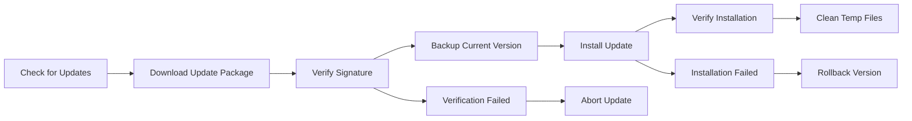

# Update System Documentation

Auto update system documentation, including update mechanism, version management, and fault recovery.

## Table of Contents

- [Auto Update Flow](auto-update-flow.md) - Auto update flow and mechanism
- [Version Management](version-management.md) - Version control and release strategy
- [Update Rollback](update-rollback.md) - Update failure rollback mechanism
- [Changelog Window](changelog-window.md) - Changelog window detailed documentation

## Overview

ColorVision's auto update system ensures users can get the latest features and security fixes in a timely manner:

### Update Flow

### Core Features

- **Version Check**: Periodically check remote update server
- **Incremental Update**: Only download changed files, reducing bandwidth usage
- **Signature Verification**: Ensure update package integrity and security
- **Auto Rollback**: Automatically restore to previous version on update failure
- **Silent Update**: Background auto update without interrupting user operations

### Update Strategy

- **Stable**: Fully tested official release
- **Beta**: Preview version with latest features
- **Security Update**: Emergency security patches, mandatory update

## Related Components

- `ColorVisionSetup/` - Installer and updater program
- `Scripts/update/` - Update-related scripts

## Related Documents

- [Deployment Documentation](../deployment/README.md)
- [Security and Access Control](../security/README.md)

---

*Last updated: 2024-09-28*