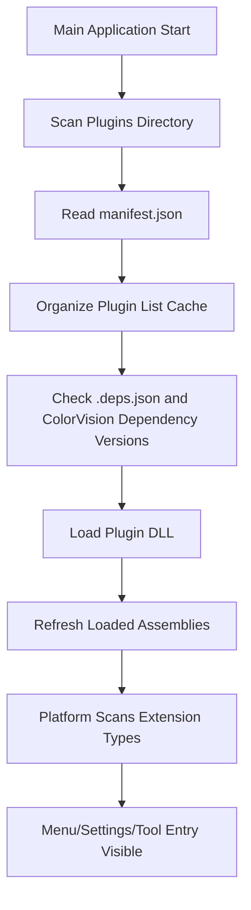

# Plugin Lifecycle

---

**Metadata:**
- Title: Plugin Lifecycle - Discovery, Loading, and Management
- Status: draft
- Updated: 2024-09-28
- Author: ColorVision Development Team

---

## Introduction

This document describes the complete lifecycle of the ColorVision plugin system in detail, including plugin discovery, loading, initialization, runtime management, and uninstallation process. It also covers failure isolation mechanisms and version compatibility strategies.

## Table of Contents
# Plugin Lifecycle

This page describes the plugin runtime path that can be directly confirmed from the code in the current repository, no longer using the old "standalone plugin host + async lifecycle interface" narrative.

## Rough Process from Startup to Availability

## 1. Discovering Plugins

`PluginLoader.LoadPlugins()` scans `Plugins/` under the runtime directory. Each subdirectory is treated as a candidate plugin directory.

The platform prioritizes finding:

- `manifest.json`
- Plugin main DLL
- Optional `.deps.json`

If `manifest.json` exists in the directory, the platform reads plugin ID, name, description, DLL path, and other information, and syncs this info to the internal configuration cache.

If the directory has no manifest, the platform will still attempt to load using the "directory-name-matching DLL" approach, but this is only a compatibility behavior and not recommended as a formal delivery method.

## 2. Cleaning and Syncing Plugin List

At the start of scanning, the platform first removes plugin IDs from the cache that are already recorded in configuration but no longer exist on disk. In other words, the existence status of the plugin directory reversely affects the platform's known plugin list.

This is also why deleting the plugin directory causes the plugin to disappear from the management list on the next startup.

## 3. Validating Dependencies

If a plugin directory contains a `.deps.json`, the platform reads dependency relationships and focuses on checking `ColorVision.*` related assemblies:

- Whether the target DLL exists in the main application directory
- Whether the actual version meets the minimum version declared by the plugin

If the version does not meet requirements, the plugin stops loading and provides log or prompt information.

## 4. Loading Assemblies

Once manifest and dependency checks pass, the platform:

1. Calculates the actual path of the plugin main DLL.
2. Uses `Assembly.LoadFrom(...)` to load the assembly.
3. Records assembly name, version, path, build time, and other information.
4. Refreshes the assembly list after all plugins are loaded.

In the current code path, plugin loading means "adding the assembly to the main process and participating in subsequent type scanning," rather than creating a separate host or recyclable load context for each plugin.

## 5. Extension Points Take Effect

After the DLL is loaded, the platform continues scanning extension types on the loaded assemblies. Common results include:

- Menu item providers being discovered
- Settings page or configuration item providers being discovered
- Status bar, tool windows, or other extension entries being discovered

Therefore, whether a plugin "appears available" often depends not just on whether it is loaded, but on whether the assembly implements the provider interfaces expected by the platform.

## 6. Update and Management

Once plugin information is recorded, the platform can manage and provide update notifications based on the cached plugin information. The update logic and plugin marketplace integration reside in UI-layer plugin-related modules, but they are built on top of the previous scanning and loading results.

## What to Check First When Problems Occur

### Plugin Directory Exists but Not Recognized at All

- Check whether `manifest.json` exists and is parseable
- Check whether `dllpath` is correct
- Check whether the DLL was actually copied to the plugin directory

### Plugin Recognized but Loading Failed

- Check the version requirements for `ColorVision.*` in `.deps.json`
- Check whether the required dependency DLLs exist in the main application directory
- View logs for dependency version insufficiency or DLL missing prompts

### Plugin Loaded but Menu or Functionality Not Appearing

- Check whether the corresponding provider interface is implemented
- Check whether the entry type meets basic requirements such as non-abstract, non-open generic, public parameterless constructor

## Notes

- This document only describes the loading path directly visible in the repository.
- Content from old documentation about `PluginContext`, permission systems, isolated hosts, unloadable contexts, etc., cannot be taken as default basis for the current main path implementation.