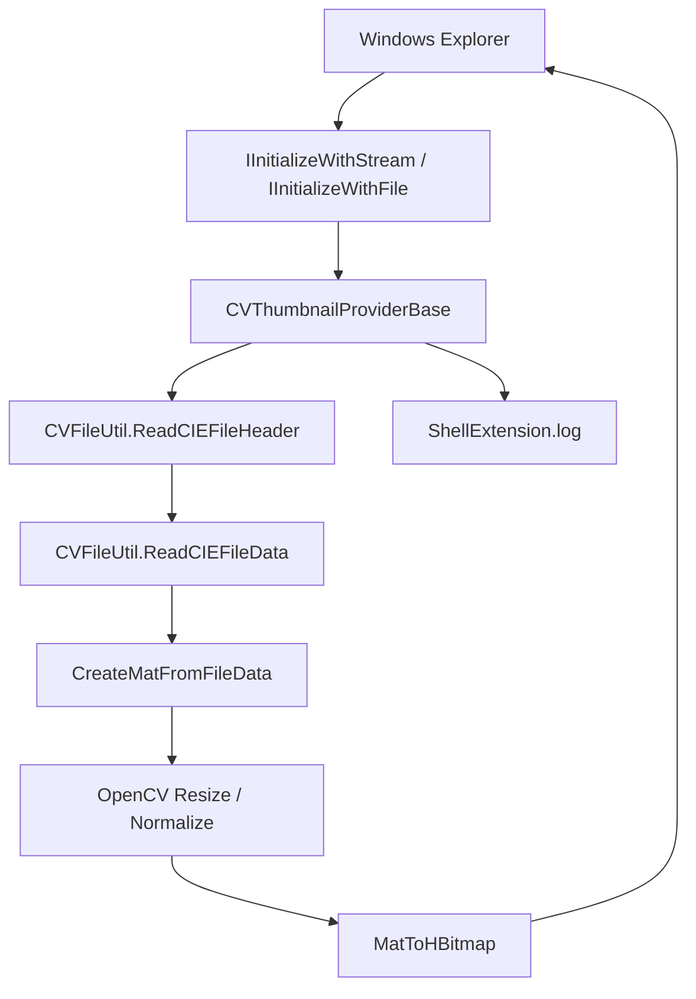

# ColorVision.ShellExtension

`ColorVision.ShellExtension` is a Windows Explorer thumbnail extension. It is not part of the main Engine execution chain. Its job is to let field users preview `.cvraw` and `.cvcie` files directly in folders.

## Current Role

| Item | Current state |
| --- | --- |
| Source | `Engine/ColorVision.ShellExtension/` |
| Project | `ColorVision.ShellExtension.csproj` |
| Platform | x64 |
| Build flags | `EnableComHosting=true`, `EnableDynamicLoading=true`, `AllowUnsafeBlocks=true` |
| Key output | `ColorVision.ShellExtension.comhost.dll`, `ColorVision.ShellExtension.dll`, `ColorVision.FileIO.dll`, OpenCvSharp runtime |
| File types | `.cvraw`, `.cvcie` |
| Host | Windows Explorer |
| Log | `%APPDATA%\ColorVision\Log\ShellExtension.log` |

The extension depends on [ColorVision.FileIO](./ColorVision.FileIO.md) to read ColorVision file headers and pixel data, then uses OpenCvSharp to return an `HBITMAP` to Explorer.

## Call Chain



Start with `CVThumbnailProviderBase.cs` during handoff. It handles Explorer initialization, file reading, exception protection, OpenCV resize, `HBITMAP` creation, and logging.

## Key Files

| File | Purpose | Handoff focus |
| --- | --- | --- |
| `ColorVision.ShellExtension.csproj` | COM hosting, dynamic loading, x64, dependencies | Whether `.comhost.dll` and OpenCvSharp runtime are produced |
| `CVThumbnailProviderBase.cs` | Common thumbnail provider implementing `IShellThumbnailProvider`, `IInitializeWithStream`, and `IInitializeWithFile` | Explorer initialization, HRESULT return, no thrown exceptions |
| `CVRawShellThumbnailProvider.cs` | `.cvraw` provider, CLSID `{7B5E2A3C-8F1D-4E6A-B9C2-1D3E5F7A8B9C}` | RAW/SRC data to OpenCV Mat |
| `CVCieShellThumbnailProvider.cs` | `.cvcie` provider, CLSID `{8C6F3B4D-9E2A-5F7B-C3D4-2E4F6A8B9C0D}` | Three-channel XYZ uses the first channel for thumbnails |
| `Interop/ShellInterfaces.cs` | Windows Shell COM interfaces | GUIDs and `PreserveSig` |
| `ShellLog.cs` | Explorer-process log file | Logging must never fail the shell extension |
| `Register.ps1` | Registers the COM server and file extension handlers | Requires admin, edits HKCR/HKLM, restarts Explorer, clears thumbnail cache |
| `Unregister.ps1` | Removes handlers and COM server registration | First step for rollback |

## File Type Behavior

`CVRawShellThumbnailProvider` treats `CVType.Raw` and `CVType.Src` as direct pixel data. Non-8-bit data is normalized to 0-255 before display.

`CVCieShellThumbnailProvider` handles `CVType.CIE`. For three-channel CIE/XYZ data, the current implementation extracts the first channel for thumbnail display. The thumbnail is only a quick file preview; it is not a measurement or color-analysis result.

## Register And Unregister

Build:

```powershell
dotnet build Engine/ColorVision.ShellExtension/ColorVision.ShellExtension.csproj -c Release -p:Platform=x64
```

Register from an administrator PowerShell:

```powershell
Engine/ColorVision.ShellExtension/Register.ps1
```

Unregister:

```powershell
Engine/ColorVision.ShellExtension/Unregister.ps1
```

`Register.ps1` registers `ColorVision.ShellExtension.comhost.dll`, binds `.cvraw` and `.cvcie` under the Windows thumbnail provider IID, optionally writes the approved shell extension list, restarts Explorer, and clears thumbnail/icon cache.

## Current Script Risk

In the current `Register.ps1`, `$handlerClsid` is `{7B5E2A3C-8F1D-4E6A-B9C2-1D3E5F7A8B9C}`, the CLSID of `CVRawShellThumbnailProvider`. The script binds both `.cvraw` and `.cvcie` to that CLSID.

During handoff, confirm whether `.cvcie` should intentionally share that handler. If it should use `CVCieShellThumbnailProvider`, bind `.cvcie` to `{8C6F3B4D-9E2A-5F7B-C3D4-2E4F6A8B9C0D}` and retest both file types.

## Handoff Acceptance

| Check | Action | Pass condition |
| --- | --- | --- |
| Build output | Build `ColorVision.ShellExtension.csproj` as Release x64 | `.dll`, `.comhost.dll`, `.deps.json`, `.runtimeconfig.json` exist under `bin/x64/Release/net10.0-windows/` |
| Dependencies | Inspect the output folder and `runtimes/win-x64/native` | `ColorVision.FileIO.dll`, OpenCvSharp assemblies, and native runtime files are present |
| Registration | Run `Register.ps1` from an administrator PowerShell | `regsvr32` succeeds and the Explorer restart has been announced to the field user |
| Registry | Inspect `.cvraw` / `.cvcie` shellex thumbnail provider keys | Extensions point to the expected CLSIDs; if both share `CVRawShellThumbnailProvider`, record that explicitly |
| `.cvraw` thumbnail | Open a folder containing a known readable `.cvraw` sample | Thumbnail appears and the log records `CVRawProvider` initialization and `GetThumbnail` |
| `.cvcie` thumbnail | Open a folder containing a known readable `.cvcie` sample | Thumbnail appears and the log explains whether `CVCieProvider` or the shared RAW handler was used |
| Log | Inspect `%APPDATA%\ColorVision\Log\ShellExtension.log` | Initialization, header/data reading, resize, or HRESULT errors are recorded; logging failure does not break Explorer |
| Rollback | Run `Unregister.ps1` and reopen Explorer | Extension bindings are removed, cache is cleared, and Explorer stays stable |

## First Checks

| Symptom | Check first |
| --- | --- |
| No thumbnails | `ColorVision.ShellExtension.comhost.dll` registration, extension shellex keys, Explorer restart, cache clearing |
| Only `.cvraw` works | `.cvcie` CLSID binding and whether `CVCieShellThumbnailProvider` is called |
| Both file types use the RAW provider | Whether `Register.ps1` still uses one `$handlerClsid`, and whether the field handoff accepts sharing `CVRawShellThumbnailProvider` |
| No log | Whether Explorer loaded the extension, whether `%APPDATA%\ColorVision\Log` is writable, and whether logging failures are swallowed |
| Header read fails | Whether the file matches the current [ColorVision.FileIO](./ColorVision.FileIO.md) format support and whether the sample is valid |
| Native DLL missing | OpenCvSharp runtime, `runtimes/win-x64/native`, and x64 platform alignment |
| Explorer unstable | Unregister first, clear cache, retest with small files, and confirm exceptions cannot escape `GetThumbnail` |
| Registration fails | Administrator rights, Debug/Release comhost path selection, and x64 `regsvr32` alignment |

## Out Of Scope

This module does not own main-app image viewing, ROI/POI overlays, Flow execution, templates, devices, MQTT, or project package output. For main-app result issues, start with [Result Display and Project Handoff](./result-handoff-chain.md) or [ColorVision.ImageEditor](../ui-components/ColorVision.ImageEditor.md).
