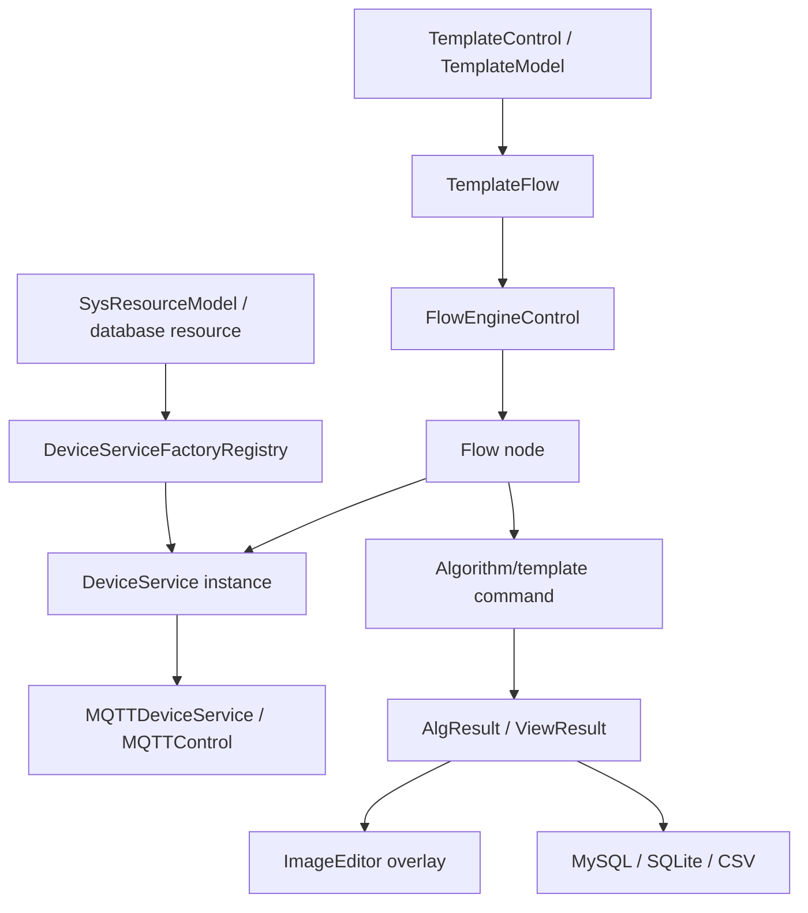

# Engine Components & Handoff

`Engine/` is the business runtime core of ColorVision. It is not only an algorithm library and not only a device driver layer. It connects device services, template parameters, flow execution, MQTT commands, database results, and image overlays into executable inspection workflows.

## Read This First

- [Current Engine Documentation Coverage](./current-engine-coverage.md): verify the mapping between `Engine/` projects, key business directories, and handoff pages.
- [Engine Business Flow Matrix](./business-flow-matrix.md): map business capability to code entry, configuration source, checks, and ownership boundaries.
- [Engine Business Scenario Playbook](./business-scenario-playbook.md): executable steps for device, template, Flow, result, project-package, and external-system changes.
- [Engine Business Handoff](./business-handoff.md): Understand the current implementation by business chain.
- [Engine Change Impact And Acceptance Checklist](./engine-change-impact-checklist.md): collect handoff evidence after device, template, Flow, result, or project-field changes.
- [Engine Runtime Object Map](./runtime-object-map.md): map class names and runtime objects to business chains.
- [Engine Device Service Chain](./device-service-chain.md): from database resources to `DeviceService` and display pages.
- [Engine Templates And Flow Chain](./template-flow-chain.md): template loading, Flow saving, node configurators, and completion events.
- [Flow Conversion And Calibration Nodes](./flow-conversion-calibration-nodes.md): data conversion, image conversion, calibration, calibration ROI, and legacy color-correction node handoff.
- [Engine Result Display And Project Handoff](./result-handoff-chain.md): algorithm results, overlays, and project-package outputs.
- [ColorVision.Engine](./ColorVision.Engine.md): Main engine module entry.
- [FlowEngineLib](./FlowEngineLib.md): Flow node editing and execution control.
- [cvColorVision](./cvColorVision.md): Native vision and OpenCV capability wrappers.
- [ColorVision.FileIO](./ColorVision.FileIO.md): Image and custom file format I/O.
- [ST.Library.UI](./ST.Library.UI.md): UI foundation used by the flow node editor.
- [ColorVision.ShellExtension](./ColorVision.ShellExtension.md): Explorer thumbnails for `.cvraw` / `.cvcie` files and external shell integration.

## Engine Module Map

| Module | Source directory | Main responsibility | Handoff focus |
| --- | --- | --- | --- |
| `ColorVision.Engine` | `Engine/ColorVision.Engine/` | Device services, templates, flow integration, MQTT, batches, results | Main business chain and extension points |
| `FlowEngineLib` | `Engine/FlowEngineLib/` | Flow nodes, start/end nodes, execution control | Node lifecycle and completion events |
| `cvColorVision` | `Engine/cvColorVision/` | OpenCV/native wrappers and low-level vision processing | Native DLL and algorithm boundary |
| `ColorVision.FileIO` | `Engine/ColorVision.FileIO/` | CVRAW/CVCIE and related file I/O | Import/export and format handling |
| `ST.Library.UI` | `Engine/ST.Library.UI/` | Node editor UI controls | Visual node editing and property editing |
| `ColorVision.ShellExtension` | `Engine/ColorVision.ShellExtension/` | Windows shell thumbnail extension | External integration, not the main business path |

If you are taking over a business issue, start from [Engine Business Flow Matrix](./business-flow-matrix.md). If you already know class names such as `ServiceManager`, `TemplateControl`, `FlowControl`, `NodeConfiguratorRegistry`, or `ViewResultAlg`, go directly to [Engine Runtime Object Map](./runtime-object-map.md).

If an Engine change is complete or ready for handoff, use [Engine Change Impact And Acceptance Checklist](./engine-change-impact-checklist.md) to collect SN, batch, template, result id, exported file, and documentation evidence.

## Main Business Chain

Handoff work should start from this chain before diving into every template folder.

## Key Directories

| Directory | Meaning |
| --- | --- |
| `Services/` | Service manager, device service base types, physical camera, terminal, cache, RC service |
| `Services/Devices/` | Camera, Calibration, Algorithm, FileServer, FlowDevice, Motor, PG, SMU, Spectrum, and related devices |
| `Templates/` | Template management, Flow templates, POI/ROI, ARVR, JSON algorithm templates |
| `MQTT/` | MQTT configuration, connection window, control objects |
| `Batch/`, `Dao/` | Batches, flow records, result data access |
| `Messages/` | MQTT and business message models |
| `Archive/` | Archived result lookup |
| `Reports/` | Report generation |
| `ToolPlugins/` | Built-in tools such as ImageJ and CVRaw-to-CSV |

## Device Service Creation

Detailed chain: [Engine Device Service Chain](./device-service-chain.md).

`ServiceManager` owns the active device service collection. `DeviceServiceFactoryRegistry` maps resource types to concrete service instances. The default registered device types include Camera, PG, Spectrum, SMU, Sensor, FileServer, Algorithm, CfwPort, Calibration, Motor, ThirdPartyAlgorithms, and FlowDevice.

When adding a device, register it through this factory path. Otherwise the resource may exist in the database but fail to produce a stable runtime `DeviceService`.

## Templates and Flow

Detailed chain: [Engine Templates And Flow Chain](./template-flow-chain.md).

- Template parameters are carried by `TemplateModel<T>`.
- Template entries usually implement `ITemplate<T>` or `ITemplateJson<T>`.
- `TemplateControl` initializes and loads template types.
- `TemplateFlow` stores visual flow templates.
- `FlowEngineLib` executes nodes.
- Node configurators under `Templates/Flow/NodeConfigurator/` bind nodes to devices, templates, and parameters.

Project packages normally select templates, run flows, and map results. They should not reimplement the FlowEngine core.

## Results Back to UI and Data

Detailed chain: [Engine Result Display And Project Handoff](./result-handoff-chain.md).

Algorithm results usually pass through three layers:

1. Engine reads or receives algorithm results and builds ViewResult/DAO models.
2. ImageEditor or AlgorithmView renders ROI, POI, grid, curve, and other overlays.
3. Project packages map the results into `ObjectiveTestResult`, CSV, PDF, MES, or Socket responses.

If the algorithm finished but the image has no overlay, first inspect the ViewResult handler and ImageEditor overlay path. If the UI shows data but the project CSV is empty, inspect project-level Process/Recipe/Fix mapping.

## Continue Reading

- [Current Engine Documentation Coverage](./current-engine-coverage.md)
- [Engine Business Flow Matrix](./business-flow-matrix.md)
- [Engine Business Scenario Playbook](./business-scenario-playbook.md)
- [Engine Business Handoff](./business-handoff.md)
- [Engine Change Impact And Acceptance Checklist](./engine-change-impact-checklist.md)
- [Engine Runtime Object Map](./runtime-object-map.md)
- [Engine Device Service Chain](./device-service-chain.md)
- [Engine Templates And Flow Chain](./template-flow-chain.md)
- [Flow Conversion And Calibration Nodes](./flow-conversion-calibration-nodes.md)
- [Engine Result Display And Project Handoff](./result-handoff-chain.md)
- [ColorVision.ShellExtension](./ColorVision.ShellExtension.md)
- [FlowEngineLib Architecture](../../03-architecture/components/engine/flow-engine.md)
- [Templates Architecture](../../03-architecture/components/templates/design.md)
- [Project Packages](../projects/README.md)
